# 3D Face Reconstruction with the Geometric Guidance of Facial Part Segmentation

Zidu Wang1,2, Xiangyu Zhu1,2\*, Tianshuo Zhang1,2, Baiqin Wang1,2, Zhen Lei1,2,3 1State Key Laboratory of Multimodal Artificial Intelligence Systems, Institute of Automation, Chinese Academy of Sciences 2School of Artificial Intelligence, University of Chinese Academy of Sciences Centre for Artificial Intelligence and Robotics, Hong Kong Institute of Science & Innovation, Chinese Academy of Sciences

{wangzidu2022, wangbaiqin2024}@ia.ac.cn, {xiangyu.zhu, tianshuo.zhang, zlei}@nlpr.ia.ac.cn

## Abstract

3D Morphable Models (3DMMs) provide promising 3D face reconstructions in various applications. However, existing methods struggle to reconstruct faces with extreme expressions due to deficiencies in supervisory signals, such as sparse or inaccurate landmarks. Segmentation information contains effective geometric contexts for face reconstruction. Certain attempts intuitively depend on differentiable renderers to compare the rendered silhouettes of reconstruction with segmentation, which is prone to issues like local optima and gradient instability. In this paper, we fully utilize the facial part segmentation geometry by introducing Part Re-projection Distance Loss (PRDL). Specifically, PRDL transformsfacial part segmentation into 2D points and re-projects the reconstruction onto the image plane. Subsequently, by introducing grid anchors and computing different statistical distancesfrom these anchors to the point sets, PRDL establishes geometry descriptors to optimize the distribution of the point sets for face reconstruction. PRDL exhibits a clear gradient compared to the renderer-based methods and presents state-of-theart reconstruction performance in extensive quantitative and qualitative experiments. Our project is available at https://github.com/wang-zidu/3DDFA-V3.

## 1. Introduction

Reconstructing 3D faces from 2D images is an essential task in computer vision and graphics, finding diverse applications in fields such as Virtual Reality (VR), Augmented Reality (AR), and Computer-generated Imagery (CGI), etc. In applications like VR makeup and AR emoji, 3DMMs [5] are commonly employed for precise facial feature positioning and capturing expressions. One of the most critical concerns is ensuring that the reconstructed facial components, including the eyes, eyebrows, lips, etc., seamlessly align with their corresponding regions in the input image with pixel-level accuracy, particularly when dealing with extreme facial expressions, as shown in Fig. 1.

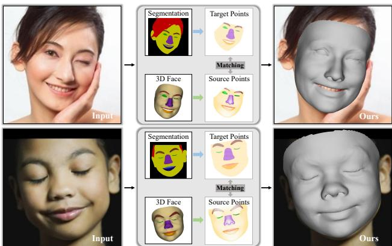  
Figure 1. We introduce Part Re-projection Distance Loss (PRDL) for 3D face reconstruction, leveraging the geometric guidance provided by facial part segmentation. PRDL enhances the alignment of reconstructed facial features with the original image and excels in capturing extreme expressions.

Although current methods [11, 14, 17, 19, 25] have made notable strides in face reconstruction, some issues persist. On the one hand, existing works often rely on landmarks [17, 60] and photometric-texture [12, 45] to guide face reconstruction. In the case of extreme facial expressions, landmarks are sparse or inaccurate and the gradient from the texture loss cannot directly constrain the shape [59], posing a challenge for existing methods to achieve precise alignment of facial features in 3D face reconstruction, as depicted in Fig. 2(a). On the other hand, many methods primarily adopt 3D errors as a quality metric, overlooking the precise alignment of facial parts. As shown in Fig. 2(b), when evaluating the REALY [7] benchmark in the eye region, comparing the results of 3DDFA-v2 [17] and DECA [14], a lower 3D region error may not lead to better 2D region alignment. We believe in the potential for a more comprehensive utilization of the geometry information inherent in each facial part segmentation to guide 3D face reconstruction, addressing the issues mentioned above.

Facial part segmentation [24, 31, 32, 34] has been well developed, offering precise geometry for each facial feature with pixel-level accuracy. Compared with commonly used landmarks, part segmentation provides denser labels covering the whole image. Compared with photometric texture, part segmentation is less susceptible to lighting or shadow interference. Although facial part segmentation occasionally appears in the process of 3D face reconstruction, it is not fully utilized. For instance, it only serves to enhance the reconstruction quality of specific regions [25, 48], or to distinguish the overall texture location for photometrictexture-loss [26], without delving into the specifics of facial parts. Attempts [33, 56] to fit 3D parts with the guidance of segmentation information rely on differentiable renderers [15, 42, 46] to generate the silhouettes of the predicted 3D facial regions and optimize the difference between the rendered silhouettes and the 2D segmentation through Intersection over Union (IoU) loss. However, these renderers fail to provide sufficient and stable geometric signals for face reconstruction due to local optima, rendering error propagation, and gradient instability [22].

This paper leverages the precise and rich geometric information in facial part silhouettes to guide face reconstruction, thereby improving the alignment of reconstructed facial features with the original image and excelling in reconstructing extreme facial expressions. Fig.1 provides an overview of the proposed Part Re-projection Distance Loss (PRDL). Firstly, PRDL samples points within the segmented region and transforms the segmentation information into a 2D point set for each facial part. The 3D face reconstruction is also re-projected onto the image plane and transformed into 2D point sets for different regions. Secondly, PRDL samples the image grid anchors and establishes geometric descriptors. These descriptors are constructed by using various statistical distances from the anchors to the point set. Finally, PRDL optimizes the distribution of the same semantic point sets, leading to improved overlap between the regions covered by the target and predicted point sets. In contrast to renderer-based methods, PRDL exhibits a clear gradient. To facilitate the use of PRDL, we provide a new 3D mesh part annotation aligned with semantic regions in 2D face segmentation [24, 55], which differs from the existing annotations [30, 49], as shown in Fig.2(c). Besides the drawbacks of supervisory signals, the challenge of handling extreme expressions arises from data limitations. To boost studies and address the lack of emotional expression (e.g., closed-eye, open-mouth, frown, etc.), we synthesize a face dataset using the GAN-based method [24]. To highlight the performance of region overlapping, we propose a new benchmark to quantify the accuracy of 3D reconstruction parts cling to their corresponding image components on the 2D image plane. Our main contributions are as follows:

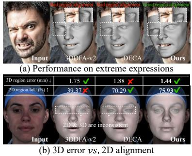

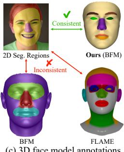  
Figure 2. Drawbacks of existing research and our results. (a) Present researches fail to reconstruct extreme expressions and perform bad region alignment. (b) Inconsistencies between 3D errors and 2D alignments, such as the eye region in this case. (c) Geometric optimization of each semantically consistent part is only achievable through our annotations.

• We introduce a novel Part Re-projection Distance Loss (PRDL) to comprehensively utilize segmentation information for face reconstruction. PRDL transforms the target and prediction into semantic point sets, optimizing the distribution of point sets to ensure that the reconstructed regions and the target share the same geometry.

• We introduce a new synthetic face dataset including closed-eye, open-mouth, and frown expressions, with more than 200K images.

• Extensive experiments show that the results with PRDL achieve excellent performance and outperform the existing methods. The data and code are available at https://github.com/wang-zidu/3DDFA-V3.

## 2. Related Work

2D-to-3D Losses for 3D Face Reconstruction. Landmark loss [11, 17, 60] stands out as the most widely employed and effective supervised way for face reconstruction. Some studies [20, 37] reveal that it can generate 3D faces under the guidance of sufficient hundreds or thousands landmarks. Photometric loss is another commonly used loss involving rendering the reconstructed mesh with texture into an image and comparing it to the original input. Some researchers focus on predicting the facial features that need to be fitted while excluding occlusions [12, 45]. The photometric loss is susceptible to factors like texture basis, skin masks, and rendering modes. It emphasizes overall visualization and may not effectively constrain local details. Perception loss [11, 14, 16] distinguishes itself from image-level methods by employing pre-trained deep face recognition networks [9] to extract high-level features from the rendered reconstruction results. These features are then compared with the features from the input. Lip segmentation consistency loss [48] employs mouth segmentation to help reconstruction.

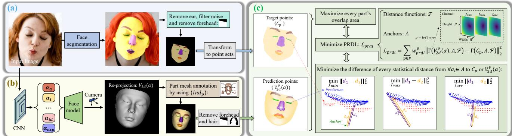  
Figure 3. Overview of Part Re-projection Distance Loss (PRDL). (a): Transforming facial part segmentation into target point sets $\{ C _ { p } \}$ (b): Re-projecting $V _ { 3 d } ( { \pmb { \alpha } } )$ onto the image plane to obtain predicted point sets $\{ V _ { 2 d } ^ { p } ( \alpha ) \}$ }. (c): Given anchors A and distance functions ${ \mathcal F } .$ , the core idea of PRDL is to minimize the difference of every statistical distance from any $\mathbf { \psi } _ { { \pmb { a } } _ { i } } \in \mathbf { \mathcal { A } }$ to the $V _ { 2 d } ^ { p } ( \alpha )$ or $C _ { p } ,$ leading to enhanced overlap between the regions covered by the target and predicted point sets.

Differentiable Silhouette Renderers. The development of differentiable renderers [15, 42, 46] has enriched the supervised methods for 3D face reconstruction. These pipelines make the rasterization process differentiable, allowing for the computation of gradients for every pixel in the rendered results. By combining IoU loss with segmentation information, the silhouettes produced by these renderers have been shown to optimize 3D shapes [8, 33, 56]. These rasterization processes typically rely on either local [21, 36] or global [8, 33] geometric distance-based weighted aggregation, generating silhouettes by computing a probability related to the distance from pixels to mesh faces. However, to obtain a suitable sharp silhouette, the weight contribution of each position to the rendered pixel will decrease sharply with the increase of distance, and the gradient generated by the shape difference at the large distance will be small or zero, which makes it difficult to retain accurate geometry guidance. These renderers also encounter issues such as rendering error propagation and gradient instability [22].

Synthetic Dataset. Synthetic data [41, 52, 58] is commonly used to train 3D face reconstruction models [11, 17, 25]. However, these synthetic faces either prioritize the diversification of background, illumination, and identities [41, 52], or concentrate on pose variation [58], contributing to achieve good results in reconstructing natural facial expressions but struggling to reconstruct extreme expressions. To overcome these limitations and facilitate the related research, this paper adopts a GAN-based method [24] to synthesize realistic and diverse facial expression data, including closed eyes, open mouths, and frowns.

## 3. Methodology

## 3.1. Preliminaries

We conduct a face model, an illumination model, and a camera model based on [6, 11, 14, 17].

Face Model. The vertices and albedo of a 3D face is determined by the following formula:

$$
\begin{array} { r l } & { V _ { 3 d } ( \alpha ) = R ( \alpha _ { a } ) ( \overline { { V } } + \alpha _ { i d } A _ { i d } + \alpha _ { \mathrm { e x p } } A _ { \mathrm { e x p } } ) + \alpha _ { t } } \\ & { T _ { a l b } ( \alpha ) = \overline { { T } } + \alpha _ { a l b } A _ { a l b } } \end{array} ,\tag{1}
$$

where $V _ { 3 d } ( { \pmb \alpha } ) \in \mathbb { R } ^ { 3 \times 3 5 7 0 9 }$ is the 3D face vertices, V is the mean shape. $T _ { a l b } ( { \pmb \alpha } ) \in \mathbb { R } ^ { 3 \times 3 5 7 0 9 }$ is the albedo, T is the mean albedo. $A _ { i d } , \ A _ { e x p }$ and $A _ { a l b }$ are the face identity vector bases, the expression vector bases and the albedo vector bases, respectively. $\pmb { \alpha } _ { i d } \in \mathbb { R } ^ { 8 0 } , \ \pmb { \alpha } _ { e x p } \in \mathbb { R } ^ { 6 4 }$ and ${ \pmb { \alpha } } _ { a l b } \in \mathbb { R } ^ { 8 0 }$ are the identity parameter, the expression parameter and the albedo parameter, respectively. ${ \pmb { \alpha } } _ { t } \in \mathbb { R } ^ { 3 }$ is the translation parameter. $\pmb { R } ( \pmb { \alpha } _ { a } ) \in \mathbb { R } ^ { 3 \times 3 }$ is the rotation matrix corresponding to pitch/raw/roll angles ${ \pmb { \alpha } } _ { a } \in \mathbb { R } ^ { 3 }$

Camera. We employ a camera with a fixed perspective projection, which is same as [11, 25]. Using this camera to re-project $V _ { 3 d } ( \pmb { \alpha } )$ into the 2D image plane yields $V _ { 2 d } ( { \pmb \alpha } ) \in \mathbb { R } ^ { 2 \times 3 5 7 0 9 }$

Illumination Model. Following [14], we adopt Spherical Harmonics (SH) [40] for the estimation of the shaded texture $T _ { t e x } ( \pmb { \alpha } )$ ):

$$
T _ { t e x } ( { \pmb \alpha } ) = T _ { a l b } ( { \pmb \alpha } ) \odot \sum _ { k = 1 } ^ { 9 } { \pmb \alpha } _ { s h } ^ { k } \pmb { \Psi } _ { k } ( { \pmb N } ) \ ,\tag{2}
$$

where ⊙ denotes the Hadamard product, N is the surface normal of $V _ { 3 d } ( { \pmb \alpha } ) , ~ { \pmb \Psi } ~ : ~ \mathbb { R } ^ { 3 } ~  ~ \mathbb { R }$ is the SH basis function and $\pmb { \alpha } _ { s h } \in \mathbb { R } ^ { 9 }$ is the corresponding SH parameter. In summary, $\pmb { \alpha } = [ \pmb { \alpha } _ { i d } , \pmb { \alpha } _ { \mathrm { e x p } } , \pmb { \alpha } _ { a } , \pmb { \alpha } _ { t } , \pmb { \alpha } _ { s h } ]$ is the undetermined parameter.

## 3.2. Point Transformation on the Image Plane

Transforming Segmentation to 2D Points. For an input RGB face image $\pmb { I } \in \mathbb { R } ^ { H \times W \times 3 }$ , the prediction of a face segmentation method can be represented by a set of binary tensors $M = \{ M _ { p } | p \in P \}$ , where $\begin{array} { r l } { \pmb { P } } & { { } = } \end{array}$ {left eye, right eye, left eyebrow, right eyebrow, up lip, down lip, nose, skin} and $M _ { p } \in \{ \stackrel { \smile } { 0 } , 1 \} ^ { \bar { H } \times W }$ . Specifically, $M _ { p } ^ { ( x , y ) } = 1$ only if the 2D pixel position $( x , y )$ of $M _ { p }$ belongs to a certain face part $p ,$ and otherwise $M _ { p } ^ { ( x , y ) } = 0$ . M can be transformed into a set of point sets ${ \cal C } = \{ { \cal C } _ { p } | p \in { \cal P } \}$ , where $C _ { p } = \{ ( x , y ) | i f M _ { p } ^ { ( x , y ) } = 1 \}$ In this step, we employ DML-CSR [55] for face segmentation, excluding the ear regions, filtering out noise from the segmentation, and dynamically removing the forehead region above the eyebrows based on their position. This procedure is illustrated in Fig. 3(a). More implementation details are provided in the supplemental materials.

Facial Part Annotation on 3D Face Model. Our objective is to leverage $\{ C _ { p } \}$ for guiding 3D face reconstruction. Thus, we should ensure that the reconstructed mesh can be divided into regions consistent with the semantics of the 2D segmentation. Due to the topological consistency of the face model, every vertex on the mesh can be annotated for a specific region. However, existing annotations [27, 30, 49] do not conform to widely accepted 2D face segmentation definitions [24, 32], as shown in Fig.2(c). To address this misalignment, we introduce new part annotations on both BFM [5] and FaceVerse [51]. We partition the vertices based on their indices. $i \in I n d _ { p }$ indicates that the i-th vertex (denoted as v) on the mesh belongs to part $p .$ $\{ I n d _ { p } | p \in P \}$ can be obtained by:

$$
\left. \begin{array} { l } { { I ^ { s e g } = S e g ( R e n d e r ( V _ { 3 d } , T e x ) ) } } \\ { { i \in I n d _ { p } , i f { \ : \ : I ^ { s e g } ( \pmb v ) } \in p } } \end{array} \right. ,\tag{3}
$$

where Render(·) generates an image by applying texture on the mesh, and $S e g ( \cdot )$ is responsible for segmenting the rendered result. We employ different shape $V _ { 3 d }$ and varying textures Tex to label every $v \in V _ { 3 d }$ with hand-crafted modification. The annotation $\{ I n d _ { p } \}$ is pre-completed offline in the training process. Consequently, we utilize $\{ I n d _ { p } \}$ to transform the re-projection $V _ { 2 d } ( \pmb { \alpha } )$ into semantic point sets $\{ V _ { 2 d } ^ { p } ( { \pmb \alpha } ) | p \in P \}$ . Besides, the upper forehead region situated above the eyebrows is dynamically excluded to ensure consistency with target. Points obstructed by hair are removed based on $\{ C _ { p } \}$ , as shown in Fig. 3(b). Please refer to supplemental materials for annotation details.

## 3.3. Part Re-projection Distance Loss (PRDL)

This section describes the design of PRDL, focusing on constructing geometric descriptors and establishing the relation between the prediction $\{ V _ { 2 d } ^ { p } ( \alpha ) \}$ and the ground truth $\{ C _ { p } \}$ for a given $p \in { \cal P }$ , which is proved instrumental for face reconstruction.

In a more generalized formulation, considering two point sets $C = \{ c _ { 1 } , c _ { 2 } , . . . , c _ { | C | } \}$ and $C ^ { * } = \{ c _ { 1 } ^ { * } , c _ { 2 } ^ { * } , . . . , c _ { | C ^ { * } | } ^ { * } \}$ we aim to establish geometry descriptions by quantifying shape alignment between them for reconstruction. $C$ and $C ^ { * }$ may not possess the same number of points, and their points lack correspondence. Instead of directly searching the correspondence between the two sets, we use a set of fixed points as anchors $\pmb { A } = \left\{ \pmb { a } _ { 1 } , \pmb { a } _ { 2 } , . . . , \pmb { a } _ { | A | } \right\}$ and a collection of statistical distance functions $\pmb { \mathcal { F } } = \mathrm { \dot { \{ } }  \dot { f } _ { 1 } , f _ { 2 } , . . . , f _ { | \pmb { \mathcal { F } } | } \}$ to construct geometry description tensors $\Gamma ( C , A , { \mathcal { F } } ) \ { \mathrm { ~ \in ~ } }$ $\mathbb { R } ^ { | A | \times | { \mathcal F } | }$ and $\Gamma ( C ^ { \ast } , \overset { \cdot } { A } , \mathcal { F } ) \in \mathbb { R } ^ { | A | \times | \mathcal { F } | }$ for C and $C ^ { * }$ , respectively (denoted as Γ and Γ∗ for brevity). The value $\Gamma ( i , j )$ and $\Gamma ^ { * } ( i , j )$ ) at the position $( i , j )$ are determined by:

$$
\left\{ \begin{array} { l l } { \Gamma ( i , j ) = f _ { j } ( C , \pmb { a } _ { i } ) } \\ { \Gamma ^ { * } ( i , j ) = f _ { j } ( C ^ { * } , \pmb { a } _ { i } ) } \end{array} \right.\tag{4}
$$

where every function $f _ { j } ( B , b ) \in \mathcal { F }$ describes the distance from a single point b to a set of points B, and $f _ { j } ( B , \boldsymbol { b } )$ can be any statistically meaningful distance.

When fitting 3DMM to the segmented silhouettes for part $p ,$ we set $C = V _ { 2 d } ^ { p } ( \alpha )$ and $C ^ { * } = C _ { p }$ with specified anchors A and a set of distance functions $\mathcal { F }$ . Then we calculate their corresponding geometry descriptor tensors $\Gamma _ { p } = \Gamma ( V _ { 2 d } ^ { p } ( { \pmb \alpha } ) , { \pmb A } , { \mathcal F } )$ and $\Gamma _ { p } ^ { * } = \Gamma ( C _ { p } , A , { \mathcal { F } } )$ . Part Re-projection Distance Loss (PRDL) $\mathcal { L } _ { p r d l }$ is defined as:

$$
\mathcal { L } _ { p r d l } = \sum _ { p \in P } w _ { p r d l } ^ { p } | | \boldsymbol { \Gamma } _ { p } - \boldsymbol { \Gamma } _ { p } ^ { * } | | _ { 2 } ^ { 2 } \mathrm { ~ , ~ }\tag{5}
$$

where $w _ { p r d l } ^ { p }$ is the weight of each part $p .$ In this paper, we set $\mathcal { F }$ as a collection of the nearest $( f _ { m i n } )$ , furthest $( f _ { m a x } )$ and average $( f _ { a v e } )$ distance, $i . e . \mathcal { F } = \{ f _ { m a x } , f _ { m i n } , f _ { a v e } \}$ We set A as a $H \times W$ mesh grid. Then for $\forall a _ { i } \in A$ , the optimization objective of $\mathcal { L } _ { p r d l }$ is to:

$$
\left\{ \begin{array} { l l } { \operatorname* { m i n } | | f _ { m i n } ( C _ { p } , \pmb { a _ { i } } ) - f _ { m i n } ( V _ { 2 d } ^ { p } ( \pmb { \alpha } ) , \pmb { a _ { i } } ) | | _ { 2 } ^ { 2 } } \\ { \operatorname* { m i n } | | f _ { m a x } ( C _ { p } , \pmb { a _ { i } } ) - f _ { m a x } ( V _ { 2 d } ^ { p } ( \pmb { \alpha } ) , \pmb { a _ { i } } ) | | _ { 2 } ^ { 2 } } \\ { \operatorname* { m i n } | | f _ { a v e } ( C _ { p } , \pmb { a _ { i } } ) - f _ { a v e } ( V _ { 2 d } ^ { p } ( \pmb { \alpha } ) , \pmb { a _ { i } } ) | | _ { 2 } ^ { 2 } } \end{array} \right.\tag{6}
$$

This process is shown in Fig. 3(c). When $p = { \mathrm { l e f t . e y e } } .$ PRDL minimizes the length difference between the indigo and orange lines (also as shown in Fig. 6(a) when $p =$ right eyebrow). The upper right corner of Fig. 3(c) is a visualization of $\Gamma _ { l e f t \_ e y e }$ with the last channel separately by reshaping it from $\mathbb { R } ^ { | \boldsymbol { A } | \times | \mathcal { F } | }$ to $\mathbb { R } ^ { H \times W \times | \mathcal { F } | }$ . It is worth note that, the points number in $V _ { 2 d } ^ { p } ( \alpha ) , C _ { p }$ and A can be reduced by using Farthest Point Sampling (FPS) [38] to decrease computational costs.

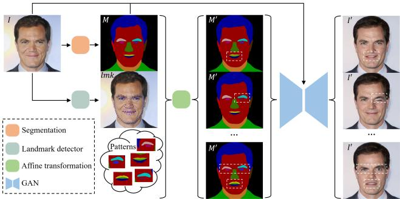  
Figure 4. Synthesize emotional expression data.

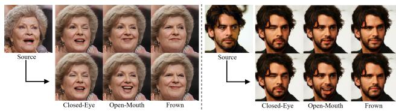  
Figure 5. Examples of our synthetic face dataset.

## 3.4. Overall Losses

To reconstruct a 3D face from image I, we build frameworks to minimize the total loss L as follows:

$$
\begin{array} { r l } & { \mathcal { L } = \lambda _ { p r d l } \mathcal { L } _ { p r d l } + \lambda _ { l m k } \mathcal { L } _ { l m k } + \lambda _ { p h o } \mathcal { L } _ { p h o } } \\ & { \quad + \lambda _ { p e r } \mathcal { L } _ { p e r } + \lambda _ { r e g } \mathcal { L } _ { r e g } , } \end{array}\tag{7}
$$

where $\mathcal { L } _ { l m k }$ is the landmark loss, we use detectors to locate 240 2D landmarks for $\mathcal { L } _ { l m k }$ and adopt the dynamic landmark marching [57] to handle the non-correspondence between 2D and 3D cheek contour landmarks arising from pose variations. The photometric loss $\mathcal { L } _ { p h o }$ and the perceptual loss $\mathcal { L } _ { p e r }$ are based on [11, 14]. $\mathcal { L } _ { r e g }$ is the regularization loss for α. $\lambda _ { p r d l } = 0 . 8 e - 3 , \lambda _ { l m k } = 1 . 6 e - 3 ,$ $\lambda _ { p h o } = 1 . 9 , \lambda _ { p e r } = 0 . 2$ , and $\lambda _ { r e g } = 3 e - 4$ are the balance weights. $\mathcal { L } _ { p r d l }$ and $\mathcal { L } _ { l m k }$ are normalized by $H \times W$

## 3.5. Synthetic Emotional Expression Data

Benefiting from recent developments in face editing research [24, 47], we can generate realistic faces through segmentation M. We aim to mass-produce realistic and diverse facial expression data. To achieve this, we start by obtaining the segmentation M and landmarks lmk of the original image I with a segmentation method [55] and a landmark detector, respectively. Leveraging the location of landmarks lmk, we apply affine transformation with various patterns onto the segmentation M, resulting in $M ^ { \prime } .$ Subsequently, $M ^ { \prime }$ is fed into the generative network [24] to produce a new facial expression image $\pmb { I ^ { \prime } } .$ , as depicted in Fig. 4. Based on CelebA [35] and CelebAMask-HQ [24], we have generated a dataset comprising more than 200K images, including expressions such as closed-eye, openmouth, and frown, as depicted in Fig. 5. This dataset will be publicly available to facilitate research.

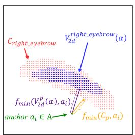  
(a)

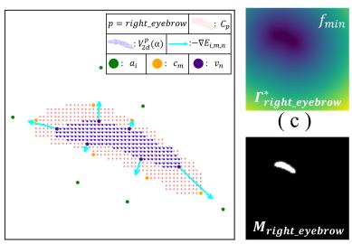  
(b)  
(d)  
Figure 6. (a): p = right eyebrow when the closest distance (fmin) is compared. (b): The gradient descent of PRDL for (a). (c): $\Gamma _ { p } ^ { * }$ is the regression target of PRDL in $f _ { m i n }$ channel. (d): $M _ { p }$ is the regression target of renderer-based methods. $\Gamma _ { p } ^ { * }$ is more informative than $M _ { p }$

## 4. Analysis of PRDL and Related Methods

The Gradient of PRDL. With anchors and distance functions as the bridge, PRDL establishes the geometry descriptions of the two point sets. In Fig. 6, we take $p =$ right eyebrow as an example to analyze the gradient of PRDL. When considering $f _ { m i n }$ and a specific anchor ${ \mathbf { } } a _ { i } \in { \mathbf { \Xi } }$ $A , f _ { m i n }$ identifies $c _ { m }$ and ${ \pmb v } _ { n }$ from $C _ { p }$ and $V _ { 2 d } ^ { p } ( \alpha )$ , respectively, by selecting the ones closest to ai:

$$
m = \arg \operatorname* { m i n } _ { j } | | a _ { i } - c _ { j } | | _ { 2 } , \quad c _ { j } \in C _ { p } ,\tag{8}
$$

$$
n = \arg \operatorname* { m i n } _ { j } | | \pmb { a } _ { i } - \pmb { v } _ { j } | | _ { 2 } , \quad \pmb { v } _ { j } \in V _ { 2 d } ^ { p } ( \pmb { \alpha } ) .\tag{9}
$$

Under the definition of PRDL, the corresponding energy function $E _ { i , m , n }$ for $\mathbf { } a _ { i } , c _ { m }$ and ${ \pmb v } _ { n }$ is:

$$
\begin{array} { r l } & { { E } _ { i , m , n } = ( | | { \pmb a } _ { i } - { \pmb c } _ { m } | | _ { 2 } - | | { \pmb a } _ { i } - { \pmb v } _ { n } | | _ { 2 } ) ^ { 2 } } \\ & { \qquad = ( d _ { i , m } - d _ { i , n } ) ^ { 2 } , } \end{array}\tag{10}
$$

where $d _ { i , m } = | | { \pmb a } _ { i } - { \pmb c } _ { m } | | _ { 2 } , d _ { i , n } = | | { \pmb a } _ { i } - { \pmb v } _ { n } | | _ { 2 }$ . The gradient descent of $E _ { i , m , n }$ on ${ \pmb v } _ { n }$ is:

$$
\begin{array} { r } { - \frac { \partial E _ { i , m , n } } { \partial { \pmb v } _ { n } } = 2 ( { \pmb v } _ { n } - { \pmb a } _ { i } ) ( \frac { d _ { i , m } } { d _ { i , n } } - 1 ) . } \end{array}\tag{11}
$$

The physical explanation of Eqn. 11 is comprehensible and concise: the direction of $- \nabla E _ { i , m , n }$ always aligns with the line connecting $\mathbf { a } _ { i }$ and ${ \pmb v } _ { n } .$ , if $d _ { i , n } > d _ { i , m } ,$ the direction of $- \nabla E _ { i , m , n }$ is from ${ \pmb v } _ { n }$ to $\mathbf { a } _ { i }$ (as shown in Fig. 6(b)), and vice versa. In the context of gradient descent, the effect of $- \nabla E _ { i , m , n }$ is to make $d _ { i , n } ~ = ~ d _ { i , m }$ as much as possible. Given A and $f _ { m i n }$ , the gradient descent of $\mathcal { L } _ { p r d l }$ on ${ \pmb v } _ { n }$ is the aggregation of all anchors:

$$
\begin{array} { r l r } {  { - \frac { \partial \mathcal { L } _ { p r d l } } { \partial \pmb { v } _ { n } } = - w _ { p r d l } ^ { p } \sum _ { i , m } \frac { \partial E _ { i , m , n } } { \partial \pmb { v } _ { n } } } } \\ & { } & { = - w _ { p r d l } ^ { p } \sum _ { i , m } \nabla E _ { i , m , n } . } \end{array}\tag{12}
$$

The scenario with $f _ { m a x }$ is similar to that of $f _ { m i n }$ , with the only distinction lying in the selection of points. fmax also has the capability to constrain $V _ { 2 d } ^ { p } ( \alpha )$ within the confines of $C _ { p } . \ f _ { a v e }$ acts on the entire $V _ { 2 d } ^ { p } ( \alpha )$ , striving to bring its centroid as close as possible to the centroid of $C _ { p }$ . The introduction of additional anchors and the integration of diverse statistical distances in PRDL prevent the optimization from local optima and provide sufficient geometric signals. Please refer to supplementary materials for more details.

Table 1. Quantitative comparison on Part IoU benchmark. The best and runner-up are highlighted in bold and underlined, respectively. R eye denotes the right eye, and similar definitions for the rest are omitted.
<table><tr><td rowspan="2">Methods</td><td colspan="8">Part IoU(%)↑</td></tr><tr><td> $\overline { { R \mathrm { \mathcal { - } } e y e } }$   $a \nu g . \pm s t d .$ </td><td> $\overline { { L . e y e } }$   $a \nu g . \pm s t d .$ </td><td> $\overline { { { R } { \lrcorner } { b r o w } } }$   $a \nu g . \pm s t d .$ </td><td> $\overline { { { L . b r o w } } }$   $a \nu g . \pm s t d .$ </td><td> $\overline { { N o s e } }$   $a \nu g . \pm s t d .$ </td><td> $\overline { { U p . l i p } }$   $a \nu g . \pm s t d .$ </td><td> $\overline { { D o w n \mathcal { I } i p } }$   $a \nu g . \pm s t d .$ </td><td>avg.</td></tr><tr><td>PRNet [13]</td><td> $6 5 . 8 7 { \pm } 1 6 . 3 6$ </td><td> $6 6 . 7 3 { \scriptstyle \pm 1 4 . 7 4 }$ </td><td> $6 1 . 4 6 \pm 1 5 . 8 9$ </td><td> $5 9 . 1 8 { \pm } 1 6 . 3 1$ </td><td> $8 3 . 3 4 \pm 4 . 5 7$ </td><td> $5 0 . 8 8 \pm 1 8 . 3 5$ </td><td> $5 8 . 1 6 { \pm } 1 7 . 7 2 $ </td><td>63.66</td></tr><tr><td>MGCNet [45]</td><td> $6 4 . 4 2 { \pm } 1 6 . 0 2$ </td><td> $6 4 . 8 1 \pm 1 6 . 9 1$ </td><td> $5 5 . 2 5 { \pm } 1 5 . 2 9$ </td><td> $6 1 . 3 0 { \pm } 1 5 . 5 8 $ </td><td> $8 7 . 4 0 \pm 3 . 5 1 $ </td><td> $4 1 . 1 6 \pm 1 9 . 7 0$ </td><td> $6 6 . 2 2 { \pm } 1 3 . 8 3$ </td><td>62.94</td></tr><tr><td>Deep3D [11]</td><td> $7 1 . 8 7 { \pm } 1 2 . 0 0 $ </td><td> $7 0 . 5 2 { \pm } 1 2 . 1 9$ </td><td> $6 4 . 6 6 \pm 1 1 . 3 1$ </td><td> $6 4 . 7 0 { \pm } 1 1 . 9 8 $ </td><td> $8 7 . 6 9 \pm 3 . 5 1 $ </td><td> $6 1 . 2 1 \pm 1 5 . 6 0$ </td><td> $6 5 . 9 5 { \pm } 1 3 . 0 8$ </td><td>69.51</td></tr><tr><td>3DDFA-v2 [17]</td><td> $6 1 . 3 9 { \pm } 1 5 . 9 8$ </td><td> $5 7 . 5 1 \pm 1 8 . 0 9$ </td><td> $4 3 . 3 8 \pm 2 5 . 2 5$ </td><td> $3 8 . 8 5 { \pm } 2 4 . 3 8 $ </td><td> $8 0 . 8 3 { \pm } 4 . 9 2 $ </td><td> $\overline { { 5 0 . 2 0 { \pm } 1 7 . 1 7 } }$ </td><td> $5 9 . 0 1 \pm 1 5 . 2 3 $ </td><td>55.88</td></tr><tr><td>HRN [25]</td><td> $7 3 . 3 1 \pm 1 1 . 3 9$ </td><td> $7 3 . 6 1 \pm 1 1 . 5 0$ </td><td> $6 7 . 9 1 \pm 8 . 2 6 $ </td><td> $6 6 . 7 8 { \pm } 1 0 . 2 7$ </td><td> $\mathbf { 9 0 . 0 0 } { \pm } 2 . 6 \mathbf { 0 }$ </td><td> ${ \bf 6 3 . 8 0 \pm 1 4 . 1 6 }$ </td><td> $6 6 . 4 0 { \pm } 1 1 . 9 4 \ $ </td><td>71.69</td></tr><tr><td>DECA [14]</td><td> $5 8 . 0 9 { \pm } 2 1 . 4 0 $ </td><td> $6 2 . 5 6 \pm 1 9 . 4 1$ </td><td> $5 5 . 2 7 \pm 1 9 . 4 9$ </td><td> $5 1 . 8 6 \pm 1 9 . 9 3$ </td><td> $8 6 . 5 4 \pm 9 . 1 1$ </td><td> $5 6 . 3 9 { \pm } 1 6 . 9 6$ </td><td> $6 2 . 8 1 \pm 1 7 . 6 6$ </td><td>61.93</td></tr><tr><td>Ours (w/o  $\mathcal { L } _ { p r d l } )$ </td><td> $7 0 . 7 2 { \scriptstyle \pm 9 . 4 4 }$ </td><td> $7 5 . 6 9 \pm 1 0 . 7 9$ </td><td> $7 1 . 1 1 \pm 8 . 5 8$ </td><td> $7 1 . 6 9 { \pm } 8 . 7 3 $ </td><td> $8 8 . 3 5 { \pm } 4 . 6 0 $ </td><td> $5 7 . 2 6 \pm 1 5 . 9 7$ </td><td> $6 9 . 7 1 { \pm } 1 0 . 6 8$ </td><td>72.08</td></tr><tr><td>Ours (w/o Syn. Data)</td><td> $7 3 . 8 1 { \pm } 1 0 . 1 2 $ </td><td> $\overline { { 7 2 . 5 5 { \pm } 1 0 . 6 8 } }$ </td><td> $7 2 . 2 4 \pm 9 . 2 3 $ </td><td> $\overline { { 7 0 . 9 0 { \pm } 8 . 5 5 } }$ </td><td> $8 8 . 7 1 { \pm } 4 . 1 1 $ </td><td> $5 7 . 4 3 \pm 1 4 . 3 7$ </td><td> $6 9 . 8 7 \pm 1 0 . 5 4 $ </td><td>72.22</td></tr><tr><td>Ours</td><td> $\overline { { 7 4 . 5 5 \pm 1 1 . 4 6 } }$ </td><td> ${ \bf 7 6 . 0 6 \pm 1 0 . 3 2 }$ </td><td> $\overline { { 7 4 . 0 0 \pm 7 . 7 2 } }$ </td><td> $\mathbf { 7 4 . 0 5 \pm 7 . 7 0 }$ </td><td> $8 9 . 0 6 { \pm } 3 . 5 3 $ </td><td> $5 8 . 1 6 { \pm } 1 2 . 7 6 $ </td><td> $\overline { { 7 0 . 8 6 \pm 1 0 . 3 4 } }$ </td><td>73.82</td></tr></table>

Table 2. Quantitative comparison on Realy benchmark. Lower values indicate better results. The best and runner-up are highlighted in bold and underlined, respectively.
<table><tr><td rowspan="2">Methods</td><td colspan="5">Frontal-view (mm) ↓</td><td colspan="5">Side-view (mm) ↓ Forehead</td></tr><tr><td>Nose avg.± std.</td><td>Mouth avg.± std.</td><td>Forehead avg.± std.</td><td>Cheek avg.± std.</td><td>avg.</td><td>Nose avg.± std.</td><td>Mouth  $a \nu g . \pm s t d .$ </td><td>avg.± std.</td><td>Cheek  $a \nu g . \pm s t d .$ </td><td>avg.</td></tr><tr><td>PRNet [13]</td><td>1.923±0.518</td><td>1.838±0.637</td><td> $2 . 4 2 9 { \pm } 0 . 5 8 8$ </td><td>1.863±0.698</td><td>2.013</td><td> $1 . 8 6 8 { \pm } 0 . 5 1 0 $ </td><td> $1 . 8 5 6 { \scriptstyle \pm 0 . 6 0 7 }$ </td><td> $2 . 4 4 5 { \pm } 0 . 5 7 0$ </td><td> $1 . 9 6 0 { \scriptstyle \pm 0 . 7 3 1 }$ </td><td>2.032</td></tr><tr><td>MGCNet [45]</td><td>1.771±0.380</td><td> $1 . 4 1 7 { \scriptstyle \pm 0 . 4 0 9 }$ </td><td> $2 . 2 6 8 { \scriptstyle \pm 0 . 5 0 3 }$ </td><td> $1 . 6 3 9 { \pm } 0 . 6 5 0 $ </td><td>1.774</td><td> $1 . 8 2 7 { \pm } 0 . 3 8 3$ </td><td> $1 . 4 0 9 { \pm } 0 . 4 1 8$ </td><td> $2 . 2 4 8 { \pm } 0 . 5 0 8$ </td><td> $1 . 6 6 5 { \pm } 0 . 6 4 4$ </td><td>1.787</td></tr><tr><td>Deep3D[11]</td><td>1.719±0.354</td><td> $1 . 3 6 8 { \pm } 0 . 4 3 9$ </td><td> $2 . 0 1 5 { \scriptstyle \pm 0 . 4 4 9 }$ </td><td> $1 . 5 2 8 { \pm } 0 . 5 0 1$ </td><td>1.657</td><td> $1 . 7 4 9 { \pm } 0 . 3 4 3$ </td><td> $1 . 4 1 1 \pm 0 . 3 9 5$ </td><td> $2 . 0 7 4 { \scriptstyle \pm 0 . 4 8 6 }$ </td><td> $1 . 5 2 8 { \pm } 0 . 5 1 7$ </td><td>1.691</td></tr><tr><td>3DDFA-v2 [17]</td><td>1.903±0.517</td><td> $1 . 5 9 7 { \scriptstyle \pm 0 . 4 7 8 }$ </td><td> $2 . 4 4 7 { \scriptstyle \pm 0 . 6 4 7 }$ </td><td> $1 . 7 5 7 { \pm } 0 . 6 4 2$ </td><td>1.926</td><td> $1 . 8 8 3 { \pm } 0 . 4 9 9$ </td><td> $1 . 6 4 2 { \scriptstyle \pm 0 . 5 0 1 }$ </td><td> $2 . 4 6 5 { \pm } 0 . 6 2 2$ </td><td> $1 . 7 8 1 { \pm } 0 . 6 3 6$ </td><td>1.943</td></tr><tr><td>HRN [25]</td><td>1.722±0.330</td><td>1.357±0.523</td><td> $1 . 9 9 5 { \scriptstyle \pm 0 . 4 7 6 }$ </td><td>1.072±0.333</td><td>1.537</td><td>1.642±0.310</td><td> $1 . 2 8 5 { \pm } 0 . 5 2 8$ </td><td> $1 . 9 0 6 { \pm } 0 . 4 7 9$ </td><td>1.038±0.322</td><td>1.468</td></tr><tr><td> $\mathrm { { D E C A } [ 1 4 ] }$ </td><td>1.694±0.355</td><td>2.516±0.839</td><td> $2 . 3 9 4 { \pm } 0 . 5 7 6$ </td><td>1.479±0.535</td><td>2.010</td><td> $1 . 9 0 3 { \pm } 1 . 0 5 0 $ </td><td> $2 . 4 7 2 { \scriptstyle \pm 1 . 0 7 9 }$ </td><td> $2 . 4 2 3 { \pm } 0 . 7 2 0$ </td><td> $1 . 6 3 0 { \pm } 1 . 1 3 5$ </td><td>2.107</td></tr><tr><td> $\mathrm { O u r s } \ ( \mathrm { w } / \mathrm { o } \ \mathcal { L } _ { p r d l } )$ </td><td>1.671±0.332</td><td>1.460±0.474</td><td> $2 . 0 0 1 { \scriptstyle \pm 0 . 4 2 8 }$ </td><td> $1 . 1 4 2 { \pm } 0 . 3 1 5$ </td><td>1.568</td><td> $1 . 6 6 5 { \pm } 0 . 3 4 9$ </td><td> $1 . 2 9 7 { \scriptstyle \pm 0 . 4 0 0 }$ </td><td> $2 . 0 1 6 { \pm } 0 . 4 4 8$ </td><td> $1 . 1 3 4 \pm 0 . 3 4 2$ </td><td>1.528</td></tr><tr><td> $\mathrm { O u r s } ( \mathrm { w / o } \mathrm { S y n . } \mathrm { D a t a } )$ </td><td>1.592±0.327</td><td> $1 . 3 3 9 { \pm } 0 . 4 3 3$ </td><td> $1 . 8 2 3 { \scriptstyle \pm 0 . 4 0 7 }$ </td><td> $1 . 1 1 9 { \pm } 0 . 3 3 2$ </td><td>1.468</td><td> $1 . 6 2 8 { \pm } 0 . 3 2 0 $ </td><td> $1 . 2 2 9 { \pm } 0 . 4 3 3$ </td><td> $1 . 8 7 2 { \scriptstyle \pm 0 . 4 0 7 }$ </td><td> $1 . 0 9 1 { \pm } 0 . 3 1 2$ </td><td>1.455</td></tr><tr><td>Ours</td><td>1.586±0.306</td><td>1.238±0.373</td><td> $\overline { { 1 . 8 1 0 \pm 0 . 3 9 4 } }$ </td><td> $1 . 1 1 1 \pm 0 . 3 2 7$ </td><td>1.436</td><td> $\overline { { 1 . 6 2 3 \pm 0 . 3 1 3 } }$ </td><td> $\overline { { 1 . 2 0 5 \pm 0 . 3 6 6 } }$ </td><td>1.864±0.424</td><td>1.076±0.315</td><td>1.442</td></tr></table>

the 3D object or assign minimal weights to them, emphasizing the rendered object region. However, this operation is equivalent to selectively choosing anchors A in the interior of the rendered shape, while the external anchors are either not chosen or treated differently by assigning small weights, thereby diminishing descriptive power. In Eqn. 11, Eqn. 12 and Fig. 6(b), we have analyzed that external anchors play a significant role in the fitting process. Ablation study (Fig.8) also proves that PRDL is more effective than renderer-based methods like [8, 33, 56].

PRDL vs. Renderer-Based Loss: An intuitive approach for fitting segmentation is to use the renderer-based IoU loss, where differentiable silhouette renderers play a crucial role. Consequently, we delve into the distinctions between PRDL and renderers. We can reshape $\Gamma _ { p } ^ { * } ~ ( \mathbb { R } ^ { | \boldsymbol { A } | \times | \mathcal { F } | } ~ $ $\mathbb { R } ^ { H \times W \times | \mathcal { F } | } )$ to visualize it with the last channel separately. Fig. 6(c) illustrates the visualization of the $f _ { m i n }$ channel for p = right eyebrow, while Fig. 6(d) represents the silhouette rendered by [33] or [8]. In comparison with the regression target $M _ { p }$ utilized in renderer-based methods, $\Gamma _ { p } ^ { \ast }$ in PRDL is more informative and more conducive to fitting. Please refer to supplementary materials for more details.

## 5. Experiments

## 5.1. Experimental Settings

Reconstruction Frameworks. We implement PRDL based on PyTorch [39] and PyTorch3D [42]. We use ResNet-50 [18] as the backbone to predict α. The input image is cropped and aligned by [10], and resized into $2 2 4 \times 2 2 4$

Data. The face images are from publicly available datasets: Dad-3dheads [37], CelebA [35], RAF-ML [28], RAF-DB [29] and 300W [43]. Our synthetic images are mainly from [24, 35]. We use [58] for face pose augmentation. In total, our training data contained about 600K face images. We employ DML-CSR [55] to predict 2D face segmentation.

Furthermore, considering existing theoretical analyses [8, 22, 56], PRDL exhibits several notable advantages. First, in these renderers, all triangles constituting the object influence every pixel within the silhouettes, making it intricate to isolate specific geometric features. In contrast, $f _ { m i n } \mathrm { o r } f _ { m a x }$ in PRDL matches the nearest or furthest point on the object, allowing for a more straightforward measurement of the shape’s boundary characteristics. Secondly, these renderers either neglect pixels outside any triangles of

Implementation Details. Considering the inherent feature of 2D segmentation, if part p of a face is invisible or occluded, it may lead to $C _ { p } = \emptyset$ . In such a situation during training, we set ${ w _ { p r d l } ^ { p } = \bar { 0 } }$ for these samples. We use Adam [23] as the optimizer with an initial learning rate of $1 e - 4 .$ We use Farthest Point Sampling (FPS) [38] to reduce the point number of $V _ { 2 d } ^ { s k i n } ( \alpha )$ and $C _ { s k i n }$ to 3000, reducing computational consumption. Please refer to supplemental materials for more details.

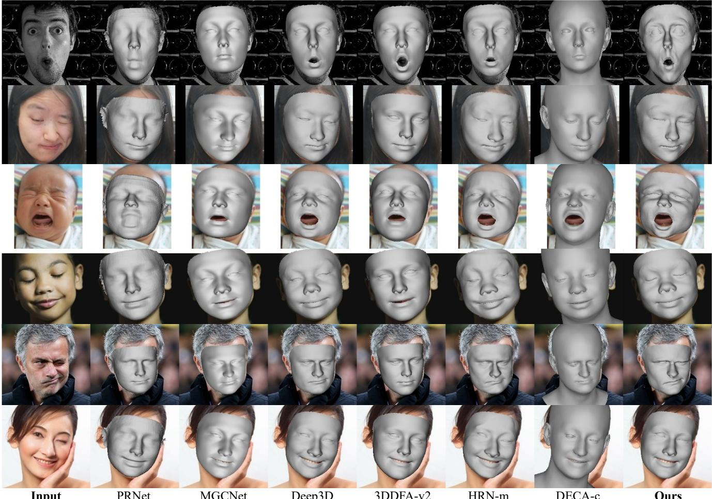  
Figure 7. Qualitative comparison with the other methods. Our method achieves realistic reconstructions, particularly in the eye region.

## 5.2. Metric

In various VR/AR applications, 3DMMs are crucial in capturing facial motions or providing fine-grained regions covering facial features. One crucial objective in such applications is to ensure the alignment of overlapping facial parts between prediction and input. Widely used benchmarks [7, 44] typically rely on the 3D accuracy performance of reconstructions. However, there are instances where inconsistencies arise between 3D errors and 2D alignments. As shown in Fig.2(b), comparing with 3DDFA-v2 [17], DECA [14] have better 2D eye region overlapping IoU (70.29% vs. 39.37%) but a higher 3D forehead error (1.88mm vs. 1.75mm). To address this, we introduce Part IoU to emphasize the performance of overlap.

Part IoU is a new benchmark to quantify how well the part reconstruction $V _ { 3 d } ^ { p } ( \alpha )$ aligns with their corresponding parts from the original face. The core idea is to measure the overlap of facial components between the reconstruction and the original image using IoU. The ground truth is a binary tensor $\{ M _ { p } \}$ (as defined above). We render $V _ { 3 d } ( \pmb { \alpha } )$ with a mean texture as an image, generate the predicted segmentation $\{ M _ { p } ^ { p r e d } \}$ with [55]. The use of mean texture focuses the metric more on overlap effects than other factors, making it applicable to methods without texture-fitting [13, 17]. Part IoU $I o U _ { p }$ of part p can be obtained by:

$$
I o U _ { p } = I o U ( M _ { p } ^ { p r e d } , M _ { p } ) .\tag{13}
$$

MEAD [50] is an emotional talking-face dataset. We test Part IoU by selecting 10 individuals from MEAD, each contributing 50 random different images. Part IoU measures the overlap performance between each part of the reconstruction and the ground truth. More detail is in the supplemental materials.

REALY [7] benchmark consists of 100 scanned neutral expression faces, which are divided into four parts: nose, mouth, forehead (eyes and eyebrows), and cheek for 3D alignment and distance error calculation.

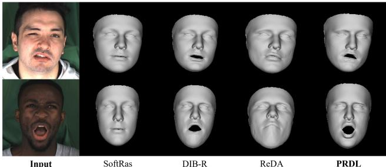  
Figure 8. Comparison with the renderer-based geometric guidance of segmentation.

## 5.3. Qualitative Comparison

We conduct a comprehensive evaluation of our method with the state-of-the-art approaches, including PRNet [13], MGCNet [45], Deep3D [11], 3DDFA-V2 [17], HRN [25] and DECA [14]. The visualization of HRN and DECA uses the mid-frequency details and coarse shape (denoted as HRN-m and DECA-c) since their further steps only change the renderer’s normal map, while no 3D refinement is made. As shown in Fig. 7, our results excel in capturing extreme expressions, even better than HRN-m which has fine reconstruction steps.

## 5.4. Quantitative Comparison

On both the Part IoU and REALY [7] benchmarks, our results outperforms the existing state-of-the-art methods. As shown in Tab. 1, our method is almost always the highest overlap IoU across various facial parts with 73.82% total average, demonstrating PRDL enhances the part alignment of reconstruction. PRDL also performs the best average 3D error on the REALY benchmark (1.436mm in frontal-view and 1.442mm in side-view), as shown in Tab. 2.

## 5.5. Ablation Study

Ablation for PRDL and Synthetic Data. We conduct quantitative ablation experiments for PRDL and synthetic data on REALY and Part IoU. As depicted in Table 1 and Table 2, only introducing PRDL already yields superior results compared to all other methods (72.22%, 1.468mm, and 1.455mm). Introducing synthetic data without PRDL demonstrates a significant improvement in Part IoU, but not as effectively as PRDL (72.08% vs. 72.22%). Using both synthetic data and PRDL could lead to the best result.

Compare with the Differentiable Silhouette Renderers. SoftRas [33] and DIB-R [8] are the two most widely used renderers, which serve as the basis for PyTorch3D [42] and Kaolin [15], respectively. Based on the image-fitting framework [1], we use them to render a silhouette of each face part and calculate the IoU loss with the ground truth. ReDA [56] is also a renderer-based method using the geometric guidance of segmentation. Fig.8 shows that PRDL is significantly better than these methods. It is essential to emphasize that all the results in Fig.8 and Fig.9 do not include $\mathcal { L } _ { l m k } , \mathcal { L } _ { p h o } , \mathrm { a n d } \mathcal { L } _ { p e r }$

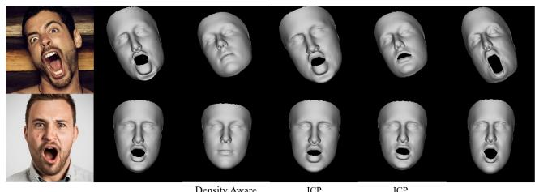  
Figure 9. Comparison with the other point-driven-based geometric guidance of segmentation.

Compare with the Other Point-Driven Optimization Methods. One of the key insights of PRDL is transforming segmentation into points. Thus the 3DMM fitting becomes an optimization of two 2D point clouds until they share the same geometry. While an intuitive idea is incorporating the point-driven optimization methods like iterative closest points (ICP) [2–4] or chamfer distance [53], these methods are predominantly rooted in nearest-neighbor principles, and solely opting for the minimum distance potentially leads to local optima. We compare PRDL with ICP [54], chamfer distance and density aware chamfer distance [53] based on [1]. Since the ICP distance can be calculated from target to prediction or vice versa, we provide both methods. As depicted in Fig.9, PRDL outperforms other methods, producing outputs that align more accurately with the desired geometry. This superiority is attributed to the use of additional anchors and diverse statistical distances in PRDL. Referring to Fig.8 and Fig.9, PRDL stands out as the only loss capable of reconstructing effective results when the segmentation information is used independently. More comparison is in the supplemental materials.

## 6. Conclusions

This paper proposes a novel Part Re-projection Distance Loss (PRDL) to reconstruct 3D faces with the geometric guidance of facial part segmentation. Analysis proves that PRDL is superior to renderer-based and other point-driven optimization methods. We also provide a new emotional face expression dataset and a new 3D mesh part annotation to facilitate studies. Experiments further highlight the stateof-the-art performance of PRDL in achieving high-fidelity and better part alignment in 3D face reconstruction.

## Acknowledgement

This work was supported in part by Chinese National Natural Science Foundation Projects 62176256, U23B2054, 62276254, 62206280, the Beijing Science and Technology Plan Project Z231100005923033, Beijing Natural Science Foundation L221013, the Youth Innovation Promotion Association CAS Y2021131 and InnoHK program.

## References

[1] 3dmm model fitting using pytorch. https://github. com/ascust/3DMM-Fitting-Pytorch, 2021. 8

[2] Brian Amberg, Sami Romdhani, and Thomas Vetter. Optimal step nonrigid icp algorithms for surface registration. In 2007 IEEE conference on computer vision and pattern recognition, pages 1–8. IEEE, 2007. 8

[3] K. S. Arun, T. S. Huang, and S. D. Blostein. Least-squares fitting of two 3-d point sets. IEEE Transactions on Pattern Analysis and Machine Intelligence, PAMI-9(5):698–700, 1987.

[4] P.J. Besl and Neil D. McKay. A method for registration of 3-d shapes. IEEE Transactions on Pattern Analysis and Machine Intelligence, 14(2):239–256, 1992. 8

[5] Volker Blanz and Thomas Vetter. A morphable model for the synthesis of 3d faces. In Proceedings of the 26th annual conference on Computer graphics and interactive techniques, pages 187–194, 1999. 1, 4

[6] Volker Blanz and Thomas Vetter. Face recognition based on fitting a 3d morphable model. IEEE Transactions on pattern analysis and machine intelligence, 25(9):1063–1074, 2003. 3

[7] Zenghao Chai, Haoxian Zhang, Jing Ren, Di Kang, Zhengzhuo Xu, Xuefei Zhe, Chun Yuan, and Linchao Bao. Realy: Rethinking the evaluation of 3d face reconstruction. In Computer Vision–ECCV 2022: 17th European Conference, Tel Aviv, Israel, October 23–27, 2022, Proceedings, Part VIII, pages 74–92. Springer, 2022. 2, 7, 8

[8] Wenzheng Chen, Huan Ling, Jun Gao, Edward Smith, Jaakko Lehtinen, Alec Jacobson, and Sanja Fidler. Learning to predict 3d objects with an interpolation-based differentiable renderer. Advances in neural information processing systems, 32, 2019. 3, 6, 8

[9] Jiankang Deng, Jia Guo, Niannan Xue, and Stefanos Zafeiriou. Arcface: Additive angular margin loss for deep face recognition. In Proceedings of the IEEE Conference on Computer Vision and Pattern Recognition, pages 4690–4699, 2019. 3

[10] Jiankang Deng, Jia Guo, Evangelos Ververas, Irene Kotsia, and Stefanos Zafeiriou. Retinaface: Single-shot multi-level face localisation in the wild. In CVPR, 2020. 6

[11] Yu Deng, Jiaolong Yang, Sicheng Xu, Dong Chen, Yunde Jia, and Xin Tong. Accurate 3d face reconstruction with weakly-supervised learning: From single image to image set. In Proceedings of the IEEE/CVF conference on computer vision and pattern recognition workshops, pages 0–0, 2019. 1, 2, 3, 5, 6, 8

[12] Bernhard Egger, Sandro Schonborn, Andreas Schneider,¨ Adam Kortylewski, Andreas Morel-Forster, Clemens Blumer, and Thomas Vetter. Occlusion-aware 3d morphable models and an illumination prior for face image analysis. International Journal of Computer Vision, 126:1269–1287, 2018. 1, 2

[13] Yao Feng, Fan Wu, Xiaohu Shao, Yanfeng Wang, and Xi Zhou. Joint 3d face reconstruction and dense alignment with position map regression network. In Proceedings of the European conference on computer vision (ECCV), pages 534–551, 2018. 6, 7, 8

[14] Yao Feng, Haiwen Feng, Michael J. Black, and Timo Bolkart. Learning an animatable detailed 3D face model from in-the-wild images. 2021. 1, 2, 3, 5, 6, 7, 8

[15] Clement Fuji Tsang, Maria Shugrina, Jean Francois Lafleche, Towaki Takikawa, Jiehan Wang, Charles Loop, Wenzheng Chen, Krishna Murthy Jatavallabhula, Edward Smith, Artem Rozantsev, Or Perel, Tianchang Shen, Jun Gao, Sanja Fidler, Gavriel State, Jason Gorski, Tommy Xiang, Jianing Li, Michael Li, and Rev Lebaredian. Kaolin: A pytorch library for accelerating 3d deep learning research. https: //github.com/NVIDIAGameWorks/kaolin, 2022. 2, 3, 8

[16] Kyle Genova, Forrester Cole, Aaron Maschinot, Aaron Sarna, Daniel Vlasic, and William T Freeman. Unsupervised training for 3d morphable model regression. In Proceedings of the IEEE Conference on Computer Vision and Pattern Recognition, pages 8377–8386, 2018. 3

[17] Jianzhu Guo, Xiangyu Zhu, Yang Yang, Fan Yang, Zhen Lei, and Stan Z Li. Towards fast, accurate and stable 3d dense face alignment. pages 152–168, 2020. 1, 2, 3, 6, 7, 8

[18] Kaiming He, Xiangyu Zhang, Shaoqing Ren, and Jian Sun. Deep residual learning for image recognition. In Proceedings of the IEEE conference on computer vision and pattern recognition, pages 770–778, 2016. 6

[19] Yueying Kao, Bowen Pan, Miao Xu, Jiangjing Lyu, Xiangyu Zhu, Yuanzhang Chang, Xiaobo Li, and Zhen Lei. Toward 3d face reconstruction in perspective projection: Estimating 6dof face pose from monocular image. IEEE Transactions on Image Processing, 32:3080–3091, 2023. 1

[20] Yury Kartynnik, Artsiom Ablavatski, Ivan Grishchenko, and Matthias Grundmann. Real-time facial surface geometry from monocular video on mobile gpus. arXiv preprint arXiv:1907.06724, 2019. 2

[21] Hiroharu Kato, Yoshitaka Ushiku, and Tatsuya Harada. Neural 3d mesh renderer. In Proceedings of the IEEE conference on computer vision andpattern recognition, pages 3907– 3916, 2018. 3

[22] Hiroharu Kato, Deniz Beker, Mihai Morariu, Takahiro Ando, Toru Matsuoka, Wadim Kehl, and Adrien Gaidon. Differentiable rendering: A survey. arXiv preprint arXiv:2006.12057, 2020. 2, 3, 6

[23] Diederik P Kingma and Jimmy Ba. Adam: A method for stochastic optimization. arXiv preprint arXiv:1412.6980, 2014. 7

[24] Cheng-Han Lee, Ziwei Liu, Lingyun Wu, and Ping Luo. Maskgan: Towards diverse and interactive facial image manipulation. In IEEE Conference on Computer Vision and Pattern Recognition (CVPR), 2020. 2, 3, 4, 5, 6

[25] Biwen Lei, Jianqiang Ren, Mengyang Feng, Miaomiao Cui, and Xuansong Xie. A hierarchical representation network for accurate and detailed face reconstruction from in-the-wild images. In Proceedings of the IEEE/CVF Conference on Computer Vision and Pattern Recognition, pages 394–403, 2023. 1, 2, 3, 6, 8

[26] Chunlu Li, Andreas Morel-Forster, Thomas Vetter, Bernhard Egger, and Adam Kortylewski. To fit or not to fit: Modelbased face reconstruction and occlusion segmentation from

weak supervision. arXiv preprint arXiv:2106.09614, 2021. 2

[27] Ruilong Li, Karl Bladin, Yajie Zhao, Chinmay Chinara, Owen Ingraham, Pengda Xiang, Xinglei Ren, Pratusha Prasad, Bipin Kishore, Jun Xing, and Hao Li. Learning formation of physically-based face attributes. 2020. 4

[28] Shan Li and Weihong Deng. Blended emotion in-the-wild: Multi-label facial expression recognition using crowdsourced annotations and deep locality feature learning. International Journal ofComputer Vision, 127(6-7):884–906, 2019. 6

[29] Shan Li and Weihong Deng. Reliable crowdsourcing and deep locality-preserving learning for unconstrained facial expression recognition. IEEE Transactions on Image Processing, 28(1):356–370, 2019. 6

[30] Tianye Li, Timo Bolkart, Michael. J. Black, Hao Li, and Javier Romero. Learning a model of facial shape and expression from 4D scans. ACM Transactions on Graphics, (Proc. SIGGRAPH Asia), 36(6):194:1–194:17, 2017. 2, 4

[31] Jinpeng Lin, Hao Yang, Dong Chen, Ming Zeng, Fang Wen, and Lu Yuan. Face parsing with roi tanh-warping. In Proceedings of the IEEE/CVF Conference on Computer Vision and Pattern Recognition, pages 5654–5663, 2019. 2

[32] Yiming Lin, Jie Shen, Yujiang Wang, and Maja Pantic. Roi tanh-polar transformer network for face parsing in the wild. Image and Vision Computing, 112:104190, 2021. 2, 4

[33] Shichen Liu, Tianye Li, Weikai Chen, and Hao Li. Soft rasterizer: A differentiable renderer for image-based 3d reasoning. In Proceedings of the IEEE/CVF International Conference on Computer Vision, pages 7708–7717, 2019. 2, 3, 6, 8

[34] Yinglu Liu, Hailin Shi, Hao Shen, Yue Si, Xiaobo Wang, and Tao Mei. A new dataset and boundary-attention semantic segmentation for face parsing. In AAAI, pages 11637–11644, 2020. 2

[35] Ziwei Liu, Ping Luo, Xiaogang Wang, and Xiaoou Tang. Deep learning face attributes in the wild. In Proceedings of International Conference on Computer Vision (ICCV), 2015. 5, 6

[36] Matthew M Loper and Michael J Black. Opendr: An approximate differentiable renderer. In Computer Vision– ECCV 2014: 13th European Conference, Zurich, Switzerland, September 6-12, 2014, Proceedings, Part VII 13, pages 154– 169. Springer, 2014. 3

[37] Tetiana Martyniuk, Orest Kupyn, Yana Kurlyak, Igor Krashenyi, Jiˇri Matas, and Viktoriia Sharmanska. Dad-3dheads: A large-scale dense, accurate and diverse dataset for 3d head alignment from a single image. In Proc. IEEE Conf. on Computer Vision and Pattern Recognition (CVPR), 2022. 2, 6

[38] Carsten Moenning and Neil A Dodgson. Fast marching farthest point sampling. Technical report, University of Cambridge, Computer Laboratory, 2003. 4, 7

[39] Adam Paszke, Sam Gross, Francisco Massa, Adam Lerer, James Bradbury, Gregory Chanan, Trevor Killeen, Zeming Lin, Natalia Gimelshein, Luca Antiga, et al. Pytorch: An imperative style, high-performance deep learning library. Advances in neural information processing systems, 32, 2019. 6

[40] Ravi Ramamoorthi and Pat Hanrahan. An efficient representation for irradiance environment maps. In Proceedings ofthe 28th annual conference on Computer graphics and interactive techniques, pages 497–500, 2001. 3

[41] Chirag Raman, Charlie Hewitt, Erroll Wood, and Tadas Baltrusaitis. Mesh-tension driven expression-based wrinkles forˇ synthetic faces. In Proceedings of the IEEE/CVF Winter Conference on Applications of Computer Vision, pages 3515– 3525, 2023. 3

[42] Nikhila Ravi, Jeremy Reizenstein, David Novotny, Taylor Gordon, Wan-Yen Lo, Justin Johnson, and Georgia Gkioxari. Accelerating 3d deep learning with pytorch3d. arXiv:2007.08501, 2020. 2, 3, 6, 8

[43] Christos Sagonas, Georgios Tzimiropoulos, Stefanos Zafeiriou, and Maja Pantic. 300 faces in-the-wild challenge: The first facial landmark localization challenge. In Proceedings of the IEEE international conference on computer vision workshops, pages 397–403, 2013. 6

[44] Soubhik Sanyal, Timo Bolkart, Haiwen Feng, and Michael J Black. Learning to regress 3d face shape and expression from an image without 3d supervision. In Proceedings of the IEEE/CVF Conference on Computer Vision and Pattern Recognition, pages 7763–7772, 2019. 7

[45] Jiaxiang Shang, Tianwei Shen, Shiwei Li, Lei Zhou, Mingmin Zhen, Tian Fang, and Long Quan. Self-supervised monocular 3d face reconstruction by occlusion-aware multiview geometry consistency. In Computer Vision–ECCV 2020: 16th European Conference, Glasgow, UK, August 23–28, 2020, Proceedings, Part XV, pages 53–70. Springer, 2020. 1, 2, 6, 8

[46] Dave Shreiner, Bill The Khronos OpenGL ARB Working Group, et al. OpenGL programming guide: the official guide to learning OpenGL, versions 3.0 and 3.1. Pearson Education, 2009. 2, 3

[47] Jingxiang Sun, Xuan Wang, Yichun Shi, Lizhen Wang, Jue Wang, and Yebin Liu. Ide-3d: Interactive disentangled editing for high-resolution 3d-aware portrait synthesis. ACM Transactions on Graphics (TOG), 41(6):1–10, 2022. 5

[48] Ayush Tewari, Hans-Peter Seidel, Mohamed Elgharib, Christian Theobalt, et al. Learning complete 3d morphable face models from images and videos. In Proceedings of the IEEE/CVF Conference on Computer Vision and Pattern Recognition, pages 3361–3371, 2021. 2, 3

[49] Graphics University of Basel and Vision Research. parametric-face-image-generator. https : / / github . com/unibas-gravis/parametric-face-imagegenerator, 2017. 2, 4

[50] Kaisiyuan Wang, Qianyi Wu, Linsen Song, Zhuoqian Yang, Wayne Wu, Chen Qian, Ran He, Yu Qiao, and Chen Change Loy. Mead: A large-scale audio-visual dataset for emotional talking-face generation. In ECCV, 2020. 7

[51] Lizhen Wang, Zhiyuan Chen, Tao Yu, Chenguang Ma, Liang Li, and Yebin Liu. Faceverse: a fine-grained and detailcontrollable 3d face morphable model from a hybrid dataset. In Proceedings ofthe IEEE/CVF Conference on Computer Vision and Pattern Recognition, pages 20333–20342, 2022. 4

[52] Erroll Wood, Tadas Baltrusaitis, Charlie Hewitt, Sebastianˇ Dziadzio, Thomas J Cashman, and Jamie Shotton. Fake it till

you make it: face analysis in the wild using synthetic data alone. In Proceedings of the IEEE/CVF international conference on computer vision, pages 3681–3691, 2021. 3

[53] Tong Wu, Liang Pan, Junzhe Zhang, Tai Wang, Ziwei Liu, and Dahua Lin. Density-aware chamfer distance as a comprehensive metric for point cloud completion. arXiv preprint arXiv:2111.12702, 2021. 8

[54] Jiaolong Yang, Hongdong Li, Dylan Campbell, and Yunde Jia. Go-icp: A globally optimal solution to 3d icp point-set registration. IEEE transactions on pattern analysis and machine intelligence, 38(11):2241–2254, 2015. 8

[55] Qi Zheng, Jiankang Deng, Zheng Zhu, Ying Li, and Stefanos Zafeiriou. Decoupled multi-task learning with cyclical selfregulation for face parsing. In Computer Vision and Pattern Recognition, 2022. 2, 4, 5, 6, 7

[56] Wenbin Zhu, HsiangTao Wu, Zeyu Chen, Noranart Vesdapunt, and Baoyuan Wang. Reda: reinforced differentiable attribute for 3d face reconstruction. In Proceedings of the IEEE/CVF Conference on Computer Vision and Pattern Recognition, pages 4958–4967, 2020. 2, 3, 6, 8

[57] Xiangyu Zhu, Zhen Lei, Junjie Yan, Dong Yi, and Stan Z Li. High-fidelity pose and expression normalization for face recognition in the wild. In Proceedings of the IEEE conference on computer vision and pattern recognition, pages 787– 796, 2015. 5

[58] Xiangyu Zhu, Xiaoming Liu, Zhen Lei, and Stan Z Li. Face alignment in full pose range: A 3d total solution. IEEE transactions on pattern analysis and machine intelligence, 41(1): 78–92, 2017. 3, 6

[59] Xiangyu Zhu, Chang Yu, Di Huang, Zhen Lei, Hao Wang, and Stan Z Li. Beyond 3dmm: Learning to capture highfidelity 3d face shape. IEEE Transactions on Pattern Analysis and Machine Intelligence, 2022. 1

[60] Wojciech Zielonka, Timo Bolkart, and Justus Thies. Towards metrical reconstruction of human faces. In European Conference on Computer Vision, pages 250–269. Springer, 2022. 1, 2