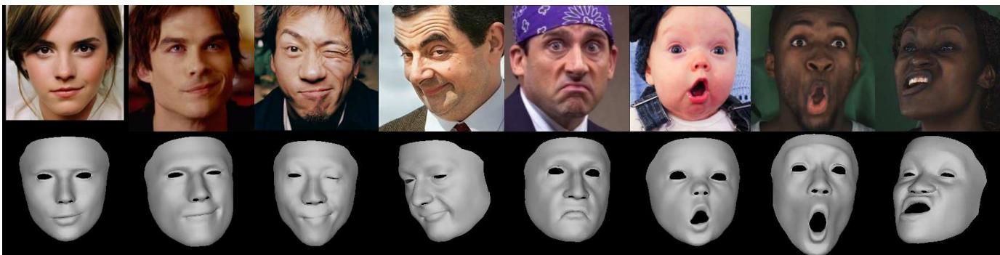
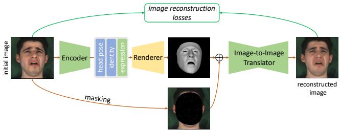
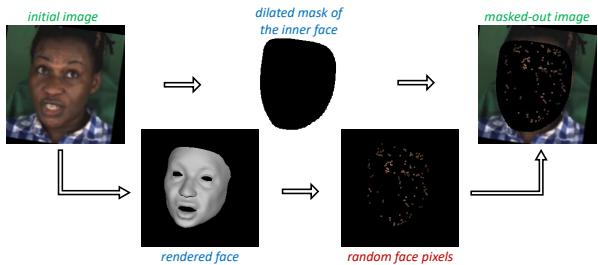
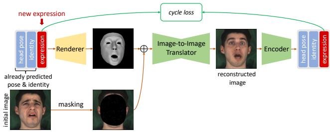
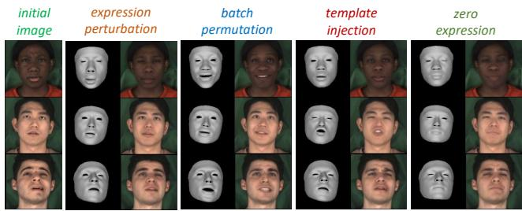
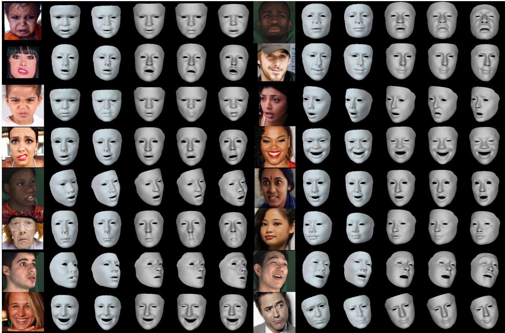
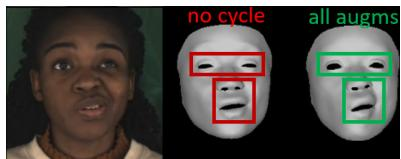
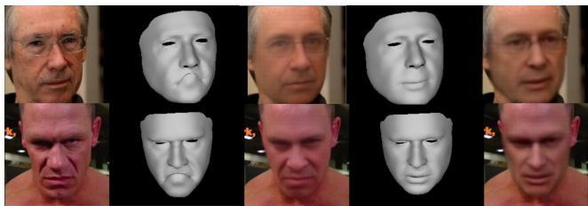

# 3D Facial Expressions through Analysis-by-Neural-Synthesis

George Retsinas1† Panagiotis P. Filntisis1† Radek Daneˇcekˇ 3 Victoria F. Abrevaya3 Anastasios Roussos4 Timo Bolkart3\* Petros Maragos1,2

1Institute of Robotics, Athena Research Center, 15125 Maroussi, Greece 2School of Electrical & Computer Engineering, National Technical University of Athens, Greece 3MPI for Intelligent Systems, Tubingen, Germany¨ 4Institute of Computer Science (ICS), Foundation for Research & Technology - Hellas (FORTH), Greece

  
Figure 1. SMIRK reconstructs 3D faces from monocular images with facial geometry that faithfully recover extreme, asymmetric, and subtle expressions. Top: images of people with challenging expressions. Bottom: SMIRK reconstructions.

## Abstract

While existing methods for 3D face reconstruction from in-the-wild images excel at recovering the overall face shape, they commonly miss subtle, extreme, asymmetric, or rarely observed expressions. We improve upon these methods with SMIRK (Spatial Modelingfor Image-based Reconstruction of Kinesics), which faithfully reconstructs expressive 3D faces from images. We identify two key limitations in existing methods: shortcomings in their self-supervised training formulation, and a lack of expression diversity in the training images. For training, most methods employ differentiable rendering to compare a predicted face mesh with the input image, along with a plethora of additional loss functions. This differentiable rendering loss not only has to provide supervision to optimize for 3D face geometry, camera, albedo, and lighting, which is an ill-posed optimization problem, but the domain gap between rendering and input image further hinders the learning process. Instead, SMIRK replaces the differentiable rendering with a neural rendering module that, given the rendered predicted mesh geometry, and sparsely sampled pixels of the input image, generates a face image. As the neural rendering gets color information from sampled image pixels, supervising with neural rendering-based reconstruction loss can focus solely on the geometry. Further,

it enables us to generate images of the input identity with varying expressions while training. These are then utilized as input to the reconstruction model and used as supervision with ground truth geometry. This effectively augments the training data and enhances the generalization for diverse expressions. Our qualitative, quantitative and particularly our perceptual evaluations demonstrate that SMIRK achieves the new state-of-the art performance on accurate expression reconstruction. For our method’s source code, demo video and more, please visit our project webpage: https://georgeretsi.github.io/smirk/.

## 1. Introduction

Reconstructing 3D faces from single images in-the-wild has been a central goal of computer vision for the last three decades [98] with practical implications in various fields including virtual and augmented reality, entertainment, and telecommunication. Commonly, these methods estimate the parameters of a 3D Morphable Model (3DMM) [12, 26], either through optimization [3, 6–8, 34, 67, 80] or regression with deep learning [16, 18, 20, 28, 29, 33, 46, 65, 66, 70, 75, 82]. Due to the lack of large-scale paired 2D-3D data, most learning-based methods follow a self-supervised training scheme using an analysis-by-synthesis approach [7, 75].

Although there has been a persistent improvement in the accuracy of identity shape reconstruction, as indicated by established benchmarks [28, 70], the majority of works fail to capture the full range of facial expressions, including extreme, asymmetric, or subtle movements which are perceptually significant to humans –see e.g. Fig. 1. Recent works addressed this by augmenting the photometric error with image-based perceptual losses based on expert networks for emotion [18], lip reading [29], or face recognition [32], or with a GAN-inspired discriminator [61]. However, this requires a careful balancing of the different loss terms, and can often produce over-exaggerated facial expressions.

We argue here that the main problem is the shortcomings of the differentiable rendering loss. Jointly optimizing for geometry, camera, appearance, and lighting is an ill-posed optimization problem due to shape-camera [73] and albedolighting [25] ambiguities. Further the loss is negatively impacted by the large domain gap between natural input image and the rendering. The commonly employed Lambertian reflectance model is an over-simplistic approximation of the light-face interaction [26], and it is insufficient to account for hard self-shadows, unusual illumination environments, highly reflective skin, and differences in camera color patterns. This, in turn, can result in sub-optimal reconstructions by providing incorrect guidance during training.

In this work, we introduce a simple but effective analysis-by-neural-synthesis supervision to improve the perceived quality of the reconstructed expressions. For this, we replace the differentiable rendering step of selfsupervised approaches with an image-to-image translator based on U-Net [68]. Given a monochromatic rendering of the geometry together with sparsely sampled pixels of the input image, this U-Net generates an image which is then compared to the input image. Our key observation is that this neural rendering provides more accurate gradients for the task of expressive 3D face reconstruction. This approach has two advantages. First, by providing the rendered predicted mesh without appearance to the generator, the system is forced to rely on the geometry of the rendered mesh for recreating the input, leading to more faithful reconstructions. Second, the generator can create novel images, that modify the expression of the input. We leverage this while training with an expression consistency /augmentation loss. This renders a mesh of the input identity under a novel expression, renders an image with the generator, project the rendering through the encoder, and penalizes the difference between the augmented and the reconstructed expression parameters. By employing parameters from complex and extreme expressions captured under controlled laboratory settings, the network learns to handle non-typical expressions that are underrepresented in the data, promoting generalization. Our extensive experiments demonstrate that

SMIRK faithfully captures a wide range of facial expressions (Fig. 1), including challenging cases such as asymmetric and subtle expressions (e.g., smirking). This result is highlighted by the conducted user study, where SMIRK significantly outperformed all competing methods.

In summary, our contributions are: 1) A method to faithfully recover expressive 3D faces from an input image.2) A novel analysis-by-neural-synthesis supervision that improves the quality of the reconstructed expressions. 3) A cycle-based expression consistency loss that augments expressions during training.

## 2. Related Work

Over the past two decades, the field of monocular 3D face reconstruction has witnessed extensive research and development [26, 98]. Model-free approaches directly regress 3D meshes [4, 19, 22, 27, 43, 69, 71, 74, 87, 89, 92] or voxels [41], or adapt a Signed Distance Function [17, 63, 91] for image fitting. These techniques commonly depend on extensive 3D training data, often generated using a 3D face model. However, this dependency can constrain their expressiveness due to limitations inherent to data creation [4, 19, 27, 41, 43, 69, 87] and disparities between synthetic and real images [22, 71, 92].

Many works estimate parameters of established 3D Morphable Models (3DMMs), like BFM [64], FaceWarehouse [14], or FLAME [53]. This can be achieved using direct optimization procedure in an analysis-by-synthesis framework [3, 6–8, 15, 30, 34, 47, 52, 65, 67, 78–80], but this needs to be applied on novel images every time, which is computationally expensive. Recent deep learning approaches offer fast and robust estimation of 3DMM parameters, using either supervised [16, 36, 46, 66, 82, 83, 94, 96, 97] or selfsupervised training, for which different types of supervision have been proposed and used in combination, with the most important being the following: a) 2D landmarks supervision [20, 28, 55, 70, 72, 75–77, 90] is critical for coarse facial geometry and alignment, but is limited by the sparsity and potential inaccuracy of the predicted landmarks, particularly for complex expressions and poses. Methods that rely on dense landmarks [4, 88] overcome the sparsity problem but their accuracy is limited by the inherent ambiguity of dense correspondences across different faces. b) Photometric constraints [20, 28, 33, 72, 75–77, 90] are particularly effective for facial data, but are susceptible to alignment errors and depend on the quality of the rendered image. c) Perceptual losses have been proven beneficial in aligning the output with human perception [93]. Several methods make use of this by applying perceptual features losses of expert networks for identity recognition [20, 28, 32, 33, 72], emotion [18] or lip articulation [29, 37], but are hard to balance with other terms and can sometimes produce exaggerated results, particularly in terms of expressions.

We explore an alternative approach, where an image-toimage translation model is coupled with a simple photometric error, encouraging more nuanced details to be explained by the geometry.

Closer to our work are methods that simultaneously train a regressor network and an appearance model to improve the photometric error signal. Booth et al. [10, 11] employ a 3DMM for shape estimation coupled with a PCA appearance model learned from images in-the-wild. Grecer et al. [32] extend this idea by using a GAN to model the facial appearance more effectively. [58, 76, 77, 84, 85] learn nonlinear models of shape and expression while training a regressor in a self-supervised manner. Lin et al. [54] refine an initial 3DMM texture while training the regressor. Several other works learn neural appearance models for faces from large datasets [5, 32, 48–50, 57]. In this work, we do not learn a new appearance model, but directly use a generator for better geometry supervision, achieving significantly improved expression estimation. Also related to this work are approaches that train a conditional generative model that transforms a rendering of a mesh model into a realistic image, e.g. [21, 23, 24, 35, 45, 62]. While their focus is on controllable image generation, we investigate here how a generator of average capacity can improve supervision for the task of 3D face reconstruction.

## 3. Method: Analysis-by-Neural-Synthesis

SMIRK is inspired by recent self-supervised face reconstruction methods [18, 28, 29, 94] that combine an analysisby-synthesis approach with deep learning. While the majority of these works produce renderings based on linear statistical models and Lambertian reflectance, SMIRK contributes with a novel neural rendering module that bridges the domain gap between the input and the synthesized output. By minimizing this discrepancy, SMIRK enables a stronger supervision signal within an analysis-by-synthesis framework. Notably, this means that neural-network based losses such as perceptual [42], identity [20, 28], or emotion [18] can be used to compare the reconstructed and input images without the typical domain-gap problem that is present in most works.

## 3.1. Architecture

Face Model: SMIRK employs FLAME [53] to model the 3D geometry of a face, which generates a mesh of $\begin{array} { r l } { n _ { v } } & { { } = } \end{array}$ 5023 vertices based on identity $\beta$ and expression $\psi _ { e x p r }$ parameters, extended with two blendshapes $\psi _ { e y e }$ to account for eye closure [97], as well as jaw rotation $\pmb { \theta } _ { j a w }$ parameters. Additionally, we consider the rigid pose $\theta _ { p o s e }$ and the orthographic camera parameters c. For brevity, we refer to all expression parameters (i.e $\psi _ { e x p r } , \psi _ { e y e }$ and $\pmb \theta _ { j a w } )$ as ψ, and all global transformation parameters (i.e. c and $\theta _ { p o s e } )$ as $\pmb \theta .$

Encoder: The encoder $E ( . )$ is a deep neural network that takes an image I as input and regresses FLAME parameters. We separate E into three different branches, each consisting of a MobilenetV3 [39] backbone: 1) $E _ { \psi }$ , which predicts the expression parameters $\psi , 2 ) E _ { \beta }$ that predicts the shape parameters $\beta ,$ and 3) $E _ { \theta }$ that predicts the global transformation coefficients θ. Formally,

$$
\pmb \theta = E _ { \pmb \theta } ( I ) , \quad \beta = E _ { \beta } ( I ) , \quad \pmb \psi = E _ { \psi } ( I ) .\tag{1}
$$

Since the main focus of this work is on improving $f a -$ cial expression reconstruction, we assume at train time that $E _ { \theta }$ and $E _ { \beta }$ were pre-trained and remain frozen. Note that unlike previous methods [18, 28, 29], E does not predict albedo parameters since the neural rendering module does not require such explicit information.

Neural Renderer: The neural renderer is designed to replace traditional graphics-based rendering with an imageto-image convolutional network T. The key idea here is to provide $T$ with an input image where the face is masked out and only a small number of randomly sampled pixels within the mask remain, along with the predicted facial geometry from the encoder E. By limiting the available relevant information from the input image, $T$ is forced to rely on the predicted geometry from E to accurately reconstruct it.

Formally, let $\begin{array} { r l r } { S } & { { } = } & { R ( \theta , \beta , \psi ) } \end{array}$ denote the output of the differentiable rasterization step, where $S$ is the monochrome rendering of the reconstructed face mesh. The masking function $M ( \cdot )$ is applied to the input image I, masking out the face and retaining only a small amount of random pixels within the mask. $M ( I )$ is then concatenated with $S ,$ and the resulting tensor is passed through the neural renderer $T$ to produce a reconstruction of the original image ${ \cal I ^ { \prime } } = T ( S \oplus M ( I ) )$ , where ⊕ denotes concatenation. A crucial property of this module is to assist the gradient flow towards the encoder. Therefore, we adopt a U-Net architecture [40, 68, 95] for $T ,$ , since the shortcuts will allow the gradient to flow uninterrupted towards E (an ablation study on this can be found in the Suppl. Mat.).

## 3.2. Optimization of the SMIRK Components

SMIRK is supervised with two separate training passes: a reconstruction path and an augmented expression cycle path. We alternate between these passes on each training iteration, optimizing their respective losses. We describe each in the following subsections.

## 3.2.1 Reconstruction Path

In the reconstruction path (Fig. 2), the encoder E regresses FLAME parameters from the input image I and the resulting 3D face is rendered to obtain S. Next, I is masked out using the masking function $M ( . )$ , is concatenated with $S ,$ and fed into $T$ to obtain a reconstruction of the input image $I ^ { \prime } .$

  
Figure 2. Reconstruction pass. An input image is passed to the encoder which regresses FLAME and camera parameters. A 3D shape is reconstructed, rendered with a differentiable rasterizer and finally translated into the output domain with the image translation network. Then, standard self-supervised landmark, photometric and perceptual losses are computed.

  
Figure 3. Masking Process. An input image is masked to obscure the face (upper path), then we sample random pixels to be unmasked (lower path)

Masking: To promote the reliance of $T$ on the 3D rendered face for reconstructing I, we need to mask out the face in the input image I. We do that by using the convex hull of detected 2D landmarks [13], dilated so that it fully covers the face. However, without any information of the face interior, training the translator becomes challenging since texture information, such as skin color, facial hair or even accessories (e.g., glasses) are “distractors” that complicate training. To address this we randomly sample and retain a small amount of pixels (1%) that are used as guidance for the image reconstruction. Note that sampling too many pixels makes the reconstruction overly guided and the 3D rendered face does not control the reconstruction output. We observed a similar behavior when we tried to randomly mask out blocks of the image, as in [38]. The masking process is depicted in Fig. 3.

Loss functions: The reconstruction path is supervised with the following loss functions:

Photometric loss. This is the L1 error between the input and the output images: $\mathcal { L } _ { p h o t o } = \| I ^ { \prime } - I \| _ { 1 }$ 1.

VGG loss. The VGG loss [42] has a similar effect to the photometric one, but helps to converge faster in the initial phases of training: $\mathcal { L } _ { v g g } = \| \Gamma ( I ^ { \prime } ) - \Gamma ( I ) \| _ { 1 }$ , where Γ(.) represents the VGG perceptual encoder.

Landmark loss. The landmark loss, denoted as $L _ { l m k } =$ $\begin{array} { r } { \sum _ { i = 1 } ^ { K } \left\| \mathbf { k } - \mathbf { k } ^ { \prime } \right\| _ { 2 } ^ { 2 } , } \end{array}$ measures the $L _ { 2 }$ norm between the ground-truth 2D facial landmarks detected in the input image (k) and the 2D landmarks projected from the predicted 3D mesh $( \mathbf { k } ^ { \prime } )$ , summed over K landmarks.

  
Figure 4. Augmented cycle pass. The FLAME expression parameters of an existing reconstruction are modified. The resulting modified face is then rendered using our neural renderer. The rendering is then passed to the face reconstruction encoder to regress the FLAME parameters and a consistency loss between the modified input and reconstructed FLAME parameters is computed.

Expression Regularization. We employ an $L _ { 2 }$ regularization over the expression parameters $L _ { r e g } = \| \psi \| _ { 2 } ^ { 2 } , \mathsf { p e } .$ nalizing extreme, unrealistic expressions.

Emotion Loss. Finally, to obtain reconstructions that faithfully capture the emotional content, we employ an emotion loss $\mathcal { L } _ { e m o }$ based on features extracted from a pretrained emotion recognition network $P _ { e } ,$ , as in EMOCA [18]: $\mathcal { L } _ { e m o } = \| P _ { e } ( I ^ { \prime } ) - P _ { e } ( I ) \| _ { 2 } ^ { 2 }$ . To prevent the image translator from adversarially optimizing the emotion loss by perturbing a few pixels, for this loss we keep the image translator $T ^ { \bullet } \mathbf { f r o z e n } ^ { \prime \bullet }$ , optimizing only the expression encoder $E _ { \psi }$ . Note that unlike EMOCA, our framework ensures that the emotion loss does not suffer from domain gap problems, as the compared images reside in the same space.

## 3.2.2 Augmented Expression Cycle Path

While the reconstruction path improves 3D reconstruction thanks to the better supervision signal provided by the neural module, it is still affected by a lack of expression diversity in the training datasets - a problem shared by all previous methods. This means for example that if a more complex lip structure, scarcely seen in the training data, cannot be reproduced fast enough by the encoder, the translator T could learn to correlate miss-aligned lip 3D structures and images and thus multiple similar, but distinct, facial expressions will be collapsed to a single reconstructed representation. Further, this may lead to the translator compensating for the encoder’s failures during the joint optimization.

These issues are addressed with the augmented expression cycle consistency path. In this path, we start from the predicted set $\beta , \psi , \theta ,$ and replace the original predicted expression $\psi$ with a new one $\psi _ { a u g } .$ . We then use the translator $T$ to generate a photorealistic image $I _ { a u g } ^ { \prime }$ which adheres to it. This process effectively synthesizes an augmented training pair of $\psi _ { a u g }$ and the corresponding output image $I _ { a u g } ^ { \prime } .$ Then, the image is fed into E which should perfectly recover $\psi _ { a u g } .$ . A cycle consistency loss can now be directly applied in the expression parameter space of the 3D model, enforcing the predicted expression to be as close as possible to the initial one. This concept is illustrated in Fig. 4.

The benefit of this cycle path is two-fold: 1) it reduces over-compensation errors via the consistency loss and 2) it promotes diverse expressions. The latter further helps consistency by avoiding the collapse of neighboring expressions into a single parameter representation. Concerning the consistency property, we can distinguish two overcompensating factors. First, during the joint optimization of the encoder and the translator, the latter can compensate when the encoder provides erroneous predictions, leading to an overall sub-par reconstruction. Second, if we discard the consistency loss, the expression will try to over-compensate erroneous shape/pose, since we assume the shape/pose parameters are predicted from an already trained system and they are not optimized in our framework. As an example, if the shape parameters do not fully capture an elongated nose, which is an identity characteristic of the person, the expression parameters may compensate this error. Such behavior is problematic because it entangles expression, shape and pose and adds undesired biases during training.

Pixel Transfer: The masking process retains a small amount of pixels within the face area. However, when a new expression is introduced, the previously selected pixels need to be updated and transferred such that they correspond with the vertices of the new expression. This operation is referred to as pixel transfer, where we sample pixels from the initial image according to a selected set of vertices, we then find the new position of the same vertices for the updated expression, and we assign their position as the new pixel, with the initial pixel value. This avoids inconsistencies between the underlying structure of the pixels (initial expression) and the new expression, which would hinder realistic reconstructions in the cycle path.

Promoting Diverse Expressions: Ideally, in this path we also want to promote high variations in the expression parameter space, generating shapes (and their corresponding images) with complex, rare and asymmetric expressions that are still plausible. To effectively augment the cycle path with interesting variations we consider the following augmentations:

• Permutation: permute the expressions in a batch.

• Perturbation: add non-trivial noise to the reconstructed expression parameters.

• Template Injection: use expression templates of extreme expressions. To obtain such parameters for FLAME we perform direct iterative parameter fitting on the FaMoS [9] dataset which depicts multiple subjects perform extreme and asymmetric expressions.

  
Figure 5. Neural expression augmentation. Our neural renderer enables us to modify the expression, generating a new image-3D training pair. We can edit the expression with random noise, permutation from other reconstructions, template injection, or zeroing.

• Zero Expression: neutral expressions help avoid biasing the system towards complex cases.

For all expression augmentations, we simultaneously simulate jaw and eyelid openings/closings, with more aggressive augmentations in the zero-expression case to avoid incompatible blending with intense expressions. Fig. 5 presents visual examples of all augmentations and the corresponding generated images from T, showcasing its ability to generate realistic images with notable expression manipulation.

## Loss functions:

Expression Consistency. The expression consistency loss, or cycle loss for brevity, is the mean-squared error between the given augmented expression parameters $\psi _ { a u g }$ and the predicted expressions at the end of the cycle path:

$$
\mathcal { L } _ { e x p } = | | E _ { \psi } ( T ( R ( \theta , \beta , \psi _ { a u g } ) \oplus M ( I ) ) ) - \psi _ { a u g } | | _ { 2 } ^ { 2 }\tag{2}
$$

The pose/cam and shape parameters are kept as predicted by the initial image, namely $\pmb \theta = E _ { \pmb \theta } ( I )$ and $\beta = E _ { \beta } ( I )$ . The internal $E _ { \psi } ( I )$ operation, inside the renderer $R ( \cdot )$ , does not allows gradients to flow through and is used as an off-theself frozen module.

Identity Consistency. To aid the translator in faithfully reconstructing the identity of the person, we introduce an additional consistency loss similar to Eq. 2, applied to the shape parameters $\beta .$ Note that since the shape encoder $E _ { \beta }$ is frozen, the consistency loss only affects the optimization of the translator T.

Alternating Optimization: Overall, we alternate between the two passes, aiming to further reduce the effect of the translator compensating for the encoder. In more detail, during the augmented cycle pass, we freeze alternatively the encoder and the translator. Thus, this pass avoids the joint optimization of the two networks in a single step, acting as a regularizer to the other pass and enforcing consistency.

## 4. Results

We now present objective and subjective evaluations of our method, along with comparisons with recent state of the art. Additional experimental evaluations and visualizations can be found in our Suppl. Mat. and demo video.

## 4.1. Experimental Setup

Training Datasets: We use the following datasets for training: FFHQ [44], CelebA [56], LRS3 [1], and MEAD [86]. LRS3 and MEAD are video datasets, and we randomly sample images from each video during training.

SOTA Methods: We compare with the following recent state-of-the-art methods that have publicly available implementations: DECA [28] and EMOCA v2 [18, 29], which use the FLAME [53] model, and Deep3DFace [20] and FO-CUS [51], which use the BFM [64] model.

Pretraining: Before the core training stage, all three encoders are pretrained, supervised by two losses - the landmark loss of the reconstruction for pose and expression and the shape predictions of MICA [97]. After that, $E _ { \beta }$ and $E _ { \theta }$ remain frozen.

## 4.2. Quantitative Evaluations

It has been consistently reported [2, 18, 29, 31, 60] that evaluating facial expression reconstruction in terms of geometric metrics is ill-posed. The geometric errors tend to be dominated by the identity face shape and do not correlate well with human perception of facial expressions. Accordingly, we compare our method in a quantitative manner with three experiments: 1) emotion recognition accuracy [18], 2) ability of a model to guide a UNet to faithfully reconstruct an input image, and 3) a perceptual user study.

Emotion Recognition: Following the protocol of [18], we train an MLP to classify eight basic expressions and regress valence and arousal values using AffectNet [59]. We report Concordance Correlation Coefficient (CCC), root mean square error (RMSE), for both valence (V-) and arousal (A-), and expression classification accuracy (E-ACC). Results are found in Tab. 1. As it can be seen, SMIRK achieves a higher emotion recognition score compared to most other methods, although falling behind EMO-CAv1/2 and Deep3DFace. It is worth noting that, although EMOCA v1 achieves the highest emotion accuracy, it often overexaggerates expressions which helps with emotion recognition. EMOCA v2, arguably a more accurate reconstruction model, performs slightly worse. Our main model is comparable with Deep3DFace and outperforms DECA and FOCUS. We can also train a model that scores better on emotion recognition, by increasing the emotion loss weight. However, similarly to what was reported by Daneˇcek etˇ al. [18], this leads to undesirable artifacts. We discuss the trade-off between higher emotion recognition scores and reconstruction accuracy in more detail in Sup.Mat. Notably, even without the emotion loss, the proposed model achieves a decent emotion recognition score, indicating that our reconstruction scheme can adequately capture emotions without the need for explicit perceptual supervision.

<table><tr><td>Model</td><td>|V-CCC ↑ V-RMSE ↓|A-CCC ↑ A-RMSE↓E-ACC ↑</td><td></td><td></td><td></td></tr><tr><td>MGCNet</td><td>0.69</td><td>0.35 0.58</td><td>0.34</td><td>0.60</td></tr><tr><td>3DDFA-v2</td><td>0.62 0.39</td><td>0.50</td><td>0.34</td><td>0.52</td></tr><tr><td>Deep3DFace</td><td>0.73 0.33</td><td>0.65</td><td>0.31</td><td>0.65</td></tr><tr><td>DECA</td><td>0.69 0.36</td><td>0.58</td><td>0.33</td><td>0.59</td></tr><tr><td>FOCUS-CelebA</td><td>0.69 0.35</td><td>0.54</td><td>0.33</td><td>0.58</td></tr><tr><td>EMOCA v1</td><td>0.77 0.31</td><td>0.68</td><td>0.30</td><td>0.68</td></tr><tr><td>EMOCA v2</td><td>0.76 0.33</td><td>0.66</td><td>0.30</td><td>0.66</td></tr><tr><td>SMIRK</td><td>0.72 0.35</td><td>0.61</td><td>0.31</td><td>0.64</td></tr><tr><td>SMIRK w/o emo</td><td>0.71 0.35</td><td>0.60</td><td>0.32</td><td>0.62</td></tr></table>

Table 1. Emotion recognition performance on the AffectNet test set [59]. We follow the same metrics as in [18].

Reconstruction Loss: In order to evaluate the faithfulness of a 3D face reconstruction technique, we have devised a protocol based on our analysis-by-neural-synthesis method. Under this protocol, we train a UNet image-toimage translator, but freeze the weights of the encoder so that only the translator is trained. The motivation is simple: if the 3D mesh is accurate enough, the reconstruction will be more faithful, due to a one-to-one appearance correspondence. For each method (including ours for fairness), we train a UNet for 5 epochs, using the masked image and the rendered 3D geometry as input. Finally, we report the $L _ { 1 }$ reconstruction loss and the VGG loss between the reconstructed image and the input image on the test set of AffectNet [59] which features subjects under multiple expressions. The results can be seen in Table 2. We observe here that using the information for the rendered shape geometry of SMIRK, the trained UNet achieves a more faithful reconstruction of the input image when compared to DECA and EMOCAv2. Particularly for EMOCAv2, we observe that although it can capture expressions, the results in many cases do not faithfully represent the input image, leading to an overall worse image reconstruction error. In terms of L1 loss, SMIRK is on par with Deep3DFace and FOCUS and has a small improvement in terms of VGG loss.

<table><tr><td></td><td>DECA</td><td>EMOCAv2</td><td>FOCUS</td><td>Deep3DFace</td><td>SMIRK</td></tr><tr><td>L1 Loss ↓</td><td>0.10</td><td>0.11</td><td>0.09</td><td>0.09</td><td>0.09</td></tr><tr><td>VGG Loss ↓</td><td>0.80</td><td>0.84</td><td>0.78</td><td>0.78</td><td>0.76</td></tr></table>

Table 2. Image reconstruction performance on the AffectNet test set [59]. SMIRK achieves better reconstruction and perceptual scores compared to other methods.

User Study: Arguably, the perception of the reconstructed facial expressions is the most important aspect in 3D face reconstruction, as it directly influences how well the reconstructed model captures the emotions and nuances of the original face. Considering this, we also designed a user study to assess the perception of the reconstructed facial expressions from human participants. We randomly selected 80 images from the AffectNet [59] test set (using the split from [81]) and 80 images from our MEAD test set (unseen subjects) and performed 3D face reconstruction with both SMIRK and its competitors. To mitigate bias w.r.t. the identity component for the FLAME-based methods, for DECA and EMOCAv2 we used the same identity parameters as our method (which itself was distilled from MICA). In the user study, participants were shown an image of a human face alongside two 3D face reconstructions, either from our method or the others, and were asked to choose the one with the most faithful facial expression representation. The order was randomized for each question, and each user answered a total of 32 questions, equally distributed among the different methods.

  
Figure 6. Visual comparison of 3D face reconstruction. From left to right: Input, Deep3DFaceRecon[20], FOCUS[51], DECA[28], EMOCAv2[18], and SMIRK. Many more examples can also be found in the Suppl. Mat. and the demo video in our webpage.

A total of 85 users completed the study, and the results in Table 3 show that our method was significantly preferred over all competitors, confirming the performance of SMIRK in terms of faithful expressive 3D reconstruction. The results were statistically significant (for all pairs, p < 0.01 with binomial test, adjusted using the Bonferroni method). EMOCAv2, which also uses an emotion loss for expressive 3D reconstruction, was the closest competitor to our method, followed by FOCUS and Deep3D, while DECA was the least selected.

<table><tr><td rowspan=1 colspan=1></td><td rowspan=1 colspan=1>DECA</td><td rowspan=1 colspan=1>EMOCAv2</td><td rowspan=1 colspan=1>Deep3D</td><td rowspan=1 colspan=1>FOCUS</td></tr><tr><td rowspan=1 colspan=1>SMIRK</td><td rowspan=1 colspan=1>603/77</td><td rowspan=1 colspan=1>461/219</td><td rowspan=1 colspan=1>510/170</td><td rowspan=1 colspan=1>534/146</td></tr></table>

Table 3. User study results: “a/b” indicates Ours (left) was preferred a times, while the competing method was chosen b times. SMIRK is overwhelmingly preferred over all other methods.

## 4.3. Visual Examples

In Fig. 6 we present multiple visual comparisons with the four other methods. As it can be visually assessed, our method can more accurately capture the facial expressions across multiple diverse subjects and conditions. Furthermore, the presented methodology can also capture expressions that other methods fail to capture, such as nonsymmetric mouth movements, eye closures, and exaggerated expressions.

## 4.4. Ablation Studies

Ablation on the effect of landmarks: We first assess the effect of the landmark loss. To do that, we calculate for different versions of our model the L1 loss, VGG Loss, and Cycle loss after manipulation of expressions using the same protocol we performed in Sec. 4.2. Note that this time, we also evaluate performance by considering the cycle loss. That is, we also manipulate the predicted expressions, regenerate a new image, and expect that the method can successfully predict the same parameters. We consider three different versions of our model: 1) Protocol 1 - no landmarks loss, 2) Protocol 2 - training some epochs with landmarks loss and then removing it, 3) Protocol 3 - full training with landmarks loss. We present these results in Table 4.

As we can see, completely omitting landmarks leads to degraded results. However, if we first train for a few epochs with landmarks and then set the loss weight to 0, the model achieves very similar performance with the original model which uses the loss throughout the full training. These results suggest that, in contrast with previous works [18, 28], the landmarks loss in SMIRK acts more as a regularizer during training, helping to guide the model towards good solutions, but in the later stages it may somewhat constrain its flexibility. We plan to explore this balance in more depth in future work.

<table><tr><td rowspan=1 colspan=1></td><td rowspan=1 colspan=1>L1 Loss ↓</td><td rowspan=1 colspan=1>VGG Loss↓</td><td rowspan=1 colspan=1>Cycle Loss ↓</td></tr><tr><td rowspan=1 colspan=1>P1</td><td rowspan=1 colspan=1>0.111</td><td rowspan=1 colspan=1>0.757</td><td rowspan=1 colspan=1>0.588</td></tr><tr><td rowspan=1 colspan=1>P2</td><td rowspan=1 colspan=1>0.093</td><td rowspan=1 colspan=1>0.713</td><td rowspan=2 colspan=1>0.4870.544</td></tr><tr><td rowspan=1 colspan=1>P3</td><td rowspan=1 colspan=1>0.093</td><td rowspan=1 colspan=1>0.714</td></tr></table>

Table 4. Ablation study on the effect of landmark loss. P1: no landmark loss, P2: landmark loss removed after a few epochs, P3: landmark loss throughout whole training.

Impact of Cycle Path: Here we also present examples on how the cycle path affects the reconstruction performance. First, we show an example result in Fig. 7, where we see that using the proposed augmentations provides more detailed expressions. For example, template injection augmentation considerably helps the reconstruction of the mouth structure. Secondly, we have also observed that the cycle path makes the model more robust, especially w.r.t. mouth closures (e.g. zero jaw opening). We show such indicative cases in Figure 8. Such artifacts can be seen when using the no-cycle variant, acting as a visual confirmation of the aforementioned numerical results. Here, the mouth is not properly closed in the 3D reconstructed face, since it was miss-corresponded to a properly closed mouth in the image reconstruction space. The cycle path can solve such instances by providing tweaked expressions that are enforced to be recognized correctly, avoiding “misalignments” between expected expressions and reconstructed images.

Figure 7. Impact of cycle augmentations. From left to right: input image, no cycle loss, cycle loss with all augmentations.  
  
Figure 8. Impact of the Cycle Path. Artifacts can appear when not training with the cycle path. From left to right: input image, 3D reconstruction and image reconstruction without cycle path, 3D reconstruction and image reconstruction with cycle path.

## 4.5. Limitations

Despite the effectiveness of SMIRK, there are limitations to be addressed. It is sensitive to occlusions, as the training datasets do not include them, and assumes more intense expressions when parts are missing instead of extrapolating from available information. In addition, SMIRK has been trained on single images, and the temporal aspect is not yet explored. Also note that while SMIRK does not need to predict albedo and lighting, this can be limiting for specific applications in 3D facial animation and video editing. Please refer to the Suppl. Mat. for a more detailed discussion.

## 5. Conclusion

We have presented SMIRK, a new paradigm for accurate expressive 3D face reconstruction from images. Instead of the traditional graphics-based approach for self-supervision which is commonly used for monocular 3D face reconstruction in-the-wild, SMIRK employs a neural image-to-image translator model, which learns to reconstruct the input face image given the rendered predicted facial geometry. Our extensive experimental results show that SMIRK outperforms previous methods and can faithfully reconstruct expressive 3D faces, including challenging complex expressions such as asymmetries, and subtle expressions such as smirking.

## Acknowledgments

This research work was supported by the project “Applied Research for Autonomous Robotic Systems” (MIS 5200632) which is implemented within the framework of the National Recovery and Resilience Plan “Greece 2.0” (Measure: 16618- Basic and Applied Research) and is funded by the European Union- NextGenerationEU.

## References

[1] Triantafyllos Afouras, Joon Son Chung, and Andrew Zisserman. Lrs3-ted: a large-scale dataset for visual speech recognition. arXiv preprint arXiv:1809.00496, 2018. 6

[2] Zakaria Aldeneh, Masha Fedzechkina, Skyler Seto, Katherine Metcalf, Miguel Sarabia, Nicholas Apostoloff, and Barry-John Theobald. Towards a Perceptual Model for Estimating the Quality of Visual Speech, 2022. arXiv:2203.10117 [cs, eess]. 6

[3] Oswald Aldrian and William AP Smith. Inverse rendering of faces with a 3d morphable model. IEEE transactions on pattern analysis and machine intelligence, 35(5):1080–1093, 2012. 1, 2

[4] Riza Alp Guler, George Trigeorgis, Epameinondas Antonakos, Patrick Snape, Stefanos Zafeiriou, and Iasonas Kokkinos. Densereg: Fully convolutional dense shape regression in-the-wild. In Proceedings of the IEEE conference on computer vision and pattern recognition, pages 6799–6808, 2017. 2

[5] Haoran Bai, Di Kang, Haoxian Zhang, Jinshan Pan, and Linchao Bao. FFHQ-UV: Normalized facial uv-texture dataset for 3d face reconstruction. In Proceedings of the IEEE/CVF Conference on Computer Vision and Pattern Recognition, pages 362–371, 2023. 3

[6] Anil Bas, William A. P. Smith, Timo Bolkart, and Stefanie Wuhrer. Fitting a 3D morphable model to edges: A comparison between hard and soft correspondences. In Asian Conference on Computer Vision Workshops, pages 377–391, 2017. 1, 2

[7] Volker Blanz and Thomas Vetter. A morphable model for the synthesis of 3D faces. In Proceedings ofthe 26th Annual Conference on Computer Graphics and Interactive Techniques (SIGGRAPH), 1999. 2

[8] Volker Blanz, Sami Romdhani, and Thomas Vetter. Face identification across different poses and illuminations with a 3D morphable model. In International Conference on Automatic Face & Gesture Recognition (FG), pages 202–207, 2002. 1, 2

[9] Timo Bolkart, Tianye Li, and Michael J Black. Instant multiview head capture through learnable registration. In Proceedings of the IEEE/CVF Conference on Computer Vision and Pattern Recognition, pages 768–779, 2023. 5

[10] James Booth, Epameinondas Antonakos, Stylianos Ploumpis, George Trigeorgis, Yannis Panagakis, and Stefanos Zafeiriou. 3d face morphable models” in-thewild”. In Proceedings of the IEEE conference on computer vision and pattern recognition, pages 48–57, 2017. 3

[11] James Booth, Anastasios Roussos, Evangelos Ververas, Epameinondas Antonakos, Stylianos Ploumpis, Yannis Panagakis, and Stefanos Zafeiriou. 3D reconstruction of “inthe-wild” faces in images and videos. IEEE transactions on pattern analysis and machine intelligence, 40(11):2638– 2652, 2018. 3

[12] Alan Brunton, Augusto Salazar, Timo Bolkart, and Stefanie Wuhrer. Review of statistical shape spaces for 3D data with comparative analysis for human faces. Computer Vision and Image Understanding (CVIU), 128:1–17, 2014. 1

[13] Adrian Bulat and Georgios Tzimiropoulos. How far are we from solving the 2d & 3d face alignment problem?(and a dataset of 230,000 3d facial landmarks). In Proceedings of the IEEE International Conference on Computer Vision, pages 1021–1030, 2017. 4

[14] Chen Cao, Yanlin Weng, Shun Zhou, Yiying Tong, and Kun Zhou. Facewarehouse: A 3d facial expression database for visual computing. IEEE Transactions on Visualization and Computer Graphics, 20(3):413–425, 2013. 2

[15] Chen Cao, Qiming Hou, and Kun Zhou. Displaced dynamic expression regression for real-time facial tracking and animation. Transactions on Graphics (TOG), 33(4):1–10, 2014. 2

[16] Feng-Ju Chang, Anh Tuan Tran, Tal Hassner, Iacopo Masi, Ram Nevatia, and Gerard Medioni. ExpNet: Landmark-free, deep, 3D facial expressions. In International Conference on Automatic Face & Gesture Recognition (FG), pages 122– 129, 2018. 1, 2

[17] Aggelina Chatziagapi, ShahRukh Athar, Francesc Moreno-Noguer, and Dimitris Samaras. Sider: Single-image neural optimization for facial geometric detail recovery. In 2021 International Conference on 3D Vision (3DV), pages 815– 824. IEEE, 2021. 2

[18] Radek Daneˇcek, Michael J Black, and Timo Bolkart.ˇ EMOCA: Emotion driven monocular face capture and animation. In Conference on Computer Vision and Pattern Recognition (CVPR), pages 20311–20322, 2022. 1, 2, 3, 4, 6, 7, 8

[19] Jiankang Deng, Jia Guo, Evangelos Ververas, Irene Kotsia, and Stefanos Zafeiriou. Retinaface: Single-shot multilevel face localisation in the wild. In Proceedings of the IEEE/CVF conference on computer vision and pattern recognition, pages 5203–5212, 2020. 2

[20] Yu Deng, Jiaolong Yang, Sicheng Xu, Dong Chen, Yunde Jia, and Xin Tong. Accurate 3D face reconstruction with weakly-supervised learning: From single image to image set. In Conference on Computer Vision and Pattern Recognition Workshops (CVPR-W), pages 285–295, 2019. 1, 2, 3, 6, 7

[21] Zheng Ding, Xuaner Zhang, Zhihao Xia, Lars Jebe, Zhuowen Tu, and Xiuming Zhang. Diffusionrig: Learning personalized priors for facial appearance editing. In Proceedings of the IEEE/CVF Conference on Computer Vision and Pattern Recognition, pages 12736–12746, 2023. 3

[22] Pengfei Dou, Shishir K. Shah, and Ioannis A. Kakadiaris. End-to-end 3D face reconstruction with deep neural networks. In Conference on Computer Vision and Pattern Recognition (CVPR), pages 5908–5917, 2017. 2

[23] Michail Christos Doukas, Mohammad Rami Koujan, Viktoriia Sharmanska, Anastasios Roussos, and Stefanos Zafeiriou. Head2head++: Deep facial attributes re-targeting. IEEE Transactions on Biometrics, Behavior, and Identity Science, 3(1):31–43, 2021. 3

[24] Michail Christos Doukas, Stefanos Zafeiriou, and Viktoriia Sharmanska. Headgan: One-shot neural head synthesis and editing. In Proceedings ofthe IEEE/CVF International conference on Computer Vision, pages 14398–14407, 2021. 3

[25] Bernhard Egger. Semantic Morphable Models. PhD thesis, University of Basel, 2018. 2

[26] Bernhard Egger, William A. P. Smith, Ayush Tewari, Stefanie Wuhrer, Michael Zollhoefer, Thabo Beeler, Florian Bernard, Timo Bolkart, Adam Kortylewski, Sami Romdhani, Christian Theobalt, Volker Blanz, and Thomas Vetter. 3D morphable face models—past, present, and future. Transactions on Graphics (TOG), 39(5), 2020. 1, 2

[27] Yao Feng, Fan Wu, Xiaohu Shao, Yanfeng Wang, and Xi Zhou. Joint 3d face reconstruction and dense alignment with position map regression network. In European Conference on Computer Vision (ECCV), 2018. 2

[28] Yao Feng, Haiwen Feng, Michael J Black, and Timo Bolkart. Learning an animatable detailed 3D face model from in-thewild images. Transactions on Graphics, (Proc. SIGGRAPH), 40(4):1–13, 2021. 1, 2, 3, 6, 7, 8

[29] Panagiotis P. Filntisis, George Retsinas, Foivos Paraperas-Papantoniou, Athanasios Katsamanis, Anastasios Roussos, and Petros Maragos. SPECTRE: Visual speech-informed perceptual 3D facial expression reconstruction from videos. In Conference on Computer Vision and Pattern Recognition Workshops (CVPR-W), pages 5745–5755, 2023. 1, 2, 3, 6

[30] Pablo Garrido, Michael Zollhofer, Dan Casas, Levi Val-¨ gaerts, Kiran Varanasi, Patrick Perez, and Christian´ Theobalt. Reconstruction of personalized 3d face rigs from monocular video. ACM Transactions on Graphics (TOG), 35 (3):1–15, 2016. 2

[31] Pablo Garrido, Michael Zollhofer, Chenglei Wu, Derek¨ Bradley, Patrick Perez, Thabo Beeler, and Christian´ Theobalt. Corrective 3d reconstruction of lips from monocular video. ACM Trans. Graph., 35(6):219–1, 2016. 6

[32] Baris Gecer, Stylianos Ploumpis, Irene Kotsia, and Stefanos Zafeiriou. GANFIT: Generative adversarial network fitting for high fidelity 3D face reconstruction. In Conference on Computer Vision and Pattern Recognition (CVPR), pages 1155–1164, 2019. 2, 3

[33] Kyle Genova, Forrester Cole, Aaron Maschinot, Aaron Sarna, Daniel Vlasic, and William T. Freeman. Unsupervised training for 3D morphable model regression. In Conference on Computer Vision and Pattern Recognition (CVPR), pages 8377–8386, 2018. 1, 2

[34] Thomas Gerig, Andreas Morel-Forster, Clemens Blumer, Bernhard Egger, Marcel Luthi, Sandro Schoenborn, and Thomas Vetter. Morphable face models - an open framework. In International Conference on Automatic Face & Gesture Recognition (FG), pages 75–82, 2018. 1, 2

[35] Partha Ghosh, Pravir Singh Gupta, Roy Uziel, Anurag Ranjan, Michael J Black, and Timo Bolkart. GIF: Generative interpretable faces. In 2020 International Conference on 3D Vision (3DV), pages 868–878. IEEE, 2020. 3

[36] Jianzhu Guo, Xiangyu Zhu, Yang Yang, Fan Yang, Zhen Lei, and Stan Z Li. Towards fast, accurate and stable 3d dense face alignment. In Proceedings of the European Conference on Computer Vision (ECCV), 2020. 2

[37] Shan He, Haonan He, Shuo Yang, Xiaoyan Wu, Pengcheng Xia, Bing Yin, Cong Liu, Lirong Dai, and Chang Xu. Speech4mesh: Speech-assisted monocular 3d facial reconstruction for speech-driven 3d facial animation. In Proceedings of the IEEE/CVF International Conference on Computer Vision, pages 14192–14202, 2023. 2

[38] Xingzhe He, Bastian Wandt, and Helge Rhodin. Autolink: Self-supervised learning of human skeletons and object outlines by linking keypoints. Advances in Neural Information Processing Systems, 35:36123–36141, 2022. 4

[39] Andrew Howard, Mark Sandler, Grace Chu, Liang-Chieh Chen, Bo Chen, Mingxing Tan, Weijun Wang, Yukun Zhu, Ruoming Pang, Vijay Vasudevan, et al. Searching for mobilenetv3. In Proceedings of the IEEE/CVF international conference on computer vision, pages 1314–1324, 2019. 3

[40] Phillip Isola, Jun-Yan Zhu, Tinghui Zhou, and Alexei A. Efros. Image-to-image translation with conditional adversarial networks. CoRR, abs/1611.07004, 2016. 3

[41] Aaron S Jackson, Adrian Bulat, Vasileios Argyriou, and Georgios Tzimiropoulos. Large pose 3D face reconstruction from a single image via direct volumetric CNN regression. In International Conference on Computer Vision (ICCV), pages 1031–1039, 2017. 2

[42] Justin Johnson, Alexandre Alahi, and Li Fei-Fei. Perceptual losses for real-time style transfer and super-resolution. In Computer Vision–ECCV 2016: 14th European Conference, Amsterdam, The Netherlands, October 11-14, 2016, Proceedings, Part II 14, pages 694–711. Springer, 2016. 3, 4

[43] Harim Jung, Myeong-Seok Oh, and Seong-Whan Lee. Learning free-form deformation for 3D face reconstruction from in-the-wild images. In International Conference on Systems, Man, and Cybernetics (SMC), pages 2737–2742, 2021. 2

[44] Tero Karras, Samuli Laine, and Timo Aila. A style-based generator architecture for generative adversarial networks. In Proceedings of the IEEE/CVF conference on computer vision and pattern recognition, pages 4401–4410, 2019. 6

[45] Hyeongwoo Kim, Pablo Garrido, Ayush Tewari, Weipeng Xu, Justus Thies, Matthias Nießner, Patrick Perez, Christian´ Richardt, Michael Zollofer, and Christian Theobalt. Deep¨ video portraits. ACM Transactions on Graphics (TOG), 37 (4):163, 2018. 3

[46] Hyeongwoo Kim, Michael Zollhofer, Ayush Tewari, Justus¨ Thies, Christian Richardt, and Christian Theobalt. Inverse-FaceNet: deep monocular inverse face rendering. In Conference on Computer Vision and Pattern Recognition (CVPR), pages 4625–4634, 2018. 1, 2

[47] Tatsuro Koizumi and William A. P. Smith. ”look ma, no landmarks!” - unsupervised, model-based dense face alignment. In European Conference on Computer Vision (ECCV), pages 690–706, 2020. 2

[48] Alexandros Lattas, Stylianos Moschoglou, Baris Gecer, Stylianos Ploumpis, Vasileios Triantafyllou, Abhijeet Ghosh, and Stefanos Zafeiriou. AvatarMe: Realistically renderable 3d facial reconstruction” in-the-wild”. In Proceedings of the IEEE/CVF conference on computer vision and pattern recognition, pages 760–769, 2020. 3

[49] Alexandros Lattas, Stylianos Moschoglou, Stylianos Ploumpis, Baris Gecer, Jiankang Deng, and Stefanos Zafeiriou. Fitme: Deep photorealistic 3d morphable model avatars. In Proceedings of the IEEE/CVF Conference on Computer Vision and Pattern Recognition, pages 8629–8640, 2023.

[50] Gun-Hee Lee and Seong-Whan Lee. Uncertainty-aware mesh decoder for high fidelity 3d face reconstruction. In Proceedings of the IEEE/CVF Conference on Computer Vision and Pattern Recognition, pages 6100–6109, 2020. 3

[51] Chunlu Li, Andreas Morel-Forster, Thomas Vetter, Bernhard Egger, and Adam Kortylewski. To fit or not to fit: Modelbased face reconstruction and occlusion segmentation from weak supervision. CoRR, abs/2106.09614, 2021. 6, 7

[52] Hao Li, Jihun Yu, Yuting Ye, and Chris Bregler. Realtime facial animation with on-the-fly correctives. Transactions on Graphics (TOG), 32(4):42–1, 2013. 2

[53] Tianye Li, Timo Bolkart, Michael. J. Black, Hao Li, and Javier Romero. Learning a model of facial shape and expression from 4D scans. ACM Transactions on Graphics, (Proc. SIGGRAPH Asia), 36(6):194:1–194:17, 2017. 2, 3, 6

[54] Jiangke Lin, Yi Yuan, Tianjia Shao, and Kun Zhou. Towards high-fidelity 3d face reconstruction from in-the-wild images using graph convolutional networks. In Proceedings of the IEEE/CVF Conference on Computer Vision and Pattern Recognition, pages 5891–5900, 2020. 3

[55] Yaojie Liu, Amin Jourabloo, William Ren, and Xiaoming Liu. Dense face alignment. In International Conference on Computer Vision Workshops (ICCV-W), pages 1619–1628, 2017. 2

[56] Ziwei Liu, Ping Luo, Xiaogang Wang, and Xiaoou Tang. Deep learning face attributes in the wild. In Proceedings of International Conference on Computer Vision (ICCV), 2015. 6

[57] Huiwen Luo, Koki Nagano, Han-Wei Kung, Qingguo Xu, Zejian Wang, Lingyu Wei, Liwen Hu, and Hao Li. Normalized avatar synthesis using stylegan and perceptual refinement. In Proceedings ofthe IEEE/CVF Conference on Computer Vision and Pattern Recognition, pages 11662–11672, 2021. 3

[58] B.R. Mallikarjun, Ayush Tewari, Hans-Peter Seidel, Mohamed Elgharib, Christian Theobalt, et al. Learning complete 3d morphable face models from images and videos. In Proceedings of the IEEE/CVF Conference on Computer Vision and Pattern Recognition, pages 3361–3371, 2021. 3

[59] Ali Mollahosseini, Behzad Hasani, and Mohammad H Mahoor. Affectnet: A database for facial expression, valence, and arousal computing in the wild. IEEE Transactions on Affective Computing, 10(1):18–31, 2017. 6, 7

[60] Masahiro Mori, Karl F MacDorman, and Norri Kageki. The uncanny valley [from the field]. IEEE Robotics & automation magazine, 19(2):98–100, 2012. 6

[61] Christopher Otto, Prashanth Chandran, Gaspard Zoss, Markus H. Gross, Paulo F. U. Gotardo, and Derek Bradley. A perceptual shape loss for monocular 3D face reconstruction. Computer Graphics Forum (Proc. Pacific Graphics), 2023. 2

[62] Foivos Paraperas Papantoniou, Panagiotis P Filntisis, Petros Maragos, and Anastasios Roussos. Neural emotion director: Speech-preserving semantic control of facial expressions in” in-the-wild” videos. In Proceedings of the IEEE/CVF Conference on Computer Vision and Pattern Recognition, pages 18781–18790, 2022. 3

[63] Jeong Joon Park, Peter Florence, Julian Straub, Richard A. Newcombe, and Steven Lovegrove. DeepSDF: Learning

continuous signed distance functions for shape representation. In Conference on Computer Vision and Pattern Recognition (CVPR), pages 165–174, 2019. 2

[64] Pascal Paysan, Reinhard Knothe, Brian Amberg, Sami Romdhani, and Thomas Vetter. A 3d face model for pose and illumination invariant face recognition. In 2009 sixth IEEE international conference on advanced video and signal based surveillance, pages 296–301. Ieee, 2009. 2, 6

[65] Stylianos Ploumpis, Evangelos Ververas, Eimear O’ Sullivan, Stylianos Moschoglou, Haoyang Wang, Nick E. Pears, William A. P. Smith, Baris Gecer, and Stefanos Zafeiriou. Towards a complete 3D morphable model of the human head. Transactions on Pattern Analysis and Machine Intelligence (TPAMI), 43(11):4142–4160, 2021. 1, 2

[66] E. Richardson, M. Sela, and R. Kimmel. 3D face reconstruction by learning from synthetic data. In International Conference on 3D Vision (3DV), pages 460–469, 2016. 1, 2

[67] Sami Romdhani and Thomas Vetter. Estimating 3D shape and texture using pixel intensity, edges, specular highlights, texture constraints and aprior. In Conference on Computer Vision and Pattern Recognition (CVPR), pages 986–993, 2005. 1, 2

[68] Olaf Ronneberger, Philipp Fischer, and Thomas Brox. U-net: Convolutional networks for biomedical image segmentation. In Medical Image Computing and Computer-Assisted Intervention - MICCAI 2015 - 18th International Conference Munich, Germany, October 5 - 9, 2015, Proceedings, Part III, pages 234–241. Springer, 2015. 2, 3

[69] Zeyu Ruan, Changqing Zou, Longhai Wu, Gangshan Wu, and Limin Wang. SADRNet: Self-aligned dual face regression networks for robust 3d dense face alignment and reconstruction. IEEE Transactions on Image Processing, 30: 5793–5806, 2021. 2

[70] Soubhik Sanyal, Timo Bolkart, Haiwen Feng, and Michael Black. Learning to regress 3D face shape and expression from an image without 3d supervision. In Conference on Computer Vision and Pattern Recognition (CVPR), 2019. 1, 2

[71] Matan Sela, Elad Richardson, and Ron Kimmel. Unrestricted facial geometry reconstruction using image-to-image translation. In International Conference on Computer Vision (ICCV), pages 1576–1585, 2017. 2

[72] Jiaxiang Shang, Tianwei Shen, Shiwei Li, Lei Zhou, Mingmin Zhen, Tian Fang, and Long Quan. Self-supervised monocular 3D face reconstruction by occlusion-aware multiview geometry consistency. In European Conference on Computer Vision (ECCV), pages 53–70. Springer, 2020. 2

[73] William AP Smith. The perspective face shape ambiguity. In Perspectives in Shape Analysis, pages 299–319. Springer, 2016. 2

[74] Attila Szabo, Givi Meishvili, and Paolo Favaro. Unsuper-´ vised generative 3D shape learning from natural images. CoRR, abs/1910.00287, 2019. 2

[75] Ayush Tewari, Michael Zollofer, Hyeongwoo Kim, Pablo¨ Garrido, Florian Bernard, Patrick Perez, and Christian Theobalt. MoFA: Model-based deep convolutional face autoencoder for unsupervised monocular reconstruction. In In-

ternational Conference on Computer Vision (ICCV), pages 1274–1283, 2017. 1, 2

[76] Ayush Tewari, Michael Zollhofer, Pablo Garrido, Florian¨ Bernard, Hyeongwoo Kim, Patrick Perez, and Christian´ Theobalt. Self-supervised multi-level face model learning for monocular reconstruction at over 250 hz. In Proceedings of the IEEE conference on computer vision and pattern recognition, pages 2549–2559, 2018. 3

[77] Ayush Tewari, Florian Bernard, Pablo Garrido, Gaurav Bharaj, Mohamed Elgharib, Hans-Peter Seidel, Patrick Perez, Michael Zollh´ ofer, and Christian Theobalt. FML: face¨ model learning from videos. In Conference on Computer Vision and Pattern Recognition (CVPR), pages 10812–10822, 2019. 2, 3

[78] Justus Thies, Michael Zollhofer, Matthias Nießner, Levi Val-¨ gaerts, Marc Stamminger, and Christian Theobalt. Realtime expression transfer for facial reenactment. ACM Trans. Graph., 34(6), 2015. 2

[79] Justus Thies, Michael Zollhofer, Marc Stamminger, Chris-¨ tian Theobalt, and Matthias Nießner. Facevr: Real-time facial reenactment and eye gaze control in virtual reality. arXiv preprint arXiv:1610.03151, 2016.

[80] Justus Thies, Michael Zollhofer, Marc Stamminger, Chris-¨ tian Theobalt, and Matthias Nießner. Face2Face: Real-time face capture and reenactment of RGB videos. In Conference on Computer Vision and Pattern Recognition (CVPR), pages 2387–2395, 2016. 1, 2

[81] Antoine Toisoul, Jean Kossaifi, Adrian Bulat, Georgios Tzimiropoulos, and Maja Pantic. Estimation of continuous valence and arousal levels from faces in naturalistic conditions. Nature Machine Intelligence, 3(1):42–50, 2021. 7

[82] Anh Tuan Tran, Tal Hassner, Iacopo Masi, and Gerard Medioni. Regressing robust and discriminative 3D morphable models with a very deep neural network. In Conference on Computer Vision and Pattern Recognition (CVPR), pages 1599–1608, 2017. 1, 2

[83] Anh Tuan Tran, Tal Hassner, Iacopo Masi, Eran Paz, Yuval Nirkin, and Gerard Medioni. Extreme 3d face recon-´ struction: Seeing through occlusions. In Proceedings of the IEEE Conference on Computer Vision and Pattern Recognition, pages 3935–3944, 2018. 2

[84] Luan Tran and Xiaoming Liu. Nonlinear 3d face morphable model. In Proceedings of the IEEE conference on computer vision and pattern recognition, pages 7346–7355, 2018. 3

[85] Luan Tran, Feng Liu, and Xiaoming Liu. Towards highfidelity nonlinear 3d face morphable model. In Proceedings of the IEEE/CVF Conference on Computer Vision and Pattern Recognition, pages 1126–1135, 2019. 3

[86] Kaisiyuan Wang, Qianyi Wu, Linsen Song, Zhuoqian Yang, Wayne Wu, Chen Qian, Ran He, Yu Qiao, and Chen Change Loy. Mead: A large-scale audio-visual dataset for emotional talking-face generation. In ECCV, 2020. 6

[87] Huawei Wei, Shuang Liang, and Yichen Wei. 3D dense face alignment via graph convolution networks. arXiv preprint arXiv:1904.05562, 2019. 2

[88] Erroll Wood, Tadas Baltrusaitis, Charlie Hewitt, Matthew Johnson, Jingjing Shen, Nikola Milosavljevic, Daniel Wilde,

Stephan J. Garbin, Toby Sharp, Ivan Stojiljkovic, Tom Cashman, and Julien P. C. Valentin. 3D face reconstruction with dense landmarks. In European Conference on Computer Vision (ECCV), pages 160–177. Springer, 2022. 2

[89] Shangzhe Wu, Christian Rupprecht, and Andrea Vedaldi. Unsupervised learning of probably symmetric deformable 3D objects from images in the wild. In Conference on Computer Vision and Pattern Recognition (CVPR), pages 1–10, 2020. 2

[90] Haotian Yang, Hao Zhu, Yanru Wang, Mingkai Huang, Qiu Shen, Ruigang Yang, and Xun Cao. Facescape: a large-scale high quality 3d face dataset and detailed riggable 3d face prediction. In Conference on Computer Vision and Pattern Recognition (CVPR), 2020. 2

[91] Tarun Yenamandra, Ayush Tewari, Florian Bernard, Hans-Peter Seidel, Mohamed Elgharib, Daniel Cremers, and Christian Theobalt. i3dmm: Deep implicit 3d morphable model of human heads. In Proceedings of the IEEE/CVF Conference on Computer Vision and Pattern Recognition, pages 12803–12813, 2021. 2

[92] Xiaoxing Zeng, Xiaojiang Peng, and Yu Qiao. DF2Net: A dense-fine-finer network for detailed 3D face reconstruction. In International Conference on Computer Vision (ICCV), 2019. 2

[93] Richard Zhang, Phillip Isola, Alexei A Efros, Eli Shechtman, and Oliver Wang. The unreasonable effectiveness of deep features as a perceptual metric. In Proceedings of the IEEE conference on computer vision and pattern recognition, pages 586–595, 2018. 2

[94] Tianke Zhang, Xuangeng Chu, Yunfei Liu, Lijian Lin, Zhendong Yang, Zhengzhuo Xu, Chengkun Cao, Fei Yu, Changyin Zhou, Chun Yuan, et al. Accurate 3d face reconstruction with facial component tokens. In Proceedings of the IEEE/CVF International Conference on Computer Vision, pages 9033–9042, 2023. 2, 3

[95] Jun-Yan Zhu, Taesung Park, Phillip Isola, and Alexei A. Efros. Unpaired image-to-image translation using cycleconsistent adversarial networks. In IEEE International Conference on Computer Vision, ICCV 2017, Venice, Italy, October 22-29, 2017, pages 2242–2251. IEEE Computer Society, 2017. 3

[96] Xiangyu Zhu, Zhen Lei, Xiaoming Liu, Hailin Shi, and Stan Z. Li. Face alignment across large poses: A 3D solution. In Conference on Computer Vision and Pattern Recognition (CVPR), pages 146–155, 2016. 2

[97] Wojciech Zielonka, Timo Bolkart, and Justus Thies. Towards metrical reconstruction of human faces. In European Conference on Computer Vision, pages 250–269, 2022. 2, 3, 6

[98] Michael Zollhofer, Justus Thies, Darek Bradley, Pablo¨ Garrido, Thabo Beeler, Patrick Peerez, Marc Stamminger,´ Matthias Nießner, and Christian Theobalt. State of the art on monocular 3D face reconstruction, tracking, and applications. Computer Graphics Forum, 2018. 1, 2