# Authentic Hand Avatar from a Phone Scan via Universal Hand Model

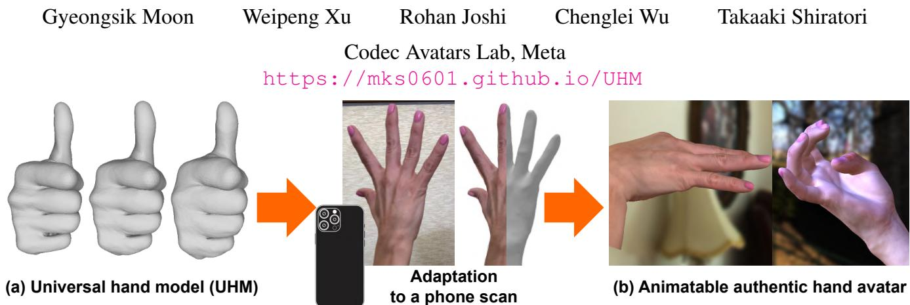  
Figure 1. We introduce (a) UHM, which can universally represent arbitrary IDs of hands at a high fidelity. Our adaptation pipeline fits pre-trained UHM to a phone scan, which produces (b) an animatable authentic 3D hand avatar. Images of (b) are rendered using our adapted hand avatar with the Phong reflection model and environment maps [7, 11].

## Abstract

The authentic 3D hand avatar with every identifiable information, such as hand shapes and textures, is necessary for immersive experiences in AR/VR. In this paper, we present a universal hand model (UHM), which 1) can universally represent high-fidelity 3D hand meshes of arbitrary identities (IDs) and 2) can be adapted to each person with a short phone scan for the authentic hand avatar. For effective universal hand modeling, we perform tracking and modeling at the same time, while previous 3D hand models perform them separately. The conventional separate pipeline suffers from the accumulated errors from the tracking stage, which cannot be recovered in the modeling stage. On the other hand, ours does not suffer from the accumulated errors while having a much more concise overall pipeline. We additionally introduce a novel image matching lossfunction to address a skin sliding during the tracking and modeling, while existing works have not focused on it much. Finally, using learned priors from our UHM, we effectively adapt our UHM to each person’s short phone scanfor the authentic hand avatar.

## 1. Introduction

We, humans, interact with the world through our hands. We interact with other people with hand gestures, express our feelings through hand motions, and interact with objects with diverse hand poses. The authentic 3D hand avatar with every identifiable information, including 3D hand shape and texture, is necessary for immersive experiences in AR/VR.

A 3D hand model is a function that produces a 3D hand from a 3D pose and identity (ID) latent code. The pose represents 3D joint angles, and the ID latent code determines identifiable hand shape (e.g., thickness and size) in the zero pose or textures (e.g., skin color and fingernail polish). Such two inputs (i.e., 3D pose and ID code) are used to drive pretrained 3D hand models, where the 3D poses can be obtained from 3D hand pose estimators [5, 8, 17, 18, 22, 25] and ID latent code can be obtained in a personalization stage [13]. Those two inputs are relatively affordable data from single or stereo camera setup of in-the-wild environment than 3D reconstruction [9], which requires at least tens of cameras. Hence, the 3D hand model is a core component of the 3D hand avatar.

We present a universal hand model (UHM), which 1) can universally represent high-fidelity 3D hand meshes of arbitrary IDs like Fig. 1 (a) and 2) can be adapted to each person with a short phone scan for the authentic hand avatar like Fig. 1 (b). For the effective universal hand modeling, we perform the tracking and modeling at the same time, while existing 3D hand models [4, 6, 12, 16, 26, 28, 29] rely on a separate tracking and modeling pipeline. Their tracking stage [1, 10] prepares target 3D meshes by non-rigidly aligning a template mesh to targets, such as 3D joint coordinates, 3D scans, masks, and images. In this way, the tracking stage provides 3D meshes with a consistent topology across all captures. Then, a modeling stage supervises 3D hand models with the tracked 3D meshes. One of the limitations of such a conventional separated pipeline is that the tracking errors cannot be recovered in the modeling stage, which we call error accumulation problem. On the other hand, as our UHM performs the tracking and modeling at the same time in a single stage, it does not suffer from the error accumulation problem while the overall pipeline becomes much more concise.

We additionally propose an optical flow-based loss function to prevent skin sliding during the tracking and modeling, while existing 3D hand models have not focused on it much. Most 3D hand models [16, 28, 29] are simply trained by minimizing per-vertex distance against tracked 3D meshes, and the tracking [1, 10] is performed by minimizing iterative closest point (ICP) distance against 3D scans. There could be a number of correspondences between 3D scans and 3D meshes from the 3D hand models as they do not share the same mesh topology. Therefore, without proper objective functions, some vertices of the 3D hand models could slide to semantically wrong positions. For example, although a group of vertices is supposed to be consistently located at the thumbnail across all captures, due to the ambiguity of the ICP loss, they could be slid to the below of the thumbnail. To address this, we propose an image matching loss function, which minimizes the norm of the optical flow between our rendered images and captured images. The optical flow provides image-level correspondences, especially useful for distinctive hand parts, such as fingernails and wrinkles on the palm. As we use a deep optical flow estimation network [30], which can recognize contextual information of images, the optical flow provides semantically meaningful correspondences, while the ICP loss does not.

Most importantly, we introduce an effective pipeline for adapting our UHM to each person with a short phone scan, which gives the authentic hand avatar. We found that existing works [13] produce plausible outputs, but they lack authenticity, for example, slightly different 3D hand shapes from the target hand. On the other hand, with the help of useful priors from the tracking and modeling stage, we successfully achieve highly authentic results.

Our contributions can be summarized as follows.

• We present UHM, a 3D hand model that can 1) universally represent high-fidelity 3D hand meshes of arbitrary IDs and 2) be adapted to each person with a short phone scan for the authentic 3D hand avatar.

• UHM performs the tracking and modeling at the same time, while existing models perform them separately, to address the accumulated errors from the modeling stage.

• We propose a novel image matching loss function to address the skin sliding problem during the tracking and modeling.

• We propose an effective adaptation pipeline for the authentic hand avatar, which utilizes useful priors from the tracking and modeling stage.

## 2. Related works

3D hand models. Universal 3D hand modeling aims to train a 3D hand model that can universally represent 3D hands of arbitrary IDs. MANO [29] is one of the pioneers in universal 3D hand modeling, and it is the most widely used one. NIMBLE [16] is a 3D hand model that consists of bones, muscles, and skin mesh. LISA [6] is based on the implicit representation, motivated by neural radiance field [20]. Handy [28] is a high-fidelity 3D hand model that follows a formulation of MANO. Due to the difficulty of universal modeling and collecting large-scale data from multiple IDs, there have been introduced several personalized 3D hand models. Those personalized 3D hand models can only represent a single ID of the training set and cannot represent novel IDs. DHM [23] is a high-fidelity personalized 3D hand model. LiveHand [26] and HandAvatar [4] are based on the implicit 3D representation of hands, inspired by neural radiance field [20]. RelightableHands [12] is a relightable personalized 3D hand model.

Compared to the above 3D hand models, our UHM has three distinctive advantages. First, UHM performs the tracking and modeling at the same time to address the error accumulation problem from the tracking stage. Second, we introduce a novel image matching loss function to address the skin sliding issue during the tracking and modeling. Finally, ours can produce authentic hand avatar from a phone scan, while previous models [4, 6, 26] require accurate 3D keypoints and MANO registrations of capture studio datasets [24]. In addition, their texture modules produce images of studio space [23, 24], which has a big appearance gap from phone capture images. The texture module of Handy [28] fails to replicate person-specific details, such as fingernail polish and tattoos, due to the limited expressiveness of their latent space.

3D hand avatar from a phone scan. Creating a 3D hand avatar from a short phone scan has been started to be studied recently. The 3D hand avatar should 1) be personalized to a target person with authenticity including 3D hand shape and texture and 2) be able to be driven by 3D poses. Previous works [4, 6, 26] created a 3D hand avatar from a long capture from a studio [23, 24] using accurate 3D assets, such as 3D tracking results and calibrated multi-view images. Assuming such 3D assets is a bottleneck for making a 3D hand avatar in our daily life as capturing and acquiring such 3D assets require lots of resources, such as tens or hundreds of calibrated and synchronized cameras. Recently, HARP [13] is introduced, which can make a 3D hand avatar from a short phone scan. It uses subdivided MANO [29] as an underlying geometric representation and optimizes albedo and normal maps for personalization. Compared to HARP, our adaptation pipeline produces more authentic results by utilizing priors from our UHM.

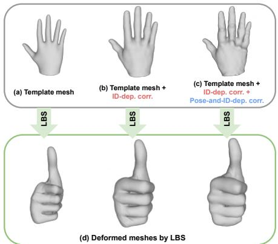  
Figure 2. The effectiveness of the correctives.

## 3. UHM

## 3.1. Formulation

We use the linear blend skinning (LBS) as an underlying geometric deformation algorithm following previous meshbased ones [16, 23, 28, 29]. Given 3D vertices and 3D joint coordinates in the zero pose space (i.e., template space), denoted by J¯ and V¯ respectively, we apply various correctives to them and perform LBS to apply the 3D pose to the zero pose space. Fig. 2 shows the effects of the correctives. There are three types of correctives: ID-dependent skeleton corrective $\Delta \bar { J } ^ { \mathrm { i d } }$ , ID-dependent vertex corrective $\Delta \bar { V } ^ { \mathrm { i d } }$ and pose-and-ID-dependent vertex corrective $\Delta \bar { V } ^ { \mathrm { p o s e } }$ . The ID-dependent skeleton corrective $\Delta \bar { J } ^ { \mathrm { i d } }$ and ID-dependent vertex corrective $\Delta \bar { V } ^ { \mathrm { i d } }$ are to model different 3D skeleton (e.g., bone lengths) and 3D hand shapes $( e . g .$ ., thickness) in the zero pose space, respectively, for each ID. The pose-and-ID-dependent vertex corrective $\Delta \bar { V } ^ { \mathrm { p o s e } }$ is to model different surface-level deformation mainly driven by 3D poses. We additionally consider ID to model slightly different pose-dependent vertex corrective for each ID. To perform LBS, we first perform forward kinematics (FK) with $\bar { J } + \Delta \bar { J } ^ { \mathrm { i d } }$ and provided 3D pose Θ to get transformation matrices of each joint. We denote 3D joint coordinates from FK by ${ \boldsymbol { J } } .$ Then, we apply the transformation matrices to $\bar { V } + \Delta \bar { V } ^ { \mathrm { i d } } + \Delta \bar { V } ^ { \mathrm { p o s e } }$ with pre-defined skinning weights to get final posed 3D mesh V. Our template mesh V¯ consists of 16K vertices and 32K faces. All three types of correctives are estimated in our pipeline.

## 3.2. Components

Fig. 3 shows the overall pipeline of our UHM. UHM consists of IDEncoder, IDDecoder, PoseEncoder, and PoseDecoder. Please refer to the supplementary material for their detailed network architectures.

IDEncoder and IDDecoder. IDEncoder and IDDecoder are encoder and decoder of variational autoencoder (VAE) [14], respectively, responsible for learning priors of the ID space. IDEncoder extracts ID code $\mathbf { z } ^ { \mathrm { i d } } \in \bar { \mathbb { R } } ^ { 3 2 }$ from a pair of a depth map and 3D joint coordinates of each training subject using the reparameterization trick [14]. Then, from the ID code, IDDecoder outputs ID-dependent skeleton corrective $\Delta \bar { J } ^ { \mathrm { i d } }$ and ID-dependent vertex correctives $\Delta \bar { V } ^ { \mathrm { i d } }$ IDEncoder always takes the same inputs for the same subject during the training, and its inputs are prepared by rigidly aligning the 3D scan and 3D joint coordinates of a neutral pose to a reference frame and rendering depth maps from the aligned 3D scan. In this way, we can normalize pose and viewpoint, not related to the ID information, from the inputs of the IDEncoder. After the training, the IDEncoder is discarded as inputs of IDEncoder are not affordable for in-the-wild cases. Instead, we obtain ID codes from novel samples in testing time by fitting ID codes to target data (Sec. 6.2 and 6.3).

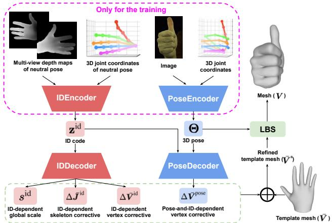  
Figure 3. The overall pipeline of the proposed UHM. The estimated correctives (dotted green box at the bottom) are applied to a template mesh to refine it. Then, LBS is used to pose the template mesh.

PoseEncoder and PoseDecoder. PoseEncoder outputs 6D rotation [35] of joints Θ from a pair of a single RGB image and 3D joint coordinates of arbitrary poses and identities. Unlike IDEncoder’s inputs consist of a single pair of each subject, PoseEncoder’s inputs are from any poses and subjects. PoseDecoder outputs pose-and-ID-dependent vertex correctives $\Delta \bar { V } ^ { \mathrm { p o s e } }$ from a pair of 6D rotational pose Θ and ID code $\mathbf { z } ^ { \mathrm { i d } }$ with MLPs. As how skin deforms can be different for each person even with the same pose, our PoseDecoder takes both pose and ID codes. Please note that ID-dependent deformations in the zero pose are already covered in IDDecoder, and the role of the additional ID code input to PoseDecoder is to model only different posedependent deformations for each ID. Following STAR [27], we estimate $\Delta \bar { V } ^ { \mathrm { p o s e } }$ in a sparse manner with the help of learnable vertex weights Φ. For the same reason as IDEncoder, PoseEncoder is discarded after the training. In the testing time, we obtain poses from novel samples by fitting them to target data (Sec. 6.2 and 6.3).

## 4. Simultaneous tracking and modeling

We train UHM in an end-to-end manner from scratch with our simultaneous tracking and modeling pipeline. There are two types of loss functions that we minimize: data terms and regularizers. We describe our data terms below and please refer to the supplementary material for the detailed descriptions of the regularizers.

Pose loss, point-to-point loss, and mask loss. The pose loss $L _ { \mathrm { p o s e } }$ is a L1 distance between 3D joint coordinates J and targets. It mainly provides information on kinematic deformation. The point-to-point loss $\boldsymbol { L } _ { \mathrm { p 2 p } }$ is the closest L1 distance 3D vertex coordinates V and 3D scans. The mask loss $L _ { \mathrm { m a s k } }$ is a L1 distance between rendered and target foreground masks, where our masks are from a differentiable renderer [32]. $L _ { \mathrm { p 2 p } }$ and $L _ { \mathrm { m a s k } }$ mainly provides information of non-rigid surface deformation. For both $\boldsymbol { L } _ { \mathrm { p 2 p } }$ and $L _ { \mathrm { m a s k } }$ we calculate the loss functions between two pairs. First, we use both correctives $( \Delta \bar { V } ^ { \mathrm { i d } }$ and $\Delta \bar { V } ^ { \mathrm { p o s e } } )$ to obtain V and compute the loss functions. Second, we set $\Delta \bar { V } ^ { \mathrm { p o s e } }$ to zero to obtain V and compute the loss functions. The second one enables us to supervise the ID-dependent corrective $\Delta \bar { V } ^ { \mathrm { i d } }$ without being affected by the pose-and-ID-dependent corrective $\Delta \bar { V } ^ { \mathrm { p o s e } }$ , necessary to learn meaningful ID latent space.

Image matching loss. Solely using the above loss functions does not encourage vertices to be semantically consistent across all frames and subjects as both 3D scans and masks are unstructured surface data. For example, a certain vertex, supposed to be located on the thumbnail across all frames and subjects, could slide to a semantically wrong position. This is because the above loss functions do not encourage such semantic consistency. For semantic consistency, we additionally compute an image matching loss, motivated by [3, 33]

First, for each subject, we unwrap multi-view images of a frame with the neutral pose to UV space, as shown in Fig. 4 (a), which becomes a reference texture. For the unwrapping, we use our 3D meshes, obtained from a checkpoint that is trained without the image matching loss. After the unwrapping, we have as many reference textures as there are subjects. The reference textures are static assets and do not change during the training. Then, we fine-tune the checkpoint with additional $L _ { \mathrm { i m g } } .$ Fig. 4 (b) shows what $L _ { \mathrm { i m g } }$ does. We first rasterize mesh vertices and render images [32] using the reference texture (Fig. 4 (a)) in a differentiable way. Then, we compute optical flow from the rendered images to captured images using a pre-trained stateof-the-art optical flow estimation network [30]. Finally, we minimize the L1 distance between 1) the 2D positions of the rasterized mesh vertices and 2) the positions of the target pixels, where the target pixels are the output of the optical flow.

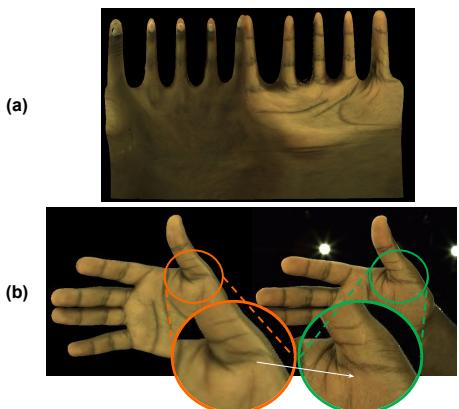  
Figure 4. (a) Reference texture. (b) Our image matching loss function encourages rasterized vertices (orange) to move to the target positions (green), where the target position is obtained by the optical flow (white arrow).

Our image matching loss encourages each rasterized mesh vertex to have consistent semantic meanings from that of the reference texture, which results in low variance. It also results in low bias as the reference texture is from the neutral pose, which has a minimum skin sliding. Please note that the gradient is only backpropagated to the rasterized mesh vertices. The rendered images are not perfectly identical to captured images as such rendered images do not have pose-and-view-dependent texture changes and shadow changes. However, we observed that optical flow is highly robust to such changes in textures, which gives reasonable matching between rendered and captured images.

## 5. Adaptation to a phone scan

After training our UHM following Sec. 4, we adapt it to a short (usually around 15 seconds) phone scan for the authentic hand avatar. The phone scan includes a single person’s hand with the neutral pose and varying global rotations to expose most of the surface of the hand. During the adaptation, we freeze pre-trained UHM while optimizing its inputs.

## 5.1. Preprocessing

We use a single iPhone 12 to scan a hand, which incorporates a depth sensor that can be used to extract better geometry of the user’s hand. Then, we use a 2D hand keypoint detector (our in-house detector or public Mediapipe [31]) to obtain 2D hand joint coordinates and RVM [19] to obtain foreground masks. Also, we use InterWild [21] to obtain MANO [29] parameters of all frames.

## 5.2. Geometry fitting

We fit inputs of our pre-trained UHM (i.e., 3D pose Θ and ID code $\mathbf { z } ^ { \mathrm { i d } } )$ , 3D global rotation, and 3D global translation to the phone scan. The 3D pose, 3D global rotation, and 3D global translation are per-frame parameters, and the ID code is a single parameter and shared across all frames as each phone scan is from a single person. For the fitting, we minimize loss functions against 2D hand joint coordinates, foreground mask, a depth map, and 3D joint coordinates from the MANO parameters, where the fitting targets are from Sec. 5.1. Please refer to the supplementary material for a detailed description of the fitting.

(b) Shadow (c) Albedo\*Shadow  
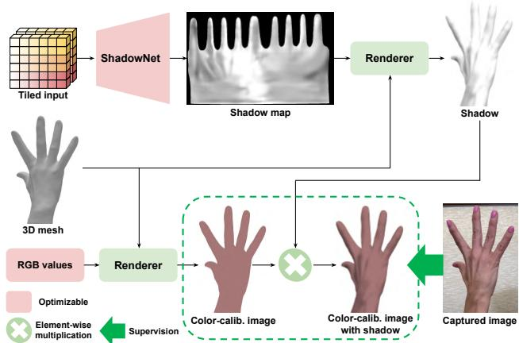  
Figure 5. The overall pipeline to remove the shadow from the phone scan using our ShadowNet.

## 5.3. Shadow removal

To produce albedo textures, we need to remove shadows from our phone scan. Fig. 6 shows that without removing shadows, the shadow of the phone capture is baked into the texture, which makes

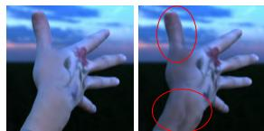  
(a) With ShadowNet (Ours) (b) Without ShadowNet

significant artifacts in a novel light condition. Without knowing the full 3D environment map of the phone scan, it is impossible to perfectly disentangle shadow from the unwrapped texture. Previous work [13] assumes a single point light and optimizes it during the adaptation. However, in most cases, the assumption does not hold as there are often more than one light source in our daily life. Instead of using such a physics-based approach, we use a statistical approach by introducing our ShadowNet. As shown in Fig. 5, our intuition is modeling shadow as a darkness difference between a color-calibrated image and a captured image.

ShadowNet. Our ShadowNet estimates shadow map in the UV space from tiled 3D global rotation, 3D pose Θ, ID code zid, and view direction for each mesh vertex. Given a fixed 3D environment during the phone scan, the inputs of our ShadowNet can determine the shadow of the hand. The ShadowNet is a fully convolutional network with several upsampling layers. To encourage smooth shadow, we perform bilinear upsampling four times at the end of the network. We add a learnable positional encoding to the input before passing it to our ShadowNet as each texel in the UV space has its own semantic meaning. We apply a sigmoid activation function at the end of our ShadowNet. By rendering and multiplying our shadow map to an image, we can make the image darker, which can be seen as a shadow casting, similar spirit of Bagautdinov et al. [2]. Fig. 7 shows the qualitative results of our ShadowNet. We randomly initialize our ShadowNet and train to our phone scan. Please refer to the supplementary material for the detailed architecture.

Figure 6. Effectiveness of our ShadowNet in a novel light condition.  
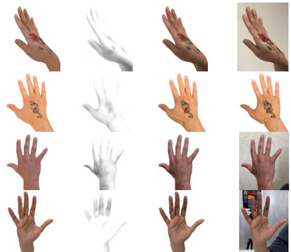  
(a) Albedo  
(d) Phone scan  
Figure 7. Qualitative results of image’s albedo and shadow decomposition using our ShadowNet.

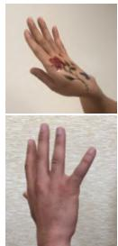

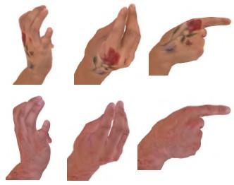  
(a) Phone scan  
(b) Animation with novel poses  
Figure 8. Animated hand avatars whose textures are from (a) phone scan, and geometry is from UHM by passing novel 3D poses Θ and personalized ID code zid to it.

Optimization. First, we obtain the color-calibrated image, rendered from a UV texture that has the same color for all texels. The RGB values (3D vector) of texels are optimizable. Our assumption for the shadow removal is that hands mostly have uniform skin color, unlike the human body with different colors in upper and lower body clothes. Please note that we use the color-calibrated image only for removing shadow, and our final hand avatar has authentic information from any colors.

Then, we multiply the rendered shadow to the colorcalibrated image. We minimize L1 distance and VGG loss [15] between two pairs at the same time: between 1) color-calibrated image and captured image and 2) colorcalibrated image with shadow and captured image. In this way, we can optimize ShadowNet to produce the 1-channel difference between the captured image and color-calibrated image following the image intrinsic decomposition formula. Without proper regularizers, our ShadowNet can consider all 1-channel differences as a shadow, which is not desirable for hair and black tattoos. Hence, we apply a total variation regularizer to the rendered shadow to model shadow as a locally smooth darkness changes without locally sharp ones.

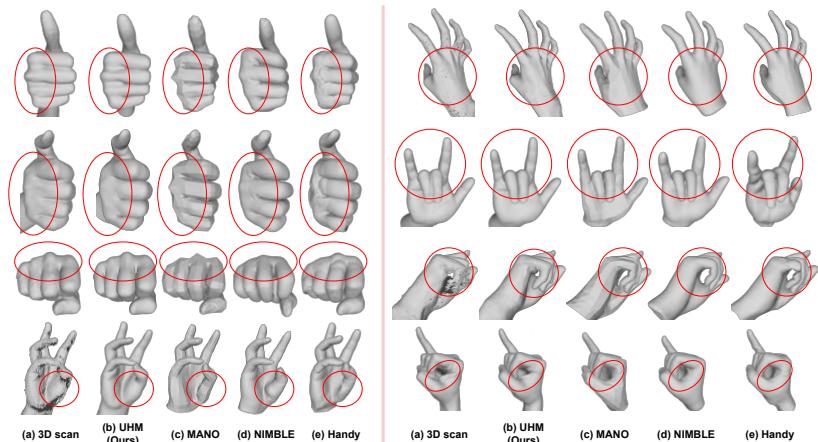

<table><tr><td rowspan="2">3D hand models</td><td colspan="3">Testing sets</td></tr><tr><td>Ours</td><td>MANO</td><td>DHM</td></tr><tr><td>MANO [29]</td><td>1.44</td><td>0.94</td><td>1.36</td></tr><tr><td>NIMBLE [16]</td><td>1.21</td><td>0.88</td><td>1.22</td></tr><tr><td>Handy [28]</td><td>1.20</td><td>0.78</td><td>1.11</td></tr><tr><td>UHM (low res.)</td><td>0.73</td><td>0.76</td><td>0.61</td></tr><tr><td>UHM (Ours)</td><td>0.72</td><td>0.75</td><td>0.59</td></tr></table>

Table 1. P2S error (mm) comparison of 3D hand models on multiple test sets.
<table><tr><td rowspan="2">3D hand models</td><td colspan="3"># of views of DHM test set</td></tr><tr><td>1 view</td><td>2 views 4 views</td><td></td></tr><tr><td>LISA [6]</td><td>3.68</td><td>3.56</td><td>3.38</td></tr><tr><td>UHM (Ours)</td><td>1.63</td><td>1.38</td><td>1.27</td></tr></table>

Figure 9. Comparison of our UHM and previous 3D hand models [16, 28, 29] on our test set. The first row examples are from the same ID with a sharp hand, and the second row examples are from another same ID with a thick hand. All the others are from different IDs.  
Table 2. P2S error (mm) comparison on DHM dataset.

## 5.4. Texture optimization

Given estimated 3D meshes from Sec. 5.2 and shadow from Sec. 5.3, we first divide captured images by the shadow and unwrap them to UV space. Then, we average them considering the visibility of each texel. We preprocess the unwrapped texture with the OpenCV inpainting function to fill missed texels. To further optimize the unwrapped texture, we render an image from the unwrapped texture and multiply the rendered shadow to it. Then, we minimize L1 distance and VGG loss [15] between the rendered image and captured images for a more photorealistic texture. We additionally encourage locally smooth textures for missing texels, inpainted by OpenCV. During the texture optimization, we fine-tune our ShadowNet to make the shadow consistent with our texture.

## 5.5. Final outputs

The final outputs of our hand avatar creation pipeline are 1) optimized ID code of UHM zid from Sec. 5.2 and 2) optimized texture from Sec. 5.4. The geometry ID code gives a personalized 3D hand shape and skeleton, and the optimized texture provides personalized albedo texture. By feeding 3D poses from off-the-shelf 3D hand pose estimators [5, 8, 17, 18, 22, 25] with the optimized ID code to pretrained UHM, entire mesh vertices can be animated from the novel poses. Also, simply using the standard computer graphics pipeline, authentic 3D hand avatars can be rendered with the personalized albedo texture, as shown in Fig. 8, or with Phong reflection model, as shown in Fig. 1 (b). Our pipeline takes 2 hours for 15 seconds of phone scan, while HARP takes 6 hours.

## 6. Experiments

## 6.1. Datasets

We use the three datasets below to train and evaluate our UHM.

Our studio dataset. We use 177 captures for the training and 7 captures for the testing, where each capture includes 18K frames of a unique subject taken from 170 cameras on average. The testing subjects are not included in the training set. Please refer to the supplementary material for the detailed descriptions of our dataset.

Testing set of MANO. We report 3D errors on the testing set of MANO, which consists of 50 3D scans from 6 subjects. It is used only for the evaluation purpose.

Dataset of DHM. We report 3D errors on the dataset of DHM, which consists of 33K 3D scans from a single subject. We use this dataset only for the evaluation purpose.

We also use the two datasets below to evaluate the adaptation pipeline.

Our new phone scan dataset. We newly captured 18 phone scans from unique IDs and use them to evaluate our adaptation pipeline. We use 4 scans out of 18 scans for the quantitative evaluations. For the training, frames with neutral poses are used, and for the testing, frames with diverse poses are used. All the phone scans are preprocessed following Sec. 5.1. Some phone scans have distinctive authenticities, such as fingernail polish and tattoos. Please refer to the supplementary material for the detailed descriptions of our dataset.

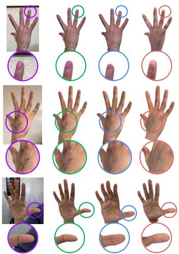  
(a) Phone scan (b) UHM (Ours) (c) HARP

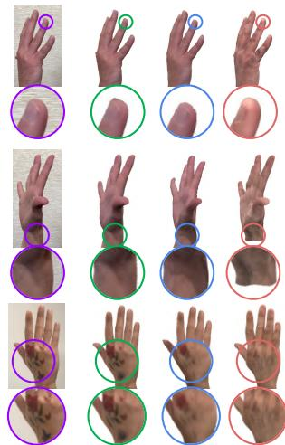  
(a) Phone scan (b) UHM (Ours) (c) HARP (d) Handy

Figure 10. Comparison of various hand avatars on the training set of our phone scan dataset.
<table><tr><td>3D hand avatars</td><td>PSNR↑</td><td>SSIM↑</td><td>LPIPS↓</td></tr><tr><td>Handy [28]</td><td>26.10</td><td>0.930</td><td>0.087</td></tr><tr><td>HARP [13]</td><td>27.50</td><td>0.947</td><td>0.081</td></tr><tr><td>UHM (Ours)</td><td>32.55</td><td>0.957</td><td>0.055</td></tr></table>

Table 4. Comparison of 3D hand avatars on the test set of HARP dataset.

Dataset of HARP. We report errors in the publicly available HARP dataset. Please note that they only released a partial of what they used in paper, and the released one consists of a single ID. For the quantitative results, we used subject 1 sequence as all other sequences do not have enough pose diversity, which cannot be used for the testing. Among 9 sub-sequences of subject 1, 1 to 5 are used for the training, and 6 to 9 are used for the testing.

## 6.2. Comparison of 3D hand models

We compare the generalizability of pre-trained 3D hand models to unseen IDs and poses. To this end, we fit inputs of 3D hand models (i.e., pose and ID code) to target data while fixing the pre-trained 3D hand models. After fitting them to target data, we measure point-to-surface (P2S) error (mm), which measures the average distance from points of the 3D scan to the surfaces of the output meshes. The errors are measured after fitting inputs of 3D hand models as much as possible to target data while fixing the models. In this way, we can check how much fidelity (i.e., surface expressiveness) of each hand model is not enough to fully replicate 3D scans after marginalizing fitting errors. For UHM, we excluded vertices on the forearm when calculating the error as all others do not have the forearm. We do not include personalized 3D hand models [4, 12, 23, 26] in the comparisons as our focus in this experiment is to compare generalizability to unseen poses and IDs, while such personalized models cannot generalize to novel IDs.

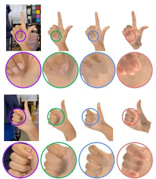

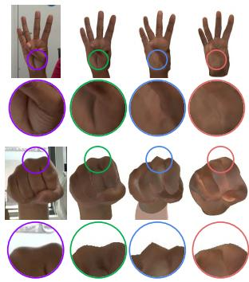

(a) Phone scan (b) UHM (Ours) (c) HARP (d) Handy (a) Phone scan (b) UHM (Ours) (c) HARP (d) Handy Figure 11. Comparison of various hand avatars on the testing set of our phone scan dataset.
<table><tr><td>3D hand avatars</td><td>PSNR↑</td><td>SSIM↑</td><td>LPIPS↓</td><td>P2S↓</td></tr><tr><td>Handy [28]</td><td>26.02</td><td>0.930</td><td>0.134</td><td>2.21</td></tr><tr><td>HARP [13]</td><td>29.89</td><td>0.952</td><td>0.092</td><td>2.04</td></tr><tr><td>UHM (Ours)</td><td>31.82</td><td>0.962</td><td>0.076</td><td>0.45</td></tr></table>

Table 3. Comparison of 3D hand avatars on our test set.

Fig. 9 and Table 1 show that our UHM produces the best quality of meshes on multiple test sets than other universal hand models, such as MANO [29], NIMBLE [16], and Handy [28]. Handy [28] suffers from surface artifacts. For example, there are severe artifacts around the knuckle area in the examples at the top three rows and the first column. Also, there is no muscle bulging around the thumb in the example at the bottom and the first column. There is a severe artifact at the pinky finger in the example in the third row and the second column. We additionally provide our results from a low-resolution template, which has half the number of vertices (3K) than NIMBLE (6K) and Handy (7K) for a more fair comparison. The table demonstrates that even with a half number of vertices, ours achieves better fidelity than NIMBLE and Handy. Table 2 shows that ours achieves much better results on the DHM dataset than LISA [6].

## 6.3. Comparison of adaptation pipelines

Fig. 10 and 11 show that our adaptation pipeline achieves much more authentic and photorealistic results than HARP [13] and Handy [28]. In particular, the right column of Fig. 11 shows that only our avatar has skin bulging around the thumb and sharp knuckle, unseen during the training, thanks to our high-fidelity UHM. HARP suffers from geometry artifacts, which result in texture artifacts. We think this is because of the limited expressiveness of the MANO model. In addition, due to their single point light assumption, they have a clearly different shadow from the captured images, as the second row examples of Fig. 10 show. We address such a failure case by introducing the ShadowNet. Handy suffers from a lack of texture authenticity, such as different fingernail polish, tattoos, and palm wrinkles, as their textures are from pre-defined texture space. On the other hand, we unwrap textures and directly optimize them without being constrained in texture space, which gives authentic textures. Unlike geometry, there can be numerous variants in the texture space including shadow, tattoo, and fingernail polish; hence, we think such texture prior is not enough for the authenticity.

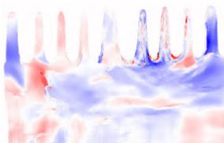  
(a) Difference of L2 norm of optical flow (Blue: using image matching has smaller norm Red: using image matching has bigger norm)

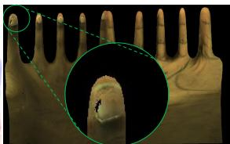  
(b) Reference texture

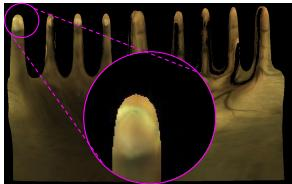

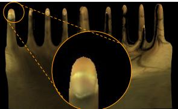  
(d) Unwrapped texture without image matching loss

Tab. 3 and 4 show that our adaptation pipeline achieves better numbers. For a fair comparison, all avatars in Tab. 3 are trained with the additional depth map loss as our dataset provides depth maps. For four subjects in our phone scan, we co-captured studio data, which gives 3D data of them. To measure the accuracy of the adaptation pipeline more thoroughly, we measure the P2S error (mm) between personalized meshes from the phone scan and the 3D scan from our capture studio. Thanks to our high-fidelity universal modeling, the proposed UHM clearly achieves the best result in the 3D metric.

For the results on the testing set, following the previous protocols [13] that optimizes 3D poses of hands, lights, and ambient ratio on the testing set, we fine-tune PoseNet and ShadowNet on the test set. All remaining parameters, including the ID code and optimized texture, are fixed in the testing stage following HARP [13]. For the results of HARP, we used their official code with groundtruth hand boxes. For the results of Handy, we downloaded their official pre-trained weights and optimized 3D pose and texture latent code using L1 distance and LPIPS [34] following their paper. Please refer to the supplementary material for the detailed fitting process of Handy.

## 6.4. Ablation study

Image matching loss. To validate the effectiveness of our image matching loss $L _ { \mathrm { i m g } }$ during the tracking and modeling, depicted in Fig. 4, we first unwrap multi-view images to UV space using our 3D meshes. Then, we compute optical flow [30] from the reference texture of the neutral pose (Fig. 12 (b)) to the unwrapped per-frame texture.

Figure 12. Effectiveness of our image matching loss function.  
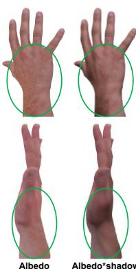  
(a) UHM (Ours)

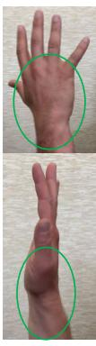

(b) Phone scan  
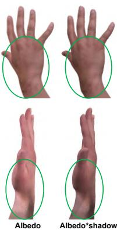  
(c) HARP  
Figure 13. Comparison of rendered images 1) only using albedo and 2) using both albedo and shadow.

Fig. 12 (a) shows that using our image matching loss $L _ { \mathrm { i m g } }$ decreases the L2 norm of the optical flow for most texels, which shows that texels are located in semantically correct and consistent positions by suffering less from the skin sliding. In particular, texels that have semantically distinctive locations, such as wrinkles on the palm and thumbnail, have significantly less L2 norm of the optical flow as the optical flow provides meaningful correspondences for such texels. Fig. 12 (c) and (d) show that compared to Fig. 12 (b), using our image matching loss produces consistent and correct position of thumb in the UV space. On the other hand, as the back of the hand usually does not have distinctive textures, optical flow fails to produce meaningful correspondence, which results in a slightly higher L2 norm.

ShadowNet. Fig. 13 shows that the albedo rendering of HARP still has a shadow, while ours does not. This shows the benefit of using our ShadowNet to remove the shadow from phone scans instead of assuming a single point light and optimizing it like HARP. In addition, our albedo has more detailed textures, such as hair on the back of the hand (first row). Due to the ambiguity of the image’s intrinsic decomposition, we could not include quantitative evaluations.

## 7. Conclusion

We present UHM, a universal hand model that 1) can represent high-fidelity 3D hand mesh of arbitrary IDs and diverse poses and 2) can be adapted to each person with a short phone scan for the authentic 3D hand avatar. UHM performs the tracking and modeling at the same time to address the error accumulation problem from the tracking stage. In addition, we newly introduce the image matching loss function to prevent skin sliding during the tracking and modeling. Finally, our adaptation pipeline achieves a highly authentic hand avatar by utilizing useful learned priors of UHM.

## References

[1] Brian Amberg, Sami Romdhani, and Thomas Vetter. Optimal step nonrigid ICP algorithms for surface registration. In CVPR, 2007. 1, 2

[2] Timur Bagautdinov, Chenglei Wu, Tomas Simon, Fabian Prada, Takaaki Shiratori, Shih-En Wei, Weipeng Xu, Yaser Sheikh, and Jason Saragih. Driving-signal aware full-body avatars. ACM TOG, 2021. 5

[3] Federica Bogo, Javier Romero, Matthew Loper, and Michael J Black. FAUST: Dataset and evaluation for 3D mesh registration. In CVPR, 2014. 4

[4] Xingyu Chen, Baoyuan Wang, and Heung-Yeung Shum. Hand Avatar: Free-pose hand animation and rendering from monocular video. In CVPR, 2023. 1, 2, 7

[5] Hongsuk Choi, Gyeongsik Moon, and Kyoung Mu Lee. Pose2Mesh: Graph convolutional network for 3D human pose and mesh recovery from a 2D human pose. In ECCV, 2020. 1, 6

[6] Enric Corona, Tomas Hodan, Minh Vo, Francesc Moreno-Noguer, Chris Sweeney, Richard Newcombe, and Lingni Ma. LISA: Learning implicit shape and appearance of hands. In CVPR, 2022. 1, 2, 6, 7

[7] Marc-Andre Gardner, Kalyan Sunkavalli, Ersin Yumer, Xi-´ aohui Shen, Emiliano Gambaretto, Christian Gagne, and´ Jean-Franc¸ois Lalonde. Learning to predict indoor illumination from a single image. ACM TOG, 2017. 1

[8] Liuhao Ge, Zhou Ren, Yuncheng Li, Zehao Xue, Yingying Wang, Jianfei Cai, and Junsong Yuan. 3D hand shape and pose estimation from a single RGB image. In CVPR, 2019. 1, 6

[9] Kaiwen Guo, Peter Lincoln, Philip Davidson, Jay Busch, Xueming Yu, Matt Whalen, Geoff Harvey, Sergio Orts-Escolano, Rohit Pandey, Jason Dourgarian, et al. The relightables: Volumetric performance capture of humans with realistic relighting. ACM TOG, 2019. 1

[10] David A Hirshberg, Matthew Loper, Eric Rachlin, and Michael J Black. Coregistration: Simultaneous alignment and modeling of articulated 3D shape. In ECCV, 2012. 1, 2

[11] Yannick Hold-Geoffroy, Akshaya Athawale, and Jean-Franc¸ois Lalonde. Deep sky modeling for single image outdoor lighting estimation. In CVPR, 2019. 1

[12] Shun Iwase, Shunsuke Saito, Tomas Simon, Stephen Lombardi, Timur Bagautdinov, Rohan Joshi, Fabian Prada, Takaaki Shiratori, Yaser Sheikh, and Jason Saragih. RelightableHands: Efficient neural relighting of articulated hand models. In CVPR, 2023. 1, 2, 7

[13] Korrawe Karunratanakul, Sergey Prokudin, Otmar Hilliges, and Siyu Tang. HARP: Personalized hand reconstruction from a monocular RGB video. In CVPR, 2023. 1, 2, 5, 7, 8

[14] Diederik P. Kingma and Max Welling. Auto-encoding variational bayes. In ICLR, 2014. 3

[15] Christian Ledig, Lucas Theis, Ferenc Huszar, Jose Caballero,´ Andrew Cunningham, Alejandro Acosta, Andrew Aitken, Alykhan Tejani, Johannes Totz, Zehan Wang, et al. Photorealistic single image super-resolution using a generative adversarial network. In CVPR, 2017. 6

[16] Yuwei Li, Longwen Zhang, Zesong Qiu, Yingwenqi Jiang, Nianyi Li, Yuexin Ma, Yuyao Zhang, Lan Xu, and Jingyi Yu. NIMBLE: a non-rigid hand model with bones and muscles. ACM TOG, 2022. 1, 2, 3, 6, 7

[17] Kevin Lin, Lijuan Wang, and Zicheng Liu. End-to-end human pose and mesh reconstruction with transformers. In CVPR, 2021. 1, 6

[18] Kevin Lin, Lijuan Wang, and Zicheng Liu. Mesh graphormer. In ICCV, 2021. 1, 6

[19] Shanchuan Lin, Linjie Yang, Imran Saleemi, and Soumyadip Sengupta. Robust high-resolution video matting with temporal guidance. In WACV, 2022. 4

[20] Ben Mildenhall, Pratul P. Srinivasan, Matthew Tancik, Jonathan T. Barron, Ravi Ramamoorthi, and Ren Ng. NeRF: Representing scenes as neural radiance fields for view synthesis. In ECCV, 2020. 2

[21] Gyeongsik Moon. Bringing inputs to shared domains for 3D interacting hands recovery in the wild. In CVPR, 2023. 4

[22] Gyeongsik Moon and Kyoung Mu Lee. I2L-MeshNet: Image-to-Lixel prediction network for accurate 3D human pose and mesh estimation from a single RGB image. In ECCV, 2020. 1, 6

[23] Gyeongsik Moon, Takaaki Shiratori, and Kyoung Mu Lee. DeepHandMesh: A weakly-supervised deep encoderdecoder framework for high-fidelity hand mesh modeling. In ECCV, 2020. 2, 3, 7

[24] Gyeongsik Moon, Shoou-I Yu, He Wen, Takaaki Shiratori, and Kyoung Mu Lee. InterHand2.6M: A dataset and baseline for 3D interacting hand pose estimation from a single rgb image. In ECCV, 2020. 2

[25] Gyeongsik Moon, Hongsuk Choi, and Kyoung Mu Lee. Accurate 3D hand pose estimation for whole-body 3D human mesh estimation. In CVPRW, 2022. 1, 6

[26] Akshay Mundra, Mallikarjun B R, Jiayi Wang, Marc Habermann, Christian Theobalt, and Mohamed Elgharib. Live-Hand: Real-time and photorealistic neural hand rendering. In ICCV, 2023. 1, 2, 7

[27] Ahmed AA Osman, Timo Bolkart, and Michael J Black. STAR: Sparse trained articulated human body regressor. In ECCV, 2020. 3

[28] Rolandos Alexandros Potamias, Stylianos Ploumpis, Stylianos Moschoglou, Vasileios Triantafyllou, and Stefanos Zafeiriou. Handy: Towards a high fidelity 3D hand shape and appearance model. In CVPR, 2023. 1, 2, 3, 6, 7

[29] Javier Romero, Dimitrios Tzionas, and Michael J Black. Embodied Hands: Modeling and capturing hands and bodies together. ACM TOG, 2017. 1, 2, 3, 4, 6, 7

[30] Zachary Teed and Jia Deng. RAFT: Recurrent all-pairs field transforms for optical flow. In ECCV, 2020. 2, 4, 8

[31] Andrey Vakunov, Chuo-Ling Chang, Fan Zhang, George Sung, Matthias Grundmann, and Valentin Bazarevsky. MediaPipe Hands: On-device real-time hand tracking. In CVPRW, 2020. 4

[32] Shih-En Wei, Jason Saragih, Tomas Simon, Adam W Harley, Stephen Lombardi, Michal Perdoch, Alexander Hypes, Dawei Wang, Hernan Badino, and Yaser Sheikh. VR facial animation via multiview image translation. ACM TOG, 2019. 4

[33] Donglai Xiang, Timur Bagautdinov, Tuur Stuyck, Fabian Prada, Javier Romero, Weipeng Xu, Shunsuke Saito, Jingfan Guo, Breannan Smith, Takaaki Shiratori, et al. Dressing Avatars: Deep photorealistic appearance for physically simulated clothing. ACM TOG, 2022. 4

[34] Richard Zhang, Phillip Isola, Alexei A Efros, Eli Shechtman, and Oliver Wang. The unreasonable effectiveness of deep features as a perceptual metric. In CVPR, 2018. 8

[35] Yi Zhou, Connelly Barnes, Jingwan Lu, Jimei Yang, and Hao Li. On the continuity of rotation representations in neural networks. In CVPR, 2019. 3