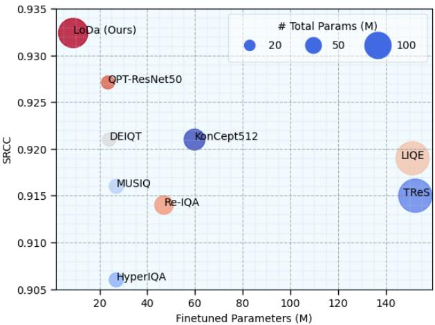
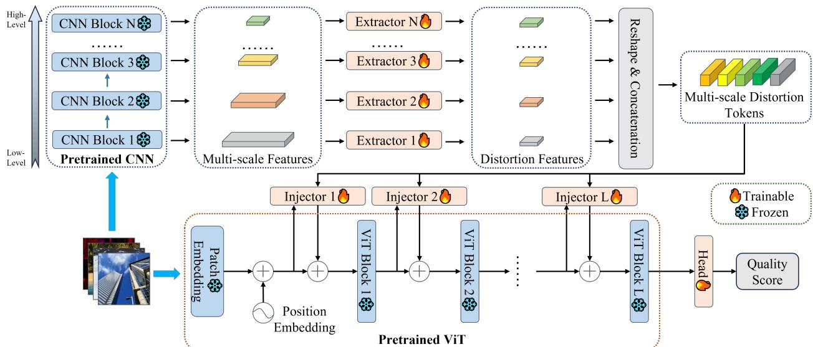
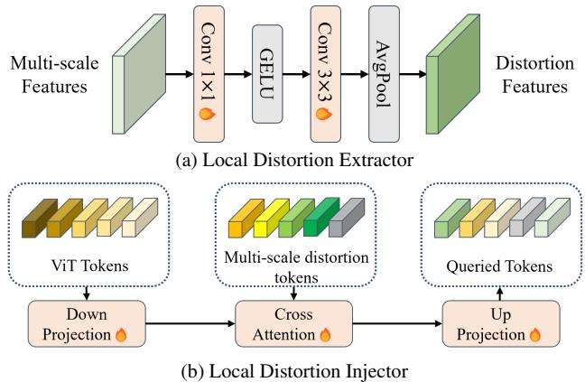
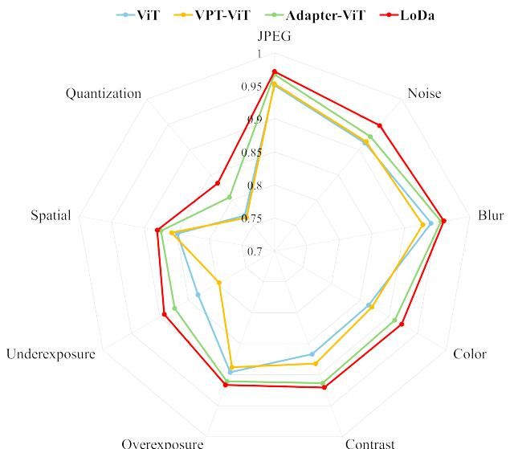
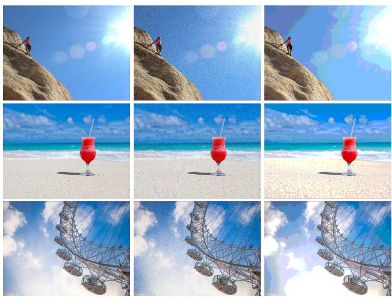
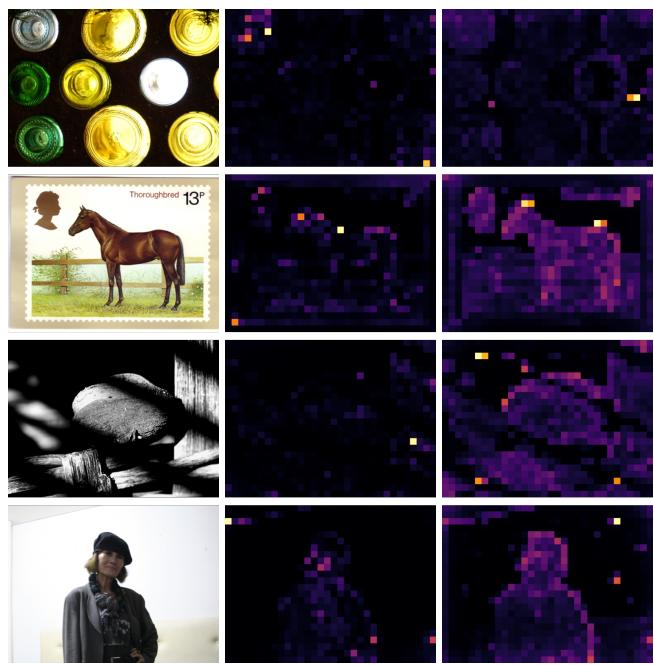
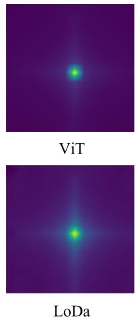
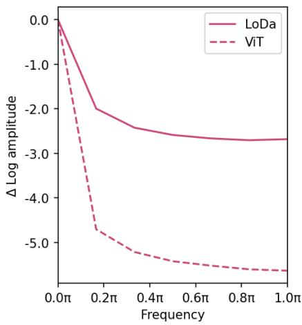

# Boosting Image Quality Assessment through Efficient Transformer Adaptation with Local Feature Enhancement

Kangmin Xu1 Liang Liao2\* Jing Xiao1 Chaofeng Chen2 Haoning Wu2 Qiong Yan3 Weisi Lin2 1 School of Computer Science, Wuhan University 2 S-lab, Nanyang Technological University 3 Sensetime Research

## Abstract

Image Quality Assessment (IQA) constitutes a fundamental task within the field of computer vision, yet it remains an unresolved challenge, owing to the intricate distortion conditions, diverse image contents, and limited availability of data. Recently, the community has witnessed the emergence of numerous large-scale pretrained foundation models. However, it remains an open problem whether the scaling law in high-level tasks is also applicable to IQA tasks which are closely related to low-level clues. In this paper, we demonstrate that with a proper injection of local distortion features, a larger pretrained vision transformer (ViT) foundation model performs better in IQA tasks. Specifically, for the lack of local distortion structure and inductive bias of the large-scale pretrained ViT, we use another pretrained convolution neural networks (CNNs), which is well known for capturing the local structure, to extract multi-scale imagefeatures. Further, we propose a local distortion extractor to obtain local distortion featuresfrom the pretrained CNNs and a local distortion injector to inject the local distortionfeatures into ViT. By only training the extractor and injector, our method can benefit from the rich knowledge in the powerfulfoundation models and achieve state-of-the-art performance on popular IQA datasets, indicating that IQA is not only a low-level problem but also benefits from stronger high-level features drawn from large-scale pretrained models. Codes are publicly available at: https://github.com/NeosXu/LoDa.

## 1. Introduction

As millions of images are shared and distributed across various platforms daily, the Internet has transformed into an extensive repository of visual content. Users exchange and upload images for diverse purposes, spanning from social media interactions to professional applications, ensuring the highest quality and fidelity of these visual content has become highly desirable. Consequently, there has been a substantial increase in the demand for robust image quality assessment (IQA) [16, 25, 35, 45, 47, 53], which serve the purpose of automatically evaluating the quality of images in concordance with human subjective judgment.

  
Figure 1. Comparison among SOTA IQA methods on KonIQ-10k [15] dataset, where the size of each spot indicates the total parameters of the model.

Leveraging the extensive volume of data shared on the internet, numerous pretrained large language models [4, 24, 40], vision models [2, 34, 38], and vision-language models [9, 33, 46] have recently emerged. However, the process of annotating IQA datasets necessitates multiple human annotations for each image, rendering the collection process extremely labor-intensive and financially burdensome. Consequently, the field of IQA suffers from an insufficiency of labeled data, with existing IQA datasets proving inadequate to effectively train large-scale learning models. To address this challenge, a direct approach involves constructing models founded on pretrained convolutional neural networks (CNNs) [5] or vision transformers (ViTs) [23, 32]. Additionally, some studies have proposed the design of

IQA-specific pretrained approaches [35, 56]. Nevertheless, pretraining large models on large datasets requires a considerable investment of time and resources, causing these approaches to often rely on smaller models and datasets, such as ResNet-50 [13, 56] and ImageNet-1K [32, 56].

Recent advancements in vision models have transitioned from EfficientNet-based architectures [30] (comprising 0.48 billion (B) parameters) to Transformer-based models [49] with up to of 2.1B parameters, and more recently, they have risen to unprecedented scales, encompassing 22B [7] and 562B [9] parameters. Given the magnitude of such large models, traditional pretraining and full-finetuning approaches present substantial challenges, as they necessitate a complete adaptation for every specific task. Consequently, inspired by efficient model adaptation techniques in natural language processing (NLP) [57], several visual tuning methods [21, 55] have been developed to adapt pretrained vision or visual-language models for downstream tasks, diverging from traditional transfer learning approaches that either fully fine-tune the entire model or solely the task head [59]. As such, whether or not IQA models can leverage shared parameter weights (typically interpreted as the knowledge of pre-trained models) from largescale pretrained models to improve performance remains of the greatest significance and interest.

In this work, we make the first attempt to efficiently adapt large-scale pretrained models to IQA tasks, namely LOcal Distortion Aware efficient transformer adaptation (LoDa). The majority of large-scale pretrained models [9, 34] are grounded in the Transformer architecture [41], which is powerful for modeling non-local dependencies [12, 32], but it is weak for local structure and inductive bias [50]. However, IQA is highly reliant on both local and non-local features [12, 32]. In addition, as the human visual system captures an image in a multi-scale fashion [1], previous works [12, 23] have also shown the benefit of using multi-scale features extracted from CNNs feature maps at different depths for IQA. With the obtained insights, we propose to inject multi-scale features extracted by CNNs into ViT, thereby enriching its representation with local distortion features and inductive bias.

Specifically, we feed input images into both a pretrained CNN and a large-scale pretrained ViT, yielding a set of multi-scale features. Then we employ convolution and average pooling processes to collect distortion information while discarding redundant data from the multi-scale features. However, the process of infusing these multi-scale features into ViT is not straightforward. Indeed, although we can manipulate and reshape the multi-scale features to mirror the shape of ViT tokens and simply merge them, it is crucial to acknowledge that an image token within ViT corresponds to a 16 \times 16 patch extracted from the original image, which might not align with the scale of the multiscale features. To this end, we introduce the cross-attention mechanism, allowing us to query features resembling the image token of ViT from the multi-scale features. These queried features are subsequently fused with the image tokens, ensuring a seamless and meaningful integration of the distortion-related data.

Furthermore, considering the substantial channel dimension of the large-scale pretrained vision transformer (768 for ViT-B), it is imperative to address potential issues stemming from employing this dimension directly in the context of cross-attention. It could lead to an overwhelming number of parameters and computational overhead, which is inconsistent with the principles of efficient model adaptation. Taking inspiration from the concept of adapters in the field of NLP [17], we propose to down-project ViT tokens and multi-scale distortion features to a smaller dimension, which serves to mitigate parameter increase and computational demands. In general, the contributions of this paper can be summarized in three-folds:

• We make the first attempt to introduce large-scale highlevel pretrained models to the low-level IQA task to validate that the rich knowledge can benefit the IQA performance. Specifically, we leverage the knowledge of large-scale pretrained models to develop an IQA model that only introduces small trainable parameters to alleviate the scarcity of training data.

• We embed supplementary multi-scale features obtained from pretrained CNNs into large-scale pretrained ViTs. The experiment demonstrates that with proper local distortion injection, a larger pretrained backbone could show better IQA performance.

• Extensive experiments on seven IQA benchmarks show that our method significantly outperforms other counterparts with much less trainable parameters, indicating the effectiveness and generalization ability of our methods.

## 2. Related Work

## 2.1. Learning based Image Quality Assessment

The increasing achievements of deep learning in various computer vision tasks have led to its adoption in IQA: early CNNs-based [10, 22, 27, 39, 53] and recently transformerbased methods [12, 23, 32, 43, 44]. CNNs-based models commonly assume that initial stages within the network encapsulate low-level spatial characteristics, whereas subsequent stages are indicative of higher-level semantic features [19, 20]. Based on this, Su et al. [39] put forth a method wherein multi-scale features and semantic features are extracted from images using the ResNet architecture [13]. Then they capture local distortion information from the multi-scale features and generate weights utilizing semantic features to serve as a quality prediction target network. Lastly, the target network adopts the aggregated local distortion features as input to predict image quality.

  
Figure 2. Framework overview of the proposed LoDa. It is composed of two components, with the lower half being a frozen large-scale pretrained ViT model and the upper half comprising a multi-scale features extraction and injection module.

Although CNNs capture the local structure of the image, they are well known for missing to capture non-local information and having strong locality bias. On the contrary, vision transformer (ViT) [8] has strong capability in modeling the non-local dependencies among features of the image, thus transformer-based methods demonstrate great potential in dealing with IQA. Golestaneh et al. [12] proposed a method that utilizes CNNs to extract the perceptual features as inputs to the Transformer encoder. Ke et al. [23] and Qin et al. [32] directly send image patches as inputs to the Transformer encoder.

## 2.2. Large-scale Pretrained Models

Recently, the parameter capacities of vision models have undergone a rapid expansion, scaling from 0.48B parameters of EfficientNet-based [30] to 22B parameters of Transformer-based counterparts [7]. Therefore, their demand for training data and training techniques is similarly increasing. Regarding this matter, these models are commonly trained using large-scale labeled datasests [34, 51] in a supervised or self-supervised manner. Moreover, some works [9] adopt large-scale multi-modal data (e.g., imagetext pairs) for training, which leads to even more powerful visual representations. In this work, we could take advantage of these well pretrained image models and adapt them efficiently to solve IQA tasks.

## 2.3. Efficient Model Adaptation

In the field of NLP, efficient model adaptation techniques involve adding or modifying a limited number of model parameters, as limiting the dimension of the optimization problem can prevent catastrophic forgetting [28]. Conventional arts [39] typically adopt full-tuning in the downstream tasks. Rare attention has been drawn to the field of efficient adaptation, especially in the field of vision Transformers. With the rise of large-scale pretrained models, the conventional paradigm is inevitably limited by the huge computational burden, thus some works [21, 55] migrate the efficient model adaptation approaches from NLP to CV.

Due to the scarcity of labeled data available for training, IQA methods are unable to realize their full potential. Previous works [12, 39] commonly full-finetune the whole network that was originally trained on ImageNet-1K, but the model and the data used are not adequately large. In this work, we propose efficient model adaptation techniques to adapt large-scale pretrained models to IQA tasks.

## 3. The Proposed Method

## 3.1. Overall Architecture

To further improve the efficiency of pretrained model adaptation and customize it for IQA tasks, we devise a transformer-based adaptation efficient framework, namely LOcal Distortion Aware efficient transformer adaptation (LoDa). As depicted in Figure 2, upon receiving an input image, our process initiates by directing it to a pretrained CNN to extract multi-scale features. Subsequently, these mult-scale feature maps are individually routed into separate local distortion extractors, generating distinct local distortion features. These local distortion features are then reshaped and concatenated to create multi-scale distortion tokens for later interaction. Simultaneously, the input image is further input into the pretrained ViT. During this process, the tokens of ViT, acting as queries, are coupled with the multi-scale distortion tokens and are subjected to cross-attention. This results in the extraction of similar local distortion features from the multi-scale distortion tokens, which are subsequently injected into the tokens of the ViT, thereby enhancing the distortion-related information encompassed by these tokens. Finally, the CLS token acquired from the ViT serves as the input to the quality regressor, enabling the derivation of the final quality score.

  
Figure 3. The architecture of local distortion extractor and local distortion injector. The former obtains distortion features from the multi-scale features, and the latter enables the ViT tokens to query similar features from distortion tokens to enhance themselves.

It is noteworthy that during adaptation, only the local distortion extractor modules, local distortion aware injectors, and the head are trainable, but the weights of the pretrained ViT encoder and pretrained CNN are frozen.

## 3.2. Local Distortion Extractor

The majority of large-scale pretrained models [9, 34, 38, 49] are grounded in the Transformer architecture [41], renowned for its robust capacity to model non-local dependencies among features. However, these models exhibit a weak inductive bias. Conversely, CNNs excel at capturing the local structure of an image, exhibiting a strong locality bias, but they falter in capturing non-local information [12, 32]. Considering IQA is highly reliant on both local and non-local features [12, 32], we propose the exploitation of the local structure and inductive bias derived from pretrained CNNs to strengthen the adaptation of largescale pretrained ViT models for IQA without altering their original architecture.

As shown in Figure 2, with the given input image $I \in$ $\mathbb { R } ^ { H \times W \times C }$ , the pretrained CNN will output a set of multiscale features $\bar { F ^ { j } } \in \mathbb { R } ^ { b \times c _ { j } \times m _ { j } \times n _ { j } }$ , where j denotes the $j -$ th block of CNN, b denotes the batch size and $c _ { j } , m _ { j }$ and $n _ { j }$ denote the channel size, width, and height of the j-th features, respectively. The reason why we extract multiscale features is that semantic features extracted from the last layer merely represent holistic image content [39]. In order to capture local distortions in the real world, we propose to extract multi-scale features $F ^ { j }$ through a local distortion extractor, as illustrated in Figure 3a and Eqn. 1:

$$
\bar { F } ^ { j } = A v g P o o l ( \phi _ { j } ( F ^ { j } ) )\tag{1}
$$

where $\bar { F } ^ { j } \in \mathbb { R } ^ { b , c , m , n }$ denotes the output feature, $\phi _ { j }$ denotes trainable convolutional layers to extract local distortion features and inductive bias, and average pooling to pool the extracted features into a smaller size to keep efficiency. Next, we flatten and concatenate $\bar { F } ^ { j }$ and obtain the multi-scale distortion tokens $F _ { m s d } \in \mathbb { R } ^ { b , \sum _ { j } ( m \times n ) , c }$ , as the input for the local distortion injector.

## 3.3. Local Distortion Injector

A direct approach to infusing multi-scale distortion tokens into tokens of large-scale pretrained ViT models involves a simple addition of the features with the tokens. Nevertheless, it should be noted that an image token in ViT corresponds to a $1 6 \times 1 6$ patch of the original image, which might not align with the scale of the multi-scale distortion features. To address this misalignment, we introduce to use cross-attention mechanism, which enables to query features akin to the image token of ViT from the multi-scale distortion features. Subsequently, the queried features are adeptly combined with the image tokens, ensuring a coherent and effective integration of the distortion information.

As illustrated in Figure 3b, after passing the input image I to large-scale pretrained ViT, assuming that $F _ { v i t } ^ { i } \in \mathbb { R } ^ { b , \bar { l } , d }$ denote the token of $i ^ { t h }$ block of the ViT (including CLS token and image token). We take $F _ { v i t } ^ { i }$ as query $Q _ { i }$ and multi-scale distortion tokens $F _ { m s d }$ as key $K _ { i }$ and value $V _ { i }$ of multi-head cross-attention (MHCA) to obtain multi-scale distortion tokens that are similar to $F _ { v i t } ^ { i }$ from $F _ { m s d } { : }$

$$
\bar { F } _ { m s d } ^ { i } = M H C A ( Q _ { i } , K _ { i } , V _ { i } ) + Q _ { i } .\tag{2}
$$

Then, the queried multi-scale distortion tokens are added with ViT tokens $F _ { v i t } ^ { i }$ , which can be written as Eqn. 3:

$$
\hat { F } _ { v i t } ^ { i } = F _ { v i t } ^ { i } + s ^ { i } \times \hat { F } _ { m s d } ^ { i } ,\tag{3}
$$

where $s ^ { i }$ represents a trainable vector designed to strike a balance between the output of the attention layer and the input feature $F _ { v i t } ^ { i }$ . To facilitate this balance, $s ^ { i }$ is initialized to a value close to 0. This specific initialization strategy ensures that the feature distribution of $F _ { v i t } ^ { i }$ remains unchanged despite the injection of queried multi-scale distortion features, thereby allowing for more effective utilization of the pretrained weights of ViT in the adaptation process.

Due to the channel dimension of the large-scale pretrained vision transformer being relatively large (768 for ViT-B), directly using this for extra MHCA will bring a tremendous amount of parameters and computational overhead, which is not consistent with efficient model adaptation. Inspired by adapter [17] in NLP, we propose to down project ViT tokens $F _ { v i t } ^ { i }$ and multi-scale distortion features $F _ { m s d }$ to a smaller dimension r,

<table><tr><td rowspan="2">Method</td><td colspan="2">LIVE</td><td colspan="2">TID2013</td><td colspan="2">KADID-10k</td><td colspan="2">LIVEC</td><td colspan="2">KonIQ-10k</td><td colspan="2">SPAQ</td><td colspan="2">FLIVE</td></tr><tr><td>SRCC</td><td>PLCC</td><td>SRCC</td><td>PLCC</td><td>SRCC</td><td>PLCC</td><td>|SRCC</td><td>PLCC</td><td>SRCC</td><td>PLCC</td><td>SRCC</td><td>PLCC</td><td>SRCC</td><td>PLCC</td></tr><tr><td>ILNIQE</td><td>0.902</td><td>0.906</td><td>0.521</td><td>0.648</td><td>0.534</td><td>0.558</td><td>0.508</td><td>0.508</td><td>0.523</td><td>0.537</td><td>0.713</td><td>0.712</td><td>0.294</td><td>0.332</td></tr><tr><td>BRISQUE</td><td>0.929</td><td>0.944</td><td>0.626</td><td>0.571</td><td>0.528</td><td>0.567</td><td>0.629</td><td>0.629</td><td>0.681</td><td>0.685</td><td>0.809</td><td>0.817</td><td>0.303</td><td>0.341</td></tr><tr><td>WaDIQaM-NR</td><td>0.960</td><td>0.955</td><td>0.835</td><td>0.855</td><td>0.739</td><td>0.752</td><td>0.682</td><td>0.671</td><td>0.804</td><td>0.807</td><td></td><td></td><td>0.455</td><td>0.467</td></tr><tr><td>DB-CNN</td><td>0.968</td><td>0.971</td><td>0.816</td><td>0.865</td><td>0.851</td><td>0.856</td><td>0.851</td><td>0.869</td><td>0.875</td><td>0.884</td><td>0.911</td><td>0.915</td><td>0.545</td><td>0.551</td></tr><tr><td>TIQA</td><td>0.949</td><td>0.965</td><td>0.846</td><td>0.858</td><td>0.850</td><td>0.855</td><td>0.845</td><td>0.861</td><td>0.892</td><td>0.903</td><td></td><td></td><td>0.541</td><td>0.581</td></tr><tr><td>MetaIQA</td><td>0.960</td><td>0.959</td><td>0.856</td><td>0.868</td><td>0.762</td><td>0.775</td><td>0.835</td><td>0.802</td><td>0.887</td><td>0.856</td><td></td><td></td><td>0.540</td><td>0.507</td></tr><tr><td>P2P-BM</td><td>0.959</td><td>0.958</td><td>0.862</td><td>0.856</td><td>0.840</td><td>0.849</td><td>0.844</td><td>0.842</td><td>0.872</td><td>0.885</td><td></td><td></td><td>0.526</td><td>0.598</td></tr><tr><td>HyperIQA (27M)</td><td>0.962</td><td>0.966</td><td>0.840</td><td>0.858</td><td>0.852</td><td>0.845</td><td>0.859</td><td>0.882</td><td>0.906</td><td>0.917</td><td>0.911</td><td>0.915</td><td>0.544</td><td>0.602</td></tr><tr><td>MUSIQ (27M)</td><td>0.940</td><td>0.911</td><td>0.773</td><td>0.815</td><td>0.875</td><td>0.872</td><td>0.702</td><td>0.746</td><td>0.916</td><td>0.928</td><td>0.918</td><td>0.921</td><td>0.566</td><td>0.661</td></tr><tr><td>TReS (152M)</td><td>0.969</td><td>0.968</td><td>0.863</td><td>0.883</td><td>0.859</td><td>0.858</td><td>0.846</td><td>0.877</td><td>0.915</td><td>0.928</td><td></td><td></td><td>0.544</td><td>0.625</td></tr><tr><td>DEIQT (24M)</td><td>0.980</td><td>0.982</td><td>0.892</td><td>0.908</td><td>0.889</td><td>0.887</td><td>0.875</td><td>0.894</td><td>0.921</td><td>0.934</td><td>0.919</td><td>0.923</td><td>0.571</td><td>0.663</td></tr><tr><td>LIQE (151M)</td><td>0.970</td><td>0.951</td><td></td><td></td><td>0.930</td><td>0.931</td><td>0.904</td><td>0.910</td><td>0.919</td><td>0.908</td><td></td><td></td><td></td><td></td></tr><tr><td>Re-IQA (48M)</td><td>0.970</td><td>0.971</td><td>0.804</td><td>0.861</td><td>0.872</td><td>0.885</td><td>0.840</td><td>0.854</td><td>0.914</td><td>0.923</td><td>0.918</td><td>0.925</td><td></td><td></td></tr><tr><td>QPT-ResNet50 (24M)</td><td></td><td>一</td><td></td><td></td><td></td><td></td><td>0.895</td><td>0.914</td><td>0.927</td><td>0.941</td><td>0.925</td><td>0.928</td><td>0.575</td><td>0.675</td></tr><tr><td>LoDa1 (9M)</td><td>0.975</td><td>0.979</td><td>0.869</td><td>0.901</td><td>0.931</td><td>0.936</td><td>0.876</td><td>0.899</td><td>0.932</td><td>0.944</td><td>0.925</td><td>0.928</td><td>0.578</td><td>0.679</td></tr></table>

Table 1. Performance comparison measured by medians of SRCC and PLCC, where the numbers within parentheses indicate the finetuned parameters of the model and bold entries indicate the top two results.

$$
\tilde { F } _ { v i t } ^ { i } = f ( F _ { v i t } ^ { i } ) , \tilde { F } _ { m s d } = f ( F _ { m s d } )\tag{4}
$$

where f is a trainable MLP layer, performs the projection of ViT token $F _ { v i t } ^ { i }$ and multi-scale distortion features $F _ { m s d }$ into $\tilde { F } _ { v i t } ^ { i } \in \mathbb { R } ^ { b , l , r }$ and $\tilde { F } _ { m s d } \in \mathbb { R } ^ { b , \sum _ { j } ( m \times n ) , r }$ , separately. Notably, it is $\tilde { F } _ { v i t } ^ { i }$ and $\tilde { F } _ { m s d }$ that take on the roles of query $Q _ { i }$ , key $K _ { i }$ and value $V _ { i }$ within MHCA, instead of $F _ { v i t } ^ { i }$ and $F _ { m s d } .$ Lastly, we up-project the result from cross-attention by a trainable MLP layer into the dimension of ViT tokens.

## 3.4. IQA Regression

With the output CLS token of ViT, we feed it into a singlelayer regressor head to obtain the quality score. A PLCCinduced loss is employed for training. Assuming there are m images on the training batch and the predicted quality scores $\tilde { y } = \{ \tilde { y } _ { 1 } , \tilde { y } _ { 2 } , . . . , \tilde { y } _ { m } \}$ and corresponding label $y =$ $\left\{ y _ { 1 } , y _ { 2 } , \ldots , y _ { m } \right\}$ , the PLCC-induced loss is defined as:

$$
\mathcal { L } _ { p l c c } = \left( 1 - \frac { \sum _ { i = 1 } ^ { m } \left( \tilde { y } _ { i } - \tilde { a } \right) \left( y _ { i } - a \right) } { \sqrt { \sum _ { i = 1 } ^ { m } \left( \tilde { y } _ { i } - \tilde { a } \right) ^ { 2 } \sum _ { i = 1 } ^ { m } \left( y _ { i } - a \right) ^ { 2 } } } \right) / 2\tag{5}
$$

where \protec \tilde {a} and a are the mean values of \protec \tilde {y} and y , respectively.

## 4. Experiments

## 4.1. Experimental Setting

Datasets. Our method is evaluated on seven classical IQA datasets, including three synthetic datasets of LIVE [36], TID2013 [31], KADID-10k [26] and four authentic datasets of LIVEC [11], KonIQ-10k [15], SPAQ [10], FLIVE [47].

For the synthetic datasets, they contain a few pristine images that are synthetically distorted by various distortion types. LIVE contains 779 synthetically distorted images with 5 distortion types. TID2013 and KADID-10k consist of 3,000 and 10,125 synthetically distorted images involving 24 and 25 distortion types, respectively. For the authentic datasets, LIVEC consists of 1,162 images with diverse authentic distortions captured by mobile devices. KonIQ 10k contains 10,073 images which are selected from YFCC 100M and the selected images cover a wide and uniform range of distortions such as brightness colorfulness, contrast, noise, sharpness, etc. SPAQ consists of 11,125 images captured by different mobile devices, covering a large variety of scene categories. FLIVE is the largest in-the-wild IQA dataset by far, which contains 39,810 real-world images with diverse contents, sizes, and aspect ratios.

Evaluation Criteria. Spearman’s rank order correlation coefficient (SRCC) and Pearson’s linear correlation coefficient (PLCC) are employed to measure prediction monotonicity and prediction accuracy. The higher value indicates better performance. For PLCC, a 4-parameter logistic regression correction is also applied according to VQEG [42].

## 4.2. Comparisons with the State-of-the-art Methods

The performance comparison over the State-of-the-art (SOTA) methods is shown in Table 1. Our model outperforms the existing methods [3, 12, 23, 29, 32, 35, 39, 47, 48, 52–54, 56, 58] by a significant margin on these datasets of both synthetically and authentically distorted images. Since images on various datasets span a wide variety of image contents and distortion types, it is still challenging to consistently achieve the leading performance on all of them.

<table><tr><td>Training</td><td colspan="2">FLIVE</td><td>LIVEC</td><td>KonIQ</td></tr><tr><td>Testing</td><td>KonIQ</td><td>LIVEC</td><td>KonIQ</td><td>LIVEC</td></tr><tr><td>DBCNN</td><td>0.716</td><td>0.724</td><td>0.754</td><td>0.755</td></tr><tr><td>P2P-BM</td><td>0.755</td><td>0.738</td><td>0.740</td><td>0.770</td></tr><tr><td>HyperIQA</td><td>0.758</td><td>0.735</td><td>0.772</td><td>0.785</td></tr><tr><td>TReS</td><td>0.713</td><td>0.740</td><td>0.733</td><td>0.786</td></tr><tr><td>DEIQT</td><td>0.733</td><td>0.781</td><td>0.744</td><td>0.794</td></tr><tr><td>LoDa</td><td>0.763</td><td>0.805</td><td>0.745</td><td>0.811</td></tr></table>

Table 2. SRCC on the cross datasets validation. The best performances are highlighted with boldface, and subsequent tables maintain the same.
<table><tr><td rowspan="2">Pre-train</td><td colspan="2">KADID-10k</td><td colspan="2">KonIQ-10k</td></tr><tr><td>SRCC</td><td>PLCC</td><td>SRCC</td><td>PLCC</td></tr><tr><td>MAE</td><td>0.917</td><td>0.924</td><td>0.927</td><td>0.938</td></tr><tr><td>Multi-Modal</td><td>0.897</td><td>0.902</td><td>0.909</td><td>0.923</td></tr><tr><td>ImageNet-1K</td><td>0.912</td><td>0.920</td><td>0.920</td><td>0.933</td></tr><tr><td>ImageNet-21K</td><td>0.931</td><td>0.936</td><td>0.932</td><td>0.944</td></tr></table>

Table 3. Impact of large-scale pretrained models, using different methods and datasets pretrained models.

Specifically, ours surpass traditional methods (e.g., IL-NIQE [52] and BRISQUE [29]) and earlier learning-based methods (e.g., TIQA [48] and HyperIQA [39] by a large margin. For LIQE [54] that utilized a large-scale pretrained vision-language model, multi-task labels, and full finetuning on multiple datasets simultaneously, LoDa still outperforms on both synthetical and authentical datasets, i.e., KADID10k and KonIQ10k. Compared with current methods that required extra pertaining (e.g., DEIQT [32], Re-IQA [35] and QPT-ResNet50 [56]), LoDa obtains competitive or higher results, showing the effectiveness of adaptation of large-scale pretrained models. Correspondingly, the top performance on the largest synthetical datasets KADID-10k confirms the superiority of fusing the multi-scale distortion features from CNN into the ViT model.

## 4.3. Cross-Dataset Evaluation

We further compare the generalizability of LoDa against competitive BIQA models in a cross-dataset setting following [32]. Training is performed on one specific dataset, and testing is performed on a different dataset without any finetuning or parameter adaptation. The experimental results in terms of the medians of SRCC on four datasets are reported in Table 2. As observed, LoDa achieves the best performance on all datasets. These results manifest the strong generalization capability of LoDa.

## 4.4. Effectiveness of Large-scale Pretrained Models

To demonstrate the effectiveness of using large-scale pretrained models in our proposed models, we employ different pretrained weights, including ImageNet-1K pretrained weights [38], ImageNet-21K pretrained weights [38], MAE pretrained weights [14], and Multi-Modal pretrained weights [6], and evaluate them on relatively large synthetical and authentical datasets, KADID-10k and KonIQ 10k. The experimental results are detailed in Table 3. The transition from weights pretrained on ImageNet-1K to those pretrained on ImageNet-21K yields more benefits for our model, as the scale of pretraining data expansively increases. Besides, while MAE also employs ImageNet-1K pretraining, it distinguishes itself from supervised ImageNet-1K pretraining by embracing a more potent self-supervised pretraining approach, which also confers substantial advantages upon our model. However, our model faces challenges in effectively leveraging multimodal pretrained weights. One plausible explanation is that multi-modal pretrained models may prioritize the abstract concepts inherent within images, a focus that diverges from the demands of IQA tasks. Since multi-modal pretrained weights contain more information than single-modal pretrained ones, how to apply these models to the IQA tasks will also be an important topic and we will commit to conducting further research on this.

<table><tr><td rowspan="2"></td><td colspan="2">KADID-10k</td><td colspan="2">KonIQ-10k</td><td colspan="2">SPAQ</td></tr><tr><td>Backbone SRCC</td><td>PLCC</td><td>SRCC</td><td>PLCC</td><td>SRCC</td><td>PLCC</td></tr><tr><td>ViT-T</td><td>0.892</td><td>0.900</td><td>0.914</td><td>0.926</td><td>0.922</td><td>0.927</td></tr><tr><td>ViT-S</td><td>0.915</td><td>0.922</td><td>0.928</td><td>0.939</td><td>0.924</td><td>0.928</td></tr><tr><td>ViT-B</td><td>0.931</td><td>0.936</td><td>0.932</td><td>0.944</td><td>0.925</td><td>0.928</td></tr></table>

Table 4. Impact of large-scale pretrained model sizes.
<table><tr><td colspan="2"></td><td colspan="2">KonIQ-10k</td><td colspan="2">LIVEC</td></tr><tr><td>Mode</td><td>Methods</td><td>SRCC</td><td>PLCC</td><td>SRCC</td><td>PLCC</td></tr><tr><td rowspan="3">20%</td><td>HyperNet</td><td>0.869</td><td>0.873</td><td>0.776</td><td>0.809</td></tr><tr><td>DEIQT</td><td>0.888</td><td>0.908</td><td>0.792</td><td>0.822</td></tr><tr><td>LoDa</td><td>0.907</td><td>0.923</td><td>0.815</td><td>0.854</td></tr><tr><td rowspan="3">40%</td><td>HyperNet</td><td>0.892</td><td>0.908</td><td>0.832</td><td>0.849</td></tr><tr><td>DEIQT</td><td>0.903</td><td>0.922</td><td>0.838</td><td>0.855</td></tr><tr><td>LoDa</td><td>0.922</td><td>0.935</td><td>0.849</td><td>0.879</td></tr><tr><td rowspan="3">60%</td><td>HyperNet</td><td>0.901</td><td>0.914</td><td>0.843</td><td>0.862</td></tr><tr><td>DEIQT</td><td>0.914</td><td>0.931</td><td>0.848</td><td>0.877</td></tr><tr><td>LoDa</td><td>0.928</td><td>0.940</td><td>0.869</td><td>0.891</td></tr></table>

Table 5. Data-efficient learning validation with the training set containing 20%, 40% and 60% images.

Moreover, the parameter capacities of large-scale pretrained models are another essential component of our method. To verify the effectiveness of large-scale pretrained model size, we evaluate LoDa with ViT-Tiny/Small/Base, and all ViTs are pretrained with ImageNet-21k. Quantitative results are shown in Table 4. From this, we can observe that with the growth of pretrained backbone sizes, our model can benefit from it and thus achieve better performance. In particular, solely employing ViT-S as the backbone, our method can achieve performance on par with SOTA shown in Table 1, which further shows the effectiveness of our method.

<table><tr><td rowspan="2"></td><td>KADID-10k</td><td>KonIQ-10k</td><td></td><td>SPAQ</td></tr><tr><td>Fine-tuning Methods SRCC PLCC</td><td>SRCC</td><td>PLCC</td><td>SRCC PLCC</td></tr><tr><td>ViT (Linear Probe)</td><td>0.676 0.701</td><td>0.796</td><td>0.833</td><td>0.861 0.867</td></tr><tr><td>ViT (Full fine-tune)</td><td>0.889 0.899</td><td>0.874</td><td>0.891</td><td>0.918 0.922</td></tr><tr><td>Adapter-ViT</td><td>0.914 0.920</td><td>0.926</td><td>0.939</td><td>0.925 0.928</td></tr><tr><td>LoRA-ViT</td><td>0.913 0.921</td><td>0.921</td><td>0.934 0.924</td><td>0.928</td></tr><tr><td>VPT-ViT</td><td>0.889 0.900</td><td>0.919</td><td>0.932</td><td>0.923 0.926</td></tr><tr><td>LoDa</td><td>0.931 0.936</td><td>0.932</td><td>0.944</td><td>0.925 0.928</td></tr></table>

Table 6. Comparisons with different fine-tuning methods.
<table><tr><td rowspan="2">Module</td><td colspan="2">KADID-10k</td><td colspan="2">KonIQ-10k</td></tr><tr><td>SRCC</td><td>PLCC</td><td>SRCC</td><td>PLCC</td></tr><tr><td>ViT</td><td>0.889</td><td>0.899</td><td>0.874</td><td>0.891</td></tr><tr><td>ViT + Extractor</td><td>0.915</td><td>0.921</td><td>0.925</td><td>0.936</td></tr><tr><td>LoDa</td><td>0.931</td><td>0.936</td><td>0.932</td><td>0.944</td></tr></table>

Table 7. Ablation experiments on KADID-10k and KonIQ-10k.

Subsequently, with the effectiveness of large-scale pretrained models, our model can leverage the extensive knowledge pre-trained within it. With only a small amount of data, it becomes feasible to effectively apply the model to downstream tasks, addressing the challenge of insufficient data that IQA encounters and allowing ours to achieve a competing performance to state-of-the-art BIQA methods while requiring substantially less training data. Following [32], we conduct controlled experiments to train our model with limited data. The experimental results are detailed in Table 5. We can observe that even in scenarios with limited data, LoDa can outperform previous models and is capable of achieving the competing performance with only 60% images in the KonIQ-10k dataset as shown in Table 1.

## 4.5. Study on Different Fine-tuning Methods

At present, numerous efficient model adaptation methods for large-scale pretrained vision models have emerged, Adapter [17], LoRA [18] and visual prompt tuning (VPT) [21] stands as the exemplars. To demonstrate the effectiveness of our proposed method, we employ linear probing ViT that only fine-tunes the head of ViT, full fine-tuning ViT, Adapter-ViT, LoRA-ViT, and VPT-ViT for IQA task, and compare it with our method on KADID-10k, KonIQ-10k and SPAQ datasets. The experimental results are detailed in Table 6. From this table, it can be noticed that our model outperforms almost all of these fine-tuning methods on these datasets, especially KADID-10k and KonIQ-10k.

In addition, for a more detailed examination of the influence of CNN features, we categorize the 25 distortion types in the KADID-10k dataset into nine typical types, as outlined in [54]. Subsequently, we evaluate four distinct fine-tuning methods including our LoDa among these distortion types. As illustrated in Figure 4, our LoDa surpasses other methods across all distortion types, consistent with the results presented in Table 6. Especially, in comparison to Adapter-ViT, the best among the remaining three finetuning methods, LoDa demonstrates more enhanced performance in the domains of noise and quantization distortions. From Figure 5, we can observe that these local distortions have a substantial impact on the local edge and texture of the images. The performance improvement in these distortions suggests that the multi-scale distortion features extracted by CNN enhance LoDa’s capability to address local distortions, and thus show the effectiveness and superiority of fusing CNN high-frequency features into ViT.

  
Overexposure  
Figure 4. Comparative analysis of the PLCC across various finetuning models on the distortion types within KADID-10k.

(a) Images  
  
(b) Noise  
(c) Quantization  
Figure 5. Images from KADID-10k with noise and quantization distortion. Best viewed zoomed.

  
(a)

  
(b)  
Figure 6. Fourier analysis of features of ViT and LoDa. (a) Fourier spectrum of ViT and LoDa. (b) Relative log amplitudes of Fourier Transformed feature maps. (a) and (b) show that LoDa captures more high-frequency signals.  
(a) images  
(b) ViT  
(c) LoDa

## 4.6. Ablation Study

Effect of CNN Features. Recent research [37] highlights the distinct characteristics exhibited by ViT and CNN. Specifically, it demonstrates that ViT is adept at learning low-frequency global signals, whereas CNN exhibits a propensity for extracting high-frequency information. Following previous work [37], we visualize the Fourier analysis of features of ViT and our models (average over 128 images) in Figure 6. From the Fourier spectrum and relative log amplitudes of Fourier transformed feature maps, we can deduce that our model captures more high-frequency signals than the full-finetuned ViT baseline.

Moreover, in pursuit of a more intuitive understanding, we further visualize the attention maps of ViT and our LoDa in Figure 7. Compared with the attention maps of fine-tuning ViT, our model’s attention maps are more finegrained and have more local edges and textures. This enhanced capability can be attributed to the incorporation of fused multi-scale distortion features extracted by CNN.

Ablation for Components. Our model is composed of three essential components, including the pretrained ViT, local distortion extractor, and local distortion injector. To examine the individual contribution of each component, we report the ablation experiments in Table 7. It can be observed that both the local distortion extractor and local distortion injector are highly effective in characterizing the image quality, and thus contributing to the overall performance of LoDa. In particular, even without local distortion injector, we simply add the multi-scale distortion tokens with ViT tokens, it can still outperform the full-finetuned ViT, showing the effectiveness of adaptation of large-scale pretrained models and extracted multi-scale distortion features.

Figure 7. Visualization of attention maps of features of ViT and LoDa. Compared with fine-tuned ViT, our model produces more fine-grained features with rich edges and textures.

## 5. Conclusion

In this paper, we present a LOcal Distortion Aware efficient transformer adaptation (LoDa) for image quality assessment (IQA), which utilizes large-scale pretrained models. Given that IQA is highly reliant on both local and non-local dependencies, while ViT primarily captures the non-local aspects of images, overlooking the local details, henceforth, we propose the integration of CNN for extracting multi-scale distortion features and injecting them into ViT. Since ViT extracts 16 \times 16 patches of images, directly adding these multi-scale distortion features to ViT tokens may encounter a challenge of misaligned scale, we propose to utilize the cross-attention mechanism to let ViT tokens query related features from multi-scale distortion features and then combine them. Experiments on seven standard datasets demonstrate the superiority of LoDa in terms of prediction accuracy, training efficiency, and generalization capability. We hope that our work could motivate future research into further utilizing large-scale vision models to boost IQA techniques.

Acknowledgements. This work was supported by National Natural Science Foundation of China (62202349) and Natural Science Foundation of Hubei Province (2022CFB352), was supported under the RIE2020 Industry Alignment Fund – Industry Collaboration Projects (IAF-ICP) Funding Initiative, as well as cash and in-kind contribution from the industry partner(s).

## References

[1] Edward Adelson, Charles Anderson, James Bergen, Peter Burt, and Joan Ogden. Pyramid methods in image processing. RCA Eng., 29, 1983. 2

[2] Hangbo Bao, Li Dong, Songhao Piao, and Furu Wei. Beit: Bert pre-training of image transformers. In ICLR, 2022. 1

[3] Sebastian Bosse, Dominique Maniry, Klaus-Robert Muller, Thomas Wiegand, and Wojciech Samek. Deep¨ neural networks for no-reference and full-reference image quality assessment. IEEE Trans. Image Process., 27(1):206–219, 2018. 5

[4] Tom B. Brown, Benjamin Mann, Nick Ryder, Melanie Subbiah, Jared Kaplan, Prafulla Dhariwal, and et al. Language models are few-shot learners. In NeurIPS, 2020. 1

[5] Chaofeng Chen, Jiadi Mo, Jingwen Hou, Haoning Wu, Liang Liao, Wenxiu Sun, Qiong Yan, and Weisi Lin. Topiq: A top-down approach from semantics to distortions for image quality assessment. arXiv preprint arXiv:2308.03060, 2023. 1

[6] Mehdi Cherti, Romain Beaumont, Ross Wightman, Mitchell Wortsman, Gabriel Ilharco, Cade Gordon, Christoph Schuhmann, Ludwig Schmidt, and Jenia Jitsev. Reproducible scaling laws for contrastive language-image learning. In CVPR, pages 2818–2829, 2023. 6

[7] Mostafa Dehghani, Josip Djolonga, Basil Mustafa, Piotr Padlewski, Jonathan Heek, Justin Gilmer, and et al. Scaling vision transformers to 22 billion parameters. In ICML, pages 7480–7512, 2023. 2, 3

[8] Alexey Dosovitskiy, Lucas Beyer, Alexander Kolesnikov, Dirk Weissenborn, Xiaohua Zhai, Thomas Unterthiner, and et al. An image is worth 16x16 words: Transformers for image recognition at scale. In ICLR, 2021. 3, 1, 2

[9] Danny Driess, Fei Xia, Mehdi S. M. Sajjadi, Corey Lynch, Aakanksha Chowdhery, Brian Ichter, and et al. Palm-e: An embodied multimodal language model. In ICML, pages 8469—-8488, 2023. 1, 2, 3, 4

[10] Yuming Fang, Hanwei Zhu, Yan Zeng, Kede Ma, and Zhou Wang. Perceptual quality assessment of smartphone photography. In CVPR, pages 3674–3683, 2020. 2, 5

[11] Deepti Ghadiyaram and Alan C. Bovik. Massive online crowdsourced study of subjective and objective picture quality. IEEE Trans. Image Process., 25(1): 372–387, 2015. 5

[12] S. Alireza Golestaneh, Saba Dadsetan, and Kris M. Kitani. No-reference image quality assessment via transformers, relative ranking, and self-consistency. In WACV, pages 3989–3999, 2022. 2, 3, 4, 5

[13] Kaiming He, Xiangyu Zhang, Shaoqing Ren, and Jian Sun. Deep residual learning for image recognition. In CVPR, pages 770–778, 2016. 2, 1

[14] Kaiming He, Xinlei Chen, Saining Xie, Yanghao Li, Piotr Dollar, and Ross B. Girshick. Masked autoen-´ coders are scalable vision learners. In CVPR, pages 15979–15988, 2022. 6

[15] Vlad Hosu, Hanhe Lin, Tamas Sziranyi, and Dietmar Saupe. Koniq-10k: An ecologically valid database for deep learning of blind image quality assessment. IEEE Trans. Image Process., 29:4041–4056, 2020. 1, 5, 2

[16] Jingwen Hou, Weisi Lin, Yuming Fang, Haoning Wu, Chaofeng Chen, Liang Liao, and Weide Liu. Towards transparent deep image aesthetics assessment with tag-based content descriptors. IEEE Trans. Image Process., pages 1–1, 2023. 1

[17] Neil Houlsby, Andrei Giurgiu, Stanislaw Jastrzebski, Bruna Morrone, Quentin de Laroussilhe, Andrea Gesmundo, Mona Attariyan, and Sylvain Gelly. Parameter-efficient transfer learning for nlp. In ICML, pages 2790–2799, 2019. 2, 4, 7

[18] Edward J. Hu, Yelong Shen, Phillip Wallis, Zeyuan Allen-Zhu, Yuanzhi Li, Shean Wang, Lu Wang, and Weizhu Chen. Lora: Low-rank adaptation of large language models. In ICLR, 2022. 7

[19] Runze Hu, Yutao Liu, Zhanyu Wang, and Xiu Li. Blind quality assessment of night-time image. Displays, 69:102045, 2021. 2

[20] Runze Hu, Yutao Liu, Ke Gu, Xiongkuo Min, and Guangtao Zhai. Toward a no-reference quality metric for camera-captured images. IEEE Trans. Cybern., 53(6):3651–3664, 2023. 2

[21] Menglin Jia, Luming Tang, Bor-Chun Chen, Claire Cardie, Serge J. Belongie, Bharath Hariharan, and Ser-Nam Lim. Visual prompt tuning. In ECCV, pages 709–727, 2022. 2, 3, 7

[22] Le Kang, Peng Ye, Yi Li, and David S. Doermann. Convolutional neural networks for no-reference image quality assessment. In CVPR, pages 1733–1740, 2014. 2

[23] Junjie Ke, Qifei Wang, Yilin Wang, Peyman Milanfar, and Feng Yang. Musiq: Multi-scale image quality transformer. In ICCV, pages 5128–5137, 2021. 1, 2, 3, 5

[24] Mike Lewis, Yinhan Liu, Naman Goyal, Marjan Ghazvininejad, Abdelrahman Mohamed, Omer Levy, Veselin Stoyanov, and Luke Zettlemoyer. Bart: Denoising sequence-to-sequence pre-training for natural language generation, translation, and comprehension. In ACL, pages 7871–7880, 2020. 1

[25] Liang Liao, Kangmin Xu, Haoning Wu, Chaofeng Chen, Wenxiu Sun, Qiong Yan, and Weisi Lin. Exploring the effectiveness of video perceptual represen-

tation in blind video quality assessment. In ACM MM, page 837–846, 2022. 1

[26] Hanhe Lin, Vlad Hosu, and Dietmar Saupe. Kadid-10k: A large-scale artificially distorted iqa database. In 2019 Eleventh International Conference on Quality ofMultimedia Experience (QoMEX), 2019. 5, 2

[27] Kede Ma, Wentao Liu, Kai Zhang, Zhengfang Duanmu, Zhou Wang, and Wangmeng Zuo. End-toend blind image quality assessment using deep neural networks. IEEE Trans. Image Process., 27(3):1202– 1213, 2018. 2

[28] Michael McCloskey and Neal J. Cohen. Catastrophic interference in connectionist networks: The sequential learning problem. In Psychology ofLearning and Motivation, pages 109–165. 1989. 3

[29] Anish Mittal, Anush Krishna Moorthy, and Alan Conrad Bovik. No-Reference Image Quality Assessment in the Spatial Domain. IEEE Trans. Image Process., 21(12):4695–4708, 2012. 5, 6

[30] Hieu Pham, Zihang Dai, Qizhe Xie, and Quoc V. Le. Meta pseudo labels. In CVPR, pages 11557–11568, 2021. 2, 3

[31] Nikolay Ponomarenko, Lina Jin, Oleg Ieremeiev, Vladimir Lukin, Karen Egiazarian, Jaakko Astola, and et al. Image database tid2013: Peculiarities, results and perspectives. Signal Process. Image Commun., 30:57–77, 2015. 5

[32] Guanyi Qin, Runze Hu, Yutao Liu, Xiawu Zheng, Haotian Liu, Xiu Li, and Yan Zhang. Data-efficient image quality assessment with attention-panel decoder. In AAAI, pages 2091–2100, 2023. 1, 2, 3, 4, 5, 6, 7

[33] Alec Radford, Jong Wook Kim, Chris Hallacy, Aditya Ramesh, Gabriel Goh, Sandhini Agarwal, and et al. Learning transferable visual models from natural language supervision. In ICML, pages 8748–8763, 2021. 1

[34] Tal Ridnik, Emanuel Ben Baruch, Asaf Noy, and Lihi Zelnik. Imagenet-21k pretraining for the masses. In NeurIPS, 2021. 1, 2, 3, 4

[35] Avinab Saha, Sandeep Mishra, and Alan C. Bovik. Re-iqa: Unsupervised learning for image quality assessment in the wild. In CVPR, pages 5846–5855, 2023. 1, 2, 5, 6

[36] Hamid R. Sheikh, Muhammad F. Sabir, and Alan C. Bovik. A statistical evaluation of recent full reference image quality assessment algorithms. IEEE Trans. Image Process., 15(11):3440–3451, 2006. 5

[37] Chenyang Si, Weihao Yu, Pan Zhou, Yichen Zhou, Xinchao Wang, and Shuicheng Yan. Inception transformer. In NeurIPS, 2022. 8

[38] Andreas Steiner, Alexander Kolesnikov, Xiaohua Zhai, Ross Wightman, Jakob Uszkoreit, and Lucas

Beyer. How to train your vit? data, augmentation, and regularization in vision transformers. Trans. Mach. Learn. Res., 2022, 2022. 1, 4, 6

[39] Shaolin Su, Qingsen Yan, Yu Zhu, Cheng Zhang, Xin Ge, Jinqiu Sun, and Yanning Zhang. Blindly assess image quality in the wild guided by a self-adaptive hyper network. In CVPR, pages 3664–3673, 2020. 2, 3, 4, 5, 6

[40] Hugo Touvron, Louis Martin, Kevin Stone, Peter Albert, Amjad Almahairi, Yasmine Babaei, Nikolay Bashlykov, Soumya Batra, Prajjwal Bhargava, Shruti Bhosale, et al. Llama 2: Open foundation and finetuned chat models. arXiv preprint arXiv:2307.09288, 2023. 1

[41] Ashish Vaswani, Noam Shazeer, Niki Parmar, Jakob Uszkoreit, Llion Jones, Aidan N. Gomez, Lukasz Kaiser, and Illia Polosukhin. Attention is all you need. In NeurIPS, pages 5998–6008, 2017. 2, 4

[42] VQEG. Final report from the video quality experts group on the validation of objective models of video quality assessment. Technical report, 2000. 5

[43] Haoning Wu, Chaofeng Chen, Jingwen Hou, Liang Liao, Annan Wang, Wenxiu Sun, Qiong Yan, and Weisi Lin. Fast-vqa: Efficient end-to-end video quality assessment with fragment sampling. In ECCV, pages 538–554, 2022. 2

[44] Haoning Wu, Chaofeng Chen, Liang Liao, Jingwen Hou, Wenxiu Sun, Qiong Yan, Jinwei Gu, and Weisi Lin. Neighbourhood representative sampling for efficient end-to-end video quality assessment. IEEE Trans. Pattern Anal. Mach. Intell., 45(12):15185– 15202, 2023. 2

[45] Haoning Wu, Erli Zhang, Liang Liao, Chaofeng Chen, Jingwen Hou, Annan Wang, Wenxiu Sun, Qiong Yan, and Weisi Lin. Exploring video quality assessment on user generated contents from aesthetic and technical perspectives. In ICCV, pages 20144–20154, 2023. 1

[46] Haoning Wu, Zicheng Zhang, Erli Zhang, Chaofeng Chen, Liang Liao, Annan Wang, Chunyi Li, Wenxiu Sun, Qiong Yan, Guangtao Zhai, et al. Q-bench: A benchmark for general-purpose foundation models on low-level vision. In ICLR, 2024. 1

[47] Zhenqiang Ying, Haoran Niu, Praful Gupta, Dhruv Mahajan, Deepti Ghadiyaram, and Alan Bovik. From patches to pictures (paq-2-piq): Mapping the perceptual space of picture quality. In CVPR, pages 3575– 3585, 2020. 1, 5

[48] Junyong You and Jari Korhonen. Transformer for image quality assessment. In ICIP, pages 1389–1393, 2021. 5, 6

[49] Jiahui Yu, Zirui Wang, Vijay Vasudevan, Legg Yeung, Mojtaba Seyedhosseini, and Yonghui Wu. Coca: Con

trastive captioners are image-text foundation models. Trans. Mach. Learn. Res., 2022. 2, 4

[50] Li Yuan, Yunpeng Chen, Tao Wang, Weihao Yu, Yujun Shi, Zihang Jiang, Francis E. H. Tay, Jiashi Feng, and Shuicheng Yan. Tokens-to-token vit: Training vision transformers from scratch on imagenet. In ICCV, pages 538–547, 2021. 2

[51] Xiaohua Zhai, Alexander Kolesnikov, Neil Houlsby, and Lucas Beyer. Scaling vision transformers. In CVPR, pages 1204–1213, 2022. 3

[52] Lin Zhang, Lei Zhang, and Alan C. Bovik. A featureenriched completely blind image quality evaluator. IEEE Trans. Image Process., 24(8):2579–2591, 2015. 5, 6

[53] Weixia Zhang, Kede Ma, Jia Yan, Dexiang Deng, and Zhou Wang. Blind image quality assessment using a deep bilinear convolutional neural network. IEEE Trans. Circuits Syst. Video Technol., 30(1):36– 47, 2020. 1, 2

[54] Weixia Zhang, Guangtao Zhai, Ying Wei, Xiaokang Yang, and Kede Ma. Blind image quality assessment via vision-language correspondence: A multitask learning perspective. In CVPR, pages 14071– 14081, 2023. 5, 6, 7

[55] Yuanhan Zhang, Kaiyang Zhou, and Ziwei Liu. Neural prompt search. arXiv preprint arXiv:2206.04673, 2022. 2, 3

[56] Kai Zhao, Kun Yuan, Ming Sun, Mading Li, and Xing Wen. Quality-aware pre-trained models for blind image quality assessment. In CVPR, pages 22302– 22313, 2023. 2, 5, 6

[57] Ce Zhou, Qian Li, Chen Li, Jun Yu, Yixin Liu, Guangjing Wang, Kai Zhang, Cheng Ji, Qiben Yan, Lifang He, et al. A comprehensive survey on pretrained foundation models: A history from bert to chatgpt. arXiv preprint arXiv:2302.09419, 2023. 2

[58] Hancheng Zhu, Leida Li, Jinjian Wu, Weisheng Dong, and Guangming Shi. Metaiqa: Deep meta-learning for no-reference image quality assessment. In CVPR 2020, pages 14131–14140, 2020. 5

[59] Fuzhen Zhuang, Zhiyuan Qi, Keyu Duan, Dongbo Xi, Yongchun Zhu, Hengshu Zhu, Hui Xiong, and Qing He. A comprehensive survey on transfer learning. Proc. IEEE, 109(1):43–76, 2021. 2