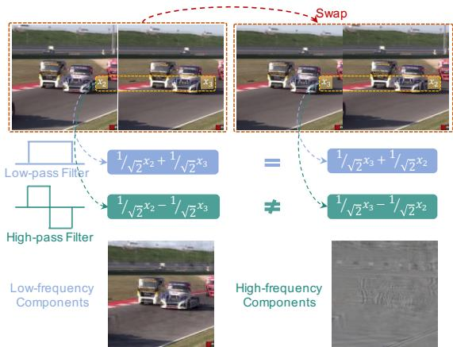
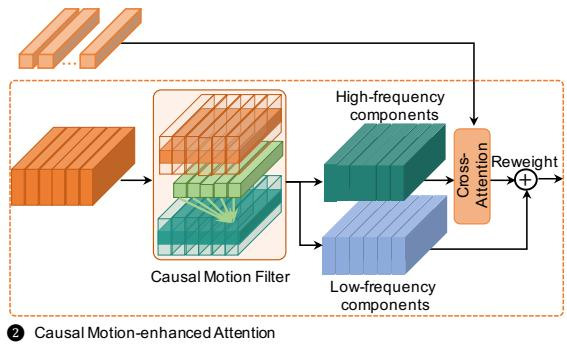
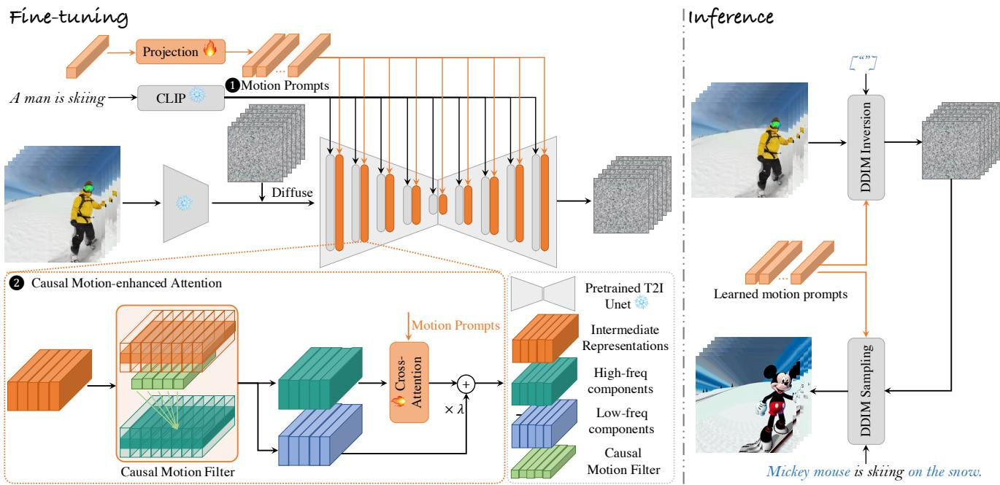
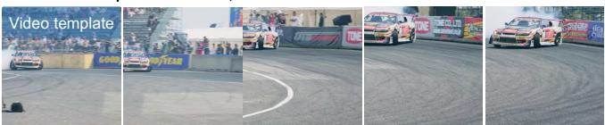
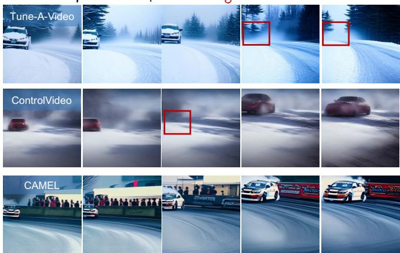
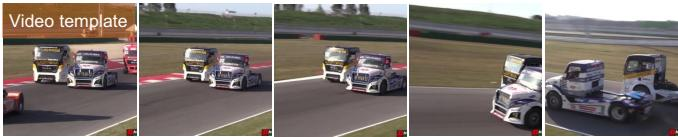
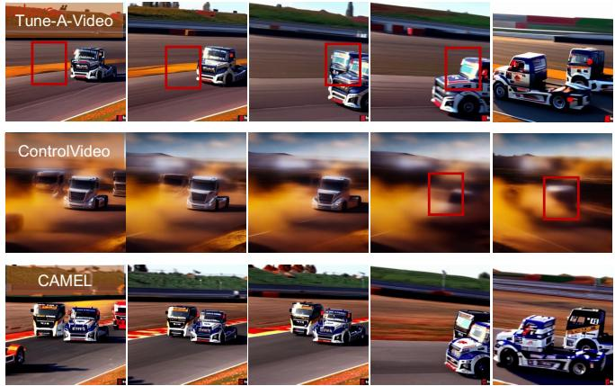
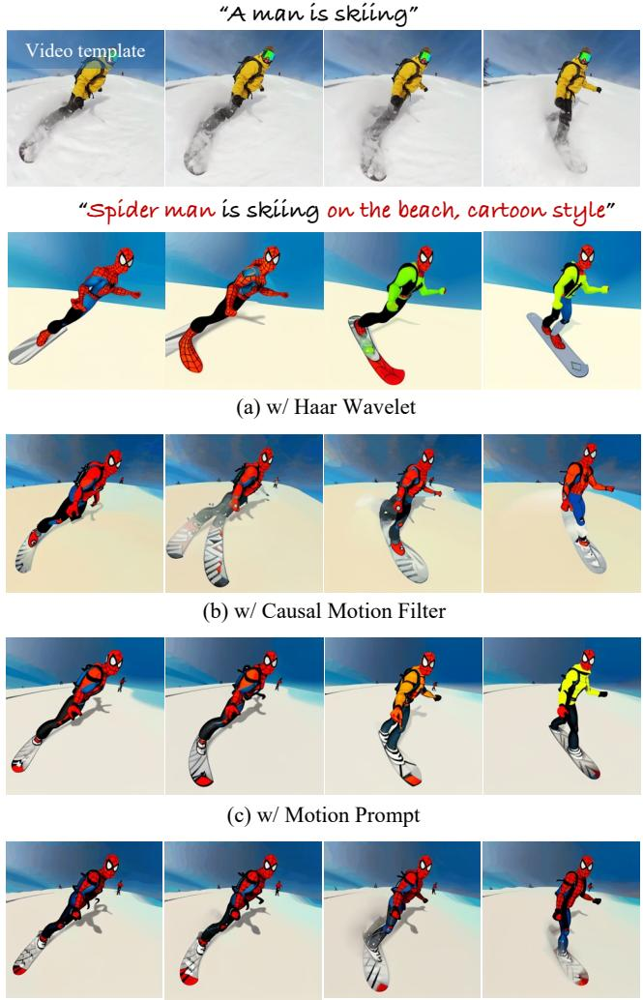
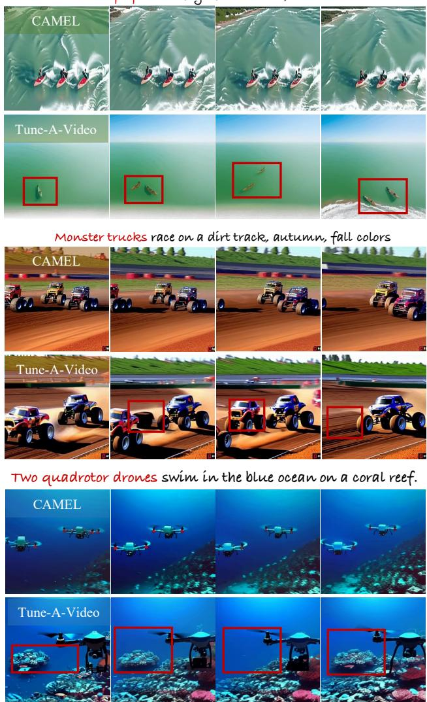

# CAMEL: CAusal Motion Enhancement tailored for Lifting Text-driven Video Editing

Guiwei Zhang1\*, Tianyu Zhang2\*, Guanglin Niu3†, Zichang Tan4, Yalong Bai2, Qing Yang2 1 School of Computer Science and Engineering, Beihang University. 2 Du Xiaoman Financial. 3 Institute of Artificial Intelligence, Beihang University.

4 Department of Computer Vision Technology (VIS), Baidu Inc.

{zhangguiwei,beihangngl}@buaa.edu.cn, tianyu1949@gmail.com tanzichang@baidu.com, ylbai@outlook.com, yangqing@duxiaoman.com

## Abstract

Text-driven video editing poses significant challenges in exhibitingflicker-free visual continuity while preserving the inherent motion patterns of original videos. Existing methods operate under a paradigm where motion and appearance are intricately intertwined. This coupling leads to the network either over-fitting appearance content – failing to capture motion patterns – or focusing on motion patterns at the expense of content generalization to diverse textual scenarios. Inspired by the pivotal role of wavelet transform in dissecting video sequences, we propose CAusal Motion Enhancement tailored for Lifting text-driven video editing (CAMEL), a novel technique with two core designs. First, we introduce motion prompts, designed to summarize motion conceptsfrom video templates through direct optimization. The optimized prompts are purposefully integrated into latent representations of diffusion models to enhance the motionfidelity ofgenerated results. Second, to enhance motion coherence and extend the generalization of appearance content to creative textual prompts, we propose the causal motion-enhanced attention mechanism. This mechanism is implemented in tandem with a novel causal motion filter, synergistically enhancing the motion coherence of disentangled high-frequency components, and concurrently preserving the generalization of appearance content across various textual scenarios. Extensive experimental results show the superior performance ofCAMEL.

## 1. Introduction

With rapid developments of text-to-image (T2I) diffusion models [16, 24, 26, 40], there have been several endeavors dedicated to replicating this success in text-to-video (T2V) generation [5, 7, 20, 30]. These models adopt the paradigm of inflating spatial-only T2I generation models to the spatiotemporal domain and then train on high-quality large-scale text-video pairs [1, 32] from scratch. Despite advancements, this paradigm is computationally expensive and time-consuming. Since pre-trained T2I models already capture the knowledge of open-domain concepts, recent works [14, 22, 33, 41] attempt to train a generalizable motion modeling module and plug it into the advanced T2I models for text-driven video editing. This enables preserving knowledge of pre-trained T2I models by freezing corresponding weights, thereby degrading computational costs.

The main challenges in text-driven video editing lie in two points: (1) content consistency, i.e., the content in the generated result should exhibit flicker-free visual consistency; and (2) motion coherence, i.e., the generated video should preserve the motion patterns from the video template without structural distortion. To overcome these challenges, most existing methods focused on parameterefficient tuning on additional temporal modeling [33], or training spatial-temporal Low-Rank Adaptions (LoRAs) [12]. However, these methods operate under a paradigm where motion and appearance are intricately intertwined. This coupling inevitably leads to the network either overfitting appearance content, i.e., failing to capture the underlying motion patterns, or focusing only on motion patterns at the expense of content generation to creative textual prompts. Although recent works on controllable textto-video generation [14, 41] introduce signals representing pre-defined motion patterns (e.g., depth maps or edges), strict spatial constraints imposed by the signals significantly limited freedom of motion dynamics.

To this end, we investigate a more suitable solution to disentangle content and motion dynamics within video templates through a frequency-based perspective. We first utilize the classical one-dimensional Haar wavelet transform [13, 27] to decompose the video template along its temporal dimension, segregating it into low- and high-frequency components. In Fig. 1 Top, we empirically interchange video frames within the predetermined Haar window. Note that simple swap operations only modify the motion patterns between frames, not the appearance content. This empirical manipulation yields the following insight:

❶ Optimized Motion Prompts  

  
Figure 1. Illustration of Haar wavelet transform (Top) and core components of our approach (Bottom). Within the Haar window, the decomposed low-frequency components primarily represent the appearance content of the video, while high-frequency components effectively capture variations in motion patterns. We are thus inspired to introduce CAMEL, a novel technique that enhances motion coherence and visual consistency through a decouplingthen-reweighting process of high- and low-frequency components.

Within the Haar window, the decomposed low-frequency components exhibit remarkable consistency in their characteristics before and after the swapping of video frames, while high-frequency components show higher sensitivity to the nuances ofvariations in motions.

This finding highlights the efficacy of Haar Wavelet transform in segregating video sequences into two distinct components: the low-frequency components predominantly representing appearance content, and the high-frequency components capturing variations in motion patterns.

Upon the effective decomposition of a video into highand low-frequency components, the ensuing critical task is to enhance the motion coherence while preserving the existing knowledge of appearance content within the pretrained T2I model. Inspired by the effective integration of CLIP [23] text embeddings in the T2I model, where they function as a textual guide for the denoising process of static image content, an intuitive extension is to introduce the motion condition. The objective is to steer the denoising process specifically for enhancing the motion coherence of generated results. In light of the above, we propose CAusal Motion Enhancement tailored for Lifting textdriven video editing (CAMEL), a novel technique with two core designs, as illustrated in Fig. 1 Bottom. First, we introduce the concept of motion prompts, designed to summarize motion concepts from video templates through an optimization process. The optimized motion prompts are then purposefully integrated into the latent representations of diffusion models, aiming to enhance motion fidelity in the generative results. Second, to enhance motion coherence and extend the generalization of appearance content to creative textual prompts, we propose a CAusal Motionenhanced Attnention mechanism, termed CAM-Attn. More specifically, CAM-Attn incorporates a causal motion filter, designed to decouple high-frequency components capturing contextualized motion patterns. The decoupled highfrequency components, once enhanced by learned motion conditions, are then reintegrated with low-frequency components to generate reweighted latent representations. This synergistic interaction between all core components is pivotal in enhancing motion coherence while ensuring the gen eralization of appearance content to diverse creative scenarios. Our contributions include:

• We propose motion prompts to summarize motion concepts from video templates through direct optimization. The learned prompts are purposefully integrated into the latent representations of diffusion models, aiming to enhance motion fidelity in the generative results.

• We develop a causal motion-enhanced attention mechanism, which operates in conjunction with a novel causal motion filter. The goal is to enhance the motion coherence of latent representations while preserving content generalization to creative textual scenarios.

• Extensive experiments show that CAMEL performs favorably on text-driven video editing benchmarks, especially in enhancing motion coherence and visual consistency of the generated results.

## 2. Related Work

## 2.1. Text-to-Video Diffusion models

The significant advancements of Latent Diffusion Models in the T2I generation [3, 16, 24, 39, 43] demonstrate its potential in T2V generation. Video LDM [2] and MagicVideo [42] use a spatiotemporal factorized U-Net to denoise from randomly sampled sequences of Gaussian noises in the latent space. VideoComposer [31] is capable of flexibly composing a video with diverse conditions, e.g. sketch and motion vectors while maintaining the synthesis quality. AnimateDiff [7] trains a set of motion layers capable of being applied to customized T2I models. PYoCo [5] and VideoFusion [20] propose video noise priors dedicated to sequential video generation. Despite impressive progress, training above T2V models from scratch is computationally demanding and necessitates high-quality, large-scale text-video pairs $( e . g .$ ., WebVid-10M [1] and InternVid [32]), which is expensive and time-consuming.

## 2.2. Text-driven Video Editing

The objective of text-driven video editing is to edit the content of a video template by animating existing T2I diffusion models and sub-network tuning while preserving the original motion patterns. This setting is more computationally efficient compared to training T2V models from scratch. Tune-A-Video [33] proposes efficient temporal attention tuning to achieve one-shot video generation. Video-P2P [18] transfers the concept of Prompt-to-prompt [8] editing to video editing via decouple-guidance cross-attention control. TokenFlow [6] enforces semantic correspondences of intermediate diffusion representations across frames, effectively preserving motion patterns and elevating temporal consistency. Text2Video-Zero [14] introduces a trainingfree method to animate a pre-trained T2I model via reprogramming frame-level self-attention with cross-frame attention. Render-A-Video [37] introduces optical flow [35] as a prior to guide hierarchical cross-frame constraint, thereby improving both global and local temporal consistency.

Inspired by the pivotal role of wavelet transform in video sequence analysis, we develop two core components: a causal motion-enhanced attention mechanism and learnable motion prompts. These components work in tandem to enhance motion coherence, simultaneously extending appearance generalization to diverse textual scenarios.

## 3. Method

Given a video template and a source text prompt depicting it, the goal is to generate a novel video driven by an edited text prompt ${ \mathcal { P } } ^ { * }$ . The central challenge lies in generating a video that not only aligns with the appearance content as depicted in ${ \mathcal { P } } ^ { * }$ but also preserves the motion patterns inherent in the video template. Note that our development builds upon the foundation of pre-trained T2I models. In the following, we first provide a brief overview of T2I diffusion models in Sec. 3.1, followed by a specific description of our approach in Sec. 3.2 and Sec. 3.3. The overall of our approach is illustrated in Fig. 2.

## 3.1. Preliminaries

General Text-to-image Generation. Our development is based on Stable Diffusion (SD) [24], which executes the denoising process in the latent space of a pre-trained autoencoder [29]. During the forward process, an image is initially mapped to the latent input $z _ { \mathrm { 0 } } ,$ , then perturbed by a predefined Markov process, formulated below:

$$
q \left( z _ { t } \mid z _ { t - 1 } \right) = \mathcal { N } \left( z _ { t } ; \sqrt { 1 - \beta _ { t } } z _ { t - 1 } , \beta _ { t } \mathrm { I } \right)\tag{1}
$$

where $t = 1 , \dots , T$ , with $T$ being the total number of steps in the forward diffusion process. The parameter $\beta _ { t }$ controls the noise strength at timestep t. The above iterative process can be simplified as follows:

$$
z _ { t } = \sqrt { \bar { \alpha } _ { t } } z _ { 0 } + \sqrt { 1 - \bar { \alpha } _ { t } } \epsilon , \epsilon \sim \mathcal { N } ( 0 , \mathrm { I } )\tag{2}
$$

where $\begin{array} { r } { \bar { \alpha } _ { t } = \prod _ { i = 1 } ^ { t } \alpha _ { t } , \alpha _ { t } = 1 - \beta _ { t } } \end{array}$ . Besides, ϵ is the Gaussian noise added to the latent input $z _ { 0 }$ . Stable Diffusion aims to minimize the vanilla training objective proposed in DDPM [11], formulated below:

$$
\mathcal { L } = \mathbb { E } _ { z _ { 0 } , y , \epsilon \sim \mathcal { N } ( 0 , I ) , t } \left[ \left| | \epsilon - \epsilon _ { \theta } \left( z _ { t } , t , \tau _ { \theta } ( y ) \right) | | _ { 2 } ^ { 2 } \right] \right|\tag{3}
$$

where y is the corresponding textual prompts given an input image. $\epsilon _ { \theta } ( \cdot )$ and $\tau _ { \theta } ( \cdot )$ denote the noise prediction function and the text encoder of the SD model, which is implemented with a modified UNet [25] and the CLIP ViT-L/14 text encoder [23], respectively.

Text-to-Image Animation. To animate a pre-trained T2I model for video generation, a common practice is to inflate the 2D UNet [25] by incorporating temporal self-attention layers to learn reasonable motion priors. To be specific, at each temporal self-attention layer of the UNet, we have:

$$
{ \mathrm { A t t n } } ( Q ^ { \ell } , K ^ { \ell } , V ^ { \ell } ) = { \mathrm { s o f t m a x } } \left( { \frac { Q ^ { \ell } K ^ { \ell ^ { T } } } { \sqrt { d } } } \right) \cdot V ^ { \ell }\tag{4}
$$

$$
Q ^ { \ell } = W _ { Q } ^ { \ell } \cdot \varphi \left( z ^ { \ell } \right) , K ^ { \ell } = W _ { K } ^ { \ell } \cdot \varphi \left( z ^ { \ell } \right) , V ^ { \ell } = W _ { V } ^ { \ell } \cdot \varphi \left( z ^ { \ell } \right)\tag{5}
$$

where the function $\varphi : \mathbb { R } ^ { b \times h \times w \times f \times c }  \mathbb { R } ^ { b h w \times f \times c }$ is to flatten the intermediate representations $z ^ { \ell }$ encoded by the l-th block, and $b , f , w , h ,$ c determines the size of the batch, frame, width, height, and channel dimensions, respectively. $W _ { Q } ^ { \ell } , W _ { K } ^ { \ell }$ and $W _ { V } ^ { \ell }$ are learnable projection matrices of the temporal self-attention layer at the l-th block.

## 3.2. CAMEL

The goal of CAMEL is to enhance motion coherence while preserving the generalization of appearance content to diverse textual prompts. Below, we outline the underlying mechanism of CAMEL, including ➊ Motion Prompt Learning, and ➋ Causal Motion-enhanced Attention.

  
Figure 2. The overall of CAusal Motion Enhancement for Lifting text-driven video editing, consisting of ➊ Motion Prompt Learning and ➋ CAusal Motion-enhanced Attention (CAM-Attn). The synergistic interaction between the two components is pivotal in enhancing motion coherence, concurrently preserving the generalization of appearance content across various textual prompts. During inference, the learned motion prompts function as a motion condition, and work synergistically with the textual condition for the denoising process.

➊ Motion Prompt Learning. The objective is to summarize motion concepts from the video template through direct optimization. Specifically, we initiate a single unconditional embedding m to represent the motion pattern we wish to learn. Subsequently, we use a small trainable projection network $\tau _ { \theta ^ { \prime } }$ to project the motion concept into a sequence of features $\overline { { \tau } } _ { \theta ^ { \prime } } ( m ) \in \mathbb { R } ^ { N \times d _ { r } }$ with length N. Note that the dimensions $d _ { r }$ of the learnable motion concepts are the same as the dimensions of the pre-trained CLIP text embeddings. The prompts are then purposefully integrated into the latent representations of diffusion models, aiming to enhance motion fidelity in the generative results (See ➋ CAusal Motion-enhanced attention). At each timestep, the motion prompts are learned through direct optimization, by minimizing Eq. (3) with additional motion prompts as conditions. Please refer to Sec. 3.3 for more details.

➋ Causal Motion-enhanced Attention. The purpose of CAusal Motion-enhanced Attention (CAM-Attn) is to enhance the motion coherence of latent representations while extending the generalization of appearance content to creative textual scenarios. Drawing inspirations from the pivotal role of wavelet transform in decomposing video sequences into distinct frequency components – with lowfrequency components representing appearance content and high-frequency components capturing motion patterns – we first work on developing a novel filter specifically engineered for CAM-Attn. Taking the simplest one-dimensional

Haar Wavelet Transform as an example, we decompose the high-frequency components from the latent representations $\varphi \left( z ^ { \ell } \right)$ along the temporal dimension, formulated below:

$$
z _ { H } ^ { \ell } \left[ : , n , : \right] = \sum _ { k = 0 } ^ { 1 } \varphi \left( z ^ { \ell } \right) \left[ : , 2 n + k , : \right] \cdot { \mathbf { h } } ( k ) ,\tag{6}
$$

where $\begin{array} { r l } { \mathbf { h } } & { { } = \ \left( \frac { \sqrt { 2 } } { 2 } , - \frac { \sqrt { 2 } } { 2 } \right) } \end{array}$ and $z _ { H } ^ { \ell }$ represents the decomposed high-frequency components representing motion patterns (e.g., a man is skiing) within the video template.

Although the Haar wavelet transform is a prevalent technique in digital signal processing [4, 15, 38], the utility in disentangling motion patterns from video sequences has its limitations. As illustrated in Fig. 1 Top, the Haar transform is inherently constrained by its two-element wide window, where each high-frequency coefficient is limited to summarize the difference within the internals of the two elements. Consequently, this limitation manifests in a scenario where the disentangled high-frequency components might be overly localized, hindering their capacity to accurately capture motion patterns that encompass large changes and extended time spans. Inspired by intuitive human perception, which typically involves considering motion patterns from preceding moments to analyze current motion dynamics, we develop a novel causal motion filter, denoted as $\mathcal { C } _ { H , \sigma }$ , to decompose high-frequency components:

$$
\mathcal { C } _ { H , \sigma } \left( x \right) \left[ : , n , : \right] = \sum _ { k = 0 } ^ { \sigma } x \left[ : , n - k , : \right] \cdot \mathbf { c } ( k )\tag{7}
$$

$$
z _ { H } ^ { \ell } = \mathcal { C } _ { H , \sigma } \left( \varphi \left( z ^ { \ell } \right) \right)\tag{8}
$$

where the parameter σ determines the window width of the filter, and $\mathbf { c } = ( c _ { 0 } , \cdots , c _ { \sigma } )$ represent the set of learnable coefficients. Note that we set the window width σ to 11, which provides a broader perceptual field than that provided by the Haar wavelet. In contrast to traditional hand-designed wavelets, the coefficients within the causal motion filter are made optimizable. This makes the filter highly customizable for text-driven video editing. In Eq. (7), the filter is designed to function through a causal mechanism, closely mirroring human cognitive processes. This parallel is particularly notable in its ability to analyze preceding motions as a precursor to understanding current motion patterns. Such a design facilitates the effective decoupling of high-frequency components from the latent representations, thus accurately capturing contextualized motion patterns.

Subsequently, the disentangled high-frequency components are enhanced through a cross-attention mechanism with learnable motion prompts as motion conditioning. The specific formulation is as follows:

$$
Q _ { H } ^ { \ell } = \tilde { W } _ { Q } ^ { \ell } \cdot z _ { H } ^ { \ell } , K _ { m } ^ { \ell } = \tilde { W } _ { K } ^ { \ell } \cdot \tau _ { \theta ^ { \prime } } ( m ) , V _ { m } ^ { \ell } = \tilde { W } _ { V } ^ { \ell } \cdot \tau _ { \theta ^ { \prime } } ( m )\tag{9}
$$

$$
\hat { z } _ { H } ^ { \ell } = \mathrm { A t t n } ( Q _ { H } ^ { \ell } , K _ { m } ^ { \ell } , V _ { m } ^ { \ell } )\tag{10}
$$

where $\tilde { W } _ { Q } ^ { \ell } , \tilde { W } _ { K } ^ { \ell }$ and $\tilde { W } _ { V } ^ { \ell }$ are learnable projection matrices dedicated to the l-th CAM-Attn layer. $\hat { z } _ { H } ^ { \ell }$ represents the high-frequency components enhanced by the motion conditions at the l-th layer. The integration of motion prompts is beneficial to enhance the motion coherence of disentangled high-frequency components, which function under a paradigm analogous to the textual condition.

Afterward, we reintegrate the enhanced high-frequency components representing contextualized motion patterns, with the complementary low-frequency components that represent appearance content. This integration generates reweighted latent representations, formulated below:

$$
\mathrm { C A M - A t t n } : = \hat { z } _ { H } ^ { \ell } + \mathcal { C } _ { L , \sigma } \left( \varphi \left( z ^ { \ell } \right) \right)\tag{11}
$$

where $\mathcal { C } _ { L , \sigma } \left( \cdot \right)$ represents the low-pass filter, which functions in a manner counter to that of $\mathcal { C } _ { H , \sigma } \left( \cdot \right)$ . To be specific, $\mathcal { C } _ { L , \sigma } \left( \cdot \right)$ can be implemented simply by subtracting the highfrequency components from the intermediate representations $\varphi \stackrel { \cdot \mathrm { \varphi } } { ( } z ^ { \ell } \stackrel { \cdot } { ) }$ . This decoupling-then-reweighting mechanism is conducive to enhancing the motion coherence of generated results, simultaneously preserving the generalization of appearance content to various creative textual prompts.

## 3.3. Fine-Tuning and Inference

Fine-tuning. During fine-tuning on the video template, we keep the parameters $W _ { K } ^ { \ell }$ and $W _ { V } ^ { \ell }$ in the attention layers of pre-trained T2I diffusion models fixed, and only optimize $W _ { Q } ^ { \ell }$ and our proposed CAMEL module. Overall, the optimization objective can be formulated as follows:

$$
\mathcal { L } = \mathbb { E } _ { z _ { 0 } , y , \epsilon \sim \mathcal { N } ( 0 , I ) , t } \left[ \lVert \epsilon - \epsilon _ { \theta } \left( z _ { t } , t , \tau _ { \theta } ( y ) , \tau _ { \theta ^ { \prime } } ( m ) \right) \rVert _ { 2 } ^ { 2 } \right]\tag{12}
$$

Inference. During inference, we incorporate structure guidance from the video template. To be specific, DDIM inversion [28] is employed to obtain a latent noise of the source video. We also incorporate classifier-free guidance [10] to enhance the video-text alignment of generated results:

$$
\begin{array} { r } { \widehat { \epsilon } _ { \theta } \left( z _ { t } , t , \tau _ { \theta } ( y ) , \tau _ { \theta ^ { \prime } } ( m ) \right) = w \cdot \epsilon _ { \theta } \left( z _ { t } , t , \tau _ { \theta } ( y ) , \tau _ { \theta ^ { \prime } } ( m ) \right) } \\ { + \left( 1 - w \right) \cdot \epsilon _ { \theta } \left( z _ { t } , t , \tau _ { \theta ^ { \prime } } ( m ) \right) } \end{array}\tag{13}
$$

where w denotes the guidance scale that adjusts the alignment with both textual and motion conditions. Our experiments in Sec. 4 demonstrate that CAMEL performs favorably in accurately transferring the motion patterns from the video templates to the generated results, simultaneously maintaining the generalization of appearance content to diverse creative scenarios.

## 4. Experiments

## 4.1. Experimental Settings

Dataset. We conducted comparative experiments on 53 videos from the LOVEU-TGVE competition [34], of which 16 videos are from DAVIS [21], denoted as TGVE-DAVIS, and the other 37 videos are from Videvo, denoted as TGVE-Videvo. Following the settings of the competition, each video is uniformly sampled at 32 frames, with a resolution of $4 8 0 \times 4 8 0$ . Furthermore, each video is associated with a ground-truth caption and 4 creative text prompts for object editing, background changes, style transfers, and multiple changes, respectively.

Implementation Details. We inflate the pre-trained text-toimage diffusion model Stable Diffusion v1.4, and integrate our proposed CAMEL into the UNet. The projection network $\tau _ { \theta ^ { \prime } }$ we used in this study consists of a linear layer and a Layer Normalization. The window width $\sigma$ in Eq. (7) is set to 11 and the length of learnable motion prompts is set to 32. We finetune our method for 500 timesteps on a learning rate $3 \times 1 0 ^ { - 5 }$ and a batch size 1. During inference, we implement 50 timesteps for DDIM inversion and DDIM sampling [28] with classifier-free guidance [10]. All experiments are implemented on a single A100 GPU.

Source Prompt: “A car drifts on a racetrack”  

Edited Prompt: “A car drifts on a snowy road.”  
  
(a) Effectiveness in Improving Motion Coherence

Source Prompt: “Trucks drive on a racetrack.”  
  
Edited Prompt: “Trucks drive on a racetrack, autumn, fall

  
(b) Effectiveness in Improving Content Consistency

Figure 3. Qualitative comparisons of evaluated methods in improving (a) motion coherence and (b) content consistency.
<table><tr><td rowspan="2">Method</td><td colspan="4">Video-Text Alignment</td></tr><tr><td>Object</td><td>Background</td><td>Style</td><td>Multiple</td></tr><tr><td>Tune-A-Video [33]</td><td>35.02</td><td>34.98</td><td>33.31</td><td>32.76</td></tr><tr><td>Text2Video-Zero [14]</td><td>32.69</td><td>30.93</td><td>32.03</td><td>31.58</td></tr><tr><td>ControlVideo [14]</td><td>30.98</td><td>30.96</td><td>30.66</td><td>30.35</td></tr><tr><td>CAMEL</td><td>36.52</td><td>36.60</td><td>34.08</td><td>33.92</td></tr></table>

(a) Evaluated on the TGVE-DAVIS dataset.

<table><tr><td rowspan="2">Method</td><td colspan="4">Video-Text Alignment</td></tr><tr><td>Object</td><td>Background</td><td>Style</td><td>Multiple</td></tr><tr><td>Tune-A-Video [33]</td><td>35.49</td><td>36.15</td><td>34.59</td><td>35.02</td></tr><tr><td>Text2Video-Zero [14]</td><td>31.71</td><td>31.47</td><td>32.11</td><td>31.26</td></tr><tr><td>ControlVideo [14]</td><td>32.91</td><td>31.84</td><td>31.79</td><td>32.79</td></tr><tr><td>CAMEL</td><td>37.03</td><td>37.54</td><td>35.26</td><td>37.36</td></tr></table>

(b) Evaluated on the TGVE-Videvo dataset.  
Table 1. Quantitative comparisons in video-text alignment with state-of-the-art approaches. The best results are highlighted in bold.

Evaluation Metrics. To evaluate video-text alignment, we adopt UMTScore [19], which is proven to exhibit a significantly higher correlation with human standards than CLIP Score [9]. More specifically, UMTScore replaces the CLIP model [23] with a more advanced vision-language model UMT [17], which is pre-trained on large-scale video-text data [1] and further finetuned on MSR-VTT [36]. In our assessment of frame consistency, we follow the method applied in Tune-A-Video [33], which computes CLIP [23] image embeddings on all frames of generated videos. Subsequently, we report the average cosine similarity between all pairs of video frames.

## 4.2. Qualitative Results

Fig. 3 presents a detailed visual comparison of the CAMEL with the state-of-the-art approaches, especially focusing on the effectiveness in improving motion coherence and content consistency of the generated results. In Fig. 3 (a), although Tune-A-Video [33] and ControlVideo [41] can generate videos that capture the concept of “snowy road”, both of them fail to capture the crucial motion patterns “drift” from the original video template. Additionally, Tune-A Video loses the key subject “car” towards the end of the generated result. In contrast to existing methods, our proposed CAMEL excels in not only accurately capturing motion patterns but also in seamlessly transferring these patterns across a variety of creative textual scenarios. In Fig. 3 (b), although Tune-A-Video captures the “driving” action in the original video, it has shortcomings in maintaining visual consistency between frames. This flaw is evident through the sudden appearance of other trucks and the apparent difference in truck shapes, reducing the overall visual consistency. On the contrary, our proposed CAMEL demonstrates the capacity to effectively preserve both subjects and motion patterns from the original video, and transfer these elements to a different style, such as “autumn, fall colors”.

<table><tr><td>Method</td><td colspan="4">Video-Text Alignment</td></tr><tr><td></td><td>Object</td><td>Background</td><td>Style</td><td>Multiple</td></tr><tr><td>Tune-A-Video [33]</td><td>90.73</td><td>92.13</td><td>91.0</td><td>91.32</td></tr><tr><td>Text2Video-Zero [14] ControlVideo [41]</td><td>92.19 90.78</td><td>92.12 89.82</td><td>92.24 91.71</td><td>92.58 91.36</td></tr><tr><td>CAMEL</td><td>93.35</td><td>95.16</td><td>93.87</td><td>93.46</td></tr></table>

(a) Evaluated on the TGVE-DAVIS dataset.

<table><tr><td rowspan="2">Method</td><td colspan="4">Video-Text Alignment</td></tr><tr><td>Object</td><td>Background</td><td>Style</td><td>Multiple</td></tr><tr><td>Tune-A-Video [33]</td><td>94.86</td><td>95.35</td><td>95.40</td><td>94.98</td></tr><tr><td>Text2Video-Zero [14]</td><td>96.43</td><td>97.06</td><td>96.69</td><td>96.7</td></tr><tr><td>ControlVideo [41]</td><td>96.47</td><td>96.07</td><td>96.77</td><td>96.71</td></tr><tr><td>CAMEL</td><td>97.10</td><td>97.56</td><td>97.55</td><td>97.02</td></tr></table>

(b) Evaluated on the TGVE-Videvo dataset.

Table 2. Quantitative comparisons in frame consistency with state-of-the-art approaches. The best results are highlighted in bold.
<table><tr><td rowspan="2">Index</td><td rowspan="2"></td><td rowspan="2">w/ Haar Wavelet w/ Causal Motion Filter w/ Motion Prompt</td><td rowspan="2"></td><td colspan="4">TGVE-D</td></tr><tr><td>Object</td><td>Background</td><td>Style</td><td>Multiple</td></tr><tr><td>1</td><td>√</td><td>×</td><td>X</td><td>35.03</td><td>34.95</td><td>33.24</td><td>32.91</td></tr><tr><td>2</td><td>X</td><td>√</td><td>X</td><td>36.03</td><td>35.98</td><td>33.78</td><td>33.54</td></tr><tr><td>3</td><td>X</td><td>X</td><td>√</td><td>35.31</td><td>35.24</td><td>33.56</td><td>33.14</td></tr><tr><td>4</td><td>X</td><td>V</td><td>√</td><td>36.52</td><td>36.60</td><td>34.08</td><td>33.92</td></tr></table>

Table 3. Ablation study over TGVE-DAVIS dataset. Video-text alignment (UMTScore) is reported.

## 4.3. Quantitative Comparisons

We compare our method with mainstream text-driven video editing approaches: Tune-A-Video [33], Text2Video-Zero [14], and ControlVideo [41]. For Tune-A-Video, we fine-tune the model on the given video template and use the DDIM sampler with classifier-free guidance during inference. In Text2Video-Zero and ControlVideo, we utilize edge maps as the structural conditions. Tab. 1 and Tab. 2 show the quantitative comparison results regarding videotext alignment and frame consistency. We can observe that CAMEL achieves consistent improvements on both datasets. For video-text alignment on the TGVE-DAVIS dataset, our CAMEL outperforms the competing approach, Tune-A-Video, by 1.5%/1.62%/0.77%/1.16% UMTScore on the tasks of object editing, background changes, style transfer, and multiple editing, respectively. With regard to frame consistency, our CAMEL also achieves consistent improvements. The results indicate that each core design of CAMEL works synergistically to elevate both the textual faithfulness and content consistency of generated videos.

## 4.4. Abalation Study

We conduct ablation studies to evaluate the core designs of CAMEL. The quantitative results are shown in Tab. 3 and a representative visualization can be seen in Fig. 4.

Effectiveness of Motion Prompt Learning. We implement the “w/o motion prompt” variant by replacing the cross-attention mechanism in Eq. (10) with the vanilla selfattention. This alteration causes the high-frequency components to interact solely with themselves. From index-2 and index-4, we observe performance degradation in video-text alignment under the setting of “w/o motion prompt”. Additionally, the visualization comparison delineated in Fig. 4 (b) and (d) further shows the pivotal significance of motion prompts in enhancing the overall motion coherence of generated videos.

Effectiveness of Causal Motion Filter. From index-3 and index-4, the implementation of “w/o causal motion filter” involves a process where the intermediate representations engage directly with the learned motion prompts. This results in the coupling of high- and low-frequency components. From index-3 and index-4, we observe that UMTScore drops significantly on the task of object editing, and background changes. The visual comparison in Fig. 4 (c) and (d) further provides clear evidence that the coupling method can lead to significant limitations: it either causes the models to fail in accurately capturing motion patterns or results in a loss of content generalization when adapting to various textual prompts. In contrast, our CAM-Attn is beneficial to enhance motion coherence, while maintaining content generalization to creative textual prompts.

We additionally compare the decomposition of highfrequency components using our dedicated causal motion filter and the hand-crafted Haar wavelet. From index-1 and index-2, UMTScore drops significantly when the Haar wavelet is applied. The corresponding visualization results, presented in Fig. 4 (a), also illustrate that a too-narrow window width may perform poorly in maintaining content consistency along large motion changes. Notably, despite certain limitations, it still achieves comparable performance compared to mainstream methods.

  
(d) w/ Causal Motion Filter and w/ Motion Prompt  
Figure 4. Visualization of ablation results.

## 4.5. Effectiveness in Multi-object Editing

We further demonstrate the superior performance of CAMEL when the edited videos contain multiple objects. In Fig. 5, compared to Tune-A-Video which exhibits serious flickering issues in scenes with multiple objects, e.g., several people, monster trucks, and two quadrotor drones, CAMEL maintains a high degree of visual consistency. Although recent research [33] has highlighted limitations of pre-trained T2I models in multi-object editing, our method effectively overcomes this issue through the synergistic application of CAM-Attn and the causal motion filter. This combination facilitates an effective decouplingthen-reweighting mechanism between motion patterns and appearance content within the filter window. In comparison to global temporal self-attention, this causal interaction effectively enhances the motion coherence of disentangled high-frequency components, while preserving the generalization of appearance content across multiple objects.

Several people ride kayaks in a river, aerial view  
  
Figure 5. Illustration of our method’s superior performance in generating videos that feature multiple objects.

## 5. Conclusion

In this work, we developed Causal Motion Enhancement for Lifting text-driven video editing. First, we introduce learnable motion prompts to summarize motion concepts from video templates. Inspired by the pivotal role of wavelet transform in dissecting video sequences, we propose a CAusal Motion-enhanced Attention mechanism (CAM-Attn) in conjunction with a novel causal motion filter. This synergy between the two components facilitates enhancing motion coherence, concurrently preserving the generalization of appearance content across various textual scenarios. Extensive experimental results show its superior performance on text-to-video editing benchmarks.

## References

[1] Max Bain, Arsha Nagrani, Gul Varol, and Andrew Zisser-¨ man. Frozen in time: A joint video and image encoder for end-to-end retrieval. In Proceedings ofthe IEEE/CVF International Conference on Computer Vision, pages 1728–1738, 2021. 1, 3, 6

[2] Andreas Blattmann, Robin Rombach, Huan Ling, Tim Dockhorn, Seung Wook Kim, Sanja Fidler, and Karsten Kreis. Align your latents: High-resolution video synthesis with latent diffusion models. In Proceedings ofthe IEEE/CVF Conference on Computer Vision and Pattern Recognition, pages 22563–22575, 2023. 3

[3] Li Chen, Mengyi Zhao, Yiheng Liu, Mingxu Ding, Yangyang Song, Shizun Wang, Xu Wang, Hao Yang, Jing Liu, Kang Du, et al. Photoverse: Tuning-free image customization with text-to-image diffusion models. arXiv preprint arXiv:2309.05793, 2023. 2

[4] Shin Fujieda, Kohei Takayama, and Toshiya Hachisuka. Wavelet convolutional neural networks. arXiv preprint arXiv:1805.08620, 2018. 4

[5] Songwei Ge, Seungjun Nah, Guilin Liu, Tyler Poon, Andrew Tao, Bryan Catanzaro, David Jacobs, Jia-Bin Huang, Ming-Yu Liu, and Yogesh Balaji. Preserve your own correlation: A noise prior for video diffusion models. In Proceedings ofthe IEEE/CVF International Conference on Computer Vision, pages 22930–22941, 2023. 1, 3

[6] Michal Geyer, Omer Bar-Tal, Shai Bagon, and Tali Dekel. Tokenflow: Consistent diffusion features for consistent video editing. arXiv preprint arXiv:2307.10373, 2023. 3

[7] Yuwei Guo, Ceyuan Yang, Anyi Rao, Yaohui Wang, Yu Qiao, Dahua Lin, and Bo Dai. Animatediff: Animate your personalized text-to-image diffusion models without specific tuning. arXiv preprint arXiv:2307.04725, 2023. 1, 3

[8] Amir Hertz, Ron Mokady, Jay Tenenbaum, Kfir Aberman, Yael Pritch, and Daniel Cohen-Or. Prompt-to-prompt image editing with cross attention control. arXiv preprint arXiv:2208.01626, 2022. 3

[9] Jack Hessel, Ari Holtzman, Maxwell Forbes, Ronan Le Bras, and Yejin Choi. Clipscore: A reference-free evaluation metric for image captioning. arXiv preprint arXiv:2104.08718, 2021. 6

[10] Jonathan Ho and Tim Salimans. Classifier-free diffusion guidance. arXiv preprint arXiv:2207.12598, 2022. 5

[11] Jonathan Ho, Ajay Jain, and Pieter Abbeel. Denoising diffusion probabilistic models. Adv. Neural Inform. Process. Syst., 33:6840–6851, 2020. 3

[12] Edward J Hu, Yelong Shen, Phillip Wallis, Zeyuan Allen-Zhu, Yuanzhi Li, Shean Wang, Lu Wang, and Weizhu Chen. Lora: Low-rank adaptation of large language models. arXiv preprint arXiv:2106.09685, 2021. 1

[13] Bjorn Jawerth and Wim Sweldens. An overview of wavelet¨ based multiresolution analyses. SIAM review, 36(3):377– 412, 1994. 2

[14] Levon Khachatryan, Andranik Movsisyan, Vahram Tadevosyan, Roberto Henschel, Zhangyang Wang, Shant Navasardyan, and Humphrey Shi. Text2video-zero: Text-to-

image diffusion models are zero-shot video generators. arXiv preprint arXiv:2303.13439, 2023. 1, 3, 6, 7

[15] Jae-Han Lee, Minhyeok Heo, Kyung-Rae Kim, and Chang-Su Kim. Single-image depth estimation based on fourier domain analysis. In Proceedings of the IEEE Conference on Computer Vision and Pattern Recognition, pages 330–339, 2018. 4

[16] Dongxu Li, Junnan Li, and Steven CH Hoi. Blipdiffusion: Pre-trained subject representation for controllable text-to-image generation and editing. arXiv preprint arXiv:2305.14720, 2023. 1, 2

[17] Kunchang Li, Yali Wang, Yizhuo Li, Yi Wang, Yinan He, Limin Wang, and Yu Qiao. Unmasked teacher: Towards training-efficient video foundation models. arXiv preprint arXiv:2303.16058, 2023. 6

[18] Shaoteng Liu, Yuechen Zhang, Wenbo Li, Zhe Lin, and Jiaya Jia. Video-p2p: Video editing with cross-attention control. arXiv preprint arXiv:2303.04761, 2023. 3

[19] Yuanxin Liu, Lei Li, Shuhuai Ren, Rundong Gao, Shicheng Li, Sishuo Chen, Xu Sun, and Lu Hou. Fetv: A benchmark for fine-grained evaluation of open-domain text-tovideo generation. In Thirty-seventh Conference on Neural Information Processing Systems Datasets and Benchmarks Track, 2023. 6

[20] Zhengxiong Luo, Dayou Chen, Yingya Zhang, Yan Huang, Liang Wang, Yujun Shen, Deli Zhao, Jingren Zhou, and Tieniu Tan. Videofusion: Decomposed diffusion models for high-quality video generation. In Proceedings of the IEEE/CVF Conference on Computer Vision and Pattern Recognition, pages 10209–10218, 2023. 1, 3

[21] Federico Perazzi, Jordi Pont-Tuset, Brian McWilliams, Luc Van Gool, Markus Gross, and Alexander Sorkine-Hornung. A benchmark dataset and evaluation methodology for video object segmentation. In Proceedings of the IEEE conference on computer vision and pattern recognition, pages 724–732, 2016. 5

[22] Chenyang Qi, Xiaodong Cun, Yong Zhang, Chenyang Lei, Xintao Wang, Ying Shan, and Qifeng Chen. Fatezero: Fusing attentions for zero-shot text-based video editing. arXiv preprint arXiv:2303.09535, 2023. 1

[23] Alec Radford, Jong Wook Kim, Chris Hallacy, Aditya Ramesh, Gabriel Goh, Sandhini Agarwal, Girish Sastry, Amanda Askell, Pamela Mishkin, Jack Clark, et al. Learning transferable visual models from natural language supervision. In International conference on machine learning, pages 8748–8763. PMLR, 2021. 2, 3, 6

[24] Robin Rombach, Andreas Blattmann, Dominik Lorenz, Patrick Esser, and Bjorn Ommer. High-resolution image¨ synthesis with latent diffusion models. In Proceedings of the IEEE/CVF conference on computer vision and pattern recognition, pages 10684–10695, 2022. 1, 2, 3

[25] Olaf Ronneberger, Philipp Fischer, and Thomas Brox. Unet: Convolutional networks for biomedical image segmentation. In Medical Image Computing and Computer-Assisted Intervention–MICCAI 2015: 18th International Conference, Munich, Germany, October 5-9, 2015, Proceedings, Part III 18, pages 234–241. Springer, 2015. 3

[26] Chitwan Saharia, William Chan, Saurabh Saxena, Lala Li, Jay Whang, Emily L Denton, Kamyar Ghasemipour, Raphael Gontijo Lopes, Burcu Karagol Ayan, Tim Salimans, et al. Photorealistic text-to-image diffusion models with deep language understanding. Advances in Neural Information Processing Systems, 35:36479–36494, 2022. 1

[27] Jiaxin Shi, Ke Alexander Wang, and Emily Fox. Sequence modeling with multiresolution convolutional memory. In International Conference on Machine Learning, pages 31312– 31327. PMLR, 2023. 2

[28] Jiaming Song, Chenlin Meng, and Stefano Ermon. Denoising diffusion implicit models. arXiv preprint arXiv:2010.02502, 2020. 5

[29] Aaron Van Den Oord, Oriol Vinyals, et al. Neural discrete representation learning. Advances in neural information processing systems, 30, 2017. 3

[30] Jiuniu Wang, Hangjie Yuan, Dayou Chen, Yingya Zhang, Xiang Wang, and Shiwei Zhang. Modelscope text-to-video technical report. arXiv preprint arXiv:2308.06571, 2023. 1

[31] Xiang Wang, Hangjie Yuan, Shiwei Zhang, Dayou Chen, Jiuniu Wang, Yingya Zhang, Yujun Shen, Deli Zhao, and Jingren Zhou. Videocomposer: Compositional video synthesis with motion controllability. arXiv preprint arXiv:2306.02018, 2023. 3

[32] Yi Wang, Yinan He, Yizhuo Li, Kunchang Li, Jiashuo Yu, Xin Ma, Xinyuan Chen, Yaohui Wang, Ping Luo, Ziwei Liu, et al. Internvid: A large-scale video-text dataset for multimodal understanding and generation. arXiv preprint arXiv:2307.06942, 2023. 1, 3

[33] Jay Zhangjie Wu, Yixiao Ge, Xintao Wang, Stan Weixian Lei, Yuchao Gu, Yufei Shi, Wynne Hsu, Ying Shan, Xiaohu Qie, and Mike Zheng Shou. Tune-a-video: One-shot tuning of image diffusion models for text-to-video generation. In Proceedings of the IEEE/CVF International Conference on Computer Vision, pages 7623–7633, 2023. 1, 3, 6, 7, 8

[34] Jay Zhangjie Wu, Xiuyu Li, Difei Gao, Zhen Dong, Jinbin Bai, Aishani Singh, Xiaoyu Xiang, Youzeng Li, Zuwe Huang, Yuanxi Sun, et al. Cvpr 2023 text guided video editing competition. arXiv preprint arXiv:2310.16003, 2023. 5

[35] Haofei Xu, Jing Zhang, Jianfei Cai, Hamid Rezatofighi, and Dacheng Tao. Gmflow: Learning optical flow via global matching. In Proceedings of the IEEE/CVF conference on computer vision and pattern recognition, pages 8121–8130, 2022. 3

[36] Jun Xu, Tao Mei, Ting Yao, and Yong Rui. Msr-vtt: A large video description dataset for bridging video and language. In Proceedings ofthe IEEE conference on computer vision and pattern recognition, pages 5288–5296, 2016. 6

[37] Shuai Yang, Yifan Zhou, Ziwei Liu, and Chen Change Loy. Rerender a video: Zero-shot text-guided video-to-video translation. arXiv preprint arXiv:2306.07954, 2023. 3

[38] Ting Yao, Yingwei Pan, Yehao Li, Chong-Wah Ngo, and Tao Mei. Wave-vit: Unifying wavelet and transformers for visual representation learning. In European Conference on Computer Vision, pages 328–345. Springer, 2022. 4

[39] Hu Ye, Jun Zhang, Sibo Liu, Xiao Han, and Wei Yang. Ipadapter: Text compatible image prompt adapter for text-to-

image diffusion models. arXiv preprint arXiv:2308.06721, 2023. 2

[40] Lvmin Zhang, Anyi Rao, and Maneesh Agrawala. Adding conditional control to text-to-image diffusion models. In Proceedings of the IEEE/CVF International Conference on Computer Vision, pages 3836–3847, 2023. 1

[41] Yabo Zhang, Yuxiang Wei, Dongsheng Jiang, Xiaopeng Zhang, Wangmeng Zuo, and Qi Tian. Controlvideo: Training-free controllable text-to-video generation. arXiv preprint arXiv:2305.13077, 2023. 1, 6, 7

[42] Daquan Zhou, Weimin Wang, Hanshu Yan, Weiwei Lv, Yizhe Zhu, and Jiashi Feng. Magicvideo: Efficient video generation with latent diffusion models. arXiv preprint arXiv:2211.11018, 2022. 3

[43] Yufan Zhou, Ruiyi Zhang, Tong Sun, and Jinhui Xu. Enhancing detail preservation for customized text-to-image generation: A regularization-free approach. arXiv preprint arXiv:2305.13579, 2023. 2