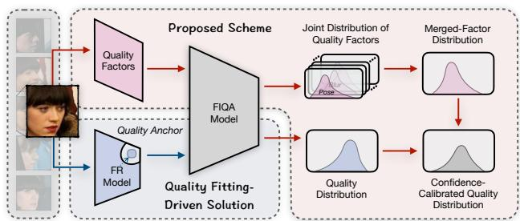
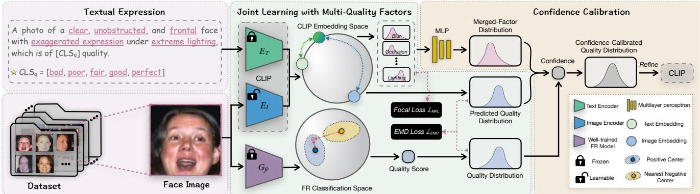
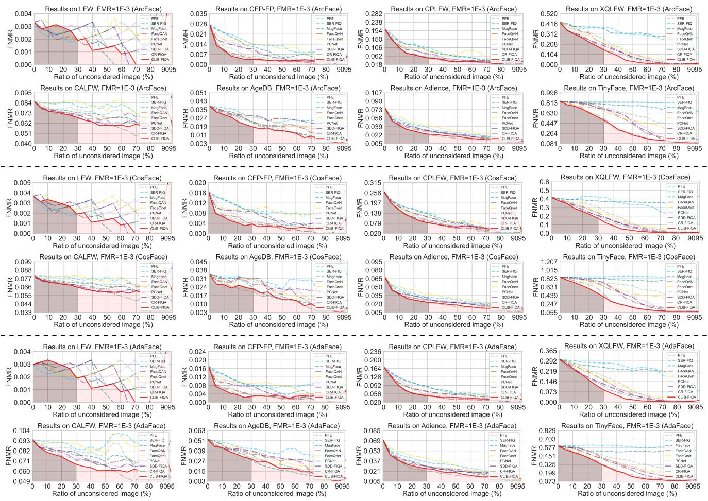
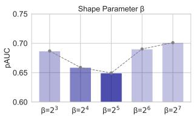
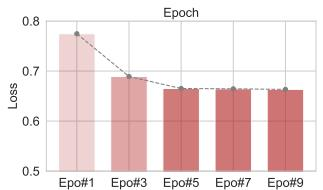
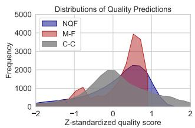
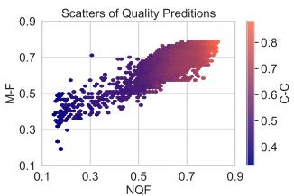

# CLIB-FIQA: Face Image Quality Assessment with Confidence CalibrationCLIP Lighting CLIPxcellent]

Fu-Zhao Ou1 Chongyi Li2, 3 Shiqi Wang1Image Encoder Sam Kwong4 1City University of Hong Kong, Hong Kong SAR, China 2Nankai University, Tianjin, China Image Embedding 3NKIARI (Shenzhen-Futian), Shenzhen, ChinaQuality AnchorG! 4Lingnan University, Hong Kong SAR, ChinaFrozen fuzhao.ou@my.cityu.edu.hk lichongyi@nankai.edu.cn shiqwang@cityu.edu.hk samkwong@ln.edu.hkFR Classification Space https://github.com/oufuzhao/CLIB-FIQA

## Abstract

Face Image Quality Assessment (FIQA) is pivotal for guaranteeing the accuracy of face recognition in unconstrained environments. Recent progress in deep qualityfitting-based methods that train models to align with quality anchors, has shown promise in FIQA. However, these methods heavily depend on a recognition model to yield quality anchors and indiscriminately treat the confidence of inaccurate anchors as equivalent to that of accurate ones during the FIQA model training, leading to a fitting bottleneck issue. This paper seeks a solution by putting forward the Confidence-Calibrated Face Image Quality Assessment (CLIB-FIQA) approach, underpinned by the synergistic interplay between the quality anchors and objective quality factors such as blur, pose, expression, occlusion, and illumination. Specifically, we devise a joint learning framework built upon the vision-language alignment model, which leverages the joint distribution with multiple quality factors to facilitate the quality fitting of the FIQA model. Furthermore, to alleviate the issue ofthe model placing excessive trust in inaccurate quality anchors, we propose a confidence calibration method to correct the quality distribution by exploiting to the fullest extent of these objective qualityfactors characterized as the merged-factor distribution during training. Experimental results on eight datasets reveal the superior performance ofthe proposed method.

## 1. Introduction

Face Image Quality Assessment (FIQA) aims at predicting the quality of face images to reflect the variability in sample recognizability, thereby ensuring consistent accuracy for face recognition systems in uncontrolled real-world environments [7, 47, 50]. In line with standards for biometric quality assessment [2, 19], face recognizability is influenced by specific quality factors, such as blur, pose, expression, occlusion, and illumination. These quality factors play an essential role in the effectiveness of recognition systems and are also key considerations in FIQA.

  
Figure 1. Illustration of the core idea of previous and the proposed FIQA schemes. Previous Quality Fitting-Driven Solution only considers the quality anchor provided by the dependent Face Recognition (FR) model. Our Proposed Scheme engages various quality factors to both facilitate the training of the FIQA model and calibrate the confidence of the quality distribution.

Nevertheless, in the era of deep learning, the evolution of FIQA is primarily shaped by strategies that exploit quality anchors for quality fitting [8, 12, 13, 21, 44, 64] or compute quality scores derived from the embedding property [5, 6, 38, 55, 56]. Herein, although quality-fitting-based FIQA training schemes have demonstrated promising performance [8, 44, 64] in recent years, they rest upon an assumption during training that quality anchors obtained from the dependent recognition model possess the same level of confidence. Regrettably, this assumption is flawed due to inconsistent quality variation among different classes within the training set. For instance, for samples with relatively low intra-class quality variation, their quality anchors may tend to be overall higher because of the minor fluctuations in intra-class recognition features. These inaccurate anchors will further lead to the fitting bottleneck challenge during the training of the FIQA model.

A potentially effective strategy is to utilize quality factors to aid in the training of the FIQA model. This is because the judgment of quality factors can be executed independently from the recognition model, thereby offering objective quality information [3, 30]. In the prior deep method, FaceQnet [21], diverse quality factors are collated to select samples with top intra-class quality as the reference. Quality anchors are then computed using the Euclidean distance between the embeddings of the target and reference samples. The scheme then refined new quality regression layers from the recognition model to finalize the FIQA model. However, this scheme is suboptimal as it did not fully leverage the information from the quality factors during training and still adhered to the assumption that quality anchors have the same confidence. Thus, how to effectively utilize quality factors of FIQA to calibrate the confidence of quality anchors is a worthwhile research question.

To delve deeply into this issue, we propose the Confidence-Calibrated Face Image Quality Assessment (CLIB-FIQA) method built upon the Contrastive Language–Image Pre-training (CLIP) [49], an aligned vision and language model that has been trained on an extensive collection of image-text pairs. The principal idea of our and previous quality-fitting-based approaches is illustrated in Fig. 1. Contrary to previous quality-fitting-driven approaches [8, 21, 44, 64], which primarily trust the quality anchors provided by the dependent face recognition model as being entirely accurate and treat them with identical confidence during learning, the proposed CLIB-FIQA leverages objective quality factors to facilitate the training of the FIQA model. Meanwhile, our method compares the merged-factor distribution derived from the joint distribution of quality factors with the quality distribution to calibrate the confidence of the quality distribution. To this end, the proposed CLIB-FIQA achieves impressive performance on eight benchmarks.

Our contributions can be summarized as follows:

1) We introduce a novel confidence calibration method in FIQA. This method determines confidence by comparing merged-factor and quality distributions, alleviating the quality fitting bottleneck issue due to the inaccurate quality anchors provided by the recognition model.

2) We devise a new FIQA framework that aligns the vision and language modalities with quality factors by CLIP, which provides evidence of the potential of enhancing FIQA model performance by incorporating different multimodal prior knowledge.

3) We pioneer the full exploit of quality factors in facilitating the training of the FIQA model to achieve impressive performance through a joint learning strategy in the deep FIQA methods, which offers fresh perspectives on the development of modern FIQA schemes.

## 2. Related Work

## 2.1. Face Image Quality Assessment

Deep FIQA solutions can be broadly classified into two groups: unsupervised and quality-fitting-based strategies. Unsupervised-based FIQA Approaches. This type of

FIQA approach involves deriving quality predictions from recognition embeddings through the learned uncertainty or robustness computation. For example, Shi and Jain [55] introduced Probabilistic Face Embedding (PFE), the first attempt that factors in sample uncertainty for quality evaluation. Following this, Chang et al. [11] further refined PFE by concurrently learning the mean and uncertainty of the Gaussian embedding distribution. Terhorst et al. [56] determined the mean Euclidean distance of embeddings, which are generated from a recognition model with an active dropout operator as quality predictions. MagFace [38] was proposed by Meng et al., an approach that applies an adaptive margin and regularization based on feature magnitude to gauge face quality. Currently, Zigaˇ et al. proposed FaceQAN [5] and DifFIQA [6] sequentially, in which different quality aggregation functions are designed via leveraging characteristics of generated examples.

Quality-fitting-based FIQA Approaches. This scheme endeavors to compute quality anchors with the aim of training an individual FIQA model for quality prediction. In the associated literature, Best-Rowden and Jain [7] made use of partial or complete human efforts to generate quality anchors and assessed the efficiency of FIQA regressors trained with these anchors. Hernandez-Ortega et al. [21] proposed to compute Euclidean distances of intra-class recognition embeddings as quality anchors, subsequently training the new regression layers on the recognition model to fit these anchors. PCNet was devised by Xie et al. [64], a method leveraging mated pairs to garner quality anchors essential for FIQA network training. Drawing inspiration from PC-Net, Chen et al. [12] introduced identification quality and knowledge distillation losses to decouple the FIQA network from the recognition model to fit pairwise binary quality anchors in accordance with similarities. Ou et al. [44] proposed SDD-FIQA, where the Wasserstein metric is engaged to generate quality anchors by measuring the similarity distribution distances, followed by the fine-tuning of a quality network from the dependent recognition model. CR-FIQA was proposed by Boutros et al. [8], which exploits the feature representation of the sample in angular space relative to its class center and the nearest negative class center to obtain a quality score and then learns a regressor concurrently with the training of the recognition model.

While quality-fitting-based methods have shown potential, existing strategies lean heavily on quality anchors and prior knowledge derived from recognition models for quality fitting, without adequately capitalizing on information associated with quality factors. We introduce a novel FIQA strategy that utilizes joint learning with quality factors. Furthermore, these quality factors are incorporated into the quality fitting process for confidence calibration, effectively mitigating the fitting bottleneck caused by inaccurate quality supervision derived from the recognition model.

  
Figure 2. Illustration of the overall framework of the proposed CLIB-FIQA. Specifically, a face image along with its corresponding textual expression of quality factors are processed through the CLIP model. Then, the output is decomposed into the joint distribution of the quality factor and the predicted quality distribution. Herein, we leverage the joint learning strategy, enabling the classification information of quality factors to aid in fitting the quality distribution derived from the Face Recognition (FR) model. In the subsequent stage, to calibrate the confidence of the quality distribution, we use a Multilayer Perceptron (MLP) to transform the joint distribution of quality factors into a merged-factor distribution. The confidence is then computed based on the distance between the merged-factor and predicted quality distributions. Finally, the confidence-calibrated quality distribution is leveraged to refine the model in order to solve the fitting bottleneck Merged-Factor Joint Distribution of Proposed Schemecaused by the uncertain quality supervision from the FR model. In the inference phase, an image of a face and the total possible textual Qualityexpressions are fed into the CLIP for quality prediction.

## 2.2. Quality Factors in FIQA

Numerous published standards [1–3, 19] indicate that qual-Modelity factors, including pose, expression, illumination, blur, Previous Soand occlusion, can impact the accuracy of face recognition models and need to be measured as considerations for FIQA [39]. Historically, these standards pertaining to the definition of quality factors have influenced the development of many traditional face quality assessment methods based on analysis and handcrafted features [4, 16, 24, 30, 60]. For instance, In [30], Kim et al. proposed extracting objective quality feature vectors in terms of pose, blur, and brightness, and combining them with relative quality measures to learn a quality assessor by AdaBoost. In addition, Dutta et al. [16] used a Bayesian framework to tie together different quality features to predict sample recognition utility. Meanwhile, the contributions of these quality factors in FIQA have been validated and further explored in some recent studies[10, 20, 23].

However, in existing deep FIQA methods, these quality factors are primarily considered to select high-quality samples as a reference for training FIQA models [21, 22]. To the best of our knowledge, no existing deep FIQA approaches have fully leveraged these quality factors to facilitate the training of the FIQA model. Our proposed CLIB-FIQA method fills this research gap by leveraging a vision-language alignment approach to enhance model performance by interlinking multi-quality factors. Additionally, our method demonstrates that even without fine-tuning the face recognition model for quality fitting, excellent performance can be achieved with multimodal prior knowledge and information on quality factors.

## 2.3. Vision-Language Alignment

The integration of language supervision with images has Quality Score & Confidence-sparked significant interest in the computer vision com-Distributionmunity [66]. These vision-language alignment models, as opposed to those trained exclusively on image supervision, encapsulate a wealth of rich multimodal representations [28, 61–63, 69]. Herein, image-language pre-training is aimed at bolstering the performance of subsequent vision and language tasks by pre-training these alignment models on a vast collection of image-text pairs [27, 29, 70]. The landmark work of CLIP [49] has elicited widespread acclaim due to its remarkable capabilities in zero-shot recognition and its superior transferability in all sorts of downstream classification tasks. This can be attributed to its training regimen, which leveraged a staggering 400 million image-text pairs to train its text and image encoders within the aligned multimodal latent space. Although pre-trained vision-language alignment models capture generalized representations, their effective adaptation to downstream tasks remains a formidable challenge. Existing literature is replete with studies showcasing improved performance in downstream tasks such as image recognition [48, 67], visual perception [59, 72], and object detection [18, 74] through applying customized methods to adapt these visionlanguage alignment models.

In this work, we pioneer the first attempt to introduce a new CLIP-based Face Image Quality Assessment (FIQA) method. By implementing elaborately designed joint learning and confidence calibration schemes, we effectively enable CLIP to adapt to the FIQA task, thereby achieving impressive performance.

## 3. Methodology

We propose the CLIB-FIQA, a methodology that exploits multi-quality factors to facilitate the FIQA model training and calibrate the confidence of the quality distribution via vision-language alignment. An illustrative overview of the framework is provided in Fig. 2. In our approach, a twostage training strategy is deployed to finalize the visionlanguage-based FIQA model. During the initial stage, joint learning incorporating multiple quality factors is utilized to fit the quality distribution and learn the joint distribution of these quality factors. In the following stage, the computation of confidence is devoted to the calibration of the quality distribution’s confidence, with the ultimate aim of refining the CLIP model. In the following, we first initially elucidate the preliminaries for the proposed CLIB-FIQA. Subsequently, we outline the elaboration of each key component within the framework of our method.

## 3.1. Preliminaries

Given a set of face images $x ,$ , a corresponding set of identity labels Y, and a set of quality factors $\mathcal { H } ,$ , we can construct the training set D as $\mathcal { D } = \{ ( x _ { i } , y _ { i } , H _ { i } ) \} _ { i = 1 } ^ { N } \subset \mathcal { X } \times \mathcal { Y } \times \mathcal { H } _ { : }$ where N denotes the total number of samples. The objective in training a quality-fitting-based FIQA model is to ensure the predicted quality of $x _ { i } ~ \in ~ \mathbb { R } ^ { N }$ aligns closely with the quality anchor $q _ { i } ~ \in \mathbb { R }$ provided by the recognition model. In order to adapt the CLIP to the FIQA task, we employ a Likert-scale of five-level quality classification [43, 45, 46, 54], $h _ { i } ^ { q } \in \{ { \^ { \bullet } \mathbf { b a d } ^ { \prime } }$ , “poor”, “fair”, “good”, “perfect”}, to map $q _ { i }$ into a quality distribution $P _ { q _ { i } } \colon \mathbb { R } \mapsto \mathbb { R } ^ { 5 }$ Herein, $P _ { q _ { i } }$ is associated with the corresponding five-level anchors $\dot { { \mathcal A } } = \{ a ^ { n } \} _ { n = 1 } ^ { 5 }$ using the soft-mapping function:

$$
\hat { q } _ { i } ^ { n } = \frac { \exp { \left( - \beta \| q _ { i } - a ^ { n } \| \right) } } { \sum _ { n = 1 } ^ { 5 } \exp { \left( - \beta \| q _ { i } - a ^ { n } \| \right) } } ,\tag{1}
$$

where $\hat { q } _ { i } ^ { n } \sim P _ { q { i } }$ and $\beta$ is the shape parameter. The final predicted quality score $\widetilde { q }$ for a given sample x can be computed as follows:

$$
\widetilde { q } \left( x , \mathcal { A } \right) = \sum _ { n = 1 } ^ { 5 } G _ { q } \left( n | x \right) \times a ^ { n } ,\tag{2}
$$

in which $G _ { q } \left( n | \cdot \right)$ is interpreted as the marginal probability as estimated by the FIQA model denoted as $G _ { q } .$ . To ensure that the predicted quality score $\widetilde { q }$ lies within the range of [0, 1], we set the values in the set $\mathcal { A }$ as {0.1, 0.3, 0.5, 0.7, 0.9}. Inspired by [72], we introduce a multi-quality factor identification task for a sample $x _ { i }$ , which considers blur, pose, expression, occlusion, and lighting factors, collectively represented as $H _ { i } ,$ , where $H _ { i } = \{ ( h _ { i } ^ { m } ) \} _ { m = 1 } ^ { 5 }$ . For the blur and pose factors, we categorize them into three classifications respectively, with $h _ { i } ^ { 1 } \in \{ ^ { \cdot \cdot } \mathrm { { h a z y } ^ { , , } , \cdot \cdot \cdot \mathrm { { b l u r r y } ^ { , , } } } $ $\mathrm { \cdots } \mathrm { c l e a r ^ { \mathrm { * } } } \}$ and $h _ { i } ^ { 2 } \in \{ \stackrel {  } { \cdot } \mathrm { p r o f i l e } ^ { , } \}$ , “slight angle”, “frontal”}. To streamline the assessment of quality based on expression, occlusion, and lighting, these factors are considered two categories individually. Specifically, $h _ { i } ^ { 3 } \ \in \ \left\{ \begin{array} { r l r l } \end{array} \right.$ {“obstructed”, “unobstructed”}, $h _ { i } ^ { 4 } \in \{$ “exaggerated expression”, “typical expression”}, and $h _ { i } ^ { 5 } \in$ {“extreme lighting”, “normal lighting”}. Subsequently, we create a textual expression of $x _ { i }$ that combines labels from these tasks, which serves as the textual input for the CLIP model: “A photo of a $[ h _ { i } ^ { 1 } ]$ ], [h2], and $[ h _ { i } ^ { 3 } ]$ ]face with $[ h _ { i } ^ { 4 } ]$ under $[ h _ { i } ^ { 5 } ]$ , which is of $[ h _ { i } ^ { q } ]$ quality”.

## 3.2. Joint Learning with Multi-Quality Factors

With the face image and the corresponding textual description, we introduce a joint learning approach to leverage factor factors and enhance quality fitting through CLIP that comprises two encoders: an image encoder and a language encoder. As a key component of the CLIP design, the image encoder $E _ { I }$ processes input image $x _ { i }$ that conforms to a predefined spatial size. To this end, we employ bilinear interpolation to ensure the input images meet this size requirement. Then, $x _ { i }$ is fed into $E _ { I }$ to extract the image embedding $e _ { i } ^ { I } \in \mathbb { R } ^ { K }$ , where $K$ denotes the dimension of the embedding. In addition, inspired by the successful application of CLIP to other downstream tasks as demonstrated in previous work [26, 68], we utilize the frozen and pretrained language encoder $E _ { T }$ . Herein, $E _ { T }$ operates on a lower-cased byte pair encoding representation [53] of the text, using a vocabulary of size 49,152, to generate the text embedding matrix $e ^ { T } \in \mathbb { R } ^ { L \times K }$ , where L represents the total count of possible textual expressions.

We then calculate the cosine similarity Sim(·) between the $e _ { i } ^ { I }$ and the j-th vector of $e ^ { T }$ (denoted as $e _ { i } ^ { T } )$ , in which j is determined in the concatenation of tuples $\check { h _ { i } ^ { q } }$ and $H _ { i }$ (denoted as $S _ { i } = h _ { i } ^ { q } | | H _ { i } )$ ). Upon mapping the $x _ { i }$ to all potential textual expressions, as suggested in [66], we implement a softmax function to compute a joint distribution involving a learnable temperature parameter τ by

$$
P \left( S _ { i } | x _ { i } \right) = \frac { \exp \left( { \mathsf { S i m } \left( e _ { i } ^ { I } , e _ { j } ^ { T } \right) / \tau } \right) } { \sum _ { S _ { i } } \exp \left( { \mathsf { S i m } \left( e _ { i } ^ { I } , e _ { j } ^ { T } \right) / \tau } \right) } .\tag{3}
$$

Subsequently, the predicted quality distribution $P ( h _ { i } ^ { q } | x _ { i } )$ and the predicted joint distribution of quality factors $P ( H _ { i } | x _ { i } )$ can be obtained via marginalization of $P \left( S _ { i } | x _ { i } \right)$ Similarly, the predicted distribution of quality factors for each type $P _ { H _ { i } } ( h _ { i } ^ { m } | x _ { i } )$ can be further marginalized by integrating over all other dimensions than the target one.

By the joint learning, the optimization for the weighted parameter of $E _ { I }$ and $\tau$ proceeds in two directions: minimizing the statistical distance between $P ( h _ { i } ^ { q } | x _ { i } )$ and $P _ { q _ { i } }$ for quality fitting, and reducing the discrepancy between $P _ { H _ { i } } ( h _ { i } ^ { m } | x _ { i } )$ and the corresponding quality factor label.

Quality Fitting. We employ a frozen and well-trained face recognition model $G _ { f r }$ to calculate the quality anchor based on [8] for quality fitting. Specifically, we compute the similarity between the target sample feature $e _ { i } ^ { f r }$ and the positive center $C _ { | y _ { i } }$ in the classification space center, referred to as $\mathsf { S i m } ( e _ { i } ^ { f r } , C _ { | y _ { i } } )$ . In a similar vein, we compute the similarity between $e _ { i } ^ { f r }$ and the nearest negative center $C _ { \vert y _ { k } }$ symbolized as $\mathsf { S i m } ( e _ { i } ^ { f r } , C | y _ { k } )$ . The quality anchor $q _ { i }$ can be computed by Norm $[ \mathsf { S i m } ( e _ { i } ^ { f r } , C _ { | y _ { i } } ) / \mathsf { S i m } ( e _ { i } ^ { f r } , C | y _ { k } ) ]$ where Norm(·) denotes max-min normalization operator. Consequently, the probability $P _ { q _ { i } }$ is naturally derived through Eq (1). Then, we employ the Earth Mover’s Distance as the loss function, denoted as $\mathcal { L } _ { \sf E M D } ( \cdot )$ , to minimize the statistical distance between $P ( h _ { i } ^ { q } | x _ { i } )$ ) and $P _ { q _ { i } }$ , which is described by

$$
\begin{array} { r l } { \arg \underset { E _ { I } , \tau } { \operatorname* { m i n } } \mathcal { L } _ { \mathsf { E M D } } ( P ( h _ { i } ^ { q } | x _ { i } ) , P _ { q _ { i } } ; E _ { I } , \tau ) = } & { } \\ { \quad } & { \displaystyle \sum _ { z = 1 } | | F _ { z } ( P ( h _ { i } ^ { q } | x _ { i } ) ) - F _ { z } ( P _ { q _ { i } } ) | | , } \end{array}\tag{4}
$$

where $F _ { z }$ represents the values of the z-th dimension as determined by the Cumulative Distribution Function (CDF) for a given distribution.

Classification of Multiple Quality Factors. Regarding the quality factors in the dataset, we observe an imbalance in the number of samples across different categories. To mitigate the impact of this class imbalance on model learning, we employ the Focal Loss function [33] to optimize our model parameters for the task of Multi-label classification of quality factors, where the loss denoted as $\mathcal { L } _ { \sf M F L } ( \cdot )$ . The optimization objective is formulated as follows:

$$
\begin{array} { r l } & { \arg \underset { E _ { I } , \tau } { \operatorname* { m i n } } \mathcal { L } _ { \mathsf { M F L } } ( P _ { H _ { i } } ( h _ { i } ^ { m } | x _ { i } ) , h _ { i } ^ { m } ; E _ { I } , \tau ) = } \\ & { \qquad \quad \frac { 1 } { | H _ { i } | } \sum _ { m = 1 } ( 1 - p _ { v } ) ^ { \gamma } \mathsf { C E } ( P _ { H _ { i } } ( h _ { i } ^ { m } | x _ { i } ) , h _ { i } ^ { m } ) , } \end{array}\tag{5}
$$

where

$$
p _ { v } = \exp ( - \mathsf { C E } ( P _ { H _ { i } } ( h _ { i } ^ { m } | x _ { i } ) , h _ { i } ^ { m } ) ) ,\tag{6}
$$

and CE(·) represents the Cross-Entropy function, | · | is the cardinality of a set, and $\gamma$ indicates the focusing parameter, which is set to a default value of 2.

Overall Optimization Objective. In summary, the overall optimization goal of our FIQA model during training can be described as minimizing the overall loss function $\mathcal { L } _ { \sf A L L } ( \cdot )$ which is given by

$$
\begin{array} { r l r } {  { \arg \operatorname* { m i n } _ { E _ { I } , \tau } \mathcal { L } _ { \mathsf { A L L } } ( P ( S _ { i } | x _ { i } ) , h _ { i } ^ { m } ; E _ { I } , \tau ) = } } \\ & { } & { \mathcal { L } _ { \mathsf { M F L } } ( P _ { H _ { i } } ( h _ { i } ^ { m } | x _ { i } ) , h _ { i } ^ { m } ) + \lambda \mathcal { L } _ { \mathsf { E M D } } ( P ( h _ { i } ^ { q } | x _ { i } ) , P _ { q _ { i } } ) , } \end{array}\tag{7}
$$

where λ serves as a balancing factor to manage the relative significance of the quality fitting component within the combined function.

## 3.3. Confidence Calibration

In this phase, our objective is to calibrate the confidence of the quality distribution and leverage it to guide model training further. Evidently, if the quality level of a sample cannot be justified by its quality factors, then the confidence in the quality anchor is low. As such, we can use the relationship between the predicted joint distribution of quality factors $P ( H _ { i } | x _ { i } )$ and the predicted quality distribution $P ( h _ { i } ^ { q } | x _ { i } )$ to probe the confidence. To address this, we introduce a learned Multilayer Perceptron (MLP) that maps $P ( H _ { i } | x _ { i } )$ to the merged-factor distribution ${ \widetilde { P } } ( H _ { i } | x _ { i } ) ;$ $\mathbb { R } ^ { 3 \times 2 \times 3 \times 2 \times 2 } \mapsto \mathbb { R } ^ { 5 }$ , thereby aligning the topology of $\widetilde { P } ( H _ { i } | x _ { i } )$ with $P ( h _ { i } ^ { q } | x _ { i } )$

Furthermore, for the confidence to be effective, it should satisfy three properties: 1) Its value range needs to be convergent; 2) It should exhibit different tolerances for varying degrees of distribution discrepancies; 3) It should decrease as the distribution distance increases. To achieve this, we employ the Jensen-Shannon divergence $\mathsf { J } \mathsf { S } ( \cdot )$ and design a customized sigmoid function to compute the confidence $\rho _ { i } ,$ as shown below:

$$
\rho _ { i } = \frac { 1 } { 1 + \exp ( \beta \cdot d _ { \varpi } ) } + \epsilon\tag{8}
$$

where,

$$
d _ { \varpi } = \mathsf { J S } ( P ( h _ { i } ^ { q } | x _ { i } ) | | \widetilde { P } ( H _ { i } | x _ { i } ) ) ,\tag{9}
$$

and ϵ is set to 0.5 to ensure the value range of the confidence lies within [0.5, 1]. With the confidence measure $\rho _ { i } .$ , we can calibrate the quality distribution to refine the CLIP. As defined by Eq. (1), an intuitive approach is to adjust the shape parameters of the soft-mapping function using confidence. Therefore, the $\beta$ in Eq. (1) is substituted with $\beta \times \rho _ { i }$ to generate confidence-calibrated quality distribution $P _ { c _ { i } }$ for quality fitting in the subsequent training stage.

## 4. Experiments

In this section, we first describe the experimental settings including the dataset description and details of the implementation and evaluation. Subsequently, we present the experimental results, offering a thorough demonstration and analysis of the effectiveness of the proposed CLIB-FIQA.

## 4.1. Experimental Setups

Dataset Description. For the training set, as suggested in most FIQA methods [8, 38, 44, 55], we employ the MS1MV2 [15] to train our FIQA and recognition models. We adopt automatic labeling to generate the annotations of quality factors in this million-scale dataset, where different generation methods of quality are referred to [3, 23, 34]. Specifically, for the blur factor, we employ the CPBD metric [41] to obtain the CPBD scores for the facial regions within images. Then, samples with scores less than 0.35, between 0.35 and 0.7, and greater than 0.7 are respectively categorized into “hazy”, “blur”, and “clear” classes. For the pose factor, we calculate the Euler angles of a face in an image and empirically categorize samples with a yaw angle less than 10 degrees, between 10 and 25 degrees, and greater than 25 degrees into “frontal”, “slight angle”, and “profile1” categories, respectively. For the occlusion, expression, and lighting factors, inspired by [34], leveraging CNN classifiers trained on the WiderFace dataset [65] to ascertain the respective labels for these three factors. Furthermore, we test FIQA models across eight widely-recognized benchmark datasets including LFW [25], CFP-FP [52], CPLFW [57], CALFW [73], AgeDB [40], XQLFW [32], Adience [17], and TinyFace [14]. It is worth mentioning that due to the fact that IJB-C [37] has been discontinued distribution as detailed in [42], as done in [9, 31, 51], we employ the TinyFace dataset in our experiments. The dataset serves as a challenging test for FIQA models due to its large-scale, highly realistic, and very low-resolution face images. All face images are aligned2 and resized to 112 × 112 pixels with five landmarks [71].

  
Figure 3. Illustration of EVRC results on eight benchmarks. All methods are separately tested under the ArcFace (Row#1-Row#2), CosFace (Row#3-Row#4), and AdaFace (Row#5-Row#6) as the deployed face recognition models. The grey and red shaded areas represent the regions considered for the calculation of pAUC and AUC, respectively.

Implementation. To facilitate a fair comparison with existing FIQA methods, we opt for the CLIP model built on the image encoder E with the ResNet50 backbone. Further, the architecture of the MLP within our framework is defined as FC(72)-PReLU-FC(128)-PReLU-FC(64)-PReLU-FC(5), where FC(n) and PReLU denote a fully connected layer with n nodes and the parametric rectified linear unit, respectively. The model undergoes a training process for 25 total epochs with a batch size of 256, which employs the AdamW optimizer [36] under a decoupled weight decay regularization of 1E−3 scheduled by a cosine annealing rule [35]. Herein, the initial five epochs comprise the first training phase, aiming to obtain the confidence, while the subsequent 20 epochs constitute the second training phase, designed to refine the model with the confidence-calibrated quality distribution. The parameter β in Eq. (1) and Eq. (8) and λ in Eq. (7) are separately set to 32 and 10. We conduct the model training using PyTorch on a machine equipped with a single NVIDIA GeForce RTX 4090 Ti GPU.

Table 1. pAUC and AUC results under the ArcFace.
<table><tr><td rowspan="2">Methods</td><td colspan="8">pAUC(↓)@FMR=1E−3</td></tr><tr><td colspan="8">LFW CFP-FP CPLFW XQLFW CALFW AgeDB Adience TinyFaceAvg.</td></tr><tr><td>PFE [55]</td><td>0.779 0.433</td><td>0.579</td><td>0.799</td><td>0.925</td><td>0.744</td><td>0.510</td><td>0.943</td><td>0.714</td></tr><tr><td>SER-FIQ [56]</td><td>0.666 0.747</td><td>0.679</td><td>0.901</td><td>0.978</td><td>0.901</td><td>0.644</td><td>0.994</td><td>0.814</td></tr><tr><td>MagFace [38]</td><td>0.789 0.696</td><td>0.664</td><td>0.905</td><td>0.897</td><td>0.837</td><td>0.593</td><td>0.967</td><td>0.793</td></tr><tr><td>FaceQAN [5] FaceQnet [21]</td><td>0.721 0.345</td><td>0.491</td><td>0.795</td><td>0.877</td><td>0.803</td><td>0.547</td><td>0.963</td><td>0.693</td></tr><tr><td rowspan="4">PCNet [64] SDD-FIQA [44]</td><td>0.833 0.623</td><td>0.601</td><td>0.737</td><td>0.989</td><td>0.861</td><td>0.694</td><td>0.900</td><td>0.780</td></tr><tr><td>0.857 0.578</td><td>0.621</td><td>0.693</td><td>0.864</td><td>0.808</td><td>0.545</td><td>0.918</td><td>0.736</td></tr><tr><td>0.850 0.540</td><td>0.567</td><td>0.684</td><td>0.886</td><td>0.847</td><td>0.576</td><td>0.936</td><td>0.736</td></tr><tr><td>0.793 0.315 0.836</td><td>0.492</td><td>0.661</td><td>0.877</td><td>0.786</td><td>0.507 0.499</td><td>0.849</td><td>0.660 0.648</td></tr><tr><td>CLIB-FIQA (Ours)</td><td colspan="8">0.303 0.488 0.647 0.868 0.712</td></tr><tr><td rowspan="2">Methods</td><td colspan="8">AUC (↓)@FMR=1E−3</td></tr><tr><td colspan="8">LFW CFP-FP CPLFW XQLFW CALFW AgeDB 3 Adience TinyFace Avg.</td></tr><tr><td>PFE [55]</td><td>0.864 0.241</td><td>0.305</td><td>0.380</td><td>0.808</td><td>0.489</td><td>0.333</td><td>0.707</td><td>0.516</td></tr><tr><td>SER-FIQ [56]</td><td>0.642 0.479</td><td>0.389</td><td>0.713</td><td>0.926</td><td>0.746</td><td>0.406</td><td>0.965</td><td>0.658</td></tr><tr><td>MagFace [38]</td><td>0.547 0.360</td><td>0.379</td><td>0.766</td><td>0.807</td><td>0.488</td><td>0.360</td><td>0.903</td><td>0.576</td></tr><tr><td>FaceQAN [5]</td><td>0.646 0.159</td><td>0.268</td><td>0.342</td><td>0.812</td><td>0.542</td><td>0.337</td><td>0.563</td><td>0.459</td></tr><tr><td>FaceQnet [21] PCNet [64]</td><td>0.931 0.488</td><td>0.410</td><td>0.368</td><td>0.938</td><td>0.645</td><td>0.458</td><td>0.629</td><td>0.608</td></tr><tr><td></td><td>0.820 0.309</td><td>0.313</td><td>0.321</td><td>0.814</td><td>0.597</td><td>0.356</td><td>0.579</td><td>0.514</td></tr><tr><td>SDD-FIQA [44]</td><td>0.682 0.262</td><td>0.325</td><td>0.306</td><td>0.814</td><td>0.662</td><td>0.369</td><td>0.565</td><td>0.498</td></tr><tr><td>CR-FIQA [8]</td><td>0.793 0.162</td><td>0.265</td><td>0.280</td><td>0.742</td><td>0.488</td><td>0.280</td><td>0.437</td><td>0.431</td></tr><tr><td>CLIB-FIQA (Ours)</td><td>[0.567 0.179</td><td>0.268</td><td>0.252</td><td>0.778</td><td>0.422</td><td>0.299</td><td>0.422</td><td>0.398</td></tr></table>

Performance Evaluations. For performance comparison with the proposed CLIB-FIQA, we employ eight existing FIQA approaches, including FaceQnet [21], PFE [55], PC-Net [64], SER-FIQ [56], SDD-FIQA [44], MagFace [38], FaceQAN [5], and CR-FIQA [8]. To ensure a fair comparison, all competing models are trained on the training set using the ResNet50 backbone, either following their publicly accessible official implementations or directly applying their well-trained models procured from the official source. In order to more effectively assess the generalization capability of FIQA, we adopt the cross-model setting in FIQA as recommended in [5, 8, 44]. This setting stipulates that the recognition model deployed for testing differs from the one relied upon during the FIQA training. Herein, we employ different deployed recognition models for testing, including AdaFace [31] trained on WebFace4m, Arc-Face [15] trained on MS1MV3, and CosFace [58] trained on Glint360k. In terms of evaluation metrics, we adopt the Error Versus Reject Characteristics (EVRC) curve to illustrate the False Non-Match Rate (FNMR) under different Ratios of Unconsidered Images (RUI) at a specific False Match Rate (FMR). Moreover, according to recommendations provided by [3, 44, 51], we also report the Area Under Curve (AUC) and the partial AUC (pAUC) results in the experiments. Herein, the AUC is calculated using the formula $\textstyle \mathrm { A U C } = \int _ { a } ^ { b } g ( \varphi ) d \varphi$ , where $g ( \varphi )$ represents the FNMR at the RUI φ. The lower and upper bounds of RUI, a and b, are preset at 0 and 0.95, respectively. The pAUC assesses the FIQA performance at a lower rejection ratio b, providing an evaluation that more closely mirrors the practical application scenario of FIQA. In the experiment, following [6, 51], b is se to 0.3 to compute the pAUC value.

Table 2. pAUC and AUC results under the CosFace.
<table><tr><td rowspan="2">Methods</td><td colspan="8">pAUC(↓)@FMR=1E−3</td></tr><tr><td>LFW CFP-FP CPLFW XQLFW</td><td></td><td></td><td>CALFW</td><td>AgeDB</td><td></td><td>Adience TinyFace Avg.</td><td></td></tr><tr><td>PFE [55]</td><td>0.743 0.463</td><td>0.600</td><td>0.874</td><td>0.942</td><td>0.764</td><td>0.525</td><td>0.934</td><td>0.731</td></tr><tr><td>SER-FIQ [56]</td><td>0.633 0.731</td><td>0.684</td><td>0.990</td><td>0.990</td><td>0.940</td><td>0.641</td><td>1.008</td><td>0.827</td></tr><tr><td>MagFace [38]</td><td>0.748 0.746</td><td>0.681</td><td>0.939</td><td>0.923</td><td>0.898</td><td>0.600</td><td>0.980</td><td>0.814</td></tr><tr><td>FaceQAN [5]</td><td>0.731 0.423</td><td>0.557</td><td>0.805</td><td>0.904</td><td>0.861</td><td>0.536</td><td>0.932</td><td>0.718</td></tr><tr><td>FaceQnet [21]</td><td>0.857 0.596</td><td>0.620</td><td>0.838</td><td>0.988</td><td>0.883</td><td>0.699</td><td>0.883</td><td>0.796</td></tr><tr><td>PCNet [64]</td><td>0.787 0.558</td><td>0.628</td><td>0.771</td><td>0.900</td><td>0.857</td><td>0.553</td><td>0.923</td><td>0.747</td></tr><tr><td>SDD-FIQA [44]</td><td>0.874 0.582</td><td>0.640</td><td>0.761</td><td>0.897</td><td>0.921</td><td>0.570</td><td>0.953</td><td>0.775</td></tr><tr><td>CR-FIQA [8]</td><td>0.809 0.376</td><td>0.557</td><td>0.753</td><td>0.903</td><td>0.751</td><td>0.510</td><td>0.846</td><td>0.688</td></tr><tr><td>CLIB-FIQA (Ours)</td><td>0.792 0.352</td><td>0.551</td><td>0.718</td><td>0.891</td><td>0.740</td><td>0.503</td><td>0.773</td><td>0.665</td></tr><tr><td rowspan="2">Methods</td><td colspan="8">AUC (↓)@FMR=1E−3</td></tr><tr><td>LFW CFP-FP CPLFW XQLFW CALFW AgeDB</td><td></td><td></td><td></td><td></td><td></td><td>Adience TinyFace Avg.</td><td></td></tr><tr><td>PFE [55]</td><td>0.798 0.272</td><td>0.376</td><td>0.429</td><td>0.821</td><td>0.531</td><td>0.363</td><td>0.709</td><td>0.537</td></tr><tr><td>SER-FIQ [56]</td><td>0.591 0.568</td><td>0.367</td><td>0.781</td><td>0.945</td><td>0.879</td><td>0.428</td><td>1.000</td><td>0.695</td></tr><tr><td>MagFace [38]</td><td>0.504 0.391</td><td>0.391</td><td>0.907</td><td>0.833</td><td>0.523</td><td>0.377</td><td>0.939</td><td>0.608</td></tr><tr><td>FaceQAN [5]</td><td>0.607 0.215</td><td>0.339</td><td>0.354</td><td>0.835</td><td>0.581</td><td>0.346</td><td>0.500</td><td>0.472</td></tr><tr><td>FaceQnet [21]</td><td>[0.912 0.561</td><td>0.372</td><td>0.416</td><td>1.021</td><td>0.675</td><td>0.469</td><td>0.600</td><td>0.628</td></tr><tr><td>PCNet [64]</td><td>0.748 0.346</td><td>0.338</td><td>0.365</td><td>0.858</td><td>0.643</td><td>0.376</td><td>0.534</td><td>0.526</td></tr><tr><td>SDD-FIQA [44]</td><td>0.650 0.371</td><td>0.371</td><td>0.343</td><td>0.843</td><td>0.701</td><td>0.389</td><td>0.519</td><td>0.523</td></tr><tr><td>CR-FIQA [8]</td><td>0.745 0.223</td><td>0.303</td><td>0.320</td><td>0.774</td><td>0.465</td><td>0.297</td><td>0.388</td><td>0.439</td></tr><tr><td>CLIB-FIQA (Ours)</td><td>0.528 0.231</td><td>0.357</td><td>0.283</td><td>0.815</td><td>0.463</td><td>0.313</td><td>0.362</td><td>0.419</td></tr></table>

## 4.2. Experimental Results

## 4.2.1 Comparison with the State-of-the-Art Methods

The EVRC curves of the FIQA method under evaluation with ArcFace, CosFace, and AdaFace as the deployed face recognition models are depicted in Fig. 3. As illustrated by the red and gray shaded areas, the proposed CLIB-FIQA surpasses other FIQA methods on the majority of test datasets. At the same time, the performance of the proposed method on the standard LFW test set is comparable to other state-of-the-art methods, exhibiting a rebound trend when RUI exceeds 80%.

Conversely, for CFP-FP, CPLFW, and Adience datasets, our method rapidly descends to a low FNMR, especially when the RUI is less than 40%. Notably, on the TinyFace dataset, the EVRC curve of the proposed CLIB-FIQA significantly deviates from other FIQA methods. This suggests that our method possesses a substantial advantage on the dataset with extreme-quality samples. According to the pAUC and AUC results reported in Table 1, our method demonstrates a reduction of 1.81% and 7.6% in the average pAUC and AUC scores, respectively, compared to the bestperforming competitors. The pAUC and AUC results under CosFace are reported in Table 2. Clearly, apart from the LFW dataset, our method outperforms other methods on the pAUC metric, including unsupervised and quality fittingbased methods. Regarding the AUC metric, our average AUC score also significantly surpasses the most competitive methods, with an overall AUC score reduction of about 3.34% compared to CR-FIQA. Similarly, the results under AdaFace (Table 3) show that our method also has impressive average pAUC and AUC scores than other methods.

These findings suggest that our method can deliver satisfactory results under different datasets with different principal quality factors, thanks to the consideration of joint learning with multi-quality factors during training.

  
Figure 4. Parameter sensitivity for the shape parameter (left) and the number of epochs (right) in the first training stage.

  
Figure 5. Illustration of distributions (left) and scatters (right) for different quality predictions.

## 4.2.2 Ablation Study and Analysis

Effect of Different Optimization Objectives. To investigate the efficacy of the different components of the proposed CLIB-FIQA, we perform the ablation study for different optimization objects, including using different combinations of quality factors and confidence calibration. The pAUC results of this study are presented in Table 4, where the pAUC is computed by the mean of eight testing benchmarks under the AdaFace model. Our study yielded the following key observations: 1) Reasonable results can be obtained by predicting quality solely based on the mergedfactor quality distribution learned from different quality factors, 2) different quality factors can enhance the performance of CLIP on FIQA tasks to varying degrees, and 3) confidence calibration can further improve model performance, thereby overcoming the qualifying fitting bottleneck previously experienced by CLIP. This demonstrates the effectiveness of the joint learning strategy with different quality factors and confidence calibration.

Analysis of Parameter Sensitivity. To evaluate the impact of hyperparameters on the performance and establish suitable hyperparameter values, we conduct the experiment on the XQLFW dataset to evaluate the results of pAUC@FMR=1E−3 with varying values for the shape parameter β in Eq. (1) and Eq. (8). The statistical results are shown in Fig. 4. We can observe that the pAUC reaches its optimum at $\beta = 2 ^ { 5 }$ . Additionally, to determine the number of epochs (Epo) for training in the first stage, we analyze the average training loss per epoch. The results indicate that the loss in the first stage tends to converge at Epo#5. Therefore, we set β and the number of training epochs for the first stage as 32 and 5, respectively.

Analysis of Quality Correlation. Here, we further conduct an analysis to investigate the correlations between different quality predictions from different quality distributions learned by our model. Statistical results on the Adience datasets are presented in Fig. 5. It is worth noting that the definitions of the terms NQF, M-F, and C-C, as marked in the figure, are defined consistently with their counterparts in Table 4. Noticeably, NQF distribution shifts right compared to C-C. The Z-standardized quality scores for C-C center around 0, indicating that confidence calibration can effectively counter the model’s tendency to overtrust quality anchors provided by the recognition model, leading to inflated quality scores. Meanwhile, since the merged-factor distribution is predicated on the classification task between high and low quality factors, the quality distribution exhibits a bimodal pattern. Additionally, the scatter plot of quality predictions further demonstrates that M-F is able to serve as a credible quality score, which suggests its potential as a reliable metric for confidence calculation.

Table 3. pAUC and AUC results under the AdaFace.
<table><tr><td rowspan="2">Methods</td><td colspan="8">pAUC(↓)@FMR=1E−3</td></tr><tr><td>LFW CFP-FP CPLFW XQLFW CALFW AgeDB</td><td></td><td></td><td></td><td></td><td></td><td>Adience TinyFace Avg.</td><td></td></tr><tr><td>PFE [55]</td><td>0.904 0.462</td><td>0.595</td><td>0.817</td><td>0.923</td><td>0.749</td><td>0.537</td><td>0.903</td><td>0.736</td></tr><tr><td>SER-FIQ [56]</td><td>0.739 0.680</td><td>0.693</td><td>0.949</td><td>0.970</td><td>0.890</td><td>0.655</td><td>1.014</td><td>0.824</td></tr><tr><td>MagFace [38]</td><td>0.911 0.686</td><td>0.701</td><td>0.887</td><td>0.886</td><td>0.787</td><td>0.603</td><td>0.932</td><td>0.799</td></tr><tr><td>FaceQAN [5]</td><td>0.920 0.388</td><td>0.509</td><td>0.778</td><td>0.871</td><td>0.800</td><td>0.547</td><td>0.917</td><td>0.716</td></tr><tr><td>FaceQnet [21]</td><td>0.838 0.601</td><td>0.587</td><td>0.776</td><td>0.964</td><td>0.865</td><td>0.716</td><td>0.843</td><td>0.774</td></tr><tr><td>PCNet [64]</td><td>0.958 0.599</td><td>0.627</td><td>0.691</td><td>0.884</td><td>0.811</td><td>0.550</td><td>0.877</td><td>0.750</td></tr><tr><td>SDD-FIQA [44]</td><td>0.999 0.546</td><td>0.586</td><td>0.709</td><td>0.897</td><td>0.842</td><td>0.577</td><td>0.875</td><td>0.754</td></tr><tr><td>CR-FIQA [8]</td><td>0.985 0.344</td><td>0.508</td><td>0.677</td><td>0.859</td><td>0.789</td><td>0.502</td><td>0.800</td><td>0.683</td></tr><tr><td>CLIB-FIQA (Ours)</td><td>0.960 0.313</td><td>0.507</td><td>0.650</td><td>0.838</td><td>0.737</td><td>0.522</td><td>0.787</td><td>0.664</td></tr></table>

<table><tr><td rowspan="2">Methods</td><td colspan="9">AUC (↓)@FMR=1E-3</td></tr><tr><td>LFW</td><td>CFP-FP CPLFW XQLFW CALFW AgeDB</td><td></td><td></td><td></td><td></td><td></td><td>Adience TinyFace Avg.</td><td></td></tr><tr><td>PFE [55]</td><td>0.970</td><td>0.271</td><td>0.337</td><td>0.388</td><td>0.834</td><td>0.476</td><td>0.360</td><td>0.643</td><td>0.535</td></tr><tr><td>SER-FIQ [56]</td><td>0.710</td><td>0.516</td><td>0.424</td><td>0.759</td><td>0.938</td><td>0.778</td><td>0.438</td><td>0.967</td><td>0.691</td></tr><tr><td>MagFace [38]</td><td>0.611</td><td>0.404</td><td>0.419</td><td>0.773</td><td>0.780</td><td>0.426</td><td>0.366</td><td>0.887</td><td>0.583</td></tr><tr><td>FaceQAN [5]</td><td>0.750</td><td>0.204</td><td>0.291</td><td>0.340</td><td>0.767</td><td>0.550</td><td>0.357</td><td>0.541</td><td>0.475</td></tr><tr><td>FaceQnet [21]</td><td>0.888</td><td>0.466</td><td>0.384</td><td>0.382</td><td>0.941</td><td>0.589</td><td>0.465</td><td>0.555</td><td>0.584</td></tr><tr><td>PCNet [64]</td><td>0.908</td><td>0.352</td><td>0.353</td><td>0.320</td><td>0.797</td><td>0.571</td><td>0.366</td><td>0.539</td><td>0.526</td></tr><tr><td>SDD-FIQA [44]</td><td>0.777</td><td>0.306</td><td>0.380</td><td>0.305</td><td>0.800</td><td>0.604</td><td>0.381</td><td>0.493</td><td>0.506</td></tr><tr><td>CR-FIQA [8]</td><td>0.905</td><td>0.200</td><td>0.306</td><td>0.276</td><td>0.707</td><td>0.505</td><td>0.285</td><td>0.420</td><td>0.451</td></tr><tr><td>CLIB-FIQA (Ours)</td><td>0.640</td><td>0.227</td><td>0.304</td><td>0.245</td><td>0.727</td><td>0.435</td><td>0.314</td><td>0.407</td><td>0.412</td></tr></table>

Table 4. Ablation study for different optimization objectives.
<table><tr><td rowspan="2">NQF</td><td colspan="6"></td><td rowspan="2">CC</td><td colspan="3">pAUC(↓)@FMR=</td><td rowspan="2">Avg.</td></tr><tr><td>Pose</td><td></td><td>Blur</td><td>Lighting</td><td>Expression</td><td>Occlusion</td><td>1E-2</td><td>1E-3</td><td>1E-4</td></tr><tr><td>V</td><td></td><td></td><td></td><td></td><td></td><td></td><td></td><td>0.703</td><td>0.705</td><td>0.666</td><td> 0.691</td></tr><tr><td></td><td></td><td></td><td>√</td><td></td><td></td><td>√</td><td></td><td>0.774</td><td>0.763</td><td>0.742</td><td>0.760</td></tr><tr><td></td><td></td><td></td><td></td><td></td><td></td><td></td><td></td><td>0.697</td><td>0.698</td><td>0.657</td><td>1 0.684</td></tr><tr><td></td><td></td><td></td><td>√</td><td></td><td></td><td></td><td></td><td>0.696</td><td>0.693</td><td>0.654</td><td>0.681</td></tr><tr><td></td><td></td><td></td><td>√</td><td>√</td><td></td><td></td><td></td><td>0.692</td><td>0.691</td><td>0.650</td><td>1 0.678</td></tr><tr><td></td><td></td><td></td><td>1</td><td>√</td><td>√</td><td></td><td></td><td>0.684</td><td>0.688</td><td>0.648</td><td>0.673</td></tr><tr><td>√</td><td></td><td></td><td>√</td><td>V</td><td>√</td><td>√</td><td></td><td>0.682</td><td>0.685</td><td>0.641</td><td>1 0.669</td></tr><tr><td></td><td></td><td></td><td></td><td></td><td>J</td><td>1</td><td></td><td>0.668</td><td>0.664</td><td>0.631</td><td>1 0.654</td></tr></table>

◁ NQF means that only $\overline { { P _ { q _ { i } } } }$ is considered for training for naive quality fitting.  
▷ M-F represents that quality factors are leveraged to learn merged-factor distribution $P _ { \mathcal { H } _ { i } } ( h _ { i } ^ { m } | x _ { i } )$  
♢ CC indicates that Pc is fitted for confidence calibration.

## 5. Conclusion

This paper has proposed a novel Confidence-Calibrated Face Image Quality Assessment (CLIB-FIQA) method, which fully exploits quality factors on vision and language modalities to facilitate the training of the FIQA model. The key insight of our approach is to devise a Contrastive Language-Image Pre-training (CLIP)-based joint learning as well as confidence calibration strategies to overcome quality-fitting bottlenecks. Experimental results demonstrate the effectiveness of the proposed CLIB-FIQA and present excellent performance in various test benchmarks.

## References

[1] ISO/IEC 29794-5: 2011 information technology, biometric data interchange formats, part 5: Face image data (published). https://www.iso.org/standard/ 50867.html, 2016. 3

[2] ISO/IEC 29794-1:2016 information technology, biometric sample quality, part 1: framework (published). https: //www.iso.org/standard/62782.html, 2016. 1

[3] ISO/IEC FDIS 29794-1 information technology, biometric sample quality, part 1: framework (under development). https://www.iso.org/standard/79519.html, 2023. 1, 3, 5, 7

[4] Ayman Abaza, Mary Ann Harrison, and Thirimachos Bourlai. Quality metrics for practical face recognition. In Proceedings of International Conference on Pattern Recognition (ICPR), pages 3103–3107, 2012. 3

[5] Ziga Babnik, Peter Peer, and Vitomirˇ Struc. FaceQAN: Faceˇ image quality assessment through adversarial noise exploration. In Proceedings of International Conference on Pattern Recognition (ICPR), pages 748–754, 2022. 1, 2, 7, 8

[6] Ziga Babnik, Peter Peer, and Vitomir ˇ Struc. DifFIQA: Face ˇ image quality assessment using denoising diffusion probabilistic models. In IEEE International Joint Conference on Biometrics (IJCB), pages 1–10, 2023. 1, 2, 7

[7] Lacey Best-Rowden and Anil K Jain. Learning face image quality from human assessments. IEEE Transactions on Information Forensics and Security, 13(12):3064–3077, 2018. 1, 2

[8] Fadi Boutros, Meiling Fang, Marcel Klemt, Biying Fu, and Naser Damer. CR-FIQA: Face image quality assessment by learning sample relative classifiability. In Proceedings of IEEE Conference on Computer Vision and Pattern Recognition (CVPR), pages 5836–5845, 2023. 1, 2, 5, 7, 8

[9] Jacky Chen Long Chai, Tiong-Sik Ng, Cheng-Yaw Low, Jaewoo Park, and Andrew Beng Jin Teoh. Recognizability embedding enhancement for very low-resolution face recognition and quality estimation. In Proceedings of IEEE Conference on Computer Vision and Pattern Recognition (CVPR), pages 9957–9967, 2023. 6

[10] Praveen Kumar Chandaliya, Kiran Raja, Raghavendra Ramachandra, and Christoph Busch. Unified face image quality score based on ISO/IEC quality components. 3

[11] Jie Chang, Zhonghao Lan, Changmao Cheng, and Yichen Wei. Data uncertainty learning in face recognition. In Proceedings of IEEE Conference on Computer Vision and Pattern Recognition (CVPR), pages 5710–5719, 2020. 2

[12] Kai Chen, Taihe Yi, and Qi Lv. Lightqnet: Lightweight deep face quality assessment for risk-controlled face recognition. IEEE Signal Processing Letters, 28:1878–1882, 2021. 1, 2

[13] Xingyu Chen, Ruixin Zhang, Fu-Zhao Ou, Yuge Huang, and Shaoxin Li. Assessing face image quality for application of facial recognition, 2023. US Patent App. 17/991,670. 1

[14] Zhiyi Cheng, Xiatian Zhu, and Shaogang Gong. Lowresolution face recognition. In Proceedings of Asian Conference on Computer Vision (ACCV), pages 605–621, 2019. 6

[15] Jiankang Deng, Jia Guo, Niannan Xue, and Stefanos Zafeiriou. ArcFace: Additive angular margin loss for deep face recognition. In Proceedings of IEEE Conference on Computer Vision and Pattern Recognition (CVPR), pages 4690–4699, 2019. 5, 7

[16] Abhishek Dutta, Raymond Veldhuis, and Luuk Spreeuwers. A bayesian model for predicting face recognition perfor mance using image quality. In Proceedings of IEEE International Joint Conference on Biometrics (IJCB), pages 1–8, 2014. 3

[17] Eran Eidinger, Roee Enbar, and Tal Hassner. Age and gender estimation of unfiltered faces. IEEE Transactions on Information Forensics and Security, 9(12):2170–2179, 2014. 6

[18] Chengjian Feng, Yujie Zhong, Zequn Jie, Xiangxiang Chu, Haibing Ren, Xiaolin Wei, Weidi Xie, and Lin Ma. Promptdet: Towards open-vocabulary detection using uncurated images. In Proceedings of European Conference on Computer Vision (ECCV), pages 701–717, 2022. 3

[19] Matteo Ferrara, Annalisa Franco, Dario Maio, and Davide Maltoni. Face image conformance to ISO/ICAO standards in machine readable travel documents. IEEE Transactions on Information Forensics and Security, 7(4):1204–1213, 2012. 1, 3

[20] Biying Fu, Cong Chen, Olaf Henniger, and Naser Damer. A deep insight into measuring face image utility with general and face-specific image quality metrics. In Proceedings of the IEEE Winter Conference on Applications of Computer Vision (WACV), pages 905–914, 2022. 3

[21] Javier Hernandez-Ortega, Javier Galbally, Julian Fierrez, Rudolf Haraksim, and Laurent Beslay. Faceqnet: Quality assessment for face recognition based on deep learning. In Proceedings of International Conference on Biometrics (ICB), pages 1–8, 2019. 1, 2, 3, 7, 8

[22] Javier Hernandez-Ortega, Julian Fierrez, Ignacio Serna, and Aythami Morales. Faceqgen: Semi-supervised deep learning for face image quality assessment. In Proceedings of IEEE International Conference on Automatic Face and Gesture Recognition, pages 1–8, 2021. 3

[23] Javier Hernandez-Ortega, Julian Fierrez, Luis F. Gomez, Aythami Morales, Jose Luis Gonzalez-de Suso, and Francisco Zamora-Martinez. FaceQvec: Vector quality assessment for face biometrics based on iso compliance. In Proceedings of IEEE Winter Conference on Applications of Computer Vision Workshops (WACVW), pages 84–92, 2022. 3, 5

[24] Rein-Lien Vincent Hsu, Jidnya Shah, and Brian Martin. Quality assessment of facial images. In Proceedings of Biometrics Symposium: Special Session on Research at the Biometric Consortium Conference, pages 1–6, 2006. 3

[25] Gary B Huang, Marwan Mattar, Tamara Berg, and Eric Learned-Miller. Labeled faces in the wild: A database for studying face recognition in unconstrained environments. In Proceedings of Workshop on Faces in ‘Real-Life’ Images: Detection, Alignment, and Recognition, 2008. 6

[26] Tianyu Huang, Bowen Dong, Yunhan Yang, Xiaoshui Huang, Rynson WH Lau, Wanli Ouyang, and Wangmeng Zuo. Clip2point: Transfer clip to point cloud classification

with image-depth pre-training. In Proceedings of IEEE International Conference on Computer Vision (ICCV), pages 22157–22167, 2023. 4

[27] Chao Jia, Yinfei Yang, Ye Xia, Yi-Ting Chen, Zarana Parekh, Hieu Pham, Quoc Le, Yun-Hsuan Sung, Zhen Li, and Tom Duerig. Scaling up visual and vision-language representation learning with noisy text supervision. In Proceedings of International Conference on Machine Learning (ICML), pages 4904–4916, 2021. 3

[28] Woojeong Jin, Yu Cheng, Yelong Shen, Weizhu Chen, and Xiang Ren. A good prompt is worth millions of parameters: Low-resource prompt-based learning for visionlanguage models. In Proceedings of Annual Meeting of the Association for Computational Linguistics (ACL), pages 1– 11, 2022. 3

[29] Muhammad Uzair Khattak, Hanoona Rasheed, Muhammad Maaz, Salman Khan, and Fahad Shahbaz Khan. Maple: Multi-modal prompt learning. In Proceedings of IEEE Conference on Computer Vision and Pattern Recognition (CVPR), pages 19113–19122, 2023. 3

[30] Hyung-Il Kim, Seung Ho Lee, and Man Ro Yong. Face image assessment learned with objective and relative face image qualities for improved face recognition. In Proceedings of IEEE International Conference on Image Processing (ICIP), pages 4027–4031, 2015. 1, 3

[31] Minchul Kim, Anil K. Jain, and Xiaoming Liu. Adaface: Quality adaptive margin for face recognition. In Proceedings of IEEE Conference on Computer Vision and Pattern Recognition (CVPR), pages 18750–18759, 2022. 6, 7

[32] Martin Knoche, Stefan Hormann, and Gerhard Rigoll. Cross-quality LFW: A database for analyzing crossresolution image face recognition in unconstrained environments. In Proceedings ofIEEE International Conference on Automatic Face and Gesture Recognition, pages 1–5, 2021. 6

[33] Tsung-Yi Lin, Priya Goyal, Ross Girshick, Kaiming He, and Piotr Dollar. Focal loss for dense object detection. In´ Proceedings of IEEE International Conference on Computer Vision (ICCV), pages 2980–2988, 2017. 5

[34] Feng Liu, Minchul Kim, Anil Jain, and Xiaoming Liu. Controllable and guided face synthesis for unconstrained face recognition. In Proceedings of European Conference on Computer Vision (ECCV), pages 701–719, 2022. 5, 6

[35] Ilya Loshchilov and Frank Hutter. SGDR: Stochastic gradient descent with warm restarts. In Proceedings of International Conference on Learning Representations (ICLR), pages 1–16, 2017. 6

[36] Ilya Loshchilov and Frank Hutter. Decoupled weight decay regularization. In Proceedings of International Conference on Learning Representations (ICLR), pages 1–11, 2019. 6

[37] Brianna Maze, Jocelyn Adams, James A. Duncan, Nathan Kalka, Tim Miller, Charles Otto, Anil K. Jain, W. Tyler Niggel, Janet Anderson, Jordan Cheney, and Patrick Grother. Iarpa janus benchmark - c: Face dataset and protocol. In Proceedings of International Conference on Biometrics (ICB), pages 158–165, 2018. 6

[38] Qiang Meng, Shichao Zhao, Zhida Huang, and Feng Zhou. Magface: A universal representation for face recognition

and quality assessment. In Proceedings of IEEE Conference on Computer Vision and Pattern Recognition (CVPR), pages 14225–14234, 2021. 1, 2, 5, 7, 8

[39] Johannes Merkle, Christian Rathgeb, Benjamin Tams, Dhay-Parn Lou, Andre D´ orsch, and Pawel Drozdowski. State of¨ the art of quality assessment of facial images. arXiv preprint arXiv:2211.08030, 2022. 3

[40] Stylianos Moschoglou, Athanasios Papaioannou, Christos Sagonas, Jiankang Deng, Irene Kotsia, and Stefanos Zafeiriou. AgeDB: the first manually collected, in-the-wild age database. In Proceedings of IEEE Conference on Computer Vision and Pattern Recognition Workshops (CVPRW), 2017. 6

[41] Niranjan D Narvekar and Lina J Karam. A no-reference image blur metric based on the cumulative probability of blur detection (cpbd). IEEE Transactions on Image Processing, 20(9):2678–2683, 2011. 5

[42] NIST. IJB-C Dataset Request Form. https : / / www.nist.gov/itl/iad/ig/ijb-c-datasetrequest-form, 2023. 6

[43] Fu-Zhao Ou, Yuan-Gen Wang, and Guopu Zhu. A novel blind image quality assessment method based on refined natural scene statistics. In Proceedings of IEEE International Conference on Image Processing (ICIP), pages 1004–1008, 2019. 4

[44] Fu-Zhao Ou, Xingyu Chen, Ruixin Zhang, Yuge Huang, Shaoxin Li, Jilin Li, Yong Li, Liujuan Cao, and Yuan-Gen Wang. SDD-FIQA: Unsupervised face image quality assessment with similarity distribution distance. In Proceedings of IEEE Conference on Computer Vision and Pattern Recognition (CVPR), pages 7670–7679, 2021. 1, 2, 5, 7, 8

[45] Fu-Zhao Ou, Yuan-Gen Wang, Jin Li, Guopu Zhu, and Sam Kwong. A novel rank learning based no-reference image quality assessment method. IEEE Transactions on Multimedia, 24:4197–4211, 2022. 4

[46] Fu-Zhao Ou, Baoliang Chen, Chongyi Li, Shiqi Wang, and Sam Kwong. Troubleshooting ethnic quality bias with curriculum domain adaptation for face image quality assessment. In Proceedings of IEEE International Conference on Computer Vision (ICCV), pages 20718–20729, 2023. 4

[47] Fu-Zhao Ou, Xingyu Chen, Kai Zhao, Shiqi Wang, Yuan-Gen Wang, and Sam Kwong. Refining uncertain features with self-distillation for face recognition and person reidentification. IEEE Transactions on Multimedia, pages 1– 15, 2024. 1

[48] Fang Peng, Xiaoshan Yang, Linhui Xiao, Yaowei Wang, and Changsheng Xu. Sgva-clip: Semantic-guided visual adapting of vision-language models for few-shot image classification. IEEE Transactions on Multimedia, 2023. 3

[49] Alec Radford, Jong Wook Kim, Chris Hallacy, Aditya Ramesh, Gabriel Goh, Sandhini Agarwal, Girish Sastry, Amanda Askell, Pamela Mishkin, Jack Clark, et al. Learning transferable visual models from natural language supervision. In Proceedings of International Conference on Machine Learning (ICML), pages 8748–8763, 2021. 2, 3

[50] Torsten Schlett, Christian Rathgeb, Olaf Henniger, Javier Galbally, Julian Fierrez, and Christoph Busch. Face image

quality assessment: A literature survey. ACM Computing Surveys (CSUR), 2022. 1

[51] Torsten Schlett, Christian Rathgeb, Juan Tapia, and Christoph Busch. Considerations on the evaluation of biometric quality assessment algorithms. IEEE Transactions on Biometrics, Behavior, and Identity Science, 6(1):54–67, 2024. 6, 7

[52] Soumyadip Sengupta, Jun-Cheng Chen, Carlos Castillo, Vishal M. Patel, Rama Chellappa, and David W. Jacobs. Frontal to profile face verification in the wild. In Proceedings of IEEE Winter Conference on Applications of Computer Vision, pages 1–9, 2016. 6

[53] Rico Sennrich, Barry Haddow, and Alexandra Birch. Neural machine translation of rare words with subword units. arXiv preprint arXiv:1508.07909, 2015. 4

[54] Hamid R Sheikh, Muhammad F Sabir, and Alan C Bovik. A statistical evaluation of recent full reference image quality assessment algorithms. IEEE Transactions on Image Processing, 15(11):3440–3451, 2006. 4

[55] Yichun Shi and Anil K Jain. Probabilistic face embeddings. In Proceedings of IEEE International Conference on Computer Vision (ICCV), pages 6902–6911, 2019. 1, 2, 5, 7, 8

[56] Philipp Terhorst, Jan Niklas Kolf, Naser Damer, Florian¨ Kirchbuchner, and Arjan Kuijper. SER-FIQ: Unsupervised estimation of face image quality based on stochastic embedding robustness. In Proceedings of IEEE Conference on Computer Vision and Pattern Recognition (CVPR), pages 5651–5660, 2020. 1, 2, 7, 8

[57] Zheng Tianyue, Deng Weihong, and Hu Jiani. Cross-pose lfw: A database for studying cross-pose face recognition in unconstrained environments. Technical Report 1801, Beijing University of Posts and Telecommunications, 2018. 6

[58] Hao Wang, Yitong Wang, Zheng Zhou, Xing Ji, Dihong Gong, Jingchao Zhou, Zhifeng Li, and Wei Liu. CosFace: Large margin cosine loss for deep face recognition. In Proceedings of IEEE International Conference on Computer Vision (ICCV), pages 5265–5274, 2018. 7

[59] Jianyi Wang, Kelvin CK Chan, and Chen Change Loy. Exploring clip for assessing the look and feel of images. In Proceedings of the AAAI Conference on Artificial Intelligence (AAAI), pages 2555–2563, 2023. 3

[60] Pankaj Wasnik, Kiran B Raja, Raghavendra Ramachandra, and Christoph Busch. Assessing face image quality for smartphone based face recognition system. In Proceedings ofInternational Workshop on Biometrics and Forensics (IWBF), pages 1–6, 2017. 3

[61] Haoning Wu, Zicheng Zhang, Erli Zhang, Chaofeng Chen, Liang Liao, Annan Wang, Kaixin Xu, Chunyi Li, Jingwen Hou, Guangtao Zhai, Geng Xue, Wenxiu Sun, Qiong Yan, and Weisi Lin. Q-instruct: Improving low-level visual abilities for multi-modality foundation models. arXiv preprint arXiv:2311.06783, 2023. 3

[62] Haoning Wu, Zicheng Zhang, Weixia Zhang, Chaofeng Chen, Chunyi Li, Liang Liao, Annan Wang, Erli Zhang, Wenxiu Sun, Qiong Yan, Xiongkuo Min, Guangtao Zhai, and Weisi Lin. Q-Align: Teaching lmms for visual scoring via discrete text-defined levels. arXiv preprint arXiv:2312.17090, 2023.

[63] Haoning Wu, Zicheng Zhang, Erli Zhang, Chaofeng Chen, Liang Liao, Annan Wang, Chunyi Li, Wenxiu Sun, Qiong Yan, Guangtao Zhai, and Weisi Lin. Q-Bench: A benchmark for general-purpose foundation models on low-level vision. In Proceedings ofInternational Conference on Learning Representations (ICLR), pages 1–13, 2024. 3

[64] Weidi Xie, Jeffrey Byrne, and Andrew Zisserman. Inducing predictive uncertainty estimation for face recognition. In Proceedings ofBritish Machine Vision Conference (BMVC), pages 1–13, 2020. 1, 2, 7, 8

[65] Shuo Yang, Ping Luo, Chen-Change Loy, and Xiaoou Tang. Wider face: A face detection benchmark. In Proceedings of IEEE Conference on Computer Vision and Pattern Recognition (CVPR), pages 5525–5533, 2016. 6

[66] Yuan Yao, Ao Zhang, Zhengyan Zhang, Zhiyuan Liu, Tat-Seng Chua, and Maosong Sun. CPT: Colorful prompt tuning for pre-trained vision-language models. AI Open, 5:30–38, 2024. 3, 4

[67] Haiyang Yu, Xiaocong Wang, Bin Li, and Xiangyang Xue. Chinese text recognition with a pre-trained clip-like model through image-ids aligning. In Proceedings of IEEE International Conference on Computer Vision (ICCV), pages 11943–11952, 2023. 3

[68] Wenwen Yu, Yuliang Liu, Wei Hua, Deqiang Jiang, Bo Ren, and Xiang Bai. Turning a clip model into a scene text detector. In Proceedings of IEEE Conference on Computer Vision and Pattern Recognition (CVPR), pages 6978–6988, 2023. 4

[69] Lu Yuan, Dongdong Chen, Yi-Ling Chen, Noel Codella, Xiyang Dai, Jianfeng Gao, Houdong Hu, Xuedong Huang, Boxin Li, Chunyuan Li, et al. Florence: A new foundation model for computer vision. arXiv preprint arXiv:2111.11432, 2021. 3

[70] Xiaohua Zhai, Xiao Wang, Basil Mustafa, Andreas Steiner, Daniel Keysers, Alexander Kolesnikov, and Lucas Beyer. Lit: Zero-shot transfer with locked-image text tuning. In Proceedings of IEEE Conference on Computer Vision and Pattern Recognition (CVPR), pages 18123–18133, 2022. 3

[71] Kaipeng Zhang, Zhanpeng Zhang, Zhifeng Li, and Yu Qiao. Joint face detection and alignment using multitask cascaded convolutional networks. IEEE Signal Processing Letters, 23 (10):1499–1503, 2016. 6

[72] Weixia Zhang, Guangtao Zhai, Ying Wei, Xiaokang Yang, and Kede Ma. Blind image quality assessment via visionlanguage correspondence: A multitask learning perspective. In Proceedings of IEEE Conference on Computer Vision and Pattern Recognition (CVPR), pages 14071–14081, 2023. 3, 4

[73] Tianyue Zheng, Weihong Deng, and Jiani Hu. Crossage LFW: A database for studying cross-age face recognition in unconstrained environments. arXiv preprint arXiv:1708.08197, 2017. 6

[74] Xingyi Zhou, Rohit Girdhar, Armand Joulin, Philipp Krahenb¨ uhl, and Ishan Misra. Detecting twenty-thousand¨ classes using image-level supervision. In Proceedings ofEuropean Conference on Computer Vision (ECCV), pages 350– 368, 2022. 3