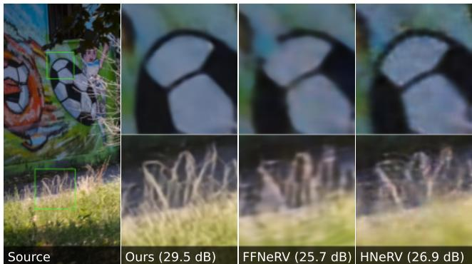
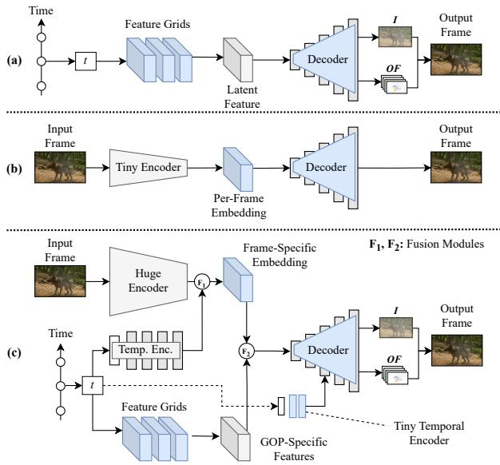
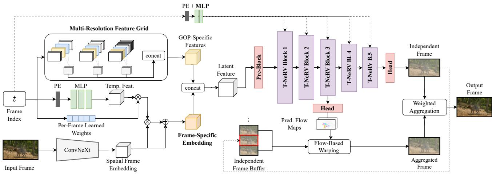
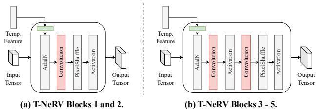
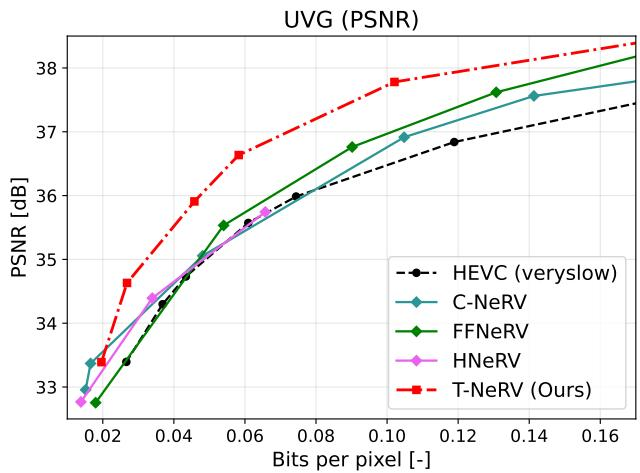
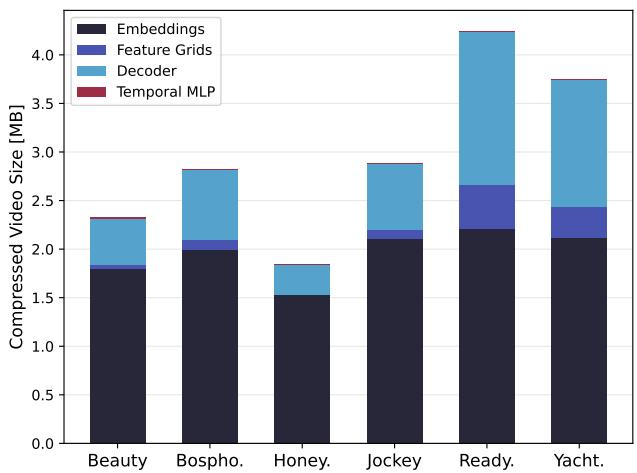

# Combining Frame and GOP Embeddings for Neural Video Representation

Jens Eirik Saethre1,2 Roberto Azevedo1 Christopher Schroers1

1DisneyResearch|Studios, Switzerland

2ETH Zurich, Switzerland¨

jens.eirik@saethre.ch {roberto.azevedo,christopher.schroers}@disneyresearch.com

## Abstract

Implicit neural representations (INRs) were recently proposed as a new video compression paradigm, with existing approaches performing on par with HEVC. However, such methods only perform well in limited settings, e.g., specific model sizes, fixed aspect ratios, and low-motion videos. We address this issue by proposing T-NeRV, a hybrid video INR that combines frame-specific embeddings with GOP-specific features, providing a lever for contentspecific fine-tuning. We employ entropy-constrained training tojointly optimize our modelfor rate and distortion and demonstrate that T-NeRV can thereby automatically adjust this lever during training, effectivelyfine-tuning itselfto the target content. We evaluate T-NeRV on the UVG dataset, where it achieves state-of-the-art results on the video representation task, outperforming previous works by up to 3dB PSNR on challenging high-motion sequences. Further, our method improves on the compression performance ofprevious methods and is thefirst video INR to outperform HEVC on all UVG sequences.

## 1. Introduction

Implicit neural representations (INRs) have emerged as versatile and robust tools to represent diverse signals. By overfitting neural networks, they capture objects described implicitly by functions $f : \dot { \mathbb { R } ^ { k } } \overset { \cdot } {  } \mathbb { R } ^ { l }$ that map coordinates to properties (e.g., RGB colors) and have been successfully applied to tasks such as view synthesis [6, 42] and shape reconstruction [41, 44]. Recently, few works [46, 51, 53] have explored INRs for representing multi-media signals and subsequently compressing these representations [12, 15, 16] via model compression techniques [23, 60, 63], giving rise to a new lossy data compression paradigm.

With video streaming accounting for more than 65% of total Internet traffic in 2023 [49] and immersive technologies on the rise [52, 58], this development is of particular interest to video compression. While traditionally dominated by codecs rooted in heuristics such as H.264 [47], HEVC [54], and the more recent VVC [9] and AV1 [13], advances in deep learning [14, 26, 56] have rendered learningbased approaches increasingly attractive. Numerous works have been proposed, with recent years favoring end-toend methods not bound by a standardized bitstream syntax [1, 22, 35, 39, 48]. State-of-the-art methods [29] can outperform the latest generation of codecs in terms of BDrate [8]; however, their decoding speeds are too slow to support real-time decoding.

  
Figure 1. At the same model size, our method can fit videos with much higher accuracy than previous state-of-the-art INR-based methods. This figure is best viewed digitally.

Meanwhile, video INRs employ much simpler architectures, resulting in faster forward passes and higher decoding speeds. Chen et al. [10] achieve this with a frame-wise representation called NeRV that maps frame indices to frames via a sequence of linear and convolutional layers. After training, the model is compressed with pruning, quantization, and entropy-encoding, resulting in competitive compression performance against H.264 and HEVC. Several improvements have been proposed, such as adding spatial context to the input (E-NeRV [31]), incorporating optical flow and feature grids (FFNeRV [28]), as well as exploiting more elaborate compression pipelines [18]. Also, hybrid approaches [11, 62] have emerged that represent videos by the decoder’s parameters and a set of per-frame embeddings generated by an encoder that is discarded after training.

Although such methods surpass NeRV, their success is often confined to specific settings, such as excelling at static sequences while faltering on high-motion content. Conversely, FFNeRV is targeted at dynamic sequences but struggles on low-motion videos. Hybrid approaches show great promise in the low bitrate regime but fail to scale to higher bitrates and are currently limited to content with an unusual 2:1 aspect ratio.

We remedy these issues by proposing T-NeRV, a new tunable hybrid INR for video based on the insight that traditional codecs require both local and non-local information to code frames efficiently. Our method employs a hybrid encoder that combines frame-specific embeddings with GOP-specific features and upsamples them with a decoder based on optical flow. This combination provides a lever for content-specific fine-tuning: Larger frame embeddings can extract more high-frequency information, improving performance on low-motion sequences. Conversely, more prominent GOP-specific features allow the model to extract more temporal context that the decoder can leverage to reconstruct frames in dynamic sequences.

For compression, we extend Gomes et al. [18]’s framework, which jointly minimizes rate and distortion via quantization-aware and entropy-constrained [43] training, to capture embeddings. By employing a single entropy model for all embeddings, T-NeRV can exploit their redundancies to a higher degree than previous approaches. End-to-end training also encourages the network to finetune itself to the target video content by spending more bits on the frame-specific embeddings or the GOP-specific features, automatically adjusting the lever.

Our experiments on the UVG [40] dataset show that T-NeRV outperforms all previous video INRs on the task of video representation in two different settings, with increases by up to 3 dB of PSNR over the second-best method on high-motion sequences (cf. Fig. 1). Applying compression, our method is the first video INR that outperforms HEVC (veryslow preset, no b-frames) on all UVG sequences. In summary, our main contributions are the following:

• We propose a tunable hybrid video INR that combines frame-specific embeddings with GOP-specific features, providing a lever for content-specific fine-tuning.

• We extend the information-theoretic INR compression framework by Gomes et al. [18] to include embeddings, exploiting the significant redundancies within them.

• We evaluate our method on the UVG dataset, outperforming all previous video INRs on the video representation and compression tasks.

## 2. Related Work

Neural Video Compression. Traditional video codecs [9, 13, 47, 54] consist of an encoder-decoder pair related by a standardized bitstream syntax. Works on learning-based video compression initially adhered to this bitstream syntax while replacing specific modules with neural blocks [2, 30, 36, 61]. Fully end-to-end trained methods have also been explored in recent years. Early works [19, 45] employed auto-encoders and formulated video compression as a latent space search problem but fell short of competing with traditional codecs. Lu et al. [35] follow the traditional video coding pipeline more closely with separate networks for the individual pipeline stages. Hu et al. [22] perform these operations in feature space, while Agustsson et al. [1] generalize optical flow to a 3D scale-space volume to better handle occlusions. Mentzer et al. [39] independently map frames to latent representations and use a transformer to model their dependencies. DCVC-DC [29], which proposes an efficient way to increase context diversity for neural video codecs, is currently the state-of-the-art method. While such works can match the performance of the newest traditional codecs, they often cannot decode 1080p videos at more than two frames per second [39], significantly limiting their practical usage. In contrast, INR-based methods, such as our proposal, come much closer to achieving real-time decoding on the same hardware [10, 18, 28].

Video INRs. Early video INRs [46, 51] employed pixelwise representations that map pixel indices to RGB colors but suffered from limited performance and poor decoding speeds. Chen et al. [10] instead proposed a frame-wise representation with NeRV. From a positionally-encoded frame index, an MLP generates a temporal feature that is reshaped and upsampled via five NeRV blocks, each comprising a subpixel convolution [50] and an activation. This results in real-time decoding speed and significantly better reconstructions. Inspired by works on GANs [57], E-NeRV [31] decomposes NeRV’s featurizer into temporal and spatial contexts that are fused by a transformer network. Further, they inject temporal information into the decoder blocks via an adaptive instance normalization (AdaIN) layer [25]. Gomes et al. [18] drastically simplify this architecture with only minimal loss of quality. Lee et al. [28] improve performance on dynamic sequences with FFNeRV by enforcing temporal consistency with a decoder that predicts both independent frames and a set of optical flow maps that are used to warp adjacent independent frames and aggregate them into a final output frame. They complement this with a learnable feature grid of multiple temporal resolutions to speed up convergence. A new paradigm emerged when Chen et al. [11] proposed a hybrid representation with HNeRV. Unlike previous methods, HNeRV resembles an autoencoder during training, employing an encoder based on the ConvNeXt architecture [32] to extract content-specific embeddings. After training concludes, the video is represented by the decoder’s parameters and the per-frame embeddings. DNeRV [62] additionally produces an embedding from the difference between successive frames and uses a gated mechanism to incorporate that information into the decoder. Other approaches to INR-based video representation include patch-wise approaches [3, 38], methods for scene editing [37], and fitting multiple videos [20, 24]. The architecture we propose in this work is hybrid and frame-wise and combines frame-specific embeddings with GOP-specific features from a feature grid.

Video Compression with INRs. Prior works have mostly decoupled training and compression. Rho et al. [46] achieve compression by using 16-bit weights, while NeRV, E-NeRV, HNeRV, and DNeRV employ post-training pipelines that comprise pruning, quantization, and entropy encoding steps. FFNeRV [28] made a first step towards combining training and compression by employing quantizationaware training (QAT) [23] based on the straight-through estimator [7]. A more powerful approach was introduced by Gomes et al. [18] that applies the model compression method outlined by Oktay et al. [43] to video INRs. Building on entropy minimization techniques [4, 5], they use a neural network to learn a probability function over a discrete latent space of weights to which the INR’s weights are mapped via scale reparametrization during training. This allows the INR to model its entropy and minimize it jointly with distortion, resulting in significantly higher compression efficiency when performing entropy encoding. We extend this compression scheme to include per-frame embeddings, allowing us to better exploit their redundancies.

## 3. Motivation

In this section, we motivate the overall architecture of T-NeRV by contrasting it with existing approaches and highlighting their key weaknesses.

## 3.1. Combining Local and Global Information

Traditional codecs have used both intra-frame and interframe information to obtain efficient encodings for decades. Yet, most video INRs only exploit intra-frame information by independently generating a latent and passing it through the decoder without considering information from adjacent frames. Conversely, INRs that consider inter-frame information do not extract enough frame-specific content. While DNeRV extracts a frame difference embedding, its gated fusion mechanism necessitates large spatial dimensions. As a result, fewer of the total number of parameters can be allocated to the frame embeddings and the decoder to exploit this information. Moreover, the spatial context is limited to the previous and next frame. FFNeRV employs inter-frame information in its multi-resolution grid and decoder. However, the network cannot extract frame-specific features due to the interpolation of features, resulting in each feature being used in the forward pass of at least two frames. This ultimately degrades performance on static sequences as the flow-based decoder can not mask the absence of framespecific information, as our experiments in Sec. 5.1 reveal.

  
Figure 2. Comparison of the architectures of (a) FFNeRV and (b) HNeRV with (c) our proposed T-NeRV architecture. Components that form part of the video state are highlighted in blue.

Based on this insight, we design T-NeRV such that its latent feature is composed of two parts: We use per-frame embeddings to capture frame-specific information, while inter-frame or GOP-specific features are obtained from a multi-resolution feature grid. These two components are then fused and passed to an optical-flow-based decoder that is injected with temporal information. Fig. 2 (c) sketches T-NeRV’s design and compares it to FFNeRV and HNeRV, both of which only capture one type of information.

## 3.2. Exploiting the Hybrid Representation

As indicated by Fig. 2 (b), hybrid approaches discard their encoder after training and instead transmit the compressed frame embeddings as part of the video state. Consequently, the parameters in the components involved in generating the embedding do not contribute to the video size. However, current hybrid approaches fail to exploit this potential and employ unnecessarily small encoders that severely limit the expressibility of the extracted embeddings.

In contrast, T-NeRV generates its embeddings via a significantly larger and more sophisticated network. Consequently, its embeddings are much more powerful and aid the decoding process by allowing the decoder to predict more accurate independent frames. These are, in turn, warped based on the predicted optical flow maps, resulting in improvements in both static and dynamic video sequences.

  
Figure 3. Our proposed T-NeRV architecture combines GOP-specific features with frame-specific embeddings and upsamples them with a flow-based decoder. Components that are transmitted as part of the video state are highlighted in bold.

## 3.3. Video-Specific Fine-Tuning

Existing video INRs offer many architectural parameters that could be fine-tuned to specific content to achieve higher compression performance. However, such optimizations have to be performed manually, a process that currently exists devoid of any meaningful cues.

In comparison, T-NeRV offers an intuitive way to optimize for different levels of motion in videos: Combining frame-specific embeddings with GOP-specific features yields a lever to regulate the ratio between the amount of static and dynamic information that the network captures. Moreover, by employing an end-to-end compression scheme [18] and placing an entropy penalty on the model’s weights and embeddings, T-NeRV learns to fine-tune itself with respect to the target content during the encoding process, e.g., by spending more bits on the feature grids for high-motion videos than for static ones (cf. Sec. 5.4).

## 4. T-NeRV: A Tunable Video INR

The proposed T-NeRV architecture is outlined in Fig. 3. It consists of a hybrid encoder and a flow-based decoder. The encoder generates a latent feature $\boldsymbol { z } _ { t } ~ \in ~ \mathbb { R } ^ { c _ { L } \times h \times w }$ from a ground truth frame $F _ { t } ~ \in ~ \mathbb { R } ^ { 3 \times H \times W }$ and a frame index t, from which the decoder reconstructs a frame $\widehat { F } _ { t }$ . The aspect ratio of the latent matches that of the frame, i.e. $\begin{array} { r } { \frac { h } { w } = \frac { \bar { H } } { W } } \end{array}$

During training/encoding, the network performs forward passes as depicted. Once training concludes, only the components highlighted in bold in Fig. 3 are kept as part of the video state. Decoding a frame thus amounts to obtaining the GOP-specific features from the feature grid, concatenating them with the frame-specific embedding to obtain $z _ { t } ,$ and passing $z _ { t }$ through the decoder.

<table><tr><td>Model</td><td>Size</td><td>Stages</td><td>Blocks p. Stage</td><td>Channels p. Stage</td></tr><tr><td>HNeRV</td><td>0.2M</td><td>5</td><td>(1, 1, 1,1, 1)</td><td>(64, 64, 64, 64, 16)</td></tr><tr><td>T-NeRV</td><td>19.4M</td><td>5</td><td>(3, 3, 9, 6, 3)</td><td>(64, 128, 256, 512, cE)</td></tr><tr><td>ConvNeXt-T</td><td>29.0M</td><td>4</td><td>(3, 3, 9, 3)</td><td>(96, 192, 384, 768)</td></tr></table>

Table 1. Comparison of the encoders employed by HNeRV and T-NeRV with the original ConvNeXt-T model [32].

## 4.1. Frame-Specific Embeddings

The frame-specific embedding $\boldsymbol { e } _ { t } \in \mathbb { R } ^ { c _ { E } \times h \times w }$ is one of the two components of the latent feature $z _ { t } .$ . It is generated in two steps: An encoder extracts a spatial frame embedding $\widehat { e } _ { t } \in \mathbb { R } ^ { c _ { E } \times h \times w }$ from $F _ { t }$ , which is then augmented with temporal information, as shown on the bottom left in Fig. 3.

Inspired by HNeRV, we use an encoder based on the ConvNeXt architecture [32] to extract $\widehat { e } _ { t }$ from the input frame $F _ { t } .$ However, T-NeRV employs an encoder that is almost 100× the size of HNeRV’s encoder and follows the reference model much more closely (cf. Tab. 1). T-NeRV’s encoder is thus more likely to exhibit similar performance as ConvNeXt, allowing our method to extract significantly more powerful embeddings.

The spatial frame embedding $\widehat { e } _ { t }$ is further augmented with temporal information. To that end, we positionally encode t with $b = 1 . 2 5$ and l = 80 and pass it to a three-layer MLP with GELU [21] activation. Its output is reshaped into a temporal feature $s _ { t } \in \mathbb { R } ^ { c _ { E } \times h \times w }$ , matching the dimension of $\widehat { e _ { t } }$ . The temporal feature $s _ { t }$ is then fused into $\widehat { e _ { t } }$ to obtain the frame-specific embedding, i.e.

$$
e _ { t } = \widehat { e } _ { t } \cdot ( 1 + \alpha _ { t } \cdot s _ { t } ) ,\tag{1}
$$

where $\alpha _ { t } \ \in \mathbb { R }$ is a learnable factor specific to each frame that modulates how much temporal information is fused into the embedding. This lets the network decide on a perframe basis whether and to what extent to incorporate temporal information into the embedding.

The proposed fusion mechanism can be regarded as a per-frame masking operation on the embedding, allowing similar frames to obtain different embeddings. The decoder can leverage this information to decide which parts of the frame to reconstruct from the frame’s independent frame and for which parts to rely on inter-frame information.

## 4.2. GOP-Specific Features

Inspired by FFNeRV, we employ a parametric encoding in the form of a multi-resolution feature grid to obtain the GOP-specific features $g _ { t } \in \mathbb { R } ^ { c _ { G } \times h \times w }$ . In particular, we use three grids with exponentially increasing temporal resolutions, i.e. ${ \bf G } _ { i } \in \mathbb { R } ^ { \hat { T } _ { i } \times c _ { i } \times h \times \dot { w } }$ for $i \in \{ 1 , 2 , 3 \}$ , where $c _ { G } = \textstyle \sum _ { i } c _ { i }$ and $T _ { i + 1 } = 2 \cdot T _ { i }$ . We set the resolution of $\mathrm { G _ { 3 } }$ such that each feature covers at least two frames, i.e. $\begin{array} { r } { T _ { 3 } \leq \frac { N } { 2 } } \end{array}$ , where N denotes the number of video frames.

During a forward pass, the frame index t is used to select two features $\mathrm { G } _ { i } [ \left\lfloor t / N \cdot T _ { i } \right\rfloor , : , : , : ]$ and $\mathrm { G } _ { i } [ \lceil t / N \cdot T _ { i } \rceil , : , : , : ]$ that correspond to frame t at every grid level i. The two features are bilinearly interpolated at every level, and the results are concatenated to obtain $g _ { t }$ . In the backward pass, only the six features involved in generating $g _ { t }$ need to be updated, speeding up convergence for this component of our architecture.

## 4.3. Flow-Based Decoder

The latent $z _ { t }$ results from concatenating $e _ { t }$ and $g _ { t }$ and is passed to the decoder alongside a temporal feature $u _ { t } ~ \in ~ \mathbb { R } ^ { 1 2 8 }$ that is generated by a small two-layer MLP. The decoder consists of three parts: A pre-block, a series of five T-NeRV blocks, and a flow module.

Pre-Block. The pre-block consists of a convolutional layer with a $3 \times 3$ kernel that performs channel expansion or channel reduction, depending on the size of the latent feature and the dimension expected by the first T-NeRV block.

T-NeRV Blocks. T-NeRV’s decoder employs a series of five blocks to predict the independent frame and the optical flow maps. Fig. 4 (a) depicts a T-NeRV block schematically. A small linear layer extracts per-channel statistics from a temporal feature and uses them to shift the distribution of the input tensor via an AdaIN layer, thereby injecting temporal information. A convolutional layer with channel expansion and a subsequent PixelShuffle [50] layer perform spatial upsampling by a factor of s, which is followed by a GELU activation. Like HNeRV, we employ a low channel decrease factor $r = 1 . 2$ with increasing kernel sizes to allocate more parameters to the later stages, aiding the reconstruction of high-frequency details. This strategy renders the third T-NeRV block the largest, which is critical given its dual use in upsampling and optical flow prediction.

  
Figure 4. Structure of T-NeRV blocks. We replace $5 \times 5$ convolutions with two $3 \times 3$ convolutions and an additional non-linearity in the last three blocks.

While HNeRV uses kernel sizes $k _ { i } = \mathrm { m i n } \{ 2 i - 1 , 5 \}$ we find $5 \times 5$ convolutions to be computationally expensive and parameter-inefficient. Instead, we mimic the same receptive field by two successive $3 \times 3$ convolutions with an equal total number of parameters and an additional activation, resulting in the block structure shown in Fig. 4 (b). The higher parameter efficiency and the additional non-linearity further help the decoder in the reconstruction process, particularly for high-motion sequences.

Flow-Guided Frame Aggregation. We adopt FFNeRV’s flow-guided aggregation module to exploit information from adjacent frames via optical flow, as shown on the bottom right of Fig. 3. The head layer after the fifth T-NeRV block predicts an independent frame $I _ { t } \in \mathbb { R } ^ { 3 \times H \times W }$ and two aggregation weights wI, $w _ { A } \in \mathbb { R } ^ { H \times W }$ , which are normalized via a softmax layer. A copy of $I _ { t }$ is detached from the computation graph and stored in an independent frame buffer. We define an aggregation window W, e.g., $\mathcal { W } = \{ - 2 , - 1 , 1 , 2 \}$ , to leverage information from previous and following frames. During the forward pass of frame $t ,$ the head layer after the third T-NeRV block predicts optical flow maps $M ( t , t + j ) \in \mathbb { R } ^ { 2 \times H / 4 \times W / 4 }$ and weight maps $w _ { M } ( t , t + \bar { j } ) \in \dot { \mathbb { R } } ^ { H / 4 \times \dot { W } / 4 }$ for every $j$ in the aggregation window W. The flow and weight maps are upsampled by a factor of four via bilinear interpolation, and the latter are normalized by applying a softmax function. The flow maps $M ( t , t + j )$ are then used to warp the corresponding adjacent independent frames $I _ { t + j }$ , and the results are aggregated to obtain the aggregated frame $A _ { t }$ and the final frame $\widehat { F } _ { t }$ , i.e.

$$
A _ { t } = \sum _ { j \in \mathcal { W } } w _ { M } ( t , t + j ) \cdot \operatorname { W a R P } ( I _ { t + j } , M ( t , t + j ) ) ,\tag{2}
$$

$$
\widehat { F } _ { t } = w _ { I } \cdot I _ { t } + w _ { A } \cdot A _ { t } .\tag{3}
$$

## 4.4. Compression

We build on the INR compression framework proposed by Gomes et al. [18]. They model INR compression as a ratedistortion problem $L = D + \lambda R$ , where D denotes some distortion loss, R represents the entropy of the INR parameters $\theta ,$ and λ establishes a trade-off between the two.

<table><tr><td>Model</td><td>Size</td><td>Resolution</td><td>Beauty</td><td>Bospho.</td><td>Honey.</td><td>Jockey</td><td>Ready.</td><td>Shake.</td><td>Yacht.</td><td>Avg.</td></tr><tr><td>NeRV [10]</td><td>12.6M</td><td>(720,1280)</td><td>35.70</td><td>37.81</td><td>41.23</td><td>36.39</td><td>29.16</td><td>36.84</td><td>31.13</td><td>36.00</td></tr><tr><td>E-NeRV [31]</td><td>12.5M</td><td>(720, 1280)</td><td>35.93</td><td>39.59</td><td>41.62</td><td>37.05</td><td>30.98</td><td>38.58</td><td>32.50</td><td>36.61</td></tr><tr><td>C-NeRV [18]</td><td>12.5M</td><td>(720, 1280)</td><td>35.95</td><td>39.66</td><td>41.55</td><td>36.82</td><td>30.58</td><td>38.62</td><td>32.50</td><td>36.53</td></tr><tr><td>FFNeRV [28]</td><td>12.4M</td><td>(720, 1280)</td><td>35.99</td><td>39.91</td><td>41.52</td><td>38.19</td><td>32.28</td><td>38.09</td><td>33.69</td><td>37.10</td></tr><tr><td>HNeRV [11]</td><td>12.4M</td><td>(720, 1280)</td><td>29.47</td><td>27.93</td><td>40.14</td><td>27.68</td><td>31.05</td><td>28.58</td><td>25.26</td><td>30.02</td></tr><tr><td>DNeRV [62]</td><td>12.4M</td><td>(720, 1280)</td><td>35.76</td><td>36.33</td><td>41.55</td><td>36.14</td><td>30.17</td><td>38.31</td><td>31.85</td><td>35.73</td></tr><tr><td>T-NeRV (Ours)</td><td>12.4M</td><td>(720, 1280)</td><td>36.11</td><td>40.67</td><td>41.60</td><td>39.63</td><td>35.23</td><td>38.84</td><td>34.74</td><td>38.12</td></tr><tr><td>NeRV [10]</td><td>3.0M</td><td>(960,1920)</td><td>33.43</td><td>33.47</td><td>38.32</td><td>31.50</td><td>24.16</td><td>33.67</td><td>27.56</td><td>31.73</td></tr><tr><td>E-NeRV [31]</td><td>3.0M</td><td>(960, 1920)</td><td>33.47</td><td>33.65</td><td>38.78</td><td>29.04</td><td>23.70</td><td>34.47</td><td>27.70</td><td>31.54</td></tr><tr><td>C-NeRV [18]</td><td>3.0M</td><td>(960, 1920)</td><td>33.46</td><td>33.76</td><td>38.70</td><td>28.89</td><td>23.88</td><td>34.32</td><td>27.66</td><td>31.52</td></tr><tr><td>FFNeRV [28]</td><td>3.0M</td><td>(960, 1920)</td><td>33.62</td><td>33.72</td><td>38.82</td><td>32.80</td><td>25.82</td><td>34.19</td><td>28.37</td><td>32.48</td></tr><tr><td>HNeRV [11]</td><td>3.0M</td><td>(960, 1920)</td><td>33.64</td><td>34.59</td><td>39.16</td><td>31.76</td><td>25.49</td><td>34.81</td><td>29.20</td><td>32.66</td></tr><tr><td>DNeRV [62]</td><td>3.0M</td><td>(960, 1920)</td><td>33.58</td><td>34.55</td><td>39.12</td><td>31.95</td><td>25.77</td><td>34.75</td><td>28.94</td><td>32.67</td></tr><tr><td>T-NeRV (Ours)</td><td>3.0M</td><td>(960, 1920)</td><td>34.34</td><td>35.65</td><td>40.26</td><td>34.80</td><td>28.24</td><td>35.25</td><td>29.46</td><td>34.00</td></tr></table>

Table 2. Video representation results in terms of PSNR on UVG [40] in the two settings proposed by [10] and [11]. Best results are marked in bold, second-best results are underlined. T-NeRV significantly outperforms all previous methods in both settings.

Training an INR on loss L jointly minimizes rate and distortion during training, allowing the authors to more efficiently compress the model parameters θ with the Deep-CABAC [60] entropy-coding library after training.

Since this process requires a discrete set of symbols such as Z, the authors perform quantization-aware training [23], leveraging the straight-through estimator (STE) [7] to ensure differentiability. Each layer is quantized independently using scale reparametrization [43] with two trainable parameters. The entropy of each layer is estimated independently by fitting a small neural network to the layer’s weight distribution, following the approach outlined in [5].

We extend this framework to handle parametric encodings, such as T-NeRV’s feature grids, as well as embeddings. We treat each of the three feature grids in T-NeRV’s multi-resolution grid as an individual layer with its own quantization parameters. During a forward pass, each grid is quantized and dequantized using the scale reparametrization scheme before bilinearly interpolating two of its features. We further adopt one entropy model per grid, allowing the network to determine the extent to which the features at each temporal frequency should be compressed.

In contrast, we adopt a single entropy model for all frame-specific embeddings, encouraging the network to exploit redundancies between frames. This counterbalances the injection of temporal information into the embeddings discussed in Sec. 4.1, restricting the network to only use such information when the gain in video quality outweighs the increase in entropy. We complement this with individual quantization parameters for each embedding, leading to a negligible overhead of eight bytes per frame, as we do not compress the quantization parameters. In turn, the network has more freedom to decrease the error induced by quantization for specific frames, e.g., those whose embeddings were injected with significant amounts of temporal information.

  
Figure 5. Rate-Distortion performance of T-NeRV on UVG in terms of PSNR. Our method outperforms HEVC and the previous state-of-the-art video INRs across the entire BPP spectrum.

## 5. Experiments

We validate our architecture on the UVG [40] dataset, which comprises one 300-frame and six 600-frame videos at a resolution of 1920 × 1080 pixels. In line with previous works, we evaluate video quality with the peak-signalto-noise ratio (PSNR) [17] and the multi-scale structural similarity index (MS-SSIM) [59] that are averaged across frames in each video. We present results in terms of PSNR in the following section while the corresponding MS-SSIM data can be found in the supplementary materials. Due to the flow-based nature of our decoder, we employ the same distortion loss as FFNeRV, including its hyperparameters:

$$
l ( y , y ^ { \prime } ) = 0 . 7 \cdot \left\| y - y ^ { \prime } \right\| _ { 1 } + 0 . 3 \cdot ( 1 - \mathrm { S S I M } ( y , y ^ { \prime } ) ) ,\tag{4}
$$

$$
L _ { D } ( \theta ) = \frac { 1 } { T } \sum _ { t = 1 } ^ { T } l ( F _ { t } , \widehat { F } _ { t } ) + 0 . 1 \cdot l ( F _ { t } , I _ { t } ) + 0 . 1 \cdot l ( F _ { t } , A _ { t } ) .\tag{5}
$$

We train T-NeRV using the AdamW [34] optimizer that has shown to be more effective for modern neural networks than Adam [27] with a learning rate (LR) of $\eta = 5 \cdot 1 0 ^ { - 4 }$ and a batch size of 1. A linear warm-up for 20% of the total epochs precedes a cosine annealing LR schedule [33] for the remainder of the training process. However, instead of letting the LR decay to zero, we impose a minimum LR of 0.075η to ensure that the last 5% of epochs perform meaningful steps. We use $\mathcal { W } = \{ - 2 , - 1 , 1 , 2 \}$ as our aggregation window for all experiments.

## 5.1. Video Representation

We assess the representational capacity of T-NeRV in two distinct settings proposed by NeRV and HNeRV, respectively. In the first setting, a large model represents a video with frames resized to 720p. The second setting is more challenging, using a smaller model to represent a video cropped to a 2:1 aspect ratio with 1920 × 960 pixels. We compare our approach to six related works, i.e. NeRV, E-NeRV, C-NeRV1, FFNeRV, HNeRV, and DNeRV.

To that end, we implement T-NeRV and the six baselines in a common framework, using the default configurations whenever possible and otherwise adjusting them in the spirit of the respective architecture.2 We train all methods for 300 epochs without compression (i.e. λ = 0), using each method’s default hyperparameters and loss function. To maintain fairness, we apply the modified cosine annealing LR schedule to all methods. For T-NeRV, we employ embeddings of size (35, 9, 16), features of size (30, 9, 16) in all three grids, and upsampling factors (5, 2, 2, 2, 2) for the first setting. For the second setting, we use embeddings and features of sizes (8, 8, 16) and (11, 8, 16), respectively, and upsampling factors (5, 3, 2, 2, 2).

Tab. 2 lists the video representations results. T-NeRV achieves state-of-the-art performance in both settings, improving by more than 1 dB on average over the secondbest method in either case. In the first setting, the most prominent improvements can be observed on high-motion sequences such as Yacht and Ready. On the latter, T-NeRV beats FFNeRV and HNeRV, the second and third best methods, by 2.95 dB and 4.18 dB, respectively, resulting in clearly discernible visual quality improvements, as seen in Fig. 1. This makes T-NeRV the first hybrid video INR that scales well to larger models and aspect ratios other than 2:1. In the second setting, we further observe significant improvements in static videos, such as Honey and Shake, while improving the quality of dynamic videos to a similar extent as in the first setting.

## 5.2. Video Compression

We follow the approach outlined in [18] for the compression experiments, validating performance on the UVG dataset at 1080p resolution. We define four model sizes to cover the bits-per-pixel (BPP) spectrum and divide the training/encoding process into two parts. During pre-training, we train one model for every model size and video for 1200 epochs without entropy-penalization, i.e. λ = 0. This is followed by 600 fine-tuning epochs with different λ values for each pre-trained model to achieve different compression ratios. We collect BPP, PSNR, and MS-SSIM values of every fine-tuned model and average them across all videos for every pair of model size and λ. The upper convex hull then yields our method’s rate-distortion curve.

We compare T-NeRV’s compression performance to that of HEVC (x265 with veryslow preset, no b-frames) and three previous video INRs (C-NeRV, HNeRV, and FFNeRV). For HEVC, we employ ffmpeg [55] to collect BPP, PSNR, and MS-SSIM metrics at different constant rate factors (CRFs) for each sequence. These metrics are then averaged across all videos compressed with the same CRF. The results of C-NeRV were gracefully provided by the authors, while the results for HNeRV and FFNeRV were taken directly from the respective paper or codebase.

The rate-distortion plot is depicted in Fig. 5. T-NeRV outperforms HEVC and previous video INR baselines in terms of PSNR across the BPP spectrum, retaining its advantage from the video representation task. We provide per-video rate-distortion curves and qualitative results in the supplementary materials.

## 5.3. Ablation Studies

We analyze the contribution of individual T-NeRV components by evaluating several ablated models on the video representation task. To reduce computation, we evaluate small models (3M parameters) on the first 300 frames of each UVG video at a resolution of 720p.

We perform ablations on the encoder and the decoder. We verify the effectiveness of combining frame-specific embeddings with GOP-specific features by evaluating models that employ only embeddings (E1) or only feature grids (E2). Further, we validate the effect of augmenting embeddings with temporal information (E3). We also replace T-NeRV’s ConvNeXt block with HNeRV’s tiny one for (E4), while (E5) additionally deactivates the temporal injection branch. T-NeRV’s decoder has been compared to variants without flow-guided frame aggregation (D1), without the injection of temporal information via AdaIN (D2), and without the modified T-NeRV block, i.e. with ordinary 5×5 convolutions (D3).

<table><tr><td>Model</td><td>Beauty</td><td>Bospho.</td><td>Honey.</td><td>Jockey</td><td>Ready.</td><td>Shake.</td><td>Yacht.</td><td>Avg.</td></tr><tr><td>T-NeRV</td><td>35.52</td><td>37.59</td><td>41.25</td><td>36.75</td><td>32.45</td><td>35.91</td><td>31.96</td><td>35.92</td></tr><tr><td>(E1)</td><td>35.54</td><td>37.04</td><td>41.19</td><td>36.54</td><td>32.23</td><td>35.94</td><td>31.89</td><td>35.77</td></tr><tr><td>(E2)</td><td>35.46</td><td>37.07</td><td>41.19</td><td>35.39</td><td>31.21</td><td>35.67</td><td>31.77</td><td>35.39</td></tr><tr><td>(E3)</td><td>35.49</td><td>36.76</td><td>41.20</td><td>35.82</td><td>31.52</td><td>35.79</td><td>31.52</td><td>35.44</td></tr><tr><td>(E4)</td><td>35.48</td><td>36.73</td><td>41.21</td><td>35.74</td><td>31.52</td><td>35.77</td><td>31.50</td><td>35.42</td></tr><tr><td>(E5)</td><td>35.43</td><td>36.60</td><td>41.19</td><td>35.49</td><td>31.09</td><td>35.65</td><td>31.19</td><td>35.24</td></tr><tr><td>(D1)</td><td>35.51</td><td>36.99</td><td>41.22</td><td>35.67</td><td>31.45</td><td>35.89</td><td>30.88</td><td>35.37</td></tr><tr><td>(D2)</td><td>35.06</td><td>33.48</td><td>39.22</td><td>35.83</td><td>31.30</td><td>34.96</td><td>31.07</td><td>34.42</td></tr><tr><td>(D3)</td><td>35.48</td><td>36.72</td><td>41.22</td><td>35.80</td><td>31.48</td><td>35.82</td><td>31.45</td><td>35.42</td></tr></table>

Table 3. Ablation study of T-NeRV in terms of PSNR on the first 300 frames of UVG sequences. Best results are marked in bold.

Tab. 3 lists the results of the ablation study in terms of PSNR. We can observe that the temporally augmented embedding constitutes a powerful latent, especially for static sequences, but adding the feature grids improves video quality on high-motion sequences. (E3) further highlights the importance of temporally augmenting the embedding, while (E4) and (E5) demonstrate that T-NeRV’s significant improvements in visual quality do not merely stem from a larger encoder. On the decoder side, access to temporal information is of paramount importance for all sequences, while incorporating optical flow as well as replacing 5 × 5 convolutions yield significant gains on dynamic videos.

## 5.4. Tuning via Entropy Penalization

The video representation results in Tabs. 2 and 3 were obtained with a single configuration per setting that was used for all UVG videos. However, the representation could likely be improved by employing configurations tailored to specific videos. To that end, one could adjust the architectural lever arising from the combination of frame-specific embeddings and GOP-specific features before training and encode the video with a modified configuration.

We argue that this step is unnecessary as T-NeRV can fine-tune itself to specific content by training in an entropyconstrained way. To demonstrate that, we analyze how the compressed models from Sec. 5.2 allocate their bits to the different model components. In particular, we examine models for the 600-frame UVG sequences that were trained using the same configuration of 9.3M parameters, where 2.2M, 2.6M, and 4.5M parameters were allocated to the embeddings, feature grids, and the decoder, respectively.

Fig. 6 shows the distribution of bytes to our network’s main components for six video models that were compressed with λ = 1, the largest lambda value at this model size.3 We can observe that the embeddings dominate the distribution, which is in line with the observation that the ablated model (E1) performs best among all ablations in

  
Figure 6. Byte distribution in videos compressed with λ = 1. T-NeRV spends more bits on GOP-specific feature grids for highmotion content (e.g., Ready) than for static videos (e.g., Honey).

Tab. 3. In contrast, the sizes of the decoder and the feature grids vary considerably between videos. Upon closer inspection, however, we can observe a high correlation between the number of bits allocated to the feature grids and the degree of motion present in a video sequence. The same applies to the number of bits spent on the decoder. This demonstrates that T-NeRV leverages its fine-tuning capabil ities and optimizes itself with respect to the target content during training.

## 6. Conclusion

We study the effect of combining frame-specific embeddings with GOP-specific features when representing videos as implicit neural representations. This study culminates in T-NeRV, a novel hybrid INR for video that incorporates the above combination. We couple this architecture with a recently proposed end-to-end entropy-constrained compression framework, which we extend to handle embeddings. Our experiments demonstrate that T-NeRV can represent and compress videos better than previous INR-based methods, producing state-of-the-art results in both tasks. We further show how the combination of frame-specific and GOPspecific information can act as a lever for content-specific fine-tuning, which T-NeRV, guided by entropy-constrained training, automatically adjusts during encoding. This insight paves the way for future works to explore similar trade-offs in INR-based compression.

Despite the promising results, there is still a long way to go before video INRs become viable alternatives to traditional codecs. T-NeRV, like previous INR-based methods, suffers from poor encoding speed, requiring many hours of training to encode a single sequence. Therefore, further research into speeding up this process is required, e.g., by developing more cost-effective entropy estimation methods.

## References

[1] Eirikur Agustsson, David Minnen, Nick Johnston, Johannes Balle, Sung Jin Hwang, and George Toderici. Scale-Space´ Flow for End-to-End Optimized Video Compression. In 2020 IEEE/CVF Conf. on Computer Vision and Pattern Recognition (CVPR), 2020. 1, 2

[2] Md Mushfiqul Alam, Tuan D Nguyen, Martin T Hagan, and Damon M Chandler. A perceptual quantization strategy for HEVC based on a convolutional neural network trained on natural images. In Applications of digital image processing XXXVIII, pages 395–408. SPIE, 2015. 2

[3] Yunpeng Bai, Chao Dong, Cairong Wang, and Chun Yuan. Ps-NeRV: Patch-wise stylized neural representations for videos. In 2023 IEEE International Conference on Image Processing (ICIP), pages 41–45. IEEE, 2023. 3

[4] Johannes Balle, Valero Laparra, and Eero P. Simoncelli.´ End-to-end optimized image compression. In 5th International Conference on Learning Representations, ICLR 2017 - Conference Track Proceedings, 2017. 3

[5] Johannes Balle, David Minnen, Saurabh Singh, Sung Jin´ Hwang, and Nick Johnston. Variational image compression with a scale hyperprior. In 6th International Conference on Learning Representations, ICLR 2018 - Conference Track Proceedings, 2018. 3, 6

[6] Jonathan T. Barron, Ben Mildenhall, Dor Verbin, Pratul P. Srinivasan, and Peter Hedman. Mip-NeRF 360: Unbounded Anti-Aliased Neural Radiance Fields. In Proceedings of the IEEE/CVF Conference on Computer Vision and Pattern Recognition (CVPR), pages 5470–5479, 2022. 1

[7] Yoshua Bengio, Nicholas Leonard, and Aaron Courville.´ Estimating or Propagating Gradients Through Stochastic Neurons for Conditional Computation. arXiv preprint arXiv:1308.3432, 2013. 3, 6

[8] Gisle Bjøntegaard. Improvements of the BD-PSNR model. VCEG-AI11, 2008. 1

[9] Benjamin Bross, Ye-Kui Wang, Yan Ye, Shan Liu, Jianle Chen, Gary J Sullivan, and Jens-Rainer Ohm. Overview of the Versatile Video Coding (VVC) Standard and its Applications. IEEE Transactions on Circuits and Systems for Video Technology, 31(10):3736–3764, 2021. 1, 2

[10] Hao Chen, Bo He, Hanyu Wang, Yixuan Ren, Ser Nam Lim, and Abhinav Shrivastava. NeRV: Neural Representations for Videos. In Advances in Neural Information Processing Systems, pages 21557–21568. Curran Associates, Inc., 2021. 1, 2, 6

[11] Hao Chen, Matthew Gwilliam, Ser-Nam Lim, and Abhinav Shrivastava. HNeRV: A Hybrid Neural Representation for Videos. In Proceedings of the IEEE/CVF Conference on Computer Vision and Pattern Recognition (CVPR), pages 10270–10279, 2023. 1, 2, 6

[12] Zeyuan Chen, Yinbo Chen, Jingwen Liu, Xingqian Xu, Vidit Goel, Zhangyang Wang, Humphrey Shi, and Xiaolong Wang. VideoINR: Learning Video Implicit Neural Representation for Continuous Space-Time Super-Resolution. In Proceedings of the IEEE/CVF Conference on Computer Vision and Pattern Recognition (CVPR), pages 2047–2057, 2022. 1

[13] Peter de Rivaz and Jack Haughton. AV1 Bitstream & Decoding Process Specification. The Alliance for Open Media, 2019. 1, 2

[14] Alexey Dosovitskiy, Lucas Beyer, Alexander Kolesnikov, Dirk Weissenborn, Xiaohua Zhai, Thomas Unterthiner, Mostafa Dehghani, Matthias Minderer, Georg Heigold, Sylvain Gelly, Jakob Uszkoreit, and Neil Houlsby. An image is worth 16x16 words: Transformers for image at scale. In 9th International Conference on Learning Representations, ICLR 2021. 1

[15] Emilien Dupont, Adam Golinski, Milad Alizadeh, Yee Whye Teh, and Arnaud Doucet. COIN: COmpression with implicit neural representations. In Neural Compression: From Information Theory to Applications – Workshop @ ICLR 2021, 2021. 1

[16] Emilien Dupont, Hrushikesh Loya, Milad Alizadeh, Adam Golinski, Yee Whye Teh, and Arnaud Doucet. COIN++: Neural compression across modalities. Transactions of Machine Learning Research, 2022. 1

[17] Fernando A Fardo, Victor H Conforto, Francisco C de Oliveira, and Paulo S Rodrigues. A formal evaluation of psnr as quality measurement parameter for image segmentation algorithms. arXiv preprint arXiv:1605.07116, 2016. 6

[18] Carlos Gomes, Roberto Azevedo, and Christopher Schroers. Video Compression With Entropy-Constrained Neural Representations. In Proceedings of the IEEE/CVF Conference on Computer Vision and Pattern Recognition (CVPR), pages 18497–18506, 2023. 1, 2, 3, 4, 5, 6, 7

[19] Amirhossein Habibian, Ties van Rozendaal, Jakub M. Tomczak, and Taco S. Cohen. Video compression with ratedistortion autoencoders. In Proceedings of the IEEE/CVF International Conference on Computer Vision (ICCV), 2019. 2

[20] Bo He, Xitong Yang, Hanyu Wang, Zuxuan Wu, Hao Chen, Shuaiyi Huang, Yixuan Ren, Ser-Nam Lim, and Abhinav Shrivastava. Towards Scalable Neural Representation for Diverse Videos. In Proceedings of the IEEE/CVF Conference on Computer Vision and Pattern Recognition (CVPR), pages 6132–6142, 2023. 3

[21] Dan Hendrycks and Kevin Gimpel. Gaussian Error Linear Units (GELUs). arXiv preprint arXiv:1606.08415, 2016. 4

[22] Zhihao Hu, Guo Lu, and Dong Xu. FVC: A New Framework Towards Deep Video Compression in Feature Space. In Proceedings of the IEEE/CVF Conference on Computer Vision and Pattern Recognition (CVPR), pages 1502–1511, 2021. 1, 2

[23] Benoit Jacob, Skirmantas Kligys, Bo Chen, Menglong Zhu, Matthew Tang, Andrew Howard, Hartwig Adam, and Dmitry Kalenichenko. Quantization and Training of Neural Networks for Efficient Integer-Arithmetic-Only Inference. In Proceedings of the IEEE Conference on Computer Vision and Pattern Recognition (CVPR), 2018. 1, 3, 6

[24] Haeyong Kang, DaHyun Kim, Jaehong Yoon, Sung Ju Hwang, and Chang D Yoo. Progressive Neural Representation for Sequential Video Compilation. arXiv preprint arXiv:2306.11305, 2023. 3

[25] Tero Karras, Samuli Laine, and Timo Aila. A Style-Based Generator Architecture for Generative Adversarial Networks. IEEE Transactions on Pattern Analysis and Machine Intelligence, 43(12):4217–4228, 2018. 2

[26] Alex Krizhevsky, Ilya Sutskever, and Geoffrey E Hinton. ImageNet Classification with Deep Convolutional Neural Networks. In Advances in Neural Information Processing Systems. Curran Associates, Inc., 2012. 1

[27] Ananya Kumar, Ruoqi Shen, Sebastien Bubeck, and Suriya´ Gunasekar. How to fine-tune vision models with SGD. arXiv preprint arXiv:2211.09359, 2022. 7

[28] Joo Chan Lee, Daniel Rho, Jong Hwan Ko, and Eunbyung Park. FFNeRV: Flow-Guided Frame-Wise Neural Representations for Videos. In Proceedings of the 31st ACM International Conference on Multimedia, pages 7859—-7870, New York, NY, USA, 2023. Association for Computing Machinery. 1, 2, 3, 6

[29] Jiahao Li, Bin Li, and Yan Lu. Neural Video Compression With Diverse Contexts. In Proceedings of the IEEE/CVF Conference on Computer Vision and Pattern Recognition (CVPR), pages 22616–22626, 2023. 1, 2

[30] Yue Li, Dong Liu, Houqiang Li, Li Li, Feng Wu, Hong Zhang, and Haitao Yang. Convolutional Neural Network-Based Block Up-sampling for Intra Frame Coding. IEEE Transactions on Circuits and Systems for Video Technology, 28(9):2316–2330, 2017. 2

[31] Zizhang Li, Mengmeng Wang, Huaijin Pi, Kechun Xu, Jianbiao Mei, and Yong Liu. E-NeRV: Expedite Neural Video Representation With Disentangled Spatial-Temporal Context. In Computer Vision – ECCV 2022: 17th European Conference, Tel Aviv, Israel, October 23–27, 2022, Proceedings, Part XXXV, pages 267––284, Berlin, Heidelberg, 2022. Springer-Verlag. 1, 2, 6

[32] Zhuang Liu, Hanzi Mao, Chao-Yuan Wu, Christoph Feichtenhofer, Trevor Darrell, and Saining Xie. A ConvNet for the 2020s. In Proceedings ofthe IEEE/CVF Conference on Computer Vision and Pattern Recognition (CVPR), pages 11976– 11986, 2022. 2, 4

[33] Ilya Loshchilov and Frank Hutter. SGDR: Stochastic Gradient Descent with Warm Restarts. 5th International Conference on Learning Representations, ICLR 2017 - Conference Track Proceedings, 2016. 7

[34] Ilya Loshchilov and Frank Hutter. Decoupled Weight Decay Regularization. 7th International Conference on Learning Representations, ICLR 2019, 2017. 7

[35] Guo Lu, Wanli Ouyang, Dong Xu, Xiaoyun Zhang, Chunlei Cai, and Zhiyong Gao. DVC: An End-To-End Deep Video Compression Framework. In Proceedings of the IEEE/CVF Conference on Computer Vision and Pattern Recognition (CVPR), 2019. 1, 2

[36] Siwei Ma, Xinfeng Zhang, Chuanmin Jia, Zhenghui Zhao, Shiqi Wang, and Shanshe Wang. Image and Video Compression with Neural Networks: A Review. IEEE Transactions on Circuits and Systems for Video Technology, 30(6):1683– 1698, 2019. 2

[37] Long Mai and Feng Liu. Motion-Adjustable Neural Implicit Video Representation. In Proceedings of the IEEE/CVF

Conference on Computer Vision and Pattern Recognition (CVPR), pages 10738–10747, 2022. 3

[38] Shishira R. Maiya, Sharath Girish, Max Ehrlich, Hanyu Wang, Kwot Sin Lee, Patrick Poirson, Pengxiang Wu, Chen Wang, and Abhinav Shrivastava. NIRVANA: Neural Implicit Representations of Videos With Adaptive Networks and Autoregressive Patch-Wise Modeling. In Proceedings of the IEEE/CVF Conference on Computer Vision and Pattern Recognition (CVPR), pages 14378–14387, 2023. 3

[39] Fabian Mentzer, George D Toderici, David Minnen, Sergi Caelles, Sung Jin Hwang, Mario Lucic, and Eirikur Agustsson. VCT: A Video Compression Transformer. Advances in Neural Information Processing Systems, 35:13091–13103, 2022. 1, 2

[40] Alexandre Mercat, Marko Viitanen, and Jarno Vanne. UVG dataset: 50/120fps 4K sequences for video codec analysis and development. In MMSys 2020 - Proceedings ofthe 2020 Multimedia Systems Conference, 2020. 2, 6

[41] Lars Mescheder, Michael Oechsle, Michael Niemeyer, Sebastian Nowozin, and Andreas Geiger. Occupancy Networks: Learning 3D Reconstruction in Function Space. In Proceedings of the IEEE/CVF Conference on Computer Vision and Pattern Recognition (CVPR), 2019. 1

[42] Ben Mildenhall, Pratul P. Srinivasan, Matthew Tancik, Jonathan T. Barron, Ravi Ramamoorthi, and Ren Ng. NeRF: Representing Scenes as Neural Radiance Fields for View Synthesis. Commun. ACM, 65(1):99—-106, 2021. 1

[43] Deniz Oktay, Johannes Balle, Saurabh Singh, and Abhinav´ Shrivastava. Scalable Model Compression by Entropy Penalized Reparameterization. 8th International Conference on Learning Representations, ICLR 2020, 2019. 2, 3, 6

[44] Jeong Joon Park, Peter Florence, Julian Straub, Richard Newcombe, and Steven Lovegrove. DeepSDF: Learning Continuous Signed Distance Functions for Shape Representation. In Proceedings ofthe IEEE/CVF Conference on Computer Vision and Pattern Recognition (CVPR), 2019. 1

[45] Jorge Pessoa, Helena Aidos, Pedro Tomas, and M´ ario A T´ Figueiredo. End-to-End Learning of Video Compression using Spatio-Temporal Autoencoders. In 2020 IEEE Workshop on Signal Processing Systems (SiPS), pages 1–6, 2020. 2

[46] Daniel Rho, Junwoo Cho, Jong Hwan Ko, and Eunbyung Park. Neural Residual Flow Fields for Efficient Video Representations. In Proceedings of the Asian Conference on Computer Vision (ACCV), pages 3447–3463, 2022. 1, 2, 3

[47] Iain E Richardson. The H.264 Advanced Video Compression Standard. Wiley Publishing, 2nd edition, 2010. 1, 2

[48] Oren Rippel, Alexander G. Anderson, Kedar Tatwawadi, Sanjay Nair, Craig Lytle, and Lubomir Bourdev. ELF-VC: Efficient Learned Flexible-Rate Video Coding. In Proceedings of the IEEE/CVF International Conference on Computer Vision (ICCV), pages 14479–14488, 2021. 1

[49] Sandvine Corporation. Video Permeates, Streaming Dominates. The Global Internet Phenomena Report, pages 14–15, 2023. 1

[50] Wenzhe Shi, Jose Caballero, Ferenc Huszar, Johannes Totz, Andrew P. Aitken, Rob Bishop, Daniel Rueckert, and Zehan Wang. Real-Time Single Image and Video Super-Resolution

Using an Efficient Sub-Pixel Convolutional Neural Network. In Proceedings ofthe IEEE Conference on Computer Vision and Pattern Recognition (CVPR), 2016. 2, 5

[51] Vincent Sitzmann, Julien N. P. Martel, Alexander W. Bergman, David B. Lindell, and Gordon Wetzstein. Implicit Neural Representations with Periodic Activation Functions. In Proceedings ofthe 34th International Conference on Neural Information Processing Systems, Red Hook, NY, USA, 2020. Curran Associates Inc. 1, 2

[52] Milan Stepanov, Giuseppe Valenzise, and Fred´ eric Dufaux.´ Compression of light fields. Immersive Video Technologies, pages 201–226, 2023. 1

[53] Yannick Strumpler, Janis Postels, Ren Yang, Luc Van Gool,¨ and Federico Tombari. Implicit neural representations for image compression. In Computer Vision – ECCV 2022, pages 74–91, Cham, 2022. Springer Nature Switzerland. 1

[54] Gary J Sullivan, Jens-Rainer Ohm, Woo-Jin Han, and Thomas Wiegand. Overview of the High Efficiency Video Coding (HEVC) Standard. IEEE Transactions on Circuits and Systemsfor Video Technology, 22(12):1649–1668, 2012. 1, 2

[55] Suramya Tomar. Converting Video Formats with FFmpeg. Linux Journal, 2006(146), 2006. 7

[56] Ashish Vaswani, Noam Shazeer, Niki Parmar, Jakob Uszkoreit, Llion Jones, Aidan N Gomez, Ł ukasz Kaiser, and Illia Polosukhin. Attention is All You Need. In Advances in Neural Information Processing Systems, 2017. 1

[57] Ruben Villegas, Jimei Yang, Seunghoon Hong, Xunyu Lin, and Honglak Lee. Decomposing Motion and Content for Natural Video Sequence Prediction. 5th International Conference on Learning Representations, ICLR 2017 - Conference Track Proceedings, 2017. 2

[58] Irene Viola and Pablo Cesar. Volumetric video streaming: Current approaches and implementations. Immersive Video Technologies, pages 425–443, 2023. 1

[59] Zhou Wang, Eero P. Simoncelli, and Alan C. Bovik. Multiscale structural similarity for image quality assessment. Conference Record of the Asilomar Conference on Signals, Systems and Computers, 2:1398–1402, 2003. 6

[60] Simon Wiedemann, Heiner Kirchoffer, Stefan Matlage, Paul Haase, Arturo Marban, Talmaj Marinc, David Neumann, Tung Nguyen, Ahmed Osman, Detlev Marpe, Heiko Schwarz, Thomas Wiegand, and Wojciech Samek. Deep-CABAC: A Universal Compression Algorithm for Deep Neural Networks. IEEE Journal on Selected Topics in Signal Processing, 14(4):700–714, 2019. 1, 6

[61] Sifeng Xia, Wenhan Yang, Yueyu Hu, and Jiaying Liu. Deep Inter Prediction Via Pixel-Wise Motion Oriented Reference Generation. Proceedings - International Conference on Image Processing, ICIP, 2019-September:1710–1714, 2019. 2

[62] Qi Zhao, M. Salman Asif, and Zhan Ma. DNeRV: Modeling Inherent Dynamics via Difference Neural Representation for Videos. In Proceedings of the IEEE/CVF Conference on Computer Vision and Pattern Recognition (CVPR), pages 2031–2040, 2023. 1, 2, 6

[63] Michael H. Zhu and Suyog Gupta. To prune, or not to prune: Exploring the efficacy of pruning for model compression. In