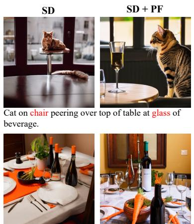
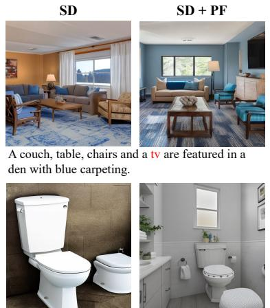
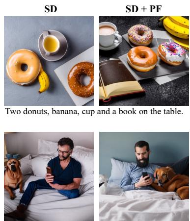
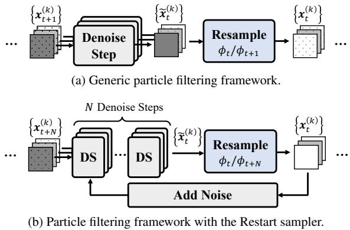
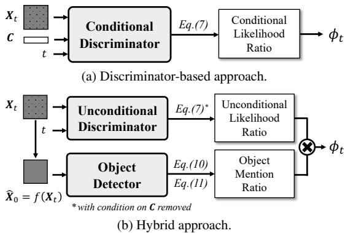
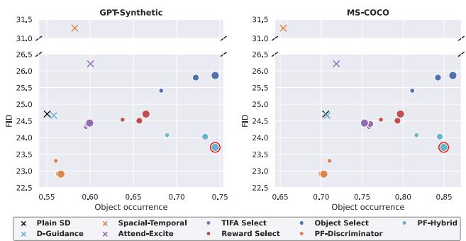
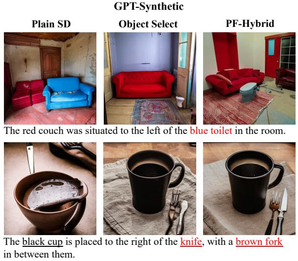
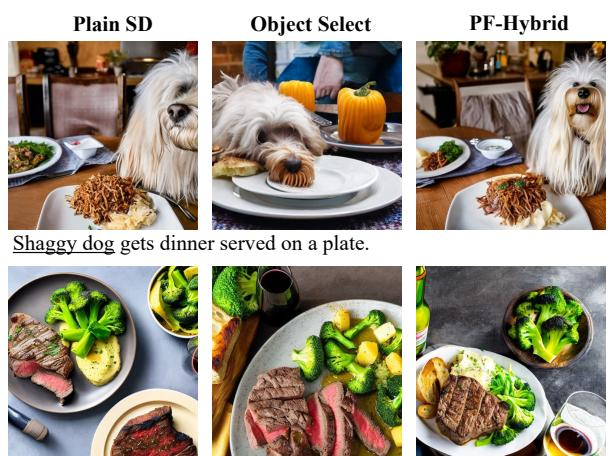
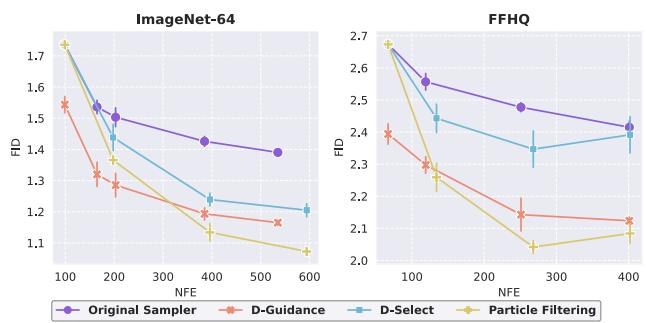

# Correcting Diffusion Generation through Resampling

Yujian Liu UC Santa Barbara yujianliu@ucsb.edu

Yang Zhang MIT-IBM Watson AI Lab yang.zhang2@ibm.com

Tommi Jaakkola MIT CSAIL tommi@csail.mit.edu

Shiyu Chang UC Santa Barbara chang87@ucsb.edu

  
A dining room table with a bottle of wine and wine glasses and a pot of carrots

  
A bathroom with a white toilet sitting next to a bathroom sink.

  
A man sitting on a bed with a dog while holding a cell phone.  
Figure 1. Sample images generated by Stable Diffusion v2.1 with and without our particle filtering algorithm (PF). The left two columns illustrate the missing object errors, and the right column illustrates the unnatural distortions. Missing objects are highlighted in red.

## Abstract

Despite diffusion models’ superior capabilities in modeling complex distributions, there are still non-trivial distributional discrepancies between generated and groundtruth images, which has resulted in several notable problems in image generation, including missing object errors in text-to-image generation and low image quality. Existing methods that attempt to address these problems mostly do not tend to address the fundamental cause behind these problems, which is the distributional discrepancies, and hence achieve sub-optimal results. In this paper, we propose a particle filtering framework that can effectively address both problems by explicitly reducing the distributional discrepancies. Specifically, our method relies on a set of external guidance, including a small set of real images and a pre-trained object detector, to gauge the distribution gap, and then design the resampling weight accordingly to correct the gap. Experiments show that our methods can effectively correct missing object errors and improve image quality in various image generation tasks. Notably, our method outperforms the existing strongest baseline by 5% in object occurrence and 1.0 in FID on MS-COCO. Our code is available at https://github.com/UCSB-NLP-

Chang/diffusion\_resampling.git.

## 1. Introduction

Diffusion models have achieved impressive success in generating high-quality images in various image-generation applications [2, 5, 13, 19, 22, 24, 28, 30, 39, 42–44, 46, 47, 49, 50, 53–56, 60, 65, 66]. Such success can be ascribed to diffusion models’ superior capability in modeling complex data distributions and thus low distributional discrepancies between the real and generated images. However, the diffusion generation process still introduces distributional discrepancies in modeling data distributions, due to the limited representation power of the denoising network, the errors introduced in discretizing and numerically solving the continuous ODE or SDE denoising trajectories [31, 64], etc.

Such distributional discrepancies have led to several notable problems in image generation. For example, in text-toimage generation, diffusion models suffer from the missing object errors, i.e., objects that are mentioned in the input text are sometimes not generated [17, 41, 61]. As shown in Figure 1 top-left, given the input description ‘Cat on chair peering over top of table at glass of beverage’, the stable diffusion model [47], a powerful text-to-image model, sometimes fails to generate the glass of beverage.

Another well-known problem in diffusion-based image generation is the low image quality, such as artifacts and unnatural distortions. In Figure 1 bottom-right, given the input description ‘A man sitting on a bed with a dog while holding a cell phone’, a sample image generated by stable diffusion contains a person with a missing left lower leg.

Since the fundamental cause behind these problems is the distribution gap between the generated and real images, an effective remedy to these problems should be to close the distribution gap. However, the existing research attempts to address these problems either do not aim to close the gap, or are not effective in doing so. For example, to address the missing object errors, some previous works designed cross-attention mechanism that controls how each token in the caption should be attended so that no object is ignored [3, 17, 34, 61], but they do not aim to reduce the distributional gap, so their effects on generating complete objects are limited [29], and their over-emphasis on improving object occurrence could lead to quality degradation. To address the low image quality issue, Kim et al. [31] introduces a discriminator to rectify the score function in the diffusion generation process, which is still subject to errors due to numerically solving the ODE/SDE denoising trajectories.

In this paper, we aim to develop a sampling-based framework that can effectively address both issues above by explicitly reducing the distributional discrepancies. We first present some findings of our initial exploration, which shows that sampling-based methods turn out to be a more effective way of modifying the output distribution of generated images and achieving desired generation properties than the more complicated baselines. Based on these findings, we design a particle-filtering framework [10, 15] that allows us to approximately sample from the ground-truth distribution. Specifically, our method relies on a set of external guidance, including a small set of real images and a pre-trained object detector, to gauge the distribution gap, and then design the resampling weight accordingly.

We evaluate our approach on text-to-image generation, unconditional and class-conditioned generation. On existing text prompt benchmarks [35, 61], our approach outperforms all the competitive specialized text-to-image methods in improving faithfulness to input text and image quality, as illustrated in Figure 1. Notably, our method outperforms the existing strongest baseline by 5% in object occurrence and 1.0 in FID on MS-COCO. On ImageNet-64, our method achieves a state-of-the-art FID of 1.02 for class-conditioned generation, outperforming the strong baseline that uses discriminator guidance [31].

## 2. Related Works

Faithful Text-to-image Generation. Recent studies highlight faithfulness as a key challenge in text-to-image diffusion models [7–9, 17, 18, 33, 36, 40, 41, 61], including missing objects, mistakenly bound attributes, wrong locations, etc. To address this challenge, existing work modifies the generation process to separately focus on each aspect in the caption and later combine the outputs of each part [16, 37, 58]. For example, Wu et al. [61] and Feng et al. [17] modify the cross-attention between image and text to separately attend to each noun phrase in the text, and combine attention outputs. Several works leverage layout information to increase objects’ attention weights in specified image regions [3, 34, 61]. Karthik et al. [29] also employs the sample selection idea, but their selection is only performed at the final step, and does not aim to approach the true distribution, whereas our method reduces the distributional gap at each denoising step. Moreover, our method can extend beyond text-to-image generation.

Particles in Diffusion Generation. Particle filtering has been applied in diffusion generation to obtain samples from a target distribution [14, 57, 59]. However, these works focus on re-purposing an unconditional diffusion model as a conditional model, rather than reducing the gap with the ground-truth distribution. Corso et al. [11] proposes particle guidance to increase the diversity among generated samples. Their method modifies the score function with a jointparticles potential, which is orthogonal to our work.

Diffusion Generation with Discriminator. Discriminators have been used to improve diffusion generation. Xiao et al. [62] uses a GAN to approximate multimodal distributions in the denoising process to reduce the number of denoising steps. Kang et al. [26] trains diffusion models with the additional objective of fooling a discriminator to improve image quality when the number of denoising steps is small. Kim et al. [31] leverages a discriminator to generate samples closer to ground-truth distribution. However, their discriminator is used to modify the model score, whereas ours is used to resample images, which is less affected by the discretization errors of the sampling algorithm.

## 3. Methodology

## 3.1. Background and Notation

Throughout this section, we use upper-case letters, $x ,$ , to denote random vectors, and lower-case letters, x, to denote deterministic vectors. We use the colon notation, $X _ { 1 : T }$ , to denote a set of variables ranging from $X _ { 1 }$ to $X _ { T }$

In this work, we will primarily focus on text-to-image diffusion models, which, given an input text description denoted as $C ,$ , generate images that satisfy the text description via a denoising process that generates a sequence of noisy images from $X _ { T }$ down to $X _ { 0 } ,$ , where $X _ { 0 }$ represents the clean image, and $X _ { t }$ represents the image corrupted with Gaussian noise. The noise is larger with a greater $t ,$ and with sufficiently large T, $X _ { T }$ approaches pure Gaussian noise. The denoising process can be formulated as follows:

$$
q ( \boldsymbol { X } _ { 0 : T } | \boldsymbol { C } ) = q ( \boldsymbol { X } _ { T } ) \prod _ { t = 0 } ^ { T - 1 } q ( \boldsymbol { X } _ { t } | \boldsymbol { X } _ { t + 1 } , \boldsymbol { C } ) ,\tag{1}
$$

where $q ( X _ { T } )$ follows the pure Gaussian distribution. Different denoising algorithms would induce different transitional probabilities $q ( X _ { t } | X _ { t + 1 } , C )$ . Since our work does not rely on specific choices of denoising algorithms, we will leave $q ( X _ { t } | X _ { t + 1 } , C )$ abstract throughout this section.

In the following, we will use $p ( \pmb { X } _ { t } | \pmb { C } )$ to denote the ground-truth distribution, $i . e .$ , real images corrupted with Gaussian noise, and $q ( X _ { t } | C )$ as the distribution produced by the actual denoising network. Due to the learning capacity of the denoising network and approximation errors, $q ( X _ { t } | C )$ can differ from $p ( \pmb { X } _ { t } | \pmb { C } )$

## 3.2. Problem Formulation

The general goal of this paper is to reduce the gap between $q ( X _ { t } | C )$ and $p ( \pmb { X } _ { t } | \pmb { C } )$ , with the help of some external guidance, in order to address the following two prominent diffusion generation errors.

• Missing Object Errors: The generated images sometimes miss the objects mentioned in the text input. Formally, we introduce two bag-of-object variables. One is the object mention variable, denoted as $O _ { C }$ , whose i-th element, $O _ { C i }$ , equals one if object i is mentioned in the input text $_ { C }$ and zero otherwise. The other is the object occurrence variable, denoted as $O _ { X }$ , whose i-th element, $O _ { X i }$ , equals one if object i occurs in the image $X _ { 0 }$ and zero otherwise. Then the missing object errors refer to the case where $O _ { C i } = 1$ but $O _ { X i } = 0$

• Low Image Quality: The generated images can sometimes suffer from unnatural distortion and texture. The low image quality problem can be ascribed as the general distribution gap between $p ( \pmb { X } _ { 0 } )$ and $q ( \pmb { X } _ { 0 } )$ ).

We consider the following two types of external guidance to correct the generation errors.

• An object detector which can predict the probability that a certain object appears in the image, i.e. $\hat { p } ( O _ { X i } = 1 | X _ { 0 } )$ ), which provides useful information in correcting the missing object errors.

• A small set of real images, , either with or without text captions, which is useful in gauging the distribution gap. In the following, we will develop different methods under different availability of external guidance.

## 3.3. Initial Exploration: A Naive Approach

As an initial exploration, we first focus on the subproblem that uses the object detector to correct the missing object errors. We will start with a naive sample selection approach, consisting of two steps. First, we use the diffusion model to generate K samples, $\begin{array} { r } { \bigcup _ { k = 1 } ^ { K } \{ \pmb { x } _ { 0 } ^ { ( k ) } \} } \end{array}$ . Second, we simply select the image with the best object occurrence probability of the objects that are mentioned in the text, i.e.,

$$
\operatorname* { m a x } _ { \pmb { x } _ { 0 } ^ { ( k ) } } \prod _ { i : O _ { C i } = 1 } \hat { p } ( O _ { X i } = 1 | \pmb { X } _ { 0 } = \pmb { x } _ { 0 } ^ { ( k ) } ) .\tag{2}
$$

We dub the approach as OBJECTSELECT, whose implementation details are elaborated in Appendix C.

We run OBJECTSELECT on two benchmark datasets (GPT-Synthetic [61] and MS-COCO [35]) with complex text descriptions, together with four baselines that also use object detectors or other object occurrence feedback to improve the object occurrence of the generated images. The object occurrence ratios of all the methods are shown in Figure 4. As can be observed, OBJECTSELECT can significantly outperform the other baselines, some of which are much more complicated. More details of this experiment can be found in Section 4.1.

Admittedly, despite the effectiveness of OBJECTSE-LECT, this algorithm comes with obvious limitations. First, it only addresses the object occurrence issue and does not aim to approach the ground-truth conditional distribution $p ( { X } _ { 0 } | C )$ , so the selected images may compromise in quality. Second, the success of this approach relies on generating a sufficiently large number of samples to be able to find a few with good object occurrence, so the sample efficiency is low. However, this experiment does provide us with an important insight: Performing sampling on multiple generation paths of diffusion models turns out to be a direct and effective way of modifying the generation distribution of diffusion models. Similar observations are also made in previous works [29, 45, 51]. If OBJECTSELECT can already do so well, can we design an even more effective samplingbased algorithm that overcomes its limitations and can simultaneously correct for the missing object errors and improve image quality?

## 3.4. A Particle Filtering Framework

Particle filtering has long been an effective Monte-Carlo sampling framework for approximately generating random samples from a target distribution [10, 15], and has been successfully applied to diffusion models [57, 59]. Inspired by this, we will explore how to incorporate the external guidance into the particle filtering framework, to achieve a target distribution of $p ( { X } _ { 0 } | C )$

Our particle filtering framework obtains samples of $X _ { 0 : T }$ in reverse order. It first generates K samples of $X _ { T } ,$ , denoted as $\{ \pmb { x } _ { T } ^ { ( k ) } \}$ , conditional on which K samples of $X _ { T - 1 }$ are derived. This process continues until K samples of $X _ { 0 }$ are obtained. Specifically, samples of $X _ { t } , \{ x _ { t } ^ { ( k ) } \}$ , are derived from samples of $X _ { t + 1 } , \{ x _ { t + 1 } ^ { ( k ) } \}$ , via the following two steps. Step 1: Proposal. For each sample $\pmb { x } _ { t + 1 } ^ { ( k ) }$ , propose a sample of X based on a proposal distribution $r ( X _ { t } | X _ { t + 1 } \ =$ $\bar { \mathbf { \Psi } } _ { \pmb { x } _ { t + 1 } ^ { ( k ) } , \pmb { C } ) }$ . This sample is denoted as $\tilde { \pmb { x } } _ { t } ^ { ( k ) }$

  
Figure 2. Illustration of our particle filtering framework.

Step 2: Resampling. Given all the sample pairs $\begin{array} { r } { \bigcup _ { k = 1 } ^ { K ^ { - } } \{ ( \pmb { x } _ { t + 1 } ^ { ( k ) } , \tilde { \pmb { x } } _ { t } ^ { ( k ) } ) \} } \end{array}$ , resample from this set K times (with replacement) with a probability proportional to a weight function, $w ( \pmb { x } _ { t + 1 } ^ { ( k ) } , \tilde { \pmb { x } } _ { t } ^ { ( k ) } | C )$ , and then only keep the latter in each sample pair. The resulting samples become $\{ \pmb { x } _ { t } ^ { ( k ) } \}$

Therefore, the key to the design of a particle filtering algorithm involves designing 1) the proposal distribution $r ( X _ { t } | X _ { t + 1 } , C )$ , and 2) the resampling weight $w ( X _ { t + 1 } , X _ { t } | C )$ . Consistent with the design principles in Wu et al. [59], we adopt the following design:

$$
\begin{array} { r l } & { r ( X _ { t } | X _ { t + 1 } , C ) = q ( X _ { t } | X _ { t + 1 } , C ) , } \\ & { w ( X _ { t + 1 } , X _ { t } | C ) = \frac { \phi _ { t } \left( X _ { t } | C \right) } { \phi _ { t + 1 } \left( X _ { t + 1 } | C \right) } . } \end{array}\tag{3}
$$

The first line essentially means that the proposal step becomes the denoising step of the diffusion model. Denote the distribution that $\bar { \{ \pmb { x } _ { t } ^ { ( k ) } \} }$ follows as v( $X _ { t } | C )$ . Then it can be easily shown that, if we follow the design in Eq. (3),

$$
v ( X _ { t } | C ) = q ( X _ { t } | C ) \phi _ { t } ( X _ { t } | C ) .\tag{4}
$$

The proof is provided in Appendix A. In other words, $\phi _ { t } ( { \mathbf { } } \mathbf { X } _ { t } | C )$ can be interpreted as a correction term that modifies the distribution of $\pmb { X } _ { t }$ . If we could set

$$
\phi _ { t } ( X _ { t } | C ) = \frac { p ( X _ { t } | C ) } { q ( X _ { t } | C ) } ,\tag{5}
$$

then we can ideally achieve $v ( X _ { t } | C ) = p ( X _ { t } | C )$ , t, which means the final generated image will follow the real image distributions. Figure 2a illustrates the overall process.

Now the question is how to compute the conditional likelihood ratio in Eq. (5). Sections 3.5 and 3.6 introduce two methods with different requirements on external guidance.

## 3.5. A Discriminator-Based Approach

Our first method, shown in Figure 3a, only utilizes a small set of real images with captions as the external guidance. It involves training a discriminator that discriminates between real and generated examples. Specifically, given a text description C, real samples of $\pmb { X } _ { t }$ are obtained by corrupting real images that correspond to C with Gaussian noise; fake samples of X are obtained by first generating images using the diffusion model with C as the text condition, and then corrupting the generated images with Gaussian noise.

  
Figure 3. Calculation of the correction term $\phi _ { t } ( { \mathbf { } } { \mathbf { } } X _ { t } | C )$

Given the real and fake samples, we train a conditional discriminator $d ( X _ { t } | C ; t )$ by minimizing the canonical discrimination loss

$$
\begin{array} { r l } & { \mathcal { L } = \mathbb { E } _ { C , t } \big [ \mathbb { E } _ { X _ { t } \sim p ( X _ { t } \vert C ) } [ - \log d ( X _ { t } \vert C ; t ) ] } \\ & { ~ + \mathbb { E } _ { X _ { t } \sim q ( X _ { t } \vert C ) } [ - \log ( 1 - d ( X _ { t } \vert C ; t ) ) ] \big ] . } \end{array}\tag{6}
$$

It has been shown [20] that the minimizer of (6), denoted as $d ^ { * } ( X _ { t } | C ; t )$ , can be used to compute the conditional likelihood ratio as:

$$
\frac { p ( X _ { t } | C ) } { q ( X _ { t } | C ) } \approx \frac { d ^ { * } ( X _ { t } | C ; t ) } { 1 - d ^ { * } ( X _ { t } | C ; t ) } .\tag{7}
$$

Theoretically, the discriminator-based approach can correct any distributional discrepancies between real and generated images. However, due to the limitation in representation power and optimization schemes, the discriminator may fail to capture certain errors, such as the missing object errors. Next, we will introduce an alternative approach with a more fine-grained correction of different error types.

## 3.6. A Hybrid Approach

The hybrid approach (in Figure 3b) uses both the object detector and real image set as the external guidance to address the missing object errors and poor image quality respectively. Formally, according to the Bayes rule, we decompose the conditional likelihood ratio in Eq. (5) as follows:

$$
\begin{array} { r l } & { \frac { p \left( { \mathbf { X } _ { t } } | { \cal C } \right) } { q \left( { \mathbf { X } _ { t } } | { \cal C } \right) } \overset { \oplus } { = } \frac { p \left( { \mathbf { X } _ { t } } | { \cal C } , { \cal O } _ { \cal C } \right) } { q \left( { \mathbf { X } _ { t } } | { \cal C } , { \cal O } _ { \cal C } \right) } } \\ & { \quad \quad \quad \quad = \frac { q \left( { \cal C } , { \cal O } _ { \cal C } \right) } { p \left( { \cal C } , { \cal O } _ { \cal C } \right) } \cdot \frac { p \left( { \mathbf { X } _ { t } } \right) } { q \left( { \mathbf { X } _ { t } } \right) } \cdot \frac { p \left( { \cal O } _ { \cal C } | { \mathbf { X } _ { t } } \right) } { q \left( { \cal O } _ { \cal C } | { \mathbf { X } _ { t } } \right) } \cdot \frac { p \left( { \cal C } | { \cal O } _ { \cal C } , { \mathbf { X } _ { t } } \right) } { q \left( { \cal C } | { \cal O } _ { \cal C } , { \mathbf { X } _ { t } } \right) } . } \end{array}\tag{8}
$$

Equality ¨ is due to the fact that the information in $O _ { C }$ by definition, comes entirely from C. The right-hand side of Eq. (8) consists of four terms. The first term is about the prior distribution of text conditions, which should equal one because the text prior is not impacted by the denoising process. The second term addresses the general distributional discrepancies in images, which accounts for the low image quality issue. The third term accounts for the missing object errors. The fourth term accounts for any other inconsistencies between the image and text, such as inconsistent object characteristics, mispositioned objects, etc. Since our current focus is on correcting missing object errors and improving image quality, we will focus on estimating the second and third terms, which we will refer to as the unconditional likelihood ratio and object mention ratio respectively.

Estimating the unconditional likelihood ratio. The unconditional likelihood ratio can be estimated the same way as in Section 3.5, except that the discriminator should be replaced with an unconditional one without C, hence denoted as $d ( X _ { t } ; t )$ . Accordingly, we can replace the discriminator in Eq. (7) with $d ^ { * } ( X _ { t } ; t )$ to compute the unconditional likelihood ratio. As a result, this hybrid approach does not require that the image set comes with captions.

Estimating the object mention ratio. Assuming conditional independence of different dimensions of $O _ { C }$ , the object mention ratio can be further factorized as follows:

$$
\begin{array} { r l } & { \frac { p ( { O _ { C } | \mathbf { X } _ { t } } ) } { q ( { O _ { C } | \mathbf { X } _ { t } } ) } = \frac { \prod _ { i } p ( { O _ { C i } | \mathbf { X } _ { t } } ) } { \prod _ { i } q ( { O _ { C i } | \mathbf { X } _ { t } } ) } } \\ & { \ = \frac { \prod _ { i : O _ { C i } = 1 } p ( { O _ { C i } = 1 } \pmb { | X _ { t } } ) } { \prod _ { i : O _ { C i } = 1 } q ( { O _ { C i } = 1 } \pmb { | X _ { t } } ) } \cdot \frac { \prod _ { i : O _ { C i } = 0 } p ( { O _ { C i } = 0 } | \pmb { X _ { t } } ) } { \prod _ { i : O _ { C i } = 0 } q ( { O _ { C i } = 0 } | \pmb { X _ { t } } ) } . } \end{array}\tag{9}
$$

Essentially, Eq. (9) divides the objects into two groups, ones that are mentioned in the caption, and ones that are not. So the first term corrects for the missing object errors and the second term corrects for the false generation (i.e., generating objects that are not mentioned in the caption). Since the main concern of diffusion generation is the former, we will focus on computing the first term.

The numerator, $p ( O _ { C i } \ = \ 1 | X _ { t } )$ , measures, pretending that the noisy image $X _ { t }$ were corrupted from a real image and that the real image had a caption, what is the probability that the caption would mention object i. Since the caption almost always reflects what is in the image, this probability can be easily approximated by running the object detector on the predicted clean image from $X _ { t }$ . Formally, denote $f ( \pmb { X } _ { t } )$ as the one-step prediction of the clean image by the diffusion model, then

$$
p ( O _ { C i } = 1 | \boldsymbol { X } _ { t } ) \approx \hat { p } ( O _ { \boldsymbol { X } i } = 1 | f ( \boldsymbol { X } _ { t } ) ) .\tag{10}
$$

A more rigorous derivation is provided in Appendix B.

The denominator, $q ( O _ { C i } = 1 | \boldsymbol { X } _ { t } )$ , measures, pretending that the noisy image $X _ { t }$ were generated by the (imperfect) diffusion model conditional on an input description $^ { C , }$ what is the probability that the input text had mentioned object i. Unlike the numerator, if an object i does not appear in the image, there is still a non-zero chance that the caption had mentioned the object $i ,$ considering the diffusion model may miss the object. As formally derived in Appendix B, this probability can be approximated as

$$
\begin{array} { l } { { q ( O _ { C i } = 1 | X _ { t } ) \approx \hat { p } ( O _ { X i } = 1 | f ( X _ { t } ) ) } } \\ { { \qquad + \hat { p } ( O _ { X i } = 0 | f ( X _ { t } ) ) \frac { ( 1 - \kappa _ { i t } ) \pi _ { i t } } { ( 1 - \kappa _ { i t } ) \pi _ { i t } + 1 - \pi _ { i t } } , } } \end{array}\tag{11}
$$

where $\pi _ { i t }$ is a hyper-parameter between 0 and 1; and

$$
\kappa _ { i t } = \frac { \mathbb { E } _ { { \pmb X } _ { t } , { \pmb C } \sim q ( { \pmb X } _ { t } , { \pmb C } ) } [ \mathbb { 1 } ( \hat { O } _ { X i t } = 1 \wedge O _ { C i } = 1 ) ] } { \mathbb { E } _ { { \pmb C } \sim q ( { \pmb C } ) } [ \mathbb { 1 } ( O _ { C i } = 1 ) ] }\tag{12}
$$

denotes the percentage of occurrence of object i in the image predicted from $\pmb { X } _ { t }$ when the text description mentions object i. $\hat { O } _ { X i t }$ denotes the (estimated) occurrence of object i in the clean image predicted from $X _ { t } , i . e . \ f ( X _ { t } )$ , which is computed by passing $f ( \pmb { X } _ { t } )$ to the object detector and then see whether the output exceeds the threshold 0.5. ( ) denotes the indicator function.

To compute $\kappa _ { i t } ,$ , we would need to run an initial generation round, where we feed a set of text descriptions to the diffusion model (without particle filtering) and generate a set of images. The numerator of Eq. (12) is computed by counting how many text-image pairs mention object i in the text and the corresponding $\hat { O } _ { X i t }$ equals one; the denominator is computed by counting how many text descriptions mention object i. Although the initial generation round introduces extra computation, it only needs to perform once.

Summary. Our hybrid approach computes $\phi _ { t } ( { \mathbf { } } { \mathbf { } } X _ { t } | C )$ as

$$
\phi _ { t } ( \mathbf { \boldsymbol { X } } _ { t } | \mathbf { \boldsymbol { C } } ) = \frac { p ( \mathbf { \boldsymbol { X } } _ { t } ) } { q ( \mathbf { \boldsymbol { X } } _ { t } ) } \cdot \frac { \prod _ { i : O _ { C i } = 1 } p ( O _ { C i } = 1 | \mathbf { \boldsymbol { X } } _ { t } ) } { \prod _ { i : O _ { C i } = 1 } q ( O _ { C i } = 1 | \mathbf { \boldsymbol { X } } _ { t } ) } ,\tag{13}
$$

where the first term is computed by training an unconditional discriminator (similar to Eq. (7)), and the second term is computed from Eqs. (10) and (11) using the object detector. Algs. 1 and 2 in Appendix describe the particle filtering algorithm and the calculation of $\phi _ { t } ( { \mathbf { } } { \mathbf { } } X _ { t } | C )$ respectively.

## 3.7. Generalization to Other Generation Settings

The proposed algorithm can be applied beyond text-toimage generation to generic conditional and unconditional generations by setting C to other conditions or an empty set respectively. In this case, the discriminator-based approach will be used as the hybrid approach is no longer applicable.

## 4. Experiments

In this section, we will first demonstrate the effectiveness of our method on reducing the missing object errors and improving the image quality in text-to-image generation. We then evaluate our method on standard benchmarks of unconditional and class-conditioned generation. Finally, we will investigate various design choices in our framework.

## 4.1. Text-to-Image Generation

Datasets. We use two datasets: (1) GPT-Synthetic was introduced in Wu et al. [61] to evaluate text-to-image models’ ability in generating correct objects and their associated colors and positions. It contains 500 captions, where each caption contains 2 to 5 objects in MS-COCO [35], and objects are associated with random colors and spatial relations with other objects, e.g., ‘The tie was placed to the right of the red backpack.’ (2) We also evaluate on the validation set of MS-COCO. However, we focus on the subset of complex descriptions that contain at least four objects, which results in 261 captions (details in Appendix C.2).

Baselines. We compare with seven baselines: ∂ SD, which is the Stable Diffusion model [47] as is; ∑ D-GUIDANCE [31] that modifies the score function by adding an additional term log $\begin{array} { r } { \frac { p ( \pmb { X } _ { t } | \pmb { C } ) } { q ( \pmb { X } _ { t } | \pmb { C } ) } } \end{array}$ , where we use the hybrid approach in Section 3.6 to estimate $\begin{array} { r } { \phi _ { t } ( { X } _ { t } | { C } ) = \frac { p ( { X } _ { t } | { C } ) } { q ( { X } _ { t } | { C } ) } } \end{array}$ ; ∏ SPATIAL-TEMPORAL [61] and π ATTEND-EXCITE [7] that modify each denoising step to ensure each object in the caption is attended (details in Section 2); ∫ OBJECTSELECT in Section 3.3; ª TIFASELECT and º REWARDSELECT, both in [29], which are similar to ∫ but use TIFA score [25] and ImageReward [63] as the selection criteria respectively. For methods that leverage an object detector, we use DETR [6] with ResNet-50 backbone [21]. For all sample selection methods (∫-º and ours), we select the best image based on each method’s sampling criterion for evaluation. We use SD v2.1-base for our method and baselines (only ∏ does not support it, for which we use v1.5). Additional results using SD v1.5 are in Appendix C.7.

Metrics. We evaluate generated images using both objective and subjective metrics. For objective evaluation, we use Object Occurrence to measure the percentage of objects that occur in generated images over all objects mentioned in the caption. We calculate the percentage for each caption and take the average over all captions in the dataset. We use an object detector (DETR with ResNet-101 backbone) different from the one used during generation. In addition, we also calculate Frechet inception distance ( ´ FID) [23] as a measure for image quality. Similar to Xu et al. [64], we calculate FID on 5,000 captions in the MS-COCO validation set that contain at least one object. For subjective evaluation, we recruit annotators on Amazon Mechanical Turk to compare images generated by our method and baselines. Annotators are asked to evaluate two aspects: (1) (Object) Given an image, annotators need to identify all objects in it. (2) (Quality) Given two images for the same caption, annotators need to select the one that looks more real and natural. We randomly sample 100 captions1 from each dataset for evaluation, and each image is rated by two annotators.

  
Figure 4. FID ( ) vs. Object occurrence ( ) for all methods. Ideal points should scatter at the bottom right corner. Object occurrence is measured on GPT-Synthetic (left) and MS-COCO (right), and FID is measured on MS-COCO. K = 5, 10, 15 images are generated for sample selection methods, and the sizes of points indicate the value of K (larger K has larger points). The method that achieves the best combined performance is highlighted in red.

Diffusion samplers. All the methods are evaluated on the Restart sampler [64]. The only exceptions are SPATIAL-TEMPORAL and ATTEND-EXICTE, which use the same samplers as in their papers. The Restart sampler iterates between three steps: ∂ Denoise from t+N to t using the ODE trajectory; ∑ Restart by adding the noise back to the level t + N. ∏ Denoise from t + N to t again, and either go back to step ∑ or proceed to the next iteration which denoises to $t - N ^ { \prime }$ . As shown in Figure 2b, our methods are combined with the Restart sampler by inserting the resampling module right before adding noise. We also experimented with the SDE sampler in EDM [28], but we found Restart sampler generally dominates EDM on both object occurrence and image quality. We thus only focus on Restart sampler in the main paper. EDM results are shown in Appendix C.6.

Sampling configurations. To have a fair comparison in terms of the computation cost, we evaluate all sample selection methods (including ours) under a comparable number of function evaluations (NFE). Specifically, we generate each image with a fixed NFE and report performance when $K = 5 , 1 0$ , 15 images are generated for each caption. This ensures a fair comparison for methods with the same value of K. For non-selection methods (SD, D-GUIDANCE, SPATIAL-TEMPORAL, and ATTEND-EXCITE), we use the original sampling configuration in their papers and thus only report a single performance on each dataset. Appendix C.4 details the computation cost for all methods.

Results. Figure 4 shows object occurrence and FID for all methods. The performance of sample selection methods is reported for three different values of K, which are indicated by the sizes of the points in the figure. A competitive algorithm should achieve a high object occurrence rate (right) and low FID (bottom), so the more the algorithm lies to the bottom-right corner, the more competitive the algorithm is.

<table><tr><td rowspan="2"></td><td colspan="2">GPT-Synthetic</td><td colspan="2">MS-COCO</td></tr><tr><td>Object Occur (↑)</td><td>Quality vs. PF-HYBRID (↑)</td><td>Object Occur (↑)</td><td>Quality vs. PF-HYBRID (↑)</td></tr><tr><td>SD [47]</td><td>64.48</td><td>-6.00</td><td>59.87</td><td>-3.00</td></tr><tr><td>REWARDSELECT [29]</td><td>71.97</td><td>-3.00</td><td>63.25</td><td>-3.00</td></tr><tr><td>OBJECTSELECT</td><td>70.96</td><td>-11.00</td><td>67.35</td><td>-9.00</td></tr><tr><td>PF-DISCRIMINATOR</td><td>68.87</td><td>-8.00</td><td>59.98</td><td>-2.00</td></tr><tr><td>PF-HYBRID</td><td>75.79</td><td></td><td>68.13</td><td></td></tr></table>

Table 1. Human evaluation on object occurrence and image quality. ‘Quality’ is the win rate against PF-HYBRID (minus 50). Negative values indicate the method is worse than PF-HYBRID.

There are two observations from Figure 4. First, the sampling-based methods (represented by circles) generally significantly outperform the non-sampling-based ones (represented by crosses). In particular, although SPACIAL-TEMPORAL and ATTEND-EXCITE improve object occurrence, the improvements are not as large as other samplingbased methods, and their computational costs (as shown in Appendix C.4) are also high or on par with the samplingbased methods. Second, our PF-HYBRID is the only algorithm that simultaneously achieves high object occurrence and low FID. OBJECT-SELECT achieves a high object occurrence, but the worst FID scores. The other proposed method, PF-DISCRIMINATOR, achieves a very low FID, but the object occurrence is significantly compromised, which verifies our claim that conditional discriminators tend to overlook object occurrence and focus only on image quality (Section 3.5). Notably, all three methods proposed in this paper, OBJECT-SELECT, PF-DISCRIMINATOR and - HYBRID lie at the frontier of the performance trade-off, significantly outperforming the existing baselines. Appendix C.5 further shows the object occurrence for each object category, which indicates that our method is particularly beneficial on small objects with fine details.

Table 1 shows the results for subjective evaluations, where object occurrence is computed the same way as the objective object occurrence. The quality score is computed as follows. Since PF-HYBRID is the most competitive algorithm, we perform a pairwise comparison between PF-HYBRID and each baseline. The baseline gets one point everytime a subject prefers the baseline over PF-HYBRID. Each comparison consists of 100 pairs so a score of 50 indicates a tie. We subtract all the scores by 50 so a negative score in each baseline indicates that PF-HYBRID is better. As can be observed, PF-HYBRID outperforms all the baselines in terms of object occurrence and subjective quality.

Figure 5 visualizes some generated images by our method and baselines. As can be observed, the plain SD can generate natural images but tends to miss objects mentioned in the text. OBJECTSELECT reduces the missing object errors but could lead to unnatural objects in the image (e.g., knife and fork). PF-HYBRID generates more complete objects and also improves image quality. Appendix F presents more examples including failure cases of our method.

## 4.2. Unconditional & Class-conditioned Generation

Experiment setup. In addition to text-to-image, we evaluate two other image generation benchmarks, FFHQ [27] for unconditional generation and ImageNet-64 [12] for class-conditioned generation. Here, object occurrence is not applicable so we will focus on image quality as measured by FID. We will only implement PF-DISCRIMINATOR because PF-HYBRID is not applicable (Sectoin 3.7). We use the pre-trained diffusion models in Karras et al. [28] and follow Kim et al. [31] to train the discriminator (details in Appendix D.1). For evaluation, we calculate FID on 50,000 generated images. Additional results using ADM [13] and VP [55] diffusion models are in Appendix D.5.

Baselines and method variants. We consider three baselines: ∂ The original Restart sampler; ∑ D-GUIDANCE using the discriminator to compute the correct term (following [31]); ∏ D-SELECT, which is similar to OBJECTSE-LECT but uses the likelihood ratio $\frac { p ( { X } _ { 0 } | C ) } { q ( { X } _ { 0 } | C ) } $ as the selection criterion (effectively an importance sampling approach to restore the ground-truth distribution).

Sampling configurations. Similar to Section 4.1, we evaluate PF and D-SELECT for different values of K with a fixed NFE per image. For a fair comparison, we increase denoising steps for the original sampler and D-GUIDANCE to match the total NFE of the sampling-based methods.

Results. Figure 6 shows FID as a function of overall NFE.   
For PF and D-SELECT, K = 2, 4, 6 images are generated.

There are two observations. First, all the methods generally improve as NFE increases, showing the effectiveness of increasing samples (for sampling-based methods) or increasing denoising steps (for non-sampling-based methods). Second, D-GUIDANCE generally performs competitively, especially at small NFEs, but our method consistently achieves the lowest FID across two datasets at large NFEs. Moreover, it is worth to note that NFE is not an adequate measure of computation cost in our setting. NFE only measures the number of evaluations of the denoising U-Net, ignoring the other compute costs such as the forward and backward passes of the discriminator. Since D-GUIDANCE evaluates the discriminator at every denoising step, whereas ours only at a subset of steps with no backward passes, our method incurs 0.66 compute cost per NFE compared to D-GUIDANCE. As shown in Figure 11 in Appendix D.4, if this factor is considered, our method outperforms D-GUIDANCE across all compute costs.

## 4.3. Ablation Study

We now investigate two important aspects of our method in text-to-image generation setting: the particle filtering algorithm and the resampling weight calculation. For each ablated version, we will evaluate on the object occurrence on GPT-Synthetic and MS-COCO, and FID on the latter.

  
A steak dinner with a bowl of steamed broccoli, bread and butter, a bottle of beer and a bottle of wine.

Figure 5. Visualization of generated samples. Missing objects are highlighted in red. Unnatural objects are highlighted with underline.  

Figure 6. FID (average of 3 runs) on ImageNet-64 (left) and FFHQ (right). Error bars indicate standard deviations.
<table><tr><td rowspan="2"></td><td colspan="2">Object Occurrence (%) ↑</td><td rowspan="2">FID↓</td></tr><tr><td>GPT-Syn</td><td>MS-COCO</td></tr><tr><td>PF-HYBRID</td><td>72.96</td><td>83.84</td><td>24.03</td></tr><tr><td>- PF</td><td>67.16</td><td>80.49</td><td>24.18</td></tr><tr><td>- Discriminator</td><td>75.67</td><td>85.79</td><td>25.77</td></tr><tr><td>PF-DISCRIMINATOR</td><td>56.86</td><td>70.96</td><td>22.91</td></tr><tr><td>- PF</td><td>57.09</td><td>72.13</td><td>23.28</td></tr><tr><td>Object only</td><td>63.15</td><td>77.81</td><td>25.31</td></tr></table>

Table 2. Ablation study on the effects of particle filtering algorithm and particle weights design.

First, we investigate the effects of removing particle filtering. To do that, we compare PF-HYBRID and PF-DISCRIMINATOR with two approaches that do not involve particle filtering but only generate K images via the regular Restart sampler and select the best one with the largest value of $\phi _ { 0 } ( X _ { 0 } | C )$ , calculated the same way as PF-HYBRID and PF-DISCRIMINATOR respectively. Table 2 shows the performance of these two methods (rows ‘ PF’). As can be observed, removing PF hurts the performance of PF-HYBRID on all metrics, demonstrating the importance of the particle filtering process. Removing PF hurts FID for PF-DISCRIMINATOR but does not affect object occurrence, which indicates the conditional discriminator focuses on image quality instead of object occurrence.

Second, we investigate the design choices of the resampling weight. We explore two variants for estimating $\phi _ { t } ( { \mathbf { } } { \mathbf { } } X _ { t } | C )$ For PF-HYBRID, we remove its unconditional discriminator and only include the object mention ratio (Eq. (13)). For PF-DISCRIMINATOR, since we have observed that the discriminator tends to ignore missing objects, we introduce a variant to force its attention on missing objects by training the discriminator on the object detector’s output probability as the feature (instead of on the images). The results in Table 2 (rows ‘ Discriminator’ and ‘Object only’ respectively) show that these two variants manage to improve object occurrence, but at the cost of higher FIDs, which highlights the needs of balancing the two objectives.

We further study other aspects in class-conditioned generation, including when the resampling is performed (i.e., before or after adding noise), the amount of noise being added, and the number of denoising steps per image. Notably, our PF method with Restart sampler achives the stateof-the-art FID of 1.02 on ImageNet-64 when 4 images are generated with 165 NFE (details in Appendix E).

## 5. Conclusion

In this paper, we propose a sampling-based approach using particle filtering to correct diffusion generation errors and reduce discrepancies between model-generated and real data distributions. Experiments on text-to-image, unconditional, and class-conditioned generation reveal our method effectively corrects missing objects and low-quality errors.

Acknowledgements. The work of Yujian Liu and Shiyu Chang was partially supported by National Science Foundation Grant IIS-2207052 and IIS-2302730. Tommi Jaakkola acknowledges support from the MIT-IBM Watson AI Lab.

## References

[1] Brian. D. O. Anderson. Reverse-time diffusion equation models. Stochastic Processes and their Applications, 12: 313–326, 1982. 14

[2] Omri Avrahami, Dani Lischinski, and Ohad Fried. Blended diffusion for text-driven editing of natural images. In 2022 IEEE/CVF Conference on Computer Vision and Pattern Recognition (CVPR), 2022. 1

[3] Yogesh Balaji, Seungjun Nah, Xun Huang, Arash Vahdat, Jiaming Song, Qinsheng Zhang, Karsten Kreis, Miika Aittala, Timo Aila, Samuli Laine, Bryan Catanzaro, Tero Karras, and Ming-Yu Liu. ediff-i: Text-to-image diffusion models with an ensemble of expert denoisers, 2023. 2

[4] Dmitry Baranchuk, Andrey Voynov, Ivan Rubachev, Valentin Khrulkov, and Artem Babenko. Label-efficient semantic segmentation with diffusion models. In International Conference on Learning Representations, 2022. 15

[5] Tim Brooks, Aleksander Holynski, and Alexei A. Efros. Instructpix2pix: Learning to follow image editing instructions, 2023. 1

[6] Nicolas Carion, Francisco Massa, Gabriel Synnaeve, Nicolas Usunier, Alexander Kirillov, and Sergey Zagoruyko. End-toend object detection with transformers, 2020. 6

[7] Hila Chefer, Yuval Alaluf, Yael Vinker, Lior Wolf, and Daniel Cohen-Or. Attend-and-excite: Attention-based semantic guidance for text-to-image diffusion models, 2023. 2, 6, 16

[8] Minghao Chen, Iro Laina, and Andrea Vedaldi. Training-free layout control with cross-attention guidance, 2023.

[9] Jaemin Cho, Abhay Zala, and Mohit Bansal. Dall-eval: Probing the reasoning skills and social biases of text-toimage generation models, 2023. 2

[10] Nicolas Chopin and Omiros Papaspiliopoulos. An introduction to sequential Monte Carlo. Springer, 2020. 2, 3

[11] Gabriele Corso, Yilun Xu, Valentin de Bortoli, Regina Barzilay, and Tommi Jaakkola. Particle guidance: non-i.i.d. diverse sampling with diffusion models, 2023. 2

[12] Jia Deng, Wei Dong, Richard Socher, Li-Jia Li, Kai Li, and Li Fei-Fei. Imagenet: A large-scale hierarchical image database. In 2009 IEEE Conference on Computer Vision and Pattern Recognition, 2009. 7

[13] Prafulla Dhariwal and Alex Nichol. Diffusion models beat gans on image synthesis, 2021. 1, 7, 16, 18, 19

[14] Zehao Dou and Yang Song. Diffusion posterior sampling for linear inverse problem solving: A filtering perspective. In The Twelfth International Conference on Learning Representations, 2024. 2

[15] Arnaud Doucet, Nando De Freitas, and Neil Gordon. Sequential Monte Carlo Methods in practice. Springer, 2011. 2, 3

[16] Yilun Du, Conor Durkan, Robin Strudel, Joshua B. Tenenbaum, Sander Dieleman, Rob Fergus, Jascha Sohl-Dickstein, Arnaud Doucet, and Will Grathwohl. Reduce, reuse, recycle: Compositional generation with energy-based diffusion models and mcmc, 2023. 2

[17] Weixi Feng, Xuehai He, Tsu-Jui Fu, Varun Jampani, Arjun Reddy Akula, Pradyumna Narayana, Sugato Basu,

Xin Eric Wang, and William Yang Wang. Trainingfree structured diffusion guidance for compositional text-toimage synthesis. In The Eleventh International Conference on Learning Representations, 2023. 1, 2

[18] Weixi Feng, Wanrong Zhu, Tsu jui Fu, Varun Jampani, Arjun Akula, Xuehai He, Sugato Basu, Xin Eric Wang, and William Yang Wang. Layoutgpt: Compositional visual planning and generation with large language models, 2023. 2

[19] Rinon Gal, Yuval Alaluf, Yuval Atzmon, Or Patashnik, Amit H. Bermano, Gal Chechik, and Daniel Cohen-Or. An image is worth one word: Personalizing text-to-image generation using textual inversion, 2022. 1

[20] Ian J. Goodfellow, Jean Pouget-Abadie, Mehdi Mirza, Bing Xu, David Warde-Farley, Sherjil Ozair, Aaron Courville, and Yoshua Bengio. Generative adversarial networks, 2014. 4

[21] Kaiming He, Xiangyu Zhang, Shaoqing Ren, and Jian Sun. Deep residual learning for image recognition, 2015. 6

[22] Amir Hertz, Ron Mokady, Jay Tenenbaum, Kfir Aberman, Yael Pritch, and Daniel Cohen-Or. Prompt-to-prompt image editing with cross attention control, 2022. 1

[23] Martin Heusel, Hubert Ramsauer, Thomas Unterthiner, Bernhard Nessler, and Sepp Hochreiter. Gans trained by a two time-scale update rule converge to a local nash equilibrium. In Advances in Neural Information Processing Systems, 2017. 6

[24] Jonathan Ho, Ajay Jain, and Pieter Abbeel. Denoising diffusion probabilistic models, 2020. 1

[25] Yushi Hu, Benlin Liu, Jungo Kasai, Yizhong Wang, Mari Ostendorf, Ranjay Krishna, and Noah A Smith. Tifa: Accurate and interpretable text-to-image faithfulness evaluation with question answering, 2023. 6

[26] Junoh Kang, Jinyoung Choi, Sungik Choi, and Bohyung Han. Observation-guided diffusion probabilistic models, 2023. 2

[27] Tero Karras, Samuli Laine, and Timo Aila. A style-based generator architecture for generative adversarial networks, 2019. 7

[28] Tero Karras, Miika Aittala, Timo Aila, and Samuli Laine. Elucidating the design space of diffusion-based generative models. In Advances in Neural Information Processing Systems, 2022. 1, 6, 7, 14, 17

[29] Shyamgopal Karthik, Karsten Roth, Massimiliano Mancini, and Zeynep Akata. If at first you don’t succeed, try, try again: Faithful diffusion-based text-to-image generation by selection, 2023. 2, 3, 6, 7, 14, 16

[30] Bahjat Kawar, Shiran Zada, Oran Lang, Omer Tov, Huiwen Chang, Tali Dekel, Inbar Mosseri, and Michal Irani. Imagic: Text-based real image editing with diffusion models, 2023. 1

[31] Dongjun Kim, Yeongmin Kim, Se Jung Kwon, Wanmo Kang, and Il-Chul Moon. Refining generative process with discriminator guidance in score-based diffusion models, 2023. 1, 2, 6, 7, 14, 16

[32] Mingi Kwon, Jaeseok Jeong, and Youngjung Uh. Diffusion models already have a semantic latent space. In The Eleventh International Conference on Learning Representations, 2023. 15

[33] Kimin Lee, Hao Liu, Moonkyung Ryu, Olivia Watkins, Yuqing Du, Craig Boutilier, Pieter Abbeel, Mohammad Ghavamzadeh, and Shixiang Shane Gu. Aligning text-toimage models using human feedback, 2023. 2

[34] Long Lian, Boyi Li, Adam Yala, and Trevor Darrell. Llmgrounded diffusion: Enhancing prompt understanding of text-to-image diffusion models with large language models, 2023. 2

[35] Tsung-Yi Lin, Michael Maire, Serge Belongie, James Hays, Pietro Perona, Deva Ramanan, Piotr Dollar, and C Lawrence´ Zitnick. Microsoft coco: Common objects in context. In ECCV, 2014. 2, 3, 6

[36] Luping Liu, Zijian Zhang, Yi Ren, Rongjie Huang, Xiang Yin, and Zhou Zhao. Detector guidance for multi-object textto-image generation, 2023. 2

[37] Nan Liu, Shuang Li, Yilun Du, Antonio Torralba, and Joshua B. Tenenbaum. Compositional visual generation with composable diffusion models, 2023. 2

[38] Cheng Lu, Yuhao Zhou, Fan Bao, Jianfei Chen, Chongxuan Li, and Jun Zhu. Dpm-solver: A fast ode solver for diffusion probabilistic model sampling in around 10 steps, 2022. 14

[39] Andreas Lugmayr, Martin Danelljan, Andres Romero, Fisher Yu, Radu Timofte, and Luc Van Gool. Repaint: Inpainting using denoising diffusion probabilistic models, 2022. 1

[40] Wan-Duo Kurt Ma, J. P. Lewis, Avisek Lahiri, Thomas Leung, and W. Bastiaan Kleijn. Directed diffusion: Direct control of object placement through attention guidance, 2023. 2

[41] Gary Marcus, Ernest Davis, and Scott Aaronson. A very preliminary analysis of dall-e 2, 2022. 1, 2

[42] Chenlin Meng, Yutong He, Yang Song, Jiaming Song, Jiajun Wu, Jun-Yan Zhu, and Stefano Ermon. Sdedit: Guided image synthesis and editing with stochastic differential equations, 2022. 1

[43] Chong Mou, Xintao Wang, Liangbin Xie, Yanze Wu, Jian Zhang, Zhongang Qi, Ying Shan, and Xiaohu Qie. T2iadapter: Learning adapters to dig out more controllable ability for text-to-image diffusion models, 2023.

[44] Alex Nichol, Prafulla Dhariwal, Aditya Ramesh, Pranav Shyam, Pamela Mishkin, Bob McGrew, Ilya Sutskever, and Mark Chen. Glide: Towards photorealistic image generation and editing with text-guided diffusion models, 2022. 1

[45] Aditya Ramesh, Mikhail Pavlov, Gabriel Goh, Scott Gray, Chelsea Voss, Alec Radford, Mark Chen, and Ilya Sutskever. Zero-shot text-to-image generation, 2021. 3

[46] Aditya Ramesh, Prafulla Dhariwal, Alex Nichol, Casey Chu, and Mark Chen. Hierarchical text-conditional image generation with clip latents, 2022. 1

[47] Robin Rombach, Andreas Blattmann, Dominik Lorenz, Patrick Esser, and Bjorn Ommer. High-resolution image syn- ¨ thesis with latent diffusion models. In CVPR, 2022. 1, 6, 7, 14, 16

[48] Olaf Ronneberger, Philipp Fischer, and Thomas Brox. U-net: Convolutional networks for biomedical image segmentation, 2015. 15

[49] Nataniel Ruiz, Yuanzhen Li, Varun Jampani, Yael Pritch, Michael Rubinstein, and Kfir Aberman. Dreambooth: Fine

tuning text-to-image diffusion models for subject-driven generation, 2023. 1

[50] Chitwan Saharia, William Chan, Saurabh Saxena, Lala Li, Jay Whang, Emily Denton, Seyed Kamyar Seyed Ghasemipour, Burcu Karagol Ayan, S. Sara Mahdavi, Rapha Gontijo Lopes, Tim Salimans, Jonathan Ho, David J Fleet, and Mohammad Norouzi. Photorealistic text-to-image diffusion models with deep language understanding, 2022. 1

[51] Dvir Samuel, Rami Ben-Ari, Simon Raviv, Nir Darshan, and Gal Chechik. Generating images of rare concepts using pretrained diffusion models, 2023. 3

[52] Christoph Schuhmann, Romain Beaumont, Richard Vencu, Cade Gordon, Ross Wightman, Mehdi Cherti, Theo Coombes, Aarush Katta, Clayton Mullis, Mitchell Wortsman, Patrick Schramowski, Srivatsa Kundurthy, Katherine Crowson, Ludwig Schmidt, Robert Kaczmarczyk, and Jenia Jitsev. Laion-5b: An open large-scale dataset for training next generation image-text models, 2022. 14

[53] Jascha Sohl-Dickstein, Eric Weiss, Niru Maheswaranathan, and Surya Ganguli. Deep unsupervised learning using nonequilibrium thermodynamics. In Proceedings of the 32nd International Conference on Machine Learning, pages 2256–2265, 2015. 1

[54] Jiaming Song, Chenlin Meng, and Stefano Ermon. Denoising diffusion implicit models. In International Conference on Learning Representations, 2021.

[55] Yang Song, Jascha Sohl-Dickstein, Diederik P Kingma, Abhishek Kumar, Stefano Ermon, and Ben Poole. Score-based generative modeling through stochastic differential equations. In International Conference on Learning Representations, 2021. 7, 14, 18, 19

[56] Yang Song, Prafulla Dhariwal, Mark Chen, and Ilya Sutskever. Consistency models, 2023. 1

[57] Brian L. Trippe, Jason Yim, Doug Tischer, David Baker, Tamara Broderick, Regina Barzilay, and Tommi S. Jaakkola. Diffusion probabilistic modeling of protein backbones in 3d for the motif-scaffolding problem. In The Eleventh International Conference on Learning Representations, 2023. 2, 3

[58] Ruichen Wang, Zekang Chen, Chen Chen, Jian Ma, Haonan Lu, and Xiaodong Lin. Compositional text-to-image synthesis with attention map control of diffusion models, 2023. 2

[59] Luhuan Wu, Brian L. Trippe, Christian A. Naesseth, David M. Blei, and John P. Cunningham. Practical and asymptotically exact conditional sampling in diffusion models, 2023. 2, 3, 4

[60] Qiucheng Wu, Yujian Liu, Handong Zhao, Ajinkya Kale, Trung Bui, Tong Yu, Zhe Lin, Yang Zhang, and Shiyu Chang. Uncovering the disentanglement capability in textto-image diffusion models, 2022. 1

[61] Qiucheng Wu, Yujian Liu, Handong Zhao, Trung Bui, Zhe Lin, Yang Zhang, and Shiyu Chang. Harnessing the spatialtemporal attention of diffusion models for high-fidelity textto-image synthesis, 2023. 1, 2, 3, 6, 16

[62] Zhisheng Xiao, Karsten Kreis, and Arash Vahdat. Tackling the generative learning trilemma with denoising diffusion gans, 2022. 2

[63] Jiazheng Xu, Xiao Liu, Yuchen Wu, Yuxuan Tong, Qinkai Li, Ming Ding, Jie Tang, and Yuxiao Dong. Imagereward: Learning and evaluating human preferences for textto-image generation, 2023. 6

[64] Yilun Xu, Mingyang Deng, Xiang Cheng, Yonglong Tian, Ziming Liu, and Tommi Jaakkola. Restart sampling for improving generative processes, 2023. 1, 6, 14, 15

[65] Guanhua Zhang, Jiabao Ji, Yang Zhang, Mo Yu, Tommi Jaakkola, and Shiyu Chang. Towards coherent image inpainting using denoising diffusion implicit models, 2023. 1

[66] Lvmin Zhang, Anyi Rao, and Maneesh Agrawala. Adding conditional control to text-to-image diffusion models, 2023. 1