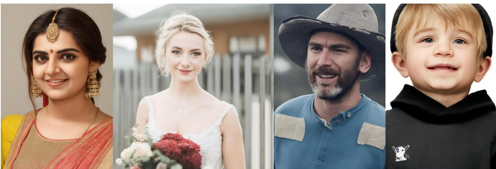
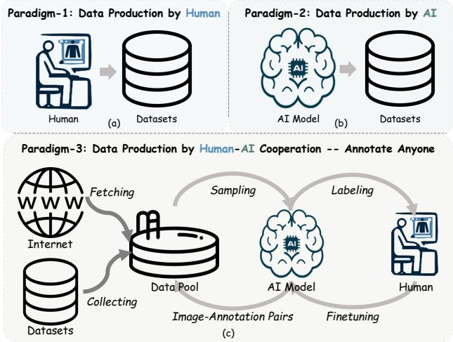
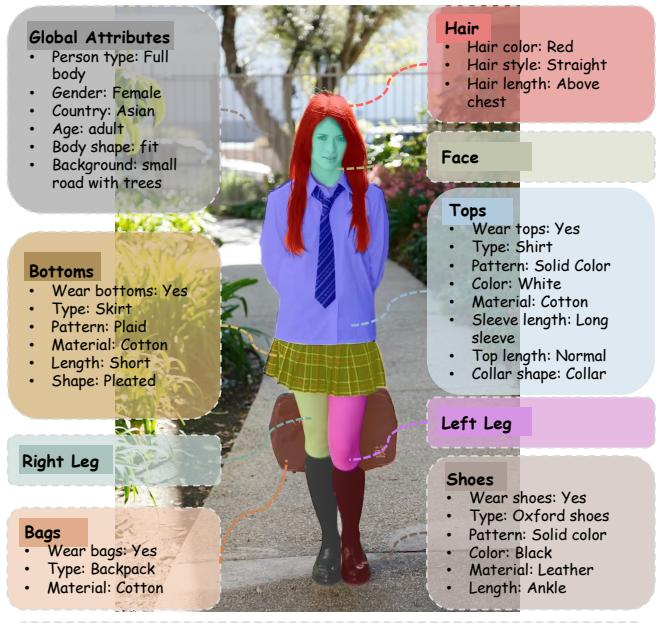
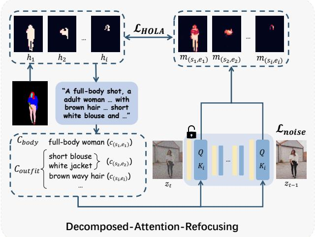

# CosmicMan: A Text-to-Image Foundation Model for Humans

Shikai Li∗, Jianglin Fu∗, Kaiyuan Liu∗, Wentao Wang∗, Kwan-Yee Lin†, Wayne Wu† Shanghai AI Laboratory

{lishikai, fujianglin, wangwentao}@pjlab.org.cn 1154864382@mail.dlut.edu.cn linjunyi9335@gmail.com wuwenyan0503@gmail.com

Text Descriptions: A close up portrait shot, an adult Indian female, fit, a beige wall, above chest brown bun hair, short sleeve saree

Text Descriptions:   
A portrait shot, an adult Caucasian female, fit,   
a wooden fence and a building, mesh belt,   
sleeveless mesh solid color wedding dress,   
blonde bun above chin hair   
Text Descriptions:   
A close up portrait shot, a   
adult Caucasian male, fit,   
natural landscape, short sleeve   
normal cotton blue t-shirt,   
wavy blonde above eyes hair,   
woven hat

Text Descriptions: A headshot, a Caucasian child male, fit, a white wall, norma long sleeve cotton black graphic solid color sweatshirt, blonde above eyes straight hair

Figure 1. CosmicMan. High-fidelity images generated by our proposed human-specialized text-to-image foundation model CosmicMan.   
The results are with meticulous appearance, reasonable structure, and precise text-image alignment with detailed dense descriptions.

## Abstract

We present CosmicMan, a text-to-image foundation model specialized for generating high-fidelity human images. Unlike current general-purpose foundation models that are stuck in the dilemma of inferior quality and text-image misalignment for humans, CosmicMan enables generating photo-realistic human images with meticulous appearance, reasonable structure, and precise text-image alignment with detailed dense descriptions.

At the heart of CosmicMan’s success are the new reflections and perspectives on data and models: (1) We found that data quality and a scalable data productionflow are essential for the final results from trained models. Hence, we propose a new data production paradigm, Annotate Anyone, which serves as a perpetual data flywheel to produce high-quality data with accurate yet cost-effective annota-

tions over time. Based on this, we constructed a large-scale dataset, CosmicMan-HQ 1.0, with 6 Million high-quality real-world human images in a mean resolution of 1488 × 1255, and attached with precise text annotations deriving from 115 Million attributes in diverse granularities. (2) We argue that a text-to-imagefoundation model specializedfor humans must be pragmatic – easy to integrate into downstreaming tasks while effective in producing high-quality human images. Hence, we propose to model the relationship between dense text descriptions and image pixels in a decomposed manner, andpresent Decomposed-Attention-Refocusing (Daring) training framework. It seamlessly decomposes the cross-attention features in existing text-toimage diffusion model, and enforces attention refocusing without adding extra modules. Through Daring, we show that explicitly discretizing continuous text space into several basic groups that align with human body structure is the key to tackling the misalignment problem in a breeze. Project page:https://cosmicman-cvpr2024.github.io/.

## 1. Introduction

Text-to-image foundation models, e.g., Stable Diffusion (SD) [43], Imagen [45], and DALLE [40], have made groundbreaking contributions in the realm of Computer Vision and Graphics. These models, fueled by expansive image-text datasets [3, 47] and advanced generative algorithms [11, 20, 51], possess the capability to create images of remarkable quality and details. These models, underpinned by robust prior knowledge, have significantly enhanced a wide array of downstream tasks. Notable examples include DreamBooth [44] and ControlNet [57] in 2D image generation, alongside DreamFusion [38] and Zero-1-to-3 [29] in 3D object creation. Despite these advances, a critical gap remains within the sphere of human-centric content generation – the absence of a specialized text-toimage foundation model that serves as a cornerstone for tasks on human subjects.

In prior research, tasks related to human-centric content generation, like 2D human generation/editing [14, 22, 27] and 3D human generation/reconstruction [16, 46, 55, 56], have typically progressed in isolation, each relying on its in-domain data. These methods, however, faced a key limitation: the datasets used were often narrow in diversity [6], exhibited biased distributions [14], or lacked quality [24]. Achieving generalization across a broad range of identities, appearances, and geometries in real-world applications has been challenging within this framework. Nevertheless, the emergence of text-to-image foundation models, which have excelled in the general-purpose arena, offers a promising new direction to revolutionize human-centric content generation with enhanced generalization capabilities.

The pivotal question then arises: How to obtain a textto-image foundation model for humans? By analyzing the essential demands of a human-specialized foundation model, we identify three critical elements necessary for such a model: 1) High-Quality Data. To train a foundation model that will be used in downstream tasks to generate high-quality content, the raw data quality is critical. The raw data quality encompasses not only the volume but also the image quality and diversity, as well as the precision, granularity, and comprehensiveness of annotations. While large-scale datasets featuring text-image pairs (e.g., LAION-5B [47], and COYO-700M [3]) have advanced general-purpose foundation models, they often deviate from accurately representing real-world human distributions, suffering from jagged image quality and a mass of annotation noise. 2) Scalable Data Production. A foundation model that generalizes effectively must evolve in sync with the growth of real-world data. Given the vast amount of training data that is requisite and the rapid pace at which it expands in human contexts, developing a scalable data production process is imperative – being updated over time and cost-effective. Traditional methods often incur high costs due to manual annotation [2, 28, 36, 49], or suffer from accuracy issues when using automated labeling [48]. Moreover, the reliance on static datasets limits their ability to adjust according to dynamic real-world data distributions. 3) Pragmatic Model. A foundation model designed for humans should be straightforward to integrate into downstream tasks, requiring minimal customization of its architecture. In addition, given the complexity of human anatomy, the ability of a model to generate high-quality outputs is also essential – the outputs should guarantee realistic structures and precise text-image alignment, especially capturing detailed dense concepts attached to humans. Existing models, whether closed-source like MidJourney [31], DALLE [40], or those struggling with high-fidelity human generation such as SD [43] and SDXL [37], highlight the need for a versatile, high-quality model tailored for humancentric applications.

We present CosmicMan – a holistic solution of text-toimage foundation model for humans. We first introduce a new data production paradigm Annotate Anyone by human-AI cooperation, which can produce flowing, high-quality yet cost-effective data continuously. Annotate Anyone consists of two main stages: Flowing Data Sourcing to get a flowing data pool with irrigated high-quality human images from academic datasets and Internet, and Human-inthe-loop Data Annotation to iteratively refine the labeling quality of the data in the pool at a fairly low cost. Then, a data flywheel is constructed to produce vast amounts of data in a dynamic, up-to-date, and economical manner, which is well-adaptive in the age of large-scale foundation models.

By running Annotate Anyone, we constructed a largescale, high-quality dataset, CosmicMan-HQ 1.0, which currently included 6 million human images with a mean resolution of 1488 × 1255. It includes rich annotations with high precision – 115 million attributes, texts, bounding boxes, keypoints, human parsings, and rich meta information. Empowered by Annotate Anyone, CosmicMan-HQ continues to grow rapidly. Future versions of CosmicMan-HQ will support the perpetual update of foundation models with growing real-world data, facilitating long-term research in human-centric generation.

Finally, based on CosmicMan-HQ, we provide a humanspecialized foundation model to support the human-centric content generation tasks. To ensure the easy of use of the proposed model, we construct our model by tailoring SD with minimum modification. Concretely, we introduce Decomposed-Attention-Refocusing (Daring), a training framework that is rooted in SD without adding extra modules. In virtue of the nature of the proposed dataset, the key insight of the framework is explicitly discretizing dense descriptions into a fixed number of groups related to human body structure. Based on this, we could decompose the cross-attention feature maps according to the groups and enforce the network learning attention refocusing at the group level. This target could be achieved by adding a new loss supervised on cross-attention maps, called HOLA (short for Human Body and Outfit Guided Loss for Alignment).

In experiments, we demonstrate superior image quality and text-image alignment by comparing our models to stateof-the-art foundation models. Then, we conduct extensive ablation studies to show the effectiveness of our designs in data production and model training. Finally, we show the pragmaticality and potential of our human-specialized foundation model with applications in 2D and 3D generation.

## 2. Related Work

## 2.1. Text-to-Image Foundation Models

Advancements in data volume and model design have led text-to-image foundation models to produce high-fidelity images that follow the text instructions. DALLE [40], which pioneered zero-shot text-to-image generation, autoregressively modeling text and image tokens in a unified data stream. Its successors [1, 41] enhance performance through model design and improved captions. Imagen [45] utilizes a larger text encoder with better photo realism. Open-source models like DeepFloyd-IF [9], PixelArtα [5], and particularly SD [43], along with SDXL [37], have energized the community, accelerating various applications in downstream tasks. In 2D content generation, innovations like ControlNet [57] and T2I-Adapter [33] have emerged, and in 3D, models like Zero-1-to-3 [29] and DreamFusion [38] leverage SD to create high-quality 3D objects. However, these foundation models are geared towards the general-purpose domain, which falls short in generating humans due to their tendency to overlook the nuances and complexities of human anatomy and attire. There is still a gap for a human-specialized text-to-image foundation model to boost downstream human content generation.

## 2.2. Text-Driven Human Image Generation

Previous research [22, 27, 32, 34] primarily focused on fashion-domain data and has achieved high-fidelity human generation and editing with control over text. For instance, Text2Human [22] employs a two-stage framework using VQ-VAE [51] to transfer human pose into human parsing with cloth shape and generates human images with texture description. However, the insufficient training data hinders the diversity of generated images from these methods. Meanwhile, some approaches [24, 57] leverage textto-image foundation models [43] to create diverse human images with additional conditions (e.g., skeletons and normal maps). HumanSD [24] introduces a skeleton-guided diffusion model that enhances the accuracy of pose control. In contrast, CosmicMan stands out as a foundation model by producing high-quality and diverse human images without relying on spatial conditions in the inference phase.

## 2.3. Text-Image Alignment for Dense Concepts

Early text-to-image models, often trained on short text captions, struggle to encapsulate dense concepts present in longer descriptions. The dense concepts, as discussed in many text-to-image benchmarks [15, 21], include multiple objects, attributes, and spatial relationships that describe the image from different granularities and perspectives. The challenge lies in generating each element and accurately depicting their interrelations within long descriptions. Recently, the training-free methods [4, 12, 17, 26, 42, 52, 58] found that the cross-attention mechanism plays a pivotal role in text-to-image alignment. Prompt-to-Prompt [17] first reveals that the cross-attention map governs the semantics of the output. Subsequent methods [4, 26, 52, 58] are proposed to employ the gradients of the well-designed loss to update the latent feature along the diffusion process. Additionally, FastComposer [54] applies the supervision of cross-attention maps during training. However, intuitively applying this to human images becomes more complex, as dense captions for humans often cluster in a small image region, as shown in Fig. 3. Thus, we propose a training framework that utilizes human-specific prior on arrangement relationships to supervise the cross-attention maps with decomposed text-human image data, which further improves the text-image alignment on dense concepts.

## 3. Annotate Anyone – A Data Flywheel

To enable the learning of the human-specialized foundation model, we propose a human-AI cooperation paradigm for data production named Annotate Anyone. It combines the strengths of AI and human expertise to build a continuously expandable dataset CosmicMan-HQ with rich annotations.

## 3.1. Data Production by Human-AI Cooperation

To construct large-scale image datasets with labels, there are mainly two paradigms – by humans or by AI. Data production by humans (as depicted in Fig. 2 (a)) needs human annotators to manually label images one by one [10, 28, 59], which suffers from its high cost and thus is hard to scale up to support the recent development of large foundation models. On the other hand, data production by AI (as depicted in Fig. 2 (b)) uses off-the-shelf models to get labels for free [1, 5]. Although this paradigm dramatically reduces costs and is easy to scale up, it is notorious for its noisy, jagged, and coarse labeling results. Moreover, both of these paradigms rely on fixed datasets for labeling, which results in limited diversity and severe bias versus real-world data. To train a large foundation model, a huge quantity of data, high-precise and fine-grained labeling, and real-world distribution are all indispensable. Thus, these paradigms are especially knotty to adapt to the human domain.

  
Figure 2. Data Production Paradigm. (a) Data production by humans and (b) data production by AI. (c) Our proposed new data production paradigm by Human-AI cooperation, named Annotate Anyone. It serves as a data flywheel to produce dynamic up-todate high-quality data at a low cost.

To this end, we propose a new data production paradigm by human-AI cooperation named Annotate Anyone (as shown in Fig. 2 (c)). Compared to data production by humans and AI, Annotate Anyone pivots on two characteristics: 1) flowing data, and 2) human-in-the-loop annotation. Flowing data is sourced from two origins: existing published datasets and the Internet. By collecting data from existing published datasets, such as SHHQ [14] and LAION-5B [47], we can upcycle them to match the qualifications of a high-quality human dataset. By fetching data from the Internet, we can obtain the massive data produced by human beings every second. Our data sourcing system is always on call to run when the data quantity triggers the lower-bound threshold. Thus, our data pool is continuously flowing and refreshed, which distinguishes it from previous paradigms. Human-in-the-loop annotation coordinates three entities: data pool, AI, and human annotators, to work in a circle. By labeling a small quantity of data with the greatest necessity, human annotators and AI models cooperate to iteratively improve the quality of data annotation. Consequently, data in the pool will have progressively better annotation quality at a minimal cost. With Annotate Anyone, we construct a data flywheel to enable a dynamic upto-date production of high-quality data.

## 3.2. Procedure of Annotate Anyone

## 3.2.1 Flowing Data Sourcing

We first source images from various origins to ensure massive quantity and catch the real-world distribution. Then, we design a data filter to eliminate unbefitting images for human content generation tasks.

Data Origins. We start with three academic datasets to recycle existing data resources: LAION-5B [47], SHHQ [14], and DeepFashion [30]. LAION-5B is a renowned collection of massive images shared online, while the other two datasets are smaller in scale and diversity but meticulously curated to ensure high quality. Then, we initiate 128 parallel processes in 32 CPU servers, monitoring a wide spectrum of APIs on the Internet, including Flickr [13], Unsplash [50], Pixabay [35], etc. These APIs give access to a vast collection of growing and diverse images, rendering a real-world distribution.

Data Filtering. The current data pool exhibits a broad distribution, but high-resolution human images are not the primary constituent. We use a set of data filtering strategies to distill a high-quality human-centric subset, including fake-people detection, image quality assessment, and so on. More details can be found in the supplementary material.

## 3.2.2 Human-in-the-loop Data Annotation

Having a data pool with diverse and high-quality human images, the next step is to possess precise, fine-grained yet cost-effective annotations for the images. We propose a human-in-the-loop data annotation workflow to iteratively refine the labeling quality of the data in the pool.

Annotation Iteration. As shown in Fig. 2 (c), the iterations start from sampling an image set $I _ { i }$ from the data pool and end up with putting all image-annotation pairs $( I , A )$ back to the data pool. We set an evaluation set $I _ { e }$ with ground truth. In each iteration, $I _ { e }$ is used to determine the categories that need to be labeled by human annotators, and $I _ { i }$ will be partially labeled with the selected categories. Then, $I _ { i }$ is used to finetune the AI model. The finetuned AI model is evaluated on $I _ { e }$ to determine whether to continue or stop the iterations. Finally, a well-finetuned AI model is used to get image-annotation pair $( I , A )$ for all data in the pool. Specifically, inspired by methods [1, 5] that use the Vision-Language Model (VLM) to perform image captioning tasks, we leverage a pretrained InstructBLIP [8] as our AI model in the iteration. Please refer to the supplementary for the pseudo-code of the annotation iteration.

The pivotal mechanism to implement the high-precise yet low-cost annotation is the trigger of human annotation. During the initial iteration, the annotation team labels all categories based on 70 questions. We observed that the accuracy of the predicted labels follows a real-world distribution, exhibiting a long-tail distribution. For the head categories, such as age and gender, the pretrained AI model already proficients in the prediction. Thus, in subsequent iterations, human annotators focus on tail categories, and categories with an accuracy above 85% will no longer be manually labeled. Our iterative process significantly im-

Table 1. Dataset Comparison. The statistical comparison between publicly available human-related datasets and CosmicMan-HQ 1.0. “Common Scale” refers to the dataset that includes images captured at common scales, such as full-body shots, portrait photos, and half-body shots. “HP” and “Aes” refer to Human Parsing maps and Aesthetic scores.
<table><tr><td rowspan="2"></td><td colspan="3">Data Quantity</td><td colspan="2">Imaging Quality</td><td colspan="7">Annotation</td><td rowspan="2">Domain</td></tr><tr><td>Total Image #</td><td>Mean Resolution</td><td>Common Scale</td><td>Global↑</td><td>Face↑</td><td>Cat #</td><td>Attr #</td><td>Text</td><td>Bbox</td><td>Kpts</td><td>HP</td><td>Aes</td></tr><tr><td>Human-Art [23]</td><td>50K</td><td>1115 × 1287</td><td>√</td><td>3.42</td><td>2.87</td><td></td><td>=</td><td>V</td><td>√</td><td>√</td><td>X</td><td>X</td><td>Real world &amp; AI</td></tr><tr><td>DF-MM [22]</td><td>44K</td><td>750 × 1101</td><td>x</td><td>4.64</td><td>3.38</td><td>18</td><td>587K</td><td>V</td><td>√</td><td>X</td><td>√</td><td>x</td><td>Fashion</td></tr><tr><td>LAION-Human [24]</td><td>1M</td><td>688 × 650</td><td>V</td><td>4.20</td><td>2.66</td><td>=</td><td></td><td>√</td><td>X</td><td>X</td><td>X</td><td>√</td><td>Real world</td></tr><tr><td>SHHQ 1.0 [14]</td><td>40K</td><td>1024 × 512</td><td>x</td><td>4.23</td><td>2.13</td><td>=</td><td></td><td>X</td><td>X</td><td>V</td><td>√</td><td>x</td><td>Fashion</td></tr><tr><td>CosmicMan-HQ 1.0</td><td>6M</td><td>1488 × 1255</td><td>√</td><td>4.37</td><td>3.37</td><td>70</td><td>115M</td><td>√</td><td>√</td><td>√</td><td>√</td><td>√</td><td>Real world</td></tr></table>

  
A full-body shot, an Asian adult female, fit, small road with trees, straight red above-chest hair, normal-length, white and long sleeve cotton shirt, short plaid skirt in pleated shape, cotton backpack, socks, black leather oxford shoes.

Figure 3. Parsing Examples from CosmicMan-HQ. The parsing results of sampled image in our dataset, along with detailed labels for each part. Text descriptions are obtained from labels.

proved the VLM model’s overall accuracy by at least 30% compared to the pretrained model. Moreover, the progressive reduction of labeled annotations during the iterations resulted in only 1% compared to full manual labeling.

Label Protocol. We devised a label protocol using the SCHP [25] human parsing model, dividing each image into 18 fine parts such as background, face, and clothing (as shown in Fig. 3). Each part corresponds to 3 to 8 questions, totaling 70 categories like “top-sleeve length”. This hierarchical approach ensures comprehensive labeling, covering global attributes and spatial positions.

## 3.3. CosmicMan-HQ 1.0 Dataset

By running Annotate Anyone, so far, the first version of the produced dataset CosmicMan-HQ 1.0 consists of 6M highresolution, single-person images, along with corresponding rich annotations. Here we compare our dataset with representative human-centric datasets in terms of data quantity, imaging quality, and annotations.

As depicted in Tab. 1, our dataset is the largest crafted human-centric dataset, six times larger than LAION-Human [24]. The mean resolution is 1488 × 1255, surpassing previous human-only datasets like DF-MM [22] and SHHQ [14] by a large margin. Our dataset possesses a diverse collection of human images, including full-body shots, headshots, half-body shots, and so on. In terms of image quality at both overall and face level, our dataset ranks second only to the fashion-focused DF-MM dataset, which predominantly contains professional studio images but with less diversity and a data amount. As for annotation, only DF-MM and ours provide manually labeled categories, but the former dataset is much smaller in data volume and category numbers. CosmicMan-HQ 1.0 provides 70 categories and around 115M detailed attributes.

Highlighting our dataset’s uniqueness, CosmicMan-HQ 1.0 distinguishes itself by providing an unparalleled wealth of diverse annotations, including 115M attributes, texts, bounding boxes, keypoints, human parsings, and rich meta information (web alternative texts, aesthetic scores, watermark scores, face/global quality scores, and camera EXIF parameters).

## 4. Daring - The Training Framework

We propose Daring (Decomposed-Attention-Refocusing), a training framework rooted in original Stable Diffusion (SD) with minimal modification. The framework is illustrated in Fig. 4. It enjoys three properties at the same time – friendly to computational costs, compatible with downstream tasks supported by SD, and robust in producing high-quality human images that align well with dense concepts. These come from two parts’ design – data discretion for decomposing text-human image data (Sec. 4.2), and a new loss aiming to improve the alignment with respect to the scale of the human body and outfits (Sec. 4.3).

## 4.1. Preliminaries

We employ SD as the backbone model for its efficiency and widespread application in various downstream tasks. SD incorporates a variational autoencoder E to encode images x as latent variables z in a compact latent space, and applies diffusion schema in the latent space, thereby facilitating the diffusion process and reducing the computational cost. The denoising network is optimized by minimizing the $L _ { 2 }$ error between predicted noise $\epsilon _ { \theta }$ and ground-truth noise $\epsilon \sim \mathcal { N } ( \mathbf { 0 } , \mathbf { I } )$

$$
\mathcal { L } _ { n o i s e } = \mathbb { E } _ { z \sim \mathcal { E } ( \boldsymbol { x } ) , c , \epsilon , t } \left[ | | \epsilon - \epsilon _ { \theta } ( z _ { t } , t , c ) | | _ { 2 } ^ { 2 } \right] ,\tag{1}
$$

where $z _ { t }$ is the latent at time-step t, and c is the condition information that can be instantiated by text input.

The cross-attention layers are the hinge for textual information to play a role in influencing the updating of intermediate features. Specifically, a text prompt $\mathcal { P }$ is first transformed into a text embedding c via a CLIP text encoder. The latent $z _ { t }$ and text embedding are projected to form a query $Q$ and keys K. The cross-attention maps are computed to flatten textual information into spatial features:

$$
M = \operatorname { S o f t m a x } ( \frac { Q K ^ { T } } { \sqrt { d } } )\tag{2}
$$

where d is the dimension of Q and K embeddings. The design works well when the text descriptions are short sparse captions. However, it can not handle text information with dense concepts, due to the lack of effective guidance to learn distinctive and precisely located features.

## 4.2. Data Discretization for Humans

We argue that there is no necessity to optimize the latent code guided by cross-attention maps during inference or harm the original architecture design of SD with sophisticated modules, as long as keys K are decomposable andfinite at the first place. This is doable and simple to achieve. Because for the human generation scenario, textual descriptions about a person always revolve around body structure and attachments. As humans are structured in nature, textual descriptions could be explicitly classified into fixed groups that correspond to body regions, no matter how many concepts are described.

Thus, rather than directly utilizing nature language description, we propose a discretized textual prototype as illustrated in Fig. 4 for the network to enable precise communication between tokens. The prototype defines the convention of classifying and arranging the concepts of text captions to a finite set, where all captions can be represented as $C = \{ C _ { b o d y } , C _ { o u t f i t } \}$ . The subset $C _ { b o d y }$ is for overall appearance, and the subset $C _ { o u t f i t }$ is for fine-grained attributes of outfits.

  
Figure 4. Daring Training Framework. It includes two parts: (1) data discretion for decomposing text-human data into fixed groups that obey human structure; (2) a new loss – HOLA, to enforce the cross-attention features actively response in proper spatial region with respect to the scale of body structure and outfit arrangement.

Concretely, as shown in Fig. 4, given a human data sample x in CosmicMan-HQ, we first reorganize human parsing maps into the semantic map sets $\bar { H ^ { } } = \{ h _ { i } \} _ { i = 1 } ^ { N }$ , where $N$ is the number of semantic masks and $h _ { 1 }$ is the aggregation of all human parsing maps to differentiate human foreground with background. These masks are categorized into two levels $- h _ { 1 }$ lies in human-body-level and the others belong to outfit-level. Then, we split the text captions with respect to H. Specifically, $C _ { b o d y } ~ = ~ c _ { ( s _ { 1 } , e _ { 1 } ) }$ and $C _ { o u t f i t } = \{ c _ { ( s _ { 2 } , e _ { 2 } ) } , \ldots , c _ { ( s _ { N } , e _ { N } ) } , c _ { o t h e r } \} . \ c _ { ( s _ { n } , e _ { n } ) }$ denotes the $n ^ { t h }$ sub-caption group related to the semantic map $h _ { n }$ and $s _ { n } , e _ { n }$ are the start and end indices of the concepts in the caption respectively. We gather the caption phrases without corresponding semantic masks as $c _ { o t h e r }$ , such as the caption for background. Note that, as our dataset naturally constructs annotation labels in a hierarchical manner, we can easily associate textual concepts with the semantic maps. For example, given a semantic map $h _ { 2 }$ that represents the top clothing mask, we retrieve all the labels related to the top clothing and group them as a sub-caption c2.

## 4.3. Decomposing and Refocusing Features

During training diffusion models, the denoising loss $\mathcal { L } _ { n o i s e }$ can ensure the content generative capability of the model, but it lacks explicit alignment constraints between the caption and image pixels, especially when encountering descriptions with dense concepts that cover very high information density. Thus, on the shoulders of discrete human data mentioned in Sec. 4.2, we propose a new loss – HOLA (short for Human Body and Outfit Guided Loss for Alignment) to seamlessly decompose the cross-attention features in SD model and enforce attention refocusing without adding extra modules.

Table 2. Quantitative Comparison to SOTA Text-to-Image Models. The best and second-best results are marked with Red and Green.
<table><tr><td>Methods</td><td>FID↓</td><td> $\mathbf { H P S v 2 } \uparrow$ </td><td>CLIP↑</td><td> $\mathbf { A c c _ { o b j } } \uparrow$ </td><td> $\mathbf { A c c _ { t e x } } \uparrow$ </td><td> $\mathbf { A c c _ { s h a p e } } \uparrow$ </td><td> $\mathbf { A c c _ { a l l } } \uparrow$ </td></tr><tr><td>SD 1.5 [43]</td><td>48.09</td><td>0.2659</td><td>30.43</td><td>87.3</td><td>77.4</td><td>59.3</td><td>74.6</td></tr><tr><td>SD 2.0 [43]</td><td>51.61</td><td>0.2588</td><td>26.27</td><td>82.8</td><td>74.7</td><td>58.7</td><td>72.0</td></tr><tr><td>SDXL [37]</td><td>48.61</td><td>0.2647</td><td>30.78</td><td>88.5</td><td>82.5</td><td>63.2</td><td>78.1</td></tr><tr><td>DeepFloyd-IF [9]</td><td>44.62</td><td>0.2603</td><td>29.33</td><td>87.9</td><td>84.4</td><td>62.0</td><td>78.1</td></tr><tr><td>DALLE2 [41]</td><td>49.60</td><td>0.2630</td><td>29.86</td><td>83.3</td><td>79.3</td><td>55.3</td><td>72.6</td></tr><tr><td>DALLE3 [1]</td><td>66.36</td><td>0.2673</td><td>28.86</td><td>86.2</td><td>87.1</td><td>60.1</td><td>77.8</td></tr><tr><td>MidJourney [31]</td><td>53.89</td><td>0.2688</td><td>28.89</td><td>85.2</td><td>79.5</td><td>59.4</td><td>74.7</td></tr><tr><td>CosmicMan-SD</td><td>36.78</td><td>0.2690</td><td>28.47</td><td>91.7</td><td>85.7</td><td>66.1</td><td>81.2</td></tr><tr><td>CosmicMan-SDXL</td><td>35.42</td><td>0.2698</td><td>27.31</td><td>92.7</td><td>88.3</td><td>69.7</td><td>83.6</td></tr></table>

Concretely, given the caption $C$ and latent $z _ { t } ,$ the cross-attention maps M can be decomposed as $\begin{array} { r l } { M } & { { } = } \end{array}$ $( m _ { ( s _ { 1 } , e _ { 1 } ) } , m _ { ( s _ { 2 } , e _ { 2 } ) } , \ldots , m _ { ( s _ { N } , e _ { N } ) } , m _ { o t h e r } )$ Each $M _ { i }$ is calculated through Eq. 2, with turning K to $K _ { i }$ (the projected embeddings of sub-caption $c _ { ( s _ { i } , e _ { i } ) } )$ . We then incorporate HOLA alongside the original loss in SD to explicitly guide the cross-attention maps to have high responses only in specific regions. The HOLA is defined as follows:

$$
{ \mathcal { L } } _ { \mathrm { H O L A } } = { \frac { 1 } { N } } \sum _ { i = 1 } ^ { N } ( \sum _ { j = s _ { i } } ^ { e _ { i } } \| m _ { j } - h _ { i } \| _ { 2 } ^ { 2 } + \left\| { \frac { 1 } { e _ { i } - s _ { i } } } \sum _ { j = s _ { i } } ^ { e _ { i } } ( m _ { j } ) - h _ { i } \right\| _ { 2 } ^ { 2 } )\tag{3}
$$

Specifically, the first term of HOLA works under the guidance of human body structure – it pushes the high response region of each concept feature to be as close as possible to the corresponding semantic region. However, since certain outfit-related concepts may only occupy a specific proportion within a semantic region, it is unnecessary to enforce their features to align with the whole semantic region. Also, concepts within the same group should be arranged harmoniously. Thus, we use the second term of HOLA to satisfy the situation. This term requires the average attention maps within one group to be close to their semantic map. It helps reduce ambiguities in outfit-level descriptions. The overall loss function is as follows:

$$
\mathcal { L } = \alpha \mathcal { L } _ { n o i s e } + \beta \mathcal { L } _ { \mathrm { H O L A } }\tag{4}
$$

where $\alpha$ and $\beta$ are hyper-parameters to balance the contribution of each loss.

## 5. Experiments

## 5.1. Evaluation Metrics

We evaluate results from three perspectives: 1) Image Quality: Frechet Inception Distance (FID) [19] and Human Preference Score v2 (HPSv2) [53] are used to reflect diversity and authenticity. 2) Text-Image Alignment: CLIP-Score [18] provides a holistic measure of image-text alignment. However, it struggles to capture detailed image-text relationships, especially in fine-grained texture, shape, and object descriptions [7, 15, 21]. Our proposed semantic accuracy metric, inspired by DSG [7], enhances fine-grained text-image alignment, focusing on object $( \mathrm { A c c _ { o b j } } )$ , texture $( \mathrm { A c c } _ { \mathrm { t e x } } )$ , shape $( \mathrm { A c c } _ { \mathrm { s h a p e } } )$ , and overall $\left( \mathrm { A c c _ { a l l } } \right)$ , making it suitable for human-centric evaluation. 3) Human Preference: we conduct a user study to evaluate the image quality and text-image alignment of each method.

## 5.2. Comparison to Text-to-Image Models

We compared our foundation model with various state-ofthe-art text-to-image models, including open-source models like Stable Diffusion (SD-1.5/2.0), SDXL, DeepFloyd-IF, and commercial models such as DALLE2/3 and MidJourney. For a thorough comparison, we evaluated two versions of our foundation model: CosmicMan-SD based on SD-1.5 and CosmicMan-SXDL based on SDXL.

Quantitative Evaluation. We prepared a test set comprising 2048 human images with fine-grained manually annotated prompts for fine-grained text-image generation. We report the quantitative comparison in Tab. 2. CosmicMan-SDXL excels in both image quality (FID) and fine-grained text-image alignment $\left( \mathrm { A c c _ { a l l } } \right)$ . In terms of image generation quality, CosmicMan-SD/SDXL outperforms the corresponding SD-1.5/SDXL by a large margin, showing up to 23.52% and 27.13% relative improvements in FID. As for fine-grained text-image alignment, compared to DALLE-3, CosmicMan-SDXL shows significant improvements in object (7.54%), texture (1.38%), shape (15.97%), and overall alignment (7.46%). Note that CosmicMan-SD/SDXL obtains a relatively low CLIPScore, as our emphasis was on evaluating fine-grained text-image alignment. In contrast, CLIPScore lacks the ability for fine-grained evaluation, consistent with the conclusions in the DSG [7] and GenEval [15]. CosmicMan-SD/SDXL achieves the best performance in $\operatorname { A c c } _ { \mathrm { a l l } }$ and human preference evaluation, indicating its superiority in 2D human image generation.

Human Preference Evaluation. We compared our results with DeepFloyd-IF, SDXL, DALLE3, and MidJourney through pairwise comparisons. The evaluation considered both image quality and text-image alignment, using 100 randomly selected prompts to generate corresponding images for each method. The evaluation shows 93.06%, 82.93%, 78.13%, and 70.43% in terms of image quality, and 85.38%, 90.25%, 88.56%, and 81.68% in terms of text-image alignment, preferring our results over those of DeepFloyd-IF, SDXL, DALLE3, and MidJourney. Qualitative results in the supplementary material further highlight our model’s superiority in image quality, fine-grained details, and text-image alignment.

Table 3. Ablation on Training Data. “AltText” refers to Web Alternative Text, $^ { \mathrm { \tiny {  } } } \mathrm { { I B } } _ { \mathrm { p r e } } ^ { \mathrm { { \tiny \begin{array} { \mathrm { \tiny  } } \end{array} } } }$ denotes the image descriptions generated by the pretrained InstructBLIP model, and “Ours” corresponds to captions produced by Annotate Anyone (“AA”).
<table><tr><td>Dataset</td><td>Num</td><td>Text</td><td>FID↓</td><td> $\mathbf { A c c _ { a l l } }$  个</td></tr><tr><td>LAION-5B</td><td>5B</td><td>AltText</td><td>48.09</td><td>74.6</td></tr><tr><td>HumanSD</td><td>1M</td><td>AltText</td><td>49.01</td><td>75.0</td></tr><tr><td>Ours-1</td><td>1M</td><td>AltText</td><td>47.65</td><td>75.2</td></tr><tr><td>Ours-2</td><td>1M</td><td> $\mathrm { I B } _ { \mathrm { p r e } }$ </td><td>51.02</td><td>75.6</td></tr><tr><td>Ours-3</td><td>1M</td><td>AA</td><td>40.08</td><td>78.8</td></tr><tr><td>Ours</td><td>6M</td><td>AA</td><td>37.57</td><td>79.7</td></tr></table>

## 5.3. Ablation Study

Ablation on Training Data. To show the validity of our proposed CosmicMan-HQ dataset, Tab. 3 reports the evaluation from three aspects: data source, data scale and annotation quality. 1) Data Source. Compared with two cuttingedge datasets, LAION-5B and HumanSD, Ours surpasses them by over 11.44 and 10.52 in FID, and 5.1 and 4.7 in $\mathrm { A c c } _ { \mathrm { a l l } }$ , respectively. LAION-5B has large noise in both data and annotation, while HumanSD has fewer data quantities and coarse annotations. Owing to the scalable ability of our data production workflow, Annotate Anyone, the constructed CosmicMan-HQ dataset features a large quantity of high-quality annotations, which benefits the final results. 2) Data Scaling. Ours, trained with 6M images, brings a promotion of 2.51 in FID and 0.9 $\mathrm { A c c } _ { \mathrm { a l l } }$ compared to 1M version Ours-3, proving the effectiveness of data scaling. Thus, Annotate Anyone’s capacity to run constantly to produce data is necessary to push the boundaries of foundation models’ performance. 3) Annotation Quality. We make a comparison under three different caption settings. Ours-3 with AA caption exhibits a significant improvement of 7.57 and 10.94 in FID, as well as 3.6 and 3.2 in $\mathrm { A c c } _ { \mathrm { a l l } }$ compared to Ours-1 and $O u r s { - 2 }$ . This verifies the effectiveness of improving the annotation quality of our proposed human-inthe-loop annotation mechanism in Annotate Anyone.

Ablation on Training Strategy. Tab. 4 shows the ablation of the training dataset and model design used in CosmicMan. By leveraging our CosmicMan-HQ dataset, finetuning the model gains a promotion of 10.52 in FID and 6.3 in $\operatorname { A c c } _ { \mathrm { a l l } }$ . Our proposed ${ \mathcal { L } } _ { \mathrm { H O L A } }$ further enhances FID and $\mathrm { A c c } _ { \mathrm { a l l } }$ by 0.79 and 1.5. Our novel perspectives on data and model design boost remarkable promotions of CosmicMan on fine-grained human generation.

Table 4. Ablation on Training Strategy. “Baseline” refers to the SD pretrained model. “CMHQ” stands for CosmicMan-HQ.
<table><tr><td>Methods</td><td>FID↓</td><td> $\mathbf { A c c _ { o b j } } \uparrow$ </td><td> $\mathbf { A c c _ { t e x } } \uparrow$ </td><td> $\mathbf { A c c _ { s h a p e } } \uparrow$ </td><td> $\mathbf { A c c _ { a l l } } \uparrow$ </td></tr><tr><td>Baseline</td><td>48.09</td><td>87.3</td><td>77.4</td><td>59.3</td><td>74.6</td></tr><tr><td>+ CMHQ</td><td>37.57</td><td>90.8</td><td>83.5</td><td>64.8</td><td>79.7</td></tr><tr><td> $+ \mathcal { L } _ { \mathrm { H O L A } }$ </td><td>36.78</td><td>91.7</td><td>85.7</td><td>66.1</td><td>81.2</td></tr></table>

Table 5. Quantitative Comparison on 2D Human Editing and 3D Human Reconstruction. User study reports the ratio of users who prefer our results to SD/SDXL.
<table><tr><td>2D Application</td><td>FID↓</td><td> $\mathbf { A c c _ { a l l } } \uparrow$ </td><td>User Study</td></tr><tr><td>T2I-Adapter + SDXL</td><td>47.73</td><td>76.6</td><td>18.33%</td></tr><tr><td>T2I-Adapter + CosmicMan-SDXL</td><td>37.62</td><td>82.9</td><td>81.67%</td></tr><tr><td>3D Application</td><td>CLIP-Sim↑</td><td>Accall ↑</td><td>User Study</td></tr><tr><td> $\mathrm { M a g i c } 1 2 3 + \mathrm { S D }$ </td><td>0.83</td><td>67.6</td><td>26.36%</td></tr><tr><td> $\mathbf { M a g i c 1 2 3 + C o s m i c M a n - S D }$ </td><td>0.88</td><td>70.8</td><td>73.64%</td></tr></table>

## 5.4. Applications

2D Human Editing. 2D human editing manipulates human images for specified poses. We compare our CosmicMan-SDXL with SDXL based on T2I-Adapter [33]. In Tab. 5, our model outperforms SDXL on both FID and $\operatorname { A c c } _ { \mathrm { a l l } } .$ showing its superiority in 2D human editing tasks.

3D Human Reconstruction. We validate the effectiveness of our CosmicMan-SD model based on Magic123 [39], one representative 3D object reconstruction method from a single image. We replace the SD pretrained model with our foundation model in Magic123 for comparison. The higher CLIP-similarity [39] and $\mathrm { A c c } _ { \mathrm { a l l } }$ in Tab. 5 exhibit the superior potential of our model on 3D human reconstruction.

## 6. Future Work

Not placing CosmicMan merely as a research paper, we also commit ourselves to providing a long-term and sustainable foundation platform to support the research in human-centric content generation. Thus, we will continuously 1) operate Annotate Anyone to produce subsequent versions of CosmicMan-HQ aligned dynamically with real-world data, and 2) provide up-to-date humanspecialized foundation models periodically trained on new versions of our data. By providing a well-constructed and long-term-maintained infrastructure, we hope to benefit broader research communities centered on human subjects.

## References

[1] Improving image generation with better captions. 2023. 3, 4, 7

[2] Harsh Agrawal, Karan Desai, Yufei Wang, Xinlei Chen, Rishabh Jain, Mark Johnson, Dhruv Batra, Devi Parikh, Stefan Lee, and Peter Anderson. nocaps: novel object captioning at scale. In Proceedings of the IEEE International Conference on Computer Vision, pages 8948–8957, 2019. 2

[3] Minwoo Byeon, Beomhee Park, Haecheon Kim, Sungjun Lee, Woonhyuk Baek, and Saehoon Kim. Coyo-700m: Image-text pair dataset. https : / / github . com / kakaobrain/coyo-dataset, 2022. 2

[4] Hila Chefer, Yuval Alaluf, Yael Vinker, Lior Wolf, and Daniel Cohen-Or. Attend-and-excite: Attention-based semantic guidance for text-to-image diffusion models. ACM Transactions on Graphics (TOG), 42(4):1–10, 2023. 3

[5] Junsong Chen, Jincheng Yu, Chongjian Ge, Lewei Yao, Enze Xie, Yue Wu, Zhongdao Wang, James Kwok, Ping Luo, Huchuan Lu, and Zhenguo Li. Pixart-α: Fast training of diffusion transformer for photorealistic text-to-image synthesis, 2023. 3, 4

[6] Wei Cheng, Ruixiang Chen, Siming Fan, Wanqi Yin, Keyu Chen, Zhongang Cai, Jingbo Wang, Yang Gao, Zhengming Yu, Zhengyu Lin, Daxuan Ren, Lei Yang, Ziwei Liu, Chen Change Loy, Chen Qian, Wayne Wu, Dahua Lin, Bo Dai, and Kwan-Yee Lin. Dna-rendering: A diverse neural actor repository for high-fidelity human-centric rendering. In Proceedings of the IEEE/CVF International Conference on Computer Vision (ICCV), pages 19982–19993, 2023. 2

[7] Jaemin Cho, Yushi Hu, Roopal Garg, Peter Anderson, Ranjay Krishna, Jason Baldridge, Mohit Bansal, Jordi Pont-Tuset, and Su Wang. Davidsonian scene graph: Improving reliability in fine-grained evaluation for text-image generation. arXiv preprint arXiv:2310.18235, 2023. 7

[8] Wenliang Dai, Junnan Li, Dongxu Li, Anthony Meng Huat Tiong, Junqi Zhao, Weisheng Wang, Boyang Li, Pascale Fung, and Steven Hoi. Instructblip: Towards generalpurpose vision-language models with instruction tuning, 2023. 4

[9] DeepFloyd. Deepfloyd-if, 2023. 3, 7

[10] Jia Deng, Wei Dong, Richard Socher, Li-Jia Li, Kai Li, and Li Fei-Fei. Imagenet: A large-scale hierarchical image database. In 2009 IEEE conference on computer vision and pattern recognition, pages 248–255. Ieee, 2009. 3

[11] Patrick Esser, Robin Rombach, and Bjorn Ommer. Taming¨ transformers for high-resolution image synthesis, 2020. 2

[12] Weixi Feng, Xuehai He, Tsu-Jui Fu, Varun Jampani, Arjun Reddy Akula, Pradyumna Narayana, Sugato Basu, Xin Eric Wang, and William Yang Wang. Trainingfree structured diffusion guidance for compositional text-toimage synthesis. In The Eleventh International Conference on Learning Representations, 2023. 3

[13] Flickr. Flickr application programming interface (api), 2023. Accessed: 2023-11-18. 4

[14] Jianglin Fu, Shikai Li, Yuming Jiang, Kwan-Yee Lin, Chen Qian, Chen Change Loy, Wayne Wu, and Ziwei Liu.

Stylegan-human: A data-centric odyssey of human generation. In European Conference on Computer Vision, pages 1–19. Springer, 2022. 2, 4, 5

[15] Dhruba Ghosh, Hanna Hajishirzi, and Ludwig Schmidt. Geneval: An object-focused framework for evaluating textto-image alignment. arXivpreprint arXiv:2310.11513, 2023. 3, 7

[16] Honglin He, Zhuoqian Yang, Shikai Li, Bo Dai, and Wayne Wu. Orthoplanes: A novel representation for better 3dawareness of gans. In Proceedings of the IEEE/CVF International Conference on Computer Vision (ICCV), pages 22996–23007, 2023. 2

[17] Amir Hertz, Ron Mokady, Jay Tenenbaum, Kfir Aberman, Yael Pritch, and Daniel Cohen-Or. Prompt-to-prompt image editing with cross attention control. arXiv preprint arXiv:2208.01626, 2022. 3

[18] Jack Hessel, Ari Holtzman, Maxwell Forbes, Ronan Le Bras, and Yejin Choi. Clipscore: A reference-free evaluation metric for image captioning. arXiv preprint arXiv:2104.08718, 2021. 7

[19] Martin Heusel, Hubert Ramsauer, Thomas Unterthiner, Bernhard Nessler, and Sepp Hochreiter. Gans trained by a two time-scale update rule converge to a local nash equilibrium. Advances in neural information processing systems, 30, 2017. 7

[20] Jonathan Ho, Ajay Jain, and Pieter Abbeel. Denoising diffusion probabilistic models. arXiv preprint arxiv:2006.11239, 2020. 2

[21] Kaiyi Huang, Kaiyue Sun, Enze Xie, Zhenguo Li, and Xihui Liu. T2i-compbench: A comprehensive benchmark for open-world compositional text-to-image generation. arXiv preprint arXiv:2307.06350, 2023. 3, 7

[22] Yuming Jiang, Shuai Yang, Haonan Qiu, Wayne Wu, Chen Change Loy, and Ziwei Liu. Text2human: Text-driven controllable human image generation. ACM Transactions on Graphics (TOG), 41(4):1–11, 2022. 2, 3, 5

[23] Xuan Ju, Ailing Zeng, Jianan Wang, Qiang Xu, and Lei Zhang. Human-art: A versatile human-centric dataset bridging natural and artificial scenes. In Proceedings of the IEEE/CVF Conference on Computer Vision and Pattern Recognition, pages 618–629, 2023. 5

[24] Xuan Ju, Ailing Zeng, Chenchen Zhao, Jianan Wang, Lei Zhang, and Qiang Xu. Humansd: A native skeleton-guided diffusion model for human image generation. arXiv preprint arXiv:2304.04269, 2023. 2, 3, 5

[25] Peike Li, Yunqiu Xu, Yunchao Wei, and Yi Yang. Selfcorrection for human parsing. IEEE Transactions on Pattern Analysis and Machine Intelligence, 44(6):3260–3271, 2020. 5

[26] Yumeng Li, Margret Keuper, Dan Zhang, and Anna Khoreva. Divide and bind your attention for improved generative semantic nursing, 2023. 3

[27] Anran Lin, Nanxuan Zhao, Shuliang Ning, Yuda Qiu, Baoyuan Wang, and Xiaoguang Han. Fashiontex: Controllable virtual try-on with text and texture. In ACM SIG-GRAPH 2023 Conference Proceedings, 2023. 2, 3

[28] Tsung-Yi Lin, Michael Maire, Serge Belongie, James Hays, Pietro Perona, Deva Ramanan, Piotr Dollar, and C. Lawrence´

Zitnick. Microsoft coco: Common objects in context. In ECCV 2014, 2014. 2, 3

[29] Ruoshi Liu, Rundi Wu, Basile Van Hoorick, Pavel Tokmakov, Sergey Zakharov, and Carl Vondrick. Zero-1-to-3: Zero-shot one image to 3d object. In Proceedings of the IEEE/CVF International Conference on Computer Vision, pages 9298–9309, 2023. 2, 3

[30] Ziwei Liu, Ping Luo, Shi Qiu, Xiaogang Wang, and Xiaoou Tang. Deepfashion: Powering robust clothes recognition and retrieval with rich annotations. In Proceedings of the IEEE conference on computer vision and pattern recognition, pages 1096–1104, 2016. 4

[31] Midjourney. Midjourney, 2023. 2, 7

[32] Davide Morelli, Alberto Baldrati, Giuseppe Cartella, Marcella Cornia, Marco Bertini, and Rita Cucchiara. LaDI-VTON: Latent Diffusion Textual-Inversion Enhanced Virtual Try-On. In Proceedings of the ACM International Conference on Multimedia, 2023. 3

[33] Chong Mou, Xintao Wang, Liangbin Xie, Jian Zhang, Zhongang Qi, Ying Shan, and Xiaohu Qie. T2i-adapter: Learning adapters to dig out more controllable ability for text-to-image diffusion models. arXiv preprint arXiv:2302.08453, 2023. 3, 8

[34] Martin Pernus, Clinton Fookes, Vitomir ˇ Struc, and Simonˇ Dobrisek. Fice: Text-conditioned fashion image editing withˇ guided gan inversion, 2023. 3

[35] Pixabay. Pixabay application programming interface (api), 2023. Accessed: 2023-11-18. 4

[36] Bryan A. Plummer, Liwei Wang, Chris M. Cervantes, Juan C. Caicedo, Julia Hockenmaier, and Svetlana Lazebnik. Flickr30k entities: Collecting region-to-phrase correspondences for richer image-to-sentence models, 2016. 2

[37] Dustin Podell, Zion English, Kyle Lacey, Andreas Blattmann, Tim Dockhorn, Jonas Muller, Joe Penna, and¨ Robin Rombach. Sdxl: improving latent diffusion models for high-resolution image synthesis. arXiv preprint arXiv:2307.01952, 2023. 2, 3, 7

[38] Ben Poole, Ajay Jain, Jonathan T Barron, and Ben Mildenhall. Dreamfusion: Text-to-3d using 2d diffusion. arXiv preprint arXiv:2209.14988, 2022. 2, 3

[39] Guocheng Qian, Jinjie Mai, Abdullah Hamdi, Jian Ren, Aliaksandr Siarohin, Bing Li, Hsin-Ying Lee, Ivan Skorokhodov, Peter Wonka, Sergey Tulyakov, et al. Magic123: One image to high-quality 3d object generation using both 2d and 3d diffusion priors. arXiv preprint arXiv:2306.17843, 2023. 8

[40] Aditya Ramesh, Mikhail Pavlov, Gabriel Goh, Scott Gray, Chelsea Voss, Alec Radford, Mark Chen, and Ilya Sutskever. Zero-shot text-to-image generation. In Proceedings ofthe International Conference on Machine Learning, pages 8821– 8831, 2021. 2, 3

[41] Aditya Ramesh, Prafulla Dhariwal, Alex Nichol, Casey Chu, and Mark Chen. Hierarchical text-conditional image generation with clip latents, 2022. 3, 7

[42] Royi Rassin, Eran Hirsch, Daniel Glickman, Shauli Ravfogel, Yoav Goldberg, and Gal Chechik. Linguistic binding in diffusion models: Enhancing attribute correspondence through attention map alignment, 2023. 3

[43] Robin Rombach, Andreas Blattmann, Dominik Lorenz, Patrick Esser, and Bjorn Ommer. High-resolution image¨ synthesis with latent diffusion models. In Proceedings of the IEEE/CVF conference on computer vision and pattern recognition, pages 10684–10695, 2022. 2, 3, 7

[44] Nataniel Ruiz, Yuanzhen Li, Varun Jampani, Yael Pritch, Michael Rubinstein, and Kfir Aberman. Dreambooth: Fine tuning text-to-image diffusion models for subject-driven generation. In Proceedings of the IEEE/CVF Conference on Computer Vision and Pattern Recognition (CVPR), pages 22500–22510, 2023. 2

[45] Chitwan Saharia, William Chan, Saurabh Saxena, Lala Li, Jay Whang, Emily Denton, Seyed Kamyar Seyed Ghasemipour, Raphael Gontijo-Lopes, Burcu Karagol Ayan, Tim Salimans, Jonathan Ho, David J. Fleet, and Mohammad Norouzi. Photorealistic text-to-image diffusion models with deep language understanding. In Advances in Neural Information Processing Systems, 2022. 2, 3

[46] Shunsuke Saito, , Zeng Huang, Ryota Natsume, Shigeo Morishima, Angjoo Kanazawa, and Hao Li. Pifu: Pixel-aligned implicit function for high-resolution clothed human digitization. arXiv preprint arXiv:1905.05172, 2019. 2

[47] Christoph Schuhmann, Romain Beaumont, Richard Vencu, Cade Gordon, Ross Wightman, Mehdi Cherti, Theo Coombes, Aarush Katta, Clayton Mullis, Mitchell Wortsman, et al. Laion-5b: An open large-scale dataset for training next generation image-text models. Advances in Neural Information Processing Systems, 35:25278–25294, 2022. 2, 4

[48] Piyush Sharma, Nan Ding, Sebastian Goodman, and Radu Soricut. Conceptual captions: A cleaned, hypernymed, image alt-text dataset for automatic image captioning. In Proceedings ofACL, 2018. 2

[49] Oleksii Sidorov, Ronghang Hu, Marcus Rohrbach, and Amanpreet Singh. Textcaps: a dataset for image captioningwith reading comprehension. 2020. 2

[50] Unsplash. Unsplash application programming interface (api), 2023. Accessed: 2023-11-18. 4

[51] Aaron van den Oord, Oriol Vinyals, and koray kavukcuoglu. Neural discrete representation learning. In Advances in Neural Information Processing Systems, 2017. 2, 3

[52] Luozhou Wang, Guibao Shen, Yijun Li, and Ying cong Chen. Decompose and realign: Tackling condition misalignment in text-to-image diffusion models, 2023. 3

[53] Xiaoshi Wu, Yiming Hao, Keqiang Sun, Yixiong Chen, Feng Zhu, Rui Zhao, and Hongsheng Li. Human preference score v2: A solid benchmark for evaluating human preferences of text-to-image synthesis. arXiv preprint arXiv:2306.09341, 2023. 7

[54] Guangxuan Xiao, Tianwei Yin, William T Freeman, Fredo´ Durand, and Song Han. Fastcomposer: Tuning-free multisubject image generation with localized attention. arXiv preprint arXiv:2305.10431, 2023. 3

[55] Zhen Xu, Sida Peng, Haotong Lin, Guangzhao He, Jiaming Sun, Yujun Shen, Hujun Bao, and Xiaowei Zhou. 4k4d: Real-time 4d view synthesis at 4k resolution. 2023. 2

[56] Zhuoqian Yang, Shikai Li, Wayne Wu, and Bo Dai. 3dhumangan: 3d-aware human image generation with 3d pose

mapping. In Proceedings of the IEEE/CVF International Conference on Computer Vision (ICCV), pages 23008– 23019, 2023. 2

[57] Lvmin Zhang, Anyi Rao, and Maneesh Agrawala. Adding conditional control to text-to-image diffusion models. In Proceedings of the IEEE/CVF International Conference on Computer Vision (ICCV), pages 3836–3847, 2023. 2, 3

[58] Xujie Zhang, Binbin Yang, Michael C. Kampffmeyer, Wenqing Zhang, Shiyue Zhang, Guansong Lu, Liang Lin, Hang Xu, and Xiaodan Liang. Diffcloth: Diffusion based garment synthesis and manipulation via structural cross-modal semantic alignment. In Proceedings of the IEEE/CVF International Conference on Computer Vision (ICCV), pages 23154–23163, 2023. 3

[59] Yutong Zhou and Nobutaka Shimada. Generative adversarial network for text-to-face synthesis and manipulation with pretrained bert model. In 2021 16th IEEE International Conference on Automatic Face and Gesture Recognition (FG 2021), pages 01–08, 2021. 3