# D<sup>4</sup>M: Dataset Distillation via Disentangled Diffusion Model

Duo Su<sup>1,5,6,†</sup> Junjie Hou<sup>2,5,6,†</sup> Weizhi Gao<sup>3</sup> Yingjie Tian<sup>4,5,6,7,∗</sup> Bowen Tang<sup>8</sup>

<sup>1</sup>School of Computer Science and Technology, UCAS <sup>2</sup>Sino-Danish College, UCAS   
<sup>3</sup>Department of Computer Science, NCSU <sup>4</sup>School of Economics and Management, UCAS <sup>5</sup>Research Center on Fictitious Economy and Data Science, CAS <sup>6</sup>Key Laboratory of Big Data Mining and Knowledge Management, CAS   
<sup>7</sup>MOE Social Science Laboratory of Digital Economic Forecasts and Policy Simulation, UCAS <sup>8</sup>Institute of Computing Technology, CAS https://junjie31.github.io/D4M/

## Abstract

Dataset distillation offers a lightweight synthetic dataset for fast network training with promising test accuracy. To imitate the performance of the original dataset, most approaches employ bi-level optimization and the distillation space relies on the matching architecture. Nevertheless, these approaches either suffer significant computational costs on large-scale datasets or experience performance decline on cross-architectures. We advocate for designing an economical dataset distillation framework that is independent of the matching architectures. With empirical observations, we argue that constraining the consistency of the real and synthetic image spaces will enhance the cross-architecture generalization. Motivated by this, we introduce Dataset Distillation via Disentangled Diffusion Model (D<sup>4</sup>M), an efficient framework for dataset distillation. Compared to architecture-dependent methods, D<sup>4</sup>M employs latent diffusion model to guarantee consistency and incorporates label information into category prototypes. The distilled datasets are versatile, eliminating the needfor repeated generation ofdistinct datasetsfor various architectures. Through comprehensive experiments, D<sup>4</sup>M demonstrates superior performance and robust generalization, surpassing the SOTA methods across most aspects.

## 1. Introduction

The rapid growth in machine learning, resulting in large models and vast datasets, poses a challenge to researchers due to the escalating computational and storage demands. Can the ’Divide-and-Conquer’ algorithm [1] mitigate this challenge? From the perspective of dataset, recent research extends the coreset selection [3, 7, 39] to distillation techniques aimed at reducing dataset scales. Dataset Distillation (DD) aims to synthesize a small dataset S from the original large-scale dataset T, where |S| ≪ |T|. The information in T is condensed into a small dataset through DD. Initially, the DD framework uses the bi-level optimization to generate datasets where the inner loop updates the network used for testing the classification performance and the outer loop synthesizes images according to matching strategies, such as gradient [24, 51, 53], distribution [40, 52] or trajectory [4, 8].

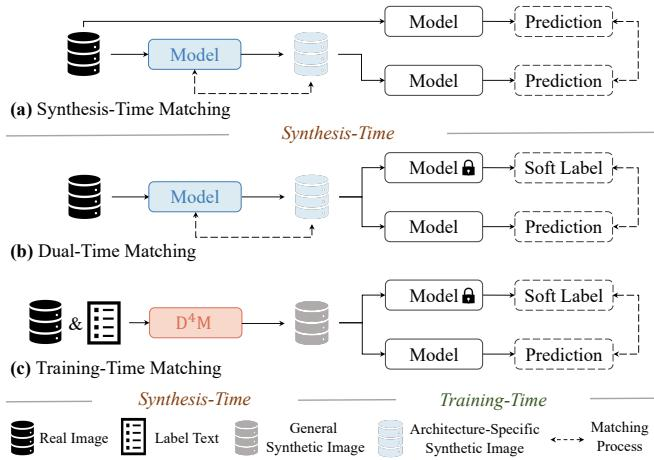  
Figure 1. Comparison of various matching strategies in dataset distillation. (a) The bi-level optimization implements data matching at synthesis time. (b) Dual-Time Matching strategy decouples the bi-level optimization process into synthesis time and training time to save computational overhead. (c) D<sup>4</sup>M utilizes multimodal features (image and texts) to synthesize high-quality images. D<sup>4</sup>M does not require matching process at Synthesis-Time.

Unfortunately, the existing solutions of DD mainly focus on small and simple datasets, such as CIFAR [21] and MNIST [23, 44]. When it comes to large-scale and highresolution datasets such as ImageNet [9], there exists unaffordable computational requirements and reduced performance. Another challenge in DD is the cross-architecture generalization. Previous methods conduct data matching within a fixed discriminative architecture, which makes the output space biased from the original image space. As demonstrated in Fig. 2, this kind of dataset may be insightful for the networks but suffers from the lack of semantic information for humankind. Furthermore, the dataset has to be distilled from scratch again and again to adapt to the emerging network architectures. Obviously, these limitations constrain the scientific value and practical utility of the current solutions. In this paper, we argue that an ideal DD method should meet the following properties.

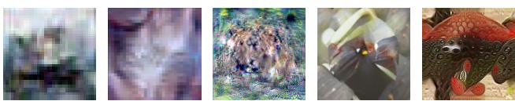  
Guess What These Are?  
Figure 2. Visualizations of previous DD methods. Synthesis-Time Matching sacrifices part of the visual semantic expression in order to imitate the performance of the original dataset.

1) The synthesis process should not depend on a specific network architecture. Typically, a fixed architecture is required for data matching, which leads to low crossarchitecture generalization performance because the output space is constrained by the architecture. This problem arises once the matching process occurs in the synthesis time as shown in Fig. 1(a) and (b). Some work leverages a model pool instead of an individual matching model to alleviate this issue but makes the network hard to optimize [41, 54]. When the distillation process is architecture-free, there is no need to distill datasets for different architectures repeatedly. In addition, constraining the consistency of input and output spaces will make the distilled images more realistic. GlaD [5] seems to be a solution where the images are synthesized via Generative Adversarial Networks. However, the synthetic images are still matched by the inner loop.

2) The method is capable ofdistilling datasets ofvarious sizes and resolutions with limited computational resources. As illustrated in Fig. 1(a), most DD solutions use bi-level optimization during synthesis time. While the large-scale datasets are unable to perform a number of unrolled iterations on such a nested loop system. Some works attempt to distill the ImageNet-1K but yield low testing accuracy [4, 8]. A more effective method is depicted in Fig. 1(b): the bi-level optimization is decoupled into synthesis time and training time [48]. However, the Dual-Time Matching (DTM) strategy leads to information loss at each stage, posing challenges for distillation on small datasets instead.

Inspired by these insights, we propose the Dataset Distillation via Disentangled Diffusion Model (D<sup>4</sup>M), an efficient approach designed for DD across varying sizes and resolutions as depicted in Fig. 1(c). In D<sup>4</sup>M, the Synthesis-Time Matching (STM) is superseded by Training-Time Matching (TTM) which facilitates the fast distillation of large-scale datasets with constrained computational resources. Furthermore, D<sup>4</sup>M alleviates the architectural dependency and improves the cross-architecture generalization performance of the distilled dataset. As the generative model, Diffusion Models ensure the consistency between input and output spaces, and its synthesis process does not rely on any specific matching architecture. To mitigate the information loss due to insufficient data matching, the conditioning mechanism in Latent Diffusion Model (LDM) consistently infuses the semantic information of labels into the synthetic data during the denoising process. The synthesis process of D<sup>4</sup>M solely depends on the prototypes extracted from the original data, with synthesis speed scaling linearly with the size of datasets. Moreover, the synthetic images exhibit realism at a high resolution of 512 × 512. Our pivotal contributions are summarized as follows:

• To the best of our knowledge, this is the first work that overcomes the pronounced dependency on specific architectures inherent in traditional DD frameworks. We introduce the TTM strategy, which paves the way for the generation of a curated and versatile distilled dataset.

• We propose D<sup>4</sup>M that integrates the diffusion model into DD task for the first time. By leveraging label texts and the learned prototypes, we construct a multi-modal DD model that simultaneously enhances distillation efficiency and model performance.

• The method realizes the attainment of resolutions up to 512×512 that exhibit high-fidelity and robust adaptability in the realm of DD. This improvement is evidenced across a spectrum of datasets, extending from the ImageNet-1K to CIFAR-10/100.

• We conduct extensive experiments and ablation studies. The results outperform the SOTA in most cases, substantiating the superior performance, computational efficiency, and robustness of our method.

## 2. Related Work

## 2.1. Dataset Distillation

The existing DD approaches are taxonomized into metalearning matching and data matching frameworks [13, 25, 34, 49]. The meta-learning matching aims to optimize the meta-test loss on real dataset for the model meta-trained by the distilled dataset. The gradients are back-propagated to supervise the DD directly [10, 27, 31, 32, 42, 54].

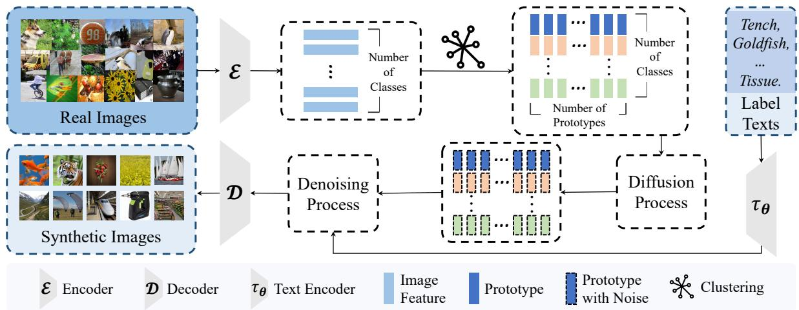  
Figure 3. Pipeline of Dataset Distillation via Disentangled Diffusion Model (D<sup>4</sup>M). Rather than using the embedded features directly, $\mathrm { D } ^ { 4 } \mathbf { M }$ disentangles feature extraction from image generation in diffusion models through prototype learning.

Unlike optimizing the performance on the DD explicitly, data matching encourages the consistency between the same network architecture trained by distilled and real dataset. Matching the gradients generated by the networks is a reliable surrogate task [18, 24, 51, 53]. Matching Training Trajectory (MTT) [4, 11] is then proposed to solve the issue that errors are accumulated during validation in gradient matching. TESLA [8] reduced the complexity of gradients calculating with constant memory, allowing DD to be achieved in ImageNet for the first time. Besides, distribution matching optimizes the distance between the two distributions, such as MMD [52] and CAFE [40].

The aforementioned methods only implement various matching strategies at synthesis time. SRe<sup>2</sup>L [48] argues that decoupling the bi-level optimization into Squeeze, Recover, and Relabel leads to a good performance on largescale datasets. Inspired by this, we summarize previous works into STM and DTM. D<sup>4</sup>M implements the TTM with the help of soft labels, which is considered a feature distribution matching approach.

## 2.2. Diffusion Models

The Diffusion Model has demonstrated remarkable capabilities within the generative models. Given samples x observed from a target distribution, the goal of generative models is approximating the true distribution $P ( x )$ , enabling the generation of novel samples from it. Denoising Diffusion Probabilistic Models (DDPM) [16] aims to learn a reverse process of a fixed Markov Chain for generating images. However, DDPM is expensive to optimize and evaluate in the original pixel space.

Latent Diffusion Model (LDM) [33], a recent state-ofthe-art diffusion model, addresses this by abstracting highfrequency, imperceptible details into a compact latent space, thereby streamlining both training and inference. LDM has been applied in image editing [38, 43], video processing [2, 12], audio generation [17, 36] and 3D model reconstruction [6, 19, 20, 29]. Notably, the proficiency of LDM in abstracting and generating images within the latent space exactly resonates with the foundational tenets of DD.

## 3. Method

## 3.1. Preliminaries on Diffusion Models

A pivotal step in DD is the generation of the distilled images. Distinct from the data-matching approaches, our method harnesses the prior knowledge embedded in the pretrained generative models, offering a high-quality initialization for TTM. Recently, diffusion models have emerged as SOTA in generative models [28, 46]. As aforementioned, the synthesis process of the diffusion model does not rely on any specific matching architecture, ensuring the consistency between input and output spaces. For a sequence of denoising autoencoders $\epsilon _ { \theta } ,$ the training objective of Denoising Diffusion Probability Model (DDPM) [16] is defined as

$$
L _ { D M } = \mathbb { E } _ { x , \epsilon \sim \mathcal { N } ( 0 , 1 ) , t } \left[ \left\| \epsilon - \epsilon _ { \theta } \left( x _ { t } , t \right) \right\| _ { 2 } ^ { 2 } \right] ,\tag{1}
$$

with the timestamp t uniformly sampled from $\{ 1 , \ldots , T \}$ Although the DDPM does not cater to our goal of synthesizing images within the condensed features, we turn our attention to the LDM [33].

LDM effectively compresses the working space from the original pixel space x to a more compact latent space z. Such a transition is close to our intent of encapsulating images into condensed features. LDM constructs an optimized low-dimensional latent space by training a perceptual compression model composed of the encoder (E) and decoder (D). This latent space effectively abstracts high-frequency imperceptible details than pixel space [33]. In this case, the objective function with text encoder $\tau _ { \theta }$ is redefined as

$$
L _ { L D M } = \mathbb { E } _ { \mathcal { E } ( x ) , y , \epsilon \sim \mathcal { N } ( 0 , 1 ) , t } \left[ \Vert \epsilon - \epsilon _ { \theta } \left( z _ { t } , t , \tau _ { \theta } ( y ) \right) \Vert _ { 2 } ^ { 2 } \right]\tag{2}
$$

## 3.2. Disentangled Diffusion Model

The existing diffusion methods are capable of generating high-quality images directly from the given images and prompts. However, it is imperative for the DD model to aggregate the given images into a few condensed features before synthesis. The images in the original dataset encapsulate a spectrum of information from low-level texture patterns to high-level semantic information, along with potential redundancies. Since the diffusion models do not have the capability of aggregating this information among images, it is necessary to extract the salient feature representative of each category before employing the generative model. Consequently, it is essential to disentangle the diffusion models.

Employing prototypes in standard classification tasks offers the benefit of addressing the open-world recognition challenge, thereby enhancing the robustness of models [26, 45, 50]. Therefore, initializing the input of the diffusion model with prototypes not only reduces data redundancy but also elevates the quality of the distilled dataset. As illustrated in Fig. 3, we leverage the pre-trained autoencoder E inherent in the LDM to extract feature representations from original images. Subsequently, we perform a clustering algorithm to calculate the cluster centers as prototypes for each category. Given the considerable size of the original dataset, we adopt the Mini-Batch k-Means [35] to mitigate the memory overhead of large-scale clustering. This approach iteratively optimizes a mini-batch of samples in each step, accelerating the clustering process with a minimal compromise in accuracy.

Specifically, the clustering algorithm consists of two primary steps: assignment z

$$
z ^ { c } \gets z\tag{3}
$$

$$
\operatorname { s . t . } \ \operatorname { a r g m i n } _ { c } \| z - z ^ { c } \| ^ { 2 } , c = 1 , \dots , C\tag{4}
$$

and update $z ^ { c }$

$$
z ^ { c } \gets ( 1 - \eta ) z ^ { c } + \eta z .\tag{5}
$$

Here $z$ is the latent variable generated by $\mathcal { E } ,$ , and $z ^ { c }$ represents the cluster centers (prototypes), $C$ is the number of cluster centers. The learning rate $\eta$ is often calculated by $\frac { 1 } { | z ^ { c } | }$ . Ultimately, we employ the prototypes $\bar { Z } = \{ z _ { l } ^ { c } | c =$ $\mathrm { i } , . . . , C , \ l = 1 , . . . , L \}$ from all categories as input to the diffusion process for image synthesis.

```latex
Algorithm 1 Dataset Distillation via Disentangled
Diffusion Model $\mathbf { ( D ^ { 4 } M ) }$
Input: $_ { ( T , { \mathcal { L } } ) }$ : Real images and their label texts.
Input: E: Pre-trained encoder.
Input: D: Pre-trained decoder.
Input: τ<sub>θ</sub>: Pre-trained text encoder.
Input: $\textstyle u _ { t } \colon$ Pre-trained time-conditional U-Net.
Input: C: Number of prototypes.
1: $Z = \mathcal { E } ( \mathcal { T } ) \sim P _ { z }$ ▷ Compressed latent space
2: for each $L \in { \mathcal { L } }$ do
3: for mini-batch $z \in L$ do
4: $z ^ { c } \sim P _ { z } , c = 1 , \dots , C$
▷ Initialize cluster centers
5: $z ^ { c } \gets z ,$ s.t. arg min $\| z - z ^ { c } \| ^ { 2 }$ ▷ Assignment
c
6: $\begin{array} { r } { \eta = \frac { 1 } { \left| z ^ { c } \right| } } \end{array}$ $\vartriangleright$ Update learning rate
7: $z ^ { c } \gets ( \dot { 1 } - \eta ) z ^ { c } + \eta z$ ▷ Update
8: end for
9: $y = \tau _ { \theta } ( L )$ ▷ Label text embedding
10: for each $z ^ { c }$ do
11: $z _ { t } ^ { c } \sim q \big ( z _ { t } ^ { c } | z ^ { c } \big )$ ▷ Diffusion process
12: $\tilde { z } ^ { c } = \mathcal { U } _ { t } ( C o n c a t ( z _ { t } ^ { c } , y ) )$ ▷ Denoising process
13: end for
14: end for
15: $\mathcal { S } = \mathcal { D } ( \tilde { Z } ^ { c } )$ ▷ Generate image
Output: $s \colon$ Distilled images.
```

Moreover, LDM is capable of modeling the conditional distribution, enabling DD tasks to incorporate the label information into synthetic images. In Eq. (2), LDM introduces a domain-specific encoder $\tau _ { \theta }$ to map the textual labels (prompts) into the feature space. This mapping is seamlessly integrated into the U-Net architecture $( \mathcal { U } _ { t } )$ through a cross-attention layer, facilitating the fusion of multi-modal features. For each prototype $z ^ { c }$ and its corresponding label $L ,$ the synthesis process is formulated as

$$
o u t p u t = \mathcal { D } ( \mathcal { U } _ { t } ( C o n c a t ( z _ { t } ^ { c } , \tau _ { \theta } ( L ) ) )\tag{6}
$$

where $ { \boldsymbol { z } } _ { t } ^ { c }$ represents the c-th prototype with noise. The distillation process is summarized in Algorithm 1.

## 3.3. Training-Time Matching

Since eliminates the necessity of matching with a specific architecture, separating data matching from the synthesis process reduces the computational overhead on large-scale datasets and addresses the cross-architecture issue inherent in the STM strategy. However, based on previous research [4, 8, 48] and preliminary experiments, we find that training large-scale distilled datasets with hard labels is prone to low testing accuracy. To address this, we introduce the TTM strategy, which is considered a distribution matching approach.

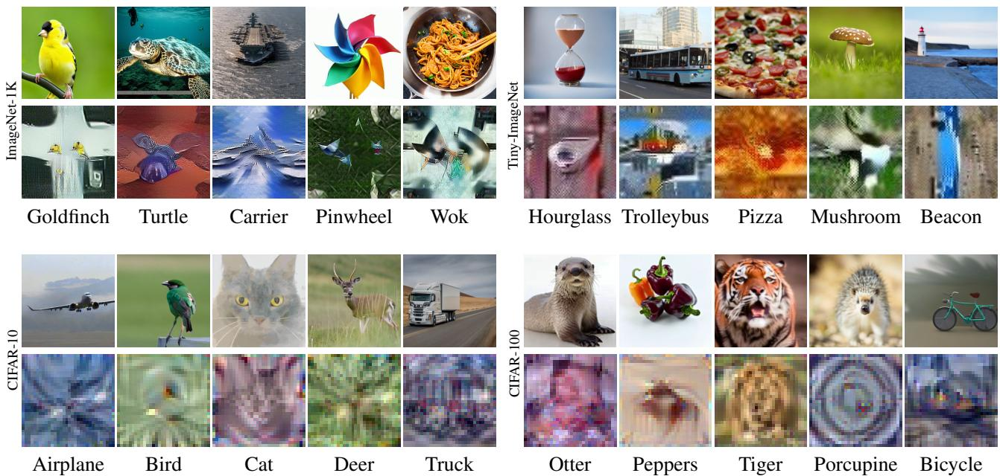  
Figure 4. Visualization results. The top row of each dataset comes from $\mathrm { D } ^ { 4 } \mathbf { M }$ and the bottom comes from SRe $\mathrm { S R e ^ { 2 } I }$ [48] (ImageNet-1K and Tiny-ImageNet) and MTT [4] (CIFAR-10/100). The images generated by $\mathrm { D } ^ { 4 } \mathbf { M }$ have better resolution and are more lifelike.

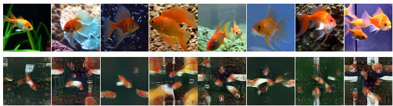  
Figure 5. Visualization results within one category. D<sup>4</sup>M (top) provides richer semantic information than $\mathrm { S R e ^ { 2 } I }$ .

TTM refers to training on distilled datasets with soft labels. Label softening is widely adapted in distillation tasks [15, 30, 47]. Since $\mathrm { D } ^ { 4 } \mathrm { M }$ infuses the label features into the synthetic data, it is natural to use the soft label during TTM. We employ soft label to align the distribution of student prediction $S _ { \theta } ( x )$ with teacher network T:

$$
\theta _ { \mathrm { s t u d e n t } } = \underset { \theta \in \Theta } { \arg \operatorname* { m i n } } L _ { K L } ( T ( x ) , S _ { \theta } ( x ) )\tag{7}
$$

where $T ( x ) / S _ { \theta } ( x )$ is the teacher/student prediction for the distilled image x and $L _ { K L }$ represents the KL divergence. The output of the teacher network, also known as soft prediction or soft label, encapsulates richer semantic information compared to hard labels. Matching with the soft labels during training will enhance the robustness and generalization capability of the trained model [15]. For a fair comparison, we use the soft label storage method similar to the FKD [37] method, which generates soft labels and conducts matching at each training epoch:

$$
\theta _ { \mathrm { s t u d e n t } } ^ { t + 1 } = \underset { \theta \in \Theta } { \arg \operatorname* { m i n } } L _ { K L } ( T ^ { t } ( x ) , S _ { \theta } ^ { t } ( x ) ) .\tag{8}
$$

## 4. Experiments

## 4.1. Setting and Evaluation

We evaluate the performance of $\mathrm { D } ^ { 4 } \mathbf { M }$ across various datasets and networks. All models employed for ImageNet-1K and Tiny-ImageNet are sourced from the PyTorch official model repository, while the ConvNet utilized for CIFAR-10/100 is based on the architecture proposed by Gidaris et al. [14]. Performance validation was carried out using PyTorch on NVIDIA V100 GPUs. Detailed training and validation hyperparameters are available in the supplementary material.

## 4.2. Dataset Distillation Results

In our comparative analysis, we evaluate the $\mathrm { D } ^ { 4 } \mathrm { M }$ against a range of techniques, encompassing both meta-learning and data-matching strategies. For small datasets, our comparison included two meta-learning methods: KIP [32] and FRePO [54], alongside four data-matching techniques: DSA [51], CAFE [40], TESLA [8], and $\mathrm { S R e ^ { 2 } L }$ [48]. In the context of large-scale datasets, our focus shifted to a detailed comparison between TESLA and $\mathrm { S R e ^ { 2 } L }$

CIFAR-10 and CIFAR-100 For small dataset distillation, the STM strategy outperforms when the number of categories and IPC (Image Per Class) are limited. However, as the category increases, the TTM strategy becomes more effective. This shift is attributed to the fact that the optimal solution derived from STM fails to ensure the convergence of the network training with large category numbers, thereby capping the testing performance. As evidenced in

<table><tr><td rowspan="2">Dataset</td><td rowspan="2">IPC</td><td colspan="2">Meta-Learning</td><td colspan="4">Data-Matching</td><td rowspan="2"> $\mathrm { D } ^ { 4 } \mathrm { M }$ </td><td rowspan="2">Full Dataset</td></tr><tr><td>KIP</td><td>FRePO</td><td>DSA</td><td>CAFE</td><td>TESLA</td><td> $\mathrm { S R e ^ { 2 } L ^ { \dagger } }$ </td></tr><tr><td rowspan="2">CIFAR-10</td><td>10</td><td> $6 2 . 7 { \pm } 0 . 3 $ </td><td> $6 5 . 5 { \pm } 0 . 6 $ </td><td> $5 2 . 1 { \pm } 0 . 5 $ </td><td> $5 0 . 9 { \pm } 0 . 5 $ </td><td> ${ \bf 6 6 . 4 \pm 0 . 8 }$ </td><td rowspan="2">(60.2)</td><td> $5 6 . 2 { \pm } 0 . 4 $ </td><td rowspan="2"> $8 4 . 8 { \pm } 0 . 1 $ </td></tr><tr><td>50</td><td> $6 8 . 6 { \pm } 0 . 2 $ </td><td> $7 1 . 7 { \pm } 0 . 2 $ </td><td> $6 0 . 6 { \pm } 0 . 5 $ </td><td> $6 2 . 3 { \pm } 0 . 4 $ </td><td> $7 2 . 6 { \pm } 0 . 7 $ </td><td> $7 2 . 8 { \pm } 0 . 5$ </td></tr><tr><td rowspan="2">CIFAR-100</td><td>10</td><td> $2 8 . 3 { \pm } 0 . 1 $ </td><td> $4 2 . 5 { \pm } 0 . 2 $ </td><td> $3 2 . 3 { \pm } 0 . 3 $ </td><td> $3 1 . 5 { \pm } 0 . 2 $ </td><td> $4 1 . 7 { \pm } 0 . 3 $ </td><td rowspan="2"></td><td> ${ \bf 4 5 . 0 { \pm 0 . 1 } }$ </td><td rowspan="2"> $5 6 . 2 { \pm } 0 . 3 $ </td></tr><tr><td>50</td><td></td><td> $4 4 . 3 { \pm } 0 . 2 $ </td><td> $4 2 . 8 { \pm } 0 . 4 $ </td><td> $4 2 . 9 { \pm } 0 . 2 $ </td><td> $4 7 . 9 { \pm } 0 . 3 $ </td><td> ${ \bf 4 8 . 8 { \pm 0 . 3 } }$ </td></tr></table>

Table 1. Top-1 Accuracy↑ on small datasets. We train the ConvNet-W128 [14] from scratch 5 times on the distilled dataset and evaluate them on the original test dataset to get the x¯ ± std. †: $\mathrm { S R e ^ { 2 } L }$ [48] achieves 60.2% Top-1 Accuracy on CIFAR-10 with IPC-1K.

<table><tr><td>Dataset</td><td>IPC</td><td>Method</td><td>R18</td><td>R50</td><td>R101</td></tr><tr><td rowspan="6">ImageNet-1K</td><td></td><td>Full Dataset† TESLA</td><td>69.8 7.7</td><td>80.9</td><td>81.9</td></tr><tr><td>10</td><td>SRe²L</td><td>21.3</td><td>28.4</td><td>30.9</td></tr><tr><td></td><td> $\mathrm { D } ^ { 4 } \mathrm { M }$  SRe²L</td><td>27.9</td><td>33.5</td><td>34.2</td></tr><tr><td>50</td><td>D⁴M</td><td>46.8 55.2</td><td>55.6</td><td>60.8 63.4</td></tr><tr><td></td><td>SRe²L</td><td>52.8</td><td>62.4 61.0</td><td>65.8</td></tr><tr><td>100</td><td>D⁴4M SRe²L</td><td>59.3</td><td>65.4</td><td>66.5</td></tr><tr><td rowspan="6"></td><td>200</td><td>D⁴M</td><td>57.0 62.6</td><td>64.6 67.8</td><td>65.9 68.1</td></tr><tr><td></td><td>Full Dataset‡ SRe²L</td><td>61.9 44.0</td><td>62.0 47.7</td><td>62.3 49.1</td></tr><tr><td>50</td><td>D⁴M</td><td>46.2</td><td>51.8</td><td>51.0</td></tr><tr><td></td><td> $\mathrm { D ^ { 4 } M - G }$   $\mathrm { S R e ^ { 2 } L }$ </td><td>46.8 50.8</td><td>51.9 53.5</td><td>53.2 54.2</td></tr><tr><td>100</td><td> $\mathrm { D } ^ { 4 } \mathrm { M }$ </td><td>51.4</td><td>54.8</td><td>55.3</td></tr><tr><td></td><td> $\mathrm { D ^ { 4 } M - G }$ </td><td>53.3</td><td>54.9</td><td>54.5</td></tr></table>

Table 2. Top-1 Accuracy↑ on large-scale datasets. $\mathrm { S R e ^ { 2 } L }$ [48] and our D<sup>4</sup>M employ ResNet18 as the teacher model to generate the soft label while TESLA [8] uses the ConvNetD4. All standard deviations in this table are < 1. †: The results of ImageNet-1K come from the official PyTorch websites. ‡: The results of Tiny-ImageNet come from the model trained from scratch with the official PyTorch code.

Tab. 1, when applied to CIFAR-100, $\mathrm { D } ^ { 4 } \mathbf { M }$ attains a Top-1 accuracy of 45.0% with merely IPC-10. This performance surpasses that of FRepo and TESLA by 2.5% and 3.3%.

ImageNet-1K and Tiny-ImageNet The TTM strategy demonstrates remarkable efficacy in large-scale DD tasks as presented in Tab. 2. The effectiveness stems from its ability to improve the quality of the synthetic data rather than imitate the performance of the original data. Consequently, it facilitates the processing of large-scale datasets with reduced computational complexity and memory demands. In terms of accuracy, the proposed $\mathrm { D } ^ { 4 } \mathrm { M }$ sets new benchmarks, achieving 66.5% and 51.0% with IPC-100 on ImageNet-1K and Tiny-ImageNet. Notably, it replicates the full dataset performance with 81.2% and 81.9%, respectively. Moreover, our approach significantly surpasses the leading datamatching method, $\mathrm { S R e ^ { 2 } L }$ , across both datasets. This superiority is attributed to the integration of multi-modal fusion embedding in $\mathrm { D } ^ { 4 } \mathbf { M } .$

<table><tr><td>Ablation</td><td>R18</td><td>R50 R101</td></tr><tr><td rowspan="3">w/ STM w/o STM</td><td colspan="2">Teacher: R18</td></tr><tr><td>23.6 29.7</td><td>32.3</td></tr><tr><td>27.9(+4.3)</td><td>33.5(+3.8) 34.2(+1.9)</td></tr><tr><td rowspan="3">w/ STM w/o STM</td><td>Teacher: R50</td><td></td></tr><tr><td>15.8</td><td>20.6 22.3</td></tr><tr><td>20.7(+4.9)</td><td>24.7(+4.1) 26.7(+4.4)</td></tr><tr><td rowspan="2">w/ STM</td><td>Teacher: R101</td><td></td></tr><tr><td>12.5 16.0</td><td>17.6</td></tr><tr><td>w/o STM</td><td>19.4(+6.9)</td><td>23.0(+7.0) 24.2(+6.6)</td></tr></table>

Table 3. Comparison of Top-1 Accuracy↑ on different matching strategy. We use the R18 as the distribution matching architecture. All methods are evaluated with IPC-10.

Benefit to the architecture-free synthesis process, the datasets distilled by D<sup>4</sup>M exhibit versatility. To substantiate this characteristic, we extract 200 categories from the distilled ImageNet as the distilled Tiny-ImageNet in accordance with the predefined mapping [22]. The experimental outcomes of $\mathrm { D ^ { 4 } M { - } G }$ in Tab. 2 demonstrate that our method not only manifests a pronounced distillation effect but also retains the applicability inherent to the original dataset.

## 4.3. Matching Strategy Analysis

As mentioned in Sec. 2, the DD task often uses the STM strategy to generate images. In order to validate the superiority of TTM strategy, we conduct the comparative experiments listed in Tab. 3. We execute the synthesis process through BN distribution matching on images distilled via D<sup>4</sup>M, resulting in distribution-matched synthetic images.

It is evident that the test performance with STM failed regardless of the chosen teacher network. The images distilled via $\mathrm { D } ^ { 4 } \mathbf { M }$ encapsulate not only the salient features of the original prototypes but also the text information of category labels. Therefore, the network solely trained with the original images proves inadequate for effectively managing such fused multi-modal features. Should the fused features be aligned with these networks, it would result in the disruption of the fused information, thereby diminishing the overall accuracy. It is worth noting that D<sup>4</sup>M potentially offers high-quality initialization for STM, as it synthesizes images with higher testing accuracy compared to those derived from random white noise initialization.

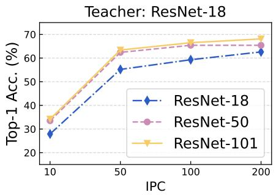

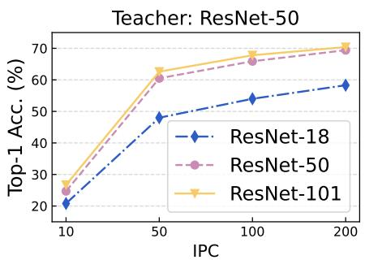

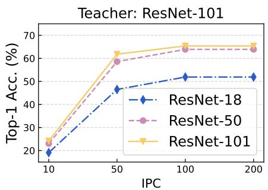  
Figure 6. Top-1 Accuracy↑ of ImageNet-1K on various teacher-student pairs. The result of each pair increases consistently with larger IPC

<table><tr><td>Ablation</td><td>R18</td><td>R50 R101</td></tr><tr><td rowspan="3">w/o PT w/PT</td><td>Dataset: ImageNet-1K</td><td></td></tr><tr><td>15.6</td><td>20.7 20.6</td></tr><tr><td>27.9(+12.3)</td><td>33.5(+12.8) 34.2(+13.6)</td></tr><tr><td rowspan="3">w/o PT w/PT</td><td>Dataset: Tiny-ImageNet</td><td></td></tr><tr><td>30.5</td><td>35.6 37.3</td></tr><tr><td>46.2(+15.7)</td><td>51.8(+16.2) 51.0(+13.7)</td></tr></table>

Table 4. Comparison of Top-1 Accuracy↑ on different initialization of diffusion process. PT is the abbreviation of Prototype. All methods are evaluated with IPC-10.

## 4.4. Prototype Analysis

To ascertain the critical role of prototypes in $\mathrm { D } ^ { 4 } \mathrm { M } ,$ we conduct an ablation study on the diffusion process with random initialization and prototype initialization. The results listed in Tab. 4 demonstrate that the incorporation of a learned prototype markedly enhances the effectiveness of $\mathrm { D } ^ { 4 } \mathbf { M } .$

To showcase the merits of the prototype intuitively, we employ ResNet-18 for feature extraction from the distilled dataset, followed by t-SNE for dimensionality reduction. The visualization results (Fig. 7) reveal that the data synthesized via D<sup>4</sup>M demonstrates enhanced inter-class discrimination and intra-class consistency.

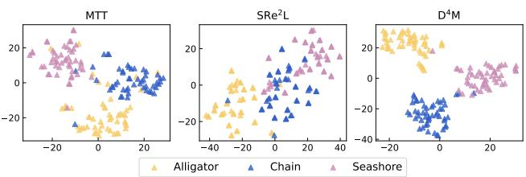  
Figure 7. T-SNE visualizations on Tiny-ImageNet. The feature embedding distribution of $\mathrm { { \Delta D ^ { 4 } M } }$ displays more compact within classes and discriminative among classes.

## 4.5. Teacher-Student Network Analysis

We studied the performance of different teacher-student models with $\mathrm { D } ^ { 4 } \mathrm { M }$ and the experimental results are shown in Fig. 6. Under the same teacher network, the accuracy of ResNet-18, ResNet-50, and ResNet-101 increases gradually. When IPC is small (such as 10 and 50), the student network trained with an enhanced teacher is prone to overfitting, resulting in reduced testing accuracy. As IPC increases, the large network shows stronger learning ability and the Top-1 accuracy improves. We further compare the performance of the distilled ImageNet on different teacherstudent pairs, including CNNs and ViTs (Tab. 5). As a student network, the ViT-based networks assimilate the inductive bias inherent in CNN-based teachers, leveraging its global attention mechanism to attain the best Top-1 accuracy. Conversely, as a teacher network, ViT does not have such an inductive bias characteristic, yielding suboptimal results on their student networks. Nevertheless, ViT-based students consistently achieve superior Top-1 accuracy.

## 4.6. Qualitative Analysis

A pivotal advantage of $\mathrm { D } ^ { 4 } \mathrm { M }$ lies in its utilization of the outputs from the image decoder D as the distilled dataset, avoiding the need for STM. This implies that the pixel space of the generated image remains unaltered by any matching optimization, thereby preserving the reality of the distilled image. Figures 4 and 5 exemplify the superior image quality achieved by $\mathrm { D } ^ { 4 } \mathrm { M }$ in comparison to its counterparts. It is evident that the $\mathrm { D } ^ { 4 } \mathrm { M }$ method not only guarantees the high resolution of the distilled image and preserves the integrity of semantic information but also ensures the richness of features within the same category. More visualizations and analysis can be found in supplementary material.

<table><tr><td rowspan="2">Teacher Network</td><td colspan="5">Student Network</td></tr><tr><td>ResNet-18</td><td>MobileNet-V2</td><td>EfficientNet-B0</td><td>Swin-T</td><td>ViT-B</td></tr><tr><td>ResNet-18</td><td>55.2</td><td>47.9</td><td>55.4</td><td>58.1</td><td>45.5</td></tr><tr><td>MobileNet-V2</td><td>47.6</td><td>42.9</td><td>49.8</td><td>58.9</td><td>50.4</td></tr><tr><td>Swin-T</td><td>27.5</td><td>21.9</td><td>26.4</td><td>38.1</td><td>34.2</td></tr></table>

Table 5. Top-1 Accuracy↑ on ImageNet-1K with various teacher-student architectures. ViT-based students show powerful learning ability with IPC-50.

<table><tr><td>Method</td><td>Resolution Time(s)↓</td><td>GPU(GB)↓</td></tr><tr><td></td><td colspan="2">Dataset: ImageNet-1K</td></tr><tr><td>MTT†</td><td> $1 2 8 \times 1 2 8$  45.0</td><td>79.9</td></tr><tr><td> $\mathrm { T E S L A ^ { \dagger } }$ </td><td> $6 4 \times 6 4$  46.0</td><td>13.9</td></tr><tr><td> $\mathrm { S R e ^ { 2 } L }$ </td><td> $2 2 4 \times 2 2 4$  5.2</td><td>34.8</td></tr><tr><td> $\mathrm { D } ^ { 4 } \mathbf { M }$ </td><td> $5 1 2 \times 5 1 2$ </td><td>2.7 6.1</td></tr><tr><td rowspan="2">MTT</td><td>Dataset: Tiny-ImageNet</td><td></td></tr><tr><td> $6 4 \times 6 4$ </td><td>5.4 48.9</td></tr><tr><td> $\mathrm { S R e ^ { 2 } L }$ </td><td> $6 4 \times 6 4$  11.0</td><td>33.8</td></tr><tr><td> $\mathrm { D } ^ { 4 } \mathbf { M }$ </td><td>²  $5 1 2 \times 5 1 2$  2.7</td><td>6.1</td></tr></table>

Table 6. Synthesis time↓ and GPU memory↓ cost on largescale datasets. †: The runtime of MTT [4] and TESLA [8] on ImageNet-1K are measured for 10 iterations (500 matching steps).

## 4.7. Distillation Cost Analysis

We conduct the analysis of GPU memory consumption across various DD methods, with the corresponding results presented in Tab. 6. Notably, the architecture-free nature of $\mathrm { D } ^ { 4 } \mathrm { M }$ during synthesis ensures the fixed time and GPU memory costs. When considering STM and DTM, we observe an increase in both time and GPU memory usage with the enlargement of the matching architecture. For instance, the peak GPU memory utilization for $\mathrm { S R e ^ { 2 } L }$ in the recovery of a $6 4 \times 6 4$ image on ConvNet is 4.2 GB, whereas on ResNet-50, it reaches a substantial 33.8 GB. Similarly, when synthesizing a 64×64 image on ConvNet, MTT demands a peak GPU memory of 48.9 GB. Furthermore, the number of iteration steps impacts the generation time for a single image in data matching. With the increased iteration steps, the time cost for $\mathrm { S R e ^ { 2 } I }$ to recover a 224×224 image on ResNet-50 gradually rises from 1.31s to 10.48s. Notably, $\mathrm { D } ^ { 4 } \mathrm { M }$ demonstrates a remarkable reduction in time cost by a factor of 3.82 when compared to $\mathrm { S R e ^ { 2 } L }$ . Figure 8 reveals that $\mathrm { D } ^ { 4 } \mathbf { M }$ attains best accuracy at a constant time cost.

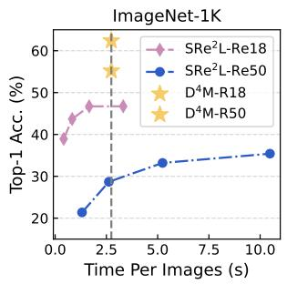

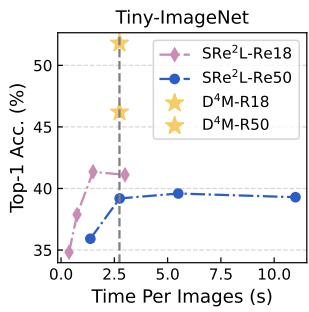  
Figure 8. Top-1 Accuracy↑ and synthesis time↓ on large-scale datasets. $\mathrm { D } ^ { 4 } \mathbf { M }$ is architecture-free at synthesis time, thereby a constant runtime cost. Re is the abbreviation of Recover.

## 5. Conclusion

We introduce $\mathrm { D } ^ { 4 } \mathrm { M } ,$ a novel and efficient dataset distillation framework leveraging the TTM strategy. For the first time, $\mathrm { D } ^ { 4 } \mathrm { M }$ addresses the cross-architecture generalization issue by integrating the principles of diffusion models with prototype learning. The distilled dataset not only boasts realistic and high-resolution images with limited resources but also exhibits a versatility comparable to that of the full dataset. $\mathrm { D } ^ { 4 } \mathrm { M }$ demonstrates outstanding performance compared to other dataset distillation methods, particularly when applied to large-scale datasets such as ImageNet-1K. Last but not least, rethinking the relationship between generative models and dataset distillation offers fresh perspectives, paving the way for the community to develop more efficient dataset distillation methods in future endeavors.

Limitation and future works. In the situation of extreme distillation (IPC-1/10), we observe a significant performance degradation. Our future work will concentrate on refining the distillation process for this challenging scenario and try to distill more real-world multi-modal datasets.

Acknowledgement. This work is supported by the National Natural Science Foundation of China (No. 12071458).

## References

[1] Richard E Blahut. Fast algorithms for signal processing. Cambridge University Press, 2010. 1

[2] Andreas Blattmann, Robin Rombach, Huan Ling, Tim Dockhorn, Seung Wook Kim, Sanja Fidler, and Karsten Kreis. Align your latents: High-resolution video synthesis with latent diffusion models. In Proceedings of the IEEE/CVF Conference on Computer Vision and Pattern Recognition, pages 22563–22575, 2023. 3

[3] Zalan Borsos, Mojmir Mutny, and Andreas Krause. Coresets´ via bilevel optimization for continual learning and streaming. Advances in neural information processing systems, 33: 14879–14890, 2020. 1

[4] George Cazenavette, Tongzhou Wang, Antonio Torralba, Alexei A Efros, and Jun-Yan Zhu. Dataset distillation by matching training trajectories. In Proceedings of the IEEE/CVF Conference on Computer Vision and Pattern Recognition, pages 4750–4759, 2022. 1, 2, 3, 4, 5, 8

[5] George Cazenavette, Tongzhou Wang, Antonio Torralba, Alexei A Efros, and Jun-Yan Zhu. Generalizing dataset distillation via deep generative prior. In Proceedings of the IEEE/CVF Conference on Computer Vision and Pattern Recognition, pages 3739–3748, 2023. 2

[6] Xin Chen, Biao Jiang, Wen Liu, Zilong Huang, Bin Fu, Tao Chen, and Gang Yu. Executing your commands via motion diffusion in latent space. In Proceedings of the IEEE/CVF Conference on Computer Vision and Pattern Recognition, pages 18000–18010, 2023. 3

[7] Yutian Chen, Max Welling, and Alex Smola. Super-samples from kernel herding. arXiv preprint arXiv:1203.3472, 2012. 1

[8] Justin Cui, Ruochen Wang, Si Si, and Cho-Jui Hsieh. Scaling up dataset distillation to imagenet-1k with constant memory. In International Conference on Machine Learning, pages 6565–6590. PMLR, 2023. 1, 2, 3, 4, 5, 6, 8

[9] Jia Deng, Wei Dong, Richard Socher, Li-Jia Li, Kai Li, and Li Fei-Fei. Imagenet: A large-scale hierarchical image database. In 2009 IEEE conference on computer vision and pattern recognition, pages 248–255. Ieee, 2009. 2

[10] Zhiwei Deng and Olga Russakovsky. Remember the past: Distilling datasets into addressable memories for neural networks. Advances in Neural Information Processing Systems, 35:34391–34404, 2022. 2

[11] Jiawei Du, Yidi Jiang, Vincent YF Tan, Joey Tianyi Zhou, and Haizhou Li. Minimizing the accumulated trajectory error to improve dataset distillation. In Proceedings of the IEEE/CVF Conference on Computer Vision and Pattern Recognition, pages 3749–3758, 2023. 3

[12] Patrick Esser, Johnathan Chiu, Parmida Atighehchian, Jonathan Granskog, and Anastasis Germanidis. Structure and content-guided video synthesis with diffusion models. In Proceedings of the IEEE/CVF International Conference on Computer Vision, pages 7346–7356, 2023. 3

[13] Jiahui Geng, Zongxiong Chen, Yuandou Wang, Herbert Woisetschlaeger, Sonja Schimmler, Ruben Mayer, Zhiming Zhao, and Chunming Rong. A survey on dataset distilla-

tion: Approaches, applications and future directions. arXiv preprint arXiv:2305.01975, 2023. 2

[14] Spyros Gidaris and Nikos Komodakis. Dynamic few-shot visual learning without forgetting. In Proceedings of the IEEE conference on computer vision and pattern recognition, pages 4367–4375, 2018. 5, 6

[15] Geoffrey Hinton, Oriol Vinyals, and Jeff Dean. Distilling the knowledge in a neural network. arXiv preprint arXiv:1503.02531, 2015. 5

[16] Jonathan Ho, Ajay Jain, and Pieter Abbeel. Denoising diffusion probabilistic models. Advances in neural information processing systems, 33:6840–6851, 2020. 3

[17] Yujin Jeong, Wonjeong Ryoo, Seunghyun Lee, Dabin Seo, Wonmin Byeon, Sangpil Kim, and Jinkyu Kim. The power of sound (tpos): Audio reactive video generation with stable diffusion. In Proceedings ofthe IEEE/CVF International Conference on Computer Vision, pages 7822–7832, 2023. 3

[18] Zixuan Jiang, Jiaqi Gu, Mingjie Liu, and David Z Pan. Delving into effective gradient matching for dataset condensation. In 2023 IEEE International Conference on Omni-layer Intelligent Systems (COINS), pages 1–6. IEEE, 2023. 3

[19] Seung Wook Kim, Bradley Brown, Kangxue Yin, Karsten Kreis, Katja Schwarz, Daiqing Li, Robin Rombach, Antonio Torralba, and Sanja Fidler. Neuralfield-ldm: Scene generation with hierarchical latent diffusion models. In Proceedings of the IEEE/CVF Conference on Computer Vision and Pattern Recognition, pages 8496–8506, 2023. 3

[20] Juil Koo, Seungwoo Yoo, Minh Hieu Nguyen, and Minhyuk Sung. Salad: Part-level latent diffusion for 3d shape generation and manipulation. In Proceedings of the IEEE/CVF International Conference on Computer Vision, pages 14441– 14451, 2023. 3

[21] Alex Krizhevsky and Geoffrey Hinton. Learning multiple layers of features from tiny images. Technical report, University of Toronto, Toronto, Ontario, 2009. 2

[22] Ya Le and Xuan Yang. Tiny imagenet visual recognition challenge. CS 231N, 7(7):3, 2015. 6

[23] Yann LeCun, Corinna Cortes, and CJ Burges. Mnist handwritten digit database. ATT Labs [Online]. Available: http://yann.lecun.com/exdb/mnist, 2, 2010. 2

[24] Saehyung Lee, Sanghyuk Chun, Sangwon Jung, Sangdoo Yun, and Sungroh Yoon. Dataset condensation with contrastive signals. In International Conference on Machine Learning, pages 12352–12364. PMLR, 2022. 1, 3

[25] Shiye Lei and Dacheng Tao. A comprehensive survey to dataset distillation. arXiv preprint arXiv:2301.05603, 2023. 2

[26] Gen Li, Varun Jampani, Laura Sevilla-Lara, Deqing Sun, Jonghyun Kim, and Joongkyu Kim. Adaptive prototype learning and allocation for few-shot segmentation. In Proceedings of the IEEE/CVF conference on computer vision and pattern recognition, pages 8334–8343, 2021. 4

[27] Noel Loo, Ramin Hasani, Alexander Amini, and Daniela Rus. Efficient dataset distillation using random feature approximation. Advances in Neural Information Processing Systems, 35:13877–13891, 2022. 2

[28] Calvin Luo. Understanding diffusion models: A unified perspective. arXiv preprint arXiv:2208.11970, 2022. 3

[29] Zhaoyang Lyu, Jinyi Wang, Yuwei An, Ya Zhang, Dahua Lin, and Bo Dai. Controllable mesh generation through sparse latent point diffusion models. In Proceedings of the IEEE/CVF Conference on Computer Vision and Pattern Recognition, pages 271–280, 2023. 3

[30] Rafael Muller, Simon Kornblith, and Geoffrey E Hinton.¨ When does label smoothing help? Advances in neural information processing systems, 32, 2019. 5

[31] Timothy Nguyen, Zhourong Chen, and Jaehoon Lee. Dataset meta-learning from kernel ridge-regression. arXiv preprint arXiv:2011.00050, 2020. 2

[32] Timothy Nguyen, Roman Novak, Lechao Xiao, and Jaehoon Lee. Dataset distillation with infinitely wide convolutional networks. Advances in Neural Information Processing Systems, 34:5186–5198, 2021. 2, 5

[33] Robin Rombach, Andreas Blattmann, Dominik Lorenz, Patrick Esser, and Bjorn Ommer. High-resolution image¨ synthesis with latent diffusion models. In Proceedings of the IEEE/CVF conference on computer vision and pattern recognition, pages 10684–10695, 2022. 3, 4

[34] Noveen Sachdeva and Julian McAuley. Data distillation: A survey. arXiv preprint arXiv:2301.04272, 2023. 2

[35] David Sculley. Web-scale k-means clustering. In Proceedings of the 19th international conference on World wide web, pages 1177–1178, 2010. 4

[36] Shuai Shen, Wenliang Zhao, Zibin Meng, Wanhua Li, Zheng Zhu, Jie Zhou, and Jiwen Lu. Difftalk: Crafting diffusion models for generalized audio-driven portraits animation. In Proceedings of the IEEE/CVF Conference on Computer Vision and Pattern Recognition, pages 1982–1991, 2023. 3

[37] Zhiqiang Shen and Eric Xing. A fast knowledge distillation framework for visual recognition. In European Conference on Computer Vision, pages 673–690. Springer, 2022. 5

[38] Yu Takagi and Shinji Nishimoto. High-resolution image reconstruction with latent diffusion models from human brain activity. In Proceedings of the IEEE/CVF Conference on Computer Vision and Pattern Recognition, pages 14453– 14463, 2023. 3

[39] Mariya Toneva, Alessandro Sordoni, Remi Tachet des Combes, Adam Trischler, Yoshua Bengio, and Geoffrey J Gordon. An empirical study of example forgetting during deep neural network learning. arXiv preprint arXiv:1812.05159, 2018. 1

[40] Kai Wang, Bo Zhao, Xiangyu Peng, Zheng Zhu, Shuo Yang, Shuo Wang, Guan Huang, Hakan Bilen, Xinchao Wang, and Yang You. Cafe: Learning to condense dataset by aligning features. In Proceedings of the IEEE/CVF Conference on Computer Vision and Pattern Recognition, pages 12196– 12205, 2022. 1, 3, 5

[41] Kai Wang, Jianyang Gu, Daquan Zhou, Zheng Zhu, Wei Jiang, and Yang You. Dim: Distilling dataset into generative model. arXiv preprint arXiv:2303.04707, 2023. 2

[42] Tongzhou Wang, Jun-Yan Zhu, Antonio Torralba, and Alexei A Efros. Dataset distillation. arXiv preprint arXiv:1811.10959, 2018. 2

[43] Chen Henry Wu and Fernando De la Torre. A latent space of stochastic diffusion models for zero-shot image editing

and guidance. In Proceedings ofthe IEEE/CVF International Conference on Computer Vision, pages 7378–7387, 2023. 3

[44] Han Xiao, Kashif Rasul, and Roland Vollgraf. Fashionmnist: a novel image dataset for benchmarking machine learning algorithms. arXiv preprint arXiv:1708.07747, 2017. 2

[45] Hong-Ming Yang, Xu-Yao Zhang, Fei Yin, and Cheng-Lin Liu. Robust classification with convolutional prototype learning. In Proceedings of the IEEE conference on computer vision and pattern recognition, pages 3474–3482, 2018. 4

[46] Ling Yang, Zhilong Zhang, Yang Song, Shenda Hong, Runsheng Xu, Yue Zhao, Wentao Zhang, Bin Cui, and Ming-Hsuan Yang. Diffusion models: A comprehensive survey of methods and applications. ACM Computing Surveys, 2022. 3

[47] Junho Yim, Donggyu Joo, Jihoon Bae, and Junmo Kim. A gift from knowledge distillation: Fast optimization, network minimization and transfer learning. In Proceedings of the IEEE conference on computer vision and pattern recognition, pages 4133–4141, 2017. 5

[48] Zeyuan Yin, Eric Xing, and Zhiqiang Shen. Squeeze, recover and relabel: Dataset condensation at imagenet scale from a new perspective. arXiv preprint arXiv:2306.13092, 2023. 2, 3, 4, 5, 6

[49] Ruonan Yu, Songhua Liu, and Xinchao Wang. Dataset distillation: A comprehensive review. arXiv preprint arXiv:2301.07014, 2023. 2

[50] Baoquan Zhang, Xutao Li, Yunming Ye, Zhichao Huang, and Lisai Zhang. Prototype completion with primitive knowledge for few-shot learning. In Proceedings of the IEEE/CVF Conference on Computer Vision and Pattern Recognition, pages 3754–3762, 2021. 4

[51] Bo Zhao and Hakan Bilen. Dataset condensation with differentiable siamese augmentation. In International Conference on Machine Learning, pages 12674–12685. PMLR, 2021. 1, 3, 5

[52] Bo Zhao and Hakan Bilen. Dataset condensation with distribution matching. In Proceedings of the IEEE/CVF Winter Conference on Applications of Computer Vision, pages 6514–6523, 2023. 1, 3

[53] Bo Zhao, Konda Reddy Mopuri, and Hakan Bilen. Dataset condensation with gradient matching. arXiv preprint arXiv:2006.05929, 2020. 1, 3

[54] Yongchao Zhou, Ehsan Nezhadarya, and Jimmy Ba. Dataset distillation using neural feature regression. Advances in Neural Information Processing Systems, 35:9813–9827, 2022. 2, 5