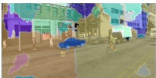
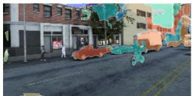
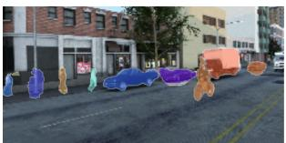
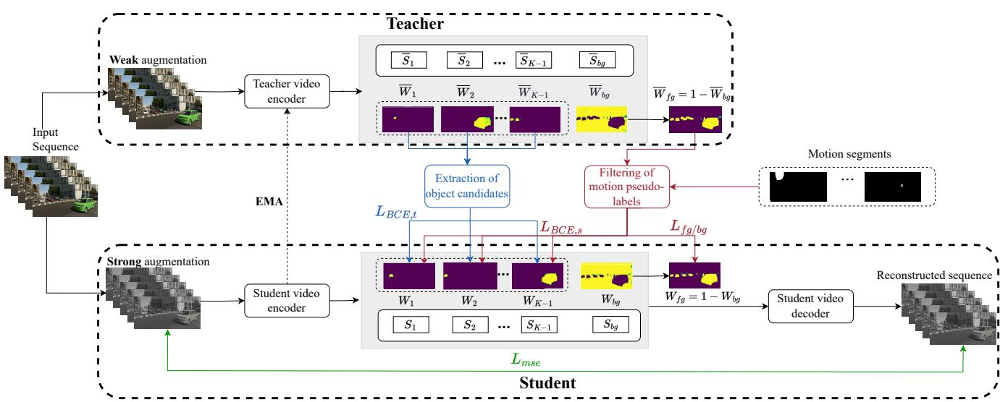
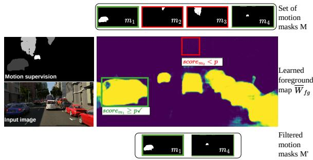
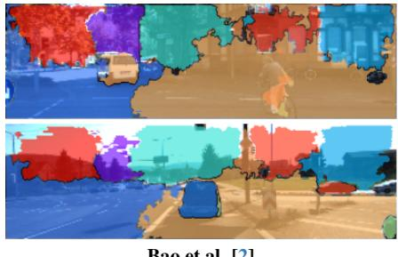
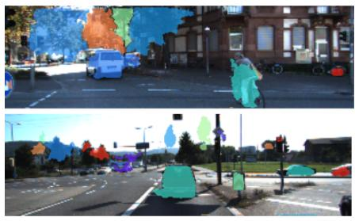
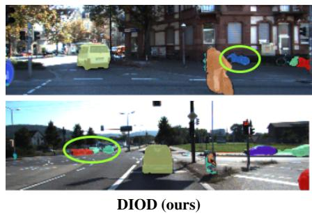
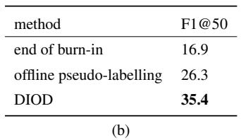

This CVPR paper is the Open Access version, provided by the Computer Vision Foundation. Except for this watermark, it is identical to the accepted version; the final published version of the proceedings is available on IEEE Xplore.

# DIOD: Self-Distillation Meets Object Discovery

Sandra Kara Hejer Ammar Julien Denize Florian Chabot Quoc-Cuong Pham

Universite Paris-Saclay, CEA, List, F-91120, Palaiseau, France´ {firstname.lastname}@cea.fr

## Abstract

Instance segmentation demands substantial labeling resources. This has prompted increased interest to explore the object discovery task as an unsupervised alternative. In particular, promising results were achieved in localizing instances using motion supervision only. However, the motion signal introduces complexities due to its inherent noise and sparsity, which constrains the effectiveness of current methodologies. In the present paper we propose DIOD (self DIstillation meets Object Discovery), the first method that places the motion-guided object discovery within a framework of continuous improvement through knowledge distillation, providing solutions to existing limitations (i) DIOD robustly eliminates the noise present in the exploited motion maps providing accurate motion-supervision (ii) DIOD leverages the discovered objects within an iterative pseudo-labeling framework, enriching the initial motion-supervision with static objects, which results in a cost-efficient increase in performance. Through experiments on synthetic and real-world datasets, we demonstrate the benefits of bridging the gap between object discovery and distillation, by significantly improving the stateof-the-art. This enhancement is also sustained across other demanding metrics so far reserved for supervised tasks. https://github.com/CEA-LIST/DIOD

## 1. Introduction

Successful supervised deep learning methods assume the availability of large annotated datasets. However, acquiring human annotations can be costly and time-consuming, especially for dense tasks such as segmentation. This has motivated researchers to propose alternative tasks to supervised approaches, aimed at reducing dependency on annotated data. These methods range from the use of easier-to-get annotations, also known as weak supervision [8, 16], to unsupervised methods leveraging self-supervised pre-training [37, 44], or low-level signals that could be acquired auto-

matically [9, 21].

  
Input image

  
Bao et al. [2]

  
BMOD [18]

  
DIOD (ours)  
Figure 1. Qualitative comparison of DIOD with previous methods. The illustration shows several difficult cases (small or/and static objects) that are correctly segmented in DIOD only. Other improvements such as precise object boundaries, noise suppression in non-object regions, can also be seen from the visualization.

Among these tasks, object discovery focuses on the localization, without human annotations, of objects present in the scene. The ambition to resolve this task in the image modality was challenged by the lack of a clear definition of objects [19, 41]. The transition to video data was then presented as a way of overcoming this problem by specifying the nature of the targeted objects: objects capable of moving [2]. Efforts were focused within this modality, and all aligned to explore the slot-attention paradigm [29], originally presented as the deep-learning based version of the k-means clustering algorithm [28]. The slot-attention architecture operates as an auto-encoder, utilizing attention mechanisms in the latent space to decompose input images into distinct components. These components aim to represent objects within the scene, encapsulated by embedding vectors called slots.

Variants of the slot-attention have subsequently emerged. These include scaling the model’s capacity to adapt to increasing complexity [2, 21], and reconstructing low-level signals closer to the targeted segmentation [9]. Recently, authors in [2, 3] demonstrated that a more explicit use of motion information to guide slots’ learning is the key to successful real-world object discovery, which opens an interesting research direction, namely motion guided object discovery (MGOD). The motion guidance signal in MGOD takes the form of masks of moving objects, produced by mapping optical flow maps to mobile instances on a synthetic dataset [32]. This process leads to a challenging noisy supervision: incomplete or merged objects and random segments within the background regions due to camera motion.

In parallel, learning from noisy/sparse labels (LNL) has been investigated in various vision tasks [26, 30, 47], with a recent focus on object detection and localization [5, 39, 43].

Thus, the objectives of the two previous tasks (LNL and object discovery) are increasingly converging: motionguided object discovery also utilizes noisy and sparse motion masks. Inspired by the previous observation, we propose in this work bridging the gap between the two tasks. Our insight is that such unification will yield valuable benefits: formulating MGOD as learning from noisy labels allows not only for the filtering of noise arising from optical flow maps (merged objects, noisy segments due to camera motion etc), but also for the recovery of captured objects, especially static ones. Indeed, the slot attention architecture, mostly used in MGOD, offers flexibility via empty slots, enabling the model’s attention to extend towards static objects. However, this generalization is limited by its sole reliance on semantic resemblance (between mobile and static objects). In this paper, we argue that the lack of static objects in the supervision signal makes their detection more challenging. To address this issue, we propose a method that continuously incorporates discovered objects into the supervision set.

Concretely, the recovery of the discovered objects is achieved by placing the slot attention mechanism into a knowledge distillation scheme. In the proposed teacherstudent architecture, we train a first motion-guided slot attention model (student) to activate objects instances within its attention maps. Simultaneously, a second model (teacher) computed as the moving average of the student, is used for inference only. The attentions of the two models are connected so as to enrich the attention of the student with the regions activated by its more stable variant: the teacher. Our contributions are summarized below:

• We formulate the motion-guided object discovery task as learning from noisy and sparse labels, investigating the under-studied connection between the two tasks: object discovery and LNL. Specifically, we propose for the first time, integrating the slot attention mechanism in a knowledge distillation scheme, and demonstrate the benefits of re-using the discovered objects to direct the model’s attention.

• We demonstrate that our method robustly handles the noise arising from the exploited optical flow maps, through the computation of instance-wise metrics that account for both precision and recall properties, so far reserved for supervised tasks.

• Experiments conducted on synthetic and real-world datasets show that our method yields a substantial improvement over the existing state-of-the-art, both on existing evaluation protocols and on new, more qualitydemanding metrics.

## 2. Related work

## 2.1. Unsupervised object discovery

First explored in the image modality, object discovery aims to localize objects without human supervision. Notable approaches include object proposal selection based on interimage similarities [41, 42], graph-based decomposition of self-supervised features from vision transformers [37, 44], and more recently, compositional generative models which encourage image decomposition into interpretable components, via part-based generation [4, 12, 17]. The preceding approaches all agree on the challenging aspect of discovering objects in the image modality, given the lack of a clear definition of what an object is.

This ambiguity is addressed by shifting to video data, supported by motion information: video-based methods aim to discover objects capable of moving [2, 3, 18]. In this category, the slot-attention paradigm has been very successful. Originally proposed for images, this auto-encoder architecture was first scaled to sequential data [21]. Its applicability to real scenes was improved by increasing the capacity of the encoder [2] and the decoder [38], while other variants investigated new reconstruction spaces [9, 20, 21]. Some recent works [2, 3] demonstrated the benefit of ex ploiting motion signal to direct the model’s attention towards object instances, but come with the limitation that objects cannot be differentiated from background segments. This problem was addressed in BMOD [18] which proposed a baseline for controlling the noisy segments, arising in nonobject regions. However, as BMOD operates in a single round with all the noisy labels treated equally, it results in a trade-off between capturing objects and attenuating noise.

In contrast, we propose in DIOD a robust handling of different types of noise encountered in motion supervision, inside a distillation process. This also enables the completion of the initial motion supervision with a category that was totally missing in previous MGOD: static objects.

## 2.2. Learning with noisy labels (LNL)

Studies on learning noise-resistant models are prevalent in the classification task [14, 22, 30]. A notable approach is to simultaneously train two models, with low-loss labels from one model considered as clean and used for training the second model [14, 48]. Simply discarding noisy data in previous methods, instead of rectifying the labels is a significant drawback as it can lead to a substantial reduction in the dataset size. Some approaches tackled this by re-annotating the noisy labels during training, following a semi-supervised scheme [23, 31]. An extension to object detection was proposed in [6] by adapting the co-teaching strategy to the dense task, where the loss is evaluated for each object separately. [24] then suggested the benefit of disentangling the two sub-tasks of object detection, namely classification and localization, and sequentially refined both labels. Some alternative approaches leverage a small subset of cleanly labeled data to refine noisy labels [46].

Recently, [5] emphasized that the localization task in LNL has not been as thoroughly explored as classification and introduced a dedicated benchmark for this task.

Our work fits into this research line, but differs in two aspects. (i) Unlike previous methods that artificially generate noise (e.g., shifted bounding boxes), our label noise mainly originates from physical factors such as camera motion, reflecting real-world applications. (ii) Label sparsity in our setting can not be simply considered a type of noise, as a whole category of objects are missing (static objects), making the addressed task more challenging. See next section.

## 2.3. Learning from sparse annotations

Sparsity of annotations can have different meanings depending on the addressed task [25, 39]. In sparsely annotated object detection, which is the closest to the problem we address, sparsity means that within the same image, certain regions are annotated while others are not. The objective is thus to differentiate objects from the background in the non-annotated regions.

Recently, there has been a growing interest in this task, driven by the recognition of how missing labels affect the performance of deep learning models [45]. Inspired by semi-supervised learning, the existing solutions leverage teacher-student architectures and progressively augment the labels using the most reliable predictions from the teacher. The teacher model is computed as the moving average (EMA) of the student, as described in [27] and the two models receive distinct views of the input image so as to reduce confirmation bias. Notable advancements, such as the standardization of the experimental protocol presented in [39] and the exploration of models that are insensitive to confidence thresholds [43], hint at a promising future for sparsely annotated object detection.

In our work, we draw inspiration from the previous methods in addressing the object discovery task. While demonstrating the benefits of DIOD for MGOD, we also introduce the distilled slot attention as a relevant approach to learning with sparse labels, since the noisy and sparse motion masks we use can be substituted with pseudo-labels from any sources. The capability to extend to missing objects, enabled by the empty slots, makes the distilled slot attention (DIOD) particularly suited to address this task.

## 3. Method

Our method, illustrated in figure 2, investigates the reintegration of objects discovered in motion-guided object discovery (MGOD) approaches, by placing these within a self-distillation framework. It involves a burn-in phase, followed by training a student model through knowledge distillation from a teacher model. The core architecture of both models is inspired by BMOD [18], the method with state-of-the-art results in background modeling for MGOD. However, this can be replaced with any MGOD method with background control. We briefly introduce in section 3.1 both MGOD and BMOD to provide context for our approach, which we describe in the subsequent sections.

## 3.1. Context: Background-aware MGOD

Motion-guided object discovery [2] introduces the use of motion information inside the slot attention architecture [29]. Specifically, these methods receive as input a sequence of T frames and extract a video representation $H ^ { t } \in$ Rh×w× $D _ { H }$ for each frame $I ^ { t }$ by cascading a feature extractor and a convGRU module. These features are duplicated and reduced to the dimension $D$ using two learnable linear projections k and v. Concurrently, K slots, acting as queries, are projected using q an other learnable transformation. The slots interact with and share the features $H ^ { t }$ through an attention mechanism: at each time step t, the similarity (attention) between the slots $S$ and the features is calculated as $\begin{array} { r } { W = \frac { 1 } { \sqrt { D } } k ( H ) \cdot q ( S ) \in \mathbb { R } ^ { N \times K } } \end{array}$ , where $N = h \times w$ . This attention is then used to calculate the state of the slots at the next time step $S ^ { t + 1 }$ . The attention maps W are further directed towards capturing object patterns through the use of a motion signal that takes the form of binary masks of moving objects, extracted from the optical flow. These are used to supervise specific slots’ attention maps among the K and the process is referred to as motionguided attention. In BMOD [18], authors pointed out the consequences of the lack of a proper background modeling in the previous methods, and proposed a baseline for background modeling. For this, they use the same motion supervision as above and propose to learn the true foreground map denoted $W _ { f g }$ composed of both moving and static objects. Specifically, the negative log likelihood loss is used to activate all objects contained in the M motion masks within the foreground map, while applying regularization to avoid the trivial solution of activating the entire $W _ { f g }$ map. This takes the form of average activation of $W _ { f g }$ in non-object regions only. The complementary mask $W _ { b g }$ , which naturally contains the background class, is placed as the attention of one specific slot to isolate its specific pattern.

  
Figure 2. Illustration of DIOD. Strong and weak views of the input sequence are provided to the student and teacher models respectively. Both models produce attention maps that are connected in a one-to-many configuration: each teacher’s attention map W is divided into connected regions, among which high-confidence predictions supervise many student’s attention maps W, through BCE loss. Similarly, filtered motion-derived masks are used to regularize the learning process. Binary masks are the only fixed pseudo-labels, while colored maps represent learnable attention maps. The background isolation process is the same as in [18].

In the following, we detail the integration of the previous method into the distillation framework proposed in DIOD, including the adjustments made for this purpose.

## 3.2. Burn-in stage

In the context of semi-supervised learning, burn-in refers to the phase preceding distillation training [27]. It entails the preparation of both the teacher and student models through training on the annotated data only. Since no human annotation is available in our unsupervised setting, both models are initialized by training on noisy motion masks extracted from optical flow (section A of the supplementary material provides more details on the generation of motion masks).

During this phase, we follow the same video sequence encoding as in MGOD methods [2, 18]. Also, we assume M available binary motion masks for each frame It. The attentions produced by the model are broadcasted into 2d maps and matched with the M motion masks via a Hungarian algorithm. Given a motion mask m and its associated attention map W, motion guidance is applied via a weighted Binary Cross Entropy (BCE) loss between the two, where the BCE weighting is intended to take account of the small size of the objects, relative to the size of the map [18].

Concurrently, we learn the foreground map $W _ { f g }$ in a slightly different way from BMOD [18]. In BMOD, the regularization enabling noise suppression is applied in nonobject regions only (regions that are not activated in the M masks), to not attenuate the objects contained within the motion masks. However, we recall that these masks are noisy (the noise takes the form of random segments arising in the static background). Thus, opting not to impose constraints on model confidence in these regions does not allow for robust noise suppression. The distillation proposed in DIOD provides increased flexibility, eliminating the need for a trade-off between noise suppression and object discovery: we apply regularization to the entire map $W _ { f g }$ (including regions activated in the M masks). The attenuation of some objects may occur but is not critical in our approach, since those will be recovered via the teacher model (refer to section 3.3). The background modeling in our approach is thus learned via the loss in eq.1 with α the regularization strength, and $m _ { f g }$ the sum of M binary motion masks.

$$
\begin{array} { c } { { \displaystyle - \jmath _ { f g / b g } ( m _ { f g } , W _ { f g } ) = \frac { 1 } { N } \sum _ { i = 1 } ^ { N } \left[ - m _ { f g } ( i ) \log \left( W _ { f g } ( i ) \right) \right. } } \\ { { \left. + \alpha W _ { f g } ( i ) \right] } } \end{array}\tag{1}
$$

Finally, following [2, 18], the sum of the K slots, each weighted by the corresponding attention map, is decoded to reconstruct the input image. The reconstruction is learned via the Mean Squared Error (MSE) loss between reconstructed and input sequence.

Unlike the classic semi-supervised setting, the burn-in phase in DIOD is applied using noisy segmentation labels. We examine in section 5.3 the effect of the burn-in duration under these limited label quality conditions.

## 3.3. Teacher-student training

## 3.3.1 Overview

At the end of the burn-in phase, the model is duplicated into a student model and a teacher model. Strong and weak augmentations of the input sequence are forwarded to the student and teacher models, respectively. Following the traditional distillation scheme, only the student is updated via gradient back-propagation, while the teacher is calculated as the exponential moving average (EMA) of the student [27]. During the training, the aim of our method is to enrich the student’s attention W by retrieving objects activated in the teacher’s attention; while filtering out the noisy segments using the teacher’s confidence. In the following, variables related to the teacher model will be denoted with an overbar (e.g. W refers to the teacher’s attention maps).

## 3.3.2 Connecting the attentions of the two models

At each time step t, we retrieve the objects captured by the teacher by applying an argmax operation across the $K$ attention maps $\overline { W } ^ { t }$ . We denote $\overline { { W ^ { \prime } } } ^ { t }$ the binarized teacher’s attention maps (the background map $\overline { { W _ { b g } ^ { \prime } } } ^ { t }$ is discarded).

One-to-one vs. one-to-many There are two ways of connecting the attentions of the two models: one-to-one, or one-to-many. The first setting means that each activated binary mask among $\overline { { W ^ { \prime } } } ^ { t }$ supervises one attention map of the student model. We observe that, under this configuration, the model progressively introduces a semantic bias: if several instances are activated within one teacher’s attention map, they are introduced to the student as a single object, causing the model to drift from instance segmentation to semantic segmentation, merging in particular nearby objects. This observation is supported by the ablation study in section $5 ,$ and suggests opting for the one-to-many configuration (one teacher’s attention map to many student’s attention maps). In this setting, each connected region (spatially adjacent set of activated pixels) in $\overline { { W ^ { \prime } } } ^ { t }$ is considered an object candidate.

Pseudo-label confidence We denote $C$ the set of all object candidates collected from the teacher attention maps. Among these, candidates with a high confidence score are selected to supervise the student attentions $W ^ { t }$ . Given an object candidate c and its source attention map $\overline { W }$ , this score is computed as the mean activation in $\overline { W }$ at positions where c is activated.

$$
s c o r e _ { c } = \frac { 1 } { \sum _ { i = 1 } ^ { N } c ( i ) } \sum _ { i = 1 } ^ { N } \overline { { W } } ( i ) \odot c ( i )\tag{2}
$$

Object candidates with scores above a predefined threshold $p$ are selected and fed to a Hungarian matching to associate them with the student’s attention maps. For an object c selected and associated with the student’s attention map $W$ , the loss related to the teacher’s pseudo-labeling, denoted $\mathit { L } _ { \mathit { B C E , t } } ,$ is defined as follows:

$$
\begin{array} { c l } { { \displaystyle { L _ { B C E , t } ( c , W ) = - \frac { 1 } { N } \sum _ { i = 1 } ^ { N } [ ( 1 + s c o r e _ { c } ) c ( i ) \log ( W ( i ) )  }  } } \\ { { \displaystyle {  + ( 1 - c ( i ) ) \log ( 1 - W ( i ) ) ] } } } \end{array}\tag{3}
$$

  
Figure 3. Utilizing the learned foreground attention $\overline { W } _ { f g }$ as an objectness map to filter out noisy motion segments, during training.

## 3.3.3 Training with two label sources

We described in the previous section the process of reusing the high-confidence teacher’s predictions. We note that these predictions are constantly changing during training, with the inherent risk of leading to confirmation bias. In this section, we focus on using the second source of pseudolabels - the initial set of M motion masks - as a form of regularization for the teacher-student training. Specifically, we propose to use this set preceded by a filtering of the noisy labels among the M. This brings the method closer to the successful learning schemes in sparsely-annotated object detection: leveraging an external set of fixed labels, along with a variable set of pseudo-labels produced by the teacher model. As in previous motion-guided object discovery methods, we assume access to a set of binary motion masks, with no confidence information. In order to infer this information, we propose to use the learned foreground attention map $\overline { W } _ { f g }$ as an objectness map, i.e. a confidence map on the presence of objects (see figure 3). A confidence score scor $e _ { m } ( m , \overline { { W } } _ { f g } )$ is calculated for each mask m as described in 3.3.2.

The set M of motion-masks used during the burn-in stage is replaced by $M ^ { \prime }$ , the set of motion-masks with a confidence score above $p .$ Each mask $m ^ { \prime } \in M ^ { \prime }$ is linked to an attention map $W$ of the student, and the associated loss is:

$$
\begin{array} { c } { { L _ { B C E , s } ( m ^ { \prime } , W ) = - \displaystyle \frac { 1 } { N } \sum _ { i = 1 } ^ { N } \left[ \left( 1 + s c o r e _ { m ^ { \prime } } \right) m ^ { \prime } ( i ) \log \left( W ( i ) \right) \right. } } \\ { { \left. + \left( 1 - m ^ { \prime } ( i ) \right) \log \left( 1 - W ( i ) \right) \right] } } \end{array}\tag{4}
$$

In both $L _ { B C E , t }$ and $L _ { B C E , s }$ , we replace the weighting based on object size, applied in the burn-in stage and in [18], with the teacher’s confidence assigned to each object candidate. This score becomes more indicative and reliable at this stage where the noise is being filtered.

The set $M ^ { \prime }$ of filtered motion masks is also used to calculate the objective function responsible for modeling the background $L _ { f g / b g } ( m _ { f g } ^ { \prime } , W _ { f g } )$ (refer to section 3.2 for the definition of the objective function).

Slots decoding is performed to reconstruct the input sequence as in burn-in stage. The global loss at each time step, used to optimise the teacher-student training is defined as:

$$
\begin{array} { l } { { \displaystyle { \cal L } _ { g l o b a l } = \frac { 1 } { M ^ { \prime } } \sum _ { 1 } ^ { M ^ { \prime } } { \cal L } _ { B C E , s } ( m ^ { \prime } , W ) + \frac { 1 } { C } \sum _ { 1 } ^ { C } { \cal L } _ { B C E , t } ( c , W ) } } \\ { { \displaystyle ~ + { \cal L } _ { f g / b g } ( m _ { f g } ^ { \prime } , W _ { f g } ) + { \cal L } _ { m s e } ( I ^ { t } , \hat { I } ^ { t } ) } } \end{array}\tag{5}
$$

Note the normalization by the number of objects (varies across frames) in the first two terms.

## 4. Experiments

## 4.1. Datasets

ParallelDomain (TRI-PD) [2] is a synthetic, photorealistic video dataset of driving scenarios, supplemented with several types of 2D and 3D annotations. Its varied and complex scenes provide a robust and challenging benchmark for the task of object discovery. In line with previous works, we trained our model on 924 scenes (without annotations) captured by 6 car-mounted cameras, then validated it on a separate test set of 51 video sequences.

KITTI [11] is a real-world dataset of road scenes and a well-known benchmark for various vision tasks. In our study, we trained the models on all available raw data (without annotations) and validated them on the instance segmentation subset, which consists of 200 frames.

MOVi[13] is a series of 5 multi-object synthetic video datasets (A-E) of increasing complexity. MOVi-E is the subset created by simulating random linear camera movements. It is composed of randomly moving rigid objects alongside static objects . In line with previous works, we evaluate our method on this benchmark using the standard MOVi-E training and test splits.

## 4.2. Metrics

fg-ARI is a standard metric in object discovery. It quantifies the similarity between predicted and ground truth clusterings. The $f g$ prefix denotes that the metric is calculated over foreground regions, which does not penalize the background over-segmentation issues observed in MGOD [18]. all-ARI was introduced in [18] to address the previous limitation. This metric encompasses background regions in the ARI computation. While this is an improvement, we believe it remains insufficient due to another inherent bias in ARI: being a pixel-wise metric, the ARI inherently favors accurate segmentation of larger objects since correctly clustering numerous pixels from such objects disproportionately increases the score.

F1@50 metric is the harmonic mean of precision and recall. A predicted mask is considered a true positive if its overlap with a ground truth mask exceeds 50% [10]. We propose employing this metric for object discovery, motivated by two key properties: (i) it inherently normalizes object sizes; and (ii) it effectively penalizes the background oversegmentation—a growing concern in recent studies—by treating each random background segment as a false positive. This second property is lacking in metrics like mIOU, which at most count the background mask once, with some versions not including it in the computation.

## 4.3. Implementation details

The model received video sequences of length $T = 5$ for TRI-PD and KITTI datasets, and $T = 6$ for MOVI-E. We used a ResNet-18 [15] backbone for image encoding and the number of slots was set to 45, 45, 24 with TRI-PD, KITTI, and MOVI-E, respectively. The teacher model is updated at each iteration with the EMA of the student model as described in [27], with a keeping rate 0.996, and the teacher’s predictions are filtered with a confidence threshold $p = 0 . 9 .$ Additional implementation details are provided in section A of the supplementary material.

Using self-supervised features from DINOv2 pretraining [33]. We denote this test DIOD\*. In this setting, we replace the encoder with a DINOv2 pre-trained ViT-S-14. We resize input frames to be compatible with the patch size of 14, and utilize multi-scale features by concatenating outputs from the encoder’s last four layers. To compensate for the resolution drop due to the high patch size (14), we up-sample the feature maps to the size yielded by the ResNet encoder in the base setting.

## 4.4. Accurate segmentation over foreground regions

In this section we evaluate the performance of object localization in foreground regions, using the fg-ARI metric, described in section 4.2. The results in table 1 and 2 show a significant improvement achieved by DIOD over state-ofthe-art methods, especially under the challenging complexity of real-world scenes (qualitative results under this setting are presented in figures 1 and 4). The gain in performance is explained in particular by DIOD’s capacity to re-integrate discovered objects during training, and among them static objects which enrich the motion guidance signal. The gap is further widened with the use of DINOv2 self-supervised pre-training, demonstrating the scalability of DIOD, which benefits from an enriched feature space.

## 4.5. Segmentation performance on the entire image

In this section, we assess object discovery performance on the entire image, with regard to both recall (sensitivity to the presence of objects) and precision (absence of noisy segments). We compare DIOD with top leading MGOD methods using all-ARI and F1@50 metrics, both discussed in section 4.2. The results in table 3 show a clear superiority of DIOD in both metrics demonstrating its ability to retrieve foreground objects, while robustly limiting the noise observed in previous methods, particularly in the background regions. This handling of false predictions is explained by the filtering process, based on the model confidence, of the two sources of pseudo-labels involved in training. Note that the distillation process brings this gain in performance without any additional cost of annotation. We also observe that the two metrics exhibit distinct ranges, with all-ARI tending to have higher values. This is related to the pixel-wise vs. instance-wise score discussed in 4.2. Normalization by object size in F1 gives equal weight to all objects, preventing the largest ones from prevailing in the final score.

Bao et al. [2]  

  
BMOD [18]

  
Figure 4. Qualitative comparison of DIOD with previous methods in real-world scenes (KITTI [11]). Each colored mask represents the content of one slot. The green ellipse highlights difficult cases (small or/and static objects) that are correctly segmented in DIOD only.

<table><tr><td>Guidance signal</td><td>Method</td><td>TRI-PD</td><td>KITTI</td></tr><tr><td rowspan="6"></td><td>SlotAttention [2, 29]</td><td>10.2</td><td>13.8</td></tr><tr><td>MONet [2, 4]</td><td>11.0</td><td>14.9</td></tr><tr><td>SCALOR [2, 17]</td><td>18.6</td><td>21.1</td></tr><tr><td>IODINE [2, 12]</td><td>9.8</td><td>14.4</td></tr><tr><td>MCG [2, 34]</td><td>25.1</td><td>40.9</td></tr><tr><td>STEVE [3, 38]</td><td></td><td>11.9</td></tr><tr><td rowspan="2">optical flow</td><td>SAVI [3, 21]</td><td></td><td>20.0</td></tr><tr><td>PPMP [20]</td><td></td><td>51.9</td></tr><tr><td>flow + depth</td><td>SAVI++ [3, 9]</td><td>-</td><td>23.9</td></tr><tr><td rowspan="6">motion masks</td><td>Bao et al. [2]</td><td>50.9</td><td>47.1</td></tr><tr><td>MoTok [3]</td><td>55.1</td><td>64.4</td></tr><tr><td>BMOD [18]</td><td>53.9</td><td>54.7</td></tr><tr><td>DIOD</td><td>66.1</td><td>73.5</td></tr><tr><td>BMOD* [18]</td><td>58.5</td><td>60.8</td></tr><tr><td>DIOD*</td><td>69.7</td><td>72.3</td></tr></table>

Table 1. Evaluation of object discovery performance over foreground regions using fg-ARI metric, on TRI-PD and KITTI test sets. X\* refers to the method X + DINOv2 pre-training [33].
<table><tr><td>Use of pre-training</td><td>Method</td><td>+Modality</td><td>Fg-ARI</td></tr><tr><td rowspan="6"></td><td>SAVI [21]</td><td>Flow</td><td>39.2</td></tr><tr><td>SAVI++ [9]</td><td>Sparse Depth</td><td>41.3</td></tr><tr><td>PPMP [20]</td><td>Flow</td><td>63.1</td></tr><tr><td>MoToK [3]</td><td>Motion Seg.</td><td>66.7</td></tr><tr><td>STEVE [38]</td><td></td><td>54.1</td></tr><tr><td>DINOSAUR[36]</td><td></td><td>65.1</td></tr><tr><td>DINO DINO</td><td>VideoSAUR[49]</td><td>一</td><td>78.4</td></tr><tr><td></td><td>Safadoust et al.[35]</td><td>GT Flow</td><td>78.3</td></tr><tr><td>DINOv2</td><td>SLOV[1]</td><td></td><td>80.8</td></tr><tr><td>DINOv2</td><td>DIOD*</td><td>Motion Seg.</td><td>82.2</td></tr></table>

Table 2. Object Discovery results on MOVi-E dataset. Methods are separated into two categories: with and w/o use of pre-training

<table><tr><td rowspan="2">Guidance signal</td><td rowspan="2">Method</td><td colspan="2">TRI-PD</td><td colspan="2">KITTI</td></tr><tr><td>all-ARI</td><td>F1@50</td><td>all-ARI</td><td>F1@50</td></tr><tr><td rowspan="6">motion masks</td><td>Bao et al. [2]</td><td>6.3</td><td>12.2</td><td>4.2</td><td>8.8</td></tr><tr><td>MoTok [3]</td><td>4.7</td><td>12.6</td><td>2.1</td><td>8.2</td></tr><tr><td>BMOD [18]</td><td>28.6</td><td>14.4</td><td>17.8</td><td>9.3</td></tr><tr><td>DIOD</td><td>70.3</td><td>35.4</td><td>61.6</td><td>18.0</td></tr><tr><td>BMOD*[18]</td><td>29.1</td><td>16.3</td><td>21.7</td><td>10.9</td></tr><tr><td>DIOD*</td><td>74.1</td><td>41.5</td><td>81.6</td><td>23.2</td></tr></table>

Table 3. Object discovery performance on the entire image using F1@50 and all-ARI metrics, on TRI-PD and KITTI test sets.

## 5. Ablation studies and further analysis

## 5.1. Investigating design choices

One-to-one vs. one-to-many configurations in connecting teacher and student attentions have been described in section 3.3.2. We conduct this study to verify the observation that the model shifts towards semantic segmentation in the one-to-one configuration. Table 4 (a) (row 1) indicates that this leads to a decrease in the F1@50 score, confirming the superiority of the one-to-many configuration in DIOD.

The use of motion supervision during teacher-student training is intuitive, since these are the only fixed pseudolabels supplied to the model and thus serve as regularization. We conduct this study to verify the previous statement, using only the teacher’s pseudo-labels during the distillation phase. As shown in table 4 (a) (row 2), this results in a drop in the F1 score, suggesting the importance of regularizing the distillation scheme with fixed labels.

<table><tr><td>method</td><td>F1@50</td></tr><tr><td>one-to-one connection</td><td>30.2</td></tr><tr><td>DIOD (w/o motion masks)</td><td>17.8</td></tr><tr><td>DIOD (final setting)</td><td>35.4</td></tr><tr><td>(a)</td><td></td></tr></table>

<table><tr><td rowspan="2"></td><td colspan="3">burn-in duration (epochs)</td></tr><tr><td>200</td><td>300</td><td>400</td></tr><tr><td rowspan="3">0.2 α 0.3</td><td>12.7 →29.3</td><td>15.5 →26.2</td><td>15.6 → 23.6</td></tr><tr><td>14.6→30.7</td><td>17.2 →33.9</td><td>16.9 →35.4</td></tr><tr><td>0.4 15.5 →32.7</td><td>17.1 → 33.5</td><td>18.8 → 33.7</td></tr></table>

(c)  
Table 4. Ablation studies and further analysis (conducted on the test set of TRI-PD [2]). (a) Investigation of DIOD’s design choices (row 1: one-to-one vs. one-to-many, row 2: w/o use of motion masks). (b) Highlighting the continuous improvement provided by DIOD vs. classic pseudo-labeling. (c) Joint analysis of the burn-in duration and regularization strength α: each cell displays two F1@50 scores, the first in black is the score at the end of the burn-in stage, and the second in blue is the result after teacher-student training (500 epochs).

## 5.2. Distillation vs. offline pseudo-labeling

In this section, we aim to evaluate the contribution made by DIOD, compared with an offline pseudo-labeling, i.e. using the predictions produced at the end of the burn-in as new supervision. To this end, we used the same noise filtering as in DIOD, but disabled the teacher-student scheme (studying only the effect of continuous improvement). We run the training for the same duration of 500 epochs. The limited results of offline pseudo-labeling compared to our distilled slot attention (table 4 (b)) demonstrate the continuous and efficient improvement provided by DIOD (in only one run).

## 5.3. Influence of regularization and burn-in

In this section, we jointly study two related hyperparameters of the proposed method: burn-in duration and regularization strength α. Burn-in can be more or less beneficial depending on the noise attenuation strength (α), as shown in table 4 (c). Overall, we see that for all pairs of tested values, the distillation phase brings a clear F1@50 score improvement, ranging from +8% to +18%. We also note that at low regularization (row 1), the model does not benefit from a longer burn-in; on the contrary, performance deteriorates with increasing burn-in, due to the recovery of noise that has been only slightly attenuated (low α). This notably affects the precision measure included in the F1 score. By attenuating the noise more strongly (higher α, rows 2-3), this tendency is reversed, and the model benefits from a longer preparation time, since this enables a more useful signal to be recovered. Finally, we note that at high values of α (row 3), the improvement brought by distillation saturates, and this is justified by the strong noise attenuation that could also attenuate small or hard-to-capture objects, affecting in this case the recall measure. Overall, α = 0.3 and a burn-in lasting 400 epochs seems to provide a good precision-recall trade-off, reflected by the F1@50 score.

## 6. Limitations and future directions

The regularization value required to learn the foreground attention map is studied as a hyper-parameter of the method. However, the optimal value of the regularization strength is not necessarily identical across all frames. Future research would benefit from a dynamic regularization that adjusts according to the content of each frame. For instance, this adjustment could be based on the image entropy, building on the assumption that lower entropy correlates with larger background regions, requiring a higher regularization.

Precise confidence score for filtering teacher’s predictions is crucial in distillation. While it is intuitive to calculate this score as the average activation across the discovered mask, future research would benefit from considering a more refined computation that accounts for the object completeness in addition to the semantics. Potentially by learning an Intersection over Union (IoU)-like score, by comparing predicted and motion-derived masks during training.

## 7. Conclusion

In this work, we proposed a new approach that unifies motion-guided object discovery and learning from noisy labels. This study is driven by the overlapping objectives of these tasks, coupled with an insight into the valuable benefits this may provide. Specifically, we placed the slot attention mechanism, widely used in object discovery, within a knowledge distillation framework, which we also called distilled slot attention. The proposed approach has proved effective for motion-guided object discovery, achieving a significant gain in performance, both on conventional evaluation criteria and on more challenging instance-wise metrics. Beyond object discovery, distilled slot attention refines noisy and sparse pseudo-labels into a more accurate and fine-grained video segmentation, with proper background separation, thus providing a relevant approach to instance segmentation with noisy labels. Considering the highly promising results, future research may explore a more explicit incorporation of motion maps into the training process, enabling end-to-end motion-guided object discovery.

## 8. Acknowledgements

This work benefited from the FactoryIA supercomputer financially supported by the Ile-deFrance Regional Council.

## References

[1] Gorkay Aydemir, Weidi Xie, and Fatma Guney. Self-¨ supervised object-centric learning for videos. In NeurIPS, 2023. 7

[2] Zhipeng Bao, Pavel Tokmakov, Allan Jabri, Yu-Xiong Wang, Adrien Gaidon, and Martial Hebert. Discorying object that can move. In CVPR, 2022. 1, 2, 3, 4, 6, 7, 8, 12, 13, 14

[3] Zhipeng Bao, Pavel Tokmakov, Yu-Xiong Wang, Adrien Gaidon, and Martial Hebert. Object discovery from motionguided tokens. In CVPR, 2023. 2, 7, 12, 13

[4] Christopher P Burgess, Loic Matthey, Nicholas Watters, Rishabh Kabra, Irina Higgins, Matt Botvinick, and Alexander Lerchner. Monet: Unsupervised scene decomposition and representation. arXiv preprint arXiv:1901.11390, 2019. 2, 7

[5] Andreas Bar, Jonas Uhrig, Jeethesh Pai Umesh, Marius¨ Cordts, and Tim Fingscheidt. A novel benchmark for refinement of noisy localization labels in autolabeled datasets for object detection. In 2023 IEEE/CVF Conference on Computer Vision and Pattern Recognition Workshops (CVPRW), pages 3851–3860, 2023. 2, 3

[6] Simon Chadwick and Paul Newman. Training object detectors with noisy data. In 2019 IEEE Intelligent Vehicles Symposium (IV), pages 1319–1325. IEEE, 2019. 3

[7] A. Dave, P. Tokmakov, and D. Ramanan. Towards segmenting anything that moves. In 2019 IEEE/CVF International Conference on Computer Vision Workshop (ICCVW), pages 1493–1502, Los Alamitos, CA, USA, 2019. IEEE Computer Society. 12

[8] Ye Du, Zehua Fu, Qingjie Liu, and Yunhong Wang. Weakly supervised semantic segmentation by pixel-to-prototype contrast. In Proceedings of the IEEE Conference on Computer Vision and Pattern Recognition, 2022. 1

[9] Gamaleldin F. Elsayed, Aravindh Mahendran, Sjoerd van Steenkiste, Klaus Greff, Michael C. Mozer, and Thomas Kipf. SAVi++: Towards end-to-end object-centric learning from real-world videos. In Advances in Neural Information Processing Systems, 2022. 1, 2, 7

[10] Adam Van Etten. You only look twice: Rapid multi-scale object detection in satellite imagery. ArXiv, abs/1805.09512, 2018. 6

[11] Andreas Geiger, Philip Lenz, Christoph Stiller, and Raquel Urtasun. Vision meets robotics: The kitti dataset. International Journal ofRobotics Research (IJRR), 2013. 6, 7

[12] Klaus Greff, Raphael Lopez Kaufman, Rishabh Kabra, Nick¨ Watters, Christopher Burgess, Daniel Zoran, Loic Matthey, Matthew Botvinick, and Alexander Lerchner. Multi-object representation learning with iterative variational inference. In International Conference on Machine Learning, pages 2424–2433. PMLR, 2019. 2, 7

[13] Klaus Greff, Francois Belletti, Lucas Beyer, Carl Doersch, Yilun Du, Daniel Duckworth, David J Fleet, Dan Gnanapragasam, Florian Golemo, Charles Herrmann, Thomas Kipf, Abhijit Kundu, Dmitry Lagun, Issam Laradji, Hsueh-Ti (Derek) Liu, Henning Meyer, Yishu Miao, Derek Nowrouzezahrai, Cengiz Oztireli, Etienne Pot, Noha Radwan, Daniel Rebain, Sara Sabour, Mehdi S. M. Sajjadi,

Matan Sela, Vincent Sitzmann, Austin Stone, Deqing Sun, Suhani Vora, Ziyu Wang, Tianhao Wu, Kwang Moo Yi, Fangcheng Zhong, and Andrea Tagliasacchi. Kubric: a scalable dataset generator. 2022. 6

[14] Bo Han, Quanming Yao, Xingrui Yu, Gang Niu, Miao Xu, Weihua Hu, Ivor Wai-Hung Tsang, and Masashi Sugiyama. Co-teaching: Robust training of deep neural networks with extremely noisy labels. In Neural Information Processing Systems, 2018. 2, 3

[15] Kaiming He, X. Zhang, Shaoqing Ren, and Jian Sun. Deep residual learning for image recognition. 2016 IEEE Conference on Computer Vision and Pattern Recognition (CVPR), pages 770–778, 2015. 6

[16] Cheng-Chun Hsu, Kuang-Jui Hsu, Chung-Chi Tsai, Yen-Yu Lin, and Yung-Yu Chuang. Weakly supervised instance segmentation using the bounding box tightness prior. In Advances in Neural Information Processing Systems. Curran Associates, Inc., 2019. 1

[17] Jindong Jiang, Sepehr Janghorbani, Gerard de Melo, and Sungjin Ahn. Scalor: Generative world models with scalable object representations. In International Conference on Learning Representations, 2019. 2, 7

[18] Sandra Kara, Hejer Ammar, Florian Chabot, and Quoc-Cuong Pham. The background also matters: Backgroundaware motion-guided objects discovery. arXiv:2311.02633, 2023. 1, 2, 3, 4, 5, 6, 7, 12, 13

[19] Sandra Kara, Hejer Ammar, Florian Chabot, and Quoc-Cuong Pham. Image segmentation-based unsupervised multiple objects discovery. In 2023 IEEE/CVF Winter Conference on Applications of Computer Vision (WACV), pages 3276–3285, Los Alamitos, CA, USA, 2023. IEEE Computer Society. 1

[20] Laurynas Karazija, Subhabrata Choudhury, Iro Laina, Christian Rupprecht, and Andrea Vedaldi. Unsupervised multiobject segmentation by predicting probable motion patterns. Advances in Neural Information Processing Systems, 35: 2128–2141, 2022. 2, 7

[21] Thomas Kipf, Gamaleldin F. Elsayed, Aravindh Mahendran, Austin Stone, Sara Sabour, Georg Heigold, Rico Jonschkowski, Alexey Dosovitskiy, and Klaus Greff. Conditional Object-Centric Learning from Video. In International Conference on Learning Representations (ICLR), 2022. 1, 2, 7

[22] Junnan Li, Yongkang Wong, Qi Zhao, and Mohan S Kankanhalli. Learning to learn from noisy labeled data. In Proceedings of the IEEE/CVF conference on computer vision and pattern recognition, pages 5051–5059, 2019. 2

[23] Junnan Li, Richard Socher, and Steven C.H. Hoi. Dividemix: Learning with noisy labels as semi-supervised learning. In International Conference on Learning Representations, 2020. 3

[24] Junnan Li, Caiming Xiong, Richard Socher, and Steven C. H. Hoi. Towards noise-resistant object detection with noisy annotations. ArXiv, abs/2003.01285, 2020. 3

[25] Z. Liang, T. Wang, X. Zhang, J. Sun, and J. Shen. Tree energy loss: Towards sparsely annotated semantic segmentation. In 2022 IEEE/CVF Conference on Computer Vision

and Pattern Recognition (CVPR), pages 16886–16895, Los Alamitos, CA, USA, 2022. IEEE Computer Society. 3

[26] Sheng Liu, Kangning Liu, Weicheng Zhu, Yiqiu Shen, and Carlos Fernandez-Granda. Adaptive early-learning correction for segmentation from noisy annotations. In Proceedings of the IEEE/CVF Conference on Computer Vision and Pattern Recognition, pages 2606–2616, 2022. 2

[27] Yen-Cheng Liu, Chih-Yao Ma, Zijian He, Chia-Wen Kuo, Kan Chen, Peizhao Zhang, Bichen Wu, Zsolt Kira, and Peter Vajda. Unbiased teacher for semi-supervised object detection. In International Conference on Learning Representations, 2021. 3, 4, 5, 6

[28] Stuart Lloyd. Least squares quantization in pcm. IEEE transactions on information theory, 28(2):129–137, 1982. 1

[29] Francesco Locatello, Dirk Weissenborn, Thomas Unterthiner, Aravindh Mahendran, Georg Heigold, Jakob Uszkoreit, Alexey Dosovitskiy, and Thomas Kipf. Objectcentric learning with slot attention. In Advances in Neural Information Processing Systems, pages 11525–11538. Curran Associates, Inc., 2020. 1, 3, 7

[30] Nagarajan Natarajan, Inderjit S Dhillon, Pradeep K Ravikumar, and Ambuj Tewari. Learning with noisy labels. In Advances in Neural Information Processing Systems. Curran Associates, Inc., 2013. 2

[31] Duc Tam Nguyen, Chaithanya Kumar Mummadi, Thi-Phuong-Nhung Ngo, Thi Hoai Phuong Nguyen, Laura Beggel, and Thomas Brox. SELF: learning to filter noisy labels with self-ensembling. In 8th International Conference on Learning Representations, ICLR 2020, Addis Ababa, Ethiopia, April 26-30, 2020. OpenReview.net, 2020. 3

[32] N.Mayer, E.Ilg, P.Hausser, P.Fischer, D.Cremers,¨ A.Dosovitskiy, and T.Brox. A large dataset to train convolutional networks for disparity, optical flow, and scene flow estimation. In IEEE International Conference on Computer Vision and Pattern Recognition (CVPR), 2016. arXiv:1512.02134. 2, 12

[33] Maxime Oquab, Timoth’ee Darcet, Theo Moutakanni,´ Huy Q. Vo, Marc Szafraniec, Vasil Khalidov, Pierre Fernandez, Daniel Haziza, Francisco Massa, Alaaeldin El-Nouby, Mahmoud Assran, Nicolas Ballas, Wojciech Galuba, Russ Howes, Po-Yao (Bernie) Huang, Shang-Wen Li, Ishan Misra, Michael G. Rabbat, Vasu Sharma, Gabriel Synnaeve, Huijiao Xu, Herve J´ egou, Julien Mairal, Patrick Labatut, Armand´ Joulin, and Piotr Bojanowski. Dinov2: Learning robust visual features without supervision. ArXiv, abs/2304.07193, 2023. 6, 7

[34] Jordi Pont-Tuset, Pablo Arbelaez, Jonathan T Barron, Ferran Marques, and Jitendra Malik. Multiscale combinatorial grouping for image segmentation and object proposal generation. IEEE transactions on pattern analysis and machine intelligence, 39(1):128–140, 2016. 7

[35] Sadra Safadoust and Fatma Guney. Multi-object discovery¨ by low-dimensional object motion. In ICCV, pages 734–744, 2023. 7

[36] Maximilian Seitzer, Max Horn, Andrii Zadaianchuk, Dominik Zietlow, Tianjun Xiao, Carl-Johann Simon-Gabriel, Tong He, Zheng Zhang, Bernhard Scholkopf, Thomas Brox,

and Francesco Locatello. Bridging the gap to real-world object-centric learning. ArXiv, abs/2209.14860, 2022. 7

[37] Oriane Simeoni, Gilles Puy, Huy V. Vo, Simon Roburin,´ Spyros Gidaris, Andrei Bursuc, Patrick Perez, Renaud Mar-´ let, and Jean Ponce. Localizing objects with self-supervised transformers and no labels. 2021. 1, 2

[38] Gautam Singh, Yi-Fu Wu, and Sungjin Ahn. Simple unsupervised object-centric learning for complex and naturalistic videos. In Advances in Neural Information Processing Systems, pages 18181–18196. Curran Associates, Inc., 2022. 2, 7

[39] Saksham Suri, Saketh Rambhatla, Rama Chellappa, and Abhinav Shrivastava. Sparsedet: Improving sparsely annotated object detection with pseudo-positive mining. In Proceedings of the IEEE/CVF International Conference on Computer Vision (ICCV), pages 6770–6781, 2023. 2, 3

[40] Zachary Teed and Jia Deng. Raft: Recurrent all-pairs field transforms for optical flow. In Computer Vision–ECCV 2020: 16th European Conference, Glasgow, UK, August 23– 28, 2020, Proceedings, Part II 16, pages 402–419. Springer, 2020. 12

[41] Huy V Vo, Patrick Perez, and Jean Ponce. Toward unsu-´ pervised, multi-object discovery in large-scale image collections. In European Conference on Computer Vision, pages 779–795. Springer, 2020. 1, 2

[42] Huy V. Vo, Elena Sizikova, Cordelia Schmid, Patrick Perez,´ and Jean Ponce. Large-scale unsupervised object discovery. In Advances in Neural Information Processing Systems 35 (NeurIPS), 2021. 2

[43] Haohan Wang, Liang Liu, Boshen Zhang, Jiangning Zhang, Wuhao Zhang, Zhenye Gan, Yabiao Wang, Chengjie Wang, and Haoqian Wang. Calibrated teacher for sparsely annotated object detection. In Thirty-Seventh AAAI Conference on Artificial Intelligence, AAAI 2023, Thirty-Fifth Conference on Innovative Applications of Artificial Intelligence, IAAI 2023, Thirteenth Symposium on Educational Advances in Artificial Intelligence, EAAI 2023, Washington, DC, USA, February 7-14, 2023, pages 2519–2527. AAAI Press, 2023. 2, 3

[44] Yangtao Wang, Xi Shen, Shell Xu Hu, Yuan Yuan, James L. Crowley, and Dominique Vaufreydaz. Self-supervised transformers for unsupervised object discovery using normalized cut. In Conference on Computer Vision and Pattern Recognition. 1, 2

[45] Mengmeng Xu, Yancheng Bai, and Bernard Ghanem. Missing labels in object detection. In CVPR Workshops, 2019. 3

[46] Youjiang Xu, Linchao Zhu, Yi Yang, and Fei Wu. Training robust object detectors from noisy category labels and imprecise bounding boxes. IEEE Transactions on Image Processing, 30:5782–5792, 2021. 3

[47] Shuquan Ye, Dongdong Chen, Songfang Han, and Jing Liao. Learning with noisy labels for robust point cloud segmentation. In Proceedings of the IEEE/CVF international conference on computer vision, pages 6443–6452, 2021. 2

[48] Xingrui Yu, Bo Han, Jiangchao Yao, Gang Niu, Ivor Wai-Hung Tsang, and Masashi Sugiyama. How does disagree-

ment help generalization against label corruption? In International Conference on Machine Learning, 2019. 3

[49] Andrii Zadaianchuk, Maximilian Seitzer, and Georg Martius. Object-centric learning for real-world videos by predicting temporal feature similarities. In NeurIPS, 2023. 7