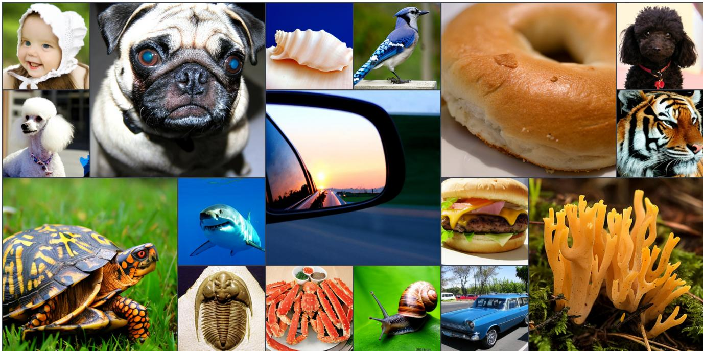
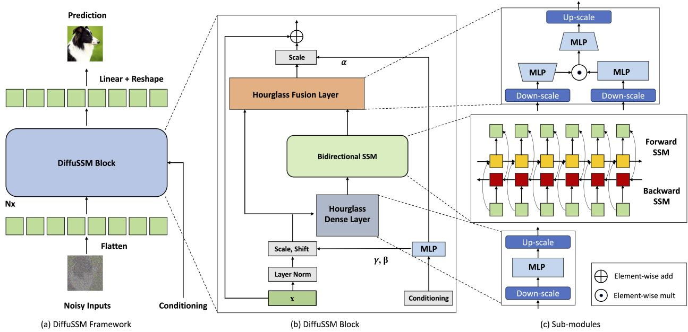
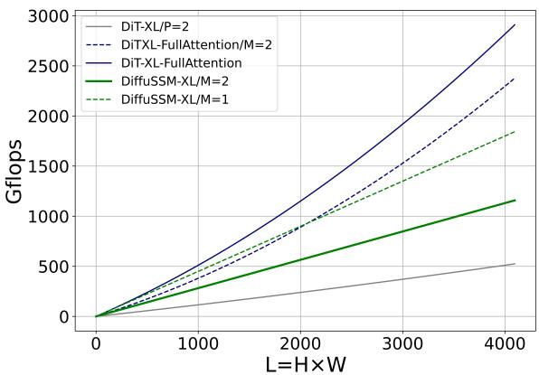
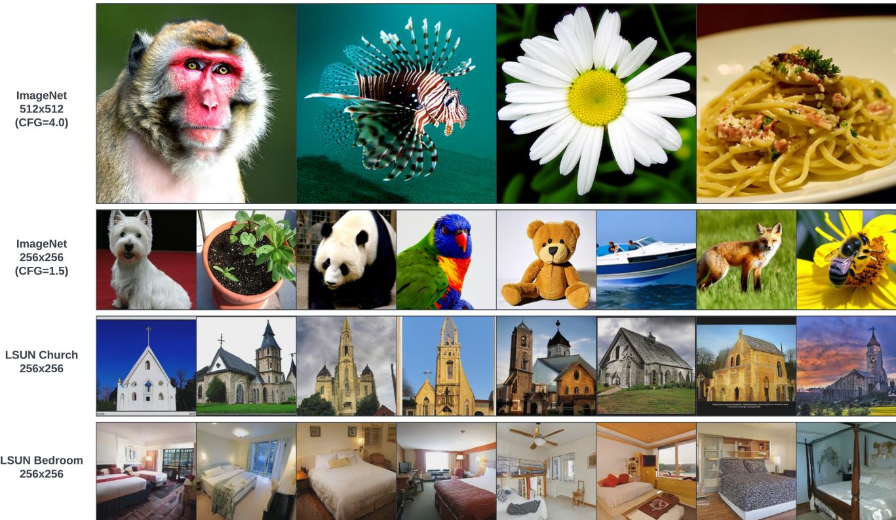
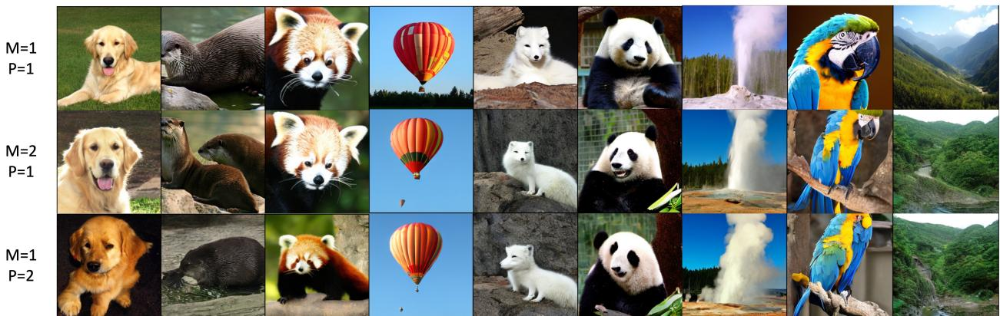
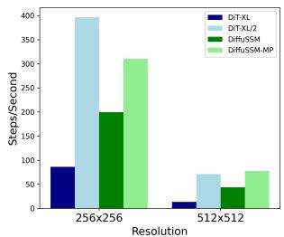
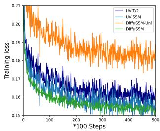

# Diffusion Models Without Attention

Jing Nathan Yan1∗, Jiatao Gu2∗, Alexander M. Rush1 1Cornell University, 2Apple {jy858, arush}@cornell.edu, jgu32@apple.com

  
Figure 1. Selected samples generated by class-conditional DIFFUSSM trained on ImageNet 256 × 256 and 512 × 512 resolutions.

## Abstract

In recent advancements in high-fidelity image generation, Denoising Diffusion Probabilistic Models (DDPMs) have emerged as a key player. However, their application at high resolutions presents significant computational challenges. Current methods, such as patchifying, expedite processes in UNet and Transformer architectures but at the expense of representational capacity. Addressing this, we introduce the Diffusion State Space Model (DIFFUSSM), an architecture that supplants attention mechanisms with a more scalable state space model backbone. This approach effectively handles higher resolutions without resorting to global compression, thus preserving detailed image representation throughout the diffusion process. Ourfocus on FLOP-efficient architectures in diffusion training marks a significant stepforward. Comprehensive evaluations on both ImageNet and LSUN

datasets at two resolutions demonstrate that DiffuSSMs are on par or even outperform existing diffusion models with attention modules in FID and Inception Score metrics while significantly reducing total FLOP usage.

## 1. Introduction

Rapid progress in image generation has been driven by denoising diffusion probabilistic models (DDPMs) [8, 22, 39]. DDPMs pose the generative process as iteratively denoising latent variables, yielding high-fidelity samples when enough denoising steps are taken. Their ability to capture complex visual distributions makes DDPMs promising for advancing high-resolution, photorealistic synthesis.

However, significant computational challenges remain in scaling DDPMs to higher resolutions. A major bottleneck is the reliance on self-attention [64] for high-fidelity generation. In U-Nets architectures, this bottleneck comes from combining ResNet [19] with attention layers [50, 63]. DDPMs surpass generative adversarial networks (GANs) but require multi-head attention layers [8, 39]. In Transformer architectures [64], attention is the central component and is therefore critical for achieving recent state-of-the-art image synthesis results [1, 40]. In both these architectures, the complexity of attention, quadratic in length, becomes prohibitive when working with high-resolution images.

  
Figure 2. Architecture of DIFFUSSM. DIFFUSSM takes a noised image representation which can be a noised latent from a variational encoder, flattens it to a sequence, and applies repeated layers alternating long-range SSM cores with hour-glass feed-forward networks. Unlike with U-Nets or Transformers, there is no application of patchification or scaling for the long-range block.

Computational costs have motivated the use of representation compression methods. High-resolution architectures generally employ patchifying [1, 40], or multi-scale resolution[22, 24, 39]. Patchifying creates coarse-grained representations which reduces computation at the cost of degraded critical high-frequency spatial information and structural integrity [1, 40, 53]. Multi-scale resolution, while alleviating computation at attention layers, can diminish spatial details through downsampling [70] and can introduce artifacts [67] while applying up-sampling.

The Diffusion State Space Model (DIFFUSSM), is an attention-free diffusion architecture, shown in Figure 2, that aims to circumvent the issues of applying attention for highresolution image synthesis. DIFFUSSM utilizes a gated state space model (SSM) backbone in the diffusion process. Previous work has shown that sequence models based on SSMs are an effective and efficient general-purpose neural sequence model [16]. By using this architecture, we can enable the SSM core to process finer-grained image representations by removing global patchification or multi-scale layers. To further improve efficiency, DIFFUSSM employs an hourglass architecture for the dense components of the network. Together these approaches target the asymptotic complexity of length as well as the practical efficiency in the position-wise portion of the network.

We validate DIFFUSSM’s across different resolutions. Experiments on ImageNet demonstrate consistent improvements in FID, sFID, and Inception Score over existing approaches in various resolutions with fewer total Gflops. All models from this work will be available open-source (Apache 2.0 license) upon release.

## 2. Related Work

Diffusion Models Denoising Diffusion Probabilistic Models (DDPMs) [22, 24, 39, 56] are an advancement in the diffusion models family. Previously, Generative Adversarial Networks (GANs) [14] were preferred for generation tasks. Diffusion and score-based generative models [26, 58–61] have shown considerable improvements, especially in image generation tasks [46–48]. Key enhancements in DDPMs have been largely driven by improved sampling methodologies [22, 30, 39], and the incorporation of classifier-free guidance [21]. Additionally, Song et al. [57] has proposed a faster sampling procedure known as Denoising Diffusion Implicit Model(DDIM). Latent space modeling is another core technique in deep generative models. Variational autoencoders (VAEs) [32] pioneered learning latent spaces with encoder-decoder architectures for reconstruction. A similar compression idea was applied in diffusion models as the recent Latent Diffusion Models (LDMs) [47] held state-of-the-art sample quality by training deep generative models to invert a noise corruption process in a latent space when it was first proposed. Additionally, recent approaches also developed masked training procedures, augmenting the denoising training objectives with masked token reconstruction [12, 71]. Our work is fundamentally built upon existing DDPMs, particularly the classifier-free guidance paradigm.

Architectures for Diffusion Models Early diffusion models utilized U-Net style architectures[8, 22]. Subsequent works enhanced U-Nets with techniques like more layers of attention layers at multi-scale resolution level [8, 39], residual connections [2], and normalization [42, 68]. However, U-Nets face challenges in scaling to high resolutions due to the growing computational costs of the attention mechanism [54]. Recently, vision transformers (ViT) [9] have emerged as an alternate architecture given their strong scaling properties and long-range modeling capabilities proving that convolution inductive bias is not always necessary. Diffusion transformers [1, 40] demonstrated promising results. Other hybrid CNN-transformer architectures were proposed [34] to improve training stability. Our work aligns with the exploration of sequence models and related design choices to generate high-quality images but focuses on a complete attention-free architecture.

Efficient Long Range Sequence Architectures The standard transformer architecture employs attention to comprehend the interaction of each token within a sequence. However, it encounters challenges when modeling extensive sequences due to the quadratic computational requirement. Several attention approximation methods [25, 35, 55, 62, 66] have been introduced to approximate self-attention within sub-quadratic space. Mega[36] combines exponential moving average with a simplified attention unit, surpassing the performance of transformer baselines. Venturing beyond the traditional transformer architectures, researchers are also exploring alternate models adept at handling elongated sequences. State space models (SSM)-based architectures[16– 18] have yielded significant advancements over contemporary state-of-the-art methods on the LRA and audio benchmark[13]. Furthermore, Dao et al. [6], Peng et al. [41], Poli et al. [44], Qin et al. [45] have substantiated the potential of non-attention architectures in attaining commendable performance in language modeling. Our work draws inspiration from this evolving trend of diverting from attention-centric designs and predominantly utilizes the backbone of SSM.

## 3. Preliminaries

## 3.1. Diffusion Models

Denoising Diffusion Probabilistic Model (DDPM) [22] is a type of generative models that samples images by iteratively denoising a noise input. It starts from a stochastic process where an initial image $x _ { 0 }$ is gradually corrupted by noise, transforming it into a simpler, noise-dominated state. This forward noising process can be represented as follows:

$$
q ( \boldsymbol x _ { 1 : T } | \boldsymbol x _ { 0 } ) = \prod _ { t = 1 } ^ { T } q ( \boldsymbol x _ { t } | \boldsymbol x _ { t - 1 } ) ,\tag{1}
$$

$$
\begin{array} { r } { q ( x _ { t } | x _ { 0 } ) = \mathcal { N } ( x _ { t } ; \sqrt { \bar { \alpha _ { t } } } x _ { 0 } , ( 1 - \bar { \alpha _ { t } } ) I ) , } \end{array}\tag{2}
$$

where $x _ { 1 : T }$ denotes a sequence of noised images from time $t = 1 \mathrm { t o } t = T$ . Then, DDPM learns the reverse process that recovers the original image utilizing learned $\mu _ { \theta }$ and $\Sigma _ { \theta }$ :

$$
p _ { \theta } ( x _ { t - 1 } | x _ { t } ) = N ( x _ { t - 1 } ; \mu _ { \theta } ( x _ { t } ) , \Sigma _ { \theta } ( x _ { t } ) ) ,\tag{3}
$$

where θ the parameters of the denoiser, and are trained to maximize the variational lower bound [56] on the loglikelihood of the observed data $x _ { 0 } \colon \operatorname* { m a x } _ { \theta } - \log p _ { \theta } ( x _ { 0 } | x _ { 1 } ) +$ $\begin{array} { r } { \sum _ { t } D _ { K L } \big ( q ^ { * } ( x _ { t - 1 } | x _ { t } , x _ { 0 } ) \big | \big | p _ { \theta } \big ( x _ { t - 1 } | x _ { t } \big ) \big ) } \end{array}$ . To simplify the training process, researchers reparameterize $\mu _ { \theta }$ as a function of the predicted noise $\varepsilon _ { \theta }$ and minimize the mean squared error between $\varepsilon _ { \boldsymbol { \theta } } ( \boldsymbol { x } _ { t } )$ and the true Gaussian noise $\varepsilon _ { t } \colon$ minθ $\lVert \varepsilon _ { \theta } ( x _ { t } ) - \varepsilon _ { t } \rVert _ { 2 } ^ { 2 }$ . However, to train a diffusion model that can learn a variable reverse process covariance $\Sigma _ { \theta }$ , we need to optimize the full $L .$ In this work, we follow DiT [40] to train the network where we use the simple objective to train the noise prediction network $\varepsilon _ { \boldsymbol { \theta } }$ and use the full objective to train the covariance prediction network $\Sigma _ { \theta }$ . After training is done, we follow the stochastic sampling process to generate images from the learned $\varepsilon _ { \theta }$ and $\Sigma _ { \theta }$

## 3.2. Architectures for Diffusion Models

We review methods for parameterizing $\mu _ { \theta }$ which maps $\mathbb { R } ^ { H \times W \times C }  \mathbb { R } ^ { H \times W \times C }$ where $H , W , C$ are the height, width, and size of the data. For image generation tasks, they can either raw pixels, or some latent space representations extracted from a pre-trained VAE encoder [47]. When generating high-resolution images, even in the latent space, $H$ and $W$ are large, and require specialized architectures for this function to be tractable.

U-Nets with Self-attention U-Net architectures [22, 24, 39] uses convolutions and sub-sampling at multiple resolutions to handle high-resolution inputs, where additional self-attention layers are used at each low-resolution blocks. To the best of our knowledge, no U-Net-based diffusion models are achieving state-of-the-art performance without using self-attention. Let $t _ { 1 } , \dots t _ { T }$ be a series of lower-resolution feature maps created by down-sampling the image.1 At each scale a ResNet [19] is applied to $\mathbb { R } ^ { \mathbf { \breve { H } } _ { t } \times W _ { t } \times C _ { t } ^ { \mathbf { \breve { t } } } }$ . These are then upsampled and combined into the final output. To enhance the performance of U-Net in image generation, attention layers are integrated at the lowest-resolutions. The feature map is flattened to a sequence of $H _ { t } W _ { t }$ vectors. For instance, when considering $H = 2 5 6 \times W = 2 5 6$ down to attention layers of $1 6 \times 1 6$ and $3 2 \times 3 2$ , leading to sequences of length 256 and 1024 respectively. Applying attention earlier improves accuracy at a larger computational cost. More recently, [24, 43] have shown that using more selfattention layers in the low-resolution is the key of scaling high-resolution U-Net-based diffusion models.

Transformers with Patchification As mentioned above, the global contextualization using self-attention is the key for diffusion models to perform well. Therefore, it is also natrual to consider architecture fully based on self-attention. Transformer architectures utilize attention throughout, but handle high-resolution images through patchification [9]. Given a patch size P, the transformer partitions the image into $P \times P$ patches yielding a new $\mathbb { R } ^ { \mathbf { \lambda } _ { H / P \times W / P \times C ^ { \prime } } }$ representation. This patch size P directly influences the effective granularity of the image and downstream computational de mands. To feed patches into a Transformer, the image is flattened and a linear embedding layer is applied to obtain a sequence of $( H W ) / P ^ { 2 }$ hidden vectors [1, 9, 24, 40]. Due to this embedding step, which projects from $C ^ { \prime }$ to the model size, large patches risk loss of spatial details and ineffectively model local relationships due to reduced overlap. However, patchification has the benefit of reducing the quadratic cost of attention as well as the feed-forward networks in the Transformer.

## 4. DIFFUSSM

Our goal is to design a diffusion architecture that learns long-range interactions at high resolution without requiring “length reduction” like patchification. Similar to DiT, the approach works by flattening the image and treating it like a sequence modeling problem. However, unlike Transformers, this approach uses sub-quadratic computation in the length of this sequence.

## 4.1. State Space Models (SSMs)

SSMs are a class of architectures for processing discretetime sequences [16]. The models behave like a linear recurrent neural network (RNN) processing an input sequence of scalars $u _ { 1 } , \ldots . u _ { L }$ to output $y _ { 1 } , \dots y _ { L }$ with the following equation,

$$
x _ { k } = \overline { { { \pmb { A } } } } x _ { k - 1 } + \overline { { { \pmb { B } } } } u _ { k } , y _ { k } = \overline { { { \pmb { C } } } } x _ { k } .
$$

Where $\overline { { \pmb { A } } } \in \mathbb { R } ^ { N \times N } , \overline { { \pmb { B } } } \in \mathbb { R } ^ { N \times 1 } , \overline { { \pmb { C } } } \in \mathbb { R } ^ { 1 \times N }$ . The main benefit of this approach, compared to alternative architectures such as Transformers and standard RNNs, is that the linear structure allows it to be implemented using a long convolution as opposed to a recurrence. Specifically, y can be computed from u with an FFT yielding O(L log L) complexity, allowing it to be applied to significantly longer sequences.

When handling vector inputs, we can stack D different SSMs and apply D batched FFTs.

However a linear RNN, by itself, is not an effective sequence model. The key insight from past work is that if the discrete-time values A, B, C are derived from appropriate continuous-time state-space models, the linear RNN approach can be made stable and effective [15]. We therefore learn a continuous-time SSM parameterization A, B, C as well as a discretization rate ∆, which is used to produce the necessary discrete-time parameters. Original versions of this conversion were challenging to implement, however recently researchers [17, 18] have introduced simplified diagonalized versions of SSM neural networks that achieve comparable results with a simple approximation of the continuous-time parameterization. We use one of these, S4D [17], as our backbone model.

Just as with standard RNNs, SSMs can be made bidirectional by concatenating the outputs of two SSM layers and passing them through an MLP to yield a $L \times 2 D$ output. In addition, past work shows that this layer can be combined with multiplicative gating to produce an improved Bidirec tional SSM layer [37, 65] as part of the encoder, which is the motivation for our architecture.

## 4.2. DIFFUSSM Block

The central component of our DIFFUSSM is a gated bidirectional SSM, aimed at optimizing the handling of long sequences. To enhance efficiency, we incorporate hourglss architectures within MLP layers. This design alternates between expanding and contracting sequence lengths around the Bidirectional ${ \mathrm { ~  ~ \cal ~ S N s , ~ } }$ while specifically reducing sequence length in MLPs. The complete model architecture is shown in Figure 2.

Specifically, each hourglass layer receives a shortened, flattened input sequence $\mathbf { I } \in \mathbb { R } ^ { J \times \bar { D } }$ where $M = L / J$ is the downscale and upscale ratio. At the same time, the entire block including the bidirectional SSMs is computed in the original length to fully leverage the global contexts. We use σ to denote activation functions. We compute the following for $l \in \{ 1 \ldots L \}$ with $j = \lfloor l / M \rfloor , m = l$ mod $M , D _ { m } =$ $2 D / M$

$$
\begin{array} { r l r l } & { \mathbf { U } _ { l } = \sigma ( \mathbf { W } _ { k } ^ { \uparrow } \sigma ( \mathbf { W } ^ { 0 } \mathbf { I } _ { j } ) } & & { \in \mathbb { R } ^ { L \times D } } \\ & { \mathbf { Y } = \mathbf { B i d i r e c t i o n a l - S S M } ( \mathbf { U } ) } & & { \in \mathbb { R } ^ { L \times 2 D } } \\ & { \mathbf { I } _ { j , D _ { m } k : D _ { m } ( k + 1 ) } ^ { \prime } = \sigma ( \mathbf { W } _ { k } ^ { \downarrow } \mathbf { Y } _ { l } ) } & & { \in \mathbb { R } ^ { J \times 2 D } } \\ & { \mathbf { O } _ { j } = \mathbf { W } ^ { 3 } ( \sigma ( \mathbf { W } ^ { 2 } \mathbf { I } _ { j } ^ { \prime } ) \odot \sigma ( \mathbf { W } ^ { 1 } \mathbf { I } _ { j } ) ) } & & { \in \mathbb { R } ^ { J \times D } } \end{array}
$$

We integrate this Gated SSM block in each layer with a skip connection. Additionally, following past work we integrate a combination of the class label $\mathbf { y } \in \mathbb { R } ^ { L \times 1 }$ and timestep $\mathbf { t } \in \mathbb { R } ^ { L \times 1 }$ at each position, as illustrated in Figure 2.

  
Figure 3. Comparison of Gflops of DiT and DIFFUSSM under various model architecture. DiT with patching (P=2) scales well to longer sequences, however when patching is removed it scales poorly even with an hourglass (M=2). DIFFUSSM scales well, and hourglass (M=2) can be used to reduce absolute Gflops.

Parameters The number of parameters in the DIFFUSSM block is dominated by the linear transforms, W, these contain $9 D ^ { 2 } + 2 M D ^ { 2 }$ parameters. With $M = 2$ this yields $1 3 D ^ { 2 }$ parameters. The DiT transformer block has $1 2 D ^ { 2 }$ parameters in its core transformer layer; however, the DiT architecture has more parameters in other layer components (adaptive layer norm). We match parameters in experiments by using an additional DIFFUSSM layer.

FLOPs Figure 3 compares the Gflops between DiT and DIFFUSSM with the same number of layers. The total Flops in one layer of DIFFUSSM is $1 3 { \frac { L } { M } } D ^ { 2 } + \dot { L } D ^ { 2 } + \alpha 2 L \log \bar { L } \bar { D }$ where α represents a constant for the FFT implementation. With $M = 2$ and noting that linear layers dominate computation, this yields roughly $7 . 5 L D ^ { 2 }$ Gflops. In comparison, if instead of using SSM, we had used self-attention at full length with hourglass architecture, we would have $2 D L ^ { 2 }$ additional Flops. Considering our two experimental scenarios: 1) $D \approx L = 1 0 2 4$ which would have given $2 L D ^ { 2 }$ extra Flops, 2) $4 D \approx L =$ 4096 which would give $8 L D ^ { 2 }$ Flops and significantly increase cost. As the core cost at Bidirectional SSM is small compared to that using attention, and as a result using hourglass architecture will not work for attention-based models. DiT avoids these issues by using patching, at the cost of representational compression.

## 5. Experimental Studies

## 5.1. Experimental Setup

Datasets Our primary experiments are conducted on ImageNet[7]2 and $\mathrm { L S U N } [ 6 9 ] ^ { 3 }$ . Specifically, we used the ImageNet-1k dataset where there are 1.28 million images and 1000 classes of objects. For the LSUN-dataset, we choose two categories: Church (126k images) and Bed (3M images), and train separate unconditional models for them. Our experiments are conducted with the ImageNet dataset at $2 5 6 \times 2 5 6$ and $5 1 2 \times 5 1 2$ resolution, and LSUN at $2 5 6 \times 2 5 6$ resolution. We use latent space encoding[47] which gives effective sizes $3 2 \times 3 2$ and $6 4 \times 6 4$ with $L = 1 0 2 4$ and $L = 4 0 9 6$ respectively. We implemented all models in Pytorch and trained them using 8 NVIDIA A100 80GB with a global batch size of 256.

Linear Decoding and Weight Initialization After the final block of the Gated SSM, the model decodes the sequential image representation to the original spatial dimensions to output noise prediction and diagonal covariance prediction. Similar to Gao et al. [12], Peebles and Xie [40], we use a linear decoder and then rearrange the representations to obtain the original dimensionality. We follow DiT to use the standard layer initialization approach from ViT [9].

Training Configuration We followed the same training recipe from DiT [40] to maintain an identical setting across all models. We also chose to follow existing literature to keep an exponential moving average (EMA) of model weights with a constant decay. Off-the-shelf VAE encoders from 4 were used, with parameters fixed during training. Our DIF-FUSSM-XL possesses approximately 673M parameters and encompasses 29 layers of Bidirectional Gated SSM blocks with a model size $D = 1 1 5 2$ . This value is similar to DiT-XL. trained our model using a mixed-precision training approach to mitigate computational costs. We adhere to the identical configuration of diffusion as outlined in ADM [8], including their linear variance scheduling, time and class label embeddings, as well as their parameterization of covariance $\Sigma _ { \theta }$ . More details can be found in the Appendix.

For unconditional image generation, DiT does not report results and we were unable to compare with DiT in the same training setting. Our objective instead compares DIFFUSSM, with a training regimen comparable to that of LDM[47] that can generate high-quality images for categories in the LSUN dataset. To adapt the model to an unconditional context, we have removed the class label embedding.

Metrics To quantify the performance of image generation of our model, we used Frechet Inception Distance(FID) [20], a common metric measuring the quality of generated images. We followed convention when comparing against prior works and reported FID-50K using 250 DDPM sampling steps. We also reported sFID score [38], which is designed to be more robust to spatial distortions in the generated images. For a more comprehensive insight, we also presented the Inception Score [49] and Precision/Recall [33] as supplementary metrics. Note that do not incorporate classifier-free guidance unless explicitly mentioned(we used −G for the usage of classifier-free guidance or explicitly state the CFG).

  
Figure 4. Uncurated samples from the DIFFUSSM models trained from various datasets.

Baselines We compare to a set of previous best models, these include: GAN-style approaches that previously achieved state-of-the-art results, UNet-architectures trained with pixel space representations, and Transformers operating in the latent space. More details can be found in Table 5.2. We aim to compare, through a similar denoising process, the performance of our model with respect to other baselines. Some recent studies [12, 71] focusing on image generation at the 256 × 256 resolution level have combined masked token prediction with existing DDPM training objectives to advance the state of the art. However, these works are orthogonal to our primary comparison, so we have not included them in Table 1. For LSUN datasets, we found existing DDPM-based methods are not surpassing GAN-based methods. Our goal is to compare within the DDPM framework instead of competing with state-of-the-art methods.

## 5.2. Experimental Results

Class-Conditional Image Generation We compare DIF-FUSSM with state-of-the-art class-conditional generative models, as depicted in Table 1. When classifier-free guidance is not employed, DIFFUSSM outperforms other diffusion models in both FID and sFID, reducing the best score from the previous non-classifier-free latent diffusion models from 9.62 to 9.07, while utilizing ∼ 3× fewer training steps. In terms of Total Gflops of training, our uncompressed model yields a 20% reduction of the total Gflops compared with DiT. When classifier-free guidance is incorporated, our models attain the best sFID score among all DDPM-based models, exceeding other state-of-the-art strategies, demonstrating the images generated by DIFFUSSM are more robust to spatial distortion. As for FID score, DIFFUSSM surpasses all models when using classifier-free guidance, and maintains a pretty small gap (0.01) against DiT. Note that DIFFUSSM trained with 30% fewer total Gflops already surpasses DiT when no classifier-free guidance is applied. U-ViT [1] is another transformer-based architecture but uses a UNet-based architecture with long-skip connections between blocks. U-ViT used fewer FLOPs and yielded better performance at a 256 \times 256 resolution, but this is not the case for the 512 \times 512 dataset. As our major comparison is against DiT, we do not adopt this long-skip connection for a fair comparison. We acknowledge that adapting U-Vit’s idea might benefit both DiT and DIFFUSSM. We leave this consideration for future work.

We further compare on a higher-resolution benchmark using classifier-free guidance. Results from DIFFUSSM here are relatively strong and near some of the state-of-the-art high-resolution models, beating all models but DiT on sFID and achieving comparable FID scores. The DIFFUSSM was trained on 302M images, seeing 40% as many images and using 25% fewer Gflops as DiT.

<table><tr><td colspan="8">ImageNet 256×256 Benchmark</td></tr><tr><td>Models</td><td>Total Images(M)</td><td>Total Gflops</td><td>FID↓</td><td>sFID↓</td><td>IS↑</td><td>P↑</td><td>R↑</td></tr><tr><td>BigGAN-deep [2]</td><td></td><td></td><td>6.95</td><td>7.36</td><td>171.40</td><td>0.87</td><td>0.28</td></tr><tr><td>MaskGIT [3]</td><td>355</td><td>-</td><td>6.18</td><td></td><td>182.1</td><td>0.80</td><td>0.51</td></tr><tr><td>StyleGAN-XL [52]</td><td>-</td><td>-</td><td>2.30</td><td>4.02</td><td>265.12</td><td>0.78</td><td>0.53</td></tr><tr><td>ADM [8]</td><td>507</td><td> $5 . 6 8 \times 1 0 ^ { 1 2 }$ </td><td>10.94</td><td>6.02</td><td>100.98</td><td>0.69</td><td>0.63</td></tr><tr><td>ADM-U [8]</td><td>507</td><td> $3 . 7 6 \times 1 0 ^ { 1 1 }$ </td><td>7.49</td><td>5.13</td><td>127.49</td><td>0.72</td><td>0.63</td></tr><tr><td>CDM [23]</td><td>-</td><td>-</td><td>4.88</td><td>-</td><td>158.71</td><td>-</td><td>-</td></tr><tr><td>LDM-8 [47]</td><td>307</td><td> $1 . 7 5 \times 1 0 ^ { 1 0 }$ </td><td>15.51</td><td>-</td><td>79.03</td><td>0.65</td><td>0.63</td></tr><tr><td>LDM-4 [47]</td><td>213</td><td> $2 . 2 2 \times 1 0 ^ { 1 0 }$ </td><td>10.56</td><td></td><td>103.49</td><td>0.71</td><td>0.62</td></tr><tr><td>DiT-XL/2 [40]</td><td>1792</td><td> $2 . 1 3 \times 1 0 ^ { 1 1 }$ </td><td>9.62</td><td>6.85</td><td>121.50</td><td>0.67</td><td>0.67</td></tr><tr><td>DIFFUSSM-XL</td><td>660</td><td> $1 . 8 5 \times 1 0 ^ { 1 1 }$ </td><td>9.07</td><td>5.52</td><td>118.32</td><td>0.69</td><td>0.64</td></tr><tr><td>Classifier-free Guidance</td><td colspan="5"></td><td></td><td></td></tr><tr><td>ADM-G ADM-G, ADM-U</td><td>507 507</td><td> $5 . 6 8 \times 1 0 ^ { 1 1 }$   $3 . 7 6 \times 1 0 ^ { 1 2 }$ </td><td>4.59</td><td>5.25</td><td>186.70</td><td>0.82</td><td>0.52</td></tr><tr><td>LDM-8-G</td><td>307</td><td> $1 . 7 5 \times 1 0 ^ { 1 0 }$ </td><td>3.60 7.76</td><td></td><td>247.67</td><td>0.87</td><td>0.48</td></tr><tr><td>LDM-4-G</td><td>213</td><td> $2 . 2 2 \times 1 0 ^ { 1 0 }$ </td><td>3.95</td><td></td><td>209.52</td><td>0.84</td><td>0.35</td></tr><tr><td>U-ViT-H/2-G [1]</td><td></td><td></td><td></td><td></td><td>178.2 2</td><td>0.81</td><td>0.55</td></tr><tr><td>DiT-XL/2-G</td><td>512</td><td> $6 . 8 1 \times 1 0 ^ { 1 0 }$ </td><td>2.29</td><td></td><td>247.67</td><td>0.87</td><td>0.48</td></tr><tr><td>DIFFUSSM-XL-G</td><td>1792</td><td> $2 . 1 3 \times 1 0 ^ { 1 1 }$ </td><td>2.27</td><td>4.60</td><td>278.24</td><td>0.83</td><td>0.57</td></tr><tr><td></td><td>660</td><td> $1 . 8 5 \times 1 0 ^ { 1 1 }$ </td><td>2.28</td><td>4.49</td><td>259.13</td><td>0.86</td><td>0.56</td></tr><tr><td colspan="8">ImageNet 512×512 Benchmark</td></tr><tr><td>ADM</td><td>1385</td><td> $5 . 9 7 \times 1 0 ^ { 1 1 }$ </td><td>23.24</td><td>10.19</td><td>58.06</td><td>0.73</td><td>0.60</td></tr><tr><td>ADM-U</td><td>1385</td><td> $3 . 9 \times 1 0 ^ { 1 2 }$ </td><td>9.96</td><td>5.62</td><td>121.78</td><td>0.75</td><td>0.64</td></tr><tr><td>ADM-G</td><td>1385</td><td> $5 . 9 7 \times 1 0 ^ { 1 1 }$ </td><td>7.72</td><td>6.57</td><td>172.71</td><td>0.87</td><td>0.42</td></tr><tr><td>ADM-G, ADM-U</td><td>1385</td><td> $4 . 5 \times 1 0 ^ { 1 2 }$ </td><td>3.85</td><td>5.86</td><td>221.72</td><td>0.84</td><td>0.53</td></tr><tr><td>U-ViT/2-G</td><td>512</td><td> $6 . 8 1 \times 1 0 ^ { 1 0 }$ </td><td>4.05</td><td>8.44</td><td>261.13</td><td>0.84</td><td>0.48</td></tr><tr><td>DiT-XL/2-G</td><td>768</td><td> $4 . 0 3 \times 1 0 ^ { 1 1 }$ </td><td>3.04</td><td>5.02</td><td>240.82</td><td>0.84</td><td>0.54</td></tr><tr><td>DIFFUSSM-XL-G</td><td>302</td><td> $3 . 2 2 \times 1 0 ^ { 1 1 }$ </td><td>3.41</td><td>5.84</td><td>255.06</td><td>0.85</td><td>0.49</td></tr><tr><td></td><td></td><td></td><td></td><td></td><td></td><td></td><td></td></tr></table>

Table 1. Class conditional image generation quality evaluation of DIFFUSSM and existing approaches on ImageNet 256× 256. Reported results from other cited papers with their # trained images. Total images by training steps × batch size as reported, and total Gflops by Total Images × GFlops/Image. P refers to Precision and R refers to Recall. −G denotes the results with classifier-free guidance.

Unconditional Image Generation We compare the unconditional image generation ability of our model against existing baselines. Results are shown in Table 2. Our findings indicate that DIFFUSSM achieves comparable FID scores obtained by LDM (with −0.08 and 0.07 gap) with a comparable training budget. This result highlights the applicability of DIFFUSSM across different benchmarks and different tasks. Similar to LDM, our approach doesn’t outperform ADM for LSUN-Bedrooms as we are only using 25% of the total training budget as ADM. For this task, the best GAN models outperform diffusion as a model class.

## 6. Analysis

Qualitative Analysis The objective of DIFFUSSM is to avoid compressing hidden representations. To test whether this is beneficial we compare three variants of DIFFUSSM with different downscale ratio M and patch size P. We trained model variants for 400K steps with the same batch size and other hyperparameters. When generating images, we use identical initial noise and noise schedules across class labels. Results are presented in Figure 5. Notably, eliminating patching enhances robustness in spatial reconstruction at the same training stages. This results in improved visual quality, comparable to uncompressed models, but with reduced computation.

Runtime Comparison Computational cost is core to the scaling diffusion model, we hence compare the empirical training speed of several variant models. To make empirical comparisons, we utilize the implementation from the official DiT repo. The runtime measurement results are shown in Figure 6(Left). We note that for all models, runtime roughly matches their predicted Gflops. Additionally, while DiT=XL/2 with patching is more efficient per step, DiT without patching is much slower to use the same effective length, and at longer lengths, the gap grows. DIFFUSSM can expand to longer lengths while keeping a reasonable computational cost. For both models, further techniques, like FlashAttention [5] for transformers and FlashConv [11] for SSMs may also reduce the run-time overhead.

  
Figure 5. Qualititative studies of patching and down/up scale of DIFFUSSM. P refers to the patchfication, M refers to the down/up scale ratio. P = 1 is the case where there is no patchfication and M = 1 is the case where there is no down/up scale.

<table><tr><td>Models</td><td>LSUN-Church FID↓ P↑</td><td>LSUN-Bedroom FID↓</td><td>P↑</td></tr><tr><td>ImageBART [10] PGGAN [27] StyleGAN [28]</td><td>7.32 6.42 4.21 3.93</td><td>5.51 2.35 0.39</td><td>一 0.59</td></tr><tr><td>StyleGAN2 [29] ProjGAN [51] DDPM [22]</td><td>1.59 7.89</td><td>0.61</td><td>1.52 0.61 4.90</td></tr><tr><td>UDM [31] ADM [8] LDM [47]</td><td>= 4.02 0.64</td><td>4.57 1.90</td><td>0.66</td></tr></table>

Table 2. Unconditional image generation evaluation of DIFFUSSM and exsiting approaches on LSUN-Church and LSUN-Bedroom at $2 5 6 \times 2 5 6$

  
Figure 6. Left: Run time measurement of models at different resolution, Right: Loss curve of different architectures with SSMs

Ablation Studies We implemented various variants of DIF-FUSSM. We adopted a UViT/2 [1] architecture similar to that of LDM with SSM layers, referred to as UViSSM. Additionally, we implemented a model variant with only unidirectional SSMs (DIFFUSSM-Uni). Their training curve is shown in Figure 6(Right). The results indicate a significant benefit of using bidirectional SSMs. As shown in Figure 6(Right), the UViSSM model demonstrates a lower loss compared to the UViT architecture, indicating its improved effectiveness without patching. However, it is important to note that it still does not perform as well as DIFFUSSM. This supports the notion that, while the UViSSM structure shows potential, DIFFUSSM remains superior, as evidenced by the lower loss.

## 7. Conclusion

We introduce DIFFUSSM, an architecture for diffusion models that does not require the use of Attention. This approach can handle long-ranged hidden states without requiring representation compression. Results show that this architecture can achieve better performance than DiT models utilizing less Gflops at 256x256 and competitive results at higherresolution even with less training. The work has a few remaining limitations. First, it focuses on (un)conditional image generation as opposed to full text-to-image approaches. Additionally, there are some recent approaches such as masked image training that may improve the model. Still this model provides an alternative approach for learning effective diffusion models at large scale. We believe removing the attention bottleneck should open up the possibility of applications in other areas that requires long-range diffusion, for example high-fidelity audio, video, or 3D modeling.

Acknowledgement We thank Albert Gu, Junxiong Wang, Woojeong Kim, Jack Morris, Celine Lee, Wenting Zhao, and Yuntian Deng for the discussions. J.N Yan and AMR are supported by NSF CAREER #2037519.

## References

[1] Fan Bao, Shen Nie, Kaiwen Xue, Yue Cao, Chongxuan Li, Hang Su, and Jun Zhu. All are worth words: A vit backbone for diffusion models. In Proceedings ofthe IEEE/CVF Conference on Computer Vision and Pattern Recognition, pages 22669–22679, 2023.

[2] Andrew Brock, Jeff Donahue, and Karen Simonyan. Large scale gan training for high fidelity natural image synthesis. arXiv preprint arXiv:1809.11096, 2018.

[3] Huiwen Chang, Han Zhang, Lu Jiang, Ce Liu, and William T Freeman. Maskgit: Masked generative image transformer. In Proceedings of the IEEE/CVF Conference on Computer Vision and Pattern Recognition, pages 11315–11325, 2022.

[4] Florinel-Alin Croitoru, Vlad Hondru, Radu Tudor Ionescu, and Mubarak Shah. Diffusion models in vision: A survey. IEEE Transactions on Pattern Analysis and Machine Intelligence, 2023.

[5] Tri Dao, Dan Fu, Stefano Ermon, Atri Rudra, and Christopher Ré. Flashattention: Fast and memory-efficient exact attention with io-awareness. Advances in Neural Information Processing Systems, 35:16344–16359, 2022.

[6] Tri Dao, Daniel Y Fu, Khaled K Saab, Armin W Thomas, Atri Rudra, and Christopher Ré. Hungry hungry hippos: Towards language modeling with state space models. arXiv preprint arXiv:2212.14052, 2022.

[7] Jia Deng, Wei Dong, Richard Socher, Li-Jia Li, Kai Li, and Li Fei-Fei. Imagenet: A large-scale hierarchical image database. In 2009 IEEE conference on computer vision and pattern recognition, pages 248–255. Ieee, 2009.

[8] Prafulla Dhariwal and Alexander Nichol. Diffusion models beat gans on image synthesis. Advances in neural information processing systems, 34:8780–8794, 2021.

[9] Alexey Dosovitskiy, Lucas Beyer, Alexander Kolesnikov, Dirk Weissenborn, Xiaohua Zhai, Thomas Unterthiner, Mostafa Dehghani, Matthias Minderer, Georg Heigold, Sylvain Gelly, et al. An image is worth 16x16 words: Transformers for image recognition at scale. arXiv preprint arXiv:2010.11929, 2020.

[10] Patrick Esser, Robin Rombach, Andreas Blattmann, and Bjorn Ommer. Imagebart: Bidirectional context with multinomial diffusion for autoregressive image synthesis. Advances in neural information processing systems, 34:3518–3532, 2021.

[11] Daniel Y Fu, Elliot L Epstein, Eric Nguyen, Armin W Thomas, Michael Zhang, Tri Dao, Atri Rudra, and Christopher Ré. Simple hardware-efficient long convolutions for sequence modeling. arXiv preprint arXiv:2302.06646, 2023.

[12] Shanghua Gao, Pan Zhou, Ming-Ming Cheng, and Shuicheng Yan. Masked diffusion transformer is a strong image synthesizer. arXiv preprint arXiv:2303.14389, 2023.

[13] Karan Goel, Albert Gu, Chris Donahue, and Christopher Ré. It’s raw! audio generation with state-space models. In International Conference on Machine Learning, pages 7616– 7633. PMLR, 2022.

[14] Ian Goodfellow, Jean Pouget-Abadie, Mehdi Mirza, Bing Xu, David Warde-Farley, Sherjil Ozair, Aaron Courville, and Yoshua Bengio. Generative adversarial nets. Advances in neural information processing systems, 27, 2014.

[15] Albert Gu, Tri Dao, Stefano Ermon, Atri Rudra, and Christopher Ré. Hippo: Recurrent memory with optimal polynomial projections. Advances in neural information processing systems, 33:1474–1487, 2020.

[16] Albert Gu, Karan Goel, and Christopher Ré. Efficiently modeling long sequences with structured state spaces. arXiv preprint arXiv:2111.00396, 2021.

[17] Albert Gu, Karan Goel, Ankit Gupta, and Christopher Ré. On the parameterization and initialization of diagonal state space models. Advances in Neural Information Processing Systems, 35:35971–35983, 2022.

[18] Ankit Gupta, Albert Gu, and Jonathan Berant. Diagonal state spaces are as effective as structured state spaces. Advances in Neural Information Processing Systems, 35:22982–22994, 2022.

[19] Kaiming He, Xiangyu Zhang, Shaoqing Ren, and Jian Sun. Deep residual learning for image recognition. In Proceedings of the IEEE conference on computer vision and pattern recognition, pages 770–778, 2016.

[20] Martin Heusel, Hubert Ramsauer, Thomas Unterthiner, Bernhard Nessler, and Sepp Hochreiter. Gans trained by a two time-scale update rule converge to a local nash equilibrium. Advances in neural information processing systems, 30, 2017.

[21] Jonathan Ho and Tim Salimans. Classifier-free diffusion guidance. arXiv preprint arXiv:2207.12598, 2022.

[22] Jonathan Ho, Ajay Jain, and Pieter Abbeel. Denoising diffusion probabilistic models. Advances in neural information processing systems, 33:6840–6851, 2020.

[23] Jonathan Ho, Chitwan Saharia, William Chan, David J Fleet, Mohammad Norouzi, and Tim Salimans. Cascaded diffusion models for high fidelity image generation. The Journal of Machine Learning Research, 23(1):2249–2281, 2022.

[24] Emiel Hoogeboom, Jonathan Heek, and Tim Salimans. simple diffusion: End-to-end diffusion for high resolution images. arXiv preprint arXiv:2301.11093, 2023.

[25] Weizhe Hua, Zihang Dai, Hanxiao Liu, and Quoc Le. Transformer quality in linear time. In International Conference on Machine Learning, pages 9099–9117. PMLR, 2022.

[26] Aapo Hyvärinen and Peter Dayan. Estimation of nonnormalized statistical models by score matching. Journal ofMachine Learning Research, 6(4), 2005.

[27] Tero Karras, Timo Aila, Samuli Laine, and Jaakko Lehtinen. Progressive growing of gans for improved quality, stability, and variation. arXiv preprint arXiv:1710.10196, 2017.

[28] Tero Karras, Samuli Laine, and Timo Aila. A style-based generator architecture for generative adversarial networks. In Proceedings of the IEEE/CVF conference on computer vision and pattern recognition, pages 4401–4410, 2019.

[29] Tero Karras, Samuli Laine, Miika Aittala, Janne Hellsten, Jaakko Lehtinen, and Timo Aila. Analyzing and improving the image quality of stylegan. In Proceedings of the IEEE/CVF conference on computer vision and pattern recognition, pages 8110–8119, 2020.

[30] Tero Karras, Miika Aittala, Timo Aila, and Samuli Laine. Elucidating the design space of diffusion-based generative models. Advances in Neural Information Processing Systems, 35:26565–26577, 2022.

[31] Dongjun Kim, Seungjae Shin, Kyungwoo Song, Wanmo Kang, and Il-Chul Moon. Soft truncation: A universal training technique of score-based diffusion model for high precision score estimation. arXiv preprint arXiv:2106.05527, 2021.

[32] Diederik P Kingma and Max Welling. Auto-encoding variational bayes. arXiv preprint arXiv:1312.6114, 2013.

[33] Tuomas Kynkäänniemi, Tero Karras, Samuli Laine, Jaakko Lehtinen, and Timo Aila. Improved precision and recall metric for assessing generative models. Advances in Neural Information Processing Systems, 32, 2019.

[34] Ze Liu, Yutong Lin, Yue Cao, Han Hu, Yixuan Wei, Zheng Zhang, Stephen Lin, and Baining Guo. Swin transformer: Hierarchical vision transformer using shifted windows. In Proceedings of the IEEE/CVF international conference on computer vision, pages 10012–10022, 2021.

[35] Xuezhe Ma, Xiang Kong, Sinong Wang, Chunting Zhou, Jonathan May, Hao Ma, and Luke Zettlemoyer. Luna: Linear unified nested attention. Advances in Neural Information Processing Systems, 34:2441–2453, 2021.

[36] Xuezhe Ma, Chunting Zhou, Xiang Kong, Junxian He, Liangke Gui, Graham Neubig, Jonathan May, and Luke Zettlemoyer. Mega: moving average equipped gated attention. arXiv preprint arXiv:2209.10655, 2022.

[37] Harsh Mehta, Ankit Gupta, Ashok Cutkosky, and Behnam Neyshabur. Long range language modeling via gated state spaces. arXiv preprint arXiv:2206.13947, 2022.

[38] Charlie Nash, Jacob Menick, Sander Dieleman, and Peter W Battaglia. Generating images with sparse representations. arXiv preprint arXiv:2103.03841, 2021.

[39] Alexander Quinn Nichol and Prafulla Dhariwal. Improved denoising diffusion probabilistic models. In International Conference on Machine Learning, pages 8162–8171. PMLR, 2021.

[40] William Peebles and Saining Xie. Scalable diffusion models with transformers. arXiv preprint arXiv:2212.09748, 2022.

[41] Bo Peng, Eric Alcaide, Quentin Anthony, Alon Albalak, Samuel Arcadinho, Huanqi Cao, Xin Cheng, Michael Chung, Matteo Grella, Kranthi Kiran GV, et al. Rwkv: Reinventing rnns for the transformer era. arXiv preprint arXiv:2305.13048, 2023.

[42] Ethan Perez, Florian Strub, Harm De Vries, Vincent Dumoulin, and Aaron Courville. Film: Visual reasoning with a general conditioning layer. In Proceedings of the AAAI conference on artificial intelligence, 2018.

[43] Dustin Podell, Zion English, Kyle Lacey, Andreas Blattmann, Tim Dockhorn, Jonas Müller, Joe Penna, and Robin Rombach. Sdxl: Improving latent diffusion models for high-resolution image synthesis. arXiv preprint arXiv:2307.01952, 2023.

[44] Michael Poli, Stefano Massaroli, Eric Nguyen, Daniel Y Fu, Tri Dao, Stephen Baccus, Yoshua Bengio, Stefano Ermon, and Christopher Ré. Hyena hierarchy: Towards larger convolutional language models. arXiv preprint arXiv:2302.10866, 2023.

[45] Zhen Qin, Songlin Yang, and Yiran Zhong. Hierarchically gated recurrent neural network for sequence modeling. arXiv preprint arXiv:2311.04823, 2023.

[46] Aditya Ramesh, Prafulla Dhariwal, Alex Nichol, Casey Chu, and Mark Chen. Hierarchical text-conditional image generation with clip latents. arXiv preprint arXiv:2204.06125, 2022.

[47] Robin Rombach, Andreas Blattmann, Dominik Lorenz, Patrick Esser, and Björn Ommer. High-resolution image synthesis with latent diffusion models. In Proceedings of the IEEE/CVF conference on computer vision and pattern recognition, pages 10684–10695, 2022.

[48] Chitwan Saharia, William Chan, Saurabh Saxena, Lala Li, Jay Whang, Emily L Denton, Kamyar Ghasemipour, Raphael Gontijo Lopes, Burcu Karagol Ayan, Tim Salimans, et al. Photorealistic text-to-image diffusion models with deep language understanding. Advances in Neural Information Processing Systems, 35:36479–36494, 2022.

[49] Tim Salimans, Ian Goodfellow, Wojciech Zaremba, Vicki Cheung, Alec Radford, and Xi Chen. Improved techniques for training gans. Advances in neural information processing systems, 29, 2016.

[50] Tim Salimans, Andrej Karpathy, Xi Chen, and Diederik P Kingma. Pixelcnn++: Improving the pixelcnn with discretized logistic mixture likelihood and other modifications. arXiv preprint arXiv:1701.05517, 2017.

[51] Axel Sauer, Kashyap Chitta, Jens Müller, and Andreas Geiger. Projected gans converge faster. Advances in Neural Information Processing Systems, 34:17480–17492, 2021.

[52] Axel Sauer, Katja Schwarz, and Andreas Geiger. Styleganxl: Scaling stylegan to large diverse datasets. In ACM SIG-GRAPH 2022 conference proceedings, pages 1–10, 2022.

[53] Patrick Schramowski, Manuel Brack, Björn Deiseroth, and Kristian Kersting. Safe latent diffusion: Mitigating inappropriate degeneration in diffusion models. In Proceedings of the IEEE/CVF Conference on Computer Vision and Pattern Recognition, pages 22522–22531, 2023.

[54] Uri Shaham, Kelly Stanton, Henry Li, Boaz Nadler, Ronen Basri, and Yuval Kluger. Spectralnet: Spectral clustering using deep neural networks. arXiv preprint arXiv:1801.01587, 2018.

[55] Zhuoran Shen, Mingyuan Zhang, Haiyu Zhao, Shuai Yi, and Hongsheng Li. Efficient attention: Attention with linear complexities. In Proceedings of the IEEE/CVF winter conference on applications of computer vision, pages 3531–3539, 2021.

[56] Jascha Sohl-Dickstein, Eric Weiss, Niru Maheswaranathan, and Surya Ganguli. Deep unsupervised learning using nonequilibrium thermodynamics. In International conference on machine learning, pages 2256–2265. PMLR, 2015.

[57] Jiaming Song, Chenlin Meng, and Stefano Ermon. Denoising diffusion implicit models. arXiv preprint arXiv:2010.02502, 2020.

[58] Yang Song and Prafulla Dhariwal. Improved techniques for training consistency models. arXiv preprint arXiv:2310.14189, 2023.

[59] Yang Song and Stefano Ermon. Generative modeling by estimating gradients of the data distribution. Advances in neural information processing systems, 32, 2019.

[60] Yang Song, Jascha Sohl-Dickstein, Diederik P Kingma, Abhishek Kumar, Stefano Ermon, and Ben Poole. Score-based

generative modeling through stochastic differential equations. arXiv preprint arXiv:2011.13456, 2020.

[61] Yang Song, Prafulla Dhariwal, Mark Chen, and Ilya Sutskever. Consistency models. arXiv preprint arXiv:2303.01469, 2023.

[62] Yi Tay, Dara Bahri, Liu Yang, Donald Metzler, and Da-Cheng Juan. Sparse sinkhorn attention. In International Conference on Machine Learning, pages 9438–9447. PMLR, 2020.

[63] Aaron Van den Oord, Nal Kalchbrenner, Lasse Espeholt, Oriol Vinyals, Alex Graves, et al. Conditional image generation with pixelcnn decoders. Advances in neural information processing systems, 29, 2016.

[64] Ashish Vaswani, Noam Shazeer, Niki Parmar, Jakob Uszkoreit, Llion Jones, Aidan N Gomez, Łukasz Kaiser, and Illia Polosukhin. Attention is all you need. Advances in neural information processing systems, 30, 2017.

[65] Junxiong Wang, Jing Nathan Yan, Albert Gu, and Alexander M Rush. Pretraining without attention. arXiv preprint arXiv:2212.10544, 2022.

[66] Sinong Wang, Belinda Z Li, Madian Khabsa, Han Fang, and Hao Ma. Linformer: Self-attention with linear complexity. arXiv preprint arXiv:2006.04768, 2020.

[67] Zhihao Wang, Jian Chen, and Steven CH Hoi. Deep learning for image super-resolution: A survey. IEEE transactions on pattern analysis and machine intelligence, 43(10):3365–3387, 2020.

[68] Yuxin Wu and Kaiming He. Group normalization. In Proceed ings of the European conference on computer vision (ECCV), pages 3–19, 2018.

[69] Fisher Yu, Ari Seff, Yinda Zhang, Shuran Song, Thomas Funkhouser, and Jianxiong Xiao. Lsun: Construction of a large-scale image dataset using deep learning with humans in the loop. arXiv preprint arXiv:1506.03365, 2015.

[70] Syed Waqas Zamir, Aditya Arora, Salman Khan, Munawar Hayat, Fahad Shahbaz Khan, Ming-Hsuan Yang, and Ling Shao. Multi-stage progressive image restoration. In Proceedings of the IEEE/CVF conference on computer vision and pattern recognition, pages 14821–14831, 2021.

[71] Hongkai Zheng, Weili Nie, Arash Vahdat, and Anima Anandkumar. Fast training of diffusion models with masked transformers. arXiv preprint arXiv:2306.09305, 2023.