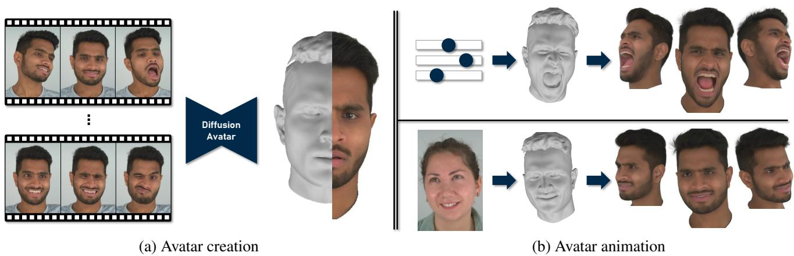
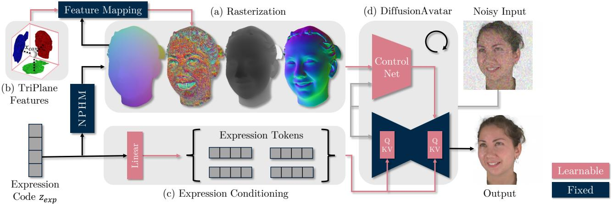
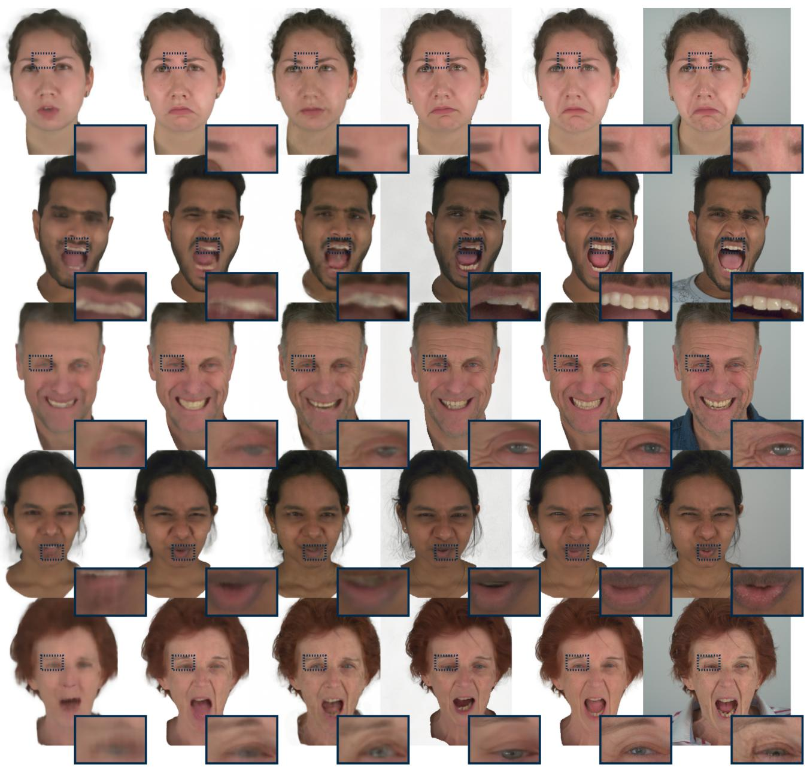
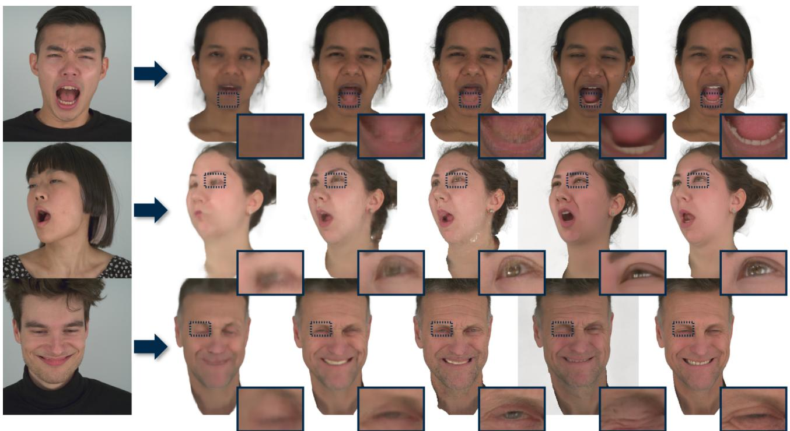

# DiffusionAvatars: Deferred Diffusion for High-fidelity 3D Head Avatars

Tobias Kirschstein

Simon Giebenhain

Matthias Nießner

Technical University of Munich

  
Figure 1. Given a set of multi-view videos and corresponding fitted meshes, we build a DiffusionAvatar of a person. Our method translate expressions of a morphable model into realistic facial appearances of a person while also providing control over the viewpoint. Project website: https://tobias-kirschstein.github.io/diffusion-avatars/

## Abstract

DiffusionAvatars synthesizes a high-fidelity 3D head avatar ofa person, offering intuitive control over both pose and expression. We propose a diffusion-based neural renderer that leverages generic 2D priors to produce compelling images offaces. For coarse guidance of the expression and head pose, we render a neural parametric head model (NPHM) from the target viewpoint, which acts as a proxy geometry of the person. Additionally, to enhance the modeling of intricate facial expressions, we condition DiffusionAvatars directly on the expression codes obtained from NPHM via cross-attention. Finally, to synthesize consistent surface details across different viewpoints and expressions, we rig learnable spatial features to the head’s surface via TriPlane lookup in NPHM’s canonical space. We train DiffusionAvatars on RGB videos and corresponding fitted NPHM meshes of a person and test the obtained avatars in both self-reenactment and animation scenarios. Our experiments demonstrate that DiffusionAvatars generates temporally consistent and visually appealing videos for novel poses and expressions of a person, outperforming existing approaches.

## 1. Introduction

A significant problem in computer vision and graphics is the creation of photorealistic animatable avatars. Ideally, these avatars permit consistent video renderings while providing free control over desired expression, pose, and viewpoint. A digital 3D head avatar may then be used in various scenarios such as VR/AR applications, immersive teleconferencing, gaming, movie animation, or as a virtual assistant.

Unfortunately, creating a 3D avatar from which one can render photorealistic images from arbitrary viewpoints is challenging. The task becomes even more difficult when the avatar has to simultaneously offer precise control over poses and expressions, for instance given by a driving sequence from a different video or controlled manually. Technically, this leads to a 4D photometric reconstruction problem which is typically underconstrained. This presents animation systems with a challenging task that traditionally involves extensive efforts by 3D artists.

Many existing methods have tackled the challenge of facial image synthesis via 2D neural networks [26, 31, 51, 57, 68, 71]. In particular, Diffusion Models have recently been demonstrated to produce visually appealing imagery [23, 58, 59, 83, 86]. 2D models are great at generating photo-realistic images but generally do not offer the degree of control and temporal consistency needed for a high-quality 3D head avatar. On the other side, methods that reconstruct an animatable 3D representation of the head [21, 89, 90, 92] provide much better consistency but in many cases the resulting renderings do not have the same photo-realism as 2D models.

To this end, we introduce DiffusionAvatars, a novel approach for 3D head avatar creation, by combining the strong image synthesis capabilities of 2D diffusion models with the view consistency of a detailed 3D head representation. As a controllable 3D representation, we leverage the recent neural parametric head model (NPHM) [18] due to its detailed prediction of human head geometry, which can give us better geometric cues than established mesh-based 3DMMs [37, 54]. Inspired by neural textures [70], we further base face synthesis on person-specific learnable features rigged to the model’s surface via NPHM’s canonical space. Such surface-mapped features can effectively compensate for imperfect geometry and improve consistency across views by giving the neural renderer cues about corresponding surface points. To avoid learning a neural renderer from scratch, we base our architecture on a pre-trained latent diffusion model (LDM) [58] and convert it into an image-to-image translation model by following the ControlNet [86] paradigm to condition on the rasterized images of NPHM meshes. That way, we not only inherit a powerful image synthesis backbone but also benefit from the learned facial prior obtained from large 2D image datasets, which facilitates generalization to unseen expressions. Finally, we insert cross-attention blocks into the pre-trained LDM to condition the diffusion-based neural renderer on the expression codes of NPHM directly. This allows our model to produce more expressive renderings. Intuitively, the direct conditioning helps the diffusion model to distinguish subtle expression details while the rasterized NPHM renderings encode the viewpoint and the overall shape of the head. In summary, our contributions are as follows:

• We present DiffusionAvatars, a diffusion-based neural renderer that leverages ControlNet to create animatable 3D head avatars.

• We design a method for rigging learnable spatial features to the surface of the underlying NPHM via TriPlanes.

• We propose direct expression conditioning via crossattention to transfer detailed expressions from NPHM to the synthesized 3D head avatar.

## 2. Related Work

## 2.1. 3D Face Animation

It is natural to approach the task of 3D Face Animation with an actual 3D representation. In the seminal work by [4], a 3D morphable model (3DMM) was introduced, which paved the way towards reconstructing animatable 3D head geometry from images or depth observations. More recent 3DMMs [7, 37, 54, 72, 79] still build upon this paradigm and have since been the drivers of face animation oriented applications with most methods leveraging a 3DMM to gain control over the expression and pose of the avatar. For example, Neural Head Avatars [21] and ROME [32] finetune the mesh topology of FLAME [37] to obtain more faithful and realistic mesh-based avatars. NeRFace [16], IN-STA [92] and RigNeRF [1] build a radiance field that is controlled by a 3DMM. Other 3D representations such as points [90] or signed distance functions [39, 89] have also been explored for avatar creation.

In our work, we do not aim to learn a complete 3D representation. Instead, we utilize the 3D prior of the recent neural parametric head model (NPHM) [18] with a 2D rendering network for high-quality image synthesis.

## 2.2. Face Synthesis in 2D

Ever since the impactful Pix2Pix [91] work, it has been a popular approach to obtain control over synthesized images via 2D networks. In the face synthesis domain, methods based on Generative Adversarial Networks (GANs) [20] have received a lot of attention [26, 31, 51, 57, 68, 71]. To obtain better control over head pose and camera viewpoint, a common technique is to combine powerful 2D image synthesis networks with a controllable 3D head proxy [2, 8, 11, 38, 48, 65, 67, 69, 70, 77]. Another line of work aims at directly generating consistent videos by video-to-video translation [33, 74] or even video stylization [15, 28, 80]. Most related to our method is Deferred Neural Rendering [70] which allows facial animation by learning a neural renderer in order to decode neural textures rigged to Basel Face Model [54]. While 2D-based approaches produce visually appealing frames, they often struggle with synthesizing consistent images across both views and time or provide only limited viewpoint control. Our method aims to improve consistency by utilizing a more powerful implicit 3D representation as geometric proxy and provides better expression generalization by utilizing a diffusion model as a synthesis backbone.

## 2.3. Controllable 2D Diffusion

Recently, Diffusion models emerged as powerful 2D image generation models. While they demonstrate superior capabilities in generating high-fidelity and diverse 2D content from text prompts [23, 58, 59], it has been a key challenge to leverage their power for other tasks. Several works extend 2D diffusion models to text-guided video generation by employing a multi-stage approach [5, 24, 62, 75], generating frames autoregressively [25] or stylizing an input video [17, 76, 78, 81]. In the human domain, diffusion models have already been applied to face editing [27], animation [64, 83] and bodies [66]. Other works, such as

ControlNet [86], IPAdapter [82] or T2I-Adapter [49], allow fine-tuning a pre-trained diffusion model on additional controls such as landmarks or depth cues, opening a wide space of possible applications for 2D face editing. Most similar to our method, DiffusionRig [12] proposes a diffusion model conditioned on rasterized FLAME meshes to provide 3D animation control over an avatar created from a personal photo album. While the synthesized images or videos of these approaches already show great controllability and visual quality, they typically lack consistency due to the absence of an underlying accurate 3D representation.

## 2.4. Diffusion for 3D Faces

Following a different approach, several works explore diffusion for generic 3D generation [42, 50, 55]. This has also been extended to 3D head generation [22, 73, 85], textguided 3D head editing [52] or 3D body generation [84]. Some works also generate animatable 3D asset animatable for heads [3] and bodies [6, 29, 56] by rigging the 3D asset to a parameterized FLAME [37] or SMPL [44] mesh. Such generated 3D avatars are view consistent by design but lack the visual quality of 2D-based diffusion models. Furthermore, animation control is limited by the underlying mesh template. In our work, we employ a more accurate, implicit 3D morphable head model for better expression control and follow ControlNet [86] and IPAdapter [82] to build a diffusion-based neural renderer for high-quality image synthesis.

## 3. Method

Our goal is to create a temporally consistent 3D head avatar of a person with explicit control over viewpoint and expression. We approach this task by designing a diffusion-based neural renderer that decodes learnable features rigged to the surface of an implicitly defined proxy geometry. In analogy to Deferred Neural Rendering [70], we dub this approach Deferred Diffusion. We begin by introducing the foundations of diffusion models (Sec. 3.1) and NPHM (Sec. 3.2) that we use as proxy geometry before going into detail about our method: In the rasterization (Sec. 3.3) and surface feature mapping (Sec. 3.4) stage, we generate the input images for our diffusion-based neural renderer. These renderings encode the desired viewpoint, head shape, and global expression. For more fine-grained expression control, we add NPHM’s expression codes as an additional input to the diffusion model (Sec. 3.5). Finally, our pipeline leverages a pre-trained diffusion model’s image synthesis and generalization capabilities for better quality.

## 3.1. Diffusion

We build our work upon latent diffusion models (LDM) [58], which operate in the the latent space of an autoencoder. Formally, LDMs employ an encoder E to map RGB images into a lower-dimensional latent space, facilitating generative tasks [13]. In the following, any mention of an image $x _ { 0 }$ always refers to an RGB image I that was mapped into the autoencoder’s latent space via $x _ { 0 } = \mathcal { E } ( I )$ to obtain a latent image.

In diffusion, the fixed forward process iteratively adds noise to the latent image:

$$
\begin{array} { r } { q ( x _ { \tau } | x _ { \tau - 1 } ) = \mathcal { N } \left( x _ { \tau } ; \sqrt { \alpha _ { \tau } } x _ { \tau - 1 } , ( 1 - \alpha _ { \tau } ) \mathbf { I } \right) } \end{array}\tag{1}
$$

where $\tau = 1 . . . N$ indicates the denoising step and the forward process variances $\alpha _ { \tau }$ define the noise scheduling [23]. In practice, noisy samples $x _ { \tau }$ are obtained with the standard Gaussian reparameterization:

$$
x _ { \tau } = \sqrt { \bar { \alpha } _ { \tau } } x _ { 0 } + \sqrt { 1 - \bar { \alpha } _ { \tau } } \epsilon \qquad \epsilon \sim \mathcal { N } \left( 0 , \mathbf { I } \right)\tag{2}
$$

Typically, diffusion models are trained to predict the original noise ϵ given the noisy sample $x _ { \tau }$ . We empirically find a different method, known as the v-parameterization [59], to work better in our scenario, where v is defined as:

$$
v = \sqrt { \bar { \alpha } _ { \tau } } \epsilon - \sqrt { 1 - \bar { \alpha } _ { \tau } } x _ { 0 }\tag{3}
$$

This has two advantages. First, v-prediction ensures that the loss can always guide the model to learn something meaningful, even when the input already contains a lot of noise, leading to faster convergence [24]. Second, it allows us to train the model also on pure noise inputs, which during inference is the most challenging denoising step. To this end, we rescale the noise schedule α to ensure zero signal-tonoise ratio inputs during training as proposed by [41].

## 3.2. NPHM

NPHM [18] is a morphable head model that generates a signed distance field (SDF) of a human head given an identity code $z _ { i d }$ and an expression code $z _ { e x p } .$ We employ COLMAP [60, 61] to obtain pointclouds $\{ \mathcal { P } _ { t } \}$ for each timestep t of a multi-view video sequence of the person. Subsequently, we fit NPHM to each pointcloud $\mathcal { P } _ { t }$ to obtain $z _ { i d }$ and $z _ { e x p } ^ { t } .$ We use a variant of NPHM, namely MonoN-PHM [19], that uses a backward deformation field instead of the originally proposed forward deformation field as it simplifies the fitting process. Formally, we obtain the NPHM fitting as follows:

$$
z _ { i d } , z _ { e x p } ^ { t } = \underset { z _ { i d } , z _ { e x p } } { \arg \operatorname* { m i n } } \sum _ { x \in \mathcal { P } _ { t } } | \mathcal { F } _ { i d } ( \mathcal { F } _ { e x p } ( x ) ) |\tag{4}
$$

where $\mathcal { F } _ { i d }$ is NPHM’s identity network implemented as a signed distance field, and $\mathcal { F } _ { e x p }$ is the backward deformation network. Note that we drop the dependency of $\mathcal { F } _ { i d }$ and $\mathcal { F } _ { e x p }$ on their respective latent codes for simplicity. The fitted SDF representation can then be translated into a mesh

  
Figure 2. Method overview: We decode an NPHM expression code $z _ { e x p }$ in two ways to obtain a realistic image: We first extract an NPHM mesh and rasterize it from the desired viewpoint in (a), giving us canonical coordinates, depths, and normal renderings for the head mesh. In (b), the canonical coordinates $x _ { c a n }$ are used to look up spatial features in a TriPlanes structure, rigging the features onto the mesh surface. Together with the rasterizer output, these mapped features form the input for the ControlNet part of DiffusionAvatar. The second route for the expression code goes through a linear layer depicted in (c). It yields expression tokens that are subsequently used in a newly added cross-attention layer inside the pre-trained latent diffusion model. Intuitively, the rasterized inputs should encode pose, shape and rough expression while the direct expression conditioning hints at more detailed facial expressions. The final image is synthesized in (d) by iteratively denoising Gaussian noise using the original DDPM denoising schedule [23].

$M _ { t }$ via marching cubes [45]. Furthermore, for each vertex $x \in M _ { t }$ of the extracted mesh, we can obtain its canonical coordinates $\boldsymbol { x } _ { c a n } \in \mathbb { R } ^ { 3 + 2 }$ via the backward deformation field:

$$
x _ { c a n } = \mathcal { F } _ { e x p } ( x )\tag{5}
$$

where the first 3 coordinates of $x _ { c a n }$ represent the usual spatial dimensions while the remaining 2 coordinates are ambient dimensions that can help resolve topological issues in mouth and eye regions [53]. We utilize the meshes $M _ { t }$ in the subsequent rasterization stage, whereas the canonical coordinates $x _ { c a n }$ are necessary for the spatial feature lookup.

## 3.3. Rasterization

We employ nvdiffrast [36] to generate the actual input images for the diffusion model. Let $M _ { t }$ be a facial mesh of a person at timestep t and $\pi _ { t }$ a camera pose. We then obtain a set of renderings $R ^ { t } \in \mathbb R ^ { H \times W \times C }$ for this timestep using the rasterizer $\textstyle { \mathcal { R } } :$

$$
R ^ { t } = \mathcal { R } \left( M _ { t } , \pi _ { t } \right)\tag{6}
$$

In our case, the channels of $R ^ { t }$ are normals, depths, and a canonical coordinate rendering $R _ { c a n } ^ { t } \in \mathbb { R } ^ { H \times W \times ( 3 + 2 ) }$ of the NPHM mesh.

## 3.4. TriPlane Feature Mapping

It has been shown that tying learnable features to a surface helps neural renderers to synthesize more detailed images, a technique known as neural textures [70]. Since NPHM lacks a consistent UV space due to its implicit nature, we propose a simple extension of neural textures: We tie learnable features to the surface of the extracted mesh $M _ { t }$ by querying a spatial structure with the canonical coordinates $x _ { c a n }$ . We use TriPlanes [8] for the 3 spatial dimensions and a regular 2D feature map for the ambient dimensions:

$$
R _ { \mathrm { f e a t } } ^ { t } = \mathrm { T R I P L A N E } \left( R _ { c a n , 0 - 3 } ^ { t } \right)\tag{7}
$$

$$
R _ { \mathrm { f e a t \_ a m b } } ^ { t } = \mathbf { A M B I E N T M A P } \left( R _ { c a n , 3 - 5 } ^ { t } \right)\tag{8}
$$

These learnable feature maps form the 2D input for our diffusion-based neural renderer, together with the other buffers $R ^ { t }$ from the rasterizer:

$$
R ^ { t } \gets R ^ { t } , R _ { \mathrm { f e a t } } ^ { t } , R _ { \mathrm { f e a t \_ a m b } } ^ { t }\tag{9}
$$

## 3.5. Direct Expression Conditioning

Conditioning on renderings guides the head pose as well as coarse expressions. However, subtle details may not be easy for the network to decode from renderings. To facilitate the synthesis of detailed expressions, we add new crossattention layers to the U-Net, following IPAdapter [82]. Let $Z$ be the intermediate feature map computed by an existing cross-attention operation in the pre-trained LDM: $Z =$ ATTENTION(Q, K, V). We then perform direct expression conditioning by adding another cross-attention layer:

$$
f _ { e x p } ^ { t } = \mathrm { E X P } ( z _ { e x p } ^ { t } )\tag{10}
$$

$$
Z \gets Z + \mathrm { A T T E N T I O N } ( Q , W ^ { k } f _ { e x p } ^ { t } , W ^ { v } f _ { e x p } ^ { t } )\tag{11}
$$

where EXP is our expression conditioning module that linearly maps $z _ { e x p } ^ { t }$ into a sequence $f _ { e x p } ^ { t } \in \bar { \mathbb { R } } ^ { 4 \times d }$ of 4 expression tokens forming the keys and values for cross-attention. In total, we add 15 cross-attention layers to the LDM.

## 3.6. Deferred Diffusion

The final rendering is obtained by iteratively denoising full noise $x _ { T } \sim \mathcal { N } ( 0 , I )$ with our diffusion-based neural renderer D conditioned on the rasterized NPHM meshes $R ^ { t }$ and expression tokens $f _ { e x p } \colon$

$$
\boldsymbol { x } _ { \tau - 1 } \sim \mathcal { D } ( \boldsymbol { x } _ { \tau } ) = S ( \boldsymbol { x } _ { \tau } , f _ { e x p } ^ { t } , \mathcal { C } ( \boldsymbol { x } _ { \tau } , R ^ { t } ) )\tag{12}
$$

where C is the ControlNet architecture and S a pre-trained LDM with our expression conditioning modules inserted. The denoised prediction $x _ { \tau - 1 }$ is obtained via the sampling procedure of [23].

During training, we minimize the following loss:

$$
\mathcal { L } = \mathbb { E } _ { \epsilon , \tau , x _ { 0 } ^ { t } , R ^ { t } , f _ { e x p } ^ { t } } \left[ \left| \left| \mathcal { D } \left( x _ { \tau } ^ { t } , R ^ { t } , f _ { e x p } ^ { t } \right) - v \right| \right| _ { 2 } \right]\tag{13}
$$

where ϵ is the sampled noise, τ is the denoising step and $x _ { 0 } ^ { t } = \mathcal { E } ( I ^ { t } )$ is the ground truth latent image. We use $\mathcal { L }$ to optimize (i) the ControlNet C, (ii) the parameters of expression conditioning $W ^ { k } , W ^ { v }$ , and EXP, and (iii) the spatial feature maps TRIPLANE and AMBIENTMAP.

## 4. Experimental Results

## 4.1. Training

For our experiments, we employ the recently released multiview video dataset from NeRSemble [35]. The dataset contains 26 different multi-view sequences per person captured with 16 cameras, featuring different facial expressions, sentences and emotions. We use BackgroundMattingV2 [40] to remove the background and a segmentation network to remove the torso [88]. We fit NPHM on the video sequences of 8 different persons to create pairings of multi-view videos and fitted meshes. In total, we use about 3300 timesteps per person. We train one DiffusionAvatar for each person on these pairings with Adam [34] using a learning rate of 1e − 4 for ControlNet and the expression conditioning layers, and a learning rate of 1e − 2 for the TriPlane feature lookups. We use a batch size of $B = 8$ and spatial resolutions $H \ = \ W \ = \ 5 1 2$ We employ random cropping and resizing of the target images to avoid overfitting. The size of our spatial feature maps is $5 1 2 \times 5 1 2 \times$ 16 for each TriPlane and the ambient map. In total, this yields $1 6 \times ( 3 + 1 ) + 5 + 1 + 3 = 7 3$ channels for the input renderings $R _ { t }$ fed to our diffusion-based renderer. The pretrained LDM is a Stable Diffusion v2.1 network [58]. Training takes roughly two days on a single RTX A6000 for 100k gradient descent steps.

<table><tr><td>Method</td><td>PSNR↑ LPIPS↓ JOD↑ AKD↓ AED↓ APD↓ CSIM↑</td></tr><tr><td>NeRFace [16] 23.0 0.279</td><td>6.76 5.37 1.06 0.053 0.787</td></tr><tr><td>DiffusionRig [12] 19.6 0.220</td><td>6.41 2.74 0.55 0.029 0.887</td></tr><tr><td>DNR [70] 24.5 0.226</td><td>7.32 2.06 0.63 0.0270.903</td></tr><tr><td>DNR+GAN [70] 23.0</td><td>0.114 7.08 2.14 0.69 0.0280.868</td></tr><tr><td>MVP [43] 23.6 Ours 24.9 0.081 7.55</td><td>0.221 7.02 3.42 0.78 0.0340.882</td></tr></table>

Table 1. Quantitative Comparison: We report metrics for a selfreenactment scenario on unseen expressions and unseen views averaged over 8 persons from the NeRSemble dataset [35].

## 4.2. Experiment Setup

Tasks. To measure the quality of a 3D avatar, we conduct experiments on two tasks: Self-reenactment and avatar animation. For self-reenactment, we hold out 2 complete sequences and the frontal camera of every sequence during training to measure both image quality and view consistency. During testing, we provide the holdout fitted meshes of the same person and render from the novel view. For avatar animation, we first generate NPHM meshes using the same identity code $z _ { i d }$ as the avatar and a sequence of expression codes $\{ z _ { e x p } ^ { t } \}$ from a different person. We then render a video of the avatar from a novel view. To evaluate the realism of this expression transfer, we conduct a user study where we show the animated avatars to participants.

Metrics. We employ two paired-image metrics to measure the quality of individual generated frames: Peak Signal-to-Noise Ratio (PSNR) and Learned Perceptual Image Patch Similarity (LPIPS) [87]. Furthermore, we measure visual similarity of a rendered video to its ground truth counterpart with the perceptual video metric JOD [46]. Finally, we make use of several face-specific metrics: Average Keypoint Distance (AKD) measured in pixels with keypoints estimated from PIPNet [30], and cosine similarity (CSIM) of identity embeddings based on ArcFace [10]. We further follow [9] and utilize DECA [14] to measure Average Expression Distance (AED) and Average Pose Distance (APD) between the rendered and the ground truth images.

Baselines. We compare our method against the following state-of-the-art 3D head avatar creation methods:

NeRFace [16]. A NeRF-based method that reconstructs a radiance field conditioned on expression codes. The original implementation is for monocular videos and uses FLAME. We extend it to our multi-view training scenario and provide NPHM expression codes for better comparison.

Mixture of Volumetric Primitives (MVP) [43]. An encoder-decoder architecture that generates a set of small feature grids rigged to a template mesh. We provide a FLAME tracking to learn the driving.

  
NeRFace [16]  
DNR [70]  
MVP [43]  
DiffusionRig [12]  
Ours  
GT  
Figure 3. Qualitative results for self-reenactment. We compare against 3D methods (NeRFace [16], Mixture of Volumetric Primi tives [43]) and methods employing 2D renderers (Deferred Neural Rendering [70], DiffusionRig [12]). Note that the slightly gray background for DiffusionRig is caused by their training scheme using ϵ-prediction (see Sec. 3.1). Our method consistently produces more expressive facial performances while simultaneously providing more detailed renderings.

Deferred Neural Rendering (DNR) [70]. A screen-space decoder built on top of Pix2Pix [91] that uses learnable neural textures rigged to a tracked Basel Face Model [54]. We provide our fitted NPHM meshes as input for better comparison. Additionally, we compare against a version of DNR that also uses an adversarial loss for sharper images that we call DNR+GAN in the following.

DiffusionRig [12]. A recent diffusion-based method that uses albedo, normal, and shaded color renderings of FLAME meshes tracked by DECA [14] as input to control pose and expression. While their method was originally proposed to be fine-tuned on a small personal photo album of 20 images, we fine-tune their pre-trained model on all training frames of our dataset.

  
Source Actor  
NeRFace [16]  
DNR [70]  
DNR + GAN  
DiffusionRig [12]  
Ours

Figure 4. Qualitative results for avatar animation. Our method faithfully transfers the source actor’s expression and consistently produces compelling renderings, even for complex performances.

## 4.3. Self-Reenactment

In Tab. 1, we compare DiffusionAvatars to other stateof-the-art approaches on the self-reenactment task. Results are averaged over avatars generated from eight different persons. Our method shows the overall best performance with the biggest improvement in perceptual and face-specific metrics. The results indicate that Diffusion-Avatars generates sharper images (LPIPS) that are more temporally consistent (JOD). Furthermore, our method better maintains the person’s identity when rendered from a novel view (CSIM) than the baselines. Finally, facial features such as the position of mouth corners and eyebrows synthesized by our method match the ground truth expressions more closely (AKD, AED, APD).

We further provide a qualitative comparison in Fig. 3. The baselines struggle especially in facial regions that are poorly explained by the NPHM mesh, such as the mouth interior. In contrast, our method can plausibly fill these regions, providing a consistently realistic appearance.

## 4.4. Avatar Animation

Due to the task’s inherent lack of any ground truth, we perform a user study to validate avatar animation. We collect 735 responses from 49 participants on two questions:

<table><tr><td></td><td>NeRFace</td><td>DiffusionRig</td><td>DNR</td><td>DNR+GAN</td><td>Ours</td></tr><tr><td>VQ↑</td><td>2.19</td><td>2.47</td><td>2.87</td><td>3.06</td><td>4.02</td></tr><tr><td>DF↑</td><td>2.35</td><td>3.52</td><td>3.94</td><td>3.97</td><td>4.14</td></tr></table>

Table 2. User Study: For our user study on avatar animation, we collect 735 responses from 49 participants to measure Visual Quality (VQ) and Driving Fidelity (DF) on a scale of 1-5.

(i) Visual Quality (VQ): What is the overall quality of the avatar animation?

(ii) Driving Fidelity (DF): How closely does the animated avatar match the expressions of the driving sequence?

We present two videos side-by-side: One sequence of a source actor performing various expressions, and a video of another person’s avatar with the expressions transferred to it. The results of our user study can be seen in Tab. 2. Our method achieves the highest scores for both visual quality and similarity to the driving sequence. The difference is particularly pronounced for the visual quality score. We attribute this to the fact that users heavily penalize any visual artifacts immediately obvious in video renderings. These perceptual differences in the task of avatar animation are also apparent in the qualitative comparison shown in Fig. 4.

## 4.5. Ablations

In Tab. 3, we examine the design choices of our method. All ablation experiments are conducted on 3 avatars on the selfreenactment task. We refer to our supplementary material for a qualitative comparison.

<table><tr><td>PSNR↑</td><td>LPIPS↓ JOD↑</td><td>AKD↓</td><td>CSIM↑</td></tr><tr><td>w/o diffusion</td><td>25.1 0.133</td><td>7.69 1.96</td><td>0.892</td></tr><tr><td>FLAME</td><td>24.2 0.083</td><td>7.36 2.46</td><td>0.900</td></tr><tr><td>w/o exp. cond.</td><td>24.5 0.081</td><td>7.65 1.98</td><td>0.911</td></tr><tr><td>w/o LDM prior</td><td>24.5 0.078</td><td>7.67 1.89</td><td>0.913</td></tr><tr><td>w/o spatial features</td><td>24.9 0.078</td><td>7.77 1.87</td><td>0.918</td></tr><tr><td>spherical UV</td><td>24.9 0.075</td><td>7.77 1.95</td><td>0.920</td></tr><tr><td>Ours</td><td>25.3 0.074</td><td>7.85 1.91</td><td>0.918</td></tr></table>

Table 3. Ablation of architectural choices.

Effect of Diffusion. To study whether diffusion is necessary, we train our architecture without the pre-trained LDM to directly predict the output in a single forward pass, similar to Deferred Neural Rendering. Such a method performs notably worse, especially in the LPIPS metric, indicating that diffusion is important for sharp renderings.

Effect of NPHM vs FLAME. We compare Diffusion-Avatars with a version trained on renderings of a fitted FLAME instead of NPHM. Since NPHM models facial geometry as an SDF, it possesses a much higher representational power than FLAME. As a result, the renderings are much closer to the actual desired appearance of the head. This is also reflected in our ablation study, where using FLAME gives consistently worse performance. This is especially true for the AKD metric, indicating that our diffusion-based neural renderer cannot reenact certain complex expressions based on FLAME alone.

Effect of Expression Conditioning. Turning off expression conditioning worsens overall performance, presumably because the expression codes help to distinguish subtle expression details that can hardly be inferred from the NPHM mesh alone. It also helps DiffusionAvatars to synthesize expressions not captured by NPHM, such as tongue movement, by enabling the network to correlate such appearances with certain expression code combinations.

Effect of 2D LDM Prior. We train our pipeline from scratch without resorting to a pre-trained LDM. In this case, we remove the ControlNet module and condition the U-Net directly on the NPHM renderings. This architecture, trained from scratch, performs competitively but slightly worse. We see the biggest advantage of pre-training in faster convergence and better coherence of the generated images.

Effect of Spatial Features. We compare three spatial feature mapping approaches: (i) Our Triplanes, (ii) a simpler approach based on spherical feature mapping, and (iii) no spatial features at all. For spherical feature mapping, we create an approximate UV map for each NPHM mesh by projecting the 3D canonical coordinates for each vertex onto a sphere centered inside the head. Tab. 3 shows that using TriPlanes boosts most metrics, whereas the simpler spherical mapping brings almost no benefit.

## 5. Limitations

DiffusionAvatars can create photo-realistic 3D head avatars with pose and expression control. More challenges must be solved, however, before an avatar can be used in production. For example, to put an avatar into a realistic environment, it is necessary to have control over the lighting properties. Currently, DiffusionAvatars bakes the lighting into the generated images. Since we employ a detailed 3D head geometry underneath, one could imagine directly modeling shadow effects as a composite of the synthesized images. Further, our current architecture is not (yet) amenable to real-time applications due to the comparatively computeintensive denoising loop. Here, recent advances in the distillation of diffusion models may provide a remedy [47, 63].

## 6. Conclusion

This paper presents a novel method DiffusionAvatars, which creates a photo-realistic 3D head avatar from multiview videos using a tracked parametric head model of a person. DiffusionAvatars can be animated by a source actor or directly via NPHM. We use rendered NPHM meshes with rigged spatial features as input to a diffusion-based neural renderer. We leverage the image synthesis capabilities of a pre-trained latent diffusion model with ControlNet, facilitating generalization to unseen expressions. While this pipeline is already capable of synthesizing appealing images, we show that additionally conditioning the neural renderer on NPHM’s expression codes further improves the model’s ability to generate complex facial expressions. Our experiments suggest that the proposed architecture can effectively synthesize high-quality renderings and animate the 3D avatar with high fidelity. We believe our approach demonstrates an exciting application for high-fidelity 3D avatar creation.

## Acknowledgements

This work was supported by the ERC Starting Grant Scan2CAD (804724) and the German Research Foundation (DFG) Research Unit “Learning and Simulation in Visual Computing”. We would also like to thank Karla Weighart for proof-reading and Angela Dai for the video voice-over.

## References

[1] ShahRukh Athar, Zexiang Xu, Kalyan Sunkavalli, Eli Shechtman, and Zhixin Shu. Rignerf: Fully controllable neural 3d portraits. In Proceedings ofthe IEEE/CVF conference on Computer Vision and Pattern Recognition, pages 20364– 20373, 2022. 2

[2] Alexander Bergman, Petr Kellnhofer, Wang Yifan, Eric Chan, David Lindell, and Gordon Wetzstein. Generative neural articulated radiance fields. Advances in Neural Information Processing Systems, 35:19900–19916, 2022. 2

[3] Alexander W Bergman, Wang Yifan, and Gordon Wetzstein. Articulated 3d head avatar generation using text-to-image diffusion models. arXiv preprint arXiv:2307.04859, 2023. 3

[4] Volker Blanz and Thomas Vetter. A morphable model for the synthesis of 3d faces. In Seminal Graphics Papers: Pushing the Boundaries, Volume 2, pages 157–164. 2023. 2

[5] Andreas Blattmann, Robin Rombach, Huan Ling, Tim Dockhorn, Seung Wook Kim, Sanja Fidler, and Karsten Kreis. Align your latents: High-resolution video synthesis with latent diffusion models. In Proceedings ofthe IEEE/CVF Conference on Computer Vision and Pattern Recognition, pages 22563–22575, 2023. 2

[6] Yukang Cao, Yan-Pei Cao, Kai Han, Ying Shan, and Kwan-Yee K Wong. Dreamavatar: Text-and-shape guided 3d human avatar generation via diffusion models. arXiv preprint arXiv:2304.00916, 2023. 3

[7] Zenghao Chai, Tianke Zhang, Tianyu He, Xu Tan, Tadas Baltrusaitis, HsiangTao Wu, Runnan Li, Sheng Zhao, Chun Yuan, and Jiang Bian. Hiface: High-fidelity 3d face reconstruction by learning static and dynamic details. In Proceedings of the IEEE/CVF International Conference on Computer Vision (ICCV), pages 9087–9098, 2023. 2

[8] Eric R Chan, Connor Z Lin, Matthew A Chan, Koki Nagano, Boxiao Pan, Shalini De Mello, Orazio Gallo, Leonidas J Guibas, Jonathan Tremblay, Sameh Khamis, et al. Efficient geometry-aware 3d generative adversarial networks. In Proceedings of the IEEE/CVF Conference on Computer Vision and Pattern Recognition, pages 16123–16133, 2022. 2, 4

[9] Xuangeng Chu, Yu Li, Ailing Zeng, Tianyu Yang, Lijian Lin, Yunfei Liu, and Tatsuya Harada. GPAvatar: Generalizable and precise head avatar from image(s). In The Twelfth International Conference on Learning Representations, 2024. 5

[10] Jiankang Deng, Jia Guo, Niannan Xue, and Stefanos Zafeiriou. Arcface: Additive angular margin loss for deep face recognition. In Proceedings of the IEEE/CVF conference on computer vision and pattern recognition, pages 4690–4699, 2019. 5

[11] Yu Deng, Jiaolong Yang, Dong Chen, Fang Wen, and Xin Tong. Disentangled and controllable face image generation via 3d imitative-contrastive learning. In IEEE Computer Vision and Pattern Recognition, 2020. 2

[12] Zheng Ding, Xuaner Zhang, Zhihao Xia, Lars Jebe, Zhuowen Tu, and Xiuming Zhang. Diffusionrig: Learning personalized priors for facial appearance editing. In Proceedings of the IEEE/CVF Conference on Computer Vision

and Pattern Recognition, pages 12736–12746, 2023. 3, 5, 6, 7

[13] Patrick Esser, Robin Rombach, and Bjorn Ommer. Taming transformers for high-resolution image synthesis. In Proceedings of the IEEE/CVF conference on computer vision and pattern recognition, pages 12873–12883, 2021. 3

[14] Yao Feng, Haiwen Feng, Michael J. Black, and Timo Bolkart. Learning an animatable detailed 3D face model from in-the-wild images. 2021. 5, 6

[15] Jakub Fiser, Ondˇ ˇrej Jamriska, David Simons, Eli Shechtman,ˇ Jingwan Lu, Paul Asente, Michal Luka´c, and Daniel Sˇ ykora.\` Example-based synthesis of stylized facial animations. ACM Transactions on Graphics (TOG), 36(4):1–11, 2017. 2

[16] Guy Gafni, Justus Thies, Michael Zollhofer, and Matthias Nießner. Dynamic neural radiance fields for monocular 4d facial avatar reconstruction. In Proceedings ofthe IEEE/CVF Conference on Computer Vision and Pattern Recognition, pages 8649–8658, 2021. 2, 5, 6, 7

[17] Michal Geyer, Omer Bar-Tal, Shai Bagon, and Tali Dekel. Tokenflow: Consistent diffusion features for consistent video editing. arXiv preprint arXiv:2307.10373, 2023. 2

[18] Simon Giebenhain, Tobias Kirschstein, Markos Georgopoulos, Martin Runz, Lourdes Agapito, and Matthias Nießner.¨ Learning neural parametric head models. In Proceedings of the IEEE/CVF Conference on Computer Vision and Pattern Recognition, pages 21003–21012, 2023. 2, 3

[19] Simon Giebenhain, Tobias Kirschstein, Markos Georgopoulos, Martin Runz, Lourdes Agapito, and Matthias Nießner.¨ Mononphm: Dynamic head reconstruction from monocular videos. In Proc. IEEE Conf. on Computer Vision and Pattern Recognition (CVPR), 2024. 3

[20] Ian Goodfellow, Jean Pouget-Abadie, Mehdi Mirza, Bing Xu, David Warde-Farley, Sherjil Ozair, Aaron Courville, and Yoshua Bengio. Generative adversarial networks. Communications ofthe ACM, 63(11):139–144, 2020. 2

[21] Philip-William Grassal, Malte Prinzler, Titus Leistner, Carsten Rother, Matthias Nießner, and Justus Thies. Neural head avatars from monocular rgb videos. In Proceedings of the IEEE/CVF Conference on Computer Vision and Pattern Recognition, pages 18653–18664, 2022. 2

[22] Jiatao Gu, Qingzhe Gao, Shuangfei Zhai, Baoquan Chen, Lingjie Liu, and Josh Susskind. Learning controllable 3d diffusion models from single-view images. arXiv preprint arXiv:2304.06700, 2023. 3

[23] Jonathan Ho, Ajay Jain, and Pieter Abbeel. Denoising diffusion probabilistic models. Advances in neural information processing systems, 33:6840–6851, 2020. 1, 2, 3, 4, 5

[24] Jonathan Ho, William Chan, Chitwan Saharia, Jay Whang, Ruiqi Gao, Alexey Gritsenko, Diederik P Kingma, Ben Poole, Mohammad Norouzi, David J Fleet, et al. Imagen video: High definition video generation with diffusion models. arXiv preprint arXiv:2210.02303, 2022. 2, 3

[25] Jonathan Ho, Tim Salimans, Alexey Gritsenko, William Chan, Mohammad Norouzi, and David J Fleet. Video diffusion models. arXiv:2204.03458, 2022. 2

[26] Fa-Ting Hong, Longhao Zhang, Li Shen, and Dan Xu. Depth-aware generative adversarial network for talking head

video generation. In Proceedings of the IEEE/CVF conference on computer vision and pattern recognition, pages 3397–3406, 2022. 1, 2

[27] Ziqi Huang, Kelvin C.K. Chan, Yuming Jiang, and Ziwei Liu. Collaborative diffusion for multi-modal face generation and editing. In Proceedings ofthe IEEE/CVF Conference on Computer Vision and Pattern Recognition, 2023. 2

[28] Ondˇrej Jamriska,ˇ Sˇ arka Sochorov´ a, Ond´ ˇrej Texler, Michal Luka´c, Jakub Fiˇ ser, Jingwan Lu, Eli Shechtman, and Danielˇ Sykora. Stylizing video by example.\` ACM Transactions on Graphics (TOG), 38(4):1–11, 2019. 2

[29] Ruixiang Jiang, Can Wang, Jingbo Zhang, Menglei Chai, Mingming He, Dongdong Chen, and Jing Liao. Avatarcraft: Transforming text into neural human avatars with parameterized shape and pose control. arXiv preprint arXiv:2303.17606, 2023. 3

[30] Haibo Jin, Shengcai Liao, and Ling Shao. Pixel-in-pixel net: Towards efficient facial landmark detection in the wild. International Journal of Computer Vision, 2021. 5

[31] Tero Karras, Samuli Laine, and Timo Aila. A style-based generator architecture for generative adversarial networks. In Proceedings of the IEEE/CVF conference on computer vision and pattern recognition, pages 4401–4410, 2019. 1, 2

[32] Taras Khakhulin, Vanessa Sklyarova, Victor Lempitsky, and Egor Zakharov. Realistic one-shot mesh-based head avatars. In European Conference on Computer Vision, pages 345– 362. Springer, 2022. 2

[33] Hyeongwoo Kim, Pablo Garrido, Ayush Tewari, Weipeng Xu, Justus Thies, Matthias Nießner, Patrick Perez, Christian´ Richardt, Michael Zollofer, and Christian Theobalt. Deep¨ video portraits. ACM Transactions on Graphics (TOG), 37 (4):163, 2018. 2

[34] Diederik P Kingma and Jimmy Ba. Adam: A method for stochastic optimization. arXiv preprint arXiv:1412.6980, 2014. 5

[35] Tobias Kirschstein, Shenhan Qian, Simon Giebenhain, Tim Walter, and Matthias Nießner. Nersemble: Multi-view radiance field reconstruction of human heads. ACM Trans. Graph., 42(4), 2023. 5

[36] Samuli Laine, Janne Hellsten, Tero Karras, Yeongho Seol, Jaakko Lehtinen, and Timo Aila. Modular primitives for high-performance differentiable rendering. ACM Transactions on Graphics, 39(6), 2020. 4

[37] Tianye Li, Timo Bolkart, Michael. J. Black, Hao Li, and Javier Romero. Learning a model of facial shape and expression from 4D scans. ACM Transactions on Graphics, (Proc. SIGGRAPH Asia), 36(6):194:1–194:17, 2017. 2, 3

[38] C.Z. Lin, D.B. Lindell, E.R. Chan, and G. Wetzstein. 3d gan inversion for controllable portrait image animation. In ECCV Workshop on Learning to Generate 3D Shapes and Scenes, 2022. 2

[39] Connor Z. Lin, Koki Nagano, Jan Kautz, Eric R. Chan, Umar Iqbal, Leonidas Guibas, Gordon Wetzstein, and Sameh Khamis. Single-shot implicit morphable faces with consistent texture parameterization. In ACM SIGGRAPH 2023 Conference Proceedings, 2023. 2

[40] Shanchuan Lin, Andrey Ryabtsev, Soumyadip Sengupta, Brian L Curless, Steven M Seitz, and Ira Kemelmacher-Shlizerman. Real-time high-resolution background matting. In Proceedings of the IEEE/CVF Conference on Computer Vision and Pattern Recognition, pages 8762–8771, 2021. 5

[41] Shanchuan Lin, Bingchen Liu, Jiashi Li, and Xiao Yang. Common diffusion noise schedules and sample steps are flawed. arXiv preprint arXiv:2305.08891, 2023. 3

[42] Ruoshi Liu, Rundi Wu, Basile Van Hoorick, Pavel Tokmakov, Sergey Zakharov, and Carl Vondrick. Zero-1-to-3: Zero-shot one image to 3d object, 2023. 3

[43] Stephen Lombardi, Tomas Simon, Gabriel Schwartz, Michael Zollhoefer, Yaser Sheikh, and Jason Saragih. Mixture of volumetric primitives for efficient neural rendering. ACM Transactions on Graphics (ToG), 40(4):1–13, 2021. 5, 6

[44] Matthew Loper, Naureen Mahmood, Javier Romero, Gerard Pons-Moll, and Michael J Black. Smpl: A skinned multiperson linear model. In Seminal Graphics Papers: Pushing the Boundaries, Volume 2, pages 851–866. 2023. 3

[45] William E Lorensen and Harvey E Cline. Marching cubes: A high resolution 3d surface construction algorithm. In Seminal graphics: pioneering efforts that shaped thefield, pages 347–353. 1998. 4

[46] Rafał K. Mantiuk, Gyorgy Denes, Alexandre Chapiro, Anton Kaplanyan, Gizem Rufo, Romain Bachy, Trisha Lian, and Anjul Patney. Fovvideovdp: A visible difference predictor for wide field-of-view video. ACM Trans. Graph., 40(4), 2021. 5

[47] Chenlin Meng, Robin Rombach, Ruiqi Gao, Diederik Kingma, Stefano Ermon, Jonathan Ho, and Tim Salimans. On distillation of guided diffusion models. In Proceedings of the IEEE/CVF Conference on Computer Vision and Pattern Recognition, pages 14297–14306, 2023. 8

[48] Dann Mensah, Nam Hee Kim, Miika Aittala, Samuli Laine, and Jaakko Lehtinen. A hybrid generator architecture for controllable face synthesis. In ACM SIGGRAPH 2023 Conference Proceedings, pages 1–10, 2023. 2

[49] Chong Mou, Xintao Wang, Liangbin Xie, Yanze Wu, Jian Zhang, Zhongang Qi, Ying Shan, and Xiaohu Qie. T2iadapter: Learning adapters to dig out more controllable ability for text-to-image diffusion models. arXiv preprint arXiv:2302.08453, 2023. 3

[50] Norman Muller, Yawar Siddiqui, Lorenzo Porzi,¨ Samuel Rota Bulo, Peter Kontschieder, and Matthias Nießner. Diffrf: Rendering-guided 3d radiance field diffusion. In Proceedings of the IEEE/CVF Conference on Computer Vision and Pattern Recognition, pages 4328–4338, 2023. 3

[51] Yotam Nitzan, Kfir Aberman, Qiurui He, Orly Liba, Michal Yarom, Yossi Gandelsman, Inbar Mosseri, Yael Pritch, and Daniel Cohen-Or. Mystyle: A personalized generative prior. arXiv preprint arXiv:2203.17272, 2022. 1, 2

[52] Mohit Mendiratta Pan, Mohamed Elgharib, Kartik Teotia, Ayush Tewari, Vladislav Golyanik, Adam Kortylewski, Christian Theobalt, et al. Avatarstudio: Text-driven editing of 3d dynamic human head avatars. arXiv preprint arXiv:2306.00547, 2023. 3

[53] Keunhong Park, Utkarsh Sinha, Peter Hedman, Jonathan T Barron, Sofien Bouaziz, Dan B Goldman, Ricardo Martin-Brualla, and Steven M Seitz. Hypernerf: A higherdimensional representation for topologically varying neural radiance fields. arXiv preprint arXiv:2106.13228, 2021. 4

[54] Pascal Paysan, Reinhard Knothe, Brian Amberg, Sami Romdhani, and Thomas Vetter. A 3d face model for pose and illumination invariant face recognition. In 2009 sixth IEEE international conference on advanced video and signal based surveillance, pages 296–301. Ieee, 2009. 2, 6

[55] Ben Poole, Ajay Jain, Jonathan T. Barron, and Ben Mildenhall. Dreamfusion: Text-to-3d using 2d diffusion. arXiv, 2022. 3

[56] Bosheng Qin, Wentao Ye, Qifan Yu, Siliang Tang, and Yueting Zhuang. Dancing avatar: Pose and text-guided human motion videos synthesis with image diffusion model. arXiv preprint arXiv:2308.07749, 2023. 3

[57] Elad Richardson, Yuval Alaluf, Or Patashnik, Yotam Nitzan, Yaniv Azar, Stav Shapiro, and Daniel Cohen-Or. Encoding in style: a stylegan encoder for image-to-image translation. In IEEE/CVF Conference on Computer Vision and Pattern Recognition (CVPR), 2021. 1, 2

[58] Robin Rombach, Andreas Blattmann, Dominik Lorenz, Patrick Esser, and Bjorn Ommer. High-resolution image¨ synthesis with latent diffusion models. In Proceedings of the IEEE/CVF conference on computer vision and pattern recognition, pages 10684–10695, 2022. 1, 2, 3, 5

[59] Tim Salimans and Jonathan Ho. Progressive distillation for fast sampling of diffusion models. arXiv preprint arXiv:2202.00512, 2022. 1, 2, 3

[60] Johannes Lutz Schonberger and Jan-Michael Frahm.¨ Structure-from-motion revisited. In Conference on Computer Vision and Pattern Recognition (CVPR), 2016. 3

[61] Johannes Lutz Schonberger, Enliang Zheng, Marc Pollefeys,¨ and Jan-Michael Frahm. Pixelwise view selection for unstructured multi-view stereo. In European Conference on Computer Vision (ECCV), 2016. 3

[62] Uriel Singer, Adam Polyak, Thomas Hayes, Xi Yin, Jie An, Songyang Zhang, Qiyuan Hu, Harry Yang, Oron Ashual, Oran Gafni, et al. Make-a-video: Text-to-video generation without text-video data. arXiv preprint arXiv:2209.14792, 2022. 2

[63] Yang Song, Prafulla Dhariwal, Mark Chen, and Ilya Sutskever. Consistency models. 2023. 8

[64] Michał Stypułkowski, Konstantinos Vougioukas, Sen He, Maciej Zieba, Stavros Petridis, and Maja Pantic. Diffused heads: Diffusion models beat gans on talking-face generation. arXiv preprint arXiv:2301.03396, 2023. 2

[65] Jingxiang Sun, Xuan Wang, Lizhen Wang, Xiaoyu Li, Yong Zhang, Hongwen Zhang, and Yebin Liu. Next3d: Generative neural texture rasterization for 3d-aware head avatars. In Proceedings of the IEEE/CVF Conference on Computer Vision and Pattern Recognition, pages 20991–21002, 2023. 2

[66] David Svitov, Dmitrii Gudkov, Renat Bashirov, and Victor Lempitsky. Dinar: Diffusion inpainting of neural textures for one-shot human avatars. In Proceedings ofthe IEEE/CVF

International Conference on Computer Vision, pages 7062– 7072, 2023. 2

[67] Junshu Tang, Bo Zhang, Binxin Yang, Ting Zhang, Dong Chen, Lizhuang Ma, and Fang Wen. 3dfaceshop: Explicitly controllable 3d-aware portrait generation. IEEE Transactions on Visualization and Computer Graphics, 2023. 2

[68] Ayush Tewari, Mohamed Elgharib, Mallikarjun B R, Florian Bernard, Hans-Peter Seidel, Patrick Perez, Michael´ Zollhofer, and Christian Theobalt. Pie: Portrait image em-¨ bedding for semantic control. 2020. 1, 2

[69] Ayush Tewari, Mohamed Elgharib, Gaurav Bharaj, Florian Bernard, Hans-Peter Seidel, Patrick Perez, Michael´ Zollhofer, and Christian Theobalt. Stylerig: Rigging style-¨ gan for 3d control over portrait images, cvpr 2020. In IEEE Conference on Computer Vision and Pattern Recognition (CVPR). IEEE, 2020. 2

[70] Justus Thies, Michael Zollhofer, and Matthias Nießner. De-¨ ferred neural rendering: Image synthesis using neural textures. ACM Transactions on Graphics 2019 (TOG), 2019. 2, 3, 4, 5, 6, 7

[71] Omer Tov, Yuval Alaluf, Yotam Nitzan, Or Patashnik, and Daniel Cohen-Or. Designing an encoder for stylegan image manipulation. ACM Transactions on Graphics (TOG), 40(4): 1–14, 2021. 1, 2

[72] Lizhen Wang, Zhiyua Chen, Tao Yu, Chenguang Ma, Liang Li, and Yebin Liu. Faceverse: a fine-grained and detailcontrollable 3d face morphable model from a hybrid dataset. In IEEE Conference on Computer Vision and Pattern Recognition (CVPR2022), 2022. 2

[73] Tengfei Wang, Bo Zhang, Ting Zhang, Shuyang Gu, Jianmin Bao, Tadas Baltrusaitis, Jingjing Shen, Dong Chen, Fang Wen, Qifeng Chen, et al. Rodin: A generative model for sculpting 3d digital avatars using diffusion. In Proceedings of the IEEE/CVF Conference on Computer Vision and Pattern Recognition, pages 4563–4573, 2023. 3

[74] Ting-Chun Wang, Arun Mallya, and Ming-Yu Liu. One-shot free-view neural talking-head synthesis for video conferencing. In Proceedings of the IEEE Conference on Computer Vision and Pattern Recognition, 2021. 2

[75] Yaohui Wang, Xinyuan Chen, Xin Ma, Shangchen Zhou, Ziqi Huang, Yi Wang, Ceyuan Yang, Yinan He, Jiashuo Yu, Peiqing Yang, et al. Lavie: High-quality video generation with cascaded latent diffusion models. arXiv preprint arXiv:2309.15103, 2023. 2

[76] Jay Zhangjie Wu, Yixiao Ge, Xintao Wang, Stan Weixian Lei, Yuchao Gu, Yufei Shi, Wynne Hsu, Ying Shan, Xiaohu Qie, and Mike Zheng Shou. Tune-a-video: One-shot tuning of image diffusion models for text-to-video generation. In Proceedings of the IEEE/CVF International Conference on Computer Vision, pages 7623–7633, 2023. 2

[77] Yue Wu, Yu Deng, Jiaolong Yang, Fangyun Wei, Chen Qifeng, and Xin Tong. Anifacegan: Animatable 3d-aware face image generation for video avatars. In Advances in Neural Information Processing Systems, 2022. 2

[78] Hanshu Yan, Jun Hao Liew, Long Mai, Shanchuan Lin, and Jiashi Feng. Magicprop: Diffusion-based video editing via motion-aware appearance propagation. arXiv preprint arXiv:2309.00908, 2023. 2

[79] Haotian Yang, Hao Zhu, Yanru Wang, Mingkai Huang, Qiu Shen, Ruigang Yang, and Xun Cao. Facescape: a large-scale high quality 3d face dataset and detailed riggable 3d face prediction. In Proceedings ofthe IEEE Conference on Computer Vision and Pattern Recognition (CVPR), 2020. 2

[80] Shuai Yang, Liming Jiang, Ziwei Liu, and Chen Change Loy. Vtoonify: Controllable high-resolution portrait video style transfer. ACM Transactions on Graphics (TOG), 41(6):1–15, 2022. 2

[81] Shuai Yang, Yifan Zhou, Ziwei Liu, , and Chen Change Loy. Rerender a video: Zero-shot text-guided video-to-video translation. In ACM SIGGRAPH Asia Conference Proceedings, 2023. 2

[82] Hu Ye, Jun Zhang, Sibo Liu, Xiao Han, and Wei Yang. Ipadapter: Text compatible image prompt adapter for text-toimage diffusion models. arXiv preprint arXiv:2308.06721, 2023. 3, 4

[83] Bohan Zeng, Xuhui Liu, Sicheng Gao, Boyu Liu, Hong Li, Jianzhuang Liu, and Baochang Zhang. Face animation with an attribute-guided diffusion model. In Proceedings of the IEEE/CVF Conference on Computer Vision and Pattern Recognition, pages 628–637, 2023. 1, 2

[84] Yifei Zeng, Yuanxun Lu, Xinya Ji, Yao Yao, Hao Zhu, and Xun Cao. Avatarbooth: High-quality and customizable 3d human avatar generation. arXiv preprint arXiv:2306.09864, 2023. 3

[85] Chi Zhang, Yiwen Chen, Yijun Fu, Zhenglin Zhou, Gang Yu, Billzb Wang, Bin Fu, Tao Chen, Guosheng Lin, and Chunhua Shen. Styleavatar3d: Leveraging image-text diffusion models for high-fidelity 3d avatar generation. arXiv preprint arXiv:2305.19012, 2023. 3

[86] Lvmin Zhang, Anyi Rao, and Maneesh Agrawala. Adding conditional control to text-to-image diffusion models, 2023. 1, 2, 3

[87] Richard Zhang, Phillip Isola, Alexei A Efros, Eli Shechtman, and Oliver Wang. The unreasonable effectiveness of deep features as a perceptual metric. In Proceedings of the IEEE conference on computer vision and pattern recognition, pages 586–595, 2018. 5

[88] Yinglin Zheng, Hao Yang, Ting Zhang, Jianmin Bao, Dongdong Chen, Yangyu Huang, Lu Yuan, Dong Chen, Ming Zeng, and Fang Wen. General facial representation learning in a visual-linguistic manner. arXiv preprint arXiv:2112.03109, 2021. 5

[89] Yufeng Zheng, Victoria Fernandez Abrevaya, Marcel C´ Buhler, Xu Chen, Michael J Black, and Otmar Hilliges. Im¨ avatar: Implicit morphable head avatars from videos. In Proceedings of the IEEE/CVF Conference on Computer Vision and Pattern Recognition, pages 13545–13555, 2022. 2

[90] Yufeng Zheng, Wang Yifan, Gordon Wetzstein, Michael J Black, and Otmar Hilliges. Pointavatar: Deformable pointbased head avatars from videos. In Proceedings of the IEEE/CVF Conference on Computer Vision and Pattern Recognition, pages 21057–21067, 2023. 2

[91] Jun-Yan Zhu, Taesung Park, Phillip Isola, and Alexei A Efros. Unpaired image-to-image translation using cycleconsistent adversarial networks. In Proceedings ofthe IEEE

international conference on computer vision, pages 2223– 2232, 2017. 2, 6

[92] Wojciech Zielonka, Timo Bolkart, and Justus Thies. Instant volumetric head avatars. In Proceedings of the IEEE/CVF Conference on Computer Vision and Pattern Recognition, pages 4574–4584, 2023. 2