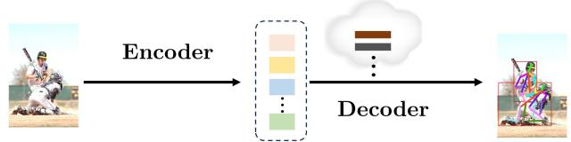
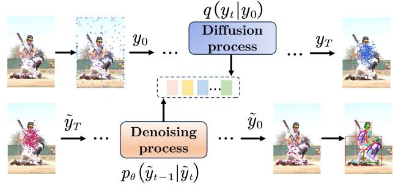
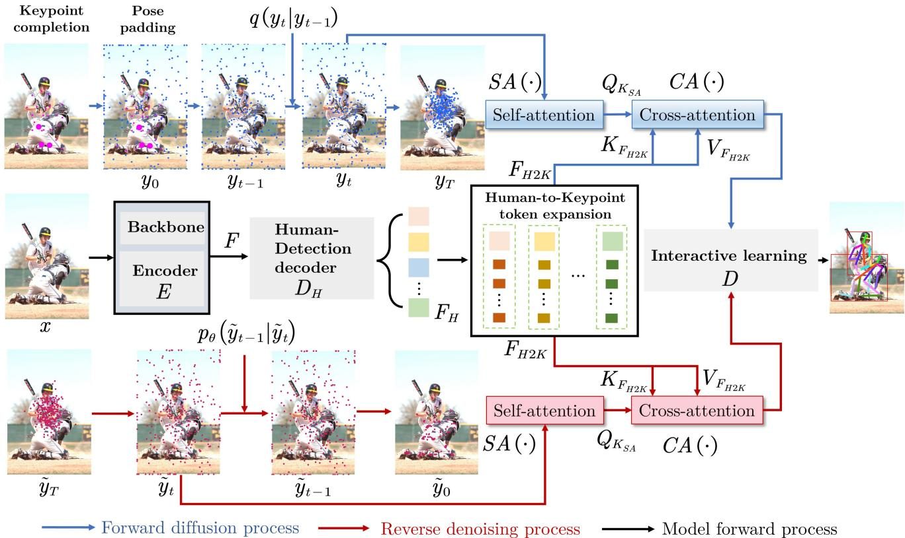
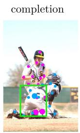
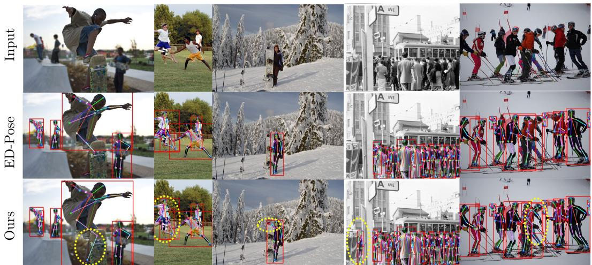

# DiffusionRegPose: Enhancing Multi-Person Pose Estimation using a Diffusion-Based End-to-End Regression Approach

Dayi Tan1 Hansheng Chen2 Wei Tian1\* Lu Xiong1 1Tongji University, China 2Stanford University, USA {dytan, tian wei, xiong lu}@tongji.edu.cn, hanshengchen@stanford.edu

## Abstract

This paper presents the DiffusionRegPose, a novel ap proach to multi-person pose estimation that converts a onestage, end-to-end keypoint regression model into a diffusionbased sampling process. Existing one-stage deterministic regression methods, though efficient, are often prone to missed or false detections in crowded or occluded scenes, due to their inability to reason pose ambiguity. To address these challenges, we handle ambiguous poses in a generativefashion, i.e., sampling from the image-conditioned pose distributions characterized by a diffusion probabilistic model. Specifically, with initial pose tokens extracted from the image, noisy pose candidates are progressively refined by interacting with the initial tokens via attention layers. Extensive evaluations on the COCO and CrowdPose datasets show that DiffusionRegPose clearly improves the pose accuracy in crowded scenarios, as evidenced by a notable 4.0 AP increase in the AP metric on the CrowdPose dataset. This demonstrates the model’s potential for robust and precise human pose estimation in real-world applications. Code will be available at https://github.com/cici203/DiffusionRegPose.

## 1. Introduction

Multi-person pose estimation is a well-explored area in computer vision, which involves locating the keypoints that correspond to body parts of each person within an image. It has been adopted in various applications, including human action recognition [39, 40], human body reconstruction [35, 47], and human image generation [15, 21]. The multi-person pose estimation can be broadly classified into three categories: top-down [26, 34, 36, 42, 44], bottom-up [5, 8, 22, 38], and one-stage methods [20, 29, 37, 41]. The top-down method typically relies on an off-the-shelf object detector, which is firstly applied to identify persons within an image and then followed by the single-person pose estimation. In contrast, the bottom-up approach initially detects keypoints in an instance-agnostic manner and subsequently groups them to form individual human instances. Compared to those twostage approaches above, the one-stage method is capable of directly outputting a sequence of potential human poses, yielding improved computing efficiency and thus drawing increased research attention.

  
(a) Naïve one-stage end-to-end framework

  
(b) Diffusion based one-stage end-to-end framework  
Figure 1. Comparison of one-stage end-to-end human pose estimation frameworks. The na¨ıve method is represented in (a), while our proposed diffusion-based approach is illustrated in (b).

A typical strategy for one-stage approaches is the keypoint regression with an end-to-end framework to learn the mapping from the input image to the coordinates of human joints (Fig. 1 (a)). This approach offers advantages for realtime pose estimation tasks, given its reduced computational and memory cost, as well as the capability to achieve subpixel precision. Furthermore, when encountering truncations, regression-based methods excel in extrapolating joint positions outside the input image, a task which heatmap-based methods struggle to accomplish [17]. However, in ambiguous scenarios such as occluded/crowded ones, the indistinct nature of the pose renders the regression method inadequate for accurately deducing pose positioning.

Due to the complex diversity and visibility of human poses in crowded scenes, addressing the ambiguity issue requires an appropriate modeling of pose distribution. Diff-Pose [9] utilizes the process of diffusion to gradually convert a 3D pose distribution characterized by high uncertainty and indeterminacy into a 3D pose with reduced uncertainty. The goal is not to forecast a single optimal pose, but rather to approximate a set of poses that can adequately represent the posterior distribution. Given this, we aim to devise a one-stage end-to-end regression approach oriented towards capturing the ambiguity of multi-person poses via the diffusion model. We derive the inspiration from the work [3] modelling object detection as the process of eliminating noise from a sequence of noisy boxes to extract object boxes. We present the DiffusionRegPose, which performs the multiperson pose estimation by denoising a series of noisy poses (Fig. 1 (b)). To leverage occluded pose information effectively, the DiffusionRegPose incorporates a strategy wherein, during training, the invisible keypoints are completed to rational coordinates and included in initial poses for the diffusion process. By introducing a Gaussian noise to corrupt keypoints to a random distribution, the diffusion model learns to reconstruct accurate poses from the noisy ones, which are interacted with feature tokens via attention mechanisms. During inference, the diffusion model progressively refines the noisy poses through a denoising process. We evaluate the DiffusionRegPose on two datasets for multi-person pose estimation and demonstrate its overall solid performance, especially in crowded scenarios.

To summarize, our main contributions are as follows:

• We present DiffusionRegPose, the first multi-person pose estimation to convert the one-stage end-to-end keypoint regression model into a diffusion-based sampling process.

• We introduce an attention learning of information interaction between pose denoising and human detection processes. It demonstrates a mutual benefit, enhancing both the precision of human detection and the robustness of denoised poses in crowded scenarios.

• We propose a probabilistic method to complete invisible keypoints to rational positions, effectively leveraging occluded pose information. Along with the simple target padding, it facilitates the learning of diffusion process.

## 2. Related Work

## 2.1. One-stage Multi-Person Pose Estimation

Instead of using a human detector or keypoint grouping process in two-stage methods [5, 8, 34, 36, 42], the onestage approach [28, 33] simultaneously outputs candidate poses that include keypoint locations from the same person. These methods rely on searching local peaks in the keypoint heatmap and performing post-processing by a manually optimized non-maximum suppression (NMS), which is not optimized in an end-to-end fashion. To address this issue, Shi et al. [29] proposed the PETR, a fully end-to-end framework, which frames the pose estimation as a hierarchical set prediction problem, merging the localization of person instances and fine-grained body joints, effectively reducing the feature misalignment. To preserve local details, the QueryPose [37] leverages learnable part-level queries, which enables the acquisition of spatial awareness features and facilitates the development of a sparse, end-to-end multiperson pose regression framework. Furthermore, Yang et al. [41] developed the ED-Pose to achieve global dependencies by implementing a detector for all individuals using human box queries obtained from encoded image tokens. The GroupPose [20] introduces a straightforward adjustment to the decoder architecture in ED-Pose. This modification entails replacing the standard self-attention in the decoder with two consecutive groups of self-attention. The first one extracts the relationship between the keypoint query and the corresponding instance query while the second self-attention captures the relationship between each keypoint query of the same class.

Despite the promising results of these one-stage methods in multi-person pose estimation, challenges persist in pose misdetection and false detections in occluded/crowded scenes.

## 2.2. Diffusion-based Human Pose Estimation

The denoising diffusion probability models (DDPM) [11, 30, 31] represent a class of generative models specifically addressing the recovery of target data samples from noisy observations. The generative process begins with the noisy observations, achieved through the corruption of target data samples with random noise. Subsequently, the model iteratively and progressively reduces the noise in multiple steps. Recently, the diffusion model has demonstrated remarkable performance across several tasks, including image/video synthesis [12, 45], audio processing [7, 14], view synthesis [2, 43], and perception tasks [1, 3]. Given the distinctive capabilities of DDPM in capturing data distribution patterns, some works leverage these advantages in the context of human pose estimation (HPE). Prior endeavours [25, 46] have focused on the monocular 3D HPE task. They incorporate temporal information to address the inherent depth ambiguities and occlusions, yet frame sequences are inaccessible in some scenarios. To solve this, the DiffPose [13] considers an uncertain 3D pose distribution as input, which is subsequently evolved into an optimal 3D pose distribution by leveraging a diffusion model. This process is conditioned on the contextual information derived from given 2D pose sequences. A 2D-to-3D pose lifting is utilized in the Diffupose [6]. It leverages a diffusion model to efficiently generate multiple 3D candidate poses from the detections of an available 2D keypoint detector. Likewise, the D3DP [27] method involves a denoising mechanism conditioned on given 2D keypoints to produce a plausible 3D pose hypothesis. In contrast to the Diffupose, the D3DP opts for a multi-hypothesis aggregation method to obtain the ultimate output.

Since the aforementioned 3D pose estimation methods all rely on the 2D pose information, the quality of detected 2D keypoints significantly influences the accuracy of esti mated 3D poses, underscoring the pivotal importance of the 2D pose estimation task. The DiffusionPose [26] adopts a top-down paradigm for 2D pose estimation that generates keypoint heatmaps from noised heatmaps. It is essential to note that it does not constitute an end-to-end framework because of utilizing an extra human detection. Our proposed approach DiffusionRegPose, inspired by the DiffusionDet [3], employs a denoising diffusion process to convert a noised pose into the targeted one in a one-stage end-to-end manner. DiffusionRegPose facilitates information exchange between human instance detection and pose regression, enhancing performance in crowded scenarios.

## 3. Method

## 3.1. Preliminary

Diffusion models are a class of generative models that aim to model complex data distributions by transforming a simple starting distribution into the desired complex data distribution through a sequence of invertible operations. The forward process q in the diffusion model involves the addition of Gaussian noise to initial data $y _ { 0 }$ for step $t \in \{ 0 , 1 , \ldots , T \}$ formulated as

$$
q \left( y _ { t } \mid y _ { t - 1 } \right) = \mathcal { N } \left( y _ { t } \mid \sqrt { \overline { { \alpha } } _ { t } } y _ { t - 1 } , \left( 1 - \overline { { \alpha } } _ { t } \right) \pmb { I } \right) ,\tag{1}
$$

where $\begin{array} { r } { \overline { { \alpha } } _ { t } : = \prod _ { s = 0 } ^ { t } \alpha _ { s } = \prod _ { s = 0 } ^ { t } \left( 1 - \beta _ { s } \right) } \end{array}$ and $\beta _ { s }$ denotes the schedule of noise variances. Symbol $\mathcal { N } ( \cdot | \cdot )$ indicates the Gaussian distribution and I represents the identity matrix. Specifically, the sampled $y _ { t }$ can be directly acquired from the initial value $y _ { 0 }$ by

$$
q \left( y _ { t } \mid y _ { 0 } \right) = \mathcal { N } \left( y _ { t } \mid \sqrt { \gamma _ { t } } y _ { 0 } , \left( 1 - \gamma _ { t } \right) { \cal I } \right) ,\tag{2}
$$

where $\begin{array} { r } { \gamma _ { t } = \prod _ { i = 0 } ^ { t } \overline { { \alpha } } _ { i } } \end{array}$ .Thus, Eq. 2 can be represented as

$$
y _ { t } = \sqrt { \gamma _ { t } } y _ { 0 } + \sqrt { 1 - \gamma _ { t } } \epsilon , \quad \epsilon \sim \mathcal { N } ( 0 , I ) ,\tag{3}
$$

where ϵ denotes the sampling noise.

## 3.2. DiffusionRegPose

The framework of DiffusionRegPose is shown in Fig. 2. The training process (Blue flow + Black flow) includes the Forward Diffusion Process and Model Forward Process, while

the inference process (Red flow + Black flow) contains the Reverse Diffusion Process and Model Forward Process.

## 3.2.1 Forward Diffusion Process

Since each image contains a different number of person instances, to facilitate the framework construction, the number of predicted candidate poses for each image should be fixed. Thus, the initial step in diffusion process involves padding supplemental poses to the extant ones, thereby establishing a pose set $y _ { 0 }$ for a fixed number $N _ { i } ~ ( \mathrm { e . g . , 1 0 0 } )$ of person instances. The detailed discussion about employed padding strategies can be seen in the experimental section (Table 4).

During training, a Gaussian noise is introduced to the pose set $y _ { 0 }$ (initialized by the ground truth), as shown in Fig. 2 (Blue flow). At step t, the corrupted pose set $y _ { t }$ is subject to a conditional distribution, represented as

$$
\begin{array} { r l } & { y _ { t } = q \left( y _ { t } \mid y _ { 0 } , \zeta \right) } \\ & { \quad = \sqrt { \gamma _ { t } } \left( \zeta \cdot y _ { 0 } \right) + \sqrt { 1 - \gamma _ { t } } \epsilon , \quad \epsilon \sim \mathcal { N } ( 0 , I ) , } \end{array}\tag{4}
$$

where the scale parameter ζ regulates the ratio between the signal and the noise. The keypoint self-attention (K SA) module $S A ( \cdot )$ is subsequently employed to compute the correlation relationship QC among these corrupted keypoints $y _ { t }$ by

$$
\begin{array} { r c l } { { } } & { { } } & { { Q _ { y _ { t } } = M L P _ { Q s } ( y _ { t } ) } } \\ { { } } & { { } } & { { K _ { y _ { t } } = M L P _ { K s } ( y _ { t } ) } } \\ { { } } & { { } } & { { V _ { y _ { t } } = M L P _ { V s } ( y _ { t } ) } } \\ { { } } & { { } } & { { Q _ { C K } = S A ( Q _ { y _ { t } } , K _ { y _ { t } } , V _ { y _ { t } } ) , } } \end{array}\tag{5}
$$

where MLP represents the Multi-Layer Perceptron, and $Q _ { y _ { t } } , K _ { y _ { t } }$ , and $V _ { y _ { t } }$ denote query, key, and value tokens, respectively.

## 3.2.2 Model Forward Process

The forward process of our model $f _ { \theta }$ with parameter set θ is shown in Fig. 2 (Black flow). Upon receiving an image x, the initial process involves extracting multi-scale features utilizing the backbone. These features are subsequently fed into a Transformer encoder $E ( \cdot )$ , such as a deformable attention module, which incorporates a positional embedding to compute tokens F. Taking into account the strong correlation between the regressed pose and the detected person, the information interaction between pose denoising and human detection can facilitate a mutual guidance for learning both processes. Thus, a set of coarse keypoint coordinate tokens $F _ { H 2 K }$ is acquired after passing these tokens F through the Human-Detection decoder $D _ { H }$ and the Human-to-Keypoint token expansion module $D _ { H 2 K }$ , interpreted as

$$
\begin{array} { c } { F _ { H } = D _ { H } ( F ) } \\ { F _ { H 2 K } = D _ { H 2 K } ( F , F _ { H } ) . } \end{array}\tag{6}
$$

  
Figure 2. The DiffusionRegPose framework encompasses four principal components: keypoint completion (KC), forward denoising process (FDP), model forward process (MFP), and reverse diffusion process (RDP). In the KC stage, 2D invisible keypoints are completed to rational positions. The GT poses are also padded to a fixed number $N _ { i }$ (displayed 20 in this figure) and serve as the initial state $y _ { 0 }$ of FDP. At step t of FDP, state $y _ { t }$ is corrupted from y0 via $q \left( y _ { t } \mid y _ { t - 1 } \right)$ . Subsequently, after $y _ { t }$ undergoes corruption, queries $Q _ { K _ { S A } }$ are generated by employing the self-attention module. Furthermore, the image is sequentially passed through backbone, encoder $E$ and decoder $D _ { H }$ during MFP to conduct Human-to-Keypoint token expansion FH2K. It is further converted to tokens $K _ { F _ { H 2 K } }$ and $V _ { F _ { H 2 K } }$ and subsequently sent into the cross-attention module. The cross attention $C A ( \cdot )$ is supplied to the diffusion decoder D to yield $N _ { i }$ human pose candidates. In the inference process (RDP), the final $N _ { i }$ candidate poses are obtained from the noised poses through p $\left( \tilde { y } _ { t - 1 } \mid \tilde { y } _ { t } \right)$ in an iterative way.

The Keypoint Cross-Attention (K-CA) module, denoted $\operatorname { a s } C A ( \cdot )$ , is employed to calculate the relationship between the keypoint proposals from the output generated by $F _ { H 2 K }$ and $Q _ { C K }$ . The coarse keypoints $c K p t s$ and coarse human boxes cBox can be obtained as:

$$
\begin{array} { r } { Q _ { K _ { S A } } = M L P _ { Q c } ( Q _ { C K } ) } \\ { K _ { F _ { H 2 K } } = M L P _ { K c } ( F _ { H 2 K } ) } \\ { V _ { F _ { H 2 K } } = M L P _ { V c } ( F _ { H 2 K } ) } \\ { c K p t s , c B o x = C A ( Q _ { K _ { S A } } , K _ { F _ { H 2 K } } , V _ { F _ { H 2 K } } ) . } \end{array}\tag{7}
$$

Finally, the diffusion decoder D (Human-to-Keypoint detection decoder) learns the interaction between cKpts and cBox, and regresses the keypoint coordinates $y _ { t } ^ { \prime } ,$ human boxes $b _ { t }$ and box classes $c _ { t }$ as:

$$
y _ { t } ^ { \prime } , b _ { t } , c _ { t } = D \left( c K p t s , c B o x \right) .\tag{8}
$$

Similar to the ED-Pose [41], our employ the focal loss for box classification $( \boldsymbol { L _ { c } } )$ , and L1-loss for human box regression $( L _ { h } )$ and keypoint regression $( L _ { k } )$ . By repetition of the procedure above, the DiffusionRegPose iteratively optimizes the estimation of $N _ { i }$ poses and human boxes by updating the entire model $f _ { \theta }$ with gradient descent step until it convergences.

## 3.2.3 Reverse Diffusion Process

The inference process of DiffusionRrePose can be described as a denoising sampling process that transitions from a Gaussian noise to a target human pose, as shown in Fig. 2 (Red flow). Initially, the model uses the DDIM [30] sampling strategy to sample poses from a Gaussian distribution and then iteratively restores the human pose in a progressive denoising process as pθ $\left( \tilde { y } _ { t - 1 } \mid \tilde { y } _ { t } \right)$ . Detailed steps about this denoising process are given in Algorithm 1.

Algorithm 1 Inference in T iterative steps   
1: Input: image x, total number of diffusion steps $T$   
2: Extracting feature: $x ^ { f e a } =$ backbone ${ \bf \Psi } _ { : } ( x )$   
3: Tokenized representation: $\boldsymbol { F } = E ( \boldsymbol { x } ^ { f e a } )$   
4: Human box query: $F _ { H } = D _ { H } ( F )$   
5: Human-to-keypoint query expansion:   
$F _ { H 2 K } = D _ { H 2 K } ( F , F _ { H } )$   
6: for $t = T , . . . , 1$ do   
7: Acquiring noised pose coordinates $\tilde { y } _ { t }$   
8: Tokens for self-attention:   
$Q _ { \tilde { y } _ { t } } , K _ { \tilde { y } _ { t } } , V _ { \tilde { y } _ { t } } = M L P _ { X \in ( Q s , K s , V s ) } ( \tilde { y } _ { t } )$   
9: $Q _ { C K } = S A ( Q _ { \tilde { y } _ { t } } , K _ { \tilde { y } _ { t } } , V _ { \tilde { y } _ { t } } )$   
10: Tokens for cross-attention:   
$Q _ { K _ { S A } } = M L P _ { Q c } ( Q _ { C K } ) ,$   
$K _ { F _ { H 2 K } } , V _ { F _ { H 2 K } } = M L P _ { X \in ( K c , V c ) } ( F _ { H 2 K } )$   
11: ${ \mathit { c K p t s , c B o x } } = { \mathit { C A } } ( Q _ { K s A } , K _ { F _ { H 2 K } } , V _ { F _ { H 2 K } } )$   
12: Decoding: $\tilde { y } _ { t - 1 } , b _ { t - 1 } , \tilde { c } _ { t - 1 } = D \left( c K p t s , c B o x \right)$   
13: end for   
14: Output $\tilde { y } _ { 0 }$

## 3.2.4 Keypoint Completion

It is inevitable to encounter invisible keypoints of a human pose due to occlusion in crowded scenes. However, on public benchmarks [16, 19], ground truth (GT) coordinates of invisible keypoints are defaultly assigned with zeros, as shown in Fig. 3. This setting not only causes multiple invisible keypoints indistinguishable, but also results in large deviations of keypoints from the actual body parts, violating the normal keypoint distribution of a human body. Therefore, it is necessary to assign rational initial positions to the invisible keypoints in the diffusion process.

To complete the invisible keypoints, we employ a probabilistic approach. Given an image of size $W \times H$ the coordinates (u, v) of a keypoint are normalized to $\begin{array} { r } { \big ( \frac { u - l _ { u } } { W \cdot L _ { h e a d } } , \frac { v - l _ { v } } { H \cdot L _ { h e a d } } \big ) } \end{array}$ , which are stored in matrix M ∈ $\mathbb { R } ^ { 2 K \times N }$ for a total number of N person instances in the dataset with K keypoints per person. Point $( l _ { u } , l _ { v } )$ indicates the upper-left corner of the bounding box of a person instance. And $L _ { h e a d }$ is the head length corresponding to the person. In each column i of matrix M, we employ a flattened coordinate representation as $M ( : , i ) =$ $[ u _ { i , 1 } , v _ { i , 1 } , u _ { i , 2 } , v _ { i , 2 } , . . . ] ^ { \top }$ , where $\left( { { u } _ { i , k } } , { { v } _ { i , k } } \right)$ indicate the coordinate of the k-th keypoint of person i.

For each person instance which is only partially visible, we reorder the keypoint coordinates in the corresponding column of matrix M as $\pmb { Y } = [ \pmb { Y } _ { I } ; \pmb { Y } _ { V } ] \in \mathbb { R } ^ { 2 K \times \hat { 1 } }$ , where $\mathbf { { \cal Y } } _ { I }$ represents the unknown coordinates of invisible keypoints, while $\mathbf { Y } _ { V }$ signifies the coordinates of visible keypoints. Thus, matrix M is rearranged to a new matrix $M ^ { \prime }$ Accordingly, we calculate the mean $\pmb { \mu } \in \mathbb { R } ^ { 2 K \times 1 }$ and covariance $\bar { \mathbf { \Sigma } } \in \mathbb { R } ^ { 2 K \times 2 K }$ of locations of visible keypoints stored in $M ^ { \prime }$ . By assuming that the keypoint coordinates of a person follow a multi-normal distribution characterized by the mean $\pmb { \mu }$ and covariance Σ, the maximum likelihood estimation (MLE) of keypoint coordinates $Y _ { M L E }$ , for a person instance containing at least one invisible keypoint, is determined as

w/o completion   
72.5   
72.0   
A)(%) 71.5   
71.0   
w/o completion   
70.5 completion   
70.0   
30 40 50 60 70 80   
epoch   
completion 62.6   
62.4   
62.2   
A%)d%) 62.0 61.8   
61.6   
w/o completion   
61.4   
completion   
61.2   
61.0   
30 40 50 60 70 80   
epoch  
Figure 3. Comparison of keypoints with default zero coordinate setting and those completed by our proposed approach (depicted with a larger radius than the visible keypoints). The related learning curves for keypoint regression and human detection, indicated by the AP and $\mathsf { A P } _ { b }$ metric, respectively, are illustrated on right side.

$$
\mathbf { \boldsymbol { Y } } _ { M L E } = \operatorname* { m a x } _ { \mathbf { \boldsymbol { Y } } } \mathcal { N } ( \mathbf { \boldsymbol { Y } } \mid \pmb { \mu } , \pmb { \Sigma } ) .\tag{9}
$$

Based on the probability density function of Gaussian distribution, Eq. 9 can be expressed as equivalent to the form:

$$
\begin{array} { r l } & { Y _ { M L E } = \underset { \pmb { Y } } { \mathrm { m i n } } \left( ( \pmb { Y } - \pmb { \mu } ) ^ { \top } \pmb { \Sigma } ^ { - 1 } ( \pmb { Y } - \pmb { \mu } ) \right) } \\ & { \qquad = \underset { \pmb { Y } } { \mathrm { m i n } } \left( ( \pmb { Y } - \pmb { \mu } ) ^ { \top } \pmb { L } \pmb { L } ^ { \top } ( \pmb { Y } - \pmb { \mu } ) \right) , } \\ & { \qquad = \underset { \pmb { Y } } { \mathrm { m i n } } \left\| \pmb { L } ^ { \top } ( \pmb { Y } - \pmb { \mu } ) \right\| _ { 2 } } \end{array}\tag{10}
$$

where the Cholesky decomposition is performed on the covariance matrix as $\dot { \Sigma } ^ { - 1 } = \dot { L } L ^ { \top }$ . With a further matrix split $\pmb { L } ^ { \top } = [ \pmb { A } _ { I } , \pmb { A } _ { V } ]$ , Eq. 10 can be reformulated as

$$
\pmb { Y } _ { M L E } = \operatorname* { m i n } _ { \pmb { Y } } \left\| \pmb { A } _ { I } \pmb { Y } _ { I } + \pmb { A } _ { V } \pmb { Y } _ { V } - \pmb { L } ^ { \top } \pmb { \mu } \right\| _ { 2 } .\tag{11}
$$

The least squares method is employed to obtain the completed coordinates of invisible keypoints, and the solution is denoted as

$$
\pmb { Y } _ { I } ^ { \prime } = \left( \pmb { A } _ { I } ^ { \top } \pmb { A } _ { I } \right) ^ { - 1 } \pmb { A } _ { I } ^ { \top } \left( \pmb { L } ^ { \top } \pmb { \mu } - \pmb { A } _ { V } \pmb { Y } _ { V } \right) .\tag{12}
$$

Finally, $\pmb { Y } _ { \mathit { M L E } } = \left\lceil \pmb { Y } _ { \mathit { I } } ^ { \prime } ; \pmb { Y } _ { V } \right\rceil$ represents the pose within the initial step of the diffusion process. An example of keypoint completion is shown in Fig. 3. It is noteworthy that compared to the default zero coordinate setting, the learning of keypoint regression and human detection is benefited by our completion approach.

## 4. Experiments

## 4.1. Datasets and Metrics

Experiments are conducted on two widely used datasets for human pose estimation, namely CrowdPose [16] and MS COCO [19]. The CrowdPose dataset consists of 20K images and 80K individual instances, each with 14 keypoints. The MS COCO dataset comprises over 200K annotated images, each containing 17 keypoints representing the human body. Moreover, a split for training, validation, and test is provided by this dataset, which comprise approximately 60K, 5K, and 20K images, respectively.

On both datasets, we evaluate the model performance by the metric of Average Precision (AP) score, which is calculated based on the Object Keypoint Similarity (OKS) measure. We also conduct a comprehensive evaluation using different OKS thresholds, leading to two additional scores of $\mathsf { A P } _ { 5 0 }$ and $\mathsf { A P } _ { 7 5 }$ . To further assess the model performance on the MS COCO dataset, additional AP scores are calculated for different object sizes, specifically for medium $( \mathrm { A P } _ { M } )$ and large $( \mathrm { A P } _ { L } )$ instances. In the case of the CrowdPose dataset, different levels of crowded scenes are also considered. Accordingly, AP scores are computed for images representing easy $( \operatorname { A P } _ { E } )$ , medium $( \mathsf { A P } _ { M } )$ , and difficult $( \operatorname { A P } _ { H } )$ crowded scenes w.r.t. the crowd index [16].

## 4.2. Implementation Details

During the training phase, data augmentations such as random cropping, flipping, and resizing are applied to the input images. We utilize an optimizer with the AdamW weight attenuation of $1 \times 1 0 ^ { - 4 }$ and train our model for 80 epochs on the COCO dataset and 80 epochs on the CrowdPose dataset. The training process is carried out on the Nvidia A40 GPU with a batch size of 8. The initial learning rate is set at $2 \times 1 0 ^ { - 4 }$ , and undergoes a decay by multiplying with 0.1 at the 30-th and 65-th epoch on the COCO and CrowdPose datasets, respectively. For implementation, we choose ResNet-50 as backbone. The design of decoder part is similar to that of ED-pose [41]. Other detailed parameter settings for our model can be referred to the supplementary material.

## 4.3. Experimental Results on COCO

Comparisons with end-to-end frameworks. The Diffusion-RegPose is firstly trained on the subset of COCO train2017 and evaluated on the COCO val2017. Table 1 presents its performance in comparison with other state-of-the-art methods. It reveals that the DiffusionRegPose outperforms the current end-to-end approaches, including PETR [29], Query-Pose [37], ED-Pose [41], and GroupPose [20] with the same backbone ResNet-50. Specifically, the DiffusionRegPose achieves an AP superiority of 3.7% over the first end-toend method PETR [29], which is mainly Transformer-based. Moreover, the DiffusionRegPose exhibits a notable superiority over the GroupPose [20], which does not involve human detection tasks. Although the QueryPose [37] and ED-Pose [41] entail an additional human box supervision, the DiffusionRgePose still achieves AP improvements of 3.8% and 0.9%, respectively, attributing to the adopted joint pose denoising and interaction learning.

Comparisons with non-end-to-end frameworks. The pose estimation performance of DiffusionRegPose compared with non-end-to-end frameworks are shown in Table 1. It is obvious that the DiffusionRegPose demonstrates a significant superiority over bottom-up methods [5, 8, 22, 38] and previous one-stage approaches [23, 28, 33, 48]. Notably, the compared bottom-up models employ a complicated back bone, i.e., the HRNet-w32 [32], while our DiffusionReg-Pose adopts the ResNet-50 and still outperforms them by an AP margin of at least 2.9%. The $\mathbf { A P }$ for human detection (denoted as $\operatorname { A P } _ { b } )$ by DiffusionRegPose is yet 46.5%, significantly inferior to the 56.4% AP of human detectors utilized by most top-down methods. However, the gap in terms of pose estimation is much smaller, which is reduced to 3.4% compared to the top-performed method Diffusion-Pose [26]. Additionally, the AP of DiffusionRegPose even exceeds top-down approaches like Mask R-CNN [10], SimpleBaseline [36] and PRTR [18]. Nevertheless, the DiffusionRegPose achieves the best $\mathrm { { A P } _ { 5 0 } }$ and the second best $\mathsf { A P } _ { 7 5 }$ , indicating the most estimated keypoints similar to their ground truths.

## 4.4. Experimental Results on CrowdPose

The CrowdPose poses more challenges as it contains more crowded scenes and instances where the poses are obscured. Our model is trained on the trainval set and evaluated on the test set. The performance comparison of DiffusionRegPose with other state-of-the-art methods is reported in Table 2. Specifically, our approach outperforms the top-down method SimpleBaseline [36] with the same backbone (ResNet-50), by achieving an AP improvement of 11.9%, and is comparable to the best performed top-down method HRFormer-B [44]. Furthermore, our proposed method surpasses all bottom-up methods and other one-stage methods in terms of the AP score, further validating its efficacy.

Notably, our proposed DiffusionRegPose exhibits a superior performance over most of compared approaches across various crowded levels. Specifically, with the same backbone ResNet-50 and regression loss of detection box and keypoints, the DiffusionRegPose surpasses the one-stage method ED-Pose by improvements of 1.6%, 2.7%, and 4.0% in the cases of $\mathsf { A P } _ { E }$ (crowd index < 0.2), APM (0.2 ≤ crowd index $< 0 . 8 )$ , and $\mathrm { A P } _ { H }$ (crowd index $\geq 0 . 8 )$ , respectively, wherein a higher value of the crowd index indicates a more densely populated scene. Compared to the results on COCO, the DiffusionRegPose exhibits a larger gain of human detection AP over the ED-Pose on CrowdPose, which is 2.9%, implying that our model is more robust to occluded scenes. As in Fig. 4, the ED-pose encounters the challenges of missing and misidentified keypoints due to object occlusion or overlapped multiple individuals, while our proposed method effectively rationalizes the deducing of keypoints and successfully detects severely occluded human instances.

Table 1. Comparisons with state-of-the-art methods on COCO val2017. “†” symbolizes the flip test. $\mathrm { ^ { * } T D ^ { * } , \tilde { \Sigma } B U ^ { * } }$ , and $\mathrm { ^ { 6 6 } O S ^ { \circ } }$ denote the top-down, bottom-up, and one-stage methods, respectively. “HM”, “BR” and $\mathbf { \tilde { \Sigma } } ^ { 6 6 } \mathbf { K } \mathbf { R } ^ { 5 5 }$ indicate adopting heatmap-based losses, human box regression losses and keypoint regression losses, respectively. “‡” symbolizes the exclusion of uncertainty estimation in Poseur for a fair comparison. $\mathsf { A P } _ { b }$ denotes the human detection AP. All AP values are displayed in %. The 1st, 2nd and 3rd place are color coded for metrics with more than three distinct values.“-” shows the results that are not available.
<table><tr><td rowspan=1 colspan=3>Method</td><td rowspan=1 colspan=1>Ref</td><td rowspan=1 colspan=1>Backbone</td><td rowspan=1 colspan=1>Loss</td><td rowspan=1 colspan=1>AP</td><td rowspan=1 colspan=1> $\overline { { \mathrm { A P } _ { 5 0 } } }$ </td><td rowspan=1 colspan=1> $\overline { { \mathrm { A P } _ { 7 5 } } }$ </td><td rowspan=1 colspan=1> $\overline { { \mathsf { A P } _ { M } } }$ </td><td rowspan=1 colspan=1>APL</td><td rowspan=1 colspan=1> $\overline { { \mathsf { A P } _ { b } } }$ </td></tr><tr><td rowspan=15 colspan=1>Non---End</td><td rowspan=7 colspan=1>TD</td><td rowspan=1 colspan=1>Mask R-CNN [10]</td><td rowspan=1 colspan=1>CVPR 17</td><td rowspan=1 colspan=1>ResNet-50</td><td rowspan=1 colspan=1>HM</td><td rowspan=1 colspan=1>65.5</td><td rowspan=1 colspan=1> $\overline { { 8 7 . 2 } }$ </td><td rowspan=1 colspan=1> $\overline { { 7 1 . 1 } }$ </td><td rowspan=1 colspan=1>61.3</td><td rowspan=1 colspan=1>73.4</td><td rowspan=1 colspan=1></td></tr><tr><td rowspan=1 colspan=1>Mask R-CNN [10]</td><td rowspan=1 colspan=1>CVPR 17</td><td rowspan=1 colspan=1>ResNet-101</td><td rowspan=1 colspan=1>HM</td><td rowspan=1 colspan=1>65.5</td><td rowspan=1 colspan=1>87.4</td><td rowspan=1 colspan=1>72.0</td><td rowspan=1 colspan=1>61.5</td><td rowspan=1 colspan=1>74.4</td><td rowspan=1 colspan=1></td></tr><tr><td rowspan=1 colspan=1>Sim.Base. [36]</td><td rowspan=1 colspan=1>CVPR 17</td><td rowspan=1 colspan=1>ResNet-50</td><td rowspan=1 colspan=1>HM</td><td rowspan=1 colspan=1>70.4</td><td rowspan=1 colspan=1>88.6</td><td rowspan=1 colspan=1>78.3</td><td rowspan=1 colspan=1>67.1</td><td rowspan=1 colspan=1>77.2</td><td rowspan=1 colspan=1>56.4</td></tr><tr><td rowspan=1 colspan=1>PRTR† [18]</td><td rowspan=1 colspan=1>CVPR 21</td><td rowspan=1 colspan=1>ResNet-50</td><td rowspan=1 colspan=1>KR</td><td rowspan=1 colspan=1>68.2</td><td rowspan=1 colspan=1>88.2</td><td rowspan=1 colspan=1>75.2</td><td rowspan=1 colspan=1>63.2</td><td rowspan=1 colspan=1>76.2</td><td rowspan=1 colspan=1>56.4</td></tr><tr><td rowspan=1 colspan=1>Poseur‡ [24]</td><td rowspan=1 colspan=1>ECCV 22</td><td rowspan=1 colspan=1>ResNet-50</td><td rowspan=1 colspan=1>RLE</td><td rowspan=1 colspan=1>70.0</td><td rowspan=1 colspan=1></td><td rowspan=1 colspan=1></td><td rowspan=1 colspan=1></td><td rowspan=1 colspan=1></td><td rowspan=1 colspan=1>56.4</td></tr><tr><td rowspan=1 colspan=1>Poseur [24]</td><td rowspan=1 colspan=1>ECCV 22</td><td rowspan=1 colspan=1>ResNet-50</td><td rowspan=1 colspan=1>RLE</td><td rowspan=1 colspan=1>74.2</td><td rowspan=1 colspan=1>89.5</td><td rowspan=1 colspan=1>81.3</td><td rowspan=1 colspan=1>71.1</td><td rowspan=1 colspan=1>80.1</td><td rowspan=1 colspan=1>56.4</td></tr><tr><td rowspan=1 colspan=1>DiffusionPose [26]</td><td rowspan=1 colspan=1>-23</td><td rowspan=1 colspan=1>HRNet-w32</td><td rowspan=1 colspan=1>HM</td><td rowspan=1 colspan=1>75.9</td><td rowspan=1 colspan=1></td><td rowspan=1 colspan=1></td><td rowspan=1 colspan=1></td><td rowspan=1 colspan=1></td><td rowspan=1 colspan=1>56.4</td></tr><tr><td rowspan=4 colspan=1>BU</td><td rowspan=1 colspan=1>HrHRNet† [5]</td><td rowspan=1 colspan=1>CVPR 20</td><td rowspan=1 colspan=1>HRNet-w32</td><td rowspan=1 colspan=1>HM</td><td rowspan=1 colspan=1>67.1</td><td rowspan=1 colspan=1>86.2</td><td rowspan=1 colspan=1>73.0</td><td rowspan=1 colspan=1>61.5</td><td rowspan=1 colspan=1>76.1</td><td rowspan=1 colspan=1></td></tr><tr><td rowspan=1 colspan=1>DEKR†[8]</td><td rowspan=1 colspan=1>CVPR 21</td><td rowspan=1 colspan=1>HRNet-w32</td><td rowspan=1 colspan=1>HM</td><td rowspan=1 colspan=1>68.0</td><td rowspan=1 colspan=1>86.7</td><td rowspan=1 colspan=1>74.5</td><td rowspan=1 colspan=1>62.1</td><td rowspan=1 colspan=1>77.7</td><td rowspan=1 colspan=1></td></tr><tr><td rowspan=1 colspan=1>SWAHR†[22]</td><td rowspan=1 colspan=1>CVPR 21</td><td rowspan=1 colspan=1>HRNet-w32</td><td rowspan=1 colspan=1>HM</td><td rowspan=1 colspan=1>68.9</td><td rowspan=1 colspan=1>87.8</td><td rowspan=1 colspan=1>74.9</td><td rowspan=1 colspan=1>63.0</td><td rowspan=1 colspan=1>77.4</td><td rowspan=1 colspan=1></td></tr><tr><td rowspan=1 colspan=1>LOGO-CAP† [38]</td><td rowspan=1 colspan=1>CVPR 22</td><td rowspan=1 colspan=1>HRNet-w32</td><td rowspan=1 colspan=1>HM</td><td rowspan=1 colspan=1>69.6</td><td rowspan=1 colspan=1>87.5</td><td rowspan=1 colspan=1>75.9</td><td rowspan=1 colspan=1>64.1</td><td rowspan=1 colspan=1>78.0</td><td rowspan=1 colspan=1></td></tr><tr><td rowspan=4 colspan=1>OS</td><td rowspan=1 colspan=1>DirectPose [33]</td><td rowspan=1 colspan=1>- 19</td><td rowspan=1 colspan=1>ResNet-50</td><td rowspan=1 colspan=1>KR</td><td rowspan=1 colspan=1>63.1</td><td rowspan=1 colspan=1>85.6</td><td rowspan=1 colspan=1>68.8</td><td rowspan=1 colspan=1>57.7</td><td rowspan=1 colspan=1>71.3</td><td rowspan=1 colspan=1>-</td></tr><tr><td rowspan=1 colspan=1>CenterNet† [48]</td><td rowspan=1 colspan=1>- 19</td><td rowspan=1 colspan=1>Hourglass-104</td><td rowspan=1 colspan=1>KR+HM</td><td rowspan=1 colspan=1>64.0</td><td rowspan=1 colspan=1>-</td><td rowspan=1 colspan=1>-</td><td rowspan=1 colspan=1>-</td><td rowspan=1 colspan=1>-</td><td rowspan=1 colspan=1>-</td></tr><tr><td rowspan=1 colspan=1>FCPose [23]</td><td rowspan=1 colspan=1>CVPR 21</td><td rowspan=1 colspan=1>ResNet-50</td><td rowspan=1 colspan=1>KR+HM</td><td rowspan=1 colspan=1>63.0</td><td rowspan=1 colspan=1>85.9</td><td rowspan=1 colspan=1>68.9</td><td rowspan=1 colspan=1>59.1</td><td rowspan=1 colspan=1>70.3</td><td rowspan=1 colspan=1></td></tr><tr><td rowspan=1 colspan=1>InsPose [28]</td><td rowspan=1 colspan=1>ACM MM 21</td><td rowspan=1 colspan=1>ResNet-50</td><td rowspan=1 colspan=1>KR+HM</td><td rowspan=1 colspan=1>63.1</td><td rowspan=1 colspan=1>86.2</td><td rowspan=1 colspan=1>68.5</td><td rowspan=1 colspan=1>58.5</td><td rowspan=1 colspan=1>70.1</td><td rowspan=1 colspan=1>-</td></tr><tr><td rowspan=5 colspan=1>End---nd</td><td rowspan=5 colspan=1>OS</td><td rowspan=1 colspan=1>PETR [29]</td><td rowspan=1 colspan=1>CVPR 22</td><td rowspan=1 colspan=1>ResNet-50</td><td rowspan=1 colspan=1>KR+HM</td><td rowspan=1 colspan=1>68.8</td><td rowspan=1 colspan=1>87.5</td><td rowspan=1 colspan=1>76.3</td><td rowspan=1 colspan=1>62.7</td><td rowspan=1 colspan=1>77.7</td><td rowspan=1 colspan=1></td></tr><tr><td rowspan=1 colspan=1>QueryPose [37]</td><td rowspan=1 colspan=1>NeurIPS 22</td><td rowspan=1 colspan=1>ResNet-50</td><td rowspan=1 colspan=1>BR+RLE</td><td rowspan=1 colspan=1>68.7</td><td rowspan=1 colspan=1>88.6</td><td rowspan=1 colspan=1>74.4</td><td rowspan=1 colspan=1>63.8</td><td rowspan=1 colspan=1>76.5</td><td rowspan=1 colspan=1></td></tr><tr><td rowspan=1 colspan=1>ED-Pose [41]</td><td rowspan=1 colspan=1>ICLR 23</td><td rowspan=1 colspan=1>ResNet-50</td><td rowspan=1 colspan=1>BR+KR</td><td rowspan=1 colspan=1>71.6</td><td rowspan=1 colspan=1>89.6</td><td rowspan=1 colspan=1>78.1</td><td rowspan=1 colspan=1>65.9</td><td rowspan=1 colspan=1>79.8</td><td rowspan=1 colspan=1>46.6</td></tr><tr><td rowspan=1 colspan=1>GroupPose [20]</td><td rowspan=1 colspan=1>ICCV 23</td><td rowspan=1 colspan=1>ResNet-50</td><td rowspan=1 colspan=1>KR</td><td rowspan=1 colspan=1>72.0</td><td rowspan=1 colspan=1>89.4</td><td rowspan=1 colspan=1>79.1</td><td rowspan=1 colspan=1>66.8</td><td rowspan=1 colspan=1>79.7</td><td rowspan=1 colspan=1>-</td></tr><tr><td rowspan=1 colspan=1>DiffusionRgePose</td><td rowspan=1 colspan=1></td><td rowspan=1 colspan=1>ResNet-50</td><td rowspan=1 colspan=1>BR+KR</td><td rowspan=1 colspan=1>72.5</td><td rowspan=1 colspan=1>89.8</td><td rowspan=1 colspan=1>79.5</td><td rowspan=1 colspan=1>66.8</td><td rowspan=1 colspan=1>80.5</td><td rowspan=1 colspan=1>46.5</td></tr></table>

Table 2. Comparisons with state-of-the-art methods on CrowdPose test set. “†” denotes the flip test. $\operatorname { A P } _ { E } \colon$ crowd index $< 0 . 2 , \mathrm { A P } _ { M } \mathrm { : } 0 . 2 \leq$ crowd index $< 0 . 8 .$ , and $\operatorname { A P } _ { H } \mathbf { \cdot }$ : crowd index $\ge 0 . 8 .$ . All AP values are displayed in %. The 1st, 2nd and 3rd place are color coded.
<table><tr><td rowspan=1 colspan=1></td><td rowspan=1 colspan=1>Method</td><td rowspan=1 colspan=1>Loss</td><td rowspan=1 colspan=1>AP</td><td rowspan=1 colspan=1> $\mathrm { { A P } _ { 5 0 } }$ </td><td rowspan=1 colspan=1> $\overline { { \mathrm { A P } _ { 7 5 } } }$ </td><td rowspan=1 colspan=1> $\overline { { \mathsf { A P } _ { E } } }$ </td><td rowspan=1 colspan=1> $\overline { { \mathsf { A P } _ { M } } }$ </td><td rowspan=1 colspan=1> $\overline { { \mathsf { A P } _ { H } } }$ </td><td rowspan=1 colspan=1>APb</td></tr><tr><td rowspan=4 colspan=1>TD</td><td rowspan=1 colspan=1>Sim.Base. [36] (ResNet-50)</td><td rowspan=1 colspan=1>HM</td><td rowspan=1 colspan=1>60.8</td><td rowspan=1 colspan=1>81.4</td><td rowspan=1 colspan=1> $\overline { { 6 5 . 7 } }$ </td><td rowspan=1 colspan=1>71.4</td><td rowspan=1 colspan=1>61.2</td><td rowspan=1 colspan=1> $\overline { { 5 1 . 2 } }$ </td><td rowspan=1 colspan=1></td></tr><tr><td rowspan=1 colspan=1>HRNet [34] (HRNet-w48)†</td><td rowspan=1 colspan=1>HM</td><td rowspan=1 colspan=1>71.3</td><td rowspan=1 colspan=1>91.1</td><td rowspan=1 colspan=1>77.5</td><td rowspan=1 colspan=1>80.5</td><td rowspan=1 colspan=1>71.4</td><td rowspan=1 colspan=1>62.5</td><td rowspan=1 colspan=1>1</td></tr><tr><td rowspan=1 colspan=1>TransPose-H [42]</td><td rowspan=1 colspan=1>HM</td><td rowspan=1 colspan=1>71.8</td><td rowspan=1 colspan=1>91.5</td><td rowspan=1 colspan=1>77.8</td><td rowspan=1 colspan=1>79.5</td><td rowspan=1 colspan=1>72.9</td><td rowspan=1 colspan=1>62.2</td><td rowspan=1 colspan=1></td></tr><tr><td rowspan=1 colspan=1>HRFormer-B [44]</td><td rowspan=1 colspan=1>HM</td><td rowspan=1 colspan=1>72.4</td><td rowspan=1 colspan=1>91.5</td><td rowspan=1 colspan=1>77.9</td><td rowspan=1 colspan=1>80.0</td><td rowspan=1 colspan=1>73.5</td><td rowspan=1 colspan=1>62.4</td><td rowspan=1 colspan=1></td></tr><tr><td rowspan=3 colspan=1>BU</td><td rowspan=1 colspan=1>HrHRNet-w32 [5]†</td><td rowspan=1 colspan=1>HM</td><td rowspan=1 colspan=1>65.9</td><td rowspan=1 colspan=1>86.4</td><td rowspan=1 colspan=1>70.6</td><td rowspan=1 colspan=1>73.3</td><td rowspan=1 colspan=1>72.0</td><td rowspan=1 colspan=1>65.8</td><td rowspan=1 colspan=1>=</td></tr><tr><td rowspan=1 colspan=1>DEKR [8] (HrHRNet-w32)†</td><td rowspan=1 colspan=1>HM</td><td rowspan=1 colspan=1>65.7</td><td rowspan=1 colspan=1>85.7</td><td rowspan=1 colspan=1>70.4</td><td rowspan=1 colspan=1>73.0</td><td rowspan=1 colspan=1>66.4</td><td rowspan=1 colspan=1>57.5</td><td rowspan=1 colspan=1>=</td></tr><tr><td rowspan=1 colspan=1>SWAHR [22] (HrHRNet-w32)†</td><td rowspan=1 colspan=1>HM</td><td rowspan=1 colspan=1>71.6</td><td rowspan=1 colspan=1>88.5</td><td rowspan=1 colspan=1>77.6</td><td rowspan=1 colspan=1>78.9</td><td rowspan=1 colspan=1>72.4</td><td rowspan=1 colspan=1>63.0</td><td rowspan=1 colspan=1></td></tr><tr><td rowspan=3 colspan=1>OS</td><td rowspan=1 colspan=1>PETR [29] (Swin-L)</td><td rowspan=1 colspan=1>KR+HM</td><td rowspan=1 colspan=1>71.6</td><td rowspan=1 colspan=1>90.4</td><td rowspan=1 colspan=1>78.3</td><td rowspan=1 colspan=1>77.3</td><td rowspan=1 colspan=1>72.0</td><td rowspan=1 colspan=1>65.8</td><td rowspan=1 colspan=1></td></tr><tr><td rowspan=1 colspan=1>ED-Pose [41] (ResNet-50)</td><td rowspan=1 colspan=1>BR+KR</td><td rowspan=1 colspan=1>69.9</td><td rowspan=1 colspan=1>88.6</td><td rowspan=1 colspan=1>75.8</td><td rowspan=1 colspan=1>77.7</td><td rowspan=1 colspan=1>70.6</td><td rowspan=1 colspan=1>60.9</td><td rowspan=1 colspan=1>60.2</td></tr><tr><td rowspan=1 colspan=1>DiffusionRegPose (ResNet-50)</td><td rowspan=1 colspan=1>BR+KR</td><td rowspan=1 colspan=1>72.7</td><td rowspan=1 colspan=1>91.1</td><td rowspan=1 colspan=1>79.3</td><td rowspan=1 colspan=1>79.3</td><td rowspan=1 colspan=1>73.3</td><td rowspan=1 colspan=1>64.9</td><td rowspan=1 colspan=1>63.1</td></tr></table>

## 4.5. Ablation Study

Signal scaling. The signal scale factor ζ represents signal-tonoise ratio (SNR) during the diffusion process. An analysis about its impact on the CrowdPose dataset is reported by Table 3, with the findings revealing that a scale factor of 5.0 or 10.0 yields the most favorable AP. This performance surpasses the standard values of 1.0 used for image generation tasks [11], 0.1 for panoptic segmentation [4], and 2.0 for object detection [3]. This discrepancy can be attributed to that both object detection and human pose estimation tasks exhibit a more sparse nature than dense tasks like image generation and panoptic segmentation. Furthermore, a human pose is characterized by K keypoints while the a detected object is represented by its bounding box. Since the DiffusionRegPose can predict multiple potential poses within the same bounding box, the pose estimation task here exhibits a greater complexity. Consequently, a higher signal-to-noise ratio is deemed necessary. Here we choose the scale factor 5 as the default setting.

Pose padding strategy. Given that the number of GT poses inevitably falls short of the number of candidate queries, it becomes necessary to pad the GTs with additional poses to achieve the same pose number across all images. Here we explore various padding strategies, specifically (1) uniformly replicating the GT poses to the pre-defined number $N _ { i } ;$ (2) padding empty poses where keypoint coordinates are all zeros; (3) padding random poses following a Gaussian distribution; and (4) padding the mean pose with the center conforming to a Gaussian distribution. As shown in Table 4, the GT replication and empty pose padding yield more favourable outcomes on CrowdPose, indicating that the simple targets can ease the learning. Here we choose the empty padding as our default padding strategy.

  
Figure 4. A qualitative comparison between DiffusionRegPose (ResNet-50) (the third row) and ED-Pose (ResNet-50) (the second row) in the context of CrowdPose is presented. The original images are displayed in the first row for reference.

Table 3. Ablation study about signal scale on CrowdPose. Best values are in bold. Default settings are marked in gray.
<table><tr><td>Method</td><td>Backbone</td><td>Signal scale</td><td>AP</td><td>AP_b</td></tr><tr><td rowspan="3">DiffusionRegPose</td><td rowspan="3">ResNet-50</td><td>0.1</td><td>72.3</td><td>62.6</td></tr><tr><td>1.0 2.0</td><td>72.4 72.4</td><td>62.6 62.8</td></tr><tr><td>5.0</td><td>72.7</td><td>63.1</td></tr><tr><td></td><td></td><td>10.0</td><td>72.7</td><td>63.1</td></tr></table>

Table 4. Ablation study about pose padding strategy on CrowdPose. Best values are in bold. Default settings are marked in gray.
<table><tr><td rowspan=1 colspan=1>Padding strategies</td><td rowspan=1 colspan=1>AP</td><td rowspan=1 colspan=1> $\overline { { \mathrm { A P } _ { 5 0 } } }$ </td><td rowspan=1 colspan=1>AP75</td><td rowspan=1 colspan=1>APH</td><td rowspan=1 colspan=1>APb</td></tr><tr><td rowspan=1 colspan=1>GT repeat</td><td rowspan=1 colspan=1>72.7</td><td rowspan=1 colspan=1>91.2</td><td rowspan=1 colspan=1>79.0</td><td rowspan=1 colspan=1>64.9</td><td rowspan=1 colspan=1>63.1</td></tr><tr><td rowspan=1 colspan=1>Empty pose padding</td><td rowspan=1 colspan=1>72.7</td><td rowspan=1 colspan=1>91.1</td><td rowspan=1 colspan=1>79.3</td><td rowspan=1 colspan=1>64.9</td><td rowspan=1 colspan=1>63.1</td></tr><tr><td rowspan=1 colspan=1>Noise padding</td><td rowspan=1 colspan=1>72.6</td><td rowspan=1 colspan=1>91.2</td><td rowspan=1 colspan=1>79.1</td><td rowspan=1 colspan=1>64.6</td><td rowspan=1 colspan=1>63.0</td></tr><tr><td rowspan=1 colspan=1>Mean pose padding</td><td rowspan=1 colspan=1>72.5</td><td rowspan=1 colspan=1>91.0</td><td rowspan=1 colspan=1>78.9</td><td rowspan=1 colspan=1>64.6</td><td rowspan=1 colspan=1>62.8</td></tr></table>

Number of instance queries. To investigate the impact of instance query number $N _ { i }$ on the pose estimation performance, we evaluate our DiffusionRgePose with 50, 100, and 200 queries, respectively, on the CrowdPose. As shown in Table 5, increasing the number of instance queries from

Table 5. Ablation study about query number N on CrowdPose. Best values are in bold. Default settings are marked in gray.
<table><tr><td rowspan=1 colspan=1>Method</td><td rowspan=1 colspan=1>Query number</td><td rowspan=1 colspan=1>AP</td><td rowspan=1 colspan=1>AP50</td><td rowspan=1 colspan=1>AP75</td><td rowspan=1 colspan=1>APH</td><td rowspan=1 colspan=1>APb</td></tr><tr><td rowspan=1 colspan=1>ED-Pose</td><td rowspan=1 colspan=1>100</td><td rowspan=1 colspan=1>69.9</td><td rowspan=1 colspan=1>88.6</td><td rowspan=1 colspan=1>75.8</td><td rowspan=1 colspan=1>60.9</td><td rowspan=1 colspan=1>60.2</td></tr><tr><td rowspan=3 colspan=1>DiffusionRegPose</td><td rowspan=1 colspan=1>50</td><td rowspan=1 colspan=1>71.4</td><td rowspan=1 colspan=1>90.2</td><td rowspan=1 colspan=1>78.0</td><td rowspan=1 colspan=1>63.2</td><td rowspan=1 colspan=1>62.5</td></tr><tr><td rowspan=1 colspan=1>100</td><td rowspan=1 colspan=1>72.7</td><td rowspan=1 colspan=1>91.1</td><td rowspan=1 colspan=1>79.3</td><td rowspan=1 colspan=1>64.9</td><td rowspan=1 colspan=1>63.1</td></tr><tr><td rowspan=1 colspan=1>200</td><td rowspan=1 colspan=1>72.1</td><td rowspan=1 colspan=1>90.4</td><td rowspan=1 colspan=1>78.7</td><td rowspan=1 colspan=1>63.5</td><td rowspan=1 colspan=1>62.7</td></tr></table>

50 to 100 enhances the model performance, with 1.3% AP gain. However, as the query number increases further to 200, the prevalence of noisy poses also increases, thereby elevating the training challenge, with an AP drop of 0.4%. Nevertheless, it still ourperforms the ED-Pose with the same backbone and loss setting.

## 5. Conclusion

In this study, we have proposed to interpret the one stage, end-to-end multi-person pose estimation into a diffusionbased sampling process. This process is able to sample the image conditional pose distribution using a diffusion proba bility model to reason the ambiguous poses in crowded or obscured scenes. To facilitate the learning, a probabilistic invisible keypoint completion and the interaction between pose denoising and human detection are also adopted. By experiments, our DiffusionRegPose performs superior on the COCO and CrowdPose datasets compared to existing one-stage, bottom-up, and partial top-down approaches. Specially, the DiffusionRegPose demonstrates a performance enhancement within crowded scenes, as reflected by a notable increase of 4.0% $\operatorname { A P } _ { H }$ for pose estimation and 2.9% AP for human detection.

## References

[1] Tomer Amit, Eliya Nachmani, Tal Shaharbany, and Lior Wolf. Segdiff: Image segmentation with diffusion probabilistic models. arXiv, abs/2112.00390, 2021. 2

[2] Hansheng Chen, Jiatao Gu, Anpei Chen, Wei Tian, Zhuowen Tu, Lingjie Liu, and Hao Su. Single-stage diffusion nerf: A unified approach to 3d generation and reconstruction. In IEEE International Conference on Computer Vision (ICCV), 2023. 2

[3] Shoufa Chen, Pei Sun, Yibing Song, and Ping Luo. Diffusiondet: Diffusion model for object detection. arXiv, abs/2211.09788, 2022. 2, 3, 7

[4] Ting Chen, Lala Li, Saurabh Saxena, Geoffrey E. Hinton, and David J. Fleet. A generalist framework for panoptic segmentation of images and videos. arXiv, abs/2210.06366, 2022. 7

[5] Bowen Cheng, Bin Xiao, Jingdong Wang, Humphrey Shi, Thomas S. Huang, and Lei Zhang. Higherhrnet: Scale-aware representation learning for bottom-up human pose estimation. IEEE/CVF Conference on Computer Vision and Pattern Recognition (CVPR), pages 5385–5394, 2019. 1, 2, 6, 7

[6] Jeongjun Choi, Dongseok Shim, and H. Kim. Diffupose: Monocular 3d human pose estimation via denoising diffusion probabilistic model. arXiv, abs/2212.02796, 2022. 3

[7] Jeongsoo Choi, Joanna Hong, and Yong Man Ro. Diffv2s: Diffusion-based video-to-speech synthesis with vision-guided speaker embedding. arXiv, abs/2308.07787, 2023. 2

[8] Zigang Geng, Ke Sun, Bin Xiao, Zhaoxiang Zhang, and Jingdong Wang. Bottom-up human pose estimation via disentangled keypoint regression. IEEE/CVF Conference on Computer Vision and Pattern Recognition (CVPR), pages 14671– 14681, 2021. 1, 2, 6, 7

[9] Jia Gong, Lin Geng Foo, Zhipeng Fan, Qiuhong Ke, H. Rahmani, and J. Liu. Diffpose: Toward more reliable 3d pose estimation. 2023 IEEE/CVF Conference on Computer Vision and Pattern Recognition (CVPR), pages 13041–13051, 2022. 2

[10] Kaiming He, Georgia Gkioxari, Piotr Dollar, and Ross B.´ Girshick. Mask r-cnn. IEEE Transactions on Pattern Analysis and Machine Intelligence, 42:386–397, 2017. 6, 7

[11] Jonathan Ho, Ajay Jain, and P. Abbeel. Denoising diffusion probabilistic models. arXiv, abs/2006.11239, 2020. 2, 7

[12] Jonathan Ho, Tim Salimans, Alexey Gritsenko, William Chan, Mohammad Norouzi, and David J. Fleet. Video diffusion models. arXiv, abs/2204.03458, 2022. 2

[13] Karl Holmquist and Bastian Wandt. Diffpose: Multihypothesis human pose estimation using diffusion models. arXiv, abs/2211.16487, 2022. 2

[14] Yujin Jeong, Wonjeong Ryoo, Seunghyun Lee, Dabin Seo, Wonmin Byeon, Sangpil Kim, and Jinkyu Kim. The power of sound (tpos): Audio reactive video generation with stable diffusion. arXiv, abs/2309.04509, 2023. 2

[15] Xu Ju, Ailing Zeng, Chenchen Zhao, Jianan Wang, Lei Zhang, and Qian Xu. Humansd: A native skeleton-guided diffusion model for human image generation. arXiv, abs/2304.04269, 2023. 1

[16] Jiefeng Li, Can Wang, Hao Zhu, Yihuan Mao, Haoshu Fang, and Cewu Lu. Crowdpose: Efficient crowded scenes pose estimation and a new benchmark. IEEE/CVF Conference on Computer Vision and Pattern Recognition (CVPR), pages 10855–10864, 2018. 5, 6

[17] Jiefeng Li, Siyuan Bian, Ailing Zeng, Can Wang, Bo Pang, Wentao Liu, and Cewu Lu. Human pose regression with residual log-likelihood estimation. IEEE/CVF International Conference on Computer Vision (ICCV), pages 11005–11014, 2021. 2

[18] Ke Li, Shijie Wang, Xiang Zhang, Yifan Xu, Weijian Xu, and Zhuowen Tu. Pose recognition with cascade transformers. IEEE/CVF Conference on Computer Vision and Pattern Recognition (CVPR), pages 1944–1953, 2021. 6, 7

[19] Tsung-Yi Lin, Michael Maire, Serge J. Belongie, James Hays, Pietro Perona, Deva Ramanan, Piotr Dollar, and C. Lawrence´ Zitnick. Microsoft coco: Common objects in context. arXiv, abs/1405.0312, 2014. 5, 6

[20] Huan Liu, Qiang Chen, Zichang Tan, Jiangjiang Liu, Jian Wang, Xiangbo Su, Xiaolong Li, Kun Yao, Junyu Han, Errui Ding, Yao Zhao, and Jingdong Wang. Group pose: A simple baseline for end-to-end multi-person pose estimation. In IEEE International Conference on Computer Vision (ICCV), 2023. 1, 2, 6, 7

[21] Xian Liu, Jian Ren, Aliaksandr Siarohin, Ivan Skorokhodov, Yanyu Li, Dahua Lin, Xihui Liu, Ziwei Liu, and S. Tulyakov. Hyperhuman: Hyper-realistic human generation with latent structural diffusion. arXiv, abs/2310.08579, 2023. 1

[22] Zhengxiong Luo, Zhicheng Wang, Yan Huang, Tieniu Tan, and Erjin Zhou. Rethinking the heatmap regression for bottom-up human pose estimation. IEEE/CVF Conference on Computer Vision and Pattern Recognition (CVPR), pages 13259–13268, 2020. 1, 6, 7

[23] Wei Mao, Zhi Tian, Xinlong Wang, and Chunhua Shen. Fcpose: Fully convolutional multi-person pose estimation with dynamic instance-aware convolutions. IEEE/CVF Conference on Computer Vision and Pattern Recognition (CVPR), pages 9030–9039, 2021. 6, 7

[24] Wei Mao, Yongtao Ge, Chunhua Shen, Zhi Tian, Xinlong Wang, Zhibin Wang, and Anton van den Hengel. Poseur: Direct human pose regression with transformers. In European Conference on Computer Vision (ECCV), 2022. 7

[25] Dario Pavllo, Christoph Feichtenhofer, David Grangier, and Michael Auli. 3d human pose estimation in video with temporal convolutions and semi-supervised training. 2019 IEEE/CVF Conference on Computer Vision and Pattern Recognition (CVPR), pages 7745–7754, 2018. 2

[26] Zhongwei Qiu, Qiansheng Yang, Jian Wang, Xiyu Wang, Chang Xu, Dongmei Fu, Kun Yao, Junyu Han, Errui Ding, and Jingdong Wang. Learning structure-guided diffusion model for 2d human pose estimation. arXiv, abs/2306.17074, 2023. 1, 3, 6, 7

[27] Wenkang Shan, Zhenhua Liu, Xinfeng Zhang, Zhao Wang, Kai Han, Shanshe Wang, Siwei Ma, and Wen Gao. Diffusionbased 3d human pose estimation with multi-hypothesis aggregation. arXiv, abs/2303.11579, 2023. 3

[28] Dahu Shi, Xing Wei, Xiaodong Yu, Wenming Tan, Ye Ren, and Shiliang Pu. Inspose: Instance-aware networks for single-

stage multi-person pose estimation. ACM International Conference on Multimedia, 2021. 2, 6, 7

[29] Dahu Shi, Xing Wei, Liangqi Li, Ye Ren, and Wenming Tan. End-to-end multi-person pose estimation with transformers. IEEE/CVF Conference on Computer Vision and Pattern Recognition (CVPR), pages 11059–11068, 2022. 1, 2, 6, 7

[30] Jiaming Song, Chenlin Meng, and Stefano Ermon. Denoising diffusion implicit models. arXiv, abs/2010.02502, 2020. 2, 4

[31] Yang Song, Jascha Narain Sohl-Dickstein, Diederik P. Kingma, Abhishek Kumar, Stefano Ermon, and Ben Poole. Score-based generative modeling through stochastic differential equations. arXiv, abs/2011.13456, 2020. 2

[32] Ke Sun, Bin Xiao, Dong Liu, and Jingdong Wang. Deep High-Resolution Representation Learning for Human Pose Estimation. IEEE/CVF Conference on Computer Vision and Pattern Recognition (CVPR), pages 5686–5696, 2019. 6

[33] Zhi Tian, Hao Chen, and Chunhua Shen. Directpose: Direct end-to-end multi-person pose estimation. arXiv, abs/1911.07451, 2019. 2, 6, 7

[34] Jingdong Wang, Ke Sun, Tianheng Cheng, Borui Jiang, Chaorui Deng, Yang Zhao, Dong Liu, Yadong Mu, Mingkui Tan, Xinggang Wang, Wenyu Liu, and Bin Xiao. Deep high-resolution representation learning for visual recognition. IEEE Transactions on Pattern Analysis and Machine Intelligence, 43:3349–3364, 2019. 1, 2, 7

[35] Junying Wang, Jae Shin Yoon, Tuanfeng Y. Wang, Krishna Kumar Singh, and Ulrich Neumann. Complete 3d human reconstruction from a single incomplete image. IEEE/CVF Conference on Computer Vision and Pattern Recognition (CVPR), pages 8748–8758, 2023. 1

[36] Bin Xiao, Haiping Wu, and Yichen Wei. Simple Baselines for Human Pose Estimation and Tracking. In European Conference on Computer Vision (ECCV), 2018. 1, 2, 6, 7

[37] Yabo Xiao, Kai Su, Xiaojuan Wang, Dongdong Yu, Lei Jin, Mingshu He, and Zehuan Yuan. Querypose: Sparse multiperson pose regression via spatial-aware part-level query. arXiv, abs/2212.07855, 2022. 1, 2, 6, 7

[38] Nan Xue, Tianfu Wu, Gui-Song Xia, and L. Zhang. Learning local-global contextual adaptation for multi-person pose estimation. IEEE/CVF Conference on Computer Vision and Pattern Recognition (CVPR), pages 13055–13064, 2021. 1, 6, 7

[39] Sijie Yan, Yuanjun Xiong, and Dahua Lin. Spatial temporal graph convolutional networks for skeleton-based action recognition. In AAAI Conference on Artificial Intelligence, 2018. 1

[40] Hao Yang, Dan Yan, Ling Zhang, Dong Li, Yunda Sun, Shaod You, and Stephen J. Maybank. Feedback graph convolutional network for skeleton-based action recognition. IEEE Transactions on Image Processing, 31:164–175, 2022. 1

[41] Jie Yang, Ailing Zeng, Shilong Liu, Feng Li, Ruimao Zhang, and Lei Zhang. Explicit box detection unifies end-to-end multi-person pose estimation. In International Conference on Learning Representations, 2023. 1, 2, 4, 6, 7

[42] Sen Yang, Zhibin Quan, Mu Nie, and Wankou Yang. Transpose: Keypoint localization via transformer. IEEE/CVF In-

ternational Conference on Computer Vision (ICCV), pages 11782–11792, 2020. 1, 2, 7

[43] Jason J. Yu, Fereshteh Forghani, Konstantinos G. Derpanis, and Marcus A. Brubaker. Long-term photometric consistent novel view synthesis with diffusion models. arXiv, abs/2304.10700, 2023. 2

[44] Yuhui Yuan, Rao Fu, Lang Huang, Weihong Lin, Chao Zhang, Xilin Chen, and Jingdong Wang. Hrformer: High-resolution transformer for dense prediction. arXiv, abs/2110.09408, 2021. 1, 6, 7

[45] Lvmin Zhang, Anyi Rao, and Maneesh Agrawala. Adding conditional control to text-to-image diffusion models. arXiv, abs/2302.05543, 2023. 2

[46] Ce Zheng, Sijie Zhu, Mat’ias Mendieta, Taojiannan Yang, Chen Chen, and Zhengming Ding. 3d human pose estimation with spatial and temporal transformers. 2021 IEEE/CVF International Conference on Computer Vision (ICCV), pages 11636–11645, 2021. 2

[47] Zerong Zheng, Tao Yu, Yixuan Wei, Qionghai Dai, and Yebin Liu. Deephuman: 3d human reconstruction from a single image. IEEE/CVF International Conference on Computer Vision (ICCV), pages 7738–7748, 2019. 1

[48] Xingyi Zhou, Dequan Wang, and Philipp Krahenb ¨ uhl. Objects¨ as points. arXiv, abs/1904.07850, 2019. 6, 7