# Doubly Abductive Counterfactual Inference for Text-based Image Editing

Xue Song1, Jiequan Cui3, Hanwang Zhang2,3, Jingjing Chen1\*, Richang Hong4, Yu-Gang Jiang1

1Shanghai Key Lab of Intell. Info. Processing, School of CS, Fudan University

2Skywork AI 3Nanyang Technological University 4Hefei University of Technology

{xsong18, chenjingjing, ygj}@fudan.edu.cn, hanwangzhang@ntu.edu.sg, {jiequancui, hongrc.hfut}@gmail.com

## Abstract

We study text-based image editing (TBIE) ofa single image by counterfactual inference because it is an elegantformulation to precisely address the requirement: the edited image should retain thefidelity ofthe original one. Through the lens of the formulation, we find that the crux of TBIE is that existing techniques hardly achieve a good trade-off between editability and fidelity, mainly due to the overfitting of the single-image fine-tuning. To this end, we propose a Doubly Abductive Counterfactual inference framework (DAC). We first parameterize an exogenous variable as a UNet LoRA, whose abduction can encode all the image details. Second, we abduct another exogenous variable parameterized by a text encoder LoRA, which recovers the lost editability caused by the overfitted first abduction. Thanks to the second abduction, which exclusively encodes the visual transition from post-edit to preedit, its inversion—subtracting the LoRA—effectively reverts pre-edit back to post-edit, thereby accomplishing the edit. Through extensive experiments, our DAC achieves a good trade-off between editability and fidelity. Thus, we can support a wide spectrum of user editing intents, including addition, removal, manipulation, replacement, style transfer, and facial change, which are extensively validated in both qualitative and quantitative evaluations. Codes are in https://github.com/xuesong39/DAC.

## 1. Introduction

Text-based image editing (TBIE) modifies a user-uploaded real image to match a textual prompt while keeping minimal visual changes—the fidelity of the original image. As shown in Figure 1, the source image I in (a) is edited with the prompt “I want the castle covered by snow”. We consider the edited image I′ in (b) to be better than that in (c) because the former keeps a better structure of the castle, leading to minimal changes to the source image. Without loss of generality1, we denote the prompt into two subprompts P and $P ^ { \prime }$ , where P describes the image content of user’s editing intent and P′ describes it after editing. For example, P is “a castle” and P′ is “a castle covered by snow”.

  
(a) Source image

  
(b) Edited image

  
(c) Edited image

Figure 1. Illustration of the TBIE task. (a): source image I. (b) and (c): edited images according to the target prompt “a castle covered by snow”. TBIE considers (b) to be better than (c).  
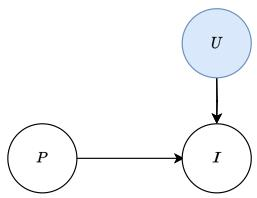  
(a) Abduction

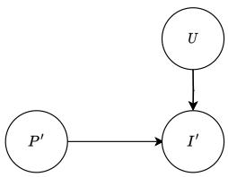  
(b) Action & Prediction  
Figure 2. Counterfactual inference framework for TBIE.

TBIE is a challenging task as it is inherently zero-shot: a source image I and a prompt (P, P′) are the only input and there is no ground-truth image for the target image I′. Fortunately, thanks to the large-scale text-to-image generative models, e.g., DALL-E [24], Imagen [27], and Stable Diffusion [25], language embeddings and visual features are well-aligned. So, they provide a channel to modify images via natural language. However, the editing efficacy of existing methods is still far from satisfactory, for example, they can only support limited edits like style transfer [15], add/remove objects [1]; do not support user-uploaded images [9], or require extra supervision [26] and spatial masks to localize where to edit [1].

Yet, there is no theory that explains why TBIE is chal-

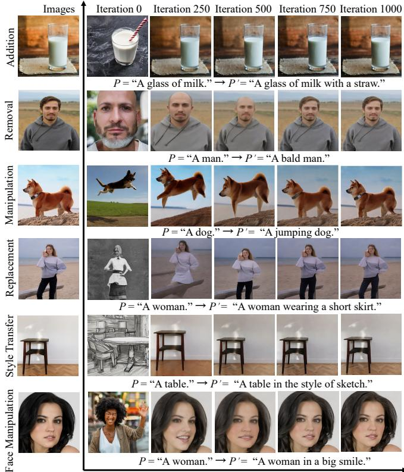  
Figure 3. The editability of counterfactual $I ^ { \prime } = G ( P ^ { \prime } , U )$ decreases when the abductive iteration of arg minU $\| G ( P , U ) - I \|$ increases.

Iterations

lenging, or why existing methods sometimes succeed or fail. Such an absence will undoubtedly hinder progress in this field. To this end, as illustrated in Figure 2, we formulate TBIE as a counterfactual inference problem [22] based on text-conditional diffusion models, $e . g .$ , we use Stable Diffusion [25] in this paper.

Why Counterfactual? Counterfactual inference can define the “minimal visual change” requirement formally. $\mathbf { A } \mathbf { s }$ prompt $P$ describes the existing contents in source image $I ,$ the generative model G should be able to generate I based on $P .$ However, $G$ is usually probabilistic, $i . e .$ , only $P$ is not enough to control $G$ to generate an image exactly the same as $I ,$ thus we need an unknown exogenous variable $U$ to remove the uncertainty:

$$
\operatorname { F a c t } : I = G ( P , U ) .\tag{1}
$$

Therefore, the “minimal visual change” in TBIE can be formulated as the following counterfactual:

$$
\mathrm { C o u n t e r f a c t u a l : } I ^ { \prime } = G ( P ^ { \prime } , U ) ,\tag{2}
$$

where $U$ is abducted from Eq. (1) by arg minU $\| G ( P , U ) -$ $I \|$ to ensure that the edited image $I ^ { \prime }$ preserves most of the visual content of I while incorporating the influence of $P ^ { \prime }$ Why Challenging? The abduction of U is inevitably illposed, $i . e . , U$ overfits to the particular P and I. As a result,

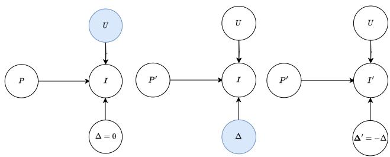  
Figure 4. The proposed Doubly Abductive Counterfactual inference framework (DAC).

$G ( \cdot , U )$ may ruin the pre-trained prior distribution and fail to comprehend $P ^ { \prime }$ . As shown in Figure $^ { 3 , }$ as the number of iterations of arg minU $\| G ( P , U ) - I \|$ increases, $G ( P ^ { \prime } , U )$ generates $I ^ { \prime }$ more similar to $I ,$ but at the same time, the editability of $G ( P ^ { \prime } , U )$ is decreasing. However, it is elusive to find a good U that balances the trade-off between editability and fidelity. Thanks to the counterfactual framework, we conjecture that the success or failure of existing TBIE methods is primarily attributed to the trade-off (Section 2). Our Solution. To this end, we propose Doubly Abductive Counterfactual inference framework (DAC). As illustrated in Figure 4, following the three steps of counterfactual inference [22]: abduction, action, and prediction, we have:

$$
A b d u c t i o n - I \colon U = \arg \operatorname* { m i n } _ { U } \| G ( P , U , \Delta = 0 ) - I \| .
$$

$A b d u c t i o n - 2 \colon \Delta = \arg \operatorname* { m i n } _ { \Delta } \| G ( P ^ { \prime } , U , \Delta ) - I \|$ , where $\Delta$ transforms $P ^ { \prime }$ back to $P$

• Action: set $\Delta ^ { \prime } = - \Delta$

• Prediction: $I ^ { \prime } = G ( P ^ { \prime } , U , \Delta ^ { \prime } )$

Our key insight stems from the newly introduced exogenous variable $\Delta ,$ which is the semantic change editing an imaginative $I ^ { \prime }$ back to I. Although the overfitting of Abduction-2 also disables the natural language editability of $G ,$ it still enables the $\Delta$ editability. So, by reversing the change from $\Delta$ to $\Delta ^ { \prime } = - \Delta$ , we can use $\Delta ^ { \prime }$ to edit I back to $I ^ { \prime } .$ . We detail the implementations of $U$ and $\Delta$ in Section 3 and ablate them in Section 4.3. As shown in Figure 5, compared to existing methods, our DAC achieves a good tradeoff between editability and fidelity, and thus we can support a wide spectrum of user editing intents including 1) addition, 2) removal, 3) manipulation, 4) replacement, 5) style transfer, and 6) face manipulation, which are extensively validated in both qualitative and quantitative evaluations in Section 4. We summarize our contributions here:

• We formulate text-based image editing (TBIE) into a counterfactual inference framework, which not only defines TBIE formally but also identifies its challenge: editability and fidelity trade-off.

• We propose the Doubly Abductive Counterfactual (DAC) to address the challenge.

• With extensive ablations and comparisons to previous methods, we demonstrate that DAC shows a considerable improvement in versatility and image quality.

Addition  
Manipulation  
Removal  
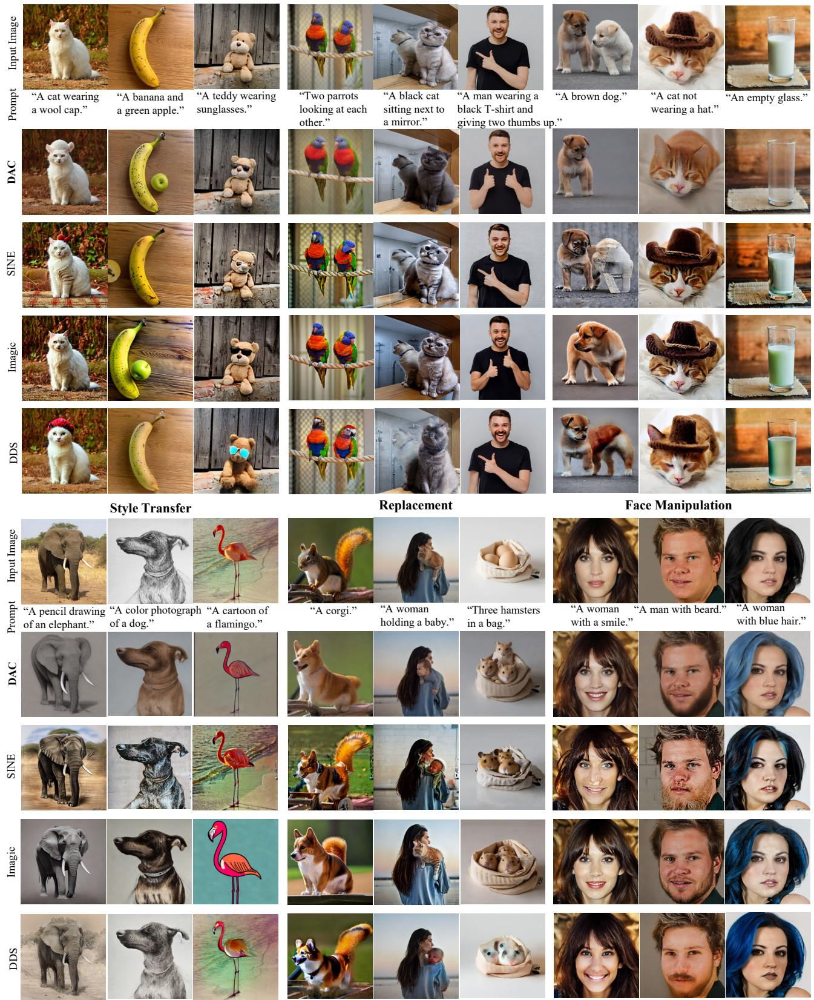  
Figure 5. Comparison of TBIE qualitative examples across the 6 editing types (only prompt P′ shown) between our DAC and three SOTA with a similar design philosophy (Table 1). For fairness, examples are chosen based on their best visual quality from various random seeds. See Section 4.1 for analysis and Appendix for the example selection details.

Table 1. Comparisons with existing methods.
<table><tr><td>Methods</td><td>U ∆</td><td>Method Description</td><td>Failure Analysis</td></tr><tr><td>P2P [9] TIME [20]</td><td>x x</td><td rowspan="5">∆ can be realized by adjusting</td><td rowspan="5">Inversion methods are not accurate for reconstruction w/o U</td></tr><tr><td>PnP [34]</td><td></td></tr><tr><td>MasaCtrl [4]</td><td>X x</td></tr><tr><td>EDICT [36]</td><td></td></tr><tr><td>AIDI [21]</td><td>V</td></tr><tr><td>CycleDiffusion [38]</td><td>x x</td><td></td><td rowspan="4">Editability is not enough</td></tr><tr><td>NTI [18]</td><td></td><td>Modeling U with textual inversion, i.e., fitting I</td></tr><tr><td>PTI [5]</td><td>V √</td><td>with learnable text embeddings</td></tr><tr><td>SINE[43]</td><td></td><td>Modeling U by textual inversion and fine-tuning SD</td></tr><tr><td>DDS [10]</td><td>√</td><td>U and ∆ are learned together with the distillation loss</td><td rowspan="2">U and ∆ are entangled, hard to find out the best trade-off between the editability and fidelity</td></tr><tr><td>Imagic [14]</td><td></td><td>U and ∆ are learned by fine-tuning SD and textual inversion separately</td></tr><tr><td>DAC</td><td>了</td><td>Section 3</td><td>Appendix</td></tr></table>

Notes. In this paper, our purpose is to advocate that TBIE (or probably any visual editing) should be a counterfactual reasoning task, where the abduction is a necessary and crucial step. Unfortunately, we haven’t found a non-finetuning-based abductive learning method, and hence we conjecture that the absence of abduction is the key reason for the existing non-fine-tuning-based visual editing methods being fast yet not effective (e.g., Emu2 [31] and InfEdit [40]). Perhaps, only LLM can achieve both editing efficiency and effectiveness because LLM may perform counterfactual [33], but this requires unified vision-language tokens, which is in itself a challenging open problem.

## 2. Related Work

Text-to-Image Generation. The success of Imagen [27] and DALL·E [24] with diffusion models [11] opens a new era of open-domain text-to-image generation, being capable of generating diverse and high-quality images conditional on arbitrarily complex text descriptions. Thanks to the stable diffusion model [25], the text-to-image diffusion process could be conducted in a latent space of reduced dimensionality, bringing a significant speedup for training and inference. It is by far the most popular text-to-image model for open research, and thus we use a pre-trained one [25] as our generative model G, although the proposed DAC framework is compatible with other generative models.

Text-based Image Editing. We summarize existing TBIE works in Table 1 from the perspective of counterfactual inference. They can be categorized into three groups based on whether $U$ and $\Delta$ are considered for both editability and fidelity. Note that we exclude other image editing methods like DreamBooth [26], Cones2 [17], and Textual inversion [6] that require multiple images for training, which are different from the TBIE settings covered in this paper.

Group 1: They directly operate the semantic change on the intermediate UNet attention maps during the generation process. The fidelity of the input image is achieved by DDIM inversion [4, 34] or other advanced inversion methods [21, 36, 38], without explicitly modeling U. Group 2: PTI [5], NTI [18], and SINE [43] calculate U by textual inversion or fine-tuning the stable diffusion model on the source image. Nevertheless, without $\Delta ,$ , they cannot realize accurate editing, thus techniques like interpolation [5] are needed.

Group 3: Imagic [14] and DDS [10] learn U and $\Delta$ together. However, the entanglement between U and $\Delta$ makes it hard to find out the best trade-off between fidelity and editability. Visual Counterfactuals. Counterfactual inference is the answer to a hindsight question like “When $Y ~ = ~ y$ and $X = x ,$ , what would have happened to Y had X been $x ^ { \prime } ? ^ { \prime \prime }$ The general solution [22] to the counterfactual inference is to abduct the exogenous variables with the known fact $( Y = y , X = x )$ and then reset our choice $( X = x ^ { \prime } )$ and obtain the new prediction $( Y ~ = ~ ? )$ . Counterfactual inference has a wide application in computer vision such as visual explanations [8], data augmentations [13], robustness [2, 28, 32], fairness [16, 41], and VQA [19].

## 3. Method

Recall in Section 1 that our proposed Doubly Abductive Counterfactual inference framework (DAC) is to address the non-editability issue caused by the overfitted abduction of U that was originally introduced for the purpose of keeping minimal visual change. This issue is elegantly resolved by introducing another abduction of a semantic change variable $\Delta .$ In this section, we will detail the implementation of every step in DAC as illustrated in Figure 4.

## 3.1. Abduction-1

We introduce the implementation of the abduction loss $\| G ( P , U , \Delta = 0 ) - I \|$ . This step is identical to the conventional abduction of U in Figure 2, as we set $\Delta = 0$ in Figure 4 (a). In particular, we use Stable Diffusion [25] to implement G due to it being open-source and for a fair comparison with other methods. As $\| G ( P , U , \Delta = 0 ) - I \|$ is essentially a reconstruction loss, we abduct U by solving the following Gaussian noise regression as in training the reversed diffusion steps:

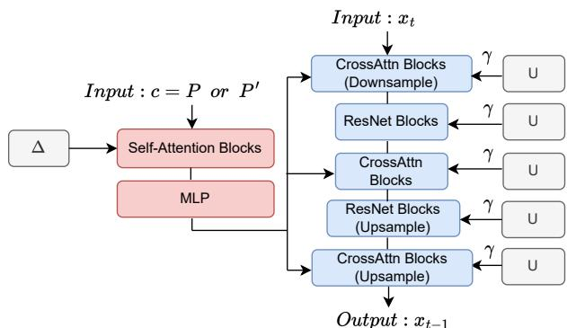  
Figure 6. Parameterizations of U and ∆ by using LoRA (grey) for UNet (blue) and text encoder (red) in pre-trained Stable Diffusion [25]: $\Theta _ { ( U , \Delta ) } \left( x _ { t } , t , c \right)$ . Except for LoRA, all the other parameters are frozen.

$$
\arg \operatorname* { m i n } _ { U } \mathbb { E } _ { ( t , \epsilon ) } | | \epsilon - \Theta _ { ( U , \Delta = 0 ) } ( x _ { t } , t , P ) | | _ { 2 } ^ { 2 } ,\tag{3}
$$

where $\epsilon \in \mathcal { N } ( \mathbf { 0 } , \mathbf { I } ) , t \in [ 0 , T ]$ is a sampled time step $( T$ is the maximum), $\Theta _ { ( U , \Delta = 0 ) }$ is the pre-trained noise prediction UNet with trainable U and all other parameters frozen, conditionally on language tokens of P encoded by a frozen CLIP [23] text encoder2, $x _ { t } = \sqrt { \alpha _ { t } } x _ { 0 } + \sqrt { 1 - \alpha _ { t } } \epsilon$ is the noisy input at $t ,$ in particular, $x _ { 0 } = I $ , and $\alpha _ { t }$ is related to a fixed variance schedule [11, 29].

We parameterize U as the UNet LoRA [12] in $\Theta _ { ( U , \Delta ) }$ As shown in Figure 6, the LoRA structure is built on all of the attention, convolution, and feed-forward (FFN) layers. This is because we observe the underfitting issue if we only apply LoRA on the attention layers, i.e., I cannot be wellreconstructed using P and U (See ablation in Appendix).

Without loss of generality, we detail the implementation of a linear layer with a LoRA structure. Denote $z \in \mathbb { R } ^ { d }$ as the intermediate feature, $W \in \mathbb { R } ^ { d \times d }$ as the parameter of the linear layer, then the output $z ^ { \prime }$ after LoRA becomes:

$$
z ^ { \prime } = ( W + U _ { A } \cdot U _ { B } ) \cdot z ,\tag{4}
$$

where $U _ { A } \in \mathbb { R } ^ { d \times r }$ and $U _ { B } \in \mathbb { R } ^ { r \times d }$ are low rank matrices with $r < d ,$

## 3.2. Abduction-2

We introduce the implementation of the second abduction loss $\| G ( P ^ { \prime } , U , \Delta ) - I \|$ with the above abducted U (Figure 4 (b)). Similar to Eq. (3), we minimize:

$$
\arg \operatorname* { m i n } _ { \Delta } \mathbb { E } _ { ( t , \epsilon ) } | | \epsilon - \Theta _ { ( U , \Delta ) } ( x _ { t } , t , P ^ { \prime } ) | | ^ { 2 } ,\tag{5}
$$

where we parameterize $\Delta$ as the CLIP text encoder LoRA, and U calculated in Abduction-1 is frozen.

As shown in Figure 6, the LoRA structure is only built on the attention layers of the CLIP text encoder. The selfattention layer language feature $y ^ { \prime }$ in the CLIP text encoder is re-encoded from the original y through the LoRA:

$$
y ^ { \prime } = ( W + \Delta _ { A } \cdot \Delta _ { B } ) \cdot y ,\tag{6}
$$

where $\Delta _ { A } \in \mathbb { R } ^ { d \times r }$ and $\Delta _ { B } \in \mathbb { R } ^ { r \times d }$ are low rank matrixes, $r < < d .$ . By solving Eq. $( 5 ) , \Delta$ encodes the visual transition controlled by $P ^ { \prime }$ to $P$ . We highlight that $\Delta$ cannot be parameterized by textual inversion [18], as it does not support semantic inversion as introduced later in Section 3.3.

If U is overfitted in Abduction-1, e.g., U memorizes everything about I, the Abduction-2 for $\Delta$ might be as trivial as $\Delta \ : = \ : 0$ . Inspired by the findings in diffusion models where a larger time step corresponds to better editability while lower fidelity [37], we design an annealing strategy on U in solving Eq. (5) at different time steps:

$$
\begin{array} { r c l } { { z ^ { \prime } } } & { { = } } & { { ( W + \gamma U _ { A } \cdot U _ { B } ) \cdot z , } } \end{array}\tag{7}
$$

$$
\gamma = \frac { 1 - \eta } { T ^ { 2 } } ( t - T ) ^ { 2 } + \eta ,\tag{8}
$$

where $\eta \in \mathbb { R }$ is a small constant value. In general, $\eta$ is a hyper-parameter dependent on both I and $( P , P ^ { \prime } )$ ; fortunately, it is easy to choose a good one as shown in Figure 11.

## 3.3. Action & Prediction

We introduce the implementation of action & prediction $I ^ { \prime } = G ( P ^ { \prime } , U , \Delta ^ { \prime } )$ in Figure 4 (c). First, we take the action $\Delta ^ { \prime } = - \Delta$ to revert the visual transition from P back to $P ^ { \prime }$ to generate $I ^ { \prime } .$ Thus, the text LoRA in Eq. (6) becomes:

$$
y ^ { \prime } = ( W - \Delta _ { A } \cdot \Delta _ { B } ) \cdot y .\tag{9}
$$

Then, with a sampled $x _ { T } ~ \in ~ \mathcal { N } ( 0 , \mathbf { I } )$ , the DDIM sampling [29] is used to generate the edited image $I ^ { \prime }$ with the following iterative update from $t = T$ to t = 0:

$$
\begin{array} { r l } { x _ { t - 1 } } & { = \sqrt { \alpha _ { t - 1 } } \left( \frac { x _ { t } - \sqrt { 1 - \alpha _ { t } } \Theta _ { ( U , \Delta ^ { \prime } ) } \left( x _ { t } , t , P ^ { \prime } \right) } { \sqrt { \alpha _ { t } } } \right) + } \\ & { \qquad \sqrt { 1 - \alpha _ { t - 1 } } \Theta _ { ( U , \Delta ^ { \prime } ) } ( x _ { t } , t , P ^ { \prime } ) , \qquad ( } \end{array}\tag{10}
$$

where we obtain $I ^ { \prime } = x _ { 0 }$ . Interestingly, as shown in Figure 10, we use a weight $\beta \in [ - 1 , 1 ]$ to tune $\beta \Delta _ { A } \cdot \Delta _ { B }$ in Eq. (9) to manifest the inversion ability of $\Delta$ , where $\beta = - 1$ means reconstruction of the source image as in Eq. (6) and $\beta > - 1$ means that we start to shift the semantic change from the source image.

## 4. Experiment

We followed prior works [4, 5, 10, 14, 21, 34, 36, 38] to use Stable Diffusion as our generator [25]. For fair comparisons, we integrated SD checkpoint V2.1-Base with the official source codes of the comparing methods: SINE [43], DDS [10], and Imagic [14] in the Diffusers codebase [35] and we used the same default hyper-parameters of the SDV2.1-Base. In particular, during the optimization of U and ∆ in Abduction-1 and Abduction-2, we set the rank of the LoRA to 4 for ∆ and 512 for U, the learning rate to 1e-4. Optimization iterations were 1,000 in both Abduction-1 and Abduction-2. $\eta \in [ 0 . 4 , 0 . 8 ]$ is applied to the annealing strategy. For the action and prediction steps, we adopted 30 steps for DDIM sampling at the inference time of the stable diffusion. We used an NVIDIA A100 GPU for editing.

Computation Analysis. In general, it took 120, 0.33, 12, and 15 minutes to edit a single image by using SINE, DDS, Imagic, and our DAC. Our method consumes 15 minutes, including 6 and 9 minutes for the first and second abduction, and 4-second 30-step DDIM sampling. The timesaving characteristic of DDS lies in minimal trainable parameters (latent format of an image in DDS compared with UNet LoRA or CLIP text encoder LoRA in DAC’s abduction) and minimal optimization iterations (200 iterations in DDS compared with 1,000 iterations in DAC).

## 4.1. Qualitative Evaluation

We demonstrate the advantages of the proposed DAC method with two kinds of qualitative evaluations: 1) evaluation of our method with multiple prompts on the same source image (results are in Appendix), and 2) evaluation of our method on the 6-type editing operations. For each editing, we randomly generated 8 edited images given a source image and an editing prompt, and chose the one with the best quality as our final edited image. Note that such a process is also adopted for other comparison methods. Following previous works [14, 43], we collected most images from a wide range of domains, i.e., free-to-use high-resolution images from Unsplash (https://unsplash.com/).

Wide Spectrum of Editing. We demonstrate that our DAC supports a wide spectrum of editing operations including 1) addition, 2) removal 3) manipulation, 4) replacement, 5) style transfer, and 6) face manipulation. Our results are summarized in Figure 5 and more results are in Appendix. For one of the 6 editing types, we provide three imageprompt examples. Take an example for manipulation, we make two parrots look at each other, change the white cat with its mirror to a black one, and let a man give two thumbs up. After the editing, the images not only resemble the source image to a high degree but also are coherent with the text prompt, demonstrating that the DAC method achieves a great trade-off between fidelity and editability.

Comparisons with Competitive Methods. We compare DAC with leading works on the TBIE task including Imagic [14], SINE [43], and DDS [10]. And they all belong to single-image fine-tuning methods for a fair comparison. To have a more comprehensive understanding of

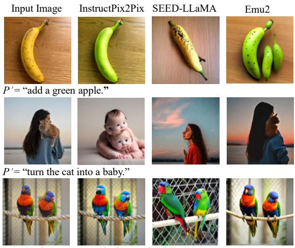  
P ’= “make two parrots look at each other.”

Figure 7. Qualitative examples of large-scale training methods.

the superiority of the DAC method, we compare it with the three methods in the 6 kinds of editing operations in Figure 5. Compared with previous methods, the DAC method enjoys the following merits. First, the generated images by the DAC method are more consistent with the textual prompts. With prompts such as “remove the milk in the glass”, and “let two parrots look at each other”, our method successfully makes it while it is hard for previous methods. Second, the DAC method can keep better fidelity to the source image. With prompts like “replace the squirrel with a corgi” and “remove the white dog”, the edited images by the DAC resemble the input images to a much higher degree than previous methods. All of these samples in Figure 5 indicate that the DAC method does a better trade-off between fidelity and editability, achieving state-of-the-art performance on the TBIE task.

In addition to single-image fine-tuning methods, there are works that conduct large-scale training and don’t require any test-time fine-tuning, e.g., InstructPix2Pix [3], SEED-LLaMA [7], and Emu2 [31]. We have shown that the “finetuning” is the essential “abduction” for fidelity. However, these methods only have inference-time editing—only “action” and “prediction”, thus they cannot guarantee fidelity in theory (Figure 7 and more results are in Appendix).

## 4.2. Quantitative Evaluation

CLIP-score [23] and LPIPS [42]. The experimental settings were set as follows.

• Different editing operations need different trade-offs between fidelity and editability. For example, style transfer requires lower image alignment compared to object manipulation. Thus, the evaluations of six kinds of editing are conducted individually.

• We applied 9 different prompt-image pairs for each kind of editing.

• We calculated LPIPS for the image alignment and CLIP-

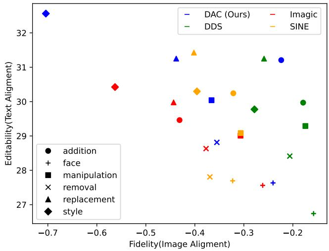  
Figure 8. Image Alignment: minus LPIPS. Text Alignment: CLIPscore. Both values are the larger the better.

score for text alignment.

We summarize the results in Figure 8. The proposed DAC method shows better performance in text alignment scores for editing like object removal, object manipulation, object addition, and face manipulation. We achieved similar results with the DDS [10] in object replacement. For the style transfer, DAC achieves the best text alignment scores. The LPIPS score measures the image alignment degree between the source image and the edited image. However, we argue that LPIPS fails to reflect the fidelity. For example in Figure 5, “remove the hat of the cat”. Our DAC successfully removes the hat and achieves a better CLIP-score. DDS and SINE methods cannot remove the hat and thus have a lower CLIP-score. But DDS and SINE achieve a much higher LPIPS score because they make no changes at all to the source image. Therefore, we have to conduct a user study for a more accurate assessment.

User Study. We quantitatively evaluate our DAC with an extensive human perceptual evaluation study. First, we collected a diverse set of image-prompt pairs, covering all the “addition”, “manipulation”, “removal”, “style transfer”, “replacement”, and “face manipulation” types. It consists of 54 input images and their corresponding target prompts.

110 AMT participants were given a source image, a target prompt, and 4 edited images by DAC, DDS, SINE, and Imagic, which were randomly shown. The participants are required to choose the best-edited image. In total, we recalled 5,940 answers. The result is summarized in Figure 9 and it shows that 75.3% evaluators preferred our DAC. The user interface is detailed in Appendix.

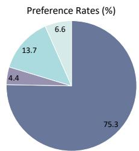  
DAC DDS Imagic SINE Figure 9. User study statistics.

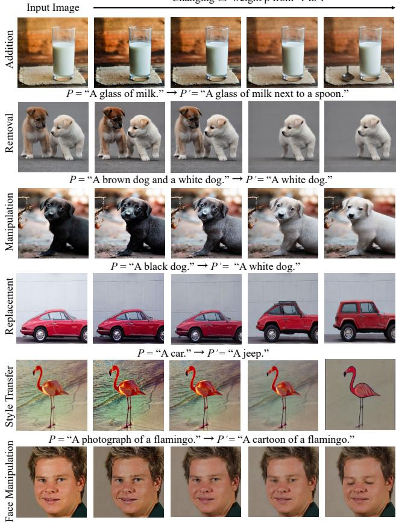  
P = “A man.” → P ’= “A man closing eyes.”  
Figure 10. Ablating the weight β for $\beta \Delta _ { A } \cdot \Delta _ { B }$ in Eq. (9).

## 4.3. Ablation Analysis

Training Iterations and Editability. We examined the relationship between training iterations of arg minU $\| G ( P , U ) - I \|$ and editability by applying six editing types. As shown in Figure 3, with the dog image and the prompt “A dog. → A jumping dog”, we can get a jumping dog in the edited image using 250 and 500 training iterations. However, the images are with low fidelity. Training U in 1000 iterations, the generative model fails to make the dog jump and the edited image looks the same as the source one, implying good fidelity but poor editability. This study indicates that with the increase of training iterations arg minU $\| G ( P , U ) - I \|$ , the editability decreases while the fidelity increases, which means a good U is needed for the best trade-off between fidelity and editability.

Ablation on $\Delta$ Subtraction. In the action & prediction $I ^ { \prime } = G ( P ^ { \prime } , U , \Delta ^ { \prime } )$ , the $\Delta$ is reversed to $\Delta ^ { \prime } = - \Delta$ . We use $\Delta ^ { \prime }$ to edit I back to $I ^ { \prime } .$ . Nevertheless, considering $\Delta ^ { \prime } = - \beta \Delta$ , there could be different $\beta$ values. We examined the effects of $\beta$ values on $I ^ { \prime } .$ . In Figure 10, with the black dog image and the prompt “A black dog → A white $\deg ^ { \prime }$ , increasing $\beta$ from -1 to 1, the black dog changes to a gray one and then a white one. From the examples in Figure 10, the learned $\Delta$ can be considered as the direction vector of our desired semantic change. Different $\beta$ values im-

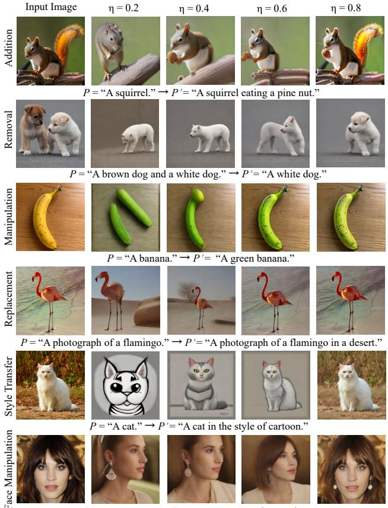  
Figure 11. Ablating the annealing hyper-parameter η in Eq. (8). ply different strengths to apply the semantic change. However, for rigid manipulations like Addition and Removal, β does not show a gradual transition, which is reasonable as it is hard to quantify the existence level of an object.

Ablation on Annealing Strategy. We ablated the annealing strategy in the Abduction-2. As shown in Figure 11, we observe that $\eta \in [ 0 . 4 , 0 . 8 ]$ is a reasonable interval for successful editing. A larger time step in the stable diffusion model corresponds to better editability while lower fidelity. The smaller η indicates that we leverage more priors of the pre-trained weights at large time steps, thus increasing the editability while decreasing the fidelity. This is consistent with the phenomenon in Figure 11: as η increases from 0.2 to 0.8, the edited images show better fidelity to the source images although the editability decreases. With $\eta \in [ 0 . 4 , 0 . 8 ]$ , we achieve a good trade-off.

Ablation on Abduction-1. In the Abduction-1, we abduct U to encode the content of I, thus guaranteeing a good fidelity. However, since images contain various contents, the U abducted from the same settings (e.g., training iterations) may not be able to achieve an overfit encoding for complex images. Then the remaining information will be abducted in $\Delta$ . When we take the action $\Delta ^ { \prime } = - \Delta$ and implement prediction, such information will be subtracted, leading to information loss in I′ (the third column in Figure 12). To make a complement for such information, we could introduce another exogenous variable T parameterized as the CLIP text encoder LoRA, which satisfies arg minT $\| G ( P , U , T , \Delta = 0 ) - I \|$ . Finally, the prediction becomes $I ^ { \prime } = G ( P ^ { \prime } , U , T , \Delta ^ { \prime } )$ (the second column in Figure 12). It could be seen that the incorporation of T in the Abduction-1 achieves a better fidelity than the abduction of U only. Moreover, conducting iterative abduction on U and T more times could further improve fidelity. Considering that the abduction of U is enough for most cases and the computation cost produced by the abduction of T, we only adopt U in our experiments.

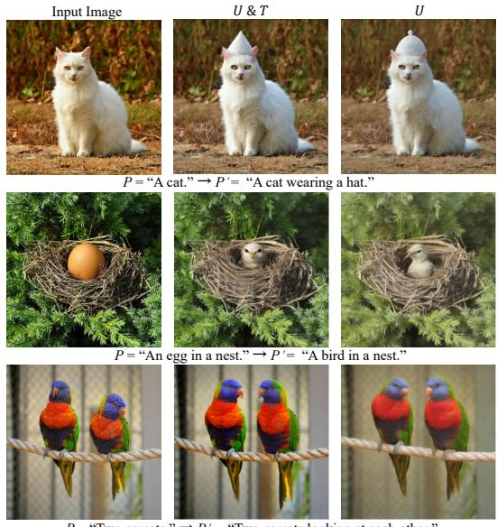  
Figure 12. Ablation on Abduction-1.

## 5. Conclusions

We proposed to formulate the task of TBIE using a theoretical framework: counterfactual inference, which clearly explains why the challenge is the trade-off between editability and fidelity: the overfitted abduction of the source image parameterization, which is a single-image reconstruction fine-tuning. To this end, we propose Doubly Abductive Counterfactual (DAC). The key idea is that, since we cannot avoid the overfitting of the above abduction, we use another overfitted abduction, which encodes the semantic change of the editing, to reverse the lost editability caused by the first one. We conducted extensive qualitative and quantitative evaluations on DAC and other competitive methods. Our future work is two-fold. First, we will upgrade DAC to support visual example-based editing [17, 26]. Second, we will use Fast Diffusion Model [39] and Consistency Models [30] to speed up the fine-tuning and inference in editing.

Acknowledgements. This work was supported by NSFC project (No. 62232006), in part by Shanghai Science and Technology Program (No. 21JC1400600), and by National Research Foundation, Singapore under its AI Singapore Programme (AISG Award No: AISG2-RP-2021-022).

## References

[1] Omri Avrahami, Dani Lischinski, and Ohad Fried. Blended diffusion for text-driven editing of natural images. In CVPR, pages 18208–18218, 2022. 1

[2] Ananth Balashankar, Xuezhi Wang, Ben Packer, Nithum Thain, Ed Chi, and Alex Beutel. Can we improve model robustness through secondary attribute counterfactuals? In Proceedings of the 2021 Conference on Empirical Methods in Natural Language Processing, pages 4701–4712, 2021. 4

[3] Tim Brooks, Aleksander Holynski, and Alexei A Efros. Instructpix2pix: Learning to follow image editing instructions. In Proceedings of the IEEE/CVF Conference on Computer Vision and Pattern Recognition, pages 18392–18402, 2023. 6, 11

[4] Mingdeng Cao, Xintao Wang, Zhongang Qi, Ying Shan, Xiaohu Qie, and Yinqiang Zheng. Masactrl: Tuning-free mutual self-attention control for consistent image synthesis and editing. In Proceedings of the IEEE/CVF International Conference on Computer Vision (ICCV), pages 22560–22570, 2023. 4, 5

[5] Wenkai Dong, Song Xue, Xiaoyue Duan, and Shumin Han. Prompt tuning inversion for text-driven image editing using diffusion models. In Proceedings of the IEEE/CVF International Conference on Computer Vision, 2023. 4, 5

[6] Rinon Gal, Yuval Alaluf, Yuval Atzmon, Or Patashnik, Amit H Bermano, Gal Chechik, and Daniel Cohen-Or. An image is worth one word: Personalizing text-toimage generation using textual inversion. arXiv preprint arXiv:2208.01618, 2022. 4

[7] Yuying Ge, Sijie Zhao, Ziyun Zeng, Yixiao Ge, Chen Li, Xintao Wang, and Ying Shan. Making llama see and draw with seed tokenizer. arXiv preprint arXiv:2310.01218, 2023. 6

[8] Yash Goyal, Ziyan Wu, Jan Ernst, Dhruv Batra, Devi Parikh, and Stefan Lee. Counterfactual visual explanations. In ICML, pages 2376–2384, 2019. 4

[9] Amir Hertz, Ron Mokady, Jay Tenenbaum, Kfir Aberman, Yael Pritch, and Daniel Cohen-Or. Prompt-to-prompt image editing with cross attention control. arXiv preprint arXiv:2208.01626, 2022. 1, 4

[10] Amir Hertz, Kfir Aberman, and Daniel Cohen-Or. Delta denoising score. In Proceedings ofthe IEEE/CVF International Conference on Computer Vision, pages 2328–2337, 2023. 4, 5, 6, 7, 11, 14

[11] Jonathan Ho, Ajay Jain, and Pieter Abbeel. Denoising diffusion probabilistic models. NeurIPS, 33:6840–6851, 2020. 4, 5

[12] Edward J Hu, Yelong Shen, Phillip Wallis, Zeyuan Allen-Zhu, Yuanzhi Li, Shean Wang, Lu Wang, and Weizhu Chen. Lora: Low-rank adaptation of large language models. arXiv preprint arXiv:2106.09685, 2021. 5

[13] Divyansh Kaushik, Eduard Hovy, and Zachary C Lipton. Learning the difference that makes a difference with counterfactually-augmented data. arXiv preprint arXiv:1909.12434, 2019. 4

[14] Bahjat Kawar, Shiran Zada, Oran Lang, Omer Tov, Huiwen Chang, Tali Dekel, Inbar Mosseri, and Michal Irani. Imagic:

Text-based real image editing with diffusion models. In Proceedings of the IEEE/CVF Conference on Computer Vision and Pattern Recognition, pages 6007–6017, 2023. 4, 5, 6, 11

[15] Gwanghyun Kim, Taesung Kwon, and Jong Chul Ye. Diffusionclip: Text-guided diffusion models for robust image manipulation. In CVPR, pages 2426–2435, 2022. 1

[16] Matt J Kusner, Joshua Loftus, Chris Russell, and Ricardo Silva. Counterfactual fairness. Advances in neural information processing systems, 30, 2017. 4

[17] Zhiheng Liu, Yifei Zhang, Yujun Shen, Kecheng Zheng, Kai Zhu, Ruili Feng, Yu Liu, Deli Zhao, Jingren Zhou, and Yang Cao. Cones 2: Customizable image synthesis with multiple subjects. arXiv preprint arXiv:2305.19327, 2023. 4, 8

[18] Ron Mokady, Amir Hertz, Kfir Aberman, Yael Pritch, and Daniel Cohen-Or. Null-text inversion for editing real images using guided diffusion models. In Proceedings of the IEEE/CVF Conference on Computer Vision and Pattern Recognition, pages 6038–6047, 2023. 4, 5

[19] Yulei Niu, Kaihua Tang, Hanwang Zhang, Zhiwu Lu, Xian-Sheng Hua, and Ji-Rong Wen. Counterfactual vqa: A causeeffect look at language bias. In CVPR, pages 12700–12710, 2021. 4

[20] Hadas Orgad, Bahjat Kawar, and Yonatan Belinkov. Editing implicit assumptions in text-to-image diffusion models. In Proceedings of the IEEE/CVF International Conference on Computer Vision, 2023. 4

[21] Zhihong Pan, Riccardo Gherardi, Xiufeng Xie, and Stephen Huang. Effective real image editing with accelerated iterative diffusion inversion. In Proceedings of the IEEE/CVF International Conference on Computer Vision, pages 15912– 15921, 2023. 4, 5

[22] Judea Pearl, Madelyn Glymour, and Nicholas P Jewell. Causal inference in statistics: A primer. John Wiley & Sons, 2016. 2, 4

[23] Alec Radford, Jong Wook Kim, Chris Hallacy, Aditya Ramesh, Gabriel Goh, Sandhini Agarwal, Girish Sastry, Amanda Askell, Pamela Mishkin, Jack Clark, et al. Learning transferable visual models from natural language supervision. In ICML, pages 8748–8763, 2021. 5, 6

[24] Aditya Ramesh, Prafulla Dhariwal, Alex Nichol, Casey Chu, and Mark Chen. Hierarchical text-conditional image generation with clip latents. arXiv preprint arXiv:2204.06125, 2022. 1, 4

[25] Robin Rombach, Andreas Blattmann, Dominik Lorenz, Patrick Esser, and Bjorn Ommer. High-resolution image syn-¨ thesis with latent diffusion models. In CVPR, pages 10684– 10695, 2022. 1, 2, 4, 5

[26] Nataniel Ruiz, Yuanzhen Li, Varun Jampani, Yael Pritch, Michael Rubinstein, and Kfir Aberman. Dreambooth: Fine tuning text-to-image diffusion models for subject-driven generation. In CVPR, pages 22500–22510, 2023. 1, 4, 8

[27] Chitwan Saharia, William Chan, Saurabh Saxena, Lala Li, Jay Whang, Emily L Denton, Kamyar Ghasemipour, Raphael Gontijo Lopes, Burcu Karagol Ayan, Tim Salimans, et al. Photorealistic text-to-image diffusion models with deep language understanding. In NeurIPS, pages 36479–36494, 2022. 1, 4

[28] Herbert A Simon. Spurious correlation: A causal interpretation. Journal of the American statistical Association, pages 467–479, 1954. 4

[29] Jiaming Song, Chenlin Meng, and Stefano Ermon. Denoising diffusion implicit models. arXiv preprint arXiv:2010.02502, 2020. 5

[30] Yang Song, Prafulla Dhariwal, Mark Chen, and Ilya Sutskever. Consistency models. 2023. 8

[31] Quan Sun, Yufeng Cui, Xiaosong Zhang, Fan Zhang, Qiying Yu, Zhengxiong Luo, Yueze Wang, Yongming Rao, Jingjing Liu, Tiejun Huang, et al. Generative multimodal models are in-context learners. arXiv preprint arXiv:2312.13286, 2023. 4, 6

[32] Kaihua Tang, Jianqiang Huang, and Hanwang Zhang. Longtailed classification by keeping the good and removing the bad momentum causal effect. NeurIPS, 33:1513–1524, 2020. 4

[33] Zenna Tavares, James Koppel, Xin Zhang, Ria Das, and Armando Solar-Lezama. A language for counterfactual generative models. In International Conference on Machine Learning, pages 10173–10182. PMLR, 2021. 4

[34] Narek Tumanyan, Michal Geyer, Shai Bagon, and Tali Dekel. Plug-and-play diffusion features for text-driven image-to-image translation. In Proceedings ofthe IEEE/CVF Conference on Computer Vision and Pattern Recognition, pages 1921–1930, 2023. 4, 5

[35] Patrick von Platen, Suraj Patil, Anton Lozhkov, Pedro Cuenca, Nathan Lambert, Kashif Rasul, Mishig Davaadorj, and Thomas Wolf. Diffusers: State-of-the-art diffusion models. https://github.com/huggingface/ diffusers, 2022. 6

[36] Bram Wallace, Akash Gokul, and Nikhil Naik. Edict: Exact diffusion inversion via coupled transformations. In Proceedings of the IEEE/CVF Conference on Computer Vision and Pattern Recognition, pages 22532–22541, 2023. 4, 5

[37] Luozhou Wang, Shuai Yang, Shu Liu, and Ying-cong Chen. Not all steps are created equal: Selective diffusion distillation for image manipulation. In ICCV, pages 7472–7481, 2023. 5

[38] Chen Henry Wu and Fernando De la Torre. A latent space of stochastic diffusion models for zero-shot image editing and guidance. In Proceedings ofthe IEEE/CVF International Conference on Computer Vision, pages 7378–7387, 2023. 4, 5

[39] Zike Wu, Pan Zhou, Kenji Kawaguchi, and Hanwang Zhang. Fast diffusion model. arXiv preprint arXiv:2306.06991, 2023. 8, 15

[40] Sihan Xu, Yidong Huang, Jiayi Pan, Ziqiao Ma, and Joyce Chai. Inversion-free image editing with natural language. arXiv preprint arXiv:2312.04965, 2023. 4

[41] Junzhe Zhang and Elias Bareinboim. Fairness in decisionmaking—the causal explanation formula. In AAAI, 2018. 4

[42] Richard Zhang, Phillip Isola, Alexei A Efros, Eli Shechtman, and Oliver Wang. The unreasonable effectiveness of deep features as a perceptual metric. In Proceedings of the IEEE conference on computer vision and pattern recognition, pages 586–595, 2018. 6

[43] Zhixing Zhang, Ligong Han, Arnab Ghosh, Dimitris N Metaxas, and Jian Ren. Sine: Single image editing with textto-image diffusion models. In Proceedings ofthe IEEE/CVF Conference on Computer Vision and Pattern Recognition, pages 6027–6037, 2023. 4, 6, 11