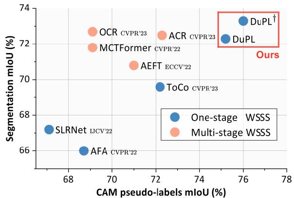
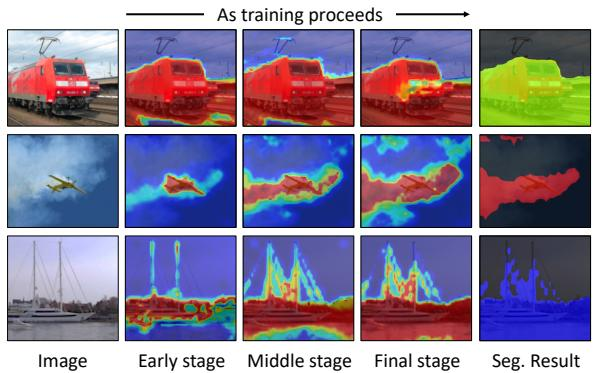
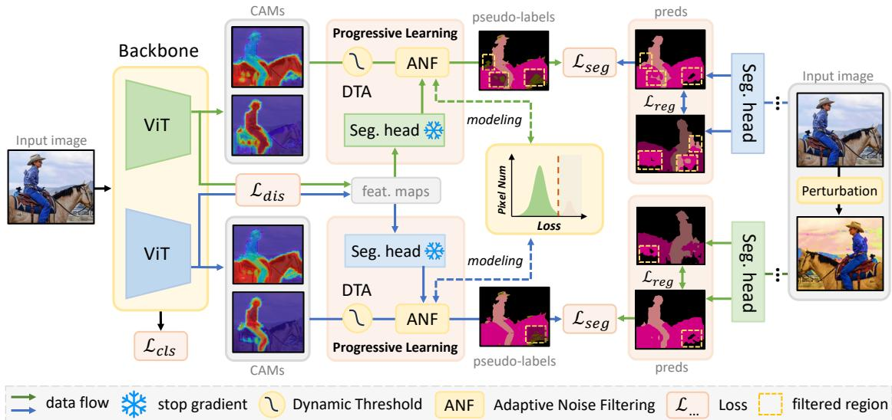
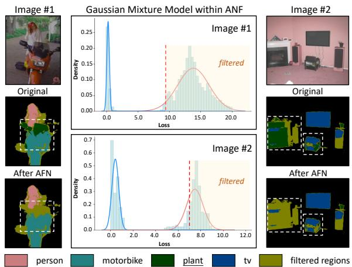
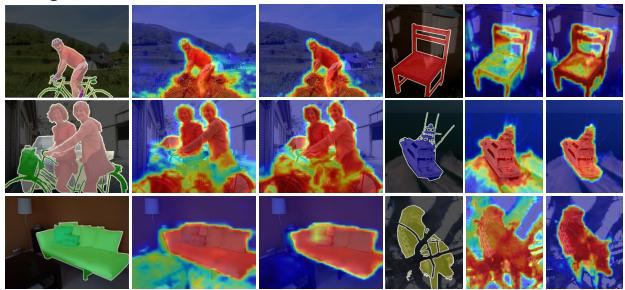
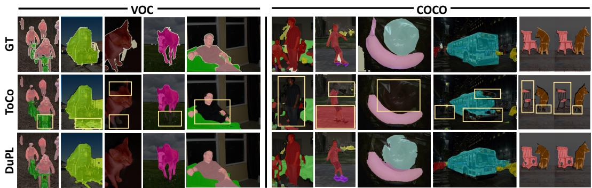
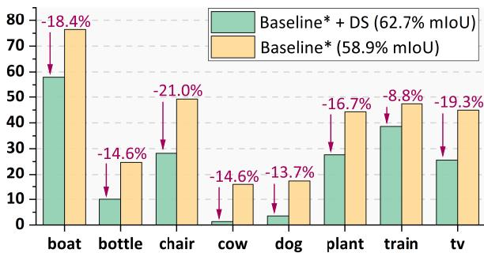
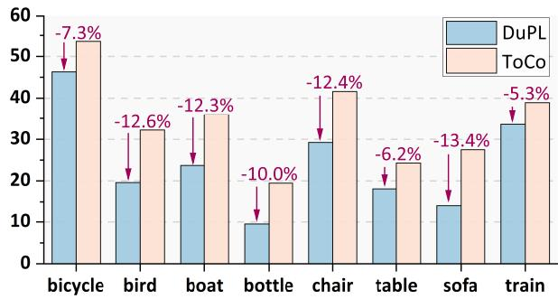

# DuPL: Dual Student with Trustworthy Progressive Learning for Robust Weakly Supervised Semantic Segmentation

Yuanchen Wu1, Xichen Ye1, Kequan Yang1, Jide Li1, Xiaoqiang Li1\* 1 School of Computer Engineering and Science, Shanghai University, China. {yuanchenwu,yexichen0930,kqyang,iavtvai,xqli}@shu.edu.cn

## Abstract

Recently, One-stage Weakly Supervised Semantic Segmentation (WSSS) with image-level labels has gained increasing interest due to simplification over its cumbersome multi-stage counterpart. Limited by the inherent ambiguity of Class Activation Map (CAM), we observe that one-stage pipelines often encounter confirmation bias caused by incorrect CAMpseudo-labels, impairing theirfinal segmentation performance. Although recent works discard many unreliable pseudo-labels to implicitly alleviate this issue, they fail to exploit sufficient supervision for their models. To this end, we propose a dual student framework with trustworthy progressive learning (DuPL). Specifically, we propose a dual student network with a discrepancy loss to yield diverse CAMs for each sub-net. The two sub-nets generate supervisionfor each other, mitigating the confirmation bias caused by learning their own incorrect pseudo-labels. In this process, we progressively introduce more trustworthy pseudo-labels to be involved in the supervision through dynamic threshold adjustment with an adaptive noise filtering strategy. Moreover, we believe that every pixel, even discarded from supervision due to its unreliability, is importantfor WSSS. Thus, we develop consistency regularization on these discarded regions, providing supervision of every pixel. Experiment results demonstrate the superiority ofthe proposed DuPL over the recent state-of-the-art alternatives on PASCAL VOC 2012 and MS COCO datasets. Code is available at https://github.com/Wu0409/DuPL .

## 1. Introduction

Weakly supervised semantic segmentation (WSSS) aims at using weak supervision, such as image-level labels [13, 42], scribbles [28, 41], and bounding boxes [22, 32], to alleviate the reliance on pixel-level annotations for segmentation. Among these annotation forms, using image-level labels is the most rewarding yet challenging way, as it only provides the presence of certain classes without offering any localization information. In this paper, we also focus on semantic segmentation using image-level labels.

  
Figure 1. CAM pseudo-labels (train) vs. segmentation performance (val) on PASCAL VOC 2012. DuPL outperforms stateof-the-art one-stage competitors and achieves comparable performance with multi-stage methods in terms of CAM pseudo-labels and final segmentation performance. † denotes using ImageNet-21k pretrained parameters.

Prevalent works typically follow a multi-stage pipeline [18], i.e., pseudo-label generation, refinement, and segmentation training. First, the pixel-level pseudo-labels are derived from Class Activation Map (CAM) through classification [46]. Since CAM tends to identify the discriminative semantic regions and fails to distinguish co-occurring objects, the pseudo-labels often suffer from the CAM ambiguity. Thus, they are then refined by training a refinement network [1, 2]. Finally, the refined pseudo-labels are used to train a segmentation model in a fully supervised manner. Recently, to simplify the multi-stage process, many studies proposed one-stage solutions that simultaneously produce pseudo-labels and learn a segmentation head [3, 39, 40]. Despite their enhanced training efficiency, the performance still lags behind their multi-stage counterparts.

One important yet overlooked reason is the confirmation bias of CAM, stemming from the concurrent process of CAM pseudo-label generation and segmentation supervision. For the one-stage pipeline, the segmentation training enforces the backbone features to align with the CAM pseudo-labels. Since the backbone features are shared for the segmentation head and the CAM generation, these inaccurate CAM pseudo-labels not only hinder the learning process of segmentation but, more critically, reinforce the CAM’s incorrect judgments. As illustrated in Figure 2, this issue consistently deteriorates throughout the training phase and eventually degrades the segmentation performance. Recent one-stage approaches [39, 40, 44] commonly set a fixed and high threshold to filter unreliable pseudo-labels, which prioritizes high-quality supervision to implicitly alleviate this issue. However, this strategy fails to exploit sufficient supervision for their models. Employing a fixed and high threshold inevitably discards many pixels that actually have correct CAM pseudo-labels. Furthermore, these unreliable regions discarded from supervision often exist in semantically ambiguous regions. Excluding them directly from supervision makes the model rarely learn the segmentation in these regions, leading to insufficient training. From this perspective, we believe that every pixel matters for segmentation and should be properly utilized.

  
Figure 2. Confirmation bias of CAM. As training proceeds, the bias will be consistently reinforced, impairing the final segmentation performance. Here, we use the ViT-B [12] baseline and introduce more unreliable pseudo-labels to amplify this phenomenon.

To address the above limitations, this work proposes a dual student framework with trustworthy progressive learning, dubbed DuPL. Inspired by the co-training [35] paradigm, we equip two student sub-networks that engage in mutual learning. They infer diverse CAMs from different views, and transfer the knowledge learned from one view to the other. To avoid homogenous students, we impose a representation-level discrepancy constraint on the two subnets. This architecture effectively mitigates the confirmation bias resulting from their own incorrect pseudo-labels, thus producing high-fidelity CAMs. Based on our dual student framework, we propose trustworthy progressive learning for sufficient segmentation supervision. We set up a dynamic threshold adjustment strategy to involve more pixels in the segmentation supervision. To overcome the noise in CAM pseudo-labels, we propose an adaptive noise filtering strategy based on the Gaussian Mixture Model. Finally, for the regions where pseudo-labels are excluded from supervision due to their unreliability, we employ an additional strong perturbation branch for each sub-net and develop consistency regularization on these regions. Overall, our main contributions are summarized as follows:

• We explore the CAM confirmation bias in one-stage WSSS. To address this limitation, we propose a dual student architecture. Our experiment proves its effectiveness of reducing the over-activation rate caused by this issue and promotes the quality of CAM pseudo-labels.

• We propose progressive learning with adaptive noise filtering, which allows more trustworthy pixels to participate in supervision. For the regions with filtered pseudolabels, we develop consistency regularization for sufficient training. This strategy highlights the importance of fully exploiting pseudo-supervision for WSSS.

• Experiments on the PASCAL VOC and MS COCO datasets show that DuPL surpasses state-of-the-art onestage WSSS competitors and achieves comparable performance with multi-stage solutions (Figure 1). Through visualizing the segmentation results, we observe that DuPL shows much better segmentation robustness, thanks to our dual student and trust-worthy progressive learning.

## 2. Related work

One-stage Weakly Supervised Semantic Segmentation. Due to the complex process of multi-stage solutions [1, 2], many recent efforts mainly focused on one-stage solutions [3, 39, 40, 44]. A common one-stage pipeline is generating CAM and using online refinement modules to obtain final pseudo-labels [3]. These pseudo-labels are then directly used as the supervision for the segmentation head. Typically, recent works mainly proposed additional modules or training objectives to achieve better segmentation. For instance, Zhang et al. [45] introduce a feature-to-prototype alignment loss with an adaptive affinity field, Ru et al. [39] leverage pseudo-labels to guide the affinity learning of selfattention, and Xu et al. [44] utilize feature correspondence to achieve self-distillation. One common practice of them is that they all set a high and fixed threshold to filter out unreliable pseudo-labels to ensure the quality of supervision. In contrast, we propose a progressive learning strategy fully exploit the potential of every pseudo-label.

Confirmation Bias. This phenomenon commonly occurs in the self-training paradigm of semi-supervised learning (SSL) [21], where the model overfits the unlabeled images assigned with incorrect pseudo-labels. In the above process, this incorrect information is constantly reinforced, causing the unstable training process [4]. Co-training offers an effective solution to this issue [35]. It uses two diverse sub-nets to provide mutual supervision to ensure more stable and accurate predictions while mitigating the confirmation bias [8, 33]. Motivated by this, we propose a dual student architecture with a representation-level discrepancy loss to generate diverse CAMs. The two sub-nets learn from each other through the other’s pseudo-labels, countering the CAM confirmation bias and achieving better object activation. To the best of our knowledge, DuPL is the first work exploring the CAM confirmation bias in one-stage WSSS.

Noise Label Learning in WSSS. In addition to better CAM pseudo-label generation, several recent works aim at learning a robust segmentation model using existing pseudolabels [10, 27, 31]. URN [27] introduces the uncertainty estimation by the pixel-wise variance between different views to filter noisy labels. Based on the early learning and memorization phenomenon [30], ADELE [31] adaptively calibrates noise labels based on prior outputs in the early learning stage. Different from these works relying on the existing CAM pseudo-labels by other works, the pseudo-labels in one-stage methods continuously update in training. To alleviate the noise pseudo-labels for our progressive learning, we design an online adaptive noise filtering strategy based on the loss feedback from the segmentation head.

## 3. Method

## 3.1. Preliminary

We begin with a brief review of how to generate CAM [46] and its pseudo-labels. Given an image, its feature maps $\mathbf { F } \in \mathbb { R } ^ { \tilde { D } \times H \times W }$ are extracted by a backbone network, where D and $H \times W$ is the channel and spatial dimension, respectively. Then, F is fed to a global average pooling and a classification layer to output the final classification score. In the above process, we can retrieve the classification weight of every class $\mathbf { W } \in \mathbb { R } ^ { C \times D }$ and use it to weight and sum the feature maps to generate the CAM:

$$
\mathbf { M } ( c ) = \mathrm { R e L U } \left( \sum _ { i = 1 } ^ { D } \mathbf { W } _ { c , i } \cdot \mathbf { F } _ { i } \right) ,\tag{1}
$$

where c is the c-th class and ReLU is used to eliminate negative activations. Finally, we apply max-min normalization to rescale $\mathbf { M } \in \mathbb { R } ^ { \tilde { C } \times H \times W } \mathbf { \bar { t o } } \left[ 0 , 1 \right]$ . To generate the CAM pseudo-labels, one-stage WSSS methods commonly use two background thresholds $\tau _ { l }$ and $\tau _ { h }$ to separate the background $( \mathbf { M } \leq \tau _ { l } )$ , uncertain region $( \boldsymbol { \tau } _ { l } < \mathbf { M } < \boldsymbol { \tau } _ { h } )$ and foreground $( \mathbf { M } \geq \tau _ { h } )$ [39, 40]. The uncertain part is regarded as unreliable regions with noise, and will not be involved in the supervision of the segmentation head.

## 3.2. Dual Student Framework

To overcome the confirmation bias of CAM, we propose a co-training-based dual student network where two sub-nets $( i . e . , \psi _ { 1 }$ and $\psi _ { 2 } )$ have the same network architecture, and their parameters are independently updated and non-shared. As presented in Figure 3, for the i-th sub-net, it comprises a backbone network $\psi _ { i } ^ { f }$ , a classifier $\psi _ { i } ^ { c }$ , and a segmentation head $\psi _ { i } ^ { s }$ . To ensure that the two sub-nets activate more diverse regions in CAMs, we enforce sufficient diversity to their representations extracted from $\psi _ { i } ^ { f }$ , preventing two sub-nets from being homogeneous such that one subnet can learn the knowledge from the other to alleviate the confirmation bias of CAM. Therefore, we set a discrepancy constraint to minimize the cosine similarity between the feature maps of two sub-nets. Formally, denoting the input image as $\mathbf { X }$ and the features from the sub-nets as $f _ { 1 } = \psi _ { 1 } ^ { f } ( \mathbf { X } )$ and $f _ { 2 } = \psi _ { 2 } ^ { f } ( \mathbf { X } )$ , we minimize their similarity by:

$$
\mathcal { D } \left( \pmb { f } _ { 1 } , \pmb { f } _ { 2 } \right) = - l o g \left( 1 - \frac { \pmb { f } _ { 1 } \cdot \pmb { f } _ { 2 } } { \| \pmb { f } _ { 1 } \| _ { 2 } \times \| \pmb { f } _ { 2 } \| _ { 2 } } \right) ,\tag{2}
$$

where $\lVert \cdot \rVert _ { 2 }$ is l2-normalization. Following [7, 14], we define a symmetrized discrepancy loss as:

$$
\begin{array} { r } { \mathcal { L } _ { d i s } = \mathcal { D } ( f _ { 1 } , \Delta ( f _ { 2 } ) ) + \mathcal { D } ( f _ { 2 } , \Delta ( f _ { 1 } ) ) , } \end{array}\tag{3}
$$

where $\Delta$ is the stop-gradient operation to avoid the model from collapse. This loss is computed for each image, with the total loss being the average across all images.

The segmentation supervision of dual student is bidirectional. One is from ${ { \bf { M } } _ { 1 } }$ to $\psi _ { 2 }$ and the other one is $\mathbf { M } _ { 2 }$ to $\psi _ { 1 }$ , where $\mathbf { M } _ { 1 } , \mathbf { M } _ { 2 }$ are the CAM from the sub-nets $\psi _ { 1 }$ $\psi _ { 2 } ,$ , respectively. The CAM pseudo-labels $\mathbf { Y } _ { 1 }$ from ${ { \bf { M } } _ { 1 } }$ are used to supervise the prediction maps $\mathbf { P } _ { 2 }$ from the other sub-net’s segmentation head $\psi _ { 2 } ^ { s }$ , and vice versa. The segmentation loss of our framework is computed as:

$$
\begin{array} { r } { \mathcal { L } _ { s e g } = \mathrm { C E } ( \mathbf { P } _ { 1 } , \mathbf { Y } _ { 2 } ) + \mathrm { C E } ( \mathbf { P } _ { 2 } , \mathbf { Y } _ { 1 } ) , } \end{array}\tag{4}
$$

where CE is the standard cross-entropy loss function.

## 3.3. Trustworthy Progressive Learning

Dynamic Threshold Adjustment. As mentioned in Section 3.1, one-stage methods [39, 40, 44] set background thresholds, τl and $\tau _ { h } .$ , to generate pseudo-labels, where $\tau _ { h }$ is usually set to a very high value to ensure that only reliable foreground pseudo-labels can participate in the supervision. In contrast, during the training of dual student framework, the CAMs tend to be more reliable gradually. Based on this intuition, to fully utilize more foreground pseudo-labels for sufficient training, we adjust the background threshold $\tau _ { h }$ with the cosine descent strategy in every iteration:

$$
\tau _ { h } ( \mathrm { t } ) = \tau _ { h } ( 0 ) - \frac { 1 } { 2 } \left( \tau _ { h } ( 0 ) - \tau _ { h } ( \mathrm { T } ) \right) ( 1 - \cos ( \frac { \mathrm { t } \pi } { \mathrm { T } } ) ) ,\tag{5}
$$

where t is the current number of iteration and T is the total number of training iterations.

Adaptive Noise Filtering. To further reduce the noise in the produced pseudo-labels that impacts the segmentation generalizability and reinforces the CAM confirmation bias, we develop an adaptive noise filtering strategy to implement trust-worthy progressive learning. Previous studies suggest that deep networks tend to fit clean labels faster than noisy ones [5, 15, 37]. This implies that the samples with smaller losses are more likely to be considered as the clean ones before the model overfits the noisy labels. A simple idea is to use a predefined threshold to divide the clean and noisy pseudo-labels based on their training losses. However, it fails to consider that the model’s loss distribution is different across various samples, even those within the same class.

  
Figure 3. The overall framework of DuPL. We use a discrepancy loss $\mathcal { L } _ { d i s }$ to constrain the two sub-nets to generate diverse CAMs. Their CAM pseudo-labels are utilized for segmentation cross-supervision $\mathcal { L } _ { s e g }$ , which mitigates the CAM confirmation bias. In this process, we set a dynamic threshold to progressively introduce more pixels to segmentation supervision. Adaptive Noise Filtering strategy is equipped to minimize the noise in pseudo-labels via the segmentation loss distribution. To utilize every pixel, the filtered regions are implemented consistency regularization $\mathcal { L } _ { r e g }$ with their perturbed counterparts. The classifier is simplified for the clear illustration.

To this end, we develop an Adaptive Noise Filtering strategy to distinguish noisy and clean pseudo-labels via the loss distribution, as depicted in Figure 4. Specifically, for the input image X with its segmentation map P and CAM pseudo-label Y, we hypothesize the loss of each pixel $x \in \mathbf { X }$ , defined as $l ^ { x } = \mathrm { C E } ( \mathbf { P } ( x )$ , Y (x)), is sampled from a Gaussian mixture model (GMM) ${ \mathcal { P } } ( x )$ on all pixels with two components, i.e., clean c and noisy n:

$$
\mathcal { P } ( l ^ { x } ) = w _ { c } \mathcal { N } ( l ^ { x } | \mu _ { c } , \left( \sigma _ { c } \right) ^ { 2 } ) + w _ { n } \mathcal { N } ( l ^ { x } | \mu _ { n } , \left( \sigma _ { n } \right) ^ { 2 } ) ,\tag{6}
$$

where ${ \mathcal { N } } ( \mu , \sigma ^ { 2 } )$ represents one Gaussian distribution, $w _ { c } , \mu _ { c } , \sigma _ { c }$ and $w _ { n } , \mu _ { n } , \sigma _ { n }$ correspond to the weight, mean, and variance of two components. Thereinto, the component with high loss values corresponds to the noise component. Through Expectation Maximization algorithm [25], we can infer the noise probability $\varrho _ { n } ( l ^ { x } )$ , which is equivalent to the posterior probability of P(noise $l ^ { x } , \mu _ { n } , ( \sigma _ { n } ) ^ { 2 } )$ . If $\varrho _ { n } ( l ^ { x } ) > \gamma$ , the corresponding pixel will be classified as noise. Note that not all pseudo-labels Y are composed of noise, and thus the loss distributions may not have two clear Gaussian distributions. Therefore, we additionally measure the distance between $\mu _ { c }$ and $\mu _ { n }$ . If $\left( \mu _ { n } - \mu _ { c } \right) \leq \eta .$ all the pixel pseudo-labels will be regarded as clean ones. Finally, the set of noisy pixel pseudo-labels are determined as

$$
\mathcal { X } _ { n } = \{ x \mid \varrho _ { n } ( l ^ { x } ) > \gamma , \mu _ { c } - \mu _ { n } > \eta \} ,\tag{7}
$$

and they are excluded in the segmentation supervision. In DuPL, each sub-net’s pseudo-labels are conducted adaptive noise filtering strategy independently.

Every Pixel Matters. In one-stage WSSS, discarding unreliable pseudo-labels that probably contain noises is a common practice to ensure the quality of the segmentation or other auxiliary supervision [39, 40, 44]. Although we gradually introduce more pixels to the segmentation training, there are still many unreliable pseudo-labels being discarded due to the semantic ambiguity of CAM. Typically, throughout the training phase, unreliable regions often exist in non-discriminative regions, boundaries, and background regions. Such an operation may cause the segmentation head to lack sufficient supervision in these regions.

To address this limitation, we treat the regions with unreliable pseudo-labels as unlabeled samples. Despite no clear pseudo-labels to supervise the segmentation in these regions, we can regularize the segmentation head to output consistent predictions when fed perturbed versions of the same image. The consistency regularization implicitly imposes the model to comply with the smoothness assumption [6, 20], which provides additional supervision for these regions. Specifically, we first apply strong augmentation $\phi$ to perturb the input image $\phi ( \mathbf { X } ) \to { \widetilde { \mathbf { X } } } .$ , and then send it to the sub-nets to get the segmentation prediction $\widetilde { \mathbf { P } } _ { i }$ from ψs. Using the pseudo-label $\phi ^ { \prime } ( \mathbf { Y } _ { i } )$ taking the same affine transformation in ϕ as the supervision, the consistency regularization of the i-th sub-net is formulated as:

  
Figure 4. The loss distribution of images with noisy pseudolabels. The model produces incorrect pseudo-labels of plant. Two peaks appear in the loss distribution on the two pseudo-labels, and the red peak with anomalous losses is mainly caused by noises. The distribution of normal losses is rescaled for visualization.

$$
\mathcal { L } _ { r e g . i } = \frac { 1 } { | \mathcal { M } _ { i } | } \sum _ { x \in \mathbf { X } } \subset \mathbb { C } \left[ \widetilde { \mathbf { P } } _ { i } ( \phi ( x ) ) , \phi ^ { \prime } ( \mathbf { Y } _ { i } ( x ) ) \right] \cdot \mathcal { M } _ { i } ,\tag{8}
$$

where $\mathcal { M } _ { i }$ is the mask indicating the filtered pixels with unreliable pseudo-labels of the i-th sub-net. The filtered pixel is masked as 1, and otherwise it is 0. The total regularization loss of our dual student framework is $\mathcal { L } _ { r e g }$ = $\mathcal { L } _ { r e g _ { - } 1 } + \mathcal { L } _ { r e g _ { - } 2 }$ . This loss is computed for each image, with the total loss being the average across all images.

## 3.4. Training objective of DuPL

As illustrated in Figure 3, DuPL consists four training objectives, that are, the classification loss $\mathcal { L } _ { c l s } .$ , the discrepancy loss $\mathcal { L } _ { d i s }$ , the segmentation loss $\mathcal { L } _ { s e g } ,$ , and consistency regularization loss $\mathcal { L } _ { { r e g } }$ . Following the common practice in WSSS, we use the multi-label soft margin loss for classification. The total optimization objective of DuPL is the linear combination of the above loss terms:

$$
\begin{array} { r } { \mathcal { L } = \mathcal { L } _ { c l s } + \lambda _ { 1 } \mathcal { L } _ { d i s } + \lambda _ { 2 } \mathcal { L } _ { s e g } + \lambda _ { 3 } \mathcal { L } _ { r e g } , } \end{array}\tag{9}
$$

where $\lambda _ { i }$ is the weight to rescale the loss terms.

## 4. Experiments

## 4.1. Experimental Settings

Datasets. We evaluate the proposed DuPL on the two standard WSSS datasets, i.e., PASCAL VOC 2012 and MS

<table><tr><td rowspan=1 colspan=1>Method</td><td rowspan=1 colspan=1>Backbone</td><td rowspan=1 colspan=1>train  val</td></tr><tr><td rowspan=3 colspan=1>Multi-stage WSSS MethodsPPC [13] cVPR·2022 + PSA [1]ACR [19] cVPR·2023 + IRN [2]</td><td rowspan=3 colspan=2>73.372.3     一</td></tr><tr><td rowspan=1 colspan=1>WR38</td></tr><tr><td rowspan=1 colspan=1>WR38</td></tr><tr><td rowspan=2 colspan=1>One-stage WSSS Methods1Stage [3] cvPR&#x27;2020</td><td rowspan=1 colspan=1></td><td rowspan=2 colspan=1>66.9    65.3</td></tr><tr><td rowspan=1 colspan=1>WR38</td></tr><tr><td rowspan=1 colspan=1>ViT-PCM [38] ECCV·2022</td><td rowspan=1 colspan=1>ViT-B†</td><td rowspan=1 colspan=1>67.7    66.0</td></tr><tr><td rowspan=2 colspan=1>AFA [39] cVPR&#x27;2022ToCo [40] CVPR*2023</td><td rowspan=1 colspan=1>MiT-B1</td><td rowspan=1 colspan=1>68.7    66.5</td></tr><tr><td rowspan=1 colspan=1>ViT-B</td><td rowspan=1 colspan=1>72.2    70.5</td></tr><tr><td rowspan=2 colspan=1>DuPLDuPL†</td><td rowspan=1 colspan=1>ViT-B</td><td rowspan=1 colspan=1>75.1    73.5</td></tr><tr><td rowspan=1 colspan=1>ViT-B†</td><td rowspan=1 colspan=1>76.0    74.1</td></tr></table>

Table 1. Evaluation of CAM pseudo labels. The results are evaluated on the VOC train and val set and reported in mIoU (%). † denotes using ImageNet-21k pretrained parameters.

COCO 2014 datasets. For the VOC 2012 dataset, it is extended with the SBD dataset [16] following common practice. The train, val, and test set are composed of 10582, 1449, and 1456 images, respectively. The test performance of DuPL is evaluated on the official evolution server. For the COCO 2014 dataset, its train and val set involve 82k and 40k images, respectively. The mean Intersection-over-Union (mIoU) is reported for performance evaluation.

Network Architectures of DuPL. We use the ViT-B [12] with a lightweight classifier and a segmentation head, and the patch token contrast loss [40] as our baseline network. The classifier is a fully connected layer. The segmentation head consists of two $3 \times 3$ convolutional layers (with a dilation rate of 5) and one $1 \times 1$ prediction layer. The patch token contrast loss is applied to alleviate the over-smoothness issue of CAM in ViT-like architectures. DuPL is composed of two subnets with the baseline settings, where the backbones are initialized with ImageNet pretrained weights.

Implement Details. We adopt the AdamW optimizer with an initial learning rate set to $6 e ^ { - 5 }$ and a weight decay factor 0.01. The input images are augmented using the strategy in [40], and cropped to 448×448. For the strong perturbations, we adopt Random Augmentation strategy [11] on color and apply additional scaling and horizontal flipping. In the inference stage, following the common practice in WSSS, we use multi-scale testing and dense CRF processing.

For experiments on the VOC 2012 dataset, the batch size is set as 4. The total iteration is set as 20k with 2k iterations warmed up for the classifiers and 6k iterations warmed up for the segmentation heads before conducting Adaptive Noise Filtering. The background thresholds $( \tau _ { l } , \tau _ { h } ( 0 ) , \tau _ { h } ( \mathrm { T } ) )$ are set as (0.25, 0.7, 0.55). The thresholds $( \gamma , \eta )$ of Adaptive Noise Filtering are set as (0.9, 1.0). The weight factors $( \lambda _ { 1 } , \lambda _ { 2 } , \lambda _ { 3 } )$ of the loss terms in Section 3.4 are set as (0.1, 0.2, 0.05). For the COCO dataset, the batch size is set as 8. The network is trained for 80k iterations with 5k iterations warmed up for the classifier, and 20k iterations warmed up for the segmentation head. The other settings are remained the same.

DuPL  
ToCo  
Image & GT  
DuPL Image & GT ToCo  
  
Figure 5. Visual comparison of CAMs. We compare the state-ofthe-art one-stage approach, ToCo [40], with our proposed DuPL. DuPL not only suppresses over-activations but also achieves more complete object activation coverage.

## 4.2. Experimental Results

CAM and Pseudo-labels. We begin by visualizing the CAM of DuPL in Figure 5. We can find that, using the same ViT-B backbone with ImageNet-1k pretrained weights, our method can generate more complete and accurate CAMs when compared to current state-of-the-art one-stage work, i.e., ToCo [40]. Then, we evaluate the CAM pseudo-labels on the train and val set of the VOC dataset and compare them with recent state-of-the-art WSSS methods. In one-stage methods, the pseudo-labels are directly generated using CAMs, while those of multi-stage methods are produced by the initial seed generation and refinement processes. The results are presented in Table 1. As can be seen, DuPL significantly outperforms the recent one-stage competitors and even surpasses the multi-stage methods. Compared with other methods with ViT-B baseline, our methods can produce higher quality pseudo-labels than the competitors with both the ImageNet-1k and ImageNet-21k pretrained weights. Using ViT-B with ImageNet-21k pretrained weights, we boost the pseudo-label performance to 76.0% (+3.8%) and 74.1% (+3.6%) on the train and val set, respectively.

Final Segmentation Results. Table 2 reports the final segmentation performance of DuPL. To show the superiority of the proposed method, we compare our performance with both one-stage and multi-stage prior arts. Notably, the proposed DuPL achieves 73.3% (+3.5%), 72.8% (+2.3%) and 44.6% (+3.3%) mIoU on the VOC val, test and COCO val set, respectively, which significantly surpasses recent one-stage methods. The performance of DuPL strongly supports that fully exploiting the trustworthy pseudo-labels is very important to single-stage methods. Also, DuPL proves that using the one-stage pipeline is strong enough to achieve competitive WSSS performance with multi-stage approaches. Along with the quantitative comparison results, we visualize and compare the segmentation masks of DuPL, ToCo [40], and ground-truths in Figure 6. We can see that DuPL predicts more accurate objects in challenging scenes, which are close to their ground truths.

<table><tr><td rowspan=2 colspan=2></td><td rowspan=2 colspan=1>Sup.</td><td rowspan=2 colspan=1>Net.</td><td rowspan=1 colspan=1>VOC</td><td rowspan=1 colspan=1>COCO</td></tr><tr><td rowspan=1 colspan=1>val test</td><td rowspan=1 colspan=1>val</td></tr><tr><td rowspan=11 colspan=3>Multi-stage WSSS Methods.EPS [24] cVPR*2021        I + SL2G [17] cVPR&#x27;2022       I + SPPC [13] CVPR&#x27;2022       I + SLin et al. [29] cvPR·2023   I + TReCAM [9] cVPR&#x27;2022W-OoD [23] cVPR&#x27;2022ESOL [26] NeurIPS&#x27;2022MCTformer [43] cvPR&#x27;2022OCR [10] CVPR*2023ACR [19] CVPR&#x27;2023</td><td rowspan=1 colspan=1></td><td rowspan=1 colspan=1></td><td rowspan=2 colspan=1></td></tr><tr><td rowspan=1 colspan=1>I + S</td><td rowspan=1 colspan=1>DL-V2</td><td rowspan=2 colspan=1>71.071.872.171.7</td></tr><tr><td rowspan=1 colspan=1></td><td rowspan=1 colspan=1>I + S</td><td rowspan=1 colspan=1>DL-V2</td><td rowspan=1 colspan=1>44.2</td></tr><tr><td rowspan=1 colspan=1>I + S</td><td rowspan=1 colspan=1>DL-V2</td><td rowspan=1 colspan=1>72.673.6</td><td rowspan=1 colspan=1></td></tr><tr><td rowspan=1 colspan=1>I + T</td><td rowspan=1 colspan=1>DL-V2</td><td rowspan=1 colspan=1>71.171.4</td><td rowspan=1 colspan=1>45.4</td></tr><tr><td rowspan=1 colspan=1></td><td rowspan=1 colspan=1>DL-V2</td><td rowspan=1 colspan=1>68.468.2</td><td rowspan=1 colspan=1>45.0</td></tr><tr><td rowspan=1 colspan=1></td><td rowspan=1 colspan=1>WR-38</td><td rowspan=1 colspan=1>70.770.1</td><td rowspan=1 colspan=1></td></tr><tr><td rowspan=1 colspan=1></td><td rowspan=1 colspan=1>DL-V2</td><td rowspan=1 colspan=1>69.969.3</td><td rowspan=1 colspan=1>42.6</td></tr><tr><td rowspan=1 colspan=1></td><td rowspan=1 colspan=1>WR-38</td><td rowspan=1 colspan=1>71.971.6</td><td rowspan=1 colspan=1>42.0</td></tr><tr><td rowspan=2 colspan=1></td><td rowspan=1 colspan=1>WR-38</td><td rowspan=2 colspan=1>72.772.071.971.9</td><td rowspan=2 colspan=1>42.545.3</td></tr><tr><td rowspan=1 colspan=1>DL-V2</td></tr><tr><td rowspan=5 colspan=2>One-stage WSSS MethodRRM [45] AAAI&#x27;20201Stage [3] cvPR&#x27;2020AFA [39] CVPR*2022SLRNet [34] uCV2022</td><td rowspan=1 colspan=1>s.</td><td rowspan=1 colspan=1></td><td rowspan=1 colspan=1></td><td rowspan=3 colspan=1></td></tr><tr><td rowspan=1 colspan=1>I</td><td rowspan=1 colspan=1>WR-38</td><td rowspan=2 colspan=1>62.662.962.764.3</td></tr><tr><td rowspan=1 colspan=1>I</td><td rowspan=1 colspan=1>WR-38</td></tr><tr><td rowspan=1 colspan=1>I</td><td rowspan=1 colspan=1>MiT-B1</td><td rowspan=1 colspan=1>66.066.3</td><td rowspan=1 colspan=1>38.9</td></tr><tr><td rowspan=1 colspan=1>I</td><td rowspan=1 colspan=1>WR-38</td><td rowspan=1 colspan=1>67.267.6</td><td rowspan=1 colspan=1>35.0</td></tr><tr><td rowspan=1 colspan=2>TSCD [44] AAAI&#x27;2023</td><td rowspan=1 colspan=1>I</td><td rowspan=1 colspan=1>MiT-B1</td><td rowspan=1 colspan=1>67.367.5</td><td rowspan=1 colspan=1>40.1</td></tr><tr><td rowspan=1 colspan=2>ToCo [40] cVPR&#x27;2023</td><td rowspan=1 colspan=1>I</td><td rowspan=1 colspan=1>ViT-B</td><td rowspan=1 colspan=1>69.870.5</td><td rowspan=1 colspan=1>41.3</td></tr><tr><td rowspan=1 colspan=2>DuPL</td><td rowspan=1 colspan=1>I</td><td rowspan=1 colspan=1>ViT-B</td><td rowspan=1 colspan=1>72.271.6</td><td rowspan=1 colspan=1>43.5</td></tr><tr><td rowspan=1 colspan=2>DuPL†</td><td rowspan=1 colspan=1>I</td><td rowspan=1 colspan=1>ViT-B†</td><td rowspan=1 colspan=1>73.372.8²</td><td rowspan=1 colspan=1>44.6</td></tr></table>

Table 2. Semantic Segmentation Results. “Sup.” denotes the supervision type. I: Image-level labels; S: Saliency maps. T : textdriven supervision from CLIP [36]. “Net.” denotes the backbone in one-stage methods and the segmentation network in multi-stage methods. † denotes using ImageNet-21k pretrained weights.

Fully-Supervised Counterparts. As presented in Table 3, the one-stage competitors adopt various backbones, e.g., Wide ResNet38 (WR-38), MixFormer-Base1 (MiT-B1), and ViT-Base (ViT-B). To eliminate the impact of backbone on segmentation results for fair comparison, we compared the performance gap between the methods and their fully supervised counterpart. Notably, when using the ImageNet-1k pre-trained weight, DuPL achieves 72.2% mIoU and 90.1% of its upper bound performance, significantly ahead of recent one-stage one-stage methods (+3.4%).

## 4.3. Ablation studies and Analysis

Effectiveness of Components. The proposed DuPL consists of a dual student (DS) architecture and trust-worthy progressive learning. Within the progressive learning, we have dynamic threshold adjustment (DTA) and Adaptive

  
Figure 6. Visualization of segmentation results on PSCAL VOC 2012 and MS COCO datasets. We compare the results of DuPL with those of ToCo [40]. Both of them use ViT-B with ImageNet-1k as the backbone for fair comparison.

Noise Filtering (ANF). In addition to the basic classification and segmentation loss, DuPL also incorporates two training losses, i.e., discrepancy loss $\mathcal { L } _ { d i s }$ and consistency regularization loss $\mathcal { L } _ { r e g }$ . We now investigate the contributions of each module and loss in DuPL.

The experiment results are presented in Table 4. We can observe that employing solely dual student architecture brings a slight improvement of nearly 2% mIoU for CAM pseudo-labels, resulting in 63.8% mIoU of segmentation performance. In this setting, the CAM diversity arises merely from the randomly initialized segmentation heads, thus the CAMs from the two sub-nets are still highly identical, leaving a huge space for improvement. When incorporating $\mathcal { L } _ { d i s } ,$ the performance of CAM pseudo-label is improved to 67.3% mIoU, indicating that it can further benefit the effectiveness of dual student architecture. As CAM becomes increasingly reliable, DTA progressively introduces more pixels into the segmentation supervision and improves the segmentation performance by 2.6%. The ANF suppresses noise pseudo-labels and improves segmentation performance by 1.5%. It’s noted that high-quality supervision of segmentation benefits the CAM quality, and DTA with ANF significantly improves the pseudo labels by 4.3%. With the motivation of “every pixel matters”, $\mathcal { L } _ { d i s }$ ultimately boosts the segmentation performance to 69.9% mIoU, leading to the state-of-the-art.

Analysis of Dual Student. DuPL adopts the mutual supervision of two student sub-nets to alleviate the confirmation bias introduced by their own incorrect pseudo-labels. The confirmation bias issue can be reflected by the overactivation (OA) rate. A higher OA rate means the model activates more incorrect pixels for the target classes, causing a more severe CAM confirmation bias. Here, we count the number of the false positive (FP) and true positive (TP) pixel pseudo-labels for each class, and calculate the OA rate (i.e., FP / (TP + FP)). We first compare the baseline and the ablated variant with Dual Student $( i . e . ,$ , baseline + DS + $\mathcal { L } _ { d i s } )$ under a low background threshold setting $( \tau _ { h } = 0 . 5 )$ From Figure 7a, we can see due to the confirmation bias, the baseline over-activates lots of incorrect regions, resulting in subpar segmentation outcomes (only 58.9% mIoU). With dual student, the ablated version significantly reduces the OA rate by over 15% in many classes, and even reduces the OA rate to below 5% for some categories (such as cow and dog). Further, we evaluate the OA rate of ToCo [40] and DuPL. From Figure 7b, we can see that ToCo also suffers from the confirmation bias problem, with OA rate exceeding 30% in several categories. In contrast, the proposed DuPL significantly overcomes this problem in these severely over-activated classes, which reflects the effectiveness of our architecture.

<table><tr><td rowspan=1 colspan=1>Method</td><td rowspan=1 colspan=2>BB.</td><td rowspan=1 colspan=3>val(F)  val (I)</td><td rowspan=1 colspan=2>ratio (%)</td></tr><tr><td rowspan=1 colspan=1>1Stage [3]</td><td rowspan=1 colspan=2>WR38</td><td rowspan=1 colspan=3>80.8      62.7</td><td rowspan=1 colspan=2>77.6</td></tr><tr><td rowspan=1 colspan=1>SLRNet [34]</td><td rowspan=1 colspan=2>WR38</td><td rowspan=1 colspan=3>80.8      67.2</td><td rowspan=1 colspan=1>83</td><td rowspan=2 colspan=1>83.283.9</td></tr><tr><td rowspan=2 colspan=1>AFA [39]ToCo [40]</td><td rowspan=2 colspan=2>MiT-B1ViT-B</td><td rowspan=2 colspan=3>78.7      66.0</td><td rowspan=1 colspan=1></td></tr><tr><td rowspan=1 colspan=1>Vi</td><td rowspan=1 colspan=2>80.569.8</td><td rowspan=1 colspan=1></td><td rowspan=1 colspan=1>86.7</td></tr><tr><td rowspan=3 colspan=1>DuPLDuPL†</td><td rowspan=2 colspan=2>ViT-B</td><td rowspan=2 colspan=3>80.5      72.2</td><td rowspan=2 colspan=1>8</td><td></td></tr><tr><td rowspan=1 colspan=2>90.1</td></tr><tr><td rowspan=1 colspan=2>ViT-B†</td><td rowspan=1 colspan=3>82.3      73.3</td><td rowspan=1 colspan=2>89.1</td></tr></table>

Table 3. The performance comparison with fully supervised counterparts on the VOC dataset. The pixel pseudo labels are used to supervise the segment head. F: fully-supervised supervision. I: image-level supervision (WSSS). ratio = val (I) / val (F). † denotes using ImageNet-21k pretrained weights.

<table><tr><td>Baseline</td><td>DS</td><td> ${ \mathcal { L } } _ { \mathbf { d i s } }$ </td><td>DTA ANF</td><td> $\mathcal { L } _ { \bf r e g }$ </td><td>M</td><td>Seg.</td></tr><tr><td>√</td><td></td><td></td><td></td><td></td><td>63.2</td><td>62.3</td></tr><tr><td>√</td><td>√</td><td></td><td></td><td></td><td>65.4</td><td>63.8</td></tr><tr><td>V</td><td>√</td><td>V</td><td></td><td></td><td>67.3</td><td>64.1</td></tr><tr><td>√</td><td>√</td><td>√</td><td>√</td><td></td><td>69.2</td><td>66.7</td></tr><tr><td>V</td><td>V</td><td>√</td><td>V √</td><td></td><td>71.6</td><td>68.2</td></tr><tr><td>√</td><td>√</td><td>√</td><td>√ √</td><td>√</td><td>73.5</td><td>69.9</td></tr></table>

Table 4. Ablation Study. “M” denotes the CAM performance and “Seg.” denotes the segmentation performance. CRF postprocessing is not conducted in the ablation study.

  
(a) Comparison of the baseline and the baseline with dual student.

  
(b) Comparison of ToCo [40] and the proposed DuPL.  
Figure 7. Effectiveness evaluation of our proposed method. The OA rate (%) are evaluated on the VOC val set. “\*” denotes the baseline is trained under a low background threshold $( \tau _ { h } = 0 . 5 )$ to aggregate the CAM conformation bias. The per-class results can be viewed in Supplementary Material.

Dynamic Threshold Adjustment. In DuPL, $\tau _ { h } ( { \mathrm t } )$ is a dynamic background threshold that progressively decreases to $\tau _ { h } ( \mathrm { T } )$ with training, aiming at involving more pseudolabels into the segmentation supervision. Table 5a shows the impact of different $\tau _ { h } ( \mathrm { T } )$ on the CAM and segmentation performance. We observe that when $\tau _ { h } ( \mathrm { T } )$ ranges from 0.65 to 0.55, the model’s performance exhibits steady improvement. However, when $\tau _ { h } ( \mathrm { T } )$ is smaller than 0.55, the excessive introduction of noises becomes challenging to suppress, thus yielding a negative impact on the model performance. Nevertheless, the model continues to improve in comparison to the case with a relatively higher $\tau _ { h } ( \mathrm { T } )$ .

Warm-up Stage for The Segmentation Head. Motivated by the Early-learning nature of deep networks, ANF uses the feedback from the segmentation head to filter the noise pseudo-labels. This requires the segmentation head to fit the CAM pseudo-labels properly. Incorporating ANF too early may risk filtering out correct pseudo-labels due to under-fitting, while introducing ANF too late may lead to the model having already memorized noisy pseudo-labels, making it challenging to discriminate them. In Table 5b, we report the impact on the warm-up stage for the segmentation head. We show that warming up the segmentation head using 8000 iterations can achieve the best performance.

Discrepancy strategy in Dual Student. We apply the discrepancy constraint on the representation level to make each sub-nets generate more diverse CAMs. In Table 6, we compare the impact of different discrepancy strategies. It shows that only introducing $\mathcal { L } _ { d i s }$ on the representation level is more beneficial for two sub-nets to transfer the knowledge learned from one view to the other through CAM pseudolabels, thus yielding favorable performance.

<table><tr><td rowspan=1 colspan=1> $\tau _ { \mathbf { h } } ( \mathbf { T } )$ </td><td rowspan=1 colspan=1>M</td><td rowspan=1 colspan=1> $\mathbf { S e g . }$ </td></tr><tr><td rowspan=1 colspan=1>0.65</td><td rowspan=1 colspan=1>69.4</td><td rowspan=1 colspan=1>68.1</td></tr><tr><td rowspan=1 colspan=1>0.60</td><td rowspan=1 colspan=1>71.8</td><td rowspan=1 colspan=1>70.9</td></tr><tr><td rowspan=1 colspan=1>0.55</td><td rowspan=1 colspan=1>73.5</td><td rowspan=1 colspan=1>72.2</td></tr><tr><td rowspan=1 colspan=1>0.50</td><td rowspan=1 colspan=1>72.3</td><td rowspan=1 colspan=1>71.5</td></tr></table>

<table><tr><td rowspan=1 colspan=1>Iter</td><td rowspan=1 colspan=1>M</td><td rowspan=1 colspan=1> $\mathbf { s e g . }$ </td></tr><tr><td rowspan=1 colspan=1>6000</td><td rowspan=1 colspan=1>72.4</td><td rowspan=1 colspan=1>70.9</td></tr><tr><td rowspan=1 colspan=1>8000</td><td rowspan=1 colspan=1>73.5</td><td rowspan=1 colspan=1>72.2</td></tr><tr><td rowspan=1 colspan=1>10000</td><td rowspan=1 colspan=1>72.6</td><td rowspan=1 colspan=1>71.7</td></tr><tr><td rowspan=1 colspan=1>12000</td><td rowspan=1 colspan=1>71.1</td><td rowspan=1 colspan=1>69.4</td></tr></table>

(a) Background threshold $\tau _ { h }$  
(b) Warm-up stage.

Table 5. Impact of hyper-parameters. The results are evaluated on the VOC val set. The default settings are marked in color
<table><tr><td></td><td>None</td><td>Diff. Aug</td><td> ${ \mathcal { L } } _ { \mathbf { d i s } }$ </td><td>Diff. Aug +  ${ \mathcal { L } } _ { \mathbf { d i s } }$ </td></tr><tr><td>M</td><td>69.6</td><td>70.7</td><td>73.5</td><td>70.9</td></tr><tr><td>Seg.</td><td>68.9</td><td>69.8</td><td>72.2</td><td>69.4</td></tr></table>

Table 6. Different discrepancy strategies in Dual student. The results are evaluated on the VOC val set. “Diff. $\mathrm { \ A u g ^ { \mathrm { * } } }$ denotes that the input images of two-subnets are augmented differently, and the CAM pseudo-labels will be re-transformed to fit the inputs for the other sub-net.

## 5. Conclusion

This work aims to address the problem of CAM confirmation bias and fully utilize the CAM pseudo-labels for better WSSS. Specifically, we develop a dual student architecture with two sub-nets that mutually provide the pseudolabels for the other, which is empirically proved to counter the CAM confirmation bias well. With better CAM activations during the training process, we gradually introduce more pixels into the supervision for sufficient segmentation training. We overcome the excessive noisy pseudolabels brought by the above operation by proposing an adaptive noise filter strategy. Such a trustworthy progressive learning paradigm significantly boosts the WSSS performance. Motivated by the idea that “every pixel matters”, instead of discarding unreliable labels, we fully leverage them through consistency regularizations. The experiment results demonstrate that DuPL significantly outperforms other one-stage competitors and archives competitive performance with multi-stage solutions.

Acknowledgements. This work is supported in part by Shanghai science and technology committee under grant No. 22511106005. We appreciate the High Performance Computing Center of Shanghai University, and Shanghai Engineering Research Center of Intelligent Computing System for the computing resources and technical support.

## References

[1] Jiwoon Ahn and Suha Kwak. Learning pixel-level semantic affinity with image-level supervision for weakly supervised semantic segmentation. In Proceedings of the IEEE conference on computer vision and pattern recognition, pages 4981–4990, 2018. 1, 2, 5

[2] Jiwoon Ahn, Sunghyun Cho, and Suha Kwak. Weakly supervised learning of instance segmentation with inter-pixel relations. In Proceedings of the IEEE/CVF conference on computer vision and pattern recognition, pages 2209–2218, 2019. 1, 2, 5

[3] Nikita Araslanov and Stefan Roth. Single-stage semantic segmentation from image labels. In Proceedings of the IEEE/CVF Conference on Computer Vision and Pattern Recognition, pages 4253–4262, 2020. 1, 2, 5, 6, 7

[4] Eric Arazo, Diego Ortego, Paul Albert, Noel E O’Connor, and Kevin McGuinness. Pseudo-labeling and confirmation bias in deep semi-supervised learning. In 2020 International Joint Conference on Neural Networks (IJCNN), pages 1–8. IEEE, 2020. 2

[5] Devansh Arpit, Stanislaw Jastrzebski, Nicolas Ballas, David Krueger, Emmanuel Bengio, Maxinder S Kanwal, Tegan Maharaj, Asja Fischer, Aaron Courville, Yoshua Bengio, et al. A closer look at memorization in deep networks. In International conference on machine learning, pages 233– 242. PMLR, 2017. 4

[6] Philip Bachman, Ouais Alsharif, and Doina Precup. Learning with pseudo-ensembles. Advances in neural information processing systems, 27, 2014. 4

[7] Xinlei Chen and Kaiming He. Exploring simple siamese representation learning. In Proceedings of the IEEE/CVF conference on computer vision and pattern recognition, pages 15750–15758, 2021. 3

[8] Xiaokang Chen, Yuhui Yuan, Gang Zeng, and Jingdong Wang. Semi-supervised semantic segmentation with cross pseudo supervision. In Proceedings of the IEEE/CVF Conference on Computer Vision and Pattern Recognition, pages 2613–2622, 2021. 3

[9] Zhaozheng Chen, Tan Wang, Xiongwei Wu, Xian-Sheng Hua, Hanwang Zhang, and Qianru Sun. Class re-activation maps for weakly-supervised semantic segmentation. In Proceedings of the IEEE/CVF Conference on Computer Vision and Pattern Recognition, pages 969–978, 2022. 6

[10] Zesen Cheng, Pengchong Qiao, Kehan Li, Siheng Li, Pengxu Wei, Xiangyang Ji, Li Yuan, Chang Liu, and Jie Chen. Outof-candidate rectification for weakly supervised semantic segmentation. In Proceedings of the IEEE/CVF Conference on Computer Vision and Pattern Recognition, pages 23673– 23684, 2023. 3, 6

[11] Ekin D Cubuk, Barret Zoph, Jonathon Shlens, and Quoc V Le. Randaugment: Practical automated data augmentation with a reduced search space. In Proceedings of the IEEE/CVF conference on computer vision and pattern recognition workshops, pages 702–703, 2020. 5

[12] Alexey Dosovitskiy, Lucas Beyer, Alexander Kolesnikov, Dirk Weissenborn, Xiaohua Zhai, Thomas Unterthiner,

Mostafa Dehghani, Matthias Minderer, Georg Heigold, Sylvain Gelly, et al. An image is worth 16x16 words: Transformers for image recognition at scale. arXiv preprint arXiv:2010.11929, 2020. 2, 5

[13] Ye Du, Zehua Fu, Qingjie Liu, and Yunhong Wang. Weakly supervised semantic segmentation by pixel-to-prototype contrast. In Proceedings of the IEEE/CVF Conference on Computer Vision and Pattern Recognition, pages 4320– 4329, 2022. 1, 5, 6

[14] Jean-Bastien Grill, Florian Strub, Florent Altche, Corentin´ Tallec, Pierre Richemond, Elena Buchatskaya, Carl Doersch, Bernardo Avila Pires, Zhaohan Guo, Mohammad Gheshlaghi Azar, et al. Bootstrap your own latent-a new approach to self-supervised learning. Advances in neural information processing systems, 33:21271–21284, 2020. 3

[15] Bo Han, Quanming Yao, Xingrui Yu, Gang Niu, Miao Xu, Weihua Hu, Ivor Tsang, and Masashi Sugiyama. Coteaching: Robust training of deep neural networks with extremely noisy labels. Advances in neural information processing systems, 31, 2018. 4

[16] Bharath Hariharan, Pablo Arbelaez, Lubomir Bourdev,´ Subhransu Maji, and Jitendra Malik. Semantic contours from inverse detectors. In 2011 international conference on computer vision, pages 991–998. IEEE, 2011. 5

[17] Peng-Tao Jiang, Yuqi Yang, Qibin Hou, and Yunchao Wei. L2g: A simple local-to-global knowledge transfer framework for weakly supervised semantic segmentation. In Proceedings of the IEEE/CVF conference on computer vision and pattern recognition, pages 16886–16896, 2022. 6

[18] Alexander Kolesnikov and Christoph H Lampert. Seed, expand and constrain: Three principles for weakly-supervised image segmentation. In Computer Vision–ECCV 2016: 14th European Conference, Amsterdam, The Netherlands, October 11–14, 2016, Proceedings, Part IV 14, pages 695–711. Springer, 2016. 1

[19] Hyeokjun Kweon, Sung-Hoon Yoon, and Kuk-Jin Yoon. Weakly supervised semantic segmentation via adversarial learning of classifier and reconstructor. In Proceedings of the IEEE/CVF Conference on Computer Vision and Pattern Recognition, pages 11329–11339, 2023. 5, 6

[20] Samuli Laine and Timo Aila. Temporal ensembling for semisupervised learning. arXiv preprint arXiv:1610.02242, 2016. 4

[21] Dong-Hyun Lee et al. Pseudo-label: The simple and efficient semi-supervised learning method for deep neural networks. In Workshop on challenges in representation learning, ICML, page 896. Atlanta, 2013. 2

[22] Jungbeom Lee, Jihun Yi, Chaehun Shin, and Sungroh Yoon. Bbam: Bounding box attribution map for weakly supervised semantic and instance segmentation. In Proceedings ofthe IEEE/CVF conference on computer vision and pattern recognition, pages 2643–2652, 2021. 1

[23] Jungbeom Lee, Seong Joon Oh, Sangdoo Yun, Junsuk Choe, Eunji Kim, and Sungroh Yoon. Weakly supervised semantic segmentation using out-of-distribution data. In Proceedings of the IEEE/CVF Conference on Computer Vision and Pattern Recognition, pages 16897–16906, 2022. 6

[24] Seungho Lee, Minhyun Lee, Jongwuk Lee, and Hyunjung Shim. Railroad is not a train: Saliency as pseudo-pixel supervision for weakly supervised semantic segmentation. In Proceedings of the IEEE/CVF conference on computer vision and pattern recognition, pages 5495–5505, 2021. 6

[25] Junnan Li, Richard Socher, and Steven CH Hoi. Dividemix: Learning with noisy labels as semi-supervised learning. arXiv preprint arXiv:2002.07394, 2020. 4

[26] Jinlong Li, Zequn Jie, Xu Wang, Xiaolin Wei, and Lin Ma. Expansion and shrinkage of localization for weakly-supervised semantic segmentation. arXiv preprint arXiv:2209.07761, 2022. 6

[27] Yi Li, Yiqun Duan, Zhanghui Kuang, Yimin Chen, Wayne Zhang, and Xiaomeng Li. Uncertainty estimation via response scaling for pseudo-mask noise mitigation in weaklysupervised semantic segmentation. In Proceedings of the AAAI Conference on Artificial Intelligence, pages 1447– 1455, 2022. 3

[28] Di Lin, Jifeng Dai, Jiaya Jia, Kaiming He, and Jian Sun. Scribblesup: Scribble-supervised convolutional networks for semantic segmentation. In Proceedings of the IEEE conference on computer vision and pattern recognition, pages 3159–3167, 2016. 1

[29] Yuqi Lin, Minghao Chen, Wenxiao Wang, Boxi Wu, Ke Li, Binbin Lin, Haifeng Liu, and Xiaofei He. Clip is also an efficient segmenter: A text-driven approach for weakly supervised semantic segmentation. In Proceedings of the IEEE/CVF Conference on Computer Vision and Pattern Recognition, pages 15305–15314, 2023. 6

[30] Sheng Liu, Jonathan Niles-Weed, Narges Razavian, and Carlos Fernandez-Granda. Early-learning regularization prevents memorization of noisy labels. Advances in neural information processing systems, 33:20331–20342, 2020. 3

[31] Sheng Liu, Kangning Liu, Weicheng Zhu, Yiqiu Shen, and Carlos Fernandez-Granda. Adaptive early-learning correction for segmentation from noisy annotations. In Proceedings of the IEEE/CVF Conference on Computer Vision and Pattern Recognition, pages 2606–2616, 2022. 3

[32] Youngmin Oh, Beomjun Kim, and Bumsub Ham. Background-aware pooling and noise-aware loss for weakly-supervised semantic segmentation. In Proceedings of the IEEE/CVF Conference on Computer Vision and Pattern Recognition, pages 6913–6922, 2021. 1

[33] Yassine Ouali, Celine Hudelot, and Myriam Tami. Semi-´ supervised semantic segmentation with cross-consistency training. In Proceedings of the IEEE/CVF Conference on Computer Vision and Pattern Recognition, pages 12674– 12684, 2020. 3

[34] Junwen Pan, Pengfei Zhu, Kaihua Zhang, Bing Cao, Yu Wang, Dingwen Zhang, Junwei Han, and Qinghua Hu. Learning self-supervised low-rank network for single-stage weakly and semi-supervised semantic segmentation. International Journal of Computer Vision, 130(5):1181–1195, 2022. 6, 7

[35] Siyuan Qiao, Wei Shen, Zhishuai Zhang, Bo Wang, and Alan Yuille. Deep co-training for semi-supervised image recognition. In Proceedings of the european conference on computer vision (eccv), pages 135–152, 2018. 2

[36] Alec Radford, Jong Wook Kim, Chris Hallacy, Aditya Ramesh, Gabriel Goh, Sandhini Agarwal, Girish Sastry, Amanda Askell, Pamela Mishkin, Jack Clark, et al. Learning transferable visual models from natural language supervision. In International conference on machine learning, pages 8748–8763. PMLR, 2021. 6

[37] Mengye Ren, Wenyuan Zeng, Bin Yang, and Raquel Urtasun. Learning to reweight examples for robust deep learning. In International conference on machine learning, pages 4334–4343. PMLR, 2018. 4

[38] Simone Rossetti, Damiano Zappia, Marta Sanzari, Marco Schaerf, and Fiora Pirri. Max pooling with vision transformers reconciles class and shape in weakly supervised semantic segmentation. In European Conference on Computer Vision, pages 446–463. Springer, 2022. 5

[39] Lixiang Ru, Yibing Zhan, Baosheng Yu, and Bo Du. Learning affinity from attention: end-to-end weakly-supervised semantic segmentation with transformers. In Proceedings of the IEEE/CVF Conference on Computer Vision and Pattern Recognition, pages 16846–16855, 2022. 1, 2, 3, 4, 5, 6, 7

[40] Lixiang Ru, Heliang Zheng, Yibing Zhan, and Bo Du. Token contrast for weakly-supervised semantic segmentation. In Proceedings of the IEEE/CVF Conference on Computer Vision and Pattern Recognition, pages 3093–3102, 2023. 1, 2, 3, 4, 5, 6, 7, 8

[41] Paul Vernaza and Manmohan Chandraker. Learning randomwalk label propagation for weakly-supervised semantic segmentation. In Proceedings of the IEEE conference on computer vision and pattern recognition, pages 7158–7166, 2017. 1

[42] Yuanchen Wu, Xiaoqiang Li, Songmin Dai, Jide Li, Tong Liu, and Shaorong Xie. Hierarchical semantic contrast for weakly supervised semantic segmentation. In Proceedings of the Thirty-Second International Joint Conference on Artificial Intelligence, IJCAI-23, pages 1542–1550, 2023. 1

[43] Lian Xu, Wanli Ouyang, Mohammed Bennamoun, Farid Boussaid, and Dan Xu. Multi-class token transformer for weakly supervised semantic segmentation. In Proceedings of the IEEE/CVF Conference on Computer Vision and Pattern Recognition, pages 4310–4319, 2022. 6

[44] Rongtao Xu, Changwei Wang, Jiaxi Sun, Shibiao Xu, Weiliang Meng, and Xiaopeng Zhang. Self correspondence distillation for end-to-end weakly-supervised semantic segmentation. In Proceedings of the AAAI Conference on Artificial Intelligence, pages 3045–3053, 2023. 2, 3, 4, 6

[45] Bingfeng Zhang, Jimin Xiao, Yunchao Wei, Mingjie Sun, and Kaizhu Huang. Reliability does matter: An end-to-end weakly supervised semantic segmentation approach. In Proceedings of the AAAI Conference on Artificial Intelligence, pages 12765–12772, 2020. 2, 6

[46] Bolei Zhou, Aditya Khosla, Agata Lapedriza, Aude Oliva, and Antonio Torralba. Learning deep features for discriminative localization. In Proceedings of the IEEE conference on computer vision and pattern recognition, pages 2921–2929, 2016. 1, 3