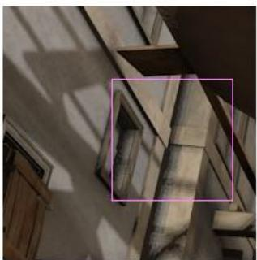
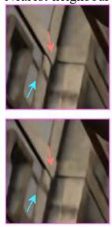
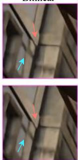
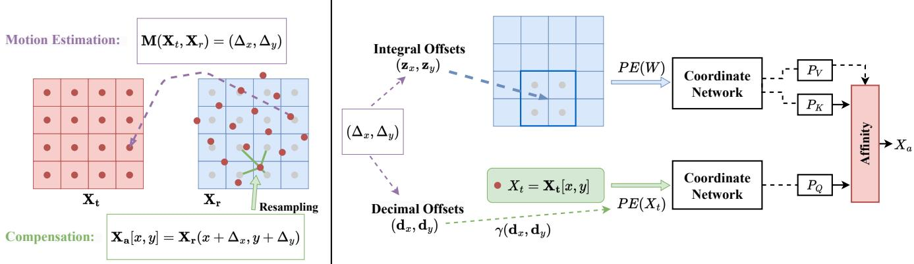
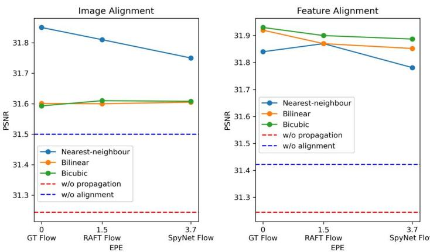
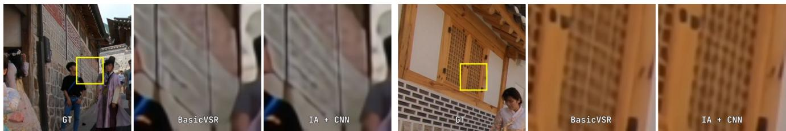
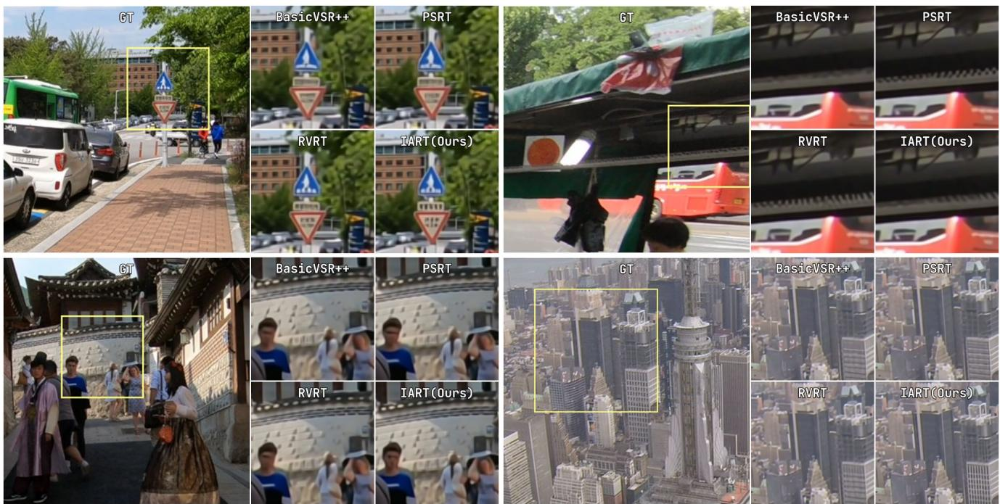
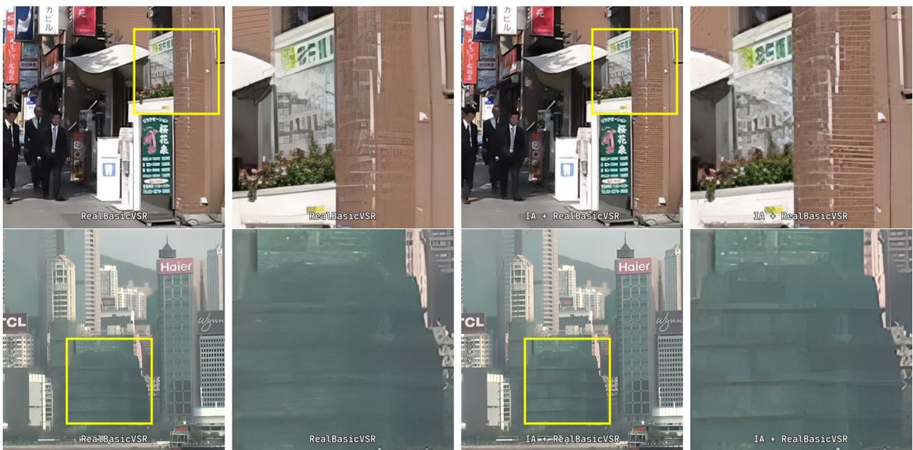

# Enhancing Video Super-Resolution via Implicit Resampling-based Alignment

Kai Xu1 Ziwei Yu1 Xin Wang2 Michael Bi Mi2 Angela Yao1 1National University of Singapore, 2Huawei International Pte Ltd, Singapore

## Abstract

In video super-resolution, it is common to use a framewise alignment to support the propagation of information over time. The role of alignment is well-studied for lowlevel enhancement in video, but existing works overlook a critical step – resampling. We show through extensive experiments that for alignment to be effective, the resampling should preserve the reference frequency spectrum while minimizing spatial distortions. However, most existing works simply use a default choice of bilinear interpolation for resampling even though bilinear interpolation has a smoothing effect and hinders super-resolution. From these observations, we propose an implicit resamplingbased alignment. The sampling positions are encoded by a sinusoidal positional encoding, while the value is estimated with a coordinate network and a window-based cross-attention. We show that bilinear interpolation inherently attenuates high-frequency information while an MLPbased coordinate network can approximate more frequencies. Experiments on synthetic and real-world datasets show that alignment with our proposed implicit resampling enhances the performance of state-of-the-art frameworks with minimal impact on both compute and parameters.

## 1. Introduction

Video super-resolution (VSR) recovers a high spatial resolution sequence of frames from a low-resolution sequence. While image super-resolution can be applied naively to each frame individually, the temporal correlations across the frames give an extra source of information to improve the super-resolved output. As such, the main difference in video versus image super-resolution architectures lies in the use of temporal dependencies. Previous works [2, 9, 26, 28] have shown that spatial alignment is an essential pre-processing step for effective information exchange across the frames. Given the frame-to-frame camera and object motions, alignment provides indications of sub-pixel information which can benefit the super-resolution.

Frame-wise alignment estimates and compensates for motion. Motion estimation determines pixel displacements based on optical flow or additional offset prediction networks [3, 18, 28]. Motion compensation warps the reference to be aligned with the current frame. During compensation, resampling is necessary because the warping may require non-discrete pixel values which are not present in the reference image.

  
GT

Nearest-neighbour  
  
Bicubic

Bilinear  
  
Implicit (Ours)  
Figure 1. Comparisons with super-resolved outcomes employing nearest-neighbor interpolation, bilinear and bicubic resampling. The red arrow highlights smoothing effects for bilinear and bicubic interpolation, while the blue arrow highlights the ragged edge.

Alignment is well-studied in low-level vision [2, 19, 31], but the role of resampling in alignment has been overlooked. In fact, almost all existing works [2, 3, 18, 28] use a default bilinear interpolation due to its simplicity. Yet resampling is a critical step of alignment which should not be overlooked. As Fig. 1 shows, the choice in resampling method can greatly impact the output. Resampling with bilinear and bicubic interpolation preserves the spatial structures of the original image, but tends to smooth out the intensity values. Resampling with nearest-neighbour interpolation gives sharper results, albeit with spatial distortions and ragged edges.

To our knowledge, we are the first to investigate resampling in alignment for super-resolution; we take a deep dive and show the significant impact it can have. The distinctions between resampling methods, particularly their impact on frequency reconstruction for sub-pixel values, become more evident when estimated motion can provide accurate sub-pixel offsets, that is, when the flow algorithms are more precise. As the resampling accuracy is hard to evaluate separately from the motion estimation accuracy, we examine the performance of resampling methods under ideal optical flow conditions using a synthetic dataset. This is the first study to isolate the effect of the resampling strategy with fixed flow in both synthetic and real-world settings. Our findings show that for a resampling method to be effective in alignment, it should avoid quantization in the coordinate transform and refrain from imposing low-pass filtering on the original signal.

Inspired by recent image implicit representations [6, 30], we propose a new alignment module with an implicit resampling. The resampling is achieved through a coordinate network with an local cross-attention module, applied to a feature window based on the motion offset. Rather than explicitly interpolating on the reference frame for the sub-pixel feature value, we aggregate reference values with an affinity matrix based on the feature and positional encoding similarity. Such an aggregation does not impose any smoothness constraints on the resampling process. It also avoids spatial distortions by encoding the sub-pixel coordinate information into the sinusoidal positional encoding. Consequently, our implicit resampling-based alignment module significantly outperforms both the state-of-the-art bilinear resampling-based alignments [3, 17, 18] and the nearestneighbour resampling-based alignment [26].

Our proposed implicit resampling-based alignment once learned, can be applied across diverse alignment scenarios. In comparison, alignment modules in competing methods using deformable convolution [28] and deformable attention [18] must be learned specifically for fixed feature scales and alignment configurations. Our implicit resamplingbased alignment is trained to handle all feature scales and alignment configurations, enhancing generalization and reducing parameter size. We summarize our contribution as follows:

• We highlight the previously overlooked role of resampling in alignment. Our studies show that effective resampling methods should both preserve the frequency spectrum while limiting spatial distortions.

• We propose an implicit resampling-based alignment method, where features and estimated motion are jointly learned through coordinate networks, and alignment is performed implicitly through window-based attention. Our implicit resampling-based alignment, once trained, can generalize to any feature scales and alignment configurations.

• Our proposed implicit resampling-based alignment surpasses current state-of-the-art alignment methods on video super-resolution tasks for both synthetic and realworld datasets, using either CNNs or Transformers as the backbone models.

## 2. Related Work

Image Resampling Aligning the reference frame to the destination frame requires resampling sub-pixel values on the discrete reference image. Nearest-neighbour resampling directly looks up the values of nearest-neighbours; it is simple, but also has choppy distortions. Smoother results can be achieved with bilinear (or bicubic) interpolation, which guarantees an L0- (or higher-order) smoothness on the resulting image intensity surface [7]. While smooth, the results are not edge preserving and as a result, can also be blurry [29]. Recently, implicit representations in the form of neural networks have been proposed for encoding scenes [21] and images [6]. [16] leverage coordinate network as a prior for scene flow regularization. Our method shares the same insight, where we model the entire resampling and alignment process with coordinate networks and cross-attention mechanism.

Video Super-Resolution Video super-resolution recovers a spatially high-resolution sequence from low-resolution frames. Its difference with image super-resolution lies in the use of temporal information. Early methods [8, 11–13] did not consider spatial alignment from frame to frame. Initially, VSR methods applied optical flow-based warping to align the neighbouring image inputs [14, 31]. However, inaccurate flows lead to degradation and more recently, strategies have shifted either to align feature maps instead of images [2] or use the flow to guide deformable convolutions [3, 17, 28] and deformable attention schemes [18]. To increase the robustness toward inaccurate optical flow, [26] propose patch alignment; they align blocks by averaging the motions within predefined grids. We also consider a patch (referred to as a window in our work) context for crossattention. However, our strategy differs as our window is dynamic, i.e. each pixel’s reference window is determined by its optical flow.

Spatial & Temporal Super-resolution Image superresolution aims to provide an up-sampled image from the low-resolution image and serves as the basis for video super-resolution. The recent work [6, 30] proposed to learn a continuous representation from the discrete image with an MLP. Video frame interpolation can be seen as a form of temporal super-resolution. The interpolated frame is aggregated from adjacent frames by alignment and propagation [31]. Recently, [23] proposed softmax splatting based on softmax resampling for interpolating frames in time. In this work, the resampling weights are related to the depth mask and the resampled value is based on relative occlusions. In contrast, our framework encodes sub-pixel information into positional encodings, reconstructing content at a higher frequency for VSR.

  
Figure 2. (a). Motion estimation provides a transformation that maps the reference frame $\mathbf { X } _ { r }$ to the current frame $\mathbf { X } _ { t } .$ Compensation performs resampling on $\mathbf { X } _ { r }$ to obtain the aligned value ${ \mathbf { X } } _ { a } [ x , y ]$ at each pixel location. (b) The estimated motion offsets are decomposed into integral offsets and decimal offsets. The integral offsets are used for window queries and the decimal offsets are used for position encoding for the query pixel $X _ { t }$ . The features along with the positional encodings are modeled with coordinate networks, and the aligned pixel $X _ { a }$ is obtained by a cross-attention mechanism.

## 3. Preliminaries

## 3.1. Spatial Alignment

In video super-resolution, inter-frame propagation enhances information across time. The propagation is facilitated by spatial alignment; the aligned frame gets concatenated with the current frame, and the two are fed together into subsequent network blocks. The alignment can be performed on either input images or intermediate feature maps. We refer to both as frame-wise alignment within a general formulation and denote both images and features simply as some $\mathbf { X } \in \mathbb { R } ^ { H \times W \times C }$ where H, W and C are the height, width and channels, respectively. To focus on the spatial operations in the subsequent discussion, we omit the C dimension and mention it explicitly only where needed.

As shown in Fig. 2a, alignment can be broken down into two steps: (1) motion estimation and (2) motion compensation. Basic implementations of alignment perform these two steps in a one-off manner [2]. More advanced methods make multiple motion estimates and ensemble multiple compensations with convolution, through deformable convolution [3, 28], or with attention mechanisms, through deformable attention [18].

Consider a current frame $\mathbf { X } _ { t }$ indexed by t with spatial coordinates $[ x , y ] ^ { \mathrm { ~ 1 ~ } }$ , and a reference frame $\mathbf { X } _ { r }$ indexed by r. Corresponding points in $\mathbf { X } _ { t }$ and $\mathbf { X } _ { r }$ are related by a motion displacement field $\mathbf { M } \in \mathbb { R } ^ { H \times W \times 2 }$ . Each element $\mathbf { M } [ x , y ] \ = \ ( \Delta _ { x } , \Delta _ { y } )$ represents the displacement of the pixel at coordinate [x, y] in $\mathbf { X } _ { t }$ to its corresponding point in the reference frame $\mathbf { X } _ { r } ,$ , with coordinates in the reference given by $( x + \Delta _ { x } , y + \Delta _ { y } )$ . A simple way to estimate M is by solving for the optical flow between $\mathbf { X } _ { t }$ and ${ \bf X } _ { r }$ . More recent works [3, 18, 28] estimate additional offsets to refine the predicted optical flow.

Based on M, frame-wise alignment estimates $\mathbf { X } _ { a } ~ \in ~ \mathbb { R } ^ { H \times W \times C }$ , which can be regarded as a motioncompensated version of the reference frame ${ \bf X } _ { r }$ :

$$
\mathbf { X } _ { a } = \mathcal { W } ( \mathbf { X } _ { r } , \mathbf { M } ) ,\tag{1}
$$

where $\mathcal { W }$ indicates a warping function that performs the motion compensation. The standard strategy for compensation is through backward warping, where the following estimation is iterated on all spatial locations for $\mathbf { X } _ { a } \mathrm { ; }$

$$
{ \bf X } _ { a } [ x , y ] = { \bf X } _ { r } ( x + \Delta _ { x } , y + \Delta _ { y } ) .\tag{2}
$$

Note that estimating $\mathbf { X } _ { r } ( x + \Delta _ { x } , y + \Delta _ { y } )$ requires a resampling operation on $\mathbf { X } _ { r } , \mathrm { a s } \left( \Delta _ { x } , \Delta _ { y } \right)$ are continuous values.

## 3.2. Spatial Resampling for Alignment

Spatial resampling estimates sub-pixel values on a discrete image or feature grid X. The support of a resampling method indicates the window on X which is required to estimate the value $\mathbf { X } ( a , b )$ for continuous coordinates $( a , b )$ Common methods for spatial resampling interpolate from the support on a heuristic basis. Examples include nearestneighbour, bilinear and bicubic interpolation.

Nearest-neighbour Interpolation The resampled value is taken as the value of $\mathbf { X }$ at the discrete coordinates [x, y] nearest to $( a , b )$ :

$$
\mathbf { X } ( a , b ) _ { \mathfrak { n } \mathfrak { n } } = \mathbf { X } [ x ^ { * } , y ^ { * } ] ,\tag{3}
$$

$$
\operatorname { w h e r e } \left[ x ^ { * } , y ^ { * } \right] = \underset { ( x , y ) } { \operatorname { a r g m i n } } \ : | | ( a , b ) - ( x , y ) | | _ { 2 } .\tag{4}
$$

Bilinear / Bicubic Interpolation estimates the resampled value as a weighted sum of the 4 (bilinear) or 16 (bicubic) discrete neighbours around $( a , b )$ , which we denote in short form as ⌊a, b⌉:

$$
{ \bf X } _ { r } ( a , b ) _ { \mathrm { b i } } = \sum _ { ( x , y ) \in \lfloor a , b \rceil _ { b i } } w _ { x y } \cdot { \bf X } [ x , y ] ,\tag{5}
$$

where $w _ { x y }$ are the associated weighting coefficients based on either a linear (bilinear) or quadratic (bicubic) interpolation of a and b with respect to the neighbouring coordinates2. We refer the reader to Sec. A of the Supplementary for the precise definitions.

Without prior knowledge on how the original discrete image ${ \bf X } _ { r }$ is sampled, most interpolation methods impose smoothness assumptions for resampling. By virtue of assuming linear or quadratic interpolants, bilinear and bicubic interpolation enforce an L0 / L1 smoothness constraint on the underlying image plane. Such constraints are equivalent to applying low-pass filters on the source frame’s intensity or features [33], hence the blurry interpolated results. Notably, nearest-neighbour interpolation does not have any smoothness requirements, and hence does not have a lowpass effect. However, it introduces spatial distortions by shifting the sampled position to the nearest pixel grid.

## 3.3. Analysis on Resampling for Alignment

We examine the frequency response of the nearest and bilinear interpolation methods. Let $f _ { s }$ denote the sampling frequency. The nearest-neighbour interpolator corresponds to a rectangular function in the spatial domain and its Fourier transform is a sinc function given by $F _ { n n } ( f ) = \mathrm { s i n c } ( f / f _ { s } )$ which has a decay rate of $f _ { s } / f$ in the out-of-band region. The bilinear interpolator corresponds to a triangular function in the spatial domain and its Fourier transform is a squared sinc function given by $F _ { b i } ( f ) \ = \ \operatorname { s i n c } ^ { 2 } ( f / f _ { s } )$ which has a decay rate of $( f _ { s } / f ) ^ { 2 }$ in the out-of-band region.

Compared to the nearest-neighbour interpolator, which has a decay rate of $f _ { s } / f$ , the bilinear interpolator with a decay rate of $( f _ { s } / f ) ^ { 2 }$ can suppress more out-of-band aliasing artifacts. This explains why the nearest-neighbour interpolator introduces more artifacts and distortion. However, the bilinear interpolator also causes more smoothing effect on the in-band frequency than the nearest-neighbour interpolator. In the following section, we investigate the use of coordinate networks as function approximators for the ideal interpolator.

## 4. Methodology

## 4.1. Coordinate Network for Implicit Resampling

A coordinate network is a network that uses coordinates as inputs to represent signals. We use a coordinate network as a prior for resampling and encode the prior as trainable weights in an PE-MLP. Such a use of coordinate networks was first explored in neural priors for scene flow regularization [16] though an implicit optimization at runtime.

During training, the coordinate network is jointly optimized with an L2 loss on all alignment instances. Being a universal approximator in theory [10], MLPs can represent any function and frequency. Moreover, we use positional encoding(PE)-MLPs, as they have been shown to have good learning capacity for high frequency content. [21]

Specifically, given the input feature X and its coordinates p, the coordinate network F jointly modelling feature and its position.

$$
\mathbf { R } = F ( \mathbf { X } + \gamma ( \mathbf { p } ) )\tag{6}
$$

where $\gamma ( \mathbf { p } )$ denotes a positional encoding and R is the output feature. The positional encoding $\gamma ( \bar { \mathbf { p } } ) \in \mathbb { R } ^ { 2 }  \mathbb { R } ^ { 4 D }$ is computed by projecting low-dimensional input coordinates p to a 4D dimensional hypersphere.

$$
\begin{array} { r } { \gamma ( \mathbf { p } ) = \left[ [ \sin ( \omega \mathbf { p } ) , \cos ( \omega \mathbf { p } ) ] , \dots , [ \sin ( \omega ^ { D - 1 } \mathbf { p } ) , \cos ( \omega ^ { D - 1 } \mathbf { p } ) ] \right] , } \end{array}\tag{7}
$$

where $\omega$ is the angular speed and D controls the number of frequency bands from $\omega$ to $\omega ^ { D - 1 }$ . A larger D provides higher capacity for encoding higher frequency.

Coordinate networks offer several advantages over conventional alignment methods. First, they can theoretically represent any frequency component of the signal, thus avoiding the low-pass filtering effect. Second, they can serve as a general alignment prior that can be applied to any alignment scenario, regardless of the feature scale or the alignment configuration. In contrast, existing alignment modules are usually tailored for specific feature scales and alignment configurations, which may limit their generalization ability and increase their parameter size.

## 4.2. Alignment with Implicit Resampling

Having obtained the output feature through the coordinate network, we conducting spatial alignment via a crossattention mechanism. Our key insight is that in spatial alignment, the values of the current frame $\mathbf { X } _ { t }$ can also benefit the compensation. In conventional methods, including deformable convolution and deformable attention, the support for the compensation is based only on the values of the reference frame ${ \bf X } _ { r }$ . The values of the current frame $\mathbf { X } _ { t } .$ , beyond estimating the displacement field M, are not used. In contrast, we use as support values from both ${ \bf X } _ { r }$ and $\mathbf { X } _ { t } ,$ which we find can help us improve the alignment accuracy.

To that end, we propose an alignment where the resampling is implicit. Rather than estimate the resampled value with an explicit function, as the examples given in Sec. 3.2, we align with a cross-attention operation between the the corresponding outputs from reference and current frames, where the $\mathbf { X } _ { t }$ serves as query, ${ \bf X } _ { r }$ as key and the values.

## 4.3. Window-based Cross Attention

We define the motion-compensation for coordinate $[ x , y ] \colon$

$$
{ \bf X } _ { a } [ x , y ] = \mathrm { s o f t m a x } \Big ( \frac { { \bf Q } { \bf K } ^ { T } } { \sqrt { C } } \Big ) { \bf V }\tag{8}
$$

where

$$
{ \bf Q } = F _ { q } ( X _ { t } + P _ { t } ) ,\tag{9}
$$

$$
\mathbf { K } = F _ { k } ( \mathbf { W } _ { r } + \mathbf { P } _ { r } ) ,\tag{10}
$$

$$
\mathbf { V } = F _ { v } ( \mathbf { W } _ { r } + \mathbf { P } _ { r } )\tag{11}
$$

are the corresponding output from the coordinate networks; softmax $\left( \frac { \mathbf { Q } \mathbf { K } ^ { \bar { T } } } { \sqrt { C } } \right)$ is the affinity matrix encoding the similarity of pixel $\boldsymbol { X } _ { t } ^ { \prime } \in \mathbb { R } ^ { 1 \times C }$ from the current frame and a window of pixels $\mathbf { W } _ { r } \in \mathbb { R } ^ { w \times w \times C }$ from the reference frame.

The window center is based on the estimated displacement, where w is the chosen window size. Specifically, for $\mathbf { M } ( x , y ) = ( \Delta _ { x } , \Delta _ { y } )$ , we can split it into integer part $\left( \mathbf { z } _ { x } , \mathbf { z } _ { y } \right)$ and decimal part $( \mathbf { d } _ { x } , \mathbf { d } _ { y } )$ :

$$
( \Delta _ { x } , \Delta _ { y } ) = ( { \bf z } _ { x } , { \bf z } _ { y } ) + ( { \bf d } _ { x } , { \bf d } _ { y } ) .\tag{12}
$$

The integer part selects the window of support in ${ \bf X } _ { r }$ , while decimal part is encoded into a positional encoding to estimate the sub-pixel information from the window of support. The sub-pixel information is then used to encode coordinate information for $X _ { t }$ and $X _ { a }$ , as it reflects the relative position between queried pixel and neighbouring pixels.

Integral Offsets as Window Queries The window $\mathbf { W } _ { r }$ is centered on $( x + \mathbf { z } _ { x } , y + \mathbf { z } _ { y } )$ and selects the neighbouring w × w pixels, where

$$
\begin{array} { r } { \mathbf { W } _ { r } [ i , j ] = \mathbf { X } _ { r } [ x + \mathbf { z } _ { x } + i , \mathbf { \nabla } y + \mathbf { z } _ { y } + j ] } \end{array}\tag{13}
$$

$$
\mathbf { P } _ { r } [ i , j ] = \gamma ( [ i , j ] / w )\tag{14}
$$

for all $- \lfloor w / 2 \rfloor \leq i , j \leq w - \lfloor w / 2 \rfloor - 1 .$

For window pixels, the positional encoding is given as a normalized relative position to the window center, hence the scaling by $1 / w$

The window-based attention reduces the computational cost to $O ( w ^ { 2 } \cdot H W )$ from the quadratic cost $O ( H W \cdot H W )$ of the global attention. The choice in window size w is flexible for different motion accuracies. Generally, larger w is more robust to noisy motion estimation while smaller w provides sharper results.

Decimal Offsets as Positional Encoding For the query encoding for pixel [i, j], we have

$$
X _ { t } = \mathbf { X } _ { t } [ x , y ]\tag{15}
$$

$$
P _ { t } = \gamma ( [ \mathbf { d } _ { x } , \mathbf { d } _ { y } ] / 2 w ) ,\tag{16}
$$

where the positional encoding is again normalized with respect to the window center. $\mathbf { A s } \ [ \mathbf { d } _ { x } , \mathbf { d } _ { y } ] / w$ is a decimal, a high angular speed ω is required to represent this information. For

$$
\omega = T ^ { - D } ,\tag{17}
$$

we set $T = 0 . 0 1$ and form a geometric progression from 2π to 100π on the angular speed to represent more precise sub-pixel position information.

## 5. Experiments on Resampling for Alignment

We perform alignment studies under a synthetic dataset with ground truth optical flow, as well as two commonly used optical flows in video super-resolution, namely RAFT [27] and SPyNet [25]. The former is a precise and slow method, while the latter is faster but less accurate.

For the synthetic data, we split the training videos of the clean data track of Sintel [1] into 20 training and 3 testing videos and report the testing results. We generate lowresolution training pairs with bicubic down-sampling of the high-resolution counterparts. As only first-order forward backward optical flow $( t \to t + 1 )$ ground-truth is provided, we perform image alignment from $( t + 1  t )$ and concatenate with original frame before feeding into the superresolution network.

We use a VSR transformer [17] as the super-resolution backbone. We consider the following baselines and alignment strategies: (1) w/o Prop.: An image super-resolution baseline with no propagation. (2) w/o Align.: propagation without alignment. (3) Optical flow warping with nearestneighbour , bilinear and bicubic interpolations. (4) Flow-Guided Deformable Convolution (FGDC) [28]. (5) Flow-Guided Deformable Attention (FGDA) [18] (6) Patch alignment (PA) [26]. (7) Our implicit resampling-based Alignment (IA).

## 5.1. Results Analysis

The Impact of Resampling Fig. 3 compares PSNR values across various alignment methods. Intriguingly, nearestneighbour interpolation outperforms bilinear interpolation for image alignment, while the opposite is true for feature alignment. This observation highlights inherent limitations associated with both interpolation techniques. Specifically, nearest-neighbour introduces distortions, whereas bilinear interpolation techniques introduce smoothing effects. Our conclusion is grounded in two primary observations.

Firstly, for image alignment, the frames have relatively high frequency components as it has not passed through any convolution layers (which themselves act as smoothing filters). As such, any spatial distortions introduced by nearest-neighbour interpolation are outweighed by its ability to preserve high-frequency components.

<table><tr><td rowspan=2 colspan=1>Alignment</td><td rowspan=2 colspan=1>Params(M)</td><td rowspan=2 colspan=1>Resamp.</td><td rowspan=1 colspan=1>GT</td><td rowspan=2 colspan=2>RAFTFlow</td><td rowspan=2 colspan=1>SpyNetFlow</td></tr><tr><td rowspan=1 colspan=1>Flow</td><td rowspan=1 colspan=1>Flc</td></tr><tr><td rowspan=2 colspan=1>OF Warp</td><td rowspan=2 colspan=1>1.35</td><td rowspan=2 colspan=1>nearest.bilinearbicubic</td><td rowspan=2 colspan=1>31.8431.9231.93</td><td rowspan=1 colspan=2>31.87</td><td rowspan=1 colspan=1>7</td></tr><tr><td rowspan=1 colspan=2>31.8731.90</td><td></td></tr><tr><td rowspan=2 colspan=1>FGDC [28]FGDA [18]</td><td rowspan=1 colspan=1>1.60</td><td rowspan=1 colspan=1>bilinear</td><td rowspan=1 colspan=1>32.08</td><td rowspan=1 colspan=2>31.99</td><td rowspan=4 colspan=1>31.9831.9431.8232.05</td></tr><tr><td rowspan=1 colspan=1>1.56</td><td rowspan=1 colspan=1>bilinear</td><td rowspan=1 colspan=1>32.03</td><td rowspan=1 colspan=2>31.91</td></tr><tr><td rowspan=1 colspan=1>PA [26]</td><td rowspan=1 colspan=1>1.35</td><td rowspan=1 colspan=1>nearest.</td><td rowspan=1 colspan=1>31.81</td><td rowspan=1 colspan=2>31.85</td></tr><tr><td rowspan=1 colspan=1>IA (ours)</td><td rowspan=1 colspan=1>1.36</td><td rowspan=1 colspan=1>implicit</td><td rowspan=1 colspan=1>32.14</td><td rowspan=1 colspan=2>32.03</td></tr></table>

Table 1. Comparisons on feature alignment. Implicit Resampling-based Alignment (IA) outperforms all three state-of-the-art alignment methods.  
Figure 3. Comparison of PSNR on alignment utilizing optical flow with different accuracies. Nearest-neighbour interpolation outperform bilinear interpolation for image alignment, while the opposite is true for feature alignment. This observation highlights inherent limitations associated with both interpolation techniques.

Secondly, for feature alignment, there is reduced sensitivity to high-frequency components because the features are likely concentrated in lower frequency spectrums due to the spectral bias of neural networks [5, 24]. Thus the gains from preserving high-frequency are outweighed by the introduced spatial distortions for nearest-neighbour interpolation. In light of these observations, we posit that an optimal resampling method should not impose smoothness constraints to avoid attenuating high-frequency components and mitigate the distortions resulting from coordinate quantization.

Comparison with State-of-the-Art Alignment Methods Given the established effectiveness of feature alignment over image alignment, our comparison focuses solely on state-of-the-art approaches in feature alignment. From Tab. 1, Implicit Resampling-based Alignment (IA) outperforms all three state-of-the-art alignment methods, owing to its capacity to implicitly learn resampling weights. In contrast, FGDC, FGDA, and PA rely on adaptations of bilinear and nearest-neighbour interpolation, introducing either smoothing priors or distortions, contributing to their comparative performance inferiority. FGDA is inferior to FGDC due to the limited training data. As PA is a robust method designed to counter inaccurate optical flow. The synthetic dataset with GT flow is not the ideal case for PA so it doesn’t do well. Regarding parameter size considerations, IA, functioning as a coordinate network, shares parameters across all alignment operations, resulting in a modest parameter increase of 0.01M compared to FGDC (0.25M) and FGDA (0.21M).

## 6. Comparison with State-of-the-Art Methods on Large-Scale Datasets

On standard video SR datasets REDS [22], Vimeo90K [31], Vid4 [20] and UDM10 [32], we incorporate implicit resampling-based alignment into two state-of-the-art networks: a convolutional neural network (CNN) based model (BasicVSR [2]) for first-order VSR, which leverages information from one neighboring frame, and a recurrent Transformer based model (PSRT-recurrent [26]) for secondorder VSR, which utilizes information from two neighboring frames. We denote our models as IA-CNN and IA-RT, respectively. We refer the reader to Sec. B of the Supplementary for exact experimental configurations.

## 6.1. Results Analysis

Table 2 presents a quantitative comparison with state-ofthe-art (SOTA) methods. For CNN-based models, IA-CNN outperforms its baseline BasicVSR with only marginal increase in parameters. For Transformer-based models, IA-RT outperforms its baseline, PSRT-recurrent, by 0.18 on PSNR and 0.0032 on SSIM for REDS4, 0.19 on PSNR and 0.0032 on SSIM for Vid4 for BI degradation. It establish itself as the current state-of-the-art on REDS4 and Vid for BI degradation and UDM10 and Vid4 for BD degradation. Yet our implicit alignment module only introduce 0.2% parameters compare to its baseline [26]. IA-RT is slightly below PSRT and VRT on Vimeo90k, primarily due to challenges in estimating accurate optical flow, limiting the benefits of accurately sampling at a sub-pixel level.

Qualitative Results for IA-CNN and IA-RT Fig. 4 shows qualitative comparisons between BasicVSR and IA-CNN on the REDS4 dataset. Fig. 5 shows qualitative comparisons between BasicVSR++, PSRT, RVRT and IA-RT. The IA-CNN and IA-RT exhibit enhanced ability to propagate high-frequency contents and reconstruct finer patterns compared to other methods. Additional qualitative results can be found in the Sec. C of the Supplementary.

<table><tr><td rowspan="2">Method</td><td rowspan="2">Params</td><td colspan="5">BI degradation</td><td colspan="6">BD degradation</td></tr><tr><td>REDS4[22] PSNR</td><td>PSNR</td><td>Vimeo-90K-T [31]</td><td></td><td>Vid4 [20]</td><td></td><td>UDM10 [32]</td><td></td><td>Vimeo-90K-T [31]</td><td></td><td>Vid4 [20]</td></tr><tr><td></td><td>(M)</td><td>SSIM</td><td></td><td>SSIM</td><td>PSNR</td><td>SSIM</td><td>PSNR</td><td>SSIM</td><td>PSNR</td><td>SSIM</td><td>PSNR</td><td>SSIM</td></tr><tr><td>TOFlow [31]</td><td></td><td>27.98</td><td>0.7990</td><td>33.08 0.9054</td><td>25.89</td><td>0.7651</td><td>36.26</td><td>0.9438 0.9686</td><td>34.62</td><td>0.9212</td><td>25.85</td><td>0.7659</td></tr><tr><td>EDVR [28]</td><td>20.6</td><td>31.09</td><td>0.8800</td><td>37.61 0.9489</td><td></td><td>27.35 0.8264</td><td>39.89</td><td></td><td>37.81</td><td>0.9523</td><td>27.85</td><td>0.8503</td></tr><tr><td>MuCAN [15]</td><td>6.3</td><td>30.88 31.42</td><td>0.8750 0.8909</td><td>37.32 0.9465</td><td></td><td>27.24 0.8251</td><td></td><td>39.96 0.9694</td><td></td><td></td><td></td><td></td></tr><tr><td>BasicVSR [2]</td><td>8.5</td><td></td><td></td><td>37.18 0.9450</td><td></td><td></td><td></td><td></td><td>37.53</td><td>0.9498</td><td>27.96</td><td>0.8553</td></tr><tr><td>IA-CNN (ours)</td><td></td><td>31.68</td><td>0.8959</td><td>37.34 0.9463</td><td></td><td>27.42 0.8315</td><td></td><td></td><td></td><td></td><td></td><td></td></tr><tr><td>BasicVSR++ [3]</td><td>7.3 35.6</td><td>32.39 32.19</td><td>0.9069 0.9006</td><td>37.79 0.9500</td><td></td><td>27.79 0.8400</td><td>40.72</td><td>0.9722</td><td>38.21</td><td>0.9550</td><td>29.04</td><td>0.8753</td></tr><tr><td>VRT [17]</td><td>10.8</td><td>32.75</td><td>0.9113</td><td>38.20 0.9530 0.9527</td><td>27.93</td><td>0.8425 27.99 0.8462</td><td>41.05 40.90</td><td>0.9737 0.9729</td><td>38.72</td><td>0.9584</td><td>29.42</td><td>0.8795</td></tr><tr><td>RVRT [18]</td><td>13.4</td><td>32.72</td><td>0.9106</td><td>38.15</td><td></td><td>28.07 0.8485</td><td></td><td></td><td>38.59</td><td>0.9576</td><td>29.54</td><td>0.8810</td></tr><tr><td>PSRT-recurrent [26]</td><td>13.4</td><td></td><td>0.9138</td><td>38.27 0.9536 38.14 0.9528</td><td></td><td>28.26 0.8517</td><td>41.15</td><td>0.9750</td><td>38.62</td><td>0.9579</td><td></td><td></td></tr><tr><td>IA-RT (ours)</td><td></td><td>32.90</td><td></td><td></td><td></td><td></td><td></td><td></td><td></td><td></td><td>29.68</td><td>0.8884</td></tr></table>

Table 2. Quantitative comparison on REDS4 [22], Vimeo-90K-T [31], UDM10 [32] and Vid4 [20] dataset for 4× Video SR. The first part presents methods with first-order propagation, while the second part presents methods with second-order propagation.  
  
Figure 4. Qualitative comparisons on REDS4 dataset. IA-CNN provides more details on the wall and more uniform patterns on the window.

  
Figure 5. Qualitative comparisons on REDS4 and Vid4. IA-RT provides sharper results and more fine-grained patterns.

Real-World Video SR is a variant of the video SR task where the low-resolution inputs are corrupted with nondeterministic degradation such as blur, noise, and compression artifacts. In the face of such degradation, existing methods often yield excessively smoothed results. Qualitative comparisons in Fig. 6 showcase that, when integrated into RealBasicVSR [4], our implicit alignment method produces results that are more realistic and fine-grained.

## 6.2. Ablation Studies

Positional Encoding Table 3 shows that having positional encoding yields a noteworthy improvement in PSNR by 0.28 compared to the naive window-based cross-attention. When positional encodings are only enabled for window indices, a large drop on PSNR is observed, suggesting the scenario where the estimated motion is quantized to integers will leads to degraded results. When only introducing positional encodings on decimal offsets, the model collapse. This outcome is attributed to the absence of relative positional information for the window features.

  
Figure 6. Qualitative comparison on VideoLQ dataset. Our proposed IA method recovers the brick textures and the wall patterns, which RealBasicVSR does not recover. We highlight the detail regions with yellow boxes.

<table><tr><td>PE on decimal offsets</td><td>PE on window indices</td><td>PSNR</td><td>SSIM</td></tr><tr><td>x</td><td>x</td><td>30.43</td><td>0.8700</td></tr><tr><td>√</td><td>x</td><td>28.71</td><td>0.8184</td></tr><tr><td>x</td><td>√</td><td>30.54</td><td>0.8730</td></tr><tr><td>√</td><td>√</td><td>30.71</td><td>0.8776</td></tr></table>

Table 3. Ablations on positional encodings.
<table><tr><td>Window Size</td><td>2x2</td><td>3x3</td><td>4x4</td></tr><tr><td>GT Flow</td><td>32.06/0.9024</td><td>32.06/0.9021</td><td>32.05/0.9019</td></tr><tr><td>SpyNet Flow</td><td>31.97/0.9004</td><td>31.95/0.9005</td><td>31.96/0.9005</td></tr></table>

Table 4. Ablations on different window sizes for GT flow and SpyNet flow on Sintel dataset.

Window Size The PSNR/SSIM results corresponding to different window sizes for the cross-attention operation are presented in Tab. 4 on Sintel. Larger window sizes result in a more extensive receptive field, but concurrently diminish alignment quality due to increased noise. However, a larger window size proves advantageous, contributing to increased model robustness in the context of Real-World Video Super-Resolution (VSR), where predicting accurate optical flow poses challenges.

## 6.3. FLOPS and Runtime Comparison

Tab. 5 gives he comparison of parameters, FLOPs, and runtimes for IA-RT and other VSR model. We re-estimate the inference time for both PSRT-recurrent on RTX-A5000.

<table><tr><td>Method</td><td>Param. (M)</td><td>FLOPs (T)</td><td>Runtime (ms)</td></tr><tr><td>EDVR [28]</td><td>20.6</td><td>2.95</td><td></td></tr><tr><td>VRT [17]</td><td>35.6</td><td>1.30</td><td></td></tr><tr><td>PSRT-recurrent [26]</td><td>13.4</td><td>1.50</td><td>2020†</td></tr><tr><td>IA-RT (ours)</td><td>13.4</td><td>1.62</td><td>2105</td></tr></table>

Table 5. The comparison of parameters, FLOPs, and runtimes.

## 7. Conclusion

This paper investigates the impact of resampling on alignment for video super-resolution through experiments conducted on a synthetic dataset employing ground-truth optical flow. Our findings underscore the necessity for resampling techniques to preserve the original sharpness of features and avoid distortions for effective alignment. We propose an implicit resampling-based alignment method using coordinate networks and window-based cross-attention, by incorporating estimated motions encoded into positional encoding. Our proposed method exhibits superior performance compared to state-of-the-art alignment techniques on both synthetic and real-world datasets. A drawback of implicit resampling-based alignment is the reduced interpretability, which can be validated through further testing and experiments.

## 8. Acknowledgements

This research is supported by the National Research Foundation, Singapore under its NRF Fellowship for AI (NRF-NRFFAI1-2019-0001). Any opinions, findings and conclusions or recommendations expressed in this material are those of the author(s) and do not reflect the views of National Research Foundation, Singapore.

## References

[1] Daniel J Butler, Jonas Wulff, Garrett B Stanley, and Michael J Black. A naturalistic open source movie for optical flow evaluation. In Computer Vision–ECCV 2012: 12th European Conference on Computer Vision, Florence, Italy, October 7-13, 2012, Proceedings, Part VI 12, pages 611– 625. Springer, 2012. 5

[2] Kelvin CK Chan, Xintao Wang, Ke Yu, Chao Dong, and Chen Change Loy. Basicvsr: The search for essential components in video super-resolution and beyond. In Proceedings of the IEEE/CVF Conference on Computer Vision and Pattern Recognition, pages 4947–4956, 2021. 1, 2, 3, 6, 7

[3] Kelvin CK Chan, Shangchen Zhou, Xiangyu Xu, and Chen Change Loy. Basicvsr++: Improving video superresolution with enhanced propagation and alignment. In Proceedings of the IEEE/CVF conference on computer vision and pattern recognition, pages 5972–5981, 2022. 1, 2, 3, 7

[4] Kelvin CK Chan, Shangchen Zhou, Xiangyu Xu, and Chen Change Loy. Investigating tradeoffs in real-world video super-resolution. In Proceedings of the IEEE/CVF Conference on Computer Vision and Pattern Recognition, pages 5962–5971, 2022. 7

[5] Yuanqi Chen, Ge Li, Cece Jin, Shan Liu, and Thomas Li. Ssd-gan: measuring the realness in the spatial and spectral domains. In Proceedings of the AAAI Conference on Artificial Intelligence, pages 1105–1112, 2021. 6

[6] Yinbo Chen, Sifei Liu, and Xiaolong Wang. Learning continuous image representation with local implicit image function. In Proceedings of the IEEE/CVF conference on computer vision and pattern recognition, pages 8628–8638, 2021. 2

[7] Neil Anthony Dodgson. Image resampling. Technical report, University of Cambridge, Computer Laboratory, 1992. 2

[8] Dario Fuoli, Shuhang Gu, and Radu Timofte. Efficient video super-resolution through recurrent latent space propagation. In 2019 IEEE/CVF International Conference on Computer Vision Workshop (ICCVW), pages 3476–3485. IEEE, 2019. 2

[9] Muhammad Haris, Gregory Shakhnarovich, and Norimichi Ukita. Recurrent back-projection network for video superresolution. In Proceedings of the IEEE/CVF conference on computer vision and pattern recognition, pages 3897–3906, 2019. 1

[10] Kurt Hornik, Maxwell Stinchcombe, and Halbert White. Multilayer feedforward networks are universal approximators. Neural networks, 2(5):359–366, 1989. 4

[11] Yan Huang, Wei Wang, and Liang Wang. Video superresolution via bidirectional recurrent convolutional networks. IEEE transactions on pattern analysis and machine intelligence, 40(4):1015–1028, 2017. 2

[12] Takashi Isobe, Xu Jia, Shuhang Gu, Songjiang Li, Shengjin Wang, and Qi Tian. Video super-resolution with recurrent structure-detail network. In Computer Vision–ECCV 2020: 16th European Conference, Glasgow, UK, August 23–28, 2020, Proceedings, Part XII 16, pages 645–660. Springer, 2020.

[13] Takashi Isobe, Fang Zhu, Xu Jia, and Shengjin Wang. Revisiting temporal modeling for video super-resolution. arXiv preprint arXiv:2008.05765, 2020. 2

[14] Tae Hyun Kim, Mehdi SM Sajjadi, Michael Hirsch, and Bernhard Scholkopf. Spatio-temporal transformer network for video restoration. In Proceedings of the European Conference on Computer Vision (ECCV), pages 106–122, 2018. 2

[15] Wenbo Li, Xin Tao, Taian Guo, Lu Qi, Jiangbo Lu, and Jiaya Jia. Mucan: Multi-correspondence aggregation network for video super-resolution. In Computer Vision–ECCV 2020: 16th European Conference, Glasgow, UK, August 23– 28, 2020, Proceedings, Part X 16, pages 335–351. Springer, 2020. 7

[16] Xueqian Li, Jhony Kaesemodel Pontes, and Simon Lucey. Neural scene flow prior. Advances in Neural Information Processing Systems, 34:7838–7851, 2021. 2, 4

[17] Jingyun Liang, Jiezhang Cao, Yuchen Fan, Kai Zhang, Rakesh Ranjan, Yawei Li, Radu Timofte, and Luc Van Gool. Vrt: A video restoration transformer. arXiv preprint arXiv:2201.12288, 2022. 2, 5, 7, 8

[18] Jingyun Liang, Yuchen Fan, Xiaoyu Xiang, Rakesh Ranjan, Eddy Ilg, Simon Green, Jiezhang Cao, Kai Zhang, Radu Timofte, and Luc Van Gool. Recurrent video restoration transformer with guided deformable attention. arXiv preprint arXiv:2206.02146, 2022. 1, 2, 3, 5, 6, 7

[19] Jing Lin, Xiaowan Hu, Yuanhao Cai, Haoqian Wang, Youliang Yan, Xueyi Zou, Yulun Zhang, and Luc Van Gool. Unsupervised flow-aligned sequence-to-sequence learning for video restoration. In International Conference on Machine Learning, pages 13394–13404. PMLR, 2022. 1

[20] Ce Liu and Deqing Sun. On bayesian adaptive video super resolution. IEEE transactions on pattern analysis and machine intelligence, 36(2):346–360, 2013. 6, 7

[21] Ben Mildenhall, Pratul P Srinivasan, Matthew Tancik, Jonathan T Barron, Ravi Ramamoorthi, and Ren Ng. Nerf: Representing scenes as neural radiance fields for view synthesis. Communications ofthe ACM, 65(1):99–106, 2021. 2, 4

[22] Seungjun Nah, Sungyong Baik, Seokil Hong, Gyeongsik Moon, Sanghyun Son, Radu Timofte, and Kyoung Mu Lee. Ntire 2019 challenge on video deblurring and superresolution: Dataset and study. In Proceedings of the IEEE/CVF Conference on Computer Vision and Pattern Recognition Workshops, pages 0–0, 2019. 6, 7

[23] Simon Niklaus and Feng Liu. Softmax splatting for video frame interpolation. In 2020 IEEE/CVF Conference on Computer Vision and Pattern Recognition, CVPR 2020, Seattle, WA, USA, June 13-19, 2020, pages 5436–5445. Computer Vision Foundation / IEEE, 2020. 2

[24] Nasim Rahaman, Aristide Baratin, Devansh Arpit, Felix Draxler, Min Lin, Fred Hamprecht, Yoshua Bengio, and Aaron Courville. On the spectral bias of neural networks. In International Conference on Machine Learning, pages 5301–5310. PMLR, 2019. 6

[25] Anurag Ranjan and Michael J Black. Optical flow estimation using a spatial pyramid network. In Proceedings of the

IEEE conference on computer vision and pattern recognition, pages 4161–4170, 2017. 5

[26] Shuwei Shi, Jinjin Gu, Liangbin Xie, Xintao Wang, Yujiu Yang, and Chao Dong. Rethinking alignment in video superresolution transformers. arXiv preprint arXiv:2207.08494, 2022. 1, 2, 5, 6, 7, 8

[27] Zachary Teed and Jia Deng. Raft: Recurrent all-pairs field transforms for optical flow. In Computer Vision–ECCV 2020: 16th European Conference, Glasgow, UK, August 23– 28, 2020, Proceedings, Part II 16, pages 402–419. Springer, 2020. 5

[28] Xintao Wang, Kelvin CK Chan, Ke Yu, Chao Dong, and Chen Change Loy. Edvr: Video restoration with enhanced deformable convolutional networks. In Proceedings of the IEEE/CVF Conference on Computer Vision and Pattern Recognition Workshops, pages 0–0, 2019. 1, 2, 3, 5, 6, 7, 8

[29] G Wolberg. Digital image warping: Ieee computer society, 1990. 2

[30] Xingqian Xu, Zhangyang Wang, and Humphrey Shi. Ultrasr: Spatial encoding is a missing key for implicit image function-based arbitrary-scale super-resolution. arXiv preprint arXiv:2103.12716, 2021. 2

[31] Tianfan Xue, Baian Chen, Jiajun Wu, Donglai Wei, and William T Freeman. Video enhancement with task-oriented flow. International Journal of Computer Vision, 127:1106– 1125, 2019. 1, 2, 6, 7

[32] Peng Yi, Zhongyuan Wang, Kui Jiang, Junjun Jiang, and Jiayi Ma. Progressive fusion video super-resolution network via exploiting non-local spatio-temporal correlations. In IEEE International Conference on Computer Vision (ICCV), pages 3106–3115, 2019. 6, 7

[33] Abdou Youssef. Analysis and comparison of various image downsampling and upsampling methods. In Proceedings DCC’98 Data Compression Conference (Cat. No. 98TB100225), page 583. IEEE, 1998. 4