# EventEgo3D: 3D Human Motion Capture from Egocentric Event Streams

Christen Millerdurai1,2 Hiroyasu Akada1 Jian Wang1 Diogo Luvizon1 Christian Theobalt1 Vladislav Golyanik1 1MPI for Informatics, SIC 2Saarland University, SIC

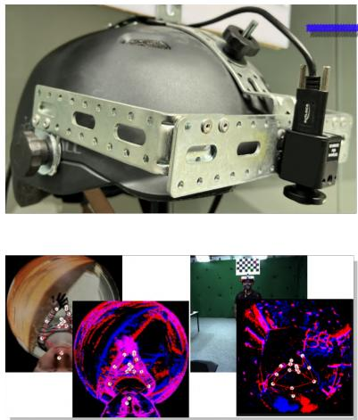  
(a) EE3D HMD and Datasets

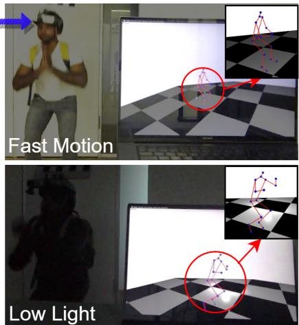  
(b) Real-time Demo

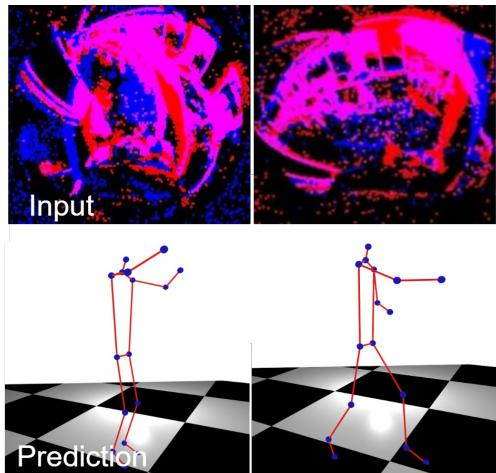  
(c) 3D Human Pose Estimation  
Figure 1. EventEgo3D is the first approach for real-time 3D human pose estimation from egocentric event streams: (a) A photograph of our new head-mounted device (HDM) with a custom-designed egocentric fisheye event camera (top) and visualisations of our synthetically rendered dataset and a real dataset recorded with the HDM (bottom); (b) Real-time demo achieving the pose update rate of 140Hz; (c) Visualisation of real event streams (top) and the corresponding 3D human poses from a third person perspective estimated by our approach.

## Abstract

Monocular egocentric 3D human motion capture is a challenging and actively researched problem. Existing methods use synchronously operating visual sensors (e.g. RGB cameras) and often fail under low lighting and fast motions, which can be restricting in many applications involving head-mounted devices. In response to the existing limitations, this paper 1) introduces a new problem, i.e. 3D human motion capture from an egocentric monocular event camera with a fisheye lens, and 2) proposes the first approach to it called EventEgo3D (EE3D). Event streams have high temporal resolution and provide reliable cues for 3D human motion capture under high-speed human motions and rapidly changing illumination. The proposed EE3D framework is specifically tailored for learning with event streams in the LNES representation, enabling high 3D reconstruction accuracy. We also design a prototype of a mobile head-mounted device with an event camera and record a real dataset with event observations and

the ground-truth 3D human poses (in addition to the synthetic dataset). Our EE3D demonstrates robustness and superior 3D accuracy compared to existing solutions across various challenging experiments while supporting real-time 3D pose update rates of 140Hz.1

## 1. Introduction

Head-mounted devices (HMD) have a high potential to become the next mobile and pervasive computing platform in human society that could enable many applications in education, driving or personal assistance systems, gaming, and many others. HMDs enable increased flexibility and allow users to move freely and explore the environments they live and work in. Consequently, egocentric 3D human pose estimation became an active research field during the last few years, with several works focusing on recovering 3D human poses from down-facing fisheye RGB cameras installed on an HMD [1, 14, 15, 25, 31–34, 37, 43].

Existing ego-centric setups have been predominantly demonstrated in the literature with monocular RGB cameras with a fisheye lens. While these experimental prototypes showed high 3D human pose estimation accuracy under certain assumptions, monocular RGB cameras on HMDs have multiple fundamental disadvantages: They are prone to over- or under-exposure and motion blur in the presence of high-speed human motions; consume comparably much power for a mobile device; moreover, they record the image frames synchronously and require constantly high data processing throughput. Hence, our work is motivated by the observation that multiple disadvantages of RGB-based HMDs can be alleviated with a different type of visual sensor, i.e. event cameras. Event cameras record streams of events, i.e. asynchronous per-pixel brightness changes at high (µs) temporal resolution. They also support an increased dynamic range and consume less power (on the order of tens of mW) than average RGB cameras (consuming Watts) [6]. Also, no events are triggered if there are no changes in the scene (apart from noisy signals).

Note that existing RGB-based (especially learningbased) techniques cannot be re-purposed for event streams in a straightforward way; new, dedicated approaches are required to unveil all the advantages of event cameras. We are thus inspired by the recent progress in event-based 3D reconstruction in different scenarios [8, 27, 36, 44]. However, an egocentric HMD setup utilising an event camera with a fisheye lens has not been previously addressed in the literature. This configuration introduces additional challenges, including the need for lightweight design to accommodate high-speed human motions (real-time processing) and the significant amount of background events generated by the moving event camera.

This paper addresses the challenges associated with the design of such an HMD with a monocular egocentric event camera with a fisheye lens; see Fig. 1 for an overview. We introduce a prototypical design of a compact HMD that can be worn by a human and used under fast motions, with the processing happening on a laptop carried in a backpack (Fig. 1-(a) on top). We then propose a lightweight neural network architecture operating on a suitable event stream representation (LNES [27]) for real-time performance. Our method, EventEgo3D or EE3D for short, encodes the incoming events in the compact representation and decodes 2D heatmaps of the observed human joint locations. Afterwards, the lifting block regresses the 3D human poses. We also propose a residual event propagation module specifically designed for the egocentric monocular setting that highlights the wearer’s human amongst the background events and provides reliable predictions even in the lack of events due to the absence of human motion.

Due to the lack of event datasets in the egocentric setting, we build a large-scale synthetic dataset for training our approach. Moreover, we record a real dataset with 3D ground-truth human poses and 2D event stream observations with our real HMD (Fig. 1-(a)). The proposed realworld dataset allows for fine-tuning methods trained on the synthetic dataset and boosting the accuracy of the egocentric event-based pose estimation in real-world scenarios.

In summary, this paper defines a new problem, i.e. 3D human pose estimation from a monocular egocentric event camera, and makes the following technical contributions:

• EE3D, the first end-to-end trainable neural approach for 3D human motion capture from an egocentric event camera with a fisheye lens installed on a mobile headmounted device;

• Lightweight Residual Event Propagation Module and Egocentric Pose Module tailored for real-time 3D human motion capture (pose update rate of 140Hz) from egocentric event streams with high 3D reconstruction accuracy.

• The design of a compact head-mounted device with an egocentric event camera along with real and synthetic datasets for neural network training and evaluation.

Our experiments demonstrate higher 3D reconstruction accuracy of EE3D in challenging scenarios with high-speed human motions from egocentric monocular event streams compared to existing (closely related) methods. The significance of each proposed module is evaluated and confirmed in an ablative study.

## 2. Related Work

We next review related methods for egocentric 3D human pose estimation and event-based 3D reconstruction.

## 2.1. Egocentric 3D Human Pose Estimation

3D human pose estimation from egocentric monocular or stereo RGB views has been actively studied during the last decade. While the earliest approaches were optimisationbased [25], the field promptly adopted neural architectures following the state of the art in human pose estimation. Thus, follow-up methods used a two-stream CNN architecture [37] and auto-encoders for monocular [30, 31] and stereo inputs [1, 43]. Another work focused on the automatic calibration of fisheye cameras widely used in the egocentric setting [42]. Recent papers leverage human motion priors and temporal constraints for predictions in the global coordinate frame [32]; reinforcement learning for improved physical plausibility of the estimated motions [17, 39]; semi-supervised GAN-based human pose enhancement with external views [33] and depth estimation [34]; and scene-conditioned denoising diffusion probabilistic models [41]. Khirodkar et al. [10] address a slightly different setting and use a multi-stream transformer to capture multiple humans in front-facing egocentric views.

All these works demonstrated promising results and pushed the field forward. They, however, were designed for synchronously operating RGB cameras and, hence—as every RGB-based method—suffer from inherent limitations of these sensors (detailed in Sec. 1). Thus, only a few of them support real-time framerates [30, 37]. Moreover, it is unreasonable to expect that RGB-based approaches can be easily adapted for event streams. In contrast, we propose an approach that (for the first time) accounts for the new data type in the context of egocentric 3D vision (events) and estimates 3D human poses at high 3D pose update rates.

Last but not least, none of the existing datasets for the training and evaluation of egocentric 3D human pose estimation techniques and related problems [10, 20, 25, 30, 32, 34, 37, 40] provide event streams or frames at framerate sufficient to generate events with event steam simulators [23]. To evaluate and train our EE3D approach, we synthesise and record the necessary datasets (i.e. synthetic, real and background augmentation) required to investigate event-based 3D human pose estimation on HMDs.

## 2.2. Event-based Methods for 3D Reconstruction

Substantial discrepancy between RGB frames and asynchronous events has recently led to the emergence of dedicated event-based or hybrid 3D techniques for humans [4, 36, 44], hands [27, 38] and general objects [19, 28, 35].

Nehvi et al. [19] track non-rigid 3D objects (polygonal meshes or parametric 3D models) with a differentiable event stream simulator. Rudnev et al. [27] synthesise a dataset with human hands to train a neural 3D hand pose tracker with a Kalman filter. They introduce a lightweight LNES representation of events for learning as an improvement upon event frames. Next, Xue et al. [38] optimise the parameters of a 3D hand model by associating events with mesh faces using the expectation-maximisation framework assuming that events are predominantly triggered by hand contours. Some works [36, 44] use RGB frames along with the event streams, and some represent events as spatialtemporal points in space and encode them either as point clouds [4, 18]. Consequently, most of these approaches are slow (due to different reasons such as iterative optimisation or computationally expensive operations on 3D point clouds), with the notable exception of EventHands [27] achieving up to 1kHz hand pose update rates.

We use LNES [27] as it is independent of the input event count, facilitates real-time inference and can be efficiently processed with neural components (e.g. CNN layers). In contrast to all approaches discussed above, our method is specifically designed for the egocentric setting and achieves the highest accuracy level among all compared methods. This is achieved by incorporating a novel residual mechanism that propagates events (event history) from the previous frame to the current one, prioritizing events triggered around the human. This is also helpful when only a few events are triggered due to the lack of motion.

## 3. The EgoEvents3D Approach

Our EE3D approach estimates 3D poses from an egocentric monocular event camera with a fisheye lens. We first explain the event camera model in Sec. 3.1 and then describe the proposed framework in Sec. 3.2.

## 3.1. Event Camera Preliminaries

Event cameras obey the pinhole camera model and capture event streams, i.e., a 1D temporal sequence that contains discrete packets of asynchronous events that indicate the brightness change of each pixel of the sensor. In our case, we use a fisheye lens and the Scaramuzza projection model [29] for it, introducing a wider field of view required for our HMD. An event is a tuple of the form $\boldsymbol { e } _ { i } ~ = ~ \left( x _ { i } , y _ { i } , t _ { i } , p _ { i } \right)$ with the i-th index representing the event fired at pixel location $( x _ { i } , y _ { i } )$ with its corresponding timestamp $t _ { i }$ and a polarity $p _ { i } \in \{ - 1 , 1 \}$ . The timestamps $t _ { i }$ of modern event cameras have µs temporal resolution. The event is generated when the change in logarithmic brightness L at the pixel location $( x _ { i } , y _ { i } )$ exceeds a predefined threshold C, i.e. $| \mathbb { L } ( x _ { i } , y _ { i } , t _ { i } ) - \mathbb { L } ( x _ { i } , y _ { i } , t _ { i } - t _ { p } ) | \ge C ,$ where $t _ { p }$ represents the previous triggering time at the same pixel location. $p = - 1$ indicated that the brightness has decreased by $C ;$ otherwise, it has increased if $p = 1$

Modern neural 3D computer vision architectures [8, 12, 27] require event streams to be converted to a regular representation, usually 2D or 3D. To this end, we adopt the locally normalised event surfaces (LNES) [27] that aggregate the event tuples into a compact 2D representation as a function of time windows. A time window of size $T$ is constructed by collecting all events between the first event $e _ { 0 }$ (relative to the given time window) and $e _ { k }$ , where $t _ { k } - t _ { 0 } \leq T$ . The events from the time window are stored in the 2D LNES frame $\mathbf { L } \in \mathbb { R } ^ { H \times W \times 2 }$ . The LNES frame is updated by $\begin{array} { r } { L ( x _ { i } , y _ { i } , p _ { i } ) = \frac { t _ { i } - t _ { 0 } } { T } } \end{array}$ , with $i \in \{ 1 , \ldots , k \}$ , and where each event triggered at pixel location $( x , y )$ updates the corresponding pixel location of the LNES frame.

## 3.2. Architecture of EgoEvents3D

Our approach takes N consecutive LNES frames $\mathbf { B } = \{ \bar { \mathbf { L } _ { 1 } } , \dotsc , \mathbf { L } _ { N } \} , \mathbf { L } _ { q } \in \mathbb { R } ^ { 1 9 2 \times 2 5 6 \times 2 }$ as input and regresses the 3D human body poses per each LNES denoted ${ \mathfrak { y } } \ \mathbf { O } = \{ \hat { \mathbf { J } } _ { 1 } , \dots , \hat { \mathbf { J } } _ { N } \} , \ \hat { \mathbf { J } } _ { q } \in \mathbb { R } ^ { 1 6 \times 3 } ; \ q \ \in \ \{ 1 , \dots , N \} . \ \hat { \mathbf { J } } _ { q }$ include the joints of the head, neck, shoulders, elbows, wrists, hips, knees, ankles, and feet.

The proposed framework includes two modules; see Fig. 2. First, the Egocentric Pose Module (EPM) estimates the 3D coordinates of human body joints. Subsequently, the Residual Event Propagation Module (REPM) propagates events from the previous to the current LNES frame. The REPM module allows the framework 1) to focus more on the events triggered around the human (than those of the background) and 2) to retain the 3D human pose when only a few events are generated due to the absence of motions.

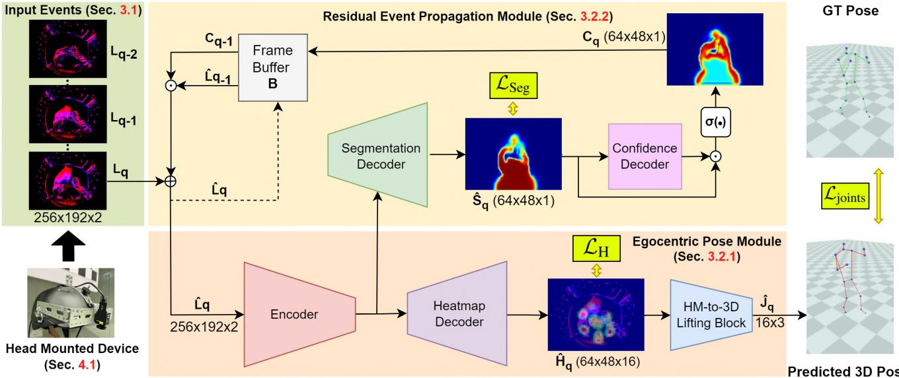  
Figure 2. Overview of our EventEgo3D approach. The HMD captures an egocentric event stream converted to a series of 2D LNES frames [27], from which our neural architecture regresses the 3D poses of the HMD user. The residual event propagation module (REPM) emphasises events triggered around the human by considering the temporal context of observations (realised with a frame buffer with event decay based on event confidence). REPM, hence, helps the encoder-decoder (from LNES to heatmaps) and the heatmap lifting module to estimate accurate 3D human poses. The method is supervised with ground-truth segmentations, heatmaps and 3D human poses.

## 3.2.1 Egocentric Pose Module (EPM)

We regress 3D joints from the input $\mathbf { L } _ { q }$ in two steps: 1) 2D joint heatmap estimation and 2) the heatmap-to-3D lifting. 2D joint heatmap estimation. To estimate the 2D joint heatmaps, we develop a U-Net-based architecture [26]. Here, we utilize the Blaze blocks [2] as layers of the encoder and decoder to achieve real-time performance. The encoder consists of six layers, and the decoder, which is the heatmap decoder, comprises four layers. Please see our supplementary material for more details. We use $\mathbf { L } _ { q }$ to estimate 2D heatmaps of 16 body joints $\hat { \mathbf { H } } _ { q } \in \mathbb { R } ^ { 4 8 \times 6 4 \times \bar { 1 6 } }$ . The final estimated heatmaps are derived by averaging the intermediate heatmaps. The network at this stage is supervised using the mean square error (MSE) between the ground-truth heatmaps and the predicted ones:

$$
\mathcal { L } _ { \mathrm { H } } = \frac { 1 } { M _ { J } } \sum _ { b = 1 } ^ { M _ { J } } \lVert \hat { \mathbf { H } } _ { q , b } - \mathbf { H } _ { q , b } \rVert ^ { 2 } ,\tag{1}
$$

where $\hat { \mathbf { H } } _ { q , b }$ and $\mathbf { H } _ { q , b }$ are the predicted and ground-truth heatmaps of the b-th joint; $M _ { J }$ is the number of body joints. Heatmap-to-3D Lifting Module. Following previous works [22, 30], the Heatmap-to-3D (HM-to-3D) Lifting module takes the estimated heatmaps as input and outputs the 3D joints $\hat { \mathbf { J } } _ { \mathbf { q } } \in \mathbb { R } ^ { 1 6 \times 3 }$ . The HM-to-3D is a six-layer network containing convolutional blocks and two dense blocks. The HM-to-3D lifting module is supervised using MSE between the ground-truth device-centric joint coordinates and the predicted ones at the frame index q:

$$
\mathcal { L } _ { \mathrm { j o i n t s } } = \frac { 1 } { M _ { J } } \sum _ { r = 1 } ^ { M _ { J } } \lVert \hat { { \mathbf { J } } } _ { q , r } - { \mathbf { J } } _ { q , r } \rVert ^ { 2 } ,\tag{2}
$$

where $M _ { J }$ is the number of body joints, and $\hat { \mathbf { J } } _ { r }$ and $\mathbf { J } _ { r }$ are the predicted and ground-truth r-th joints, respectively.

## 3.2.2 Residual Event Propagation Module (REPM)

In contrast to stationary camera setups, egocentric cameras mounted on HMDs undergo significant movements. In the case of our mobile device, motion results in a comparably high number of events generated by the background. Hence, our approach has to be robust to the background events: We introduce the Residual Event Propagation Module (REPM) that allows the network to focus on the events generated by the subject wearing the HMD as well as rely on the information from previous frames when few events are observed, $i . e .$ , when the movement of the human body is small. REPM comprises the segmentation decoder, the confidence decoder, and the frame buffer B. The segmentation decoder first estimates the human body mask. Then, the confidence decoder produces feature maps that act on the human body mask to produce confidence maps that indicate regions of the egocentric view to place more importance on. Lastly, the Frame Buffer B stores the past input frame and its corresponding confidence map, providing weighting to important regions of the current frame (see the top part of Fig. 2).

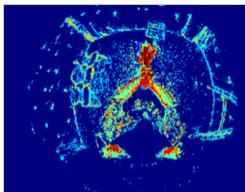  
(a) Lq-1

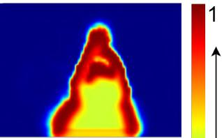

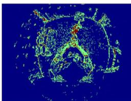  
(c) Lq

(b) Cq-1  
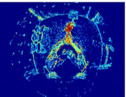  
(d) £q  
Figure 3. The frame buffer holds previous input frame $\hat { \mathbf { L } } _ { q - 1 }$ (a) and previous confident map $\mathbf { C } _ { q - 1 } \left( \mathbf { b } \right)$ ). The $\hat { \bf L } _ { q - 1 }$ is weighted with $\mathbf { C } _ { q - 1 }$ and added to the current LNES frame $\mathbf { L } _ { q }$ (c) to produce $\hat { \mathbf { L } } _ { q }$ (d). We can observe that the events generated by the human are highlighted more compared to the background events thereby prioritising events generated by the human.

Segmentation Decoder. The segmentation decoder estimates the human body mask $\hat { \mathbf { S } } _ { q } \in \mathbb { R } ^ { 4 8 \times 6 4 \times 1 }$ of the HMD user in the egocentric LNES views. The architectures of this module and the heatmap decoder are the same except for the final layer that outputs human body masks.

We use the feature maps from multiple levels of the encoder as the input to the segmentation decoder. The segmentation decoder is supervised by cross-entropy loss:

$$
\mathcal { L } _ { \mathrm { s e g } } = - \mathbf { S } _ { q } \log ( \hat { \mathbf { S } } _ { q } ) + ( 1 - \mathbf { S } _ { q } ) \log ( 1 - \hat { \mathbf { S } } _ { q } ) ,\tag{3}
$$

where $\hat { \mathbf { S } } _ { q }$ and $\mathbf { S } _ { q }$ are the predicted and ground-truth segmentation masks, respectively.

Confidence Decoder. The confidence decoder is a four layer convolution network that takes the human body mask $\hat { \mathbf { S } } _ { q } ^ { - }$ as input and produces a feature map $\mathbf { S } _ { \mathbf { F } q } \in \mathbb { R } ^ { 4 \mathbf { \bar { 8 } } \times 6 4 \times 1 }$ that, in turn, is used in combination with $\hat { \mathbf { S } } _ { q }$ to produce the confidence map $\mathbf { C } _ { q } \in \mathbb { R } ^ { 4 8 \times 6 4 \times 1 }$

$$
\mathbf { C } _ { q } = \mathrm { s i g m o i d } ( \hat { \mathbf { S } } _ { q } \odot \mathbf { S } _ { \mathbf { F } { q } } )\tag{4}
$$

where “sigmoid(·)” is a sigmoid operation and $\ " { ‰}$ is an element-wise multiplication.

Frame Buffer. The frame buffer B stores the confidence map $\mathbf { C } _ { q - 1 } \in \mathbb { R } ^ { 4 8 \times 6 4 \times 1 }$ and input frame $\hat { \mathbf { L } } _ { q - 1 } \in$ R192×256×2 of the previous LNES frame. Note that we initialize the frame buffer with zeros at the first frame. To compute the current input frame $\hat { \mathbf { L } } _ { q } ^ { \phantom { \dagger } } .$ , we retrieve $\mathbf { C } _ { q - 1 }$ and $\hat { \mathbf { L } } _ { q - 1 }$ using the following expression:

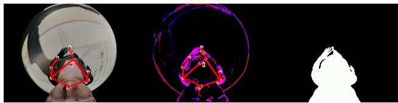  
Figure 4. Sample from EE3D-S with synthetic RGB image (left), generated event stream (middle), and human body mask (right).

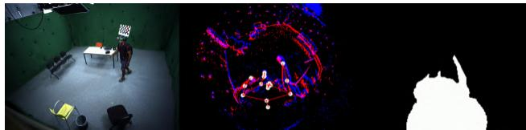  
Figure 5. Sample from EE3D-R with motion tracking setup (left) used for obtaining the ground truth 3D poses, event stream (middle), and human body mask (right).

$$
\hat { \mathbf { L } } _ { q } = \hat { \mathbf { L } } _ { q - 1 } \odot \mathbf { C } _ { q - 1 } \oplus \mathbf { L } _ { q }\tag{5}
$$

where $\mathbf { L } _ { q }$ denotes the LNES frame at the current time, $\ " { \odot } \ '$ represents an element-wise multiplication, and “⊕” represents an element-wise addition. We normalize the values of $\hat { \mathbf { L } } _ { q }$ to the range of [−1, 1]. Note, $\mathbf { C } _ { q - 1 }$ is resized to 192 × 256 before applying Eqn. (5). See Fig. 3 for an exemplary visualization of the components used in Eqn. (5).

## 3.2.3 Loss Terms and Supervision

Our method is supervised by the heatmap loss $\mathcal { L } _ { \mathrm { H } } .$ , the segmentation loss $\mathcal { L } _ { \mathrm { s e g } }$ and the joint loss $\mathcal { L } _ { \mathrm { j o i n t s } }$

Overall, our total loss functions are as follows:

$$
\mathcal { L } = \lambda _ { \mathrm { j o i n t s } } \mathcal { L } _ { \mathrm { j o i n t s } } + \lambda _ { \mathrm { H } } \mathcal { L } _ { \mathrm { H } } + \lambda _ { \mathrm { s e g } } \mathcal { L } _ { \mathrm { s e g } } ,\tag{6}
$$

where we set the weight of each loss as $\lambda _ { \mathrm { j o i n t s } } { = } 0 . 0 1$ $\lambda _ { \mathrm { H } } { = } 1 0 , \lambda _ { \mathrm { s e g } } { = } 1$

## 4. Our Egocentric Setup and Datasets

We develop a portable head-mounted device (HMD) (Fig. 1-(a)) and capture a real dataset with it.

## 4.1. Head Mounted Device

Our HMD is a prototypical device consisting of a bicycle helmet with a DVXplorer Mini [5] event camera attached to the helmet 3.5cm away from the user’s head; the strap allows a firm attachment on the head. We use a fisheye lens Lensagon BF10M14522S118C [13] with a field of view of 190◦. The total weight of the device is ≈0.42kg. The device is used with a laptop in a backpack for external power supply and real-time on-device computing. The compact design and the flexibility of our HMD allow users to freely move their heads and perform rapid human motions.

## 4.2. EE3D Datasets

We propose two datasets for method training and evaluation: 1) EE3D-S, the large-scale synthetic dataset (used for pre-training), and 2) EE3D-R, a real-world dataset capture with our HMD; see Figs. 4 and 5. Both datasets provide event data, human body masks, and ground-truth 3D poses.

## 4.2.1 EE3D-S (Synthetic)

EE3D-S is generated in two steps. We use the synthetic egocentric renderings from Xu et al. [37] with SMPL [16]- based virtual humans wearing the virtual copy of our HDM and performing a wide range of motion sequences. We render the egocentric views at 480 fps and feed them into VID2E [7], generating the event streams for each sequence. Here, the SMPL [16] body parameters are linearly interpolated to render views at the desired framerate. We simulate different illuminations by incorporating four point-light sources positioned within a 5-meter radius of the HMD, whose position and light intensity randomly change for each sequence. In total, we generate 946 motion sequences with $6 . 2 1 \cdot 1 0 ^ { 6 }$ 3D human poses.

## 4.2.2 EE3D-R (Real)

EE3D-R requires three steps. We ask twelve subjects— persons with different body shapes and skin tones—to wear our HMD and perform different motions (e.g. fast) in a multi-view studio with 29 RGB cameras recording at 50 fps. We capture twelve sequences per subject with the following motions: walking, crouching, pushups, boxing, kicking, dancing, interaction with the environment, crawling, sports and jumping. We track the 6DoF HMD poses and the human poses in the global reference frame using a multi-view motion capture system [3]; see Fig. 5.

Next, we pose the SMPL meshes using the tracked space skeletons and obtain the human body masks by reprojection the former to the ego-centric views. Finally, we obtain the tracked 3D human poses in the local coordinate system of the HMD. In total, we obtain $4 . 6 4 \cdot 1 0 ^ { 5 }$ poses spanning around 155 minutes.

HDM Calibration. To transform the tracked 3D human poses into the world coordinate frame, we need to estimate the 6DoF pose of HMD in it. We use a common imagebased calibration policy as follows. To obtain the checkerboard images for the hand-eye calibration procedure, events are generated from the checkerboard and subsequently converted to images using E2VID [24]. We generate events uniformly across the checkerboard by sliding the checkerboard diagonally. The final position of the checkerboard after this sliding motion serves as the required checkerboard position for hand-eye calibration. The obtained transformation matrix from the hand-eye calibration is used to transform 3D poses and SMPL body meshes to the local coordinate system of the HMD.

Event Augmentation. Motions and data recorded in the multi-view studio would not allow satisfactory generalisation to some in-the-wild scenes with different backgrounds. Hence, we propose an event-wise augmentation technique for the background events: We capture sequences of both outdoor and indoor scenes without humans with a handheld event camera, i.e. ≈20 minutes of data, comprising a total of $3 . 2 8 { \cdot } 1 0 ^ { 9 }$ events. Next, these background scene events are used to augment the EE3D-S and EE3D-R datasets. See our supplement for details of our event-based augmentation.

## 5. Experimental Evaluation

This section describes our experimental results including numerical comparisons to the most related methods (Sec. 5.1), an ablation study validating the contributions of the core method modules (Sec. 5.2) as well as comparisons in terms of the runtime and architecture parameters (Sec. 5.3). Finally, we show a real-time demo (Sec. 5.4).

Implementation Details. We implement our method in Py-Torch [21] and use Adam optimizer [11] with a batch size of 27. We first train the network on the EE3D-S dataset with a learning rate of $1 e ^ { - 3 }$ for $8 \cdot 1 0 ^ { 5 }$ iterations and then finetune it on the EE3D-R dataset with a learning rate of $1 e ^ { - 4 }$ for $1 . 5 \cdot 1 0 ^ { 4 }$ iterations. All modules of our EE3D archi tecture are jointly trained. The network is supervised using the most recent ground-truth pose within the time window T when constructing the LNES frame, $i . e . ,$ , the ground-truth pose is aligned with the latest event in the LNES. We set $T = 1 5 \mathrm { m s }$ and $N = 2 0$ for our experiments. The performance metrics are reported on a Gefore RTX 3090. The real-time demo is performed on a laptop equipped with a 4GB Quadro T1000 GPU, which is housed in a backpack as illustrated in Fig. 1-(b).

Evaluation Methodology. We first pre-train EE3D on the EE3D-S dataset and subsequently fine-tune it on EE3D-R. The evaluation is conducted on EE3D-R: Eight subjects are used for pre-training and two subjects each are used for validation and testing. Since no existing method addresses 3D human pose estimation from egocentric event streams, we adapt two existing 3D pose estimation methods for our problem setting:

• Xu et al. [37] and Tome et al. [30] are egocentric RGBbased methods: We modify their first convolution layer to accept the LNES representation.

• Rudnev et al. [27], i.e., an event-based method that takes LNES as input and estimates hand poses: We modify its output layer to regress 3D human poses.

We follow previous works [1, 37, 43] and report the Mean

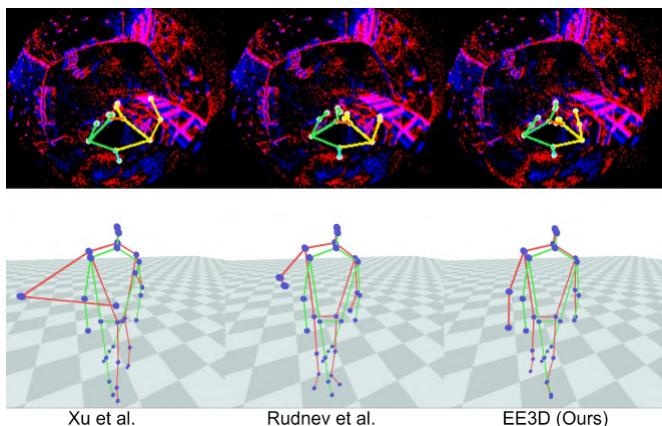  
Figure 6. Qualitative results of our method in comparison to Xu et al. [37] and Rudnev et al. [27]. Note how the previous methods fail to estimate accurate 3D poses when events generated by the background become more prevalent than events around the human. The predictions are in red and the ground truth is in green.

Per Joint Position Error (MPJPE) and MPJPE with Procrustes alignment [9] (PA-MPJPE).

## 5.1. Comparisons to State of the Art

Table 1 presents quantitative results of our approach and compared methods [27, 30, 37] adapted for our setting. EE3D outperforms Xu et al. [37], Rudnev et al. [27] and Tome et al. [30] by a large margin, e.g., by 6.30%, 19.64% and 37.98% on MPJPE on average, respectively.

It is worth noting that our method demonstrates a superiority over the competing methods especially in complex motions involving interaction with the environment, crawling, kicking, sports and dancing. These motions often come with fast-paced and jittery movements of the HMD, generating substantial background event noise. Notably, our method excels in handling such challenging scenarios. Also, we achieve the lowest standard deviation σ of the 3D errors on average. This result indicates that our method can estimate consistently accurate 3D poses across various motion activities. Fig. 6 shows visual outputs from our approach and compared methods. Notably, the events generated by the hand exhibit very close proximity to the events generated by the background. Competing methods can not handle such situations, predicting the background regions as the position of the hand. However, our method can accurately estimate 3D poses even in the presence of noisy background events.

## 5.2. Ablation Study

We next perform an ablation study to systematically evaluate the contributions of the core modules of our method. We define the baseline method to only contain the EPM. We next systematically examine the impact of the REPM as shown in Table 2. We see the baseline with the addition of the segmentation decoder improves the performance. We further notice a performance improvement when we allow past events to propagate to the current frame by weighting the events only with the segmentation decoder. Finally, including the confidence decoder to weigh the events from the previous frame, yields the best the best MPJPE and PA-MPJPE. Fig. 7 shows the the effectiveness of the REPM. We observe the baseline method’s susceptibility to background events Fig. 7-(a). Although adding the segmentation decoder aids in mitigating this issue, it still struggles to estimate the correct hand position Fig. 7-(b). Residual events from the previous frame weighted by the human body mask result in a significant performance improvement Fig. 7-(c). Finally, our full framework with the confidence decoder provides the closest possible estimate for the 3D pose in comparison to the ground truth Fig. 7-(d).

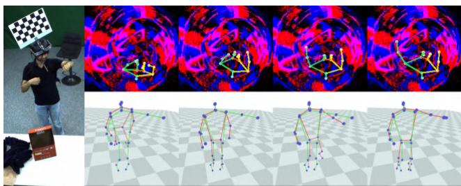  
(a)  
(b)  
(c)  
(d)  
(e)  
Figure 7. Ablation study of REPM on EE3D-R (representative example). (a) Reference RGB view. (b) Baseline (EPM only). (c) Baseline with segmentation decoder. (d) Baseline with REPM without confidence decoder. (e) EE3D (full model). The predictions are in red and the ground truth is in green.

## 5.3. Runtime and Performance

EventEgo3D supports real-time 3D human pose update rates of 140Hz. From Table 3, we see that our method has the lowest number of parameters and the lowest number of required floating point operations (FLOPs) compared to competing methods. Rudnev et al. [27] is the fastest approach and the second-best in terms of 3D accuracy. We achieve the second-highest number of pose updates per second. This result highlights that our approach is well-suitable for mobile devices: Its memory and computational requirements as well as power consumption (due to the event camera) would be the lowest among the tested methods.

Since Rudnev et al. [27] use direct regression of 3D joints, their method is faster while our method and Xu et al. [37] use heatmaps as an intermediate representation to estimate the 3D joints. Xu et al. and Tome et al. are not designed for event streams and achieve lower 3D accuracy. Moreover, the operations by Rudnev et al. are well parallelisable, which explains its high pose update rate.

<table><tr><td>Method</td><td>Metric</td><td>Walk</td><td>Crouch</td><td>Pushup</td><td>Boxing</td><td>Kick</td><td>Dance</td><td>Inter. with env.</td><td>Crawl</td><td>Sports</td><td>Jump</td><td>Avg. (σ)</td></tr><tr><td>Tome et al. [30]</td><td>MPJPE</td><td>140.34</td><td>173.93</td><td>157.29</td><td>177.07</td><td>181.12</td><td>212.61</td><td>169.80</td><td>144.80</td><td>207.56</td><td>165.57</td><td>173.01 (23.62)</td></tr><tr><td></td><td>PA-MPJPE</td><td>104.34</td><td>119.89</td><td>102.39</td><td>124.28</td><td>121.64</td><td>132.86</td><td>111.89</td><td>88.94</td><td>120.15</td><td>110.32</td><td>113.67 (12.76)</td></tr><tr><td>Xu et al. [37]</td><td>MPJPE</td><td>86.09</td><td>153.53</td><td>199.34</td><td>133.15</td><td>114.00</td><td>104.44</td><td>114.52</td><td>187.95</td><td>128.21</td><td>114.10</td><td>133.53 (36.42)</td></tr><tr><td></td><td>PA-MPJPE</td><td>59.11</td><td>113.31</td><td>147.13</td><td>102.50</td><td>91.75</td><td>79.65</td><td>85.83</td><td>138.12</td><td>98.10</td><td>89.19</td><td>100.47 (26.52)</td></tr><tr><td>Rudnev et al. [27]</td><td>MPJPE</td><td>74.82</td><td>178.23</td><td>105.68</td><td>128.93</td><td>112.45</td><td>98.14</td><td>110.05</td><td>120.51</td><td>110.16</td><td>106.19</td><td>114.52 (26.54)</td></tr><tr><td></td><td>PA-MPJPE</td><td>56.77</td><td>108.34</td><td>84.15</td><td>100.39</td><td>91.84</td><td>78.16</td><td>74.62</td><td>83.47</td><td>84.83</td><td>86.09</td><td>84.87 (14.08)</td></tr><tr><td>EventEgo3D (Ours)</td><td>MPJPE</td><td>70.88</td><td>163.84</td><td>97.88</td><td>136.57</td><td>103.72</td><td>88.87</td><td>103.19</td><td>109.71</td><td>101.02</td><td>97.32</td><td>107.30 (25.78)</td></tr><tr><td></td><td>PA-MPJPE</td><td>52.11</td><td>99.48</td><td>75.53</td><td>104.66</td><td>86.05</td><td>71.96</td><td>70.85</td><td>77.94</td><td>77.82</td><td>80.17</td><td>79.66 (14.83)</td></tr></table>

Table 1. Numerical comparisons on the EE3D-R dataset (in mm). Our EventEgo3D outperforms existing approaches on most activities by a substantial margin and achieves 6% improvement over Rudnev et al. [27]. “σ” denotes the standard deviation of MPJPE or PA-MPJPE.

(a)  
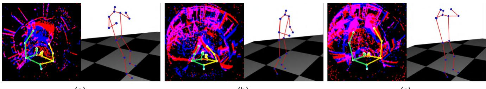  
(b)  
(c)  
Figure 8. Qualitative results of our method on in-the-wild motion sequences: (a) Holding a laptop, (b) Clapping and (c) Waving. The spatiotemporal scene context can be observed in the input LNES (events triggered by the laptop movement in (a) or raised hands in (c)).

<table><tr><td></td><td>MPJPE↓</td><td>PA-MPJPE↓</td></tr><tr><td>Baseline (EPM only)</td><td>111.01</td><td>85.58</td></tr><tr><td>Baseline with segmentation decoder</td><td>108.85</td><td>84.98</td></tr><tr><td>Baseline with REPM w/o Confidence decoder</td><td>107.58</td><td>83.95</td></tr><tr><td>EventEgo3D (Ours)</td><td>107.30</td><td>79.66</td></tr></table>

Table 2. Ablation study on the EventEgo-R dataset.

<table><tr><td></td><td>Params ↓</td><td>FLOPs ↓</td><td>Pose Update Rate ↑</td></tr><tr><td>Tome et al. [30]</td><td>77.01M</td><td>11.46G</td><td>77.07</td></tr><tr><td>Rudnev et al. [27]</td><td>11.2M</td><td>3.58G</td><td>489.56</td></tr><tr><td>Xu et al. [37]</td><td>82.18M</td><td>44.06G</td><td>68.65</td></tr><tr><td>EventEgo3D (Ours)</td><td>1.25M</td><td>416.84M</td><td>139.88</td></tr></table>

Table 3. Architecture (number of parameters), performance and runtime (pose update rate) comparisons for the evaluated methods.

## 5.4. Real-time Demo

Event cameras provide high temporal event resolution and can operate under low-lighting conditions due to their excellent high-dynamic range properties. Our EE3D approach runs at real-time 3D pose update rates, and we design a realtime demo setup; see Fig. 1-(b) with a third-person view. Our portable HMD enables a wide range of movements, and the on-device computing laptop housed in the backpack allows us to capture in-the-wild sequences.

We showcase two challenging scenarios, i.e., with fast motions and in a poorly lit environment that would lead to increased exposure time and motion blur in images captured by mainstream RGB cameras. Moreover, Fig. 8 illustrates some of the challenging motions performed during the demo, highlighting that our method accurately estimates 3D poses for each motion. Notably, in Fig. 8-(c), a fastpaced waving motion is depicted, and our method successfully recovers the 3D poses in this dynamic scenario. See our video with the recordings of the real-time demo.

## 6. Conclusion

EventEgo3D addresses the new problem, i.e. 3D human motion capture from egocentric event cameras, and we introduce all the necessary tools required to address funda mental challenges in designing the method (HMD, the synthetic and real datasets; and neural architecture with components tailored to the problem). EventEgo3D runs at realtime 3D pose update rates and is experimentally shown as the most accurate approach among all compared methods: Noteworthy is that the largest improvements in the 3D reconstruction accuracy are observed under the most challenging human motions. The EE3D-R dataset used for fine-tuning our model—initially trained on synthetic data— helps to bridge the gap between synthetic and real data.

We conclude that the usage of event cameras in the egocentric 3D human pose estimation setting is justified and offers many advantages. Furthermore, we believe egocentric event-based 3D vision in general has a high potential in related fields that are yet to be explored in follow-up works. Acknowledgement. This work was supported by the ERC Consolidator Grant 4DReply (770784). Hiroyasu Akada is also supported by the Nakajima Foundation.

## References

[1] Hiroyasu Akada, Jian Wang, Soshi Shimada, Masaki Takahashi, Christian Theobalt, and Vladislav Golyanik. Unrealego: A new dataset for robust egocentric 3d human motion capture. In European Conference on Computer Vision (ECCV), 2022. 1, 2, 6

[2] Valentin Bazarevsky, Ivan Grishchenko, Karthik Raveendran, Tyler Zhu, Fan Zhang, and Matthias Grundmann. Blazepose: On-device real-time body pose tracking. arXiv preprint arXiv:2006.10204, 2020. 4

[3] Captury. http://www.thecaptury.com/. 6

[4] Jiaan Chen, Hao Shi, Yaozu Ye, Kailun Yang, Lei Sun, and Kaiwei Wang. Efficient human pose estimation via 3d event point cloud. In International Conference on 3D Vision (3DV), 2022. 3

[5] DVXplorer Mini. https: // netsket. kr/ img / custom/board/DVXplorer-Mini.pdf. 5

[6] Guillermo Gallego, Tobi Delbruck, Garrick Orchard, Chiara¨ Bartolozzi, Brian Taba, Andrea Censi, Stefan Leutenegger, Andrew J Davison, Jorg Conradt, Kostas Daniilidis, et al.¨ Event-based vision: A survey. IEEE transactions on pattern analysis and machine intelligence, 44(1):154–180, 2020. 2

[7] Daniel Gehrig, Mathias Gehrig, Javier Hidalgo-Carrio, and´ Davide Scaramuzza. Video to events: Recycling video datasets for event cameras. In Computer Vision and Pattern Recognition (CVPR), 2020. 6

[8] Jianping Jiang, Jiahe Li, Baowen Zhang, Xiaoming Deng, and Boxin Shi. Evhandpose: Event-based 3d hand pose estimation with sparse supervision. arXiv preprint arXiv:2303.02862, 2023. 2, 3

[9] David G Kendall. A survey of the statistical theory of shape. Statistical Science, 4(2):87–99, 1989. 7

[10] Rawal Khirodkar, Aayush Bansal, Lingni Ma, Richard Newcombe, Minh Vo, and Kris Kitani. Ego-humans: An egocentric 3d multi-human benchmark. In International Conference on Computer Vision (ICCV), 2023. 2, 3

[11] Diederik Kingma and Jimmy Ba. Adam: A method for stochastic optimization. 2015. 6

[12] Chuanlin Lan, Ziyuan Yin, Arindam Basu, and Rosa HM Chan. Tracking fast by learning slow: An event-based speed adaptive hand tracker leveraging knowledge in rgb domain. arXiv preprint arXiv:2302.14430, 2023. 3

[13] Lensagon BF10M14522S118C. https : / / www . lensation.de/pdf/BF10M14522S118.pdf. 5

[14] Jiaman Li, Karen Liu, and Jiajun Wu. Ego-body pose estimation via ego-head pose estimation. In Computer Vision and Pattern Recognition (CVPR), 2023. 1

[15] Yuxuan Liu, Jianxin Yang, Xiao Gu, Yijun Chen, Yao Guo, and Guang-Zhong Yang. Egofish3d: Egocentric 3d pose estimation from a fisheye camera via self-supervised learning. IEEE Transactions on Multimedia, 2023. 1

[16] Matthew Loper, Naureen Mahmood, Javier Romero, Gerard Pons-Moll, and Michael J. Black. SMPL: A skinned multi-person linear model. ACM Trans. Graphics (Proc. SIGGRAPH Asia), 34(6):248:1–248:16, 2015. 6

[17] Zhengyi Luo, Ryo Hachiuma, Ye Yuan, and Kris Kitani. Dynamics-regulated kinematic policy for egocentric pose estimation. Advances in Neural Information Processing Systems (NeurIPS), 2021. 2

[18] Christen Millerdurai, Diogo Luvizon, Viktor Rudnev, Andre´ Jonas, Jiayi Wang, Christian Theobalt, and Vladislav Golyanik. 3d pose estimation of two interacting hands from a monocular event camera. In International Conference on 3D Vision (3DV), 2024. 3

[19] Jalees Nehvi, Vladislav Golyanik, Franziska Mueller, Hans-Peter Seidel, Mohamed Elgharib, and Christian Theobalt. Differentiable event stream simulator for non-rigid 3d tracking. In CVPR Workshop on Event-based Vision, 2021. 3

[20] Xiaqing Pan, Nicholas Charron, Yongqian Yang, Scott Peters, Thomas Whelan, Chen Kong, Omkar Parkhi, Richard Newcombe, and Yuheng (Carl) Ren. Aria digital twin: A new benchmark dataset for egocentric 3d machine perception. In International Conference on Computer Vision (ICCV), 2023. 3

[21] Adam Paszke, Sam Gross, Francisco Massa, Adam Lerer, James Bradbury, Gregory Chanan, Trevor Killeen, Zeming Lin, Natalia Gimelshein, Luca Antiga, et al. Pytorch: An imperative style, high-performance deep learning library. Advances in Neural Information Processing Systems (NeurIPS), 2019. 6

[22] Georgios Pavlakos, Luyang Zhu, Xiaowei Zhou, and Kostas Daniilidis. Learning to estimate 3d human pose and shape from a single color image. In Computer Vision and Pattern Recognition (CVPR), 2018. 4

[23] Henri Rebecq, Daniel Gehrig, and Davide Scaramuzza. Esim: an open event camera simulator. In Conference on Robot Learning (CORL), 2018. 3

[24] Henri Rebecq, Rene Ranftl, Vladlen Koltun, and Davide´ Scaramuzza. High speed and high dynamic range video with an event camera. IEEE transactions on pattern analysis and machine intelligence, 43(6):1964–1980, 2019. 6

[25] Helge Rhodin, Christian Richardt, Dan Casas, Eldar Insafutdinov, Mohammad Shafiei, Hans-Peter Seidel, Bernt Schiele, and Christian Theobalt. Egocap: egocentric marker-less motion capture with two fisheye cameras. ACM Transactions on Graphics (TOG), 35(6):1–11, 2016. 1, 2, 3

[26] Olaf Ronneberger, Philipp Fischer, and Thomas Brox. Unet: Convolutional networks for biomedical image segmentation. In International Conference on Medical image computing and computer-assisted intervention, 2015. 4

[27] Viktor Rudnev, Vladislav Golyanik, Jiayi Wang, Hans-Peter Seidel, Franziska Mueller, Mohamed Elgharib, and Christian Theobalt. Eventhands: Real-time neural 3d hand pose estimation from an event stream. In International Conference on Computer Vision (ICCV), 2021. 2, 3, 4, 6, 7, 8

[28] Viktor Rudnev, Mohamed Elgharib, Christian Theobalt, and Vladislav Golyanik. Eventnerf: Neural radiance fields from a single colour event camera. In Computer Vision and Pattern Recognition (CVPR), 2023. 3

[29] Davide Scaramuzza, Agostino Martinelli, and Roland Siegwart. A toolbox for easily calibrating omnidirectional cameras. In IEEE/RSJ International Conference on Intelligent Robots and Systems (IROS), 2006. 3

[30] Denis Tome, Patrick Peluse, Lourdes Agapito, and Hernan Badino. xr-egopose: Egocentric 3d human pose from an hmd camera. In International Conference on Computer Vision (ICCV), 2019. 2, 3, 4, 6, 7, 8

[31] Denis Tome, Thiemo Alldieck, Patrick Peluse, Gerard Pons-Moll, Lourdes Agapito, Hernan Badino, and Fernando De la Torre. Selfpose: 3d egocentric pose estimation from a headset mounted camera. IEEE Transactions on Pattern Analysis and Machine Intelligence, 45(6):6794–6806, 2020. 1, 2

[32] Jian Wang, Lingjie Liu, Weipeng Xu, Kripasindhu Sarkar, and Christian Theobalt. Estimating egocentric 3d human pose in global space. In International Conference on Computer Vision (ICCV), 2021. 2, 3

[33] Jian Wang, Lingjie Liu, Weipeng Xu, Kripasindhu Sarkar, Diogo Luvizon, and Christian Theobalt. Estimating egocentric 3d human pose in the wild with external weak supervision. In Computer Vision and Pattern Recognition (CVPR), 2022. 2

[34] Jian Wang, Diogo Luvizon, Weipeng Xu, Lingjie Liu, Kripasindhu Sarkar, and Christian Theobalt. Scene-aware egocentric 3d human pose estimation. Computer Vision and Pattern Recognition (CVPR), 2023. 1, 2, 3

[35] Ziyun Wang, Kenneth Chaney, and Kostas Daniilidis. Evac3d: From event-based apparent contours to 3d models via continuous visual hulls. In European Conference on Computer Vision (ECCV), 2022. 3

[36] Lan Xu, Weipeng Xu, Vladislav Golyanik, Marc Habermann, Lu Fang, and Christian Theobalt. Eventcap: Monocular 3d capture of high-speed human motions using an event camera. In Computer Vision and Pattern Recognition (CVPR), 2020. 2, 3

[37] Weipeng Xu, Avishek Chatterjee, Michael Zollhoefer, Helge Rhodin, Pascal Fua, Hans-Peter Seidel, and Christian Theobalt. $\mathrm { M o ^ { 2 } C a p ^ { 2 } }$ : Real-time mobile 3d motion capture with a cap-mounted fisheye camera. IEEE Transactions on Visualization and Computer Graphics, 25(5):2093–2101, 2019. 1, 2, 3, 6, 7, 8

[38] Yuxuan Xue, Haolong Li, Stefan Leutenegger, and Joerg Stueckler. Event-based non-rigid reconstruction from contours. In British Machine Vision Conference (BMVC), 2022. 3

[39] Ye Yuan and Kris Kitani. Ego-pose estimation and forecasting as real-time pd control. In International Conference on Computer Vision (ICCV), 2019. 2

[40] Siwei Zhang, Qianli Ma, Yan Zhang, Zhiyin Qian, Taein Kwon, Marc Pollefeys, Federica Bogo, and Siyu Tang. Egobody: Human body shape and motion of interacting people from head-mounted devices. In European conference on computer vision (ECCV), 2022. 3

[41] Siwei Zhang, Qianli Ma, Yan Zhang, Sadegh Aliakbarian, Darren Cosker, and Siyu Tang. Probabilistic human mesh recovery in 3d scenes from egocentric views. In International Conference on Computer Vision (ICCV), 2023. 2

[42] Yahui Zhang, Shaodi You, and Theo Gevers. Automatic calibration of the fisheye camera for egocentric 3d human pose estimation from a single image. In Winter Conference on Applications ofComputer Vision, 2021. 2

[43] Dongxu Zhao, Zhen Wei, Jisan Mahmud, and Jan-Michael Frahm. Egoglass: Egocentric-view human pose estimation from an eyeglass frame. In International Conference on 3D Vision (3DV), 2021. 1, 2, 6

[44] Shihao Zou, Chuan Guo, Xinxin Zuo, Sen Wang, Hu Xiaoqin, Shoushun Chen, Minglun Gong, and Li Cheng. Eventhpe: Event-based 3d human pose and shape estimation. In International Conference on Computer Vision (ICCV), 2021. 2, 3