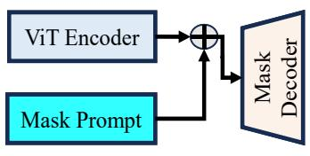
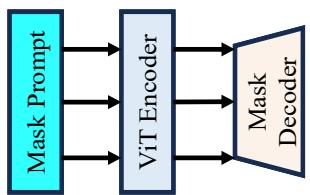
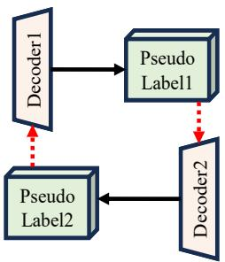
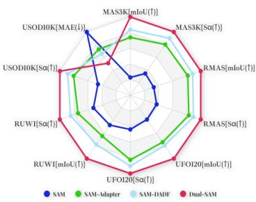
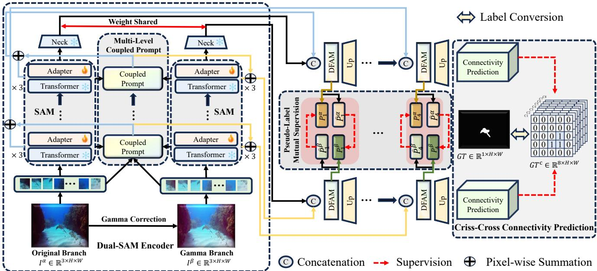
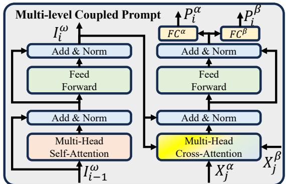
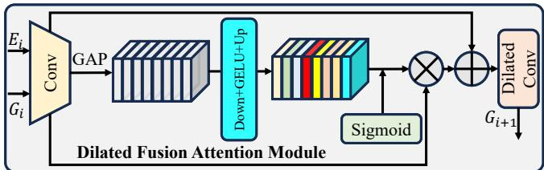
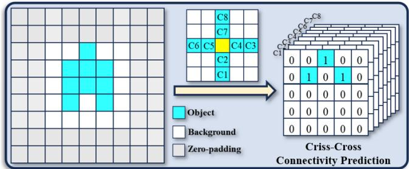
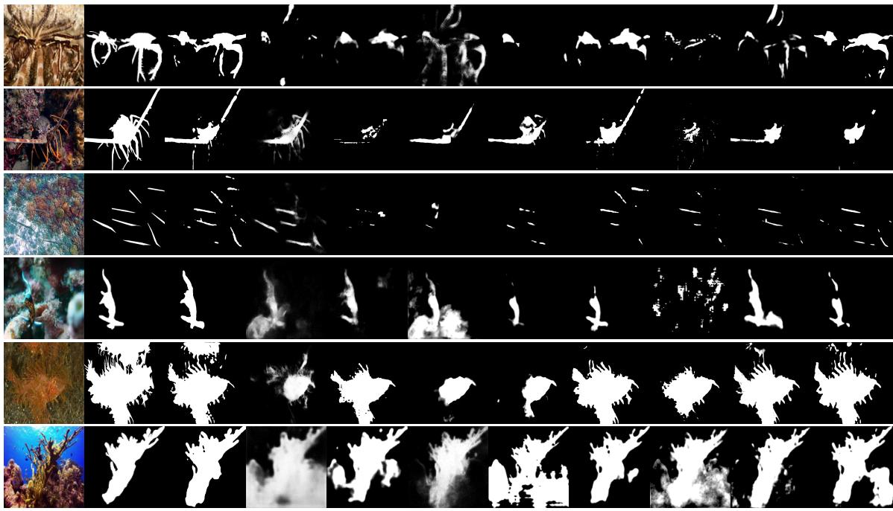
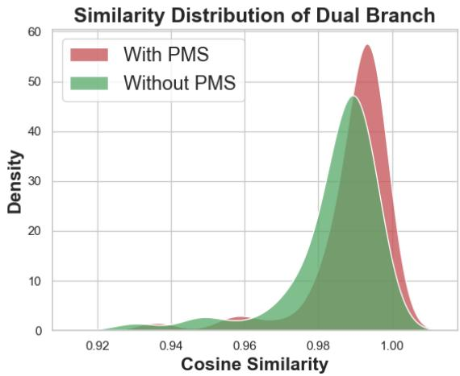

# Fantastic Animals and Where to Find Them: Segment Any Marine Animal with Dual SAM

Pingping Zhang\* Tianyu Yan Yang Liu Huchuan Lu School of Future Technology, School of Artificial Intelligence, Dalian University of Technology, China 2981431354@mail.dlut.edu.cn; {zhpp,ly,lhchuan}@dlut.edu.cn

## Abstract

As an important pillar of underwater intelligence, Marine Animal Segmentation (MAS) involves segmenting animals within marine environments. Previous methods don’t excel in extracting long-range contextualfeatures and overlook the connectivity between discrete pixels. Recently, Segment Anything Model (SAM) offers a universal frameworkfor general segmentation tasks. Unfortunately, trained with natural images, SAM does not obtain the prior knowledge from marine images. In addition, the single-position prompt of SAM is very insufficient for prior guidance. To address these issues, we propose a novel feature learning framework, named Dual-SAM for high-performance MAS. To this end, we first introduce a dual structure with SAM’s paradigm to enhance feature learning of marine images. Then, we propose a Multi-level Coupled Prompt (MCP) strategy to instruct comprehensive underwater prior information, and enhance the multi-level features of SAM’s encoder with adapters. Subsequently, we design a Dilated Fusion Attention Module (DFAM) to progressively integrate multi-level features from SAM’s encoder. Finally, instead of directly predicting the masks of marine animals, we propose a Criss-Cross Connectivity Prediction (C3P) paradigm to capture the inter-connectivity between discrete pixels. With dual decoders, it generates pseudo-labels and achieves mutual supervisionfor complementaryfeature representations, resulting in considerable improvements over previous techniques. Extensive experiments verify that our proposed method achieves state-of-the-art performances on five widely-used MAS datasets. The code is available at https://github.com/Drchip61/Dual SAM.

## 1. Introduction

Underwater ecosystems contain a wide variety of marine life, from microscopic plankton to colossal whales. These ecosystems are crucial roles for the earth’s environmental balance. Accurate and efficient Marine Animal Segmentation (MAS) is vital for understanding species’ distributions, behaviors, and interactions within the submerged world. However, unlike conventional terrestrial images, underwater images include variable lighting conditions, water turbidity, color distortion, and the movement of both cameras and subjects. Traditional segmentation techniques, developed primarily for terrestrial settings, often fall short when applied to the underwater domain. Consequently, methods designed to tackle the unique aspects of the marine environment are urgently required for underwater intelligence.

  
(a) SAM’s Prompt

  
(b) Our Multi-level Prompt

  
(c) Mutual Supervision

  
(d) High Performance of Dual-SAM  
Figure 1. Our inspirations and advantages. (a) Single-position prompt of SAM. (b) Our multi-level prompt. (c) Mutual supervision for our Dual-SAM’s decoders. (d) Our Dual-SAM delivers high performances on multiple datasets.

With the advent of deep learning, Convolutional Neural Networks (CNNs) [15, 20] lead to a new era for image segmentation. In fact, CNNs demonstrate a remarkable ability to extract intricate features, which makes them suitable for marine animal segmentation. Nonetheless, CNNs have inherent limitations in capturing long-range dependencies and contextual information within an image. Recently, Transformers [8] offer enhanced performance in capturing the long-range features of complex images. This ability is particularly appealing for underwater image segmentation, where the contextual information is often crucial to discern a marine organism from its background. However, one significant challenge for Transformers is the need of vast amounts of training data. Building on this evolution, the Segment Anything Model (SAM) [26] utilizes one billion natural images for model training. However, since the pre-training of SAM is primarily conducted under natural lighting conditions, its performance in marine environments is not optimal. In addition, the simplicity of SAM’s decoder limits its ability to capture complex details of marine organisms. Moreover, SAM introduces external prompts for instructing object priors. However, the single-position prompt is very insufficient for prior guidance.

To overcome the aforementioned issues, in this work we propose a novel feature learning framework, named Dual-SAM for high-performance MAS. Fig. 1 shows our inspirations and advantages. Technically, we first introduce a dual structure with SAM’s paradigm to enhance feature learning of marine images with gamma correction operations. Meanwhile, we enhance the multi-level features of SAM’s encoder with adapters. Then, we propose a Multilevel Coupled Prompt (MCP) strategy to instruct comprehensive underwater prior information with auto-prompts. Subsequently, we design a Dilated Fusion Attention Module (DFAM) to progressively integrate multi-level features from SAM’s encoder. Finally, instead of directly predicting the masks of marine animals, we propose a Criss-Cross Connectivity Prediction $\mathrm { ( C ^ { 3 } P ) }$ paradigm to capture the interconnectivity between discrete pixels. With dual decoders, it generates pseudo-labels and achieves mutual supervision for complementary feature representations. The proposed vectorized representation delivers significant improvements over previous scalar prediction techniques. Extensive experiments show that our proposed method achieves stateof-the-art performances on five widely-used MAS datasets.

In summary, our contributions are listed as follows:

• We propose a novel feature learning framework, named Dual-SAM for Marine Animal Segmentation (MAS). The framework inherits the ability of SAM and adaptively incorporates prior knowledge of underwater scenarios.

• We propose a Multi-level Coupled Prompt (MCP) strategy to instruct comprehensive underwater prior information with auto-prompts.

• We propose a Dilated Fusion Attention Module (DFAM) and a Criss-Cross Connectivity Prediction $\mathrm { ( C ^ { 3 } P ) }$ to improve the localization perception of marine animals.

• We perform extensive experiments to verify the effectiveness of the proposed modules. Our approach achieves a new state-of-the-art performance on five MAS datasets.

## 2. Related Work

## 2.1. Marine Animal Segmentation

MAS suffers from great challenges, such as variable lighting, particulate matter, water turbidity, etc. In past decades, most of existing methods primarily utilize handcrafted features [1, 43, 47]. Technically, energy-based models [28, 46, 50] are usually employed to predict the binary masks of marine animals. Although they achieve great success, there are still some key limitations, such as low robustness to the blurriness, unclear boundaries, etc.

With the rise of deep learning, CNNs become the preferred models for MAS. Various network architectures have been proposed to achieve performance improvements. For example, Li et al. [32] propose a feature-interactive encoder and a cascade decoder to extract more comprehensive information. Liu et al. [35] incorporate channel and spatial attention modules to refine the feature map for better object boundaries. Furthermore, Chen et al. [5] extract multi-scale features and introduce attention fusion blocks to highlight marine animals. Fu et al. [12] design a data augmentation strategy and use a Siamese structure to learn shared semantic information. Although effective, these CNN-based models lack the ability to capture long-range dependencies and intricate details for complex marine images.

Recently, Vision Transformer (ViT) [8] presents an excellent global understanding ability for multiple data types. With structural modifications, it delivers remarkable performances in various segmentation tasks [48, 54, 55, 64]. As for MAS, Hong et al. [17] adapt Transformer-based encoders to underwater images and show promising animal segmentation results. However, one significant challenge for Transformers is the need of vast amounts of training data. Currently, there are no very large-scale MAS datasets for the training of Transformers.

## 2.2. Segment Anything Model for Customized Tasks

Recently, SAM [26] is proposed to achieve universal image segmentation. It is trained on a large-scale segmentation dataset and exhibits zero-shot transfer capabilities [29, 58, 60]. With various types of prompts, it is efficiently deployed for a multitude of applications [24, 49, 62]. However, it exhibits performance limitations in transfer scenarios. In addition, the simplicity of SAM’s decoder is a hindrance when dealing with detail-aware segmentation tasks.

To address these limitations, various approaches have been proposed. Some works adopt adapters [6, 27, 59] to infuse SAM with domain-specific information. Others have opted for more specific decoder structures [13] to improve the domain perception. There are also efforts to automate the generation of prompts [3] for a better adaptability. Despite these advancements, since trained with natural images, SAM does not obtain enough prior knowledge from specific domains. In addition, the single-position prompt of SAM is very insufficient for prior guidance. As for MAS, we find that there is only one work [53] involving fine-tuning SAM for underwater scenes. Therefore, in this work, we delve deeply into SAM for improving the customized tasks.

  
Figure 2. The whole framework of our proposed approach. It contains five main components: Dual-SAM Encoder (DSE), Multi-level Coupled Prompt (MCP), Dilated Fusion Attention Module (DFAM), Criss-Cross Connectivity Prediction $\mathrm { ( C ^ { 3 } P ) }$ and Pseudo-label Mutual Supervision (PMS). Our framework can significantly improve the Marine Animal Segmentation (MAS) with SAM.

## 3. Proposed Approach

As shown in Fig. 2, our method contains five main components: Dual-SAM Encoder (DSE), Multi-level Coupled Prompt (MCP), Dilated Fusion Attention Module (DFAM), Criss-Cross Connectivity Prediction $\mathrm { ( C ^ { 3 } P ) }$ and Pseudolabel Mutual Supervision (PMS). These components will be elaborated in the following subsections.

## 3.1. Dual-SAM Encoder

As previously mentioned, it is imperative to enhance marine images with characteristics of natural images. To this end, we utilize the gamma correction for illumination compensation. Given the marine image $I ^ { \alpha }$ , the corrected image $I ^ { \beta }$ can be expressed as:

$$
I ^ { \beta } = \sqrt [ \gamma ] { I ^ { \alpha } } , \gamma = 1 \mathrm { g } ( 0 . 5 ) - 1 \mathrm { g } ( m e a n _ { I } ^ { g r a y } / 2 5 5 ) ,\tag{1}
$$

where γ is the gamma coefficient and mean $_ { I } ^ { g r a y }$ is the mean value of the image’s gray-scale intensities.

Afterwards, we inject marine domain information into SAM’s encoder for a better marine feature extraction. Inspired by [6, 59], we employ low-rank trainable matrices [19] to the Query and Value portion of the Multi-Head Self-Attention (MHSA) block. In addition, we incorporate an Adapter [18] to the Feed-Forward Network (FFN). Without loss of generality, let $X _ { j } \in \mathbb { R } ^ { N \times D }$ be the output feature in the j-th layer of SAM’s encoder, the feature in the j+1-th layer can be represented as follows:

$$
Q _ { j } = X _ { j } W _ { q } + ( X _ { j } W _ { q } ^ { \mathrm { d o w n } } ) W _ { q } ^ { u p } ,\tag{2}
$$

$$
K _ { j } = X _ { j } W _ { k } ,\tag{3}
$$

$$
V _ { j } = X _ { j } W _ { v } + ( X _ { j } W _ { v } ^ { \mathrm { d o w n } } ) W _ { v } ^ { u p } ,\tag{4}
$$

$$
H _ { j } = \mathbf { M H S A } \left( Q _ { j } , K _ { j } , V _ { j } \right) + X _ { j } ,\tag{5}
$$

$$
X _ { j + 1 } = \psi \left( \mathrm { F F N } \left( \phi \left( H _ { j } \right) \right) W ^ { d o w n } \right) W ^ { u p } + H _ { j } ,\tag{6}
$$

where N is the total number of tokens. D is the dimension of the token embedding. $W _ { \boldsymbol { q } / v } ^ { d o w n } \in \mathbb { R } ^ { D \times { r } }$ and $W _ { q / v } ^ { u p } \in \mathbb { R } ^ { r \times D }$ are linear projection matrices that reduce and subsequently restore the dimension of features, respectively. r stands for the dimension to which the features are reduced. $H _ { i }$ is the intermediate features within the Transformer block. Similarly, $W ^ { d o w n } \in \mathbb { R } ^ { D \times R }$ and $W ^ { u p } \in \mathbb { R } ^ { R \times D }$ are the compressed and excited operation, respectively. R stands for the compressed dimension. ψ is the GELU [16] activation function. ϕ is the layer normalization. Since we only update the linear projection matrices, it significantly reduces the number of trainable parameters for subsequent MAS tasks. With an additional branch, it can enhance animal-related features for better localizing.

  
Figure 3. Our proposed Multi-level Coupled Prompt (MCP).

## 3.2. Multi-level Coupled Prompt

In SAM, object-related prompts (e.g., mask, box, point) are encoded and added to the feature maps. However, the single-position prompt is very insufficient for prior guidance. To improve the prompt ability, we propose a Multilevel Coupled Prompt (MCP) strategy to instruct comprehensive underwater prior information with auto-prompts.

To this end, we first concatenate the original image $I ^ { \alpha }$ and the corrected image $I ^ { \beta }$ . Then, we partition them into patches and use convolutions to obtain feature embeddings:

$$
I _ { 0 } ^ { \omega } = \mathrm { P a t c h E m b e d } ( [ I ^ { \alpha } , I ^ { \beta } ] ) ,\tag{7}
$$

where $I _ { 0 } ^ { \omega } \in \mathbb { R } ^ { N \times D }$ is the tokenized features, which can be served as the start point. As shown in Fig. 3, it undergoes several Transformer layers and iteratively generate features:

$$
I _ { i } ^ { \omega } = \mathrm { T r a n s } ( I _ { i - 1 } ^ { \omega } ) , i = 1 , 2 , 3 , 4 .\tag{8}
$$

Then, we treat the DSE’s output features $X _ { j } ^ { \alpha }$ and $X _ { j } ^ { \beta }$ as the Query and Key, respectively. By using $I _ { i } ^ { \omega }$ as Value, we can obtain the coupled prompts as follows:

$$
\begin{array} { r } { H _ { i } ^ { \tau } = \boldsymbol { \mathrm { M H C A } } \left( X _ { j } ^ { \alpha } , X _ { j } ^ { \beta } , I _ { i } ^ { \omega } \right) + I _ { i } ^ { \omega } , } \end{array}\tag{9}
$$

$$
\mathcal { P } _ { i } ^ { \omega } = \mathrm { F F N } \left( \phi \left( H _ { i } ^ { \tau } \right) \right) + H _ { i } ^ { \tau } ,\tag{10}
$$

$$
\mathcal { P } _ { i } ^ { \alpha } = \mathrm { F C } ^ { \alpha } ( \mathcal { P } _ { i } ^ { \omega } ) ,\tag{11}
$$

$$
\mathcal { P } _ { i } ^ { \beta } = \mathrm { F C } ^ { \beta } ( \mathcal { P } _ { i } ^ { \omega } ) ,\tag{12}
$$

where MHCA is the Multi-Head Cross-Attention block and FC is a fully-connected layer. The generated prompts $( \mathcal { P } _ { i } ^ { \beta }$ and $\mathcal { P } _ { i } ^ { \beta } )$ are coupled and can be used as auto-prompts for a better instruction and prior guidance. As a result, we can obtain prompted features by:

$$
E _ { i } ^ { \alpha } = X _ { j } ^ { \alpha } + g _ { i } ^ { \alpha } \mathcal { P } _ { i } ^ { \alpha } ,\tag{13}
$$

$$
E _ { i } ^ { \beta } = X _ { j } ^ { \beta } + g _ { i } ^ { \beta } \mathcal { P } _ { i } ^ { \beta } ,\tag{14}
$$

where $\mathbf { \mathcal { G } } _ { i } ^ { \alpha }$ and $g _ { i } ^ { \beta }$ are learnable weights for balancing the input features and prompts.

  
Figure 4. Our Dilated Fusion Attention Module (DFAM).

## 3.3. Dilated Fusion Attention Module

The simple decoder of SAM is a hindrance when dealing with complex segmentation tasks. Inspired by [33], we introduce feature pyramid structures as decoders to fuse the prompted features for MAS. To improve the receptive field, we propose the Dilated Fusion Attention Module (DFAM) with dilated convolution [4] and channel attention. It can be inserted in adjacent features $( G _ { i }$ and $G _ { i + 1 } )$ . As shown in Fig. 4, the DFAM can be represented as follows:

$$
F _ { i } ^ { r } = \psi \left( \Theta _ { 1 \times 1 } \left( \left[ E _ { i } , G _ { i } \right] \right) \right) ,\tag{15}
$$

$$
W ^ { g } = \sigma \left( \psi \left( { \bf G } { \sf A P } \left( F _ { i } ^ { r } \right) W ^ { d o w n } \right) W ^ { u p } \right) ,\tag{16}
$$

$$
F _ { i } = W ^ { g } F _ { i } ^ { r } + F _ { i } ^ { r } ,\tag{17}
$$

$$
G _ { i + 1 } = \psi \left( \Theta _ { 3 , 3 } ^ { 2 } \left( F _ { i } \right) \right) ,\tag{18}
$$

where σ is the sigmoid function. $\Theta _ { 1 , 1 }$ is a $1 \times 1$ convolution, and $\Theta _ { 3 , 3 } ^ { 2 }$ is a $3 { \times } 3$ convolution with dilation rate=2. To build the feature pyramid, we graft an up-sampling layer after the resulted features. With the above DFAM, our framework can improve the contextual perceptions of marine animals.

## 3.4. Criss-Cross Connectivity Prediction

Traditional image segmentation methods predict the class for each pixel. As a result, they overlook the connectivity between discrete pixels, showing irregular structures and boundaries of objects. To address this issue, we propose a Criss-Cross Connectivity Prediction $\mathrm { ( C ^ { 3 } P ) }$ paradigm to capture the inter-connectivity between discrete pixels. Our approach draws inspiration from [25], which emphasizes connectivity predictions between adjacent pixels. In contrast, we extend the sampling to a criss-cross range, considering various shapes and sizes of marine animals. Specifically, our method first transforms the single-channel mask label into an 8-channel label. Fig. 5 illustrates these eight channels. They represent the connectivity between their positions and the central pixel. Given a central pixel $( w , h )$ , we identify criss-cross pixels based on the following criteria:

$$
\Omega _ { w , h } ^ { 1 } = \{ ( u , v ) \Vert | u - w | + | v - h | = 1 \} ,\tag{19}
$$

$$
\begin{array} { r } { \Omega _ { w , h } ^ { 2 } = \{ ( u , v ) \| | u - w | + | v - h | = 2 } \\ { \cap \operatorname { M a x } ( | u - w | , | v - h | ) = 2 \} , } \end{array}\tag{20}
$$

  
Figure 5. Our Criss-Cross Connectivity Prediction $\mathrm { ( C ^ { 3 } P ) }$

where $\Omega _ { w , h } ^ { 1 }$ and $\Omega _ { w , h } ^ { 2 }$ are neighboring pixel sets with distances of 1 and 2, respectively. Based on above definitions, our framework directly predict connectivity maps, which provide a more comprehensive and structured representation of segmentation masks. The training loss function is:

$$
\begin{array} { r } { \mathcal { L } _ { l } ^ { \alpha / \beta } = - \displaystyle \sum _ { w = 1 } ^ { W } \sum _ { h = 1 } ^ { H } \sum _ { c = 1 } ^ { C } [ Y _ { l } ( w , h , c ) \ln ( P _ { l } ^ { \alpha / \beta } ( w , h , c ) ) } \\ { + ( 1 - Y _ { l } ( w , h , c ) ) \ln ( 1 - P _ { l } ^ { \alpha / \beta } ( w , h , c ) ) ] . } \end{array}\tag{21}
$$

Here, $ { P _ { l } ^ { \alpha / \beta } }$ are predicted connectivity maps at the l-th level from two decoders. It is processed after the sigmoid function. Yl is the corresponding ground-truth. $( w , h )$ is the spatial location of a predicted pixel. c is the channel number. As can be observed, our proposed $\mathrm { C ^ { 3 } P }$ takes the criss-cross nature of pixels and achieves vectored predictions for the animal segmentation masks.

## 3.5. Pseudo-label Mutual Supervision

To further ensure the comprehensive complementarity of dual branches, we employ the Pseudo-label Mutual Supervision (PMS) for the two decoders. It works like a mutual learning and enables the model to optimize its parameters from a different perspective. Specifically, we first threshold the predicted output of each level within each decoder branch. It can be represented as follows:

$$
\hat { P } _ { l } ^ { \alpha / \beta } = \left\{ { 1 , { P } _ { l } ^ { \alpha / \beta } ( w , h , c ) > \xi } , \right.\tag{22}
$$

where $\hat { P } _ { l } ^ { \alpha / \beta }$ are the pseudo-labels at the l-th level after thresholding. ξ is the used threshold for pseudo-labels. The above pseudo-labels are then employed to supervise the prediction of the other branch. To this end, we use the following binary cross-entropy loss functions for training:

$$
\begin{array} { r l r } & { } & { \ddot { \mathcal { L } } _ { l } ^ { \alpha } = - \displaystyle \sum _ { w = 1 } ^ { W } \sum _ { h = 1 } ^ { H } \sum _ { c = 1 } ^ { C } [ \hat { P } _ { l } ^ { \alpha } ( w , h , c ) \ln ( \hat { P } _ { l } ^ { \beta } ( w , h , c ) ) } \\ & { } & { + ( 1 - \hat { P } _ { l } ^ { \alpha } ( w , h , c ) ) \ln ( 1 - \hat { P } _ { l } ^ { \beta } ( w , h , c ) ) ] , } \end{array}\tag{23}
$$

$$
\begin{array} { r l r } & { } & { \ddot { \mathcal { L } } _ { l } ^ { \beta } = - \displaystyle \sum _ { w = 1 } ^ { W } \sum _ { h = 1 } ^ { H } \sum _ { c = 1 } ^ { C } [ \hat { P } _ { l } ^ { \beta } ( w , h , c ) \ln ( \hat { P } _ { l } ^ { \alpha } ( w , h , c ) ) } \\ & { } & { + ( 1 - \hat { P } _ { l } ^ { \beta } ( w , h , c ) ) \ln ( 1 - \hat { P } _ { l } ^ { \alpha } ( w , h , c ) ) ] . } \end{array}\tag{24}
$$

Through the mutual supervision, we can foster a synergistic enhancement between the two branches, optimizing the extraction and integration of prompted features.

During the early stages of training, the connectivity predictions are very coarse and suboptimal. Thus, we introduce a dynamic update coefficient for the pseudo-label supervision. It starts at a small value, then gradually increases in an exponential manner:

$$
\mu = 0 . 1 \times e ^ { - 5 \times \left( 1 - \frac { t } { T } \right) ^ { 2 } } ,\tag{25}
$$

where t is the current epoch number during training. $T$ is the total epochs. Finally, the overall loss is expressed as:

$$
\mathcal { L } = \sum _ { l = 1 } ^ { 4 } ( ( \mathcal { L } _ { l } ^ { \alpha } + \mathcal { L } _ { l } ^ { \beta } ) + \mu ( \ddot { \mathcal { L } } _ { l } ^ { \alpha } + \ddot { \mathcal { L } } _ { l } ^ { \beta } ) ) .\tag{26}
$$

For inference, we convert the connectivity maps into the binary masks. To ensure a valid and reliable prediction, we adopt the following mutual confirmation:

$$
P _ { w , h , c } = 1 \cap P _ { u , v , 9 - c } = 1 \to P _ { w , h } = 1 \cap P _ { u , v } = 1 .\tag{27}
$$

Thus, P is the final prediction for MAS.

## 4. Experiments

## 4.1. Datasets and Evaluation Metrics

To thoroughly validate the performance, we adopt five public datasets and five evaluation metrics.

For the datasets, MAS3K [31] contains 3,103 images with high-quality annotations. We follow the default split and use 1,769 images for training and 1,141 images for testing. We exclude 193 images that only have a background. RMAS [12] includes 3,014 marine images. We use 2,514 images for training and 500 images for testing. UFO120 [21] contains a total of 1,620 marine images. We use 1,500 images for training and 120 images for testing. RUWI [9] contains 700 marine images. We use 525 images for training and 175 images for testing. In addition, to verify the generalization, we adopt the USOD10K [17] dataset. It is the largest underwater salient object detection dataset with a total of 10,255 images, splitting 9,229 images for training and 1,026 images for testing.

To evaluate the model’s performance, we utilize the following five metrics: Mean Intersection over Union (mIoU), Structural Similarity Measure $( S _ { \alpha } )$ , Weighted F-measure $( F _ { \beta } ^ { w } )$ , Mean Enhanced-Alignment Measure $( m { \bf E } _ { \phi } )$ , Mean Absolute Error (MAE). These metrics offer a comprehensive evaluation, capturing various aspects of segmentation quality. For more details on these metrics, please refer to the supplementary material.

Table 1. Performance comparison on MAS3K and RMAS. The best and second results are in red and blue, respectively.
<table><tr><td rowspan=2 colspan=1>Method</td><td rowspan=1 colspan=5>MAS3K</td><td rowspan=1 colspan=5>RMAS</td></tr><tr><td rowspan=1 colspan=1>mIoU</td><td rowspan=1 colspan=1> $\mathbf { S } _ { \alpha }$ </td><td rowspan=1 colspan=1> $\mathbf { F } _ { \beta } ^ { w }$ </td><td rowspan=1 colspan=1> $\mathbf { m } \mathbf { E } _ { \phi }$ </td><td rowspan=1 colspan=1>MAE</td><td rowspan=1 colspan=1>mIoU</td><td rowspan=1 colspan=1> $\mathbf { S } _ { \alpha }$ </td><td rowspan=1 colspan=1> $\overline { { \mathbf { F } _ { \beta } ^ { w } } }$ </td><td rowspan=1 colspan=1> $\mathbf { m } \mathbf { E } _ { \phi }$ </td><td rowspan=1 colspan=1>MAE</td></tr><tr><td rowspan=1 colspan=1>SINet [10]</td><td rowspan=1 colspan=1>0.658</td><td rowspan=1 colspan=1>0.820</td><td rowspan=1 colspan=1>0.725</td><td rowspan=1 colspan=1>0.884</td><td rowspan=1 colspan=1>0.039</td><td rowspan=1 colspan=1>0.684</td><td rowspan=1 colspan=1>0.835</td><td rowspan=1 colspan=1>0.780</td><td rowspan=1 colspan=1>0.908</td><td rowspan=1 colspan=1>0.025</td></tr><tr><td rowspan=1 colspan=1>PFNet [42]</td><td rowspan=1 colspan=1>0.695</td><td rowspan=1 colspan=1>0.839</td><td rowspan=1 colspan=1>0.746</td><td rowspan=1 colspan=1>0.890</td><td rowspan=1 colspan=1>0.039</td><td rowspan=1 colspan=1>0.694</td><td rowspan=1 colspan=1>0.843</td><td rowspan=1 colspan=1>0.771</td><td rowspan=1 colspan=1>0.922</td><td rowspan=1 colspan=1>0.026</td></tr><tr><td rowspan=1 colspan=1>RankNet [40]</td><td rowspan=1 colspan=1>0.658</td><td rowspan=1 colspan=1>0.812</td><td rowspan=1 colspan=1>0.722</td><td rowspan=1 colspan=1>0.867</td><td rowspan=1 colspan=1>0.043</td><td rowspan=1 colspan=1>0.704</td><td rowspan=1 colspan=1>0.846</td><td rowspan=1 colspan=1>0.772</td><td rowspan=1 colspan=1>0.927</td><td rowspan=1 colspan=1>0.026</td></tr><tr><td rowspan=1 colspan=1>C2FNet [51]</td><td rowspan=1 colspan=1>0.717</td><td rowspan=1 colspan=1>0.851</td><td rowspan=1 colspan=1>0.761</td><td rowspan=1 colspan=1>0.894</td><td rowspan=1 colspan=1>0.038</td><td rowspan=1 colspan=1>0.721</td><td rowspan=1 colspan=1>0.858</td><td rowspan=1 colspan=1>0.788</td><td rowspan=1 colspan=1>0.923</td><td rowspan=1 colspan=1>0.026</td></tr><tr><td rowspan=1 colspan=1>ECDNet [32]</td><td rowspan=1 colspan=1>0.711</td><td rowspan=1 colspan=1>0.850</td><td rowspan=1 colspan=1>0.766</td><td rowspan=1 colspan=1>0.901</td><td rowspan=1 colspan=1>0.036</td><td rowspan=1 colspan=1>0.664</td><td rowspan=1 colspan=1>0.823</td><td rowspan=1 colspan=1>0.689</td><td rowspan=1 colspan=1>0.854</td><td rowspan=1 colspan=1>0.036</td></tr><tr><td rowspan=1 colspan=1>OCENet [34]</td><td rowspan=1 colspan=1>0.667</td><td rowspan=1 colspan=1>0.824</td><td rowspan=1 colspan=1>0.703</td><td rowspan=1 colspan=1>0.868</td><td rowspan=1 colspan=1>0.052</td><td rowspan=1 colspan=1>0.680</td><td rowspan=1 colspan=1>0.836</td><td rowspan=1 colspan=1>0.752</td><td rowspan=1 colspan=1>0.900</td><td rowspan=1 colspan=1>0.030</td></tr><tr><td rowspan=1 colspan=1>ZoomNet [44]</td><td rowspan=1 colspan=1>0.736</td><td rowspan=1 colspan=1>0.862</td><td rowspan=1 colspan=1>0.780</td><td rowspan=1 colspan=1>0.898</td><td rowspan=1 colspan=1>0.032</td><td rowspan=1 colspan=1>0.728</td><td rowspan=1 colspan=1>0.855</td><td rowspan=1 colspan=1>0.795</td><td rowspan=1 colspan=1>0.915</td><td rowspan=1 colspan=1>0.022</td></tr><tr><td rowspan=1 colspan=1>MASNet [12]</td><td rowspan=1 colspan=1>0.742</td><td rowspan=1 colspan=1>0.864</td><td rowspan=1 colspan=1>0.788</td><td rowspan=1 colspan=1>0.906</td><td rowspan=1 colspan=1>0.032</td><td rowspan=1 colspan=1>0.731</td><td rowspan=1 colspan=1>0.862</td><td rowspan=1 colspan=1>0.801</td><td rowspan=1 colspan=1>0.920</td><td rowspan=1 colspan=1>0.024</td></tr><tr><td rowspan=1 colspan=1>SETR [64]</td><td rowspan=1 colspan=1>0.715</td><td rowspan=1 colspan=1>0.855</td><td rowspan=1 colspan=1>0.789</td><td rowspan=1 colspan=1>0.917</td><td rowspan=1 colspan=1>0.030</td><td rowspan=1 colspan=1>0.654</td><td rowspan=1 colspan=1>0.818</td><td rowspan=1 colspan=1>0.747</td><td rowspan=1 colspan=1>0.933</td><td rowspan=1 colspan=1>0.028</td></tr><tr><td rowspan=1 colspan=1>TransUNet [2]</td><td rowspan=1 colspan=1>0.739</td><td rowspan=1 colspan=1>0.861</td><td rowspan=1 colspan=1>0.805</td><td rowspan=1 colspan=1>0.919</td><td rowspan=1 colspan=1>0.029</td><td rowspan=1 colspan=1>0.688</td><td rowspan=1 colspan=1>0.832</td><td rowspan=1 colspan=1>0.776</td><td rowspan=1 colspan=1>0.941</td><td rowspan=1 colspan=1>0.025</td></tr><tr><td rowspan=1 colspan=1>H2Former [14]</td><td rowspan=1 colspan=1>0.748</td><td rowspan=1 colspan=1>0.865</td><td rowspan=1 colspan=1>0.810</td><td rowspan=1 colspan=1>0.925</td><td rowspan=1 colspan=1>0.028</td><td rowspan=1 colspan=1>0.717</td><td rowspan=1 colspan=1>0.844</td><td rowspan=1 colspan=1>0.799</td><td rowspan=1 colspan=1>0.931</td><td rowspan=1 colspan=1>0.023</td></tr><tr><td rowspan=1 colspan=1>SAM [26]</td><td rowspan=1 colspan=1>0.566</td><td rowspan=1 colspan=1>0.763</td><td rowspan=1 colspan=1>0.656</td><td rowspan=1 colspan=1>0.807</td><td rowspan=1 colspan=1>0.059</td><td rowspan=1 colspan=1>0.445</td><td rowspan=1 colspan=1>0.697</td><td rowspan=1 colspan=1>0.534</td><td rowspan=1 colspan=1>0.790</td><td rowspan=1 colspan=1>0.053</td></tr><tr><td rowspan=1 colspan=1>SAM-Ad[6]</td><td rowspan=1 colspan=1>0.714</td><td rowspan=1 colspan=1>0.847</td><td rowspan=1 colspan=1>0.782</td><td rowspan=1 colspan=1>0.914</td><td rowspan=1 colspan=1>0.033</td><td rowspan=1 colspan=1>0.656</td><td rowspan=1 colspan=1>0.816</td><td rowspan=1 colspan=1>0.752</td><td rowspan=1 colspan=1>0.927</td><td rowspan=1 colspan=1>0.027</td></tr><tr><td rowspan=1 colspan=1>SAM-DA [27]</td><td rowspan=1 colspan=1>0.742</td><td rowspan=1 colspan=1>0.866</td><td rowspan=1 colspan=1>0.806</td><td rowspan=1 colspan=1>0.925</td><td rowspan=1 colspan=1>0.028</td><td rowspan=1 colspan=1>0.686</td><td rowspan=1 colspan=1>0.833</td><td rowspan=1 colspan=1>0.780</td><td rowspan=1 colspan=1>0.926</td><td rowspan=1 colspan=1>0.024</td></tr><tr><td rowspan=1 colspan=1>Dual-SAM</td><td rowspan=1 colspan=1>0.789</td><td rowspan=1 colspan=1>0.884</td><td rowspan=1 colspan=1>0.838</td><td rowspan=1 colspan=1>0.933</td><td rowspan=1 colspan=1>0.023</td><td rowspan=1 colspan=1>0.735</td><td rowspan=1 colspan=1>0.860</td><td rowspan=1 colspan=1>0.812</td><td rowspan=1 colspan=1>0.944</td><td rowspan=1 colspan=1>0.022</td></tr></table>

Table 2. Performance comparison on UFO120 and RUWI. The best and second results are in red and blue, respectively.
<table><tr><td rowspan=2 colspan=1>Method</td><td rowspan=1 colspan=5>UFO120</td><td rowspan=1 colspan=5>RUWI</td></tr><tr><td rowspan=1 colspan=1>mIoU</td><td rowspan=1 colspan=1> $\mathbf { S } _ { \alpha }$ </td><td rowspan=1 colspan=1> $\mathbf { F } _ { \beta } ^ { w }$ </td><td rowspan=1 colspan=1> $\mathbf { m } \mathbf { E } _ { \phi }$ </td><td rowspan=1 colspan=1>MAE</td><td rowspan=1 colspan=1>mIoU</td><td rowspan=1 colspan=1> $\mathbf { S } _ { \alpha }$ </td><td rowspan=1 colspan=1> $\mathbf { F } _ { \beta } ^ { w }$ </td><td rowspan=1 colspan=1> $\mathbf { m } \mathbf { E } _ { \phi }$ </td><td rowspan=1 colspan=1>MAE</td></tr><tr><td rowspan=1 colspan=1>SINet [10]</td><td rowspan=1 colspan=1>0.767</td><td rowspan=1 colspan=1>0.837</td><td rowspan=1 colspan=1>0.834</td><td rowspan=1 colspan=1>0.890</td><td rowspan=1 colspan=1>0.079</td><td rowspan=1 colspan=1>0.785</td><td rowspan=1 colspan=1>0.789</td><td rowspan=1 colspan=1>0.825</td><td rowspan=1 colspan=1>0.872</td><td rowspan=1 colspan=1>0.096</td></tr><tr><td rowspan=1 colspan=1>PFNet [42]</td><td rowspan=1 colspan=1>0.570</td><td rowspan=1 colspan=1>0.708</td><td rowspan=1 colspan=1>0.550</td><td rowspan=1 colspan=1>0.683</td><td rowspan=1 colspan=1>0.216</td><td rowspan=1 colspan=1>0.864</td><td rowspan=1 colspan=1>0.883</td><td rowspan=1 colspan=1>0.870</td><td rowspan=1 colspan=1>0.790</td><td rowspan=1 colspan=1>0.062</td></tr><tr><td rowspan=2 colspan=1>RankNet [40]C2FNet [51]</td><td rowspan=1 colspan=1>0.739</td><td rowspan=1 colspan=1>0.823</td><td rowspan=1 colspan=1>0.772</td><td rowspan=1 colspan=1>0.828</td><td rowspan=1 colspan=1>0.101</td><td rowspan=1 colspan=1>0.865</td><td rowspan=1 colspan=1>0.886</td><td rowspan=1 colspan=1>0.889</td><td rowspan=1 colspan=1>0.759</td><td rowspan=1 colspan=1>0.056</td></tr><tr><td rowspan=1 colspan=1>0.747</td><td rowspan=1 colspan=1>0.826</td><td rowspan=1 colspan=1>0.806</td><td rowspan=1 colspan=1>0.878</td><td rowspan=1 colspan=1>0.083</td><td rowspan=1 colspan=1>0.840</td><td rowspan=1 colspan=1>0.830</td><td rowspan=1 colspan=1>0.883</td><td rowspan=1 colspan=1>0.924</td><td rowspan=1 colspan=1>0.060</td></tr><tr><td rowspan=1 colspan=1>ECDNet [32]</td><td rowspan=1 colspan=1>0.693</td><td rowspan=1 colspan=1>0.783</td><td rowspan=1 colspan=1>0.768</td><td rowspan=1 colspan=1>0.848</td><td rowspan=1 colspan=1>0.103</td><td rowspan=1 colspan=1>0.829</td><td rowspan=1 colspan=1>0.812</td><td rowspan=1 colspan=1>0.871</td><td rowspan=1 colspan=1>0.917</td><td rowspan=1 colspan=1>0.064</td></tr><tr><td rowspan=1 colspan=1>OCENet [34]</td><td rowspan=1 colspan=1>0.605</td><td rowspan=1 colspan=1>0.725</td><td rowspan=1 colspan=1>0.668</td><td rowspan=1 colspan=1>0.773</td><td rowspan=1 colspan=1>0.161</td><td rowspan=1 colspan=1>0.763</td><td rowspan=1 colspan=1>0.791</td><td rowspan=1 colspan=1>0.798</td><td rowspan=1 colspan=1>0.863</td><td rowspan=1 colspan=1>0.115</td></tr><tr><td rowspan=1 colspan=1>ZoomNet [44]</td><td rowspan=1 colspan=1>0.616</td><td rowspan=1 colspan=1>0.702</td><td rowspan=1 colspan=1>0.670</td><td rowspan=1 colspan=1>0.815</td><td rowspan=1 colspan=1>0.174</td><td rowspan=1 colspan=1>0.739</td><td rowspan=1 colspan=1>0.753</td><td rowspan=1 colspan=1>0.771</td><td rowspan=1 colspan=1>0.817</td><td rowspan=1 colspan=1>0.137</td></tr><tr><td rowspan=1 colspan=1>MASNet [12]</td><td rowspan=1 colspan=1>0.754</td><td rowspan=1 colspan=1>0.827</td><td rowspan=1 colspan=1>0.820</td><td rowspan=1 colspan=1>0.879</td><td rowspan=1 colspan=1>0.083</td><td rowspan=1 colspan=1>0.865</td><td rowspan=1 colspan=1>0.880</td><td rowspan=1 colspan=1>0.913</td><td rowspan=1 colspan=1>0.944</td><td rowspan=1 colspan=1>0.047</td></tr><tr><td rowspan=2 colspan=1>SETR [64]TransUNet [2]</td><td rowspan=1 colspan=1>0.711</td><td rowspan=1 colspan=1>0.811</td><td rowspan=1 colspan=1>0.796</td><td rowspan=1 colspan=1>0.871</td><td rowspan=1 colspan=1>0.089</td><td rowspan=1 colspan=1>0.832</td><td rowspan=1 colspan=1>0.864</td><td rowspan=1 colspan=1>0.895</td><td rowspan=1 colspan=1>0.924</td><td rowspan=1 colspan=1>0.055</td></tr><tr><td rowspan=1 colspan=1>0.752</td><td rowspan=1 colspan=1>0.825</td><td rowspan=1 colspan=1>0.827</td><td rowspan=1 colspan=1>0.888</td><td rowspan=1 colspan=1>0.079</td><td rowspan=1 colspan=1>0.854</td><td rowspan=1 colspan=1>0.872</td><td rowspan=1 colspan=1>0.910</td><td rowspan=1 colspan=1>0.940</td><td rowspan=1 colspan=1>0.048</td></tr><tr><td rowspan=1 colspan=1>H2Former [14]</td><td rowspan=1 colspan=1>0.780</td><td rowspan=1 colspan=1>0.844</td><td rowspan=1 colspan=1>0.845</td><td rowspan=1 colspan=1>0.901</td><td rowspan=1 colspan=1>0.070</td><td rowspan=1 colspan=1>0.871</td><td rowspan=1 colspan=1>0.884</td><td rowspan=1 colspan=1>0.919</td><td rowspan=1 colspan=1>0.945</td><td rowspan=1 colspan=1>0.045</td></tr><tr><td rowspan=1 colspan=1>SAM [26]</td><td rowspan=1 colspan=1>0.681</td><td rowspan=1 colspan=1>0.768</td><td rowspan=1 colspan=1>0.745</td><td rowspan=1 colspan=1>0.827</td><td rowspan=1 colspan=1>0.121</td><td rowspan=1 colspan=1>0.849</td><td rowspan=1 colspan=1>0.855</td><td rowspan=1 colspan=1>0.907</td><td rowspan=1 colspan=1>0.929</td><td rowspan=1 colspan=1>0.057</td></tr><tr><td rowspan=2 colspan=1>SAM-Ad [6]SAM-DA [27]</td><td rowspan=1 colspan=1>0.757</td><td rowspan=1 colspan=1>0.829</td><td rowspan=1 colspan=1>0.834</td><td rowspan=1 colspan=1>0.884</td><td rowspan=1 colspan=1>0.081</td><td rowspan=1 colspan=1>0.867</td><td rowspan=1 colspan=1>0.878</td><td rowspan=1 colspan=1>0.913</td><td rowspan=1 colspan=1>0.946</td><td rowspan=1 colspan=1>0.046</td></tr><tr><td rowspan=1 colspan=1>0.768</td><td rowspan=1 colspan=1>0.841</td><td rowspan=1 colspan=1>0.836</td><td rowspan=1 colspan=1>0.893</td><td rowspan=1 colspan=1>0.073</td><td rowspan=1 colspan=1>0.881</td><td rowspan=1 colspan=1>0.889</td><td rowspan=1 colspan=1>0.925</td><td rowspan=1 colspan=1>0.940</td><td rowspan=1 colspan=1>0.044</td></tr><tr><td rowspan=1 colspan=1>Dual-SAM</td><td rowspan=1 colspan=1>0.810</td><td rowspan=1 colspan=1>0.856</td><td rowspan=1 colspan=1>0.864</td><td rowspan=1 colspan=1>0.914</td><td rowspan=1 colspan=1>0.064</td><td rowspan=1 colspan=1>0.904</td><td rowspan=1 colspan=1>0.903</td><td rowspan=1 colspan=1>0.939</td><td rowspan=1 colspan=1>0.959</td><td rowspan=1 colspan=1>0.035</td></tr></table>

## 4.2. Implementation Details

We implement our model with the PyTorch toolbox and conduct experiments with one RTX 3090 GPU. In our model, the SAM’s encoder is initialized from the pretrained SAM-B [26], while the rest are randomly initialized. During the training process, we freeze the SAM’s encoder and only fine-tune the remaining modules. To reduce the computation, we set $j = 3 \times i$ for the MCP. The threshold $\xi$ is set to 0.5. The AdamW optimizer [39] is used to update the parameters. The initial learning rate and weight decay are set to 0.001 and 0.1, respectively. We reduce the learning rate by a factor of 10 at every 20 epochs. The total number of training epochs T is set to 50. The mini-batch size is set to 8 due to the memory limitation. All the input images are resized to $5 1 2 \times 5 1 2 \times 3 .$ For the evaluation, we resize the predicted masks back to the original image size by the bilinear interpolation.

## 4.3. Comparisons with the State-of-the-arts

In this part, we compare our method with other methods. The quantitative and qualitative results clearly show the notable advantage of our proposed method.

Quantitative Comparisons. Tab. 1 and Tab. 2 show quantitative comparisons on typical MAS datasets. When compared with CNN-based methods, our method notably improves the performance. On the challenging MAS3K dataset, our method achieves the highest scores across all metrics. It delivers a 3-5% improvement in various metrics. Meanwhile, our method consistently performs better on other MAS datasets. When compared with Transformerbased methods, our method delivers a 2-3% improvement on the MAS3K dataset. When compared with other SAMbased methods, our method shows a 3-4% boost in performance. Besides, in Tab. 3, we compare our method with other methods for underwater salient object detection. Our proposed method still achieves excellent results.

  
Image GT Dual-SAM ECDNet MASNet SETR TransUNet H2Former SAM SAM-Ad SAM-DA

Figure 6. Visual comparison of predicted segmentation masks with different methods.  
Table 3. Performance comparison on USOD10k. The best and second results are in red and blue, respectively.
<table><tr><td rowspan="2">Method</td><td colspan="4">USOD10K</td></tr><tr><td> $\overline { { \mathbf { S } _ { \alpha } } }$ </td><td> $\mathbf { m } \mathbf { E } _ { \phi }$ </td><td>maxF</td><td>MAE</td></tr><tr><td>S2MA [36]</td><td>.8664</td><td>.9208</td><td>.8530</td><td>.0558</td></tr><tr><td>SGL-KRN [52]</td><td>.9214</td><td>.9633</td><td>.9245</td><td>.0237</td></tr><tr><td>DCF [23]</td><td>.9116</td><td>.9541</td><td>.9045</td><td>.0312</td></tr><tr><td>SPNet [65]</td><td>.9075</td><td>.9554</td><td>.9069</td><td>.0280</td></tr><tr><td>HAINet [30]</td><td>.9123</td><td>.9552</td><td>.9116</td><td>.0279</td></tr><tr><td>VST [37]</td><td>.9136</td><td>.9614</td><td>.9108</td><td>.0267</td></tr><tr><td>TriTransNet [38]</td><td>.7889</td><td>.8479</td><td>.7501</td><td>.0659</td></tr><tr><td>CSNet [7]</td><td>.8595</td><td>.9178</td><td>.8462</td><td>.0548</td></tr><tr><td>D3Net [11]</td><td>.8931</td><td>.9413</td><td>.8807</td><td>.0374</td></tr><tr><td>SVAM-Net [22]</td><td>.7465</td><td>.7649</td><td>.6451</td><td>.0915</td></tr><tr><td>BTS-Net [61]</td><td>.9093</td><td>.9542</td><td>.9104</td><td>.0291</td></tr><tr><td>CDINet [57]</td><td>.7049</td><td>.8644</td><td>.7362</td><td>.0904</td></tr><tr><td>CTDNet [63]</td><td>.9085</td><td>.9531</td><td>.9073</td><td>.0285</td></tr><tr><td>MFNet [45]</td><td>.8425</td><td>.9146</td><td>.8193</td><td>.0512</td></tr><tr><td>PFSNet [41]</td><td>.8983</td><td>.9421</td><td>.8966</td><td>.0370</td></tr><tr><td>PSGLoss [56]</td><td>.8640</td><td>.9078</td><td>.8508</td><td>.0417</td></tr><tr><td>TC-USOD [17]</td><td>.9215</td><td>.9683</td><td>.9236</td><td>.0201</td></tr><tr><td>SAM [26]</td><td>.8543</td><td>.9095</td><td>.8812</td><td>.0380</td></tr><tr><td>SAM-Ad [6]</td><td>.8952</td><td>.9533</td><td>.9153</td><td>.0276</td></tr><tr><td>SAM-DA [27]</td><td>.9051</td><td>.9552</td><td>.9154</td><td>.0250</td></tr><tr><td>Dual-SAM</td><td>.9238</td><td>.9684</td><td>.9311</td><td>.0185</td></tr></table>

Qualitative Comparisons. Fig. 6 shows some visual examples to further verify the effectiveness of our method. As can be observed, our method can obtain better results in terms of whole structures (the 1st-2nd rows), multiple animals (the 3rd row), camouflage animals (the 4th row) and fine-grained boundaries (the 5th-6th rows). When compared with other SAM-based methods, our method can consistently improve the performance. The main reason is that our method introduces effective prompts and decoders.

## 4.4. Ablation Study

In this subsection, we conduct experiments to analyse the effect of different modules. The results are reported on the MAS3K dataset. Similar trends appear on other datasets.

Effect of Different Mask Prediction Paradigms. Tab. 4 shows the segmentation performance with different mask prediction paradigms. Clearly, the connectivity prediction delivers superior performance than the pixelwise prediction. in predicting both pixel-level connectivity and vector-level connectivity. Our proposed $\mathrm { C ^ { 3 } P }$ consistently shows better results than the connectivity prediction method [25] and pixel-wise prediction. It indicates a more comprehensive understanding of marine animals.

Table 4. Performance comparison of different prediction methods.
<table><tr><td rowspan=1 colspan=1>Method</td><td rowspan=1 colspan=1>mIoU</td><td rowspan=1 colspan=1> $S _ { \alpha }$ </td><td rowspan=1 colspan=1> $\overline { { F _ { \beta } ^ { w } } }$ </td><td rowspan=1 colspan=1> $m E _ { \phi }$ </td><td rowspan=1 colspan=1>MAE</td></tr><tr><td rowspan=3 colspan=1>Pixel-wiseNearby [25]C³P (Ours)</td><td rowspan=1 colspan=1>0.772</td><td rowspan=1 colspan=1>0.875</td><td rowspan=1 colspan=1>0.825</td><td rowspan=1 colspan=1>0.923</td><td rowspan=3 colspan=1>0.0270.0260.023</td></tr><tr><td rowspan=1 colspan=1>0.781</td><td rowspan=1 colspan=1>0.879</td><td rowspan=1 colspan=1>0.829</td><td rowspan=2 colspan=1>0.9290.933</td></tr><tr><td rowspan=1 colspan=1>0.789</td><td rowspan=1 colspan=1>0.884</td><td rowspan=1 colspan=1>0.838</td></tr></table>

  
Figure 7. Complementary effects of PMS on dual branch results.

Effect of Dual Branches. In this work, we introduce dual branches to improve the ability of SAM for MAS. Tab. 5 shows the performance comparison. As can be observed, the model with dual branches achieves better results than the single branch across all the metrics. It clearly demonstrates the effectiveness of our dual structures for marine feature extraction.

Effect of PMS. In this work, we employ PMS to further ensure the comprehensive complementarity of dual branches. Tab. 5 shows the performance comparison. In addition, Fig. 7 illustrates effects of the PMS. As can be observed, the performance is significantly improved by incorporating the PMS. The PMS can achieve a complementary effect in predicting segmentation masks.

Table 5. Performance comparison of dual branches and PMS.
<table><tr><td>Method</td><td>mIoU</td><td> $S _ { \alpha }$ </td><td> $\overline { { F _ { \beta } ^ { w } } }$ </td><td> $m E _ { \phi }$ </td><td>MAE</td></tr><tr><td>Single Branch Dual w/o PMS</td><td>0.767</td><td>0.872</td><td>0.816</td><td>0.922</td><td>0.028</td></tr><tr><td>Dual w PMS</td><td>0.771 0.789</td><td>0.874 0.884</td><td>0.820 0.838</td><td>0.923 0.933</td><td>0.029 0.023</td></tr></table>

Effect of MCP. In this work, we inject multi-level prompt information into SAM’s encoder for prior guidance. Tab. 6 shows the performance effect of MCP. With the proposed MCP, the model can improve the performances across all the metrics. The main reason is that the MCP helps SAM’encoder incorporate more fine-grained information.

Effect of DFAM. In this work, we propose DFAM to fuse the prompted features. Tab. 7 provides the performance effect of DFAM. With the proposed MCP, the model can improve the performances across all the metrics, especially in mIoU and MAE In fact, the improved results mainly come from the dilated convolution and channel attention, which aggregate both semantic and detail information.

Table 6. Performance effect of MCP.
<table><tr><td rowspan=1 colspan=1>Method</td><td rowspan=1 colspan=1>mIoU</td><td rowspan=1 colspan=1> $S _ { \alpha }$ </td><td rowspan=1 colspan=1> $\overline { { F _ { \beta } ^ { w } } }$ </td><td rowspan=1 colspan=1> $m E _ { \phi }$ </td><td rowspan=1 colspan=1>MAE</td></tr><tr><td rowspan=1 colspan=1>w/o MCPw MCP</td><td rowspan=1 colspan=1>0.7780.789</td><td rowspan=1 colspan=1>0.8770.884</td><td rowspan=1 colspan=1>0.8250.838</td><td rowspan=1 colspan=1>0.9290.933</td><td rowspan=1 colspan=1>0.0260.023</td></tr></table>

Table 7. Performance effect of DFAM.
<table><tr><td>Method</td><td>mIoU</td><td> $S _ { \alpha }$ </td><td> $\overline { { F _ { \beta } ^ { w } } }$ </td><td> $m E _ { \phi }$ </td><td>MAE</td></tr><tr><td>w/o DFAM</td><td>0.769</td><td>0.873</td><td>0.821</td><td>0.921</td><td>0.028</td></tr><tr><td>w DFAM</td><td>0.789</td><td>0.884</td><td>0.838</td><td>0.933</td><td>0.023</td></tr></table>

Effect of Adapters. In this work, we introduce multiple adapters into the SAM’s encoder for model adaptation. Tab. 8 shows the effectiveness of different adapter mechanisms. As can be observed, the performance shows a considerable decrease when removing these adapters. These adapters play a crucial role for extracting domain-specific features. The adapters have a significant impact on each subsequent module. From the experimental results, it is evident that both types of adapters we employ can substantially and efficiently enhance the model’s performance.

Table 8. Performance comparison with different adapters.
<table><tr><td>Method</td><td>mIoU</td><td> $S _ { \alpha }$ </td><td> $\overline { { F _ { \beta } ^ { w } } }$ </td><td> $m E _ { \phi }$ </td><td>MAE</td></tr><tr><td>Baseline</td><td>0.751</td><td>0.866</td><td>0.812</td><td>0.924</td><td>0.029</td></tr><tr><td>w/o LoRA [19]</td><td>0.768</td><td>0.872</td><td>0.816</td><td>0.921</td><td>0.028</td></tr><tr><td>w/o Adapter [18]</td><td>0.774</td><td>0.875</td><td>0.822</td><td>0.924</td><td>0.028</td></tr><tr><td>Full</td><td>0.789</td><td>0.884</td><td>0.838</td><td>0.933</td><td>0.023</td></tr></table>

## 5. Conclusion

In this paper, we propose a novel feature learning framework named Dual-SAM for MAS. The framework includes a dual structure with SAM’s paradigm to enhance feature learning of marine images. To instruct comprehensive underwater prior information, we propose a Multi-level Coupled Prompt (MCP) strategy. In addition, we design a Dilated Fusion Attention Module (DFAM) and a Criss-Cross Connectivity Prediction $( C ^ { 3 } \mathbf { P } )$ to improve the localization perception of marine animals. Extensive experiments show that our proposed method achieve state-of-the-art performances on five widely-used MAS datasets.

Acknowledgements. This work was supported in part by the National Natural Science Foundation of China (No.62101092), the Fundamental Research Funds for the Central Universities (No.DUT23YG232) and the Open Project Program of State Key Laboratory of Virtual Reality Technology and Systems, Beihang University (No.VRLAB2022C02).

## References

[1] Herbert Bay, Andreas Ess, Tinne Tuytelaars, and Luc Van Gool. Speeded-up robust features (surf). CVIU, 110 (3):346–359, 2008. 2

[2] Jieneng Chen, Yongyi Lu, Qihang Yu, Xiangde Luo, Ehsan Adeli, Yan Wang, Le Lu, Alan L Yuille, and Yuyin Zhou. Transunet: Transformers make strong encoders for medical image segmentation. arXiv, 2021. 6

[3] Keyan Chen, Chenyang Liu, Hao Chen, Haotian Zhang, Wenyuan Li, Zhengxia Zou, and Zhenwei Shi. Rsprompter: Learning to prompt for remote sensing instance segmentation based on visual foundation model. arXiv, 2023. 2

[4] Liang-Chieh Chen, George Papandreou, Iasonas Kokkinos, Kevin Murphy, and Alan L Yuille. Deeplab: Semantic image segmentation with deep convolutional nets, atrous convolution, and fully connected crfs. IEEE TPAMI, 40(4):834–848, 2017. 4

[5] Ruizhe Chen, Zhenqi Fu, Yue Huang, En Cheng, and Xinghao Ding. A robust object segmentation network for underwater scenes. In ICASSP, pages 2629–2633. IEEE, 2022. 2

[6] Tianrun Chen, Lanyun Zhu, Chaotao Ding, Runlong Cao, Shangzhan Zhang, Yan Wang, Zejian Li, Lingyun Sun, Papa Mao, and Ying Zang. Sam fails to segment anything?–samadapter: Adapting sam in underperformed scenes: Camouflage, shadow, and more. arXiv, 2023. 2, 3, 6, 7

[7] Ming-Ming Cheng, Shang-Hua Gao, Ali Borji, Yong-Qiang Tan, Zheng Lin, and Meng Wang. A highly efficient model to study the semantics of salient object detection. PAMI, 44 (11):8006–8021, 2021. 7

[8] Alexey Dosovitskiy, Lucas Beyer, Alexander Kolesnikov, Dirk Weissenborn, Xiaohua Zhai, Thomas Unterthiner, Mostafa Dehghani, Matthias Minderer, Georg Heigold, Sylvain Gelly, et al. An image is worth 16x16 words: Transformers for image recognition at scale. arXiv, 2020. 2

[9] Paulo Drews-Jr, Isadora de Souza, Igor P Maurell, Eglen V Protas, and Silvia S C. Botelho. Underwater image segmentation in the wild using deep learning. Journal of the Brazilian Computer Society, 27:1–14, 2021. 5

[10] Deng-Ping Fan, Ge-Peng Ji, Guolei Sun, Ming-Ming Cheng, Jianbing Shen, and Ling Shao. Camouflaged object detection. In CVPR, pages 2777–2787, 2020. 6

[11] Deng-Ping Fan, Zheng Lin, Zhao Zhang, Menglong Zhu, and Ming-Ming Cheng. Rethinking rgb-d salient object detection: Models, data sets, and large-scale benchmarks. TNNLS, 32(5):2075–2089, 2020. 7

[12] Zhenqi Fu, Ruizhe Chen, Yue Huang, En Cheng, Xinghao Ding, and Kai-Kuang Ma. Masnet: A robust deep marine animal segmentation network. IEEE Journal of Oceanic Engineering, 2023. 2, 5, 6

[13] Yifan Gao, Wei Xia, Dingdu Hu, and Xin Gao. Desam: Decoupling segment anything model for generalizable medical image segmentation. arXiv, 2023. 2

[14] Along He, Kai Wang, Tao Li, Chengkun Du, Shuang Xia, and Huazhu Fu. H2former: An efficient hierarchical hybrid transformer for medical image segmentation. TMI, 2023. 6

[15] Kaiming He, Xiangyu Zhang, Shaoqing Ren, and Jian Sun.

Deep residual learning for image recognition. In CVPR, pages 770–778, 2016. 1

[16] Dan Hendrycks and Kevin Gimpel. Gaussian error linear units (gelus). arXiv preprint arXiv:1606.08415, 2016. 3

[17] Lin Hong, Xin Wang, Gan Zhang, and Ming Zhao. Usod10k: a new benchmark dataset for underwater salient object detection. TIP, 2023. 2, 5, 7

[18] Neil Houlsby, Andrei Giurgiu, Stanislaw Jastrzebski, Bruna Morrone, Quentin De Laroussilhe, Andrea Gesmundo, Mona Attariyan, and Sylvain Gelly. Parameter-efficient transfer learning for nlp. In ICML, pages 2790–2799. PMLR, 2019. 3, 8

[19] Edward J Hu, Yelong Shen, Phillip Wallis, Zeyuan Allen-Zhu, Yuanzhi Li, Shean Wang, Lu Wang, and Weizhu Chen. Lora: Low-rank adaptation of large language models. arXiv, 2021. 3, 8

[20] Gao Huang, Zhuang Liu, Laurens Van Der Maaten, and Kilian Q Weinberger. Densely connected convolutional networks. In CVPR, pages 4700–4708, 2017. 1

[21] Md Jahidul Islam, Peigen Luo, and Junaed Sattar. Simultaneous enhancement and super-resolution of underwater imagery for improved visual perception. arXiv, 2020. 5

[22] Md Jahidul Islam, Ruobing Wang, and Junaed Sattar. Svam: saliency-guided visual attention modeling by autonomous underwater robots. arXiv, 2020. 7

[23] Wei Ji, Jingjing Li, Shuang Yu, Miao Zhang, Yongri Piao, Shunyu Yao, Qi Bi, Kai Ma, Yefeng Zheng, Huchuan Lu, et al. Calibrated rgb-d salient object detection. In CVPR, pages 9471–9481, 2021. 7

[24] Zheyan Jin, Shiqi Chen, Yueting Chen, Zhihai Xu, and Huajun Feng. Let segment anything help image dehaze. arXiv, 2023. 2

[25] Michael Kampffmeyer, Nanqing Dong, Xiaodan Liang, Yujia Zhang, and Eric P Xing. Connnet: A long-range relationaware pixel-connectivity network for salient segmentation. TIP, 28(5):2518–2529, 2018. 4, 7, 8

[26] Alexander Kirillov, Eric Mintun, Nikhila Ravi, Hanzi Mao, Chloe Rolland, Laura Gustafson, Tete Xiao, Spencer Whitehead, Alexander C Berg, Wan-Yen Lo, et al. Segment anything. arXiv, 2023. 2, 6, 7

[27] Yingxin Lai, Zhiming Luo, and Zitong Yu. Detect any deepfakes: Segment anything meets face forgery detection and localization. arXiv, 2023. 2, 6, 7

[28] David M Lane, Mike J Chantler, and Dongyong Dai. Robust tracking of multiple objects in sector-scan sonar image sequences using optical flow motion estimation. IEEE Journal ofOceanic Engineering, 23(1):31–46, 1998. 2

[29] Wenhui Lei, Xu Wei, Xiaofan Zhang, Kang Li, and Shaoting Zhang. Medlsam: Localize and segment anything model for 3d medical images. arXiv, 2023. 2

[30] Gongyang Li, Zhi Liu, Minyu Chen, Zhen Bai, Weisi Lin, and Haibin Ling. Hierarchical alternate interaction network for rgb-d salient object detection. TIP, 30:3528–3542, 2021. 7

[31] Lin Li, Eric Rigall, Junyu Dong, and Geng Chen. Mas3k: An open dataset for marine animal segmentation. In International Symposium on Benchmarking, Measuring and Optimization, pages 194–212. Springer, 2020. 5

[32] Lin Li, Bo Dong, Eric Rigall, Tao Zhou, Junyu Dong, and Geng Chen. Marine animal segmentation. TCSVT, 32(4): 2303–2314, 2021. 2, 6

[33] Tsung-Yi Lin, Piotr Dollar, Ross Girshick, Kaiming He,´ Bharath Hariharan, and Serge Belongie. Feature pyramid networks for object detection. In ICCV, pages 2117–2125, 2017. 4

[34] Jiawei Liu, Jing Zhang, and Nick Barnes. Modeling aleatoric uncertainty for camouflaged object detection. In WACV, pages 1445–1454, 2022. 6

[35] Lidan Liu and Weiwei Yu. Underwater image saliency detection via attention-based mechanism. In Journal of Physics: Conference Series, page 012012. IOP Publishing, 2022. 2

[36] Nian Liu, Ni Zhang, Ling Shao, and Junwei Han. Learning selective mutual attention and contrast for rgb-d saliency detection. TPAMI, 44(12):9026–9042, 2021. 7

[37] Ze Liu, Yutong Lin, Yue Cao, Han Hu, Yixuan Wei, Zheng Zhang, Stephen Lin, and Baining Guo. Swin transformer: Hierarchical vision transformer using shifted windows. In ICCV, pages 10012–10022, 2021. 7

[38] Zhengyi Liu, Yuan Wang, Zhengzheng Tu, Yun Xiao, and Bin Tang. Tritransnet: Rgb-d salient object detection with a triplet transformer embedding network. In ACMMM, pages 4481–4490, 2021. 7

[39] Ilya Loshchilov and Frank Hutter. Decoupled weight decay regularization. arXiv, 2017. 6

[40] Yunqiu Lv, Jing Zhang, Yuchao Dai, Aixuan Li, Bowen Liu, Nick Barnes, and Deng-Ping Fan. Simultaneously localize, segment and rank the camouflaged objects. In CVPR, pages 11591–11601, 2021. 6

[41] Mingcan Ma, Changqun Xia, and Jia Li. Pyramidal feature shrinking for salient object detection. In AAAI, pages 2311– 2318, 2021. 7

[42] Haiyang Mei, Ge-Peng Ji, Ziqi Wei, Xin Yang, Xiaopeng Wei, and Deng-Ping Fan. Camouflaged object segmentation with distraction mining. In CVPR, pages 8772–8781, 2021. 6

[43] Pauline C Ng and Steven Henikoff. Sift: Predicting amino acid changes that affect protein function. NAS, 31(13):3812– 3814, 2003. 2

[44] Youwei Pang, Xiaoqi Zhao, Tian-Zhu Xiang, Lihe Zhang, and Huchuan Lu. Zoom in and out: A mixed-scale triplet network for camouflaged object detection. In CVPR, pages 2160–2170, 2022. 6

[45] Yongri Piao, Jian Wang, Miao Zhang, and Huchuan Lu. Mfnet: Multi-filter directive network for weakly supervised salient object detection. In ICCV, pages 4136–4145, 2021. 7

[46] Divya Priyadarshni and MaheshKumar H Kolekar. Underwater object detection and tracking. In Soft Computing, pages 837–846. Springer, 2020. 2

[47] R Priyadharsini and T Sree Sharmila. Object detection in underwater acoustic images using edge based segmentation method. Procedia Computer Science, 165:759–765, 2019. 2

[48] Rene Ranftl, Alexey Bochkovskiy, and Vladlen Koltun. Vi-´ sion transformers for dense prediction. In ICCV, pages 12179–12188, 2021. 2

[49] Xinru Shan and Chaoning Zhang. Robustness of segment anything model (sam) for autonomous driving in adverse weather conditions. arXiv, 2023. 2

[50] ASM Shihavuddin, Nuno Gracias, Rafael Garcia, Javier Escartin, and Rolf Birger Pedersen. Automated classification and thematic mapping of bacterial mats in the north sea. In OCEANS, pages 1–8. IEEE, 2013. 2

[51] Yujia Sun, Geng Chen, Tao Zhou, Yi Zhang, and Nian Liu. Context-aware cross-level fusion network for camouflaged object detection. arXiv, 2021. 6

[52] Binwei Xu, Haoran Liang, Ronghua Liang, and Peng Chen. Locate globally, segment locally: A progressive architecture with knowledge review network for salient object detection. In AAAI, pages 3004–3012, 2021. 7

[53] Muduo Xu, Jianhao Su, and Yutao Liu. Aquasam: Underwater image foreground segmentation. arXiv, 2023. 3

[54] Tianyu Yan, Zifu Wan, and Pingping Zhang. Fully transformer network for change detection of remote sensing images. In ACCV, pages 1691–1708, 2022. 2

[55] Tianyu Yan, Zifu Wan, Pingping Zhang, Gong Cheng, and Huchuan Lu. Transy-net: Learning fully transformer networks for change detection of remote sensing images. TGRS, 61:1–12, 2023. 2

[56] Sheng Yang, Weisi Lin, Guosheng Lin, Qiuping Jiang, and Zichuan Liu. Progressive self-guided loss for salient object detection. TIP, 30:8426–8438, 2021. 7

[57] Chen Zhang, Runmin Cong, Qinwei Lin, Lin Ma, Feng Li, Yao Zhao, and Sam Kwong. Cross-modality discrepant interaction network for rgb-d salient object detection. In ACMMM, pages 2094–2102, 2021. 7

[58] Dingyuan Zhang, Dingkang Liang, Hongcheng Yang, Zhikang Zou, Xiaoqing Ye, Zhe Liu, and Xiang Bai. Sam3d: Zero-shot 3d object detection via segment anything model. arXiv, 2023. 2

[59] Kaidong Zhang and Dong Liu. Customized segment anything model for medical image segmentation. arXiv, 2023. 2, 3

[60] Lian Zhang, Zhengliang Liu, Lu Zhang, Zihao Wu, Xiaowei Yu, Jason Holmes, Hongying Feng, Haixing Dai, Xiang Li, Quanzheng Li, et al. Segment anything model (sam) for radiation oncology. arXiv, 2023. 2

[61] Wenbo Zhang, Yao Jiang, Keren Fu, and Qijun Zhao. Btsnet: Bi-directional transfer-and-selection network for rgb-d salient object detection. In ICME, pages 1–6. IEEE, 2021. 7

[62] Qihan Zhao, Xiaofeng Zhang, Hao Tang, Chaochen Gu, and Shanying Zhu. Enlighten-anything: When segment anything model meets low-light image enhancement. arXiv, 2023. 2

[63] Zhirui Zhao, Changqun Xia, Chenxi Xie, and Jia Li. Complementary trilateral decoder for fast and accurate salient object detection. In ACMMM, pages 4967–4975, 2021. 7

[64] Sixiao Zheng, Jiachen Lu, Hengshuang Zhao, Xiatian Zhu, Zekun Luo, Yabiao Wang, Yanwei Fu, Jianfeng Feng, Tao Xiang, Philip HS Torr, et al. Rethinking semantic segmentation from a sequence-to-sequence perspective with transformers. In CVPR, pages 6881–6890, 2021. 2, 6

[65] Tao Zhou, Huazhu Fu, Geng Chen, Yi Zhou, Deng-Ping Fan, and Ling Shao. Specificity-preserving rgb-d saliency detection. In ICCV, pages 4681–4691, 2021. 7