# Fast ODE-based Sampling for Diffusion Models in Around 5 Steps

Zhenyu Zhou Defang Chen† Can Wang Chun Chen The State Key Laboratory of Blockchain and Data Security, Zhejiang University, China

{zhyzhou, defchern, wcan, chenc}@zju.edu.cn

## Abstract

Samplingfrom diffusion models can be treated as solving the corresponding ordinary differential equations (ODEs), with the aim of obtaining an accurate solution with as few number of function evaluations (NFE) as possible. Recently, various fast samplers utilizing higher-order ODE solvers have emerged and achieved betterperformance than the initial first-order one. However, these numerical methods inherently result in certain approximation errors, which significantly degrades sample quality with extremely small NFE (e.g., around 5). In contrast, based on the geometric observation that each sampling trajectory almost lies in a two-dimensional subspace embedded in the ambient space, we propose Approximate MEan-Direction Solver (AMED-Solver) that eliminates truncation errors by directly learning the mean direction for fast diffusion sampling. Besides, our method can be easily used as a plugin to further improve existing ODE-based samplers. Extensive experiments on image synthesis with the resolution ranging from 32 to 512 demonstrate the effectiveness ofour method. With only 5 NFE, we achieve 6.61 FID on CIFAR-10, 10.74 FID on ImageNet 64×64, and 13.20 FID on LSUN Bedroom. Our code is available at https://github.com/zjupi/diff-sampler.

## 1. Introduction

Diffusion models have been attracting growing attentions in recent years due to their impressive generative capability [9, 34, 36, 38]. Given a noise input, they are able to generate a realistic output by performing iterative denoising steps with the score function [15, 42, 45]. This process can be interpreted as applying a certain numerical discretization on a stochastic differential equation (SDE), or more commonly, its corresponding probability flow ordinary differential equation (PF-ODE) [45]. Comparing to other generative models such as GANs [12] and VAEs [19], diffusion models have the advantages in high sample quality and stable training, but suffer from slow sampling speed, which poses a great challenge to their applications.

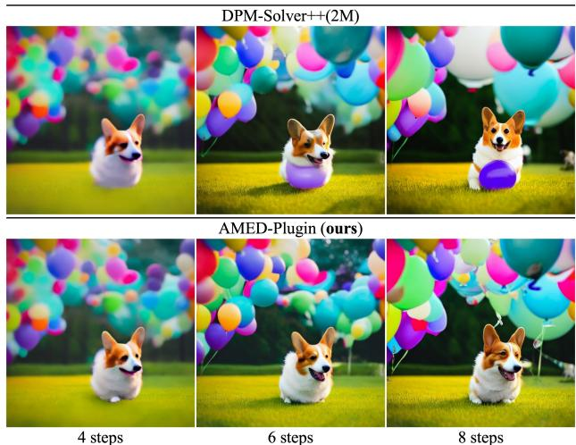  
Figure 1. Synthesized images by Stable-Diffusion [34] with a default classifier-free guidance scale 7.5 and a text prompt “A Corgi on the grass surrounded by a cluster of colorful balloons”. Our method improves DPM-Solver++(2M) [26] in sample quality.

Existing methods for accelerating diffusion sampling fall into two main streams. One is designing faster numerical solvers to increase step size while maintaining small truncation errors [10, 18, 23, 25, 43, 51]. They can be further categorized as single-step solvers and multi-step solvers [2]. The former computes the next step solution only using information from the current time step, while the latter uses multiple past time steps. These methods have successfully reduced the number of function evaluations (NFE) from 1000 to less than 20, almost without affecting the sample quality. Another kind of methods aim to build a one-to-one mapping between the data distribution and the pre-specified noise distribution [4, 24, 27, 39, 46], based on the idea of knowledge distillation. With a well-trained student model in hand, high-quality generation can be achieved with only one NFE. However, training such a student model either requires pre-generation of millions of images [24, 27], or huge training cost with carefully modified training procedure [4, 39, 46]. Besides, distillation-based models cannot guarantee the increase of sample quality given more NFE and they have difficulty in likelihood evaluation.

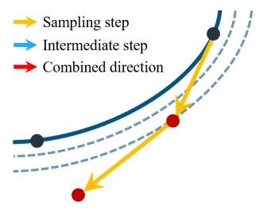  
(a) DDIM solver.

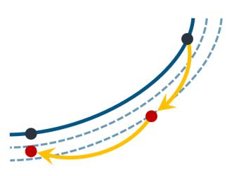  
(b) Multi-step solvers.

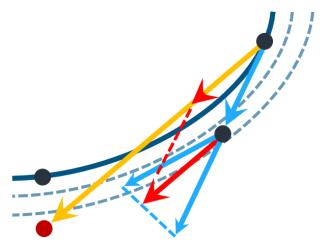  
(c) Generalized DPM-Solver-2.

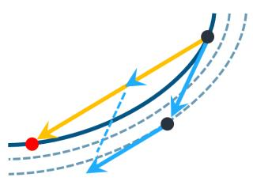  
(d) AMED-Solver (ours).  
Figure 2. Comparison of various ODE solvers. Red dots depict the actual sampling step of different solvers. (a) DDIM solver [43] applies Euler discretization on PF-ODEs. In every sampling step, it follows the gradient direction to give the solution for next time step. (b) Multistep solvers [23, 26, 51, 52] require current gradient and several records of history gradients and then follow the combination of these gradients to give the solution. (c) In generalized DPM-Solver-2 [25], there is a hyper-parameter r controlling the location of intermediate time step. $r = 0 . 5$ recovers the default DPM-Solver-2 and r = 1 recovers Heun’s second method [18]. The gradient for sampling step is given by the combination of gradients at intermediate and current time steps (see Tab. 1). (d) Our proposed AMED-Solver seeks to find the intermediate time step and the scaling factor that gives nearly optimal gradient directing to the ground truth solution. This gradient used for sampling step is adaptively learned instead of the heuristic assigned as DPM-Solver-2.

In this paper, we further boost ODE-based sampling for diffusion models in around 5 steps. Based on the geometric property that each sampling trajectory approximately lies in a two-dimensional subspace embedded in the high-dimension space, we propose Approximate MEan-Direction Solver (AMED-Solver), a single-step ODE solver that learns to predict the mean direction in every sampling step. A comparison of various ODE solvers is illustrated in Fig. 2. We also extend our method to any ODE solvers as a plugin. When applying AMED-Plugin on the improved PNDM solver [51], we achieve FID of 6.61 on CIFAR-10, 10.74 on ImageNet 64×64, and 13.20 on LSUN Bedroom. Our main contributions are as follows:

• We introduce AMED-Solver, a new single-step ODE solver for diffusion models that eliminates truncation errors by design.

• We propose AMED-Plugin that can be applied to any ODE solvers with a small training overhead and a negligible sampling overhead.

• Extensive experiments on various datasets validate the effectiveness of our method in fast image generation.

## 2. Background

## 2.1. Diffusion Models

The forward diffusion process can be formalized as a SDE:

$$
\mathrm { d } \mathbf { x } = \mathbf { f } ( \mathbf { x } , t ) \mathrm { d } t + g ( t ) \mathrm { d } \mathbf { w } _ { t } ,\tag{1}
$$

where $\mathbf { f } ( \cdot , t ) : \mathbb { R } ^ { d }  \mathbb { R } ^ { d } , g ( \cdot ) : \mathbb { R } $ R are drift and diffusion coefficients, respectively, and $\mathbf { w } _ { t } \in \mathbb { R } ^ { d }$ is the standard Wiener process [31]. This forward process forms a continuous stochastic process $\{ \mathbf { x } _ { t } \} _ { t = 0 } ^ { T }$ and the associated probability density $\{ p _ { t } ( \mathbf { x } ) \} _ { t = 0 } ^ { T } ,$ , to make the sample $\mathbf { x } _ { \mathrm { 0 } }$ from the implicit data distribution $p _ { d } = p _ { 0 }$ approximately distribute as the pre-specified noise distribution, $i . e . , p _ { T } \approx p _ { n }$ . Given an encoding $\mathbf { x } _ { T } \sim p _ { n } .$ generation is then performed with the reversal of Eq. (1) [1, 11]. Remarkably, there exists a probability flow ODE (PF-ODE)

$$
\mathrm { d } \mathbf { x } = \left[ \mathbf { f } ( \mathbf { x } , t ) - \frac { 1 } { 2 } g ( t ) ^ { 2 } \nabla _ { \mathbf { x } } \log p _ { t } ( \mathbf { x } ) \right] \mathrm { d } t ,\tag{2}
$$

sharing the same marginals with the reverse SDE [29, 45], and $\nabla _ { \mathbf { x } } \log p _ { t } ( \mathbf { x } )$ is known as the score function [16, 28]. Generally, this PF-ODE is preferred in practice for its conceptual simplicity, sampling efficiency and unique encoding [45]. Throughout this paper, we follow the configuration of EDM [18] by setting ${ \bf f } ( { \bf x } , t ) = { \bf 0 } , g ( t ) = \sqrt { 2 t }$ and $\sigma ( t ) = t$ . In this case, the reciprocal of $t ^ { 2 }$ equals to the signal-to-noise ratio [20] and the perturbation kernel is

$$
p _ { t } ( \mathbf { x } | \mathbf { x } _ { 0 } ) = \mathcal { N } ( \mathbf { x } ; \mathbf { x } _ { 0 } , t ^ { 2 } \mathbf { I } ) .\tag{3}
$$

To simulate the PF-ODE, we usually train a U-Net $[ 1 5 ,$ 35] predicting $\mathbf { s } _ { \theta } ( \mathbf { x } , t )$ to approximate the intractable $\nabla _ { \mathbf { x } } \log p _ { t } ( \mathbf { x } )$ . There are mainly two parameterizations in the literature. One uses a noise prediction model $\epsilon _ { \theta } ( \mathbf { x } , t )$ predicting the Gaussian noise added to x at time t [15, 43], and another uses a data prediction model $\mathbf { D } _ { \theta } ( \mathbf { x } , t )$ predicting the denoising output of x from time t to 0 [6, 18, 26]. They have the following relationship in our setting:

$$
\mathbf { s } _ { \theta } ( \mathbf { x } , t ) = - \frac { \epsilon _ { \theta } ( \mathbf { x } , t ) } { t } = \frac { \mathbf { D } _ { \theta } ( \mathbf { x } , t ) - \mathbf { x } } { t ^ { 2 } } .\tag{4}
$$

The training of diffusion models in the noise prediction notation is performed by minimizing a weighted combination of the least squares estimations:

$$
\begin{array} { r } { \mathbb { E } _ { \mathbf { x } \sim p _ { d } , \mathbf { z } \sim \mathcal { N } ( \mathbf { 0 } , t ^ { 2 } \mathbf { I } ) } \| \boldsymbol { \epsilon } _ { \theta } ( \mathbf { x } + \mathbf { z } ; t ) - \boldsymbol { \epsilon } \| _ { 2 } ^ { 2 } . } \end{array}\tag{5}
$$

We then plug the learned score function Eq. (4) into Eq. (2) to obtain a simple formulation for the PF-ODE

$$
\begin{array} { r } { \mathrm { d } \mathbf { x } = \epsilon _ { \theta } ( \mathbf { x } , t ) \mathrm { d } t . } \end{array}\tag{6}
$$

The sampling trajectory $\{ \mathbf { x } _ { t _ { n } } \} _ { n = 1 } ^ { N }$ is obtained by first draw $\mathbf { x } _ { t _ { N } } \sim p _ { n } = \mathcal { N } ( \mathbf { 0 } , T ^ { 2 } \mathbf { I } )$ and then solve Eq. (6) with N − 1 steps following time schedule $\Gamma = \{ t _ { 1 } = \epsilon , \cdot \cdot \cdot , t _ { N } = T \}$

## 2.2. Categorization of Previous Fast ODE Solvers

To accelerate diffusion sampling, various fast ODE solvers have been proposed, which can be classified into single-step solvers or multi-step solvers [2]. Single-step solvers including DDIM [43], EDM [18] and DPM-Solver [25] which only use the information from the current time step to compute the solution for the next time step, while multi-step solvers including PNDM [23] and DEIS [51] utilize multiple past time steps to compute the next time step (see Fig. 2 for an intuitive comparison). We emphasize that one should differ single-step ODE solvers from single-step (NFE=1) distillation-based methods [27, 39, 46].

The advantages of single-step methods lie in the easy implementation and the ability to self-start since no history record is required. However, as illustrated in Fig. 3, they suffer from fast degradation of sample quality especially when the NFE budget is limited. The reason may be that the actual sampling steps of multi-step solvers are twice as much as those of single-step solvers with the same NFE, enabling them to adjust directions more frequently and flexibly. We will show that our proposed AMED-Solver can largely fix this issue with learned mean directions.

## 3. Our Proposed AMED-Solver

In this section, we propose AMED-Solver, a single-step ODE solver for diffusion models that releases the potential of single-step solvers in extremely small NFE, enabling them to match or even surpass the performance of multistep solvers. Furthermore, our proposed method can be generalized as a plugin on any ODE solver, yielding promising improvement across various datasets. Our key observation is that the sampling trajectory generated by Eq. (6) nearly lies in a two-dimensional subspace embedded in high-dimensional space, which motivates us to minimize the discretization error with the mean value theorem.

## 3.1. The Sampling Trajectory Almost Lies in a Two-Dimensional Subspace

The sampling trajectory generated by solving Eq. (6) exhibits an extremely simple geometric structure and has an implicit connection to annealed mean shift, as revealed in the previous work [6]. Each sample starting from the noise distribution approaches the data manifold along a smooth, quasi-linear sampling trajectory in a monotone likelihood increasing way. Besides, all trajectories from different initial points share the similar geometric shape, whether in the conditional or unconditional generation case [6].

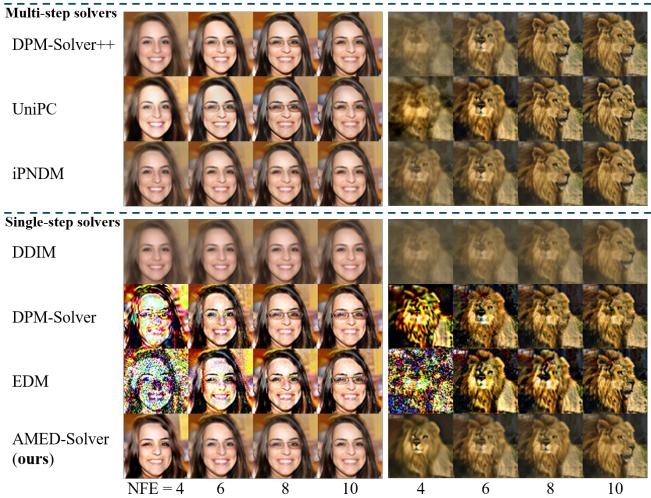  
Figure 3. The sample quality degradation of multi-step and singlestep ODE solvers. The quality of images generated by singlestep solvers, especially higher-order ones including DPM-Solver-2 [25] and EDM [18], rapidly decreases as NFE decreases, while our proposed AMED-Solver largely mitigates such degradation. Examples are from FFHQ 64×64 [17] and ImageNet 64×64 [37].

In this paper, we further point out that the sampling trajectory generated by ODE solvers almost lies in a twodimensional plane embedded in a high-dimensional space. We experimentally validate this claim by performing Principal Component Analysis (PCA) for 1k sampling trajectories on different datasets including CIFAR10 32×32 [21], FFHQ 64×64 [17], ImageNet 64×64 [37] and LSUN Bedroom 256×256 [50]. As illustrated in Fig. 4, the relative projection error using two principal components is no more than 8% and always stays in a small level. Besides, the sample variance can be fully explained using only two principal components. Given the vast image space with dimensions of 3072 (3×32×32), 12288 (3×64×64), or 196608 (3×256×256), the sampling trajectories show intriguing property that their dynamics can almost be described using only two principal components.

## 3.2. Approximate Mean-Direction Solver

With the geometric intuition, we next explain our methods in more detail. The exact solution of Eq. (6) is:

$$
\mathbf { x } _ { t _ { n } } = \mathbf { x } _ { t _ { n + 1 } } + \int _ { t _ { n + 1 } } ^ { t _ { n } } \mathbf { \epsilon } _ { \theta } ( \mathbf { x } _ { t } , t ) \mathrm { d } t .\tag{7}
$$

<table><tr><td>Method</td><td>Gradient term</td><td>Source of  $s _ { n }$ </td><td>Source of  $c _ { n }$ </td></tr><tr><td>DDIM [43]</td><td> $c _ { n } \epsilon _ { \theta } \big ( \mathbf { x } _ { t _ { n + 1 } } , t _ { n + 1 } \big )$ </td><td></td><td>1</td></tr><tr><td>EDM [18]</td><td> $\begin{array} { r } { c _ { n } \left( \frac { 1 } { 2 } \pmb { \epsilon } _ { \theta } \big ( \mathbf { x } _ { s _ { n } } , s _ { n } \big ) + \frac { 1 } { 2 } \pmb { \epsilon } _ { \theta } \big ( \mathbf { x } _ { t _ { n + 1 } } , t _ { n + 1 } \big ) \right) } \end{array}$ </td><td> $t _ { n }$ </td><td>1</td></tr><tr><td>Generalized DPM-Solver-2 [25]</td><td> $\begin{array} { r } { c _ { n } \left( \frac { 1 } { 2 r } \epsilon _ { \theta } ( \mathbf { x } _ { s _ { n } } , s _ { n } ) + ( 1 - \frac { 1 } { 2 r } ) \epsilon _ { \theta } ( \mathbf { x } _ { t _ { n + 1 } } , t _ { n + 1 } ) \right) } \end{array}$ </td><td> $t _ { n } ^ { r } t _ { n + 1 } ^ { 1 - r } , r \in ( 0 , 1 ]$ </td><td>1</td></tr><tr><td>AMED-Solver (ours)</td><td> $c _ { n } \epsilon _ { \theta } ( \mathbf { x } _ { s _ { n } } , s _ { n } )$ </td><td>Learned</td><td>Learned</td></tr></table>

Table 1. Comparison of various single-step ODE solvers.

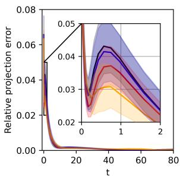

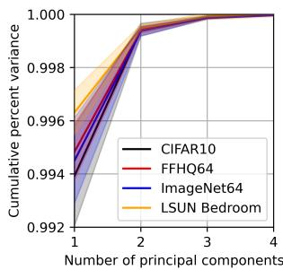  
(a) Relative deviation.  
(b) Variance explained by top PCs.  
Figure 4. We perform PCA to each sampling trajectory $\{ \mathbf { x } _ { t } \} _ { t = \epsilon } ^ { T } .$ (a) These trajectories are projected into a 2D subspace spanned by the top 2 principal components to get $\{ \tilde { \mathbf { x } } _ { t } \} _ { t = 1 } ^ { T }$ and the relative projection error is calculated as ${ \left\| { { \bf { x } } _ { t } } - { \tilde { \bf { x } } } _ { t } \right\| } _ { 2 } / \left\| { { \bf { x } } _ { t } } \right\| _ { 2 } . ( { \bf { b } } )$ We progressively increase the number of principal components and calculate the cumulative percent variance as $\hat { \mathrm { V a r } } ( \{ \tilde { \mathbf { x } } _ { t } \} _ { t = \epsilon } ^ { T } ) / \mathrm { V a r } ( \{ \mathbf { x } _ { t } \} _ { t = \epsilon } ^ { T } )$ The results are obtained by averaging 1k sampling trajectories using EDM solver [18] with 80 NFE.

Various numerical approximations to the integral above correspond to different types of fast ODE-based solvers. For instance, direct explicit rectangle method gives DDIM [43], linear multi-step method yields PNDM [23], Taylor expansion yields DPM-Solver [25] and polynomial extrapolation recovers DEIS [51]. Different from these works, we derive our method more directly by expecting that the mean value theorem holds for the integral involved so that we can find an intermediate time step $s _ { n } \in ( t _ { n } , t _ { n + 1 } )$ and a scaling factor $c _ { n } \in \mathbb { R }$ that satisfy

$$
\epsilon _ { \theta } ( \mathbf { x } _ { s _ { n } } , s _ { n } ) = \frac { c _ { n } } { t _ { n } - t _ { n + 1 } } \int _ { t _ { n + 1 } } ^ { t _ { n } } \epsilon _ { \theta } ( \mathbf { x } _ { t } , t ) \mathrm { d } t\tag{8}
$$

Although the well-known mean value theorem for realvalued functions does not hold in vector-valued case [7], the remarkable geometric property that the sampling trajectory $\{ { \bf x } _ { t } \} _ { t = } ^ { T }$ almost lies in a two-dimensional subspace guarantees our use. By properly choosing $s _ { n }$ and $c _ { n } .$ , we are able to achieve an approximation of Eq. (7) by

$$
\begin{array} { r } { \mathbf { x } _ { t _ { n } } \approx \mathbf { x } _ { t _ { n + 1 } } + c _ { n } ( t _ { n } - t _ { n + 1 } ) \epsilon _ { \theta } ( \mathbf { x } _ { s _ { n } } , s _ { n } ) . } \end{array}\tag{9}
$$

This formulation gives a single-step ODE solver. The DPM-Solver-2 [25] can be recovered by setting $s _ { n } = \sqrt { t _ { n } t _ { n + 1 } }$ and $c _ { n } ~ = ~ 1$ . In Tab. 1, we compare various single-step solvers by generalizing 0 $c _ { n } \epsilon _ { \theta } ( \mathbf { x } _ { s _ { n } } , s _ { n } )$ as the gradient term.

For the choose of $\{ s _ { n } \} _ { n = 1 } ^ { N - 1 }$ and $\{ c _ { n } \} _ { n = 1 } ^ { N - 1 }$ , we train a shallow neural network $g _ { \phi }$ (named as AMED predictor) based on distillation with small training and negligible sampling costs. Briefly, given samples $\mathbf { y } _ { t _ { n } } , \mathbf { y } _ { t _ { n + 1 } }$ on the teacher sampling trajectory and $\mathbf { x } _ { t _ { n + 1 } }$ on the student sampling trajectory, $g _ { \phi }$ gives $s _ { n }$ and $c _ { n }$ that minimizes $d \left( \mathbf { x } _ { t _ { n } } , \mathbf { y } _ { t _ { n } } \right)$ where $\mathbf { x } _ { t _ { n } }$ is given by Eq. (9) and $d ( \cdot , \cdot )$ is a distance metric. Since we seek to find a mean-direction that best approximates the integral in Eq. (8), we name our proposed singlestep ODE solver Eq. (9) as Approximate MEan-Direction Solver, dubbed as AMED-Solver. Before specifying the training and sampling details, we proceed to generalize our idea as a plugin to the existing fast ODE solvers.

## 3.3. AMED as A Plugin

The idea of AMED can be used to further improve existing fast ODE solvers for diffusion models. Throughout our analysis, we take the polynomial schedule [18] as example:

$$
t _ { n } = ( t _ { 1 } ^ { 1 / \rho } + \frac { n - 1 } { N - 1 } ( t _ { N } ^ { 1 / \rho } - t _ { 1 } ^ { 1 / \rho } ) ) ^ { \rho } .\tag{10}
$$

Note that another usually used uniform logSNR schedule is actually the limit of Eq. (10) as $\rho$ approaches +∞.

Given a time schedule $\Gamma = \{ t _ { 1 } = \epsilon , \cdot \cdot \cdot , t _ { N } = T \}$ the AMED-Solver is obtained by performing extra model evaluations at $s _ { n } \in ( t _ { n } , t _ { n + 1 } ) , n = 1 , \cdot \cdot \cdot , N - 1$ . Under the same manner, we are able to improve any ODE solvers by predicting $\{ s _ { n } \} _ { n = 1 } ^ { N - 1 }$ and $\{ c _ { n } \} _ { n = 1 } ^ { N - 1 }$ that best aligns the student and teacher sampling trajectories.

We validate this by an experiment where we fix $c _ { n } = 1$ and first generate a ground truth trajectory $\{ \mathbf { x } _ { t _ { n } } ^ { G } \} _ { n = 1 } ^ { N }$ using Heun’s second method with 80 NFE and extract samples at Γ. For every ODE solver, we generate a baseline trajectory $\{ \mathbf { x } _ { t _ { n } } ^ { B } \} _ { n = 1 } ^ { N }$ by performing evaluations at $s _ { n } =$ $\sqrt { t _ { n } t _ { n + 1 } }$ as DPM-Solver-2 [25] does. We then apply a grid search on $r _ { n } ,$ giving $s _ { n } ~ = ~ t _ { n } ^ { r _ { n } } t _ { n + 1 } ^ { 1 - r _ { n } }$ and a searched trajectory $\{ \mathbf { x } _ { t _ { n } } ^ { S } \} _ { n = 1 } ^ { N } .$ We define the relative alignment to be $\left\| \mathbf { x } _ { t _ { n } } ^ { B } - \mathbf { \bar { x } } _ { t _ { n } } ^ { \bar { G } ^ { \prime } } \right\| _ { 2 } - \left\| \mathbf { x } _ { t _ { n } } ^ { S } - \mathbf { x } _ { t _ { n } } ^ { G } \right\| _ { 2 }$ . Positive relative alignment value indicates that the searched trajectory $\{ \mathbf { x } _ { t _ { n } } ^ { S } \} _ { n = 1 } ^ { N }$ is closer to the ground truth trajectory $\{ \mathbf { \bar { x } } _ { t _ { n } } ^ { G } \} _ { n = : } ^ { \bar { N } }$ 1 than the baseline trajectory $\{ \mathbf { x } _ { t _ { n } } ^ { B } \} _ { n = 1 } ^ { N }$ . As shown in Fig. 5, the relative alignment value keeps positive in most cases, meaning that appropriate choose of intermediate time steps can further improve fast ODE solvers. Therefore, as described in Sec. 3.2, we also train an AMED predictor to predict the intermediate time steps as well as the direction scaling factor. As this process still has the meaning of searching for the direction pointing to the ground truth, we name this method as AMED-Plugin and apply it on various fast ODE solvers.

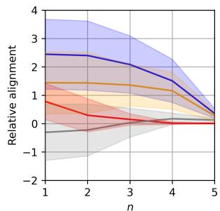

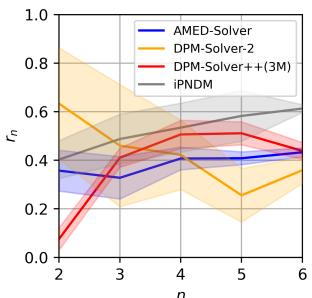  
(a) Relative alignment at time $t _ { n } .$  
(b) Best $r _ { n }$ given by grid search.  
Figure 5. Effectiveness of searching the intermediate time steps. Given a time schedule $\Gamma = \{ t _ { 1 } = \epsilon , \cdot \cdot \cdot , t _ { N } = T \}$ where $\epsilon = 0 . 0 0 2 , T = 8 0 , N = 6$ , we first generate a ground truth trajectory. For each ODE solver, we generate a baseline trajectory by performing evaluations at $s _ { n } = \sqrt { t _ { n } t _ { n + 1 } }$ , and a searched trajectory by a greedy grid search on $r _ { n }$ which gives $s _ { n } = t _ { n } ^ { r _ { n } } t _ { n + 1 } ^ { 1 - r _ { n } }$

Through Fig. 5, we obtain a direct comparison between DPM-Solver-2 and our proposed AMED-Solver since they share the same baseline trajectory when r is fixed to 0.5. Our AMED-Solver aligns better with the ground truth and the location of searched intermediate time steps is much more stable than that of DPM-Solver-2. We speculate that the gradient direction of DPM-Solver-2 restricted by the fixed r (see Tab. 1) is suboptimal. Instead, the learned coefficients provide AMED-Solver more flexibility to determine a better gradient direction.

## 3.4. Training and Sampling

As samples from different sampling trajectories approach the asymmetric data manifold, their current locations should contribute to the corresponding trajectory curvatures [6]. To recognize the sample location without extra computation overhead, we extract the bottleneck feature of the pretrained U-Net model every time after its evaluation. We then take the current and next time step $t _ { n + 1 }$ and $t _ { n }$ along with the bottleneck feature $\mathbf { h } _ { t _ { n + 1 } }$ as the inputs to the AMED predictor $g _ { \phi }$ to predict the intermediate time step $s _ { n }$ and the scaling factor $c _ { n }$ . Formally, we have

$$
\left\{ s _ { n } , c _ { n } \right\} = g _ { \phi } ( \mathbf { h } _ { t _ { n + 1 } } , t _ { n + 1 } , t _ { n } ) .\tag{11}
$$

The network architecture is shown in Fig. 6.

As for sampling from time $t _ { n + 1 }$ to $t _ { n }$ , we first perform one U-Net evaluation at $t _ { n + 1 }$ and extract the bottleneck feature $\mathbf { h } _ { n + 1 }$ to predict $s _ { n }$ and $c _ { n }$ . For AMED-Solver, we obtain $\mathbf { x } _ { s _ { n } }$ by an Euler step from $t _ { n + 1 }$ to $s _ { n }$ and then use Eq. (9) to obtain $\mathbf { x } _ { t _ { n } }$ . When applying AMED-Plugin on other ODE solvers, we step from $t _ { n + 1 }$ to $s _ { n }$ and $s _ { n }$ to $t _ { n }$ following the original solver’s sampling procedure and $c _ { n }$ is used to scale the direction in the latter step. The total NFE is thus $2 ( N - 1 )$ . We denote such a sampling step from $t _ { n + 1 }$ to $t _ { n }$ by

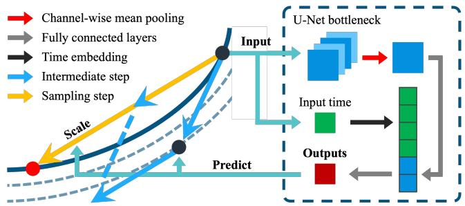  
Figure 6. Network Architecture. Given the bottleneck feature extracted by the U-Net model at time $t _ { n + 1 }$ , we perform the channelwise mean pooling and pass it through two fully connected layers. It is concatenated with the time embedding and goes through one extra fully connected layer and a sigmoid function to output rn and $c _ { n }$ . The intermediate time step is then given by $s _ { n } = t _ { n } ^ { r _ { n } } t _ { n + 1 } ^ { 1 - r _ { n } }$

$$
\begin{array} { r } { \mathbf { x } _ { t _ { n } } = \Phi ( \mathbf { x } _ { t _ { n + 1 } } , t _ { n + 1 } , t _ { n } , \Lambda _ { n } ) , } \end{array}\tag{12}
$$

where $\Lambda _ { n }$ is the set of intermediate time steps $s _ { n } \in$ $\left( { t _ { n } , t _ { n + 1 } } \right)$ and scaling factors $c _ { n }$ introduced in this step.

The training of $g _ { \phi }$ is based on knowledge distillation, where the student and teacher sampling trajectories evaluated at Γ are required, and they are denoted as $\{ \mathbf { x } _ { t _ { n } } \} _ { n = 1 } ^ { N }$ and $\{ \mathbf { y } _ { t _ { n } } \} _ { n = 1 } ^ { N }$ , respectively. We then denote the sampling process that generates student and teacher trajectories by Φs with ${ \Lambda } _ { n } ^ { s } = \{ s _ { n } , c _ { n } \}$ and $\Phi _ { t }$ with $\Lambda _ { n } ^ { t }$ , respectively. Since teacher trajectories require more NFE to give reliable reference, we set the intermediate time steps to be an interpolation of M steps between $t _ { n }$ and $t _ { n + 1 }$ following the original time schedule. Taking the polynomial schedule as example, we set $\Lambda _ { n } ^ { t } = \{ s _ { n } ^ { 1 } \ \cdots , s _ { n } ^ { M } , c _ { n } ^ { 1 } = 1 \ \cdots \ , c _ { n } ^ { M } = 1 \}$ , where

$$
s _ { n } ^ { i } = ( t _ { n } ^ { 1 / \rho } + { \frac { i } { M + 1 } } ( t _ { n + 1 } ^ { 1 / \rho } - t _ { n } ^ { 1 / \rho } ) ) ^ { \rho } .\tag{13}
$$

We train $g _ { \phi }$ using a distance metric $d ( \cdot , \cdot )$ between samples on both trajectories with $\{ s _ { n } , c _ { n } \}$ predicted by $g _ { \phi } \mathrm { . }$

$$
\mathcal { L } _ { t _ { n } } ( \phi ) = d ( \Phi _ { s } ( \mathbf { x } _ { t _ { n + 1 } } , t _ { n + 1 } , t _ { n } , \{ s _ { n } , c _ { n } \} ) , \mathbf { y } _ { t _ { n } } )\tag{14}
$$

In one training loop, we first generate a batch of noise images at $t _ { N }$ and the teacher trajectories. We then calculate the loss and update $g _ { \phi }$ progressively from $t _ { N - 1 }$ to $t _ { 1 }$ . Hence, $N - 1$ backpropagations are applied in one training loop. Algorithms for training and sampling is provided in Algorithm 1 and Algorithm 2.

Algorithm 1 Training of $g _ { \phi }$   
Input: Model parameter $\phi ,$ time schedule $\{ t _ { n } \} _ { n = 1 } ^ { N }$ , ODE   
solver $\Phi _ { s }$ and $\Phi _ { t } .$   
repeat   
Sample $\mathbf x _ { t _ { N } } = \mathbf y _ { t _ { N } } \sim \mathcal N ( \mathbf 0 , t _ { N } ^ { 2 } \mathbf I )$   
Generate a teacher trajectory $\{ \mathbf { y } _ { t _ { n } } \} _ { n = 1 } ^ { N }$ by $\Phi _ { t }$   
for $n = N - 1$ to 1 do   
$\mathbf { x } _ { t _ { n } } \gets \Phi _ { s } ( \mathbf { x } _ { t _ { n + 1 } } , t _ { n + 1 } , t _ { n } , g _ { \phi } ( \mathbf { h } _ { t _ { n + 1 } } , t _ { n + 1 } , t _ { n } ) )$   
# $\mathbf { h } _ { t _ { n + 1 } }$ is extracted after U-Net evaluation at $t _ { n + 1 }$   
$\mathcal { L } _ { t _ { n } } ( \phi ) = d ( \mathbf { x } _ { t _ { n } } , \mathbf { y } _ { t _ { n } } )$   
Update the model parameter $\phi$   
end for   
until convergence

Algorithm 2 AMED Sampling   
Input: Trained AMED predictor $g _ { \phi }$ , time schedule   
$\{ t _ { n } \} _ { n = 1 } ^ { N }$ ODE solver Φ.   
Sample $\mathbf { \bar { x } } _ { t _ { N } } \sim \mathcal { N } ( \mathbf { 0 } , t _ { N } ^ { 2 } \mathbf { I } )$   
for $n = N - 1$ to 1 do   
$\mathbf { x } _ { t _ { n } } \gets \Phi ( \mathbf { x } _ { t _ { n + 1 } } , t _ { n + 1 } , t _ { n } , g _ { \phi } ( \mathbf { h } _ { t _ { n + 1 } } , t _ { n + 1 } , t _ { n } ) )$   
# $\mathbf { h } _ { t _ { n + 1 } }$ is extracted after U-Net evaluation at $t _ { n + 1 }$   
end for   
Output: Generated sample $\mathbf { x } _ { t _ { 1 } }$

Similar to the previous discovery that the sampling trajectory is nearly straight when t is large [6], we notice that the gradient term $\epsilon _ { \theta } ( \mathbf { x } _ { t _ { N } } , t _ { N } )$ at time $t _ { N }$ shares almost the same direction as $\mathbf { x } _ { t _ { N } }$ . We thus simply use $\mathbf { x } _ { t _ { N } }$ as the direction in the first sampling step to save one NFE, which is important when the NFE budget is limited. This trick is called analytical first step (AFS) [10]. We find that the application of AFS yields little degradation or even increase of sample quality for datasets with small resolutions.

Inspired by the concurrent work [49], when applying our AMED-Plugin on DDIM [43], iPNDM [51] and DPM-Solver++ [26] on datasets with small resolution (32×32 and $6 4 \times 6 4 )$ , we optionally train additional time scaling factors $\{ a _ { n } \} _ { n = 1 } ^ { N - 1 }$ through $g _ { \phi }$ to expand the solution space. Given $a _ { n } .$ , we use $\epsilon _ { \theta } ( \mathbf { x } _ { s _ { n } } , a _ { n } s _ { n } )$ instead of $\epsilon _ { \theta } ( \mathbf { x } _ { s _ { n } } , s _ { n } )$ when stepping to $t _ { n } ,$ which improves results in some cases.

## 3.5. Comparing with Distillation-based Methods

Though being a solver-based method, our proposed AMED-Solver shares a similar principal with distillation-based methods. The main difference is that distillation-based methods finally build a mapping from noise to data distribution by fine-tuning the pre-trained model or training a new prediction model from scratch [6, 27, 39, 46], while our AMED-Solver still follows the nature of solving an ODE, building a probability flow from noise to image. Distillation-based methods have shown impressive results of performing high-quality generation by only one NFE [46]. However, these methods require huge efforts on training. One should carefully design the training details and it takes a large amount of time to train the model (usually several or even tens of GPU days). Moreover, as distillation-based models directly build the mapping like typical generative models, they suffer from the inability of interpolating between two disconnected modes [40].

Additionally, our training goal is to properly predict several parameters in the sampling process instead of directly predicting high-dimensional samples at the next time as those distillation-based methods. Therefore, our architecture is very simple and is easy to train thanks to the geometric property of sampling trajectories. Besides, our AMED-Solver maintains the nature of ODE solver-based methods, and does not suffer from obvious internal imperfection for downstream tasks.

## 4. Experiments

## 4.1. Settings

Datasets. We employ AMED-Solver and AMED-Plugin on a wide range of datasets with image resolutions ranging from 32 to 512, including CIFAR10 32×32 [21], FFHQ 64×64 [17], ImageNet 64×64 [37], LSUN Bedroom 256×256 [50]. We also give quantitative and qualitative results on stable-diffusion [34] with resolution of 512.

Models. The pre-trained models are pixel-space models from [18] and [46] and latent-space model from [34].

Solvers. We reimplement several representative fast ODE solvers including DDIM [43], DPM-Solver-2 [25], multistep DPM-Solver++ [26], UniPC [52] and improved PNDM (iPNDM) [23, 51]. It is worth mentioning that we find iPNDM achieves very impressive results and outperforms other ODE solvers in many cases.

Time schedule. We mainly use the polynomial time schedule with $\rho = 7 ,$ , which is the default setting in [18], except for DPM-Solver++ and UniPC where we use logSNR schedule recommended in original papers [26, 52] for better results. Besides, for AMED-Solver on CIFAR10 32×32 [21], FFHQ 64×64 [17] and ImageNet 64×64 [37], we use uniform time schedule which is widely used in papers with a DDPM backbone [15].

Training. The total parameter of the AMED predictor $g _ { \phi }$ is merely 9k. We train $g _ { \phi }$ for 10k images, which takes 2-8 minutes on CIFAR10 and 1-3 hours on LSUN Bedroom using a single NVIDIA A100 GPU. L2 norm is used as the distance metric in Eq. (14) for all experiments. We use DPM-Solver-2 [25] or EDM [18] with doubled NFE (M = 1) to generate teacher trajectories for AMED-Solver, while using the same solver that generates student trajectories for AMED-Plugin, with M = 1 for DPM-Solver-2 and $M = 2$ else. Detailed discussion is provided in Appendix C.2.

<table><tr><td rowspan="2">Method</td><td colspan="4">NFE</td></tr><tr><td>3</td><td>5</td><td>7</td><td>9</td></tr><tr><td colspan="5">Multi-step solvers</td></tr><tr><td>DPM-Solver++(3M) [26]</td><td>110.0</td><td>24.97</td><td>6.74</td><td>3.42</td></tr><tr><td>UniPC [52]</td><td>109.6</td><td>23.98</td><td>5.83</td><td>3.21</td></tr><tr><td>iPNDM [23, 51]</td><td>47.98</td><td>13.59</td><td>5.08</td><td>3.17</td></tr><tr><td colspan="5">Single-step solvers</td></tr><tr><td>DDIM [43]</td><td>93.36</td><td>49.66</td><td>27.93</td><td>18.43</td></tr><tr><td>EDM [18]</td><td>306.2</td><td>97.67</td><td>37.28</td><td>15.76</td></tr><tr><td>DPM-Solver-2 [25]</td><td>155.7</td><td>57.30</td><td>10.20</td><td>4.98</td></tr><tr><td>AMED-Solver (ours)</td><td>18.49</td><td>7.59</td><td>4.36</td><td>3.67</td></tr><tr><td>AMED-Plugin (ours)</td><td>10.81†</td><td>6.61†</td><td>3.65†</td><td>2.63†</td></tr></table>

(a) Unconditional generation on CIFAR10 32×32. We show the results of AMED-Plugin applied on iPNDM.

<table><tr><td rowspan="2">Method</td><td colspan="4">NFE</td></tr><tr><td>3</td><td>5</td><td>7</td><td>9</td></tr><tr><td colspan="5">Multi-step solvers</td></tr><tr><td>DPM-Solver++(3M) [26]</td><td>86.45</td><td>22.51</td><td>8.44</td><td>4.77</td></tr><tr><td>UniPC [52]</td><td>86.43</td><td>21.40</td><td>7.44</td><td>4.47</td></tr><tr><td>iPNDM [23, 51]</td><td>45.98</td><td>17.17</td><td>7.79</td><td>4.58</td></tr><tr><td colspan="5">Single-step solvers</td></tr><tr><td>DDIM [43]</td><td>78.21</td><td>43.93</td><td>28.86</td><td>21.01</td></tr><tr><td>DPM-Solver-2 [25]</td><td>266.0</td><td>87.10</td><td>22.59</td><td>9.26</td></tr><tr><td>AMED-Solver (ours)</td><td>47.31</td><td>14.80</td><td>8.82</td><td>6.31</td></tr><tr><td>AMED-Plugin (ours)</td><td>26.87</td><td>12.49</td><td>6.64</td><td>4.24†</td></tr></table>

<table><tr><td rowspan="2">Method</td><td colspan="4">NFE</td></tr><tr><td>3</td><td>5</td><td>7</td><td>9</td></tr><tr><td colspan="5">Multi-step solvers</td></tr><tr><td>DPM-Solver++(3M) [26]</td><td>91.52</td><td>25.49</td><td>10.14</td><td>6.48</td></tr><tr><td>UniPC [52]</td><td>91.38</td><td>24.36</td><td>9.57</td><td>6.34</td></tr><tr><td>iPNDM [23, 51]</td><td>58.53</td><td>18.99</td><td>9.17</td><td>5.91</td></tr><tr><td colspan="5">Single-step solvers</td></tr><tr><td>DDIM [43]</td><td>82.96</td><td>43.81</td><td>27.46</td><td>19.27</td></tr><tr><td>EDM [18]</td><td>249.4</td><td>89.63</td><td>37.65</td><td>16.76</td></tr><tr><td>DPM-Solver-2 [25]</td><td>140.2</td><td>42.41</td><td>12.03</td><td>6.64</td></tr><tr><td>AMED-Solver (ours)</td><td>38.10</td><td>10.74</td><td>6.66</td><td>5.44</td></tr><tr><td>AMED-Plugin (ours)</td><td>28.06</td><td>13.83</td><td>7.81</td><td>5.60</td></tr></table>

(b) Conditional generation on ImageNet 64×64. We show the results of AMED-Plugin applied on iPNDM.

(c) Unconditional generation on FFHQ 64×64. We show the results of AMED-Plugin applied on iPNDM.
<table><tr><td rowspan="2">Method</td><td colspan="4">NFE</td></tr><tr><td>3</td><td>5</td><td>7</td><td>9</td></tr><tr><td colspan="5">Multi-step solvers</td></tr><tr><td>DPM-Solver++(3M) [26]</td><td>111.9</td><td>23.15</td><td>8.87</td><td>6.45</td></tr><tr><td>UniPC [52]</td><td>112.3</td><td>23.34</td><td>8.73</td><td>6.61</td></tr><tr><td>iPNDM [23, 51]</td><td>80.99</td><td>26.65</td><td>13.80</td><td>8.38</td></tr><tr><td colspan="5">Single-step solvers</td></tr><tr><td>DDIM [43]</td><td>86.13</td><td>34.34</td><td>19.50</td><td>13.26</td></tr><tr><td>DPM-Solver-2 [25]</td><td>210.6</td><td>80.60</td><td>23.25</td><td>9.61</td></tr><tr><td>AMED-Solver (ours)</td><td>58.21</td><td>13.20</td><td>7.10</td><td>5.65</td></tr><tr><td>AMED-Plugin (ours)</td><td>101.5</td><td>25.68</td><td>8.63</td><td>7.82</td></tr></table>

(d) Unconditional generation on LSUN Bedroom 256×256. We show the results of AMED-Plugin applied on DPM-Solver-2.

Sampling. Our AMED-Solver and AMED-Plugin naturally create solvers with even NFE. Once AFS is used, the total NFE becomes odd. With the goal of designing fast solvers with the small NFE, we mainly test our method on NFE $\in \{ 3 , 5 , 7 , 9 \}$ where AFS is applied. More results on NFE $\in \{ 4 , 6 , 8 , 1 0 \}$ without AFS is provided in Appendix C.4. Evaluation. We measure the sample quality via Frechet ´ Inception Distance (FID) [14] with 50k images. For Stable-Diffusion, we follow [33] and evaluate the FID value by 30k images generated by 30k fixed prompts sampled from the MS-COCO [22] validation set.

## 4.2. Image Generation

In this section, we show the results of image generation. For datasets with small resolution such as CIFAR10 32×32, FFHQ 64×64 and ImageNet 64×64, we report the results of AMED-Plugin on iPNDM solver for its leading results. For large-resolution datasets like LSUN Bedroom, we report the results of AMED-Plugin on DPM-Solver-2 since the use of AFS causes inferior results for multi-step solvers in this case (see Appendix C.4 for a detailed discussion). We implement DPM-Solver++ and UniPC with order of 3, iPNDM with order of 4. To report results of DPM-Solver-2 and EDM with odd NFE, we apply AFS in their first steps.

Table 2. Results of image generation. Our proposed AMED-Solver and AMED-Plugin achieve state-of-the-art results among solver-based methods in around 5 NFE. †: additional time scaling factors $\{ a _ { n } \} _ { n = 1 } ^ { N - 1 }$ are trained.
<table><tr><td rowspan="2">Method</td><td colspan="4">NFE (1 step = 2 NFE)</td></tr><tr><td>8</td><td>12</td><td>16</td><td>20</td></tr><tr><td>DPM-Solver++(2M) [26]</td><td>21.33</td><td>15.99</td><td>14.84</td><td>14.58</td></tr><tr><td>AMED-Plugin (ours)</td><td>18.92</td><td>14.84</td><td>13.96</td><td>13.24</td></tr></table>

Table 3. FID results on Stable-Diffusion [34]. The AMED-Plugin is applied on DPM-Solver++(2M).

The results are shown in Tab. 2. Our AMED-Solver outperforms other single-step methods and can even beat multistep methods in many cases. For the AMED-Plugin, we find it showing large boost when applied on various solvers especially for DPM-Solver-2 as shown in Tab. 2d. Notably, the AMED-Plugin on iPNDM improves the FID by 6.98, 4.68 and 5.16 on CIFAR10 32×32, ImageNet 64×64 and FFHQ 64×64 in 5 NFE. Our methods achieve state-of-theart results in solver-based methods in around 5 NFE.

As for Stable-Diffusion [34], we use the v1.4 checkpoint with default guidance scale 7.5. Samples are generated by DPM-Solver++(2M) as recommended in the official implementation. The quantitative results are shown in Tab. 3.

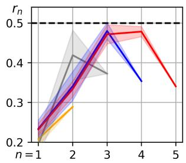

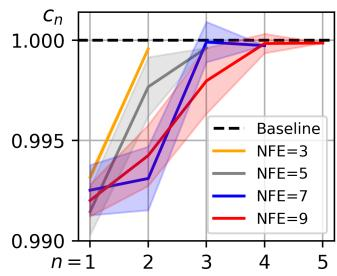  
Figure 7. The learned coefficients $r _ { n }$ and $c _ { n }$ vary in different steps and the mean values are consistently lower than the default setting.

<table><tr><td rowspan="2">Teacher Solver</td><td colspan="4">NFE</td></tr><tr><td>3</td><td>5</td><td>7</td><td>9</td></tr><tr><td colspan="5">AMED-Solver</td></tr><tr><td>DPM-Solver++(3M) [26]</td><td>35.68</td><td>12.34</td><td>11.28</td><td>9.65</td></tr><tr><td>iPNDM [23, 51]</td><td>32.38</td><td>12.42</td><td>10.09</td><td>8.54</td></tr><tr><td>DPM-Solver-2 [25]</td><td>18.49</td><td>11.60</td><td>11.64</td><td>9.23</td></tr><tr><td>EDM [18]</td><td>28.99</td><td>7.59</td><td>4.36</td><td>3.67</td></tr><tr><td colspan="5">AMED-Plugin on iPNDM</td></tr><tr><td>DPM-Solver++(3M) [26]</td><td>16.00</td><td>7.57</td><td>4.28</td><td>2.85</td></tr><tr><td>iPNDM [23, 51]</td><td>10.81</td><td>6.61</td><td>3.65</td><td>2.63</td></tr><tr><td>DPM-Solver-2 [25]</td><td>12.07</td><td>8.19</td><td>4.52</td><td>2.66</td></tr><tr><td>EDM [18]</td><td>29.62</td><td>10.58</td><td>9.36</td><td>4.44</td></tr></table>

Table 4. Comparison of teacher solvers on CIFAR10.

In Fig. 7, we show the learned parameters of $g _ { \phi }$ for AMED-Solver, where $r _ { n }$ and $c _ { n }$ are predicted by $g _ { \phi }$ and $s _ { n } = t _ { n } ^ { r _ { n } } t _ { n + 1 } ^ { 1 - r _ { n } }$ . The dashed line denotes the default setting of DPM-Solver-2. We provide more quantitative as well as qualitative results in Appendix C.

## 4.3. Ablation Study

Teacher solvers. In Tab. 4, we test AMED-Solver and AMED-Plugin on iPNDM with different teacher solvers for the training of $g _ { \phi }$ on CIFAR10. It turns out that the best results are achieved when teacher solver resembles the student solver in the sampling process.

Time schedule. We observe that different fast ODE solvers have different preference on time schedules. This preference even depends on the used dataset. In Tab. 5, we provide results for DPM-Solver++(3M) [26] on CIFAR10 with different time schedules and find that this solver prefers logSNR schedule where the interval between the first and second time step is larger than other tested schedules. As a comparison, our AMED-Plugin applied on these cases largely and consistently improves the results, irrespective of the specific time schedule.

## 5. Conclusion

In this paper, we introduce a single-step ODE solver called AMED-Solver to minimize the discretization error for fast diffusion sampling. Our key observation is that each sampling trajectory generated by existing ODE solvers approximately lies in a two-dimensional subspace, and thus the mean value theorem guarantees the learning of an approximate mean direction. The AMED-Solver effectively mitigates the problem of rapid sample quality degradation, which is commonly encountered in single-step methods, and shows promising results on datasets with large resolution. We also generalize the idea of AMED-Solver to AMED-Plugin, a plugin that can be applied on any fast ODE solvers to further improve the sample quality. We validate our methods through extensive experiments, and our methods achieve state-of-the-art results in extremely small NFE (around 5). We hope our attempt could inspire future works to further release the potential of fast solvers for diffusion models.

<table><tr><td rowspan="2">Time schedule</td><td colspan="4">NFE</td></tr><tr><td>3</td><td>5</td><td>7</td><td>9</td></tr><tr><td colspan="5">DPM-Solver++(3M)</td></tr><tr><td>Uniform</td><td>76.80</td><td>26.90</td><td>16.80</td><td>13.44</td></tr><tr><td>Polynomial</td><td>70.04</td><td>31.66</td><td>11.30</td><td>6.45</td></tr><tr><td>logSNR</td><td>110.0</td><td>24.97</td><td>6.74</td><td>3.42</td></tr><tr><td colspan="5">AMED-Plugin on DPM-Solver++(3M)</td></tr><tr><td>Uniform</td><td>33.61</td><td>13.24</td><td>8.89</td><td>8.24</td></tr><tr><td>Polynomial</td><td>32.47</td><td>19.59</td><td>9.60</td><td>4.39</td></tr><tr><td>logSNR</td><td>25.95</td><td>7.68</td><td>4.51</td><td>3.03</td></tr></table>

Table 5. FID results under different time schedules on CI-FAR10. The DPM-Solver++(3M) shows preference on the uniform logSNR schedule given larger NFE. Our AMED-Plugin consistently improves the results.

Limitation and Future Work. Fast ODE solvers for diffusion models are highly sensitive to time schedules especially when the NFE budget is limited (See Tab. 5). Through experiments, we observe that any fixed time schedule fails to perform well in all situations. In fact, our AMED-Plugin can be treated as adjusting half of the time schedule to partly alleviates but not avoids this issue. We believe that a better designation of time schedule requires further knowledge to the geometric shape of the sampling trajectory [6]. We leave this to the future work.

## 6. Acknowledgement

The authors would like to thank Jianlin Su and anonymous reviewers for their helpful comments. This work is supported by the Starry Night Science Fund of Zhejiang University Shanghai Institute for Advanced Study, China (Grant No: SN-ZJU-SIAS-001), National Natural Science Foundation of China (Grant No: U1866602) and the advanced computing resources provided by the Supercomputing Center of Hangzhou City University.

## References

[1] Brian DO Anderson. Reverse-time diffusion equation models. Stochastic Processes and their Applications, 12(3):313– 326, 1982. 2

[2] Kendall Atkinson, Weimin Han, and David E Stewart. Numerical solution ofordinary differential equations. John Wiley & Sons, 2011. 1, 3

[3] Fan Bao, Chongxuan Li, Jun Zhu, and Bo Zhang. Analyticdpm: an analytic estimate of the optimal reverse variance in diffusion probabilistic models. arXiv preprint arXiv:2201.06503, 2022. 11

[4] David Berthelot, Arnaud Autef, Jierui Lin, Dian Ang Yap, Shuangfei Zhai, Siyuan Hu, Daniel Zheng, Walter Talbot, and Eric Gu. Tract: Denoising diffusion models with transitive closure time-distillation. arXiv preprint arXiv:2303.04248, 2023. 1, 2, 11

[5] Mikołaj Binkowski, Danica J Sutherland, Michael Arbel, and´ Arthur Gretton. Demystifying mmd gans. arXiv preprint arXiv:1801.01401, 2018. 11

[6] Defang Chen, Zhenyu Zhou, Jian-Ping Mei, Chunhua Shen, Chun Chen, and Can Wang. A geometric perspective on diffusion models. arXiv preprint arXiv:2305.19947, 2023. 2, 3, 5, 6, 8

[7] Elliott Ward Cheney, EW Cheney, and W Cheney. Analysis for applied mathematics. Springer, 2001. 4

[8] Giannis Daras, Yuval Dagan, Alexandros G Dimakis, and Constantinos Daskalakis. Consistent diffusion models: Mitigating sampling drift by learning to be consistent. arXiv preprint arXiv:2302.09057, 2023. 11

[9] Prafulla Dhariwal and Alex Nichol. Diffusion models beat gans on image synthesis. In Advances in Neural Information Processing Systems, 2021. 1, 11, 13

[10] Tim Dockhorn, Arash Vahdat, and Karsten Kreis. Genie: Higher-order denoising diffusion solvers. In Advances in Neural Information Processing Systems, 2022. 1, 6, 11, 13

[11] William Feller. On the theory of stochastic processes, with particular reference to applications. In Proceedings of the First Berkeley Symposium on Mathematical Statistics and Probability, pages 403–432, 1949. 2

[12] Ian Goodfellow, Jean Pouget-Abadie, Mehdi Mirza, Bing Xu, David Warde-Farley, Sherjil Ozair, Aaron Courville, and Yoshua Bengio. Generative adversarial nets. Advances in neural information processing systems, 27, 2014. 1, 11

[13] Jiatao Gu, Shuangfei Zhai, Yizhe Zhang, Lingjie Liu, and Josh Susskind. Boot: Data-free distillation of denoising diffusion models with bootstrapping. arXiv preprint arXiv:2306.05544, 2023. 11

[14] Martin Heusel, Hubert Ramsauer, Thomas Unterthiner, Bernhard Nessler, and Sepp Hochreiter. GANs trained by a two time-scale update rule converge to a local Nash equilibrium. In Advances in Neural Information Processing Systems, pages 6626–6637, 2017. 7, 12

[15] Jonathan Ho, Ajay Jain, and Pieter Abbeel. Denoising diffusion probabilistic models. In Advances in Neural Information Processing Systems, 2020. 1, 2, 6, 11

[16] Aapo Hyvarinen. Estimation of non-normalized statistical¨ models by score matching. Journal of Machine Learning Research, 6:695–709, 2005. 2

[17] Tero Karras, Samuli Laine, and Timo Aila. A style-based generator architecture for generative adversarial networks. In Proceedings ofthe IEEE/CVF conference on computer vision and pattern recognition, pages 4401–4410, 2019. 3, 6, 11

[18] Tero Karras, Miika Aittala, Timo Aila, and Samuli Laine. Elucidating the design space of diffusion-based generative models. In Advances in Neural Information Processing Systems, 2022. 1, 2, 3, 4, 6, 7, 8, 11, 12

[19] Diederik P Kingma and Max Welling. Auto-encoding variational bayes. arXiv preprint arXiv:1312.6114, 2013. 1, 11

[20] Diederik P Kingma, Tim Salimans, Ben Poole, and Jonathan Ho. Variational diffusion models. In Advances in Neural Information Processing Systems, 2021. 2

[21] Alex Krizhevsky and Geoffrey Hinton. Learning multiple layers of features from tiny images. Technical Report, 2009. 3, 6, 11

[22] Tsung-Yi Lin, Michael Maire, Serge Belongie, James Hays, Pietro Perona, Deva Ramanan, Piotr Dollar, and C Lawrence´ Zitnick. Microsoft coco: Common objects in context. In Computer Vision–ECCV 2014: 13th European Conference, Zurich, Switzerland, September 6-12, 2014, Proceedings, Part V 13, pages 740–755. Springer, 2014. 7, 12

[23] Luping Liu, Yi Ren, Zhijie Lin, and Zhou Zhao. Pseudo numerical methods for diffusion models on manifolds. In International Conference on Learning Representations, 2022. 1, 2, 3, 4, 6, 7, 8, 11, 12, 13, 14

[24] Xingchao Liu, Chengyue Gong, and Qiang Liu. Flow straight and fast: Learning to generate and transfer data with rectified flow. arXiv preprint arXiv:2209.03003, 2022. 1, 2, 11

[25] Cheng Lu, Yuhao Zhou, Fan Bao, Jianfei Chen, Chongxuan Li, and Jun Zhu. Dpm-solver: A fast ode solver for diffusion probabilistic model sampling in around 10 steps. In Advances in Neural Information Processing Systems, 2022. 1, 2, 3, 4, 6, 7, 8, 11, 12, 13, 14

[26] Cheng Lu, Yuhao Zhou, Fan Bao, Jianfei Chen, Chongxuan Li, and Jun Zhu. Dpm-solver++: Fast solver for guided sampling of diffusion probabilistic models. arXiv preprint arXiv:2211.01095, 2022. 1, 2, 6, 7, 8, 11, 12, 13, 14, 15

[27] Eric Luhman and Troy Luhman. Knowledge distillation in iterative generative models for improved sampling speed. arXiv preprint arXiv:2101.02388, 2021. 1, 2, 3, 6, 11

[28] Siwei Lyu. Interpretation and generalization of score matching. In Proceedings of the Twenty-Fifth Conference on Uncertainty in Artificial Intelligence, pages 359–366, 2009. 2

[29] Dimitra Maoutsa, Sebastian Reich, and Manfred Opper. Interacting particle solutions of fokker–planck equations through gradient–log–density estimation. arXiv preprint arXiv:2006.00702, 2020. 2

[30] Alexander Quinn Nichol and Prafulla Dhariwal. Improved denoising diffusion probabilistic models. In International Conference on Machine Learning, pages 8162–8171. PMLR, 2021. 11

[31] Bernt Oksendal. Stochastic differential equations: an introduction with applications. Springer Science & Business Media, 2013. 2

[32] Eckhard Platen and Nicola Bruti-Liberati. Numerical solution of stochastic differential equations with jumps in finance. Springer Science & Business Media, 2010. 11

[33] Aditya Ramesh, Mikhail Pavlov, Gabriel Goh, Scott Gray, Chelsea Voss, Alec Radford, Mark Chen, and Ilya Sutskever. Zero-shot text-to-image generation. In International conference on machine learning, pages 8821–8831. Pmlr, 2021. 7, 12

[34] Robin Rombach, Andreas Blattmann, Dominik Lorenz, Patrick Esser, and Bjorn Ommer. High-resolution image¨ synthesis with latent diffusion models. In Proceedings of the IEEE/CVF Conference on Computer Vision and Pattern Recognition, pages 10684–10695, 2022. 1, 6, 7, 11, 13

[35] Olaf Ronneberger, Philipp Fischer, and Thomas Brox. Unet: Convolutional networks for biomedical image segmentation. In Medical Image Computing and Computer-Assisted Intervention–MICCAI 2015: 18th International Conference, Munich, Germany, October 5-9, 2015, Proceedings, Part III 18, pages 234–241. Springer, 2015. 2

[36] Nataniel Ruiz, Yuanzhen Li, Varun Jampani, Yael Pritch, Michael Rubinstein, and Kfir Aberman. Dreambooth: Fine tuning text-to-image diffusion models for subject-driven generation. In Proceedings of the IEEE/CVF Conference on Computer Vision and Pattern Recognition, pages 22500– 22510, 2023. 1

[37] Olga Russakovsky, Jia Deng, Hao Su, Jonathan Krause, Sanjeev Satheesh, Sean Ma, Zhiheng Huang, Andrej Karpathy, Aditya Khosla, Michael S. Bernstein, Alexander C. Berg, and Fei-Fei Li. Imagenet large scale visual recognition challenge. International Journal of Computer Vision, 115(3): 211–252, 2015. 3, 6, 11, 13

[38] Chitwan Saharia, William Chan, Saurabh Saxena, Lala Li, Jay Whang, Emily L Denton, Kamyar Ghasemipour, Raphael Gontijo Lopes, Burcu Karagol Ayan, Tim Salimans, et al. Photorealistic text-to-image diffusion models with deep language understanding. In Advances in Neural Information Processing Systems, pages 36479–36494, 2022. 1

[39] Tim Salimans and Jonathan Ho. Progressive distillation for fast sampling of diffusion models. In International Conference on Learning Representations, 2022. 1, 2, 3, 6, 11

[40] Antoine Salmona, Valentin De Bortoli, Julie Delon, and Agnes Desolneux. Can push-forward generative models fit\` multimodal distributions? Advances in Neural Information Processing Systems, 35:10766–10779, 2022. 6

[41] Simo Sarkk¨ a and Arno Solin.¨ Applied stochastic differential equations. Cambridge University Press, 2019. 16

[42] Jascha Sohl-Dickstein, Eric Weiss, Niru Maheswaranathan, and Surya Ganguli. Deep unsupervised learning using nonequilibrium thermodynamics. In International conference on machine learning, pages 2256–2265. PMLR, 2015. 1

[43] Jiaming Song, Chenlin Meng, and Stefano Ermon. Denoising diffusion implicit models. In International Conference on Learning Representations, 2021. 1, 2, 3, 4, 6, 7, 11, 12, 14

[44] Yang Song and Stefano Ermon. Generative modeling by estimating gradients of the data distribution. In Advances in Neural Information Processing Systems, 2019. 11

[45] Yang Song, Jascha Sohl-Dickstein, Diederik P. Kingma, Abhishek Kumar, Stefano Ermon, and Ben Poole. Score-based generative modeling through stochastic differential equations. In International Conference on Learning Representations, 2021. 1, 2, 11

[46] Yang Song, Prafulla Dhariwal, Mark Chen, and Ilya Sutskever. Consistency models. In International Conference on Machine learning, 2023. 1, 2, 3, 6, 11

[47] Roman Vershynin. High-dimensional probability: An introduction with applications in data science. Cambridge university press, 2018. 16

[48] Daniel Watson, William Chan, Jonathan Ho, and Mohammad Norouzi. Learning fast samplers for diffusion models by differentiating through sample quality. In International Conference on Learning Representations, 2021. 11

[49] Mengfei Xia, Yujun Shen, Changsong Lei, Yu Zhou, Ran Yi, Deli Zhao, Wenping Wang, and Yong-jin Liu. Towards more accurate diffusion model acceleration with a timestep aligner. arXiv preprint arXiv:2310.09469, 2023. 6

[50] Fisher Yu, Ari Seff, Yinda Zhang, Shuran Song, Thomas Funkhouser, and Jianxiong Xiao. Lsun: Construction of a large-scale image dataset using deep learning with humans in the loop. arXiv preprint arXiv:1506.03365, 2015. 3, 6, 11, 13

[51] Qinsheng Zhang and Yongxin Chen. Fast sampling of diffusion models with exponential integrator. In International Conference on Learning Representations, 2023. 1, 2, 3, 4, 6, 7, 8, 11, 12, 13, 14

[52] Wenliang Zhao, Lujia Bai, Yongming Rao, Jie Zhou, and Jiwen Lu. Unipc: A unified predictor-corrector framework for fast sampling of diffusion models. arXiv preprint arXiv:2302.04867, 2023. 2, 6, 7, 11, 13, 14