# FlowIE: Efficient Image Enhancement via Rectified Flow

Yixuan Zhu1\* Wenliang Zhao1\* Ao Li2 Yansong Tang2 Jie Zhou1 Jiwen Lu1,†

1Department of Automation, Tsinghua University 2Tsinghua Shenzhen International Graduate School, Tsinghua University

## Abstract

Image enhancement holds extensive applications in realworld scenarios due to complex environments and limitations of imaging devices. Conventional methods are often constrained by their tailored models, resulting in diminished robustness when confronted with challenging degradation conditions. In response, we propose FlowIE, a simple yet highly effective flow-based image enhancement framework that estimates straight-line paths from an elementary distribution to high-quality images. Unlike previous diffusion-based methods that suffer from long-time inference, FlowIE constructs a linear many-to-one transport mapping via conditioned rectified flow. The rectification straightens the trajectories ofprobability transfer, accelerating inference by an order of magnitude. This design enables our FlowIE tofully exploit rich knowledge in the pretrained diffusion model, rendering it well-suitedfor various real-world applications. Moreover, we devise afaster inference algorithm, inspired by Lagrange’s Mean Value Theorem, harnessing midpoint tangent direction to optimize path estimation, ultimately yielding visually superior results. Thanks to these designs, our FlowIE adeptly manages a diverse range of enhancement tasks within a concise sequence of fewer than 5 steps. Our contributions are rigorously validated through comprehensive experiments on synthetic and real-world datasets, unveiling the compelling efficacy and efficiency of our proposed FlowIE. Code is available at https://github.com/EternalEvan/FlowIE.

## 1. Introduction

The goal of image enhancement is to improve the visual quality of images afflicted by a wide range of factors, covering tasks like denoising, deblurring, super-resolution and inpainting. This field has garnered substantial attention for its vast utility in image restoration, camera designing, filmmaking and other domains. Recent years have witnessed notable advancements in image enhancement and a series of methods [3, 4, 7, 22, 38, 43, 44], based on deep learning has been introduced to produce high-quality outcomes. They exhibit commendable performance when confronted with specific and well-defined degradations. However, their efficacy becomes circumscribed when extended to intricate and unpredictable challenges posed by complex real-world scenarios. In practice terms, we aim to design a robust and efficient framework that excels in image enhancement, proficiently restoring general images affected by a diverse spectrum of real-world degradations.

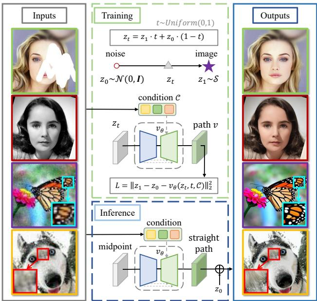  
Figure 1. The diagram of the proposed FlowIE. FlowIE leverages rectified flow to unleash the rich knowledge in the trained diffusion model and build straight-line paths between element distribution and clean images. The framework consistently achieves visually stunning results in a minimal number of steps and seamlessly generalizes to various image enhancement tasks, e.g., face inpainting, color enhancement and blind image super-resolution.

The challenge of image enhancement is fundamentally ill-posed, given the absence of explicit constraints governing the restoration process, thus permitting various plausible high-quality (HQ) results from the low-quality (LQ) inputs. To address this intricate problem, researchers explore approaches based on deep learning models that offer strong priors to guide the enhancement. We roughly categorize them into predictive [13, 18, 45], GAN-based [11, 33, 35, 42, 46] and diffusion-based [10, 20, 23, 36] methods. Predictive methods seek to explicitly model the blur kernel from LQ images and restore HQ images with these predicted parameters. However, their adaptability to the complexity of real-world conditions remains limited due to the simple degradation setting and the vulnerable estimated results. To improve the enhancement quality, some approaches employ the Generative Adversarial Network (GAN) [12] to implicitly learn the data distribution and degradation model. GAN-based methods like [46] and [35] achieve considerable results with the image priors from GANs and high-order degradation models. Nevertheless, the tuning of GAN-based methods poses a persistent challenge attributed to their complex losses and hyper-parameters. More recently, Diffusion Models (DMs) [16, 28] have demonstrated remarkable capabilities in synthesizing visually compelling images. Following this line, some methods leverage the strong generative prior from the pre-trained diffusion model to attain highquality restorations. For example, [20], [36] and [10] devise zero-shot techniques, which involve the direct utilization of diffusion model weights without training. Other methods like [23, 30] fine-tune the diffusion model to better suit enhancement tasks. Though diffusion-based methods yield impressive outcomes, they are hampered by high computational demands and protracted inference times, rendering them less practical for industrial applications.

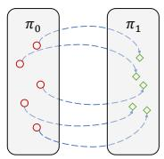  
(a) Diffusion model

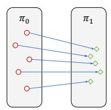  
(b) Rectified flow

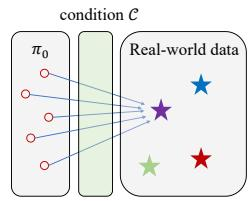  
(c) FlowIE (Ours)  
Figure 2. As shown in (a), diffusion models [16, 28] solve ODEs in curve trajectories. Differently, rectified flow [25], illustrated in (b), bridges one-to-one straight paths between two distributions, thereby reducing the inference steps. (c) Our proposed FlowIE applies the flow-based framework to real-world data and discards the massive data preparation process. We construct a many-to-one mapping that predicts straight paths to clean images from arbitrary noise in an elementary distribution with proper guidance.

To overcome the aforementioned challenges, we propose a simple yet potent framework named FlowIE for diverse real-world image enhancement tasks. FlowIE dramatically reduces the inference time by a magnitude of tenfold compared to diffusion-based methods while upholding the exceptional quality of the enhancements, as showcased in Figure 1. Our primary objection is to harness the generative priors of pre-trained diffusion for restoring images beset by general degradation. Diverging from existing diffusionbased methods, we abandon the extensive denoising steps in diffusion sampling via conditioned rectified flow. This approach straightens the trajectories of probability transfer during diffusion sampling, offering a swift and unified solution for the distribution transport in diffusion models. Once the straight path from an elementary distribution to the real-world HQ image is accurately estimated, we can yield a computationally efficient model since it is the shortest path between two points. However, rectified flow cannot directly adapt to enhancement tasks, given its one-toone noise-image mapping paradigm and reliance on training with synthetic images that differ significantly from realworld data. To address these limitations, we employ rectified flow to predict paths from any noise to one real-world image, thus constructing a many-to-one transport mapping, as shown in Figure 2. This relaxation of rectified flow allows us to avoid the expansive data pair preparation process and effectively unleashes the generative potential inherent in the pre-trained diffusion model for image enhancement tasks. After learning from real-world data, our framework can determine a nearly straight path toward the target result. To further refine the prediction accuracy, we devise a mean value sampling inspired by Lagrange’s Mean Value Theorem to estimate the path with higher precision from a midpoint along the transport path.

We mainly evaluate our method on two representative image enhancement tasks covering: 1) blind face restoration (BFR) and 2) blind image super-resolution (BSR). We show that our FlowIE can play as an effective enhancer for degraded images, effectively catering to a broad spectrum of tasks. Our model attains 19.81 FID and 0.69 IDS on syn thetic CelebA-Test [26], establishing new state-of-the-art on these two benchmarks. On real-world LFW-Test [34] and WIDER-Test datasets [47], our model achieves 38.66 and 32.41 FID, respectively, exhibiting high restoration quality in the real-world condition. After tuning on ImageNet [5], we obtain 0.5953 MANIQA on RealSRSet [1] and 0.6087 on our Collect-100, highlighting our effectiveness in general image restoration. Except for higher metrics compared with other diffusion-based methods, we showcase an almost 10 times faster inference speed thanks to rectified flow. To explore the potential of FlowIE on further tasks, we extend the application of FlowIE to face color enhancement and inpainting with only 5K steps of fine-tuning. FlowIE consistently delivers visually appealing and plausible enhancements, underscoring its robust generalization capability.

## 2. Related Works

Predictive Methods. Image enhancement consists of various manipulations and refinements, including denoising, super-resolution (SR), inpainting, etc. Some works utilize predictive models to address these tasks. Notably, convolution-based methods [7, 8, 18, 45] adopt explicit approaches for SR task by estimating the blur kernels and restoring HQ images with the predicted kernels. On the other hand, With the advent of vision transformers [9, 27], some methods [3, 22] propose frameworks incorporating attention-based architectures, yielding high-quality results on SR, denoising, and deraining tasks. Although predictive approaches pave the way for various enhancement tasks, they still struggle to handle complex real-world conditions due to their simple degradation settings during training.

GAN-based Methods. In addition to predictive methods, another line of work explores employing generative models like GAN [12] to provide embedded image priors. GANbased methods [11, 33, 35, 42, 46] learn how to process images in the latent space, showcasing notable achievements in tasks such as BSR. Moreover, works like [34, 41, 47] leverage GAN priors for the BFR task and yield satisfying outcomes. However, GAN-based methods exhibit some drawbacks like the potential for unstable results and the necessity for meticulous hyper-parameter tuning. Furthermore, their architectures are often tailored to specific tasks, limiting their adaptability across diverse applications.

Diffusion-based Methods. Diffusion models [16, 28] are well-known for their powerful image synthesis capability and robust training procedure. To harness the image priors of the pre-trained diffusion model, methods such as [10, 20, 36] propose training-free approaches to enhance image quality in a zero-shot manner, showcasing the adaptability of diffusion models across various tasks. In a parallel line of research, supervised approaches like [23, 30, 37] pave the way to fine-tune the diffusion model, improving its generative potential. Despite achieving visually appealing results, diffusion-based methods suffer from long-time sampling due to repeated model inference. To mitigate the time-consuming problem and fully exploit the generative priors within the pre-trained diffusion model, we devise a novel flow-based framework designed for diverse image enhancement tasks. Our framework utilizes the rich knowledge from the pre-trained diffusion model and accelerates the inference via a flow-based approach, which straightens the transport trajectories from an elementary distribution to real-world data and thereby realizes efficient inference.

## 3. Method

In this section, we present FlowIE, a simple flow-based framework that fully exploits the generative diffusion prior for efficient image enhancement. We will start by providing a brief background on rectified flow and then delve into the key designs of FlowIE. This includes the construction of a flow-based enhancement model, the design of appropriate conditions as guidance, quality improvements through mean value sampling, and detailed implementations. The overall pipeline of FlowIE is depicted in Figure 3.

## 3.1. Preliminaries: Rectified Flow

We commence by briefly introducing rectified flow [24, 25]. Rectified flow is a series of methods for solving the transport mapping problem: given observations of two distributions $X _ { 0 } \sim \pi _ { 0 } , X _ { 1 } \sim \pi _ { 1 }$ on $\mathbb { R } ^ { d }$ , find a transport map $T : \mathbb { R } ^ { d }  \mathbb { R } ^ { d }$ , such that $T ( X _ { 0 } ) \sim \pi _ { 1 }$ when $X _ { 0 } \sim \pi _ { 0 }$ . Diffusion models represent transport mapping problems as a continuous time process governed by stochastic differential equations (SDEs) and leverage a neural network to simulate the drift force of the processes. The learned SDEs can be transformed into marginal-preserving probability flow ordinary differential equations (ODEs) [31, 32] to facilitate faster inference. However, diffusion models still suffer from long-time sampling due to repeated network inference to solve the ODEs/ SDEs, compared to one-step models like GANs. To address this problem, rectified flow introduces an ODE model that transfers $\pi _ { 0 }$ to $\pi _ { 1 }$ via a straight line path, theoretically the shortest route between two points:

$$
\mathrm { d } X _ { t } = { \pmb v } ( X _ { t } , t ) \mathrm { d } t ,\tag{1}
$$

where v represents the velocity guiding the flow to follow the direction of $( X _ { 1 } - X _ { 0 } )$ and $t \in [ 0 , 1 ]$ denotes the time of the process. To estimate v, rectified flow solves a simple least squares regression problem that fits v to $( X _ { 1 } - X _ { 0 } )$

In practice, rectified flow leverages a network v to predict the velocity (path direction), and draws data pairs $\mathcal { X } = \{ ( X _ { 0 } , X _ { 1 } ) | X _ { 1 } = \mathrm { O D E } ( X _ { 0 } ) \}$ }, where ODE denotes a trained diffusion model, to minimize the loss function $L \colon$

$$
\begin{array} { c } { L = \displaystyle \int _ { 0 } ^ { 1 } \mathbb { E } _ { X _ { 0 } , X _ { 1 } } \left[ \| ( X _ { 1 } - X _ { 0 } ) - \pmb { v } _ { \theta } ( X _ { t } , t ) \| ^ { 2 } \right] \mathrm { d } t , } \\ { X _ { t } = t X _ { 1 } + ( 1 - t ) X _ { 0 } . } \end{array}\tag{2}
$$

With the optimized ${ \pmb v } _ { \theta }$ as a path predictor, rectified flow bridges the gap between two distributions with almost straight paths. Using the forward Euler method, rectified flow induced from the training data can produce highquality results with a small number of steps.

## 3.2. Flow-based Image Enhancement

The pre-trained diffusion model encompasses rich information about real-world data distribution and detailed image synthesis capacity. Our goal is to exploit the generative prior of a pre-trained diffusion model for image enhancement and mitigate the extensive computational cost of diffusion sampling. Our core idea involves adopting a rectified flow framework with proper guidance to tune the denoising U-Net $\epsilon _ { \theta }$ [29] in the text-to-image pre-trained diffusion model into an effective path predictor ${ \pmb v } _ { \theta }$ . This predictor enables the establishment of straight pathways from a simple elementary distribution to clean images, thereby facilitating the efficient utilization and acceleration of learned diffusion priors for image enhancement. In pursuit of this goal, we first define the image degradation models as $\boldsymbol { y } = \mathcal { D } _ { h } ( \boldsymbol { x } )$ where x and y are HQ and LQ images and $h \in \mathcal H$ denotes a specific enhancement task. Enhancing images from realworld degradation poses a significant challenge due to the inherent complexity of $\mathcal { D } _ { h }$ that is hard to formulate. To furnish precise and proper guidance for rectified flow within intricate scenarios, we employ a pre-trained initial-stage model $\tau _ { \phi }$ for coarse restoration. $\tau _ { \phi }$ is dedicated to blur reduction and contributes to the construction of the condition C, which is pivotal for narrowing the direction spectrum and facilitating path prediction. Compared to the denoising U-Net of the diffusion model, $\tau _ { \phi }$ holds much fewer parameters and exerts minimal impact on inference speed.

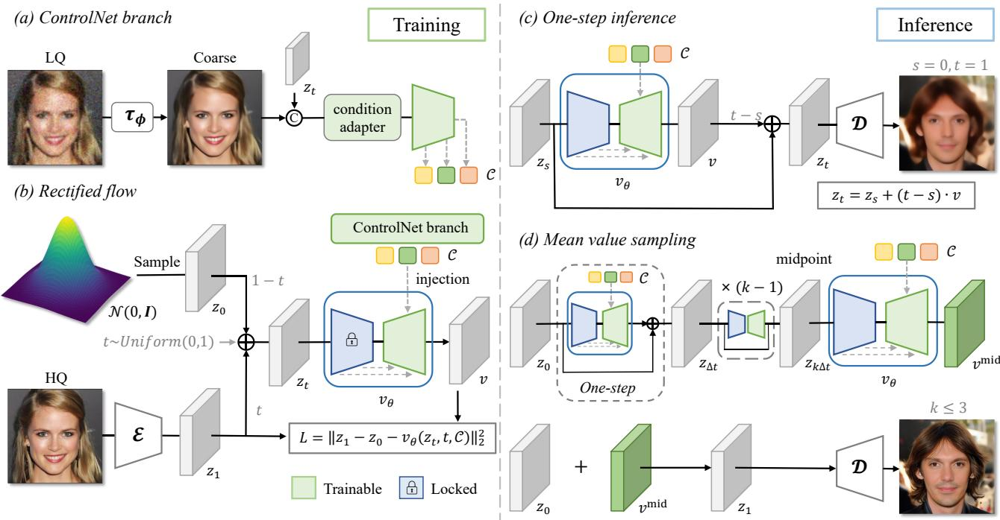  
Figure 3. The overall framework of FlowIE. FlowIE is a flow-based framework for image enhancement tasks. During training (left), w optimize the rectified flow ${ \pmb v } _ { \theta }$ to bridge straight line paths v from an elementary distribution to clean images with proper guidance. We also developed the mean value sampling to improve the path estimation. During inference (right), we utilize the conditions from LQ to predict a linear direction toward the clean images on the midpoint of the transport curve, yielding high-quality and visually appealing results.

In contrast to the image synthesis that rectified flow is typically tailored for, image enhancement tasks have a relatively deterministic target (HQ). Therefore, the one-to-one transport mapping inherent in rectified flow cannot directly apply to our work. Instead, we naturally consider a novel many-to-one mapping that every point in an elementary (Gaussian) distribution orients to a fixed HQ image in the real world. This method offers two advantages compared to [25]: (1) it evades expensive data preparing that entails drawing massive data pairs by performing diffusion sampling repeatedly, and intuitively aligns with enhancement tasks with ground truth HQ data; (2) it stabilizes training and inference with theoretically infinite data pairs for learning and fully leverages the condition to control the rectified flow process. Motivated by these properties, we aim to design an effective control plan to centralize the flow direction, using the coarse result as the raw material. For this control mechanism, we employ a ControlNet branch, which consists of a condition adapter and an injection module, to introduce spatial guidance for the path predictor. Given a clean image $z _ { 1 }$ from real-world dataset S and a noise $z _ { \mathrm { 0 } }$ sampled from the standard Gaussian distribution, we synthesize the LQ image $z _ { \mathrm { L Q } }$ using the degradation model and recover the coarse result with $\tau _ { \phi }$ . To construct the condition C with the information of time t, we concatenate the coarse result with the noisy image ${ \boldsymbol { z } } _ { t }$ produced by the linear interpolation in Equation (2). Then we employ the condition adapter implemented as a two-layer MLP to refine the image features and apply a zero convolution layer $\mathcal { F }$ with both weights and bias initialized to zeros to align the channel dimension. To sum up, the condition C is computed as:

$$
\begin{array} { r l } & { \mathcal { C }  \mathrm { C o n c a t } ( \pmb { \tau } _ { \phi } ( z _ { \mathrm { L Q } } ) , z _ { t } ) } \\ & { \mathcal { C }  \mathcal { C } + \gamma \mathrm { M L P } ( \mathcal { C } ) } \\ & { \mathcal { C }  \mathcal { F } ( \mathcal { C } , t ) , } \end{array}\tag{3}
$$

where $\gamma$ is a learnable scale factor initialized to be very small (e.g., 1e-4). Then we corporating the information in

C to the denoising U-Net via the injection module. Given the time step t and condition C, our rectified flow optimize ${ \pmb v } _ { \theta }$ to predict the straight line path by minimizing L:

$$
L = \mathbb { E } _ { t , z _ { 1 } , z _ { 0 } \sim \mathcal { N } ( 0 , I ) } \left[ \| z _ { 1 } - z _ { 0 } - v _ { \theta } ( z _ { t } , t , \mathcal { C } ) \| ^ { 2 } \right] .\tag{4}
$$

The training procedure should be stable and quick benefiting from the inclusion of zero convolution layers, which prevent harmful noise for neural network layers and injects appropriate conditions into the rectified flow.

## 3.3. Improve Quality via Mean Value Sampling

The optimized rectified flow straightens the transport trajectories to nearly linear paths. Utilizing the forward Euler method, rectified flow can produce plausible results with a small number of Euler steps. However, a simple iterative forward method inevitably causes error accumulation, leading to global blur and unsatisfactory details. To tackle this problem, we devise the Mean Value Sampling based on Lagrange’s Mean Value Theorem to improve the velocity estimation accuracy, yielding more visual-appealing results with better quality and details. Specifically, Lagrange’s Mean Value Theorem states that for any two points on a curve, there exists a point on this curve such that the derivative of the curve at this point is equal to the scope of the straight line connecting these points. Since rectified flow acts as a path or derivative predictor on a differentiable transport curve, we naturally leverage it to find a midpoint on the curve that the velocity direction $v ^ { \mathrm { m i d } }$ of this point is parallel to the straight line bridging $z _ { \mathrm { 0 } }$ and $z _ { 1 }$

For midpoint searching, we compute the path direction of a point set $\mathcal { P } ~ = ~ \{ z _ { 0 } , z _ { \Delta t } , . . . , z _ { 1 - \Delta t } \}$ , covering uniform discrete timesteps along the curve with the step length $\begin{array} { r } { \Delta t { } = \frac { 1 } { N } } \end{array}$ . We observe that there exists a midpoint ${ \boldsymbol { z } } _ { k \Delta t }$ in $\mathcal { P }$ that predicts the most accurate direction and yields the best result. We select the desirable $k \in \{ 0 , 1 , . . . , N - 1 \}$ with a few test data points for different tasks and we find that ${ \boldsymbol { z } } _ { k \Delta t }$ always produces reliable results in a specific task.

## 3.4. Implementation

We consider four image enhancement tasks with different degradation models $\mathcal { D } _ { h }$ in this work. In detail, the degradation model for BFR and BSR can be generally approximated as ${ \pmb y } = [ ( { \pmb k } * { \pmb x } ) , \rvert _ { r } + { \pmb n } ] _ { \mathrm { J P E G } }$ , which consists of blur, noise, resize and JPEG compression. Since images usually suffer from more severe harassment in the real-world scene, we apply a high-order degradation model, repeating the above process multiple times. For the inpainting task, we need to recover the missing pixels in images. The corresponding degradation model is the dot-multiplication with a binary mask: $\pmb { y } = \pmb { x } \odot \pmb { m }$ . For color enhancement, the degraded image experiences color shifts or only retains the grayscale channel. In our framework, we mainly manipulate images in a latent space constructed by a trained VQGAN, consisting of an encoder $\mathcal { E }$ and a decoder D and achieving the conversion between the pixel space and the latent space. We also create a trainable copy of the encoding blocks and the middle block in ${ \pmb v } _ { \theta }$ as the injection module to handle the condition $\mathcal { C }$ and infuse it to ${ \pmb v } _ { \theta }$ . For optimal results, we empirically capture the midpoint with $N = 5$ and $k = 3 .$ , thus the inference requires only $k + 1 = 4$ steps.

## 4. Experiments

## 4.1. Experiment Setups

Datasets. For the face-related tasks, including blind face restoration, face color enhancement and face inpainting, we train our model on Flickr-Faces-HQ (FFHQ) [19], which encompasses a corpus of 70,000 high-resolution (1024 pixels) images. In preparation for training, we resize these images to a resolution of $5 1 2 \times 5 1 2$ . To evaluate the performance of our model both quantitatively and qualitatively, we employ the synthetic CelebA-Test dataset [26], which comprises 3,000 pairs of LQ and HQ pairs. For comparisons on real-world datasets, we leverage LFW-Test [34], CelebChild-Test [34] and WIDER-Test [47], which contain face images afflicted with varying degrees of image degradations. For the blind image super-resolution task, we finetune our model on ImageNet [5] and evaluate it on the widely-used RealSRSet [1]. Since the size of RealSRSet is relatively small, we construct another test set, namely collect-100, with 100 real-world images following the class distribution in RealSRSet to conduct a broader evaluation.

Training Details We apply the image restoration baseline [22] as our initial stage model. For BFR and BSR, we tune the initial stage model for 90K steps with a batch size of 64 on the corresponding datasets. To leverage the diffusion prior, we employ the pre-trained text-to-image model (namely ”Stable Diffusion”) $\epsilon _ { \theta }$ to initialize the path predictor ${ \pmb v } _ { \pmb { \theta } }$ and fix the VQGAN. To optimize our rectified flow, we unfreeze the linear layers of the cross-attention blocks in ${ \pmb v } _ { \theta }$ via LoRA [17] during training. The training for these parameters takes 80K steps with a batch size of 32. For all tasks, we use the AdamW optimizer and set the learning rate as 1e-4. All tasks share the same model architecture.

Metrics. To evaluate FlowIE on the blind face restoration with ground truth, we utilize traditional metrics including PSNR, SSIM and LPIPS. However these metrics are not enough to reflect human preference since they often penalize high-frequency details, $e . g .$ ., hair texture. We also compute the identity similarity, denoted as IDS, with a face perception network [6] and adopt the widely-used non-reference metric FID to measure image quality, which is also employed for evaluation on wild datasets. On blind image super-resolution task, we leverage the non-reference image quality assessment metric, namely MANIQA [40], to

RestoreFormer

Table 1. Quantitative comparisons for BFR on the synthetic and real-world datasets. Red and blue indicate the best and the second best performance, respectively. We categorize the methods into conventional (up), diffusion-based (middle) and flow-based (bottom). Our FlowIE shows very competitive results compared with existing methods. We obtain remarkable image quality and identity consistency with the leading FID and IDS scores. Our framework also exhibits much faster inference than the diffusion-based method.
<table><tr><td rowspan="2">Method</td><td colspan="3">Wild Datasets</td><td colspan="5">Synthetic Dataset</td><td rowspan="2">FPS↑</td></tr><tr><td>LFW</td><td>WIDER</td><td>CelebChild</td><td></td><td></td><td>CelebA</td><td></td><td></td></tr><tr><td></td><td>FID↓</td><td>FID↓</td><td>FID↓</td><td>PSNR↑</td><td>SSIM↑</td><td>LPIPS↓</td><td>FID↓</td><td>IDS↑</td><td></td></tr><tr><td>GPEN [41]</td><td>51.95</td><td>46.41</td><td>76.62</td><td>21.3941</td><td>0.5745</td><td>0.4685</td><td>23.88</td><td>0.49</td><td>7.278</td></tr><tr><td>GCFSR [15]</td><td>52.18</td><td>40.89</td><td>76.32</td><td>21.8789</td><td>0.6070</td><td>0.4579</td><td>35.52</td><td>0.45</td><td>9.243</td></tr><tr><td>GFPGAN [34]</td><td>52.11</td><td>41.70</td><td>80.69</td><td>21.6953</td><td>0.6060</td><td>0.4304</td><td>21.69</td><td>0.49</td><td>8.152</td></tr><tr><td>VQFR [14]</td><td>49.92</td><td>37.89</td><td>74.75</td><td>21.3012</td><td>0.6125</td><td>0.4127</td><td>20.47</td><td>0.48</td><td>3.837</td></tr><tr><td>RestoreFormer [39]</td><td>48.41</td><td>49.82</td><td>71.09</td><td>21.0029</td><td>0.5289</td><td>0.4791 0.4825</td><td>43.76 64.21</td><td>0.55</td><td>4.964</td></tr><tr><td>DMDNet [21]</td><td>43.38 52.34</td><td>40.53 38.79</td><td>79.37</td><td>21.6620 22.1513</td><td>0.5997 0.5949</td><td>0.4057</td><td>22.23</td><td>0.66 0.48</td><td>3.454</td></tr><tr><td>CodeFormer [47]</td><td></td><td></td><td>79.58</td><td></td><td></td><td></td><td></td><td></td><td>5.188</td></tr><tr><td>DiffBIR [23]</td><td>39.61</td><td>33.51</td><td>77.74</td><td>21.7512</td><td>0.5968</td><td>0.4575</td><td>20.19</td><td>0.52</td><td>0.285</td></tr><tr><td>FlowIE (Ours)</td><td>38.66</td><td>32.41</td><td>74.25</td><td>21.9211</td><td>0.6005</td><td>0.4367</td><td>19.81</td><td>0.69</td><td>2.846</td></tr></table>

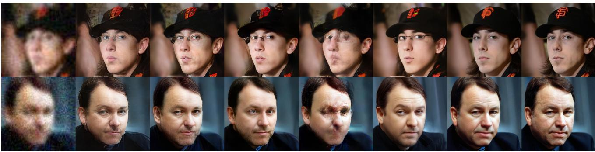  
Figure 4. Qualitative comparisons on CelebA-Test. FlowIE generates plausible HQ results with enough details and high identity similarity even though input faces are severely degraded, while previous methods produce visible artifacts or inconsistent faces.

compute image quality score with a multi-dimension attention network. To illustrate our efficiency on inference time, we calculate the throughput (FPS) of various methods.

## 4.2. Main Results

Blind Face Restoration. We evaluate FlowIE on both synthetic CelebA-Test [26] and in-the-wild LFW-Test [34], CelebChild-Test [34] and WIDER-Test [47]. Our comparative analysis involves recent state-of-the-art methods, including GPEN [41], GCFSR [15], GFPGAN [34], VQFR [14], RestoreFormer [39], DMDNet [21], Code-Former [47] and DiffBIR [23]. We start with the quantitative comparison on CelebA-Test, which provides LQ-HQ pairs for evaluation, as shown in Table 1. We show that FlowIE achieves FID 19.81 and IDS 0.69, outperforming previous methods. This underscores FlowIE’s effectiveness in enhancing image quality and preserving face identity. We also achieve comparable scores on PSNR, SSIM and LPIPS and exhibit a higher upper bound on all metrics than DiffBIR. Notably, the FPS of FlowIE is close to the scale of one-step methods, approximately 10 times of

DiffBIR. We further showcase the qualitative results in Figure 4. FlowIE successfully recovers detailed information like the hair and skin textures while faithfully maintaining the identity, encompassing facial features and expressions, in challenging cases. In assessing FlowIE on realworld data, we conduct experiments on three wild datasets, as presented in Table 1. FlowIE delivers high-quality outcomes reflected by the outstanding FID on LFW-Test and WIDER-Test. We also obtain competitive FID with stateof-the-art methods on CelebChild-Test. The qualitative results on wild datasets, depicted in Figure 5, illustrate that FlowIE consistently produces visually realistic outcomes.

Blind Image Super-Resolution. We evaluate our FlowIE on RealSRSet [1] and our established Collect-100 dataset. We compare FlowIE with cutting-edge methods, including GAN-based Real-ESRGAN+ [35], BSRGAN [46], SwinIR-GAN [22], FeMaSR [2] and diffusion-based DDNM [36], GDP [10] and DiffBIR [23]. In Table 2, the quantitative assessment highlights FlowIE’s superiority over other methods, demonstrating high image quality with MANIQA scores of 0.5953 and 0.6087 on the two datasets, respectively. Notably, though DiffBIR also attains commendable quality, its low throughput due to diffusion sampling contrasts with FlowIE’s comparable speed to onestep GAN-based methods. Figure 6 demonstrates FlowIE’s proficiency in enhancing intricate detailed contents, such as the patterns on the butterfly’s wings in Row 1 and the texture of the cat’s fur in Row 2. These vivid improvements are attributed to the generative priors from the pre-trained diffusion model. The combination of efficient inference and visually compelling results further underscores FlowIE’s potential as a robust solution for challenging BSR tasks.

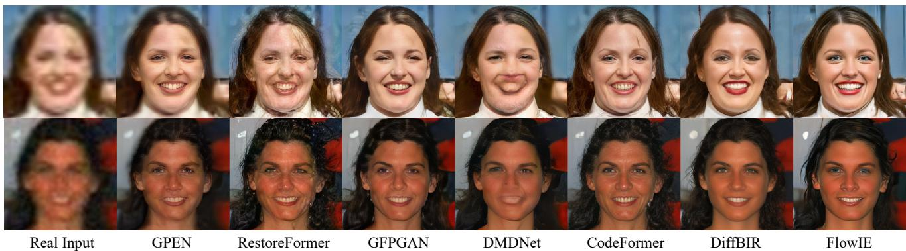  
Figure 5. Qualitative comparisons on real-world faces. Our method performs plausible enhancement on real-world faces, producing high-fidelity and visually satisfactory faces. Compared to other methods, FlowIE enjoys robustness in front of challenging cases.

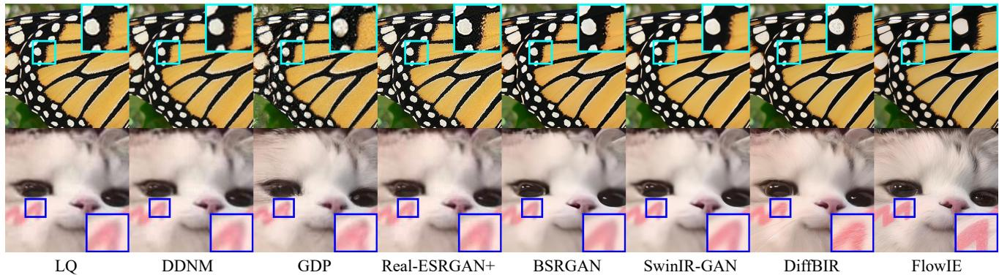  
Figure 6. Qualitative comparisons on the real-world images. FlowIE successfully enhances the LQ images by upsampling, denoising and deblurring simultaneously and provides rich details from the generative knowledge, yielding high-quality and satisfying outcomes.

Table 2. Quantitative comparisons for BSR on real-world datasets. Our flow-based framework achieves high-quality enhancement and outperforms existing methods in MANIQA with a much faster speed compared to diffusion-based methods.
<table><tr><td rowspan="2">Type</td><td rowspan="2">Method</td><td colspan="2">MANIQA↑</td><td rowspan="2">FPS↑</td></tr><tr><td>RealSRSet</td><td>Collect-100</td></tr><tr><td rowspan="4">GAN</td><td>Real-ESRGAN+ [35]</td><td>0.5373</td><td>0.5901</td><td>1.875</td></tr><tr><td>BSRGAN [46]</td><td>0.5638</td><td>0.5889</td><td>1.725</td></tr><tr><td>SwinIR-GAN [22]</td><td>0.5296</td><td>0.5721</td><td>5.978</td></tr><tr><td>FeMaSR [2]</td><td>0.5250</td><td>0.5718</td><td>3.167</td></tr><tr><td rowspan="3">Diffusion</td><td>DDNM [36]</td><td>0.4539</td><td>0.4813</td><td>0.071</td></tr><tr><td>GDP [10]</td><td>0.4583</td><td>0.5237</td><td>0.016</td></tr><tr><td>DiffBIR [23]</td><td>0.5906</td><td>0.6022</td><td>0.286</td></tr><tr><td>Flow</td><td>FlowIE (Ours)</td><td>0.5953</td><td>0.6087</td><td>2.853</td></tr></table>

## 4.3. Analysis

Effective Diffusion Exploitation via Rectified Flow. In diffusion models, a denoising step can be viewed as a walk along the gradient direction of data density, hinting at the potential for distilling the diffusion model to achieve faster inference. Therefore, we compare two approaches: direct distillation and rectified flow. For direct distillation (w/o flow), we set the student identical to ${ \pmb v } _ { \theta }$ and fix t = 0 during training. As shown in Table 3 and Figure 7, FID scores and MANIQA are adversely affected, and the visual outcomes exhibit unsatisfactory blur and inadequate details. We summarize that exploiting diffusion model via direct distillation is a tough learning problem for the one-step student model and rectified flow mitigates it with refined trajectories.

Choice of Inference Paths. The straightened path via rectified flow is not perfectly linear. Empirically, we have two options for inference paths: (1) use the forward Euler method which walks along the trajectory with fixed step length (w/o mid sample), and (2) follow Lagrange’s Mean Value Theorem to identify a pivotal midpoint on the path. We generate the results for BFR and BSR through both paths. Results from Path 1, as depicted in Table 3 and Figure 7, show plausible outcomes with reduced noise. However, they fall behind in realness and details compared to Path 2. We conclude that the Euler method struggles to produce high-quality images in very few steps (e.g., 5), while our mean value sample obtains visually pleasant results with a more efficient inference process (<5 steps).

Table 3. Ablation studies. We perform ablations on BFR and BSR to verify the effectiveness of the components in FlowIE and the impact of the inference path choice. We find that rectified flow and the initial stage model are beneficial and that the path guided by mean value sampling yields the best performance.
<table><tr><td rowspan="2">Method</td><td colspan="2">FID↓</td><td colspan="2">MANIQA↑</td></tr><tr><td>CelebA</td><td>LFW</td><td>RealSRSet</td><td>Collect-100</td></tr><tr><td>w/o flow</td><td>49.74</td><td>53.71</td><td>0.5311</td><td>0.5723</td></tr><tr><td>w/o mid sample</td><td>25.19</td><td>48.95</td><td>0.5489</td><td>0.5805</td></tr><tr><td>w/o init</td><td>27.76</td><td>52.63</td><td>0.5301</td><td>0.5698</td></tr><tr><td>FlowIE (Ours)</td><td>19.81</td><td>38.66</td><td>0.5953</td><td>0.6087</td></tr></table>

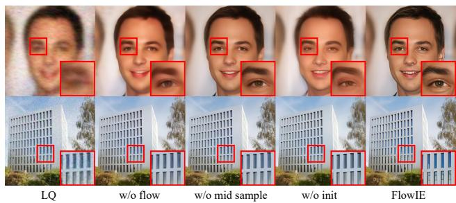  
Figure 7. Qualitative comparisons of the ablations. We find the variant frameworks fall short in terms of clarity and details.

Impact of the Initial Stage Model. Our initial stage model $\tau _ { \phi }$ performs general image deblurring on LQ images, enhancing guidance quality and thereby strengthening FlowIE’s path estimation. To gauge this impact, we train our rectified flow without $\tau _ { \phi }$ (w/o init) and conduct an evaluation on test sets. We observe that the absence of $\tau _ { \phi }$ results in low-quality guidance, leading to unsatisfactory results. This is evident in the worse FID and MANIQA scores in Table 3 and blurred object edges in Figure 7. These results demonstrate the effect of $\tau _ { \phi }$ in improving the quality of conditions and achieving better overall performance.

## 4.4. Extensions

To further demonstrate the adaptability of our framework, we generalize FlowIE to extended tasks, including face color enhancement and face inpainting. Achieving this extension requires a minimal fine-tuning effort of 5K steps for the rectified flow dedicated to each task.

Face Color Enhancement. To achieve color enhancement, we fix the initial stage model and fine-tune our rectified flow using color augmentations (random color jitter and grayscale conversion) in [34]. We compare our method with GFPGAN [34] and CodeFormer [47] on real-world CelebChild-Test [34] dataset. The results in Figure 8 showcase that FlowIE produces visually appealing and highly consistent face images with vibrant and realistic colors.

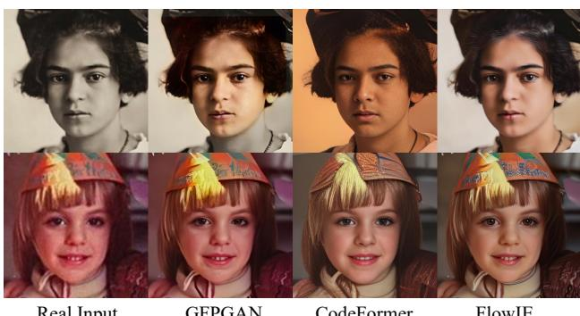

Figure 8. Face color enhancement via FlowIE. We yield satisfying enhancement results with vivid colors for the old photos.  
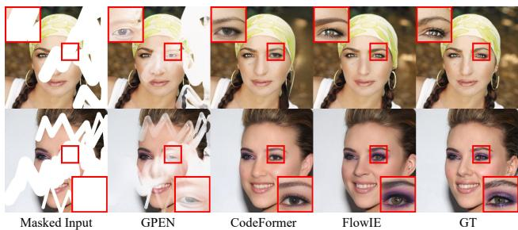  
Figure 9. Face inpainting via FlowIE. We complete the missing pixels with realistic and coherent content for challenging cases.

Face Inpainting. We employ the script from [41] to draw irregular polyline masks on face images as our inputs and fine-tune the rectified flow. During inference, we resize the mask to the latent code’s shape and use it to maintain the visible area on the inputs. As shown in Figure 9, FlowIE successfully reconstructs the challenging cases and seamlessly completes them with coherent contents.

## 5. Conclusion

In this paper, we introduced FlowIE, a novel framework that harnesses the conditioned rectified flow to exploit the potent generative priors within the pre-trained diffusion model and accelerate the inference by straightening the probability transport trajectories. To further improve the path estimation accuracy and reduce inference steps, we have devised the mean value sampling to predict a precise direction at the curve midpoint. Extensive experiments demonstrate our framework’s competitive performance and remarkable generalization across diverse image enhancement challenges. We envision our work will inspire future research on flowbased image enhancement and efficient diffusion sampling. Acknowledgement. This work was supported in part by the National Natural Science Foundation of China under Grant 62125603, Grant 62321005, and Grant 62336004.

## References

[1] Jianrui Cai, Hui Zeng, Hongwei Yong, Zisheng Cao, and Lei Zhang. Toward real-world single image super-resolution: A new benchmark and a new model. In ICCV, pages 3086– 3095, 2019. 2, 5, 6

[2] Chaofeng Chen, Xinyu Shi, Yipeng Qin, Xiaoming Li, Xiaoguang Han, Tao Yang, and Shihui Guo. Real-world blind super-resolution via feature matching with implicit highresolution priors. In ACMMM, pages 1329–1338, 2022. 6, 7

[3] Hanting Chen, Yunhe Wang, Tianyu Guo, Chang Xu, Yiping Deng, Zhenhua Liu, Siwei Ma, Chunjing Xu, Chao Xu, and Wen Gao. Pre-trained image processing transformer. In CVPR, pages 12299–12310, 2021. 1, 3

[4] Xiangyu Chen, Xintao Wang, Jiantao Zhou, Yu Qiao, and Chao Dong. Activating more pixels in image superresolution transformer. In CVPR, pages 22367–22377, 2023. 1

[5] Jia Deng, Wei Dong, Richard Socher, Li-Jia Li, Kai Li, and Li Fei-Fei. Imagenet: A large-scale hierarchical image database. In CVPR, pages 248–255. Ieee, 2009. 2, 5

[6] Jiankang Deng, Jia Guo, Niannan Xue, and Stefanos Zafeiriou. Arcface: Additive angular margin loss for deep face recognition. In CVPR, pages 4690–4699, 2019. 5

[7] Chao Dong, Chen Change Loy, Kaiming He, and Xiaoou Tang. Learning a deep convolutional network for image super-resolution. In ECCV, pages 184–199. Springer, 2014. 1, 3

[8] Chao Dong, Chen Change Loy, Kaiming He, and Xiaoou Tang. Image super-resolution using deep convolutional networks. TPAMI, 38(2):295–307, 2015. 3

[9] Alexey Dosovitskiy, Lucas Beyer, Alexander Kolesnikov, Dirk Weissenborn, Xiaohua Zhai, Thomas Unterthiner, Mostafa Dehghani, Matthias Minderer, Georg Heigold, Sylvain Gelly, et al. An image is worth 16x16 words: Transformers for image recognition at scale. In ICLR, 2020. 3

[10] Ben Fei, Zhaoyang Lyu, Liang Pan, Junzhe Zhang, Weidong Yang, Tianyue Luo, Bo Zhang, and Bo Dai. Generative diffusion prior for unified image restoration and enhancement. In CVPR, pages 9935–9946, 2023. 2, 3, 6, 7

[11] Manuel Fritsche, Shuhang Gu, and Radu Timofte. Frequency separation for real-world super-resolution. In ICCVW, pages 3599–3608. IEEE, 2019. 2, 3

[12] Ian Goodfellow, Jean Pouget-Abadie, Mehdi Mirza, Bing Xu, David Warde-Farley, Sherjil Ozair, Aaron Courville, and Yoshua Bengio. Generative adversarial nets. NeurIPS, 27, 2014. 2, 3

[13] Jinjin Gu, Hannan Lu, Wangmeng Zuo, and Chao Dong. Blind super-resolution with iterative kernel correction. In CVPR, pages 1604–1613, 2019. 2

[14] Yuchao Gu, Xintao Wang, Liangbin Xie, Chao Dong, Gen Li, Ying Shan, and Ming-Ming Cheng. Vqfr: Blind face restoration with vector-quantized dictionary and parallel decoder. In ECCV, pages 126–143. Springer, 2022. 6

[15] Jingwen He, Wu Shi, Kai Chen, Lean Fu, and Chao Dong. Gcfsr: a generative and controllable face super resolution

method without facial and gan priors. In CVPR, pages 1889– 1898, 2022. 6

[16] Jonathan Ho, Ajay Jain, and Pieter Abbeel. Denoising diffusion probabilistic models. NeurIPS, 33:6840–6851, 2020. 2, 3

[17] Edward J Hu, Yelong Shen, Phillip Wallis, Zeyuan Allen-Zhu, Yuanzhi Li, Shean Wang, Lu Wang, and Weizhu Chen. Lora: Low-rank adaptation of large language models. arXiv preprint arXiv:2106.09685, 2021. 5

[18] Yan Huang, Shang Li, Liang Wang, Tieniu Tan, et al. Unfolding the alternating optimization for blind super resolution. NeurIPS, 33:5632–5643, 2020. 2, 3

[19] Tero Karras, Samuli Laine, and Timo Aila. A style-based generator architecture for generative adversarial networks. In CVPR, pages 4401–4410, 2019. 5

[20] Bahjat Kawar, Michael Elad, Stefano Ermon, and Jiaming Song. Denoising diffusion restoration models. NeurIPS, 35: 23593–23606, 2022. 2, 3

[21] Xiaoming Li, Shiguang Zhang, Shangchen Zhou, Lei Zhang, and Wangmeng Zuo. Learning dual memory dictionaries for blind face restoration. TPAMI, 45(5):5904–5917, 2022. 6

[22] Jingyun Liang, Jiezhang Cao, Guolei Sun, Kai Zhang, Luc Van Gool, and Radu Timofte. Swinir: Image restoration using swin transformer. In ICCV, pages 1833–1844, 2021. 1, 3, 5, 6, 7

[23] Xinqi Lin, Jingwen He, Ziyan Chen, Zhaoyang Lyu, Ben Fei, Bo Dai, Wanli Ouyang, Yu Qiao, and Chao Dong. Diffbir: Towards blind image restoration with generative diffusion prior. arXiv preprint arXiv:2308.15070, 2023. 2, 3, 6, 7

[24] Qiang Liu. Rectified flow: A marginal preserving approach to optimal transport. arXiv preprint arXiv:2209.14577, 2022. 3

[25] Xingchao Liu, Chengyue Gong, et al. Flow straight and fast: Learning to generate and transfer data with rectified flow. In ICLR, 2022. 2, 3, 4

[26] Ziwei Liu, Ping Luo, Xiaogang Wang, and Xiaoou Tang. Deep learning face attributes in the wild. In ICCV, pages 3730–3738, 2015. 2, 5, 6

[27] Ze Liu, Yutong Lin, Yue Cao, Han Hu, Yixuan Wei, Zheng Zhang, Stephen Lin, and Baining Guo. Swin transformer: Hierarchical vision transformer using shifted windows. In ICCV, pages 10012–10022, 2021. 3

[28] Robin Rombach, Andreas Blattmann, Dominik Lorenz, Patrick Esser, and Bjorn Ommer. High-resolution image syn-¨ thesis with latent diffusion models. In CVPR, pages 10684– 10695, 2022. 2, 3

[29] Olaf Ronneberger, Philipp Fischer, and Thomas Brox. U-net: Convolutional networks for biomedical image segmentation. In MICCAI, pages 234–241. Springer, 2015. 3

[30] Chitwan Saharia, Jonathan Ho, William Chan, Tim Salimans, David J Fleet, and Mohammad Norouzi. Image superresolution via iterative refinement. TPAMI, 45(4):4713– 4726, 2022. 2, 3

[31] Jiaming Song, Chenlin Meng, and Stefano Ermon. Denoising diffusion implicit models. In ICLR, 2020. 3

[32] Yang Song, Jascha Sohl-Dickstein, Diederik P Kingma, Abhishek Kumar, Stefano Ermon, and Ben Poole. Score-based generative modeling through stochastic differential equations. In ICLR, 2020. 3

[33] Longguang Wang, Yingqian Wang, Xiaoyu Dong, Qingyu Xu, Jungang Yang, Wei An, and Yulan Guo. Unsupervised degradation representation learning for blind superresolution. In CVPR, pages 10581–10590, 2021. 2, 3

[34] Xintao Wang, Yu Li, Honglun Zhang, and Ying Shan. Towards real-world blind face restoration with generative facial prior. In CVPR, pages 9168–9178, 2021. 2, 3, 5, 6, 8

[35] Xintao Wang, Liangbin Xie, Chao Dong, and Ying Shan. Real-esrgan: Training real-world blind super-resolution with pure synthetic data. In ICCV, pages 1905–1914, 2021. 2, 3, 6, 7

[36] Yinhuai Wang, Jiwen Yu, and Jian Zhang. Zero-shot image restoration using denoising diffusion null-space model. In ICLR, 2022. 2, 3, 6, 7

[37] Yufei Wang, Yi Yu, Wenhan Yang, Lanqing Guo, Lap-Pui Chau, Alex C Kot, and Bihan Wen. Exposurediffusion: Learning to expose for low-light image enhancement. In ICCV, pages 12438–12448, 2023. 3

[38] Zhendong Wang, Xiaodong Cun, Jianmin Bao, Wengang Zhou, Jianzhuang Liu, and Houqiang Li. Uformer: A general u-shaped transformer for image restoration. In CVPR, pages 17683–17693, 2022. 1

[39] Zhouxia Wang, Jiawei Zhang, Runjian Chen, Wenping Wang, and Ping Luo. Restoreformer: High-quality blind face restoration from undegraded key-value pairs. In CVPR, pages 17512–17521, 2022. 6

[40] Sidi Yang, Tianhe Wu, Shuwei Shi, Shanshan Lao, Yuan Gong, Mingdeng Cao, Jiahao Wang, and Yujiu Yang. Maniqa: Multi-dimension attention network for no-reference image quality assessment. In CVPR, pages 1191–1200, 2022. 5

[41] Tao Yang, Peiran Ren, Xuansong Xie, and Lei Zhang. Gan prior embedded network for blind face restoration in the wild. In CVPR, pages 672–681, 2021. 3, 6, 8

[42] Yuan Yuan, Siyuan Liu, Jiawei Zhang, Yongbing Zhang, Chao Dong, and Liang Lin. Unsupervised image superresolution using cycle-in-cycle generative adversarial networks. In CVPRW, pages 701–710, 2018. 2, 3

[43] Syed Waqas Zamir, Aditya Arora, Salman Khan, Munawar Hayat, Fahad Shahbaz Khan, and Ming-Hsuan Yang. Restormer: Efficient transformer for high-resolution image restoration. In CVPR, pages 5728–5739, 2022. 1

[44] Kai Zhang, Wangmeng Zuo, Yunjin Chen, Deyu Meng, and Lei Zhang. Beyond a gaussian denoiser: Residual learning of deep cnn for image denoising. TIP, 26(7):3142–3155, 2017. 1

[45] Kai Zhang, Wangmeng Zuo, and Lei Zhang. Learning a single convolutional super-resolution network for multiple degradations. In CVPR, pages 3262–3271, 2018. 2, 3

[46] Kai Zhang, Jingyun Liang, Luc Van Gool, and Radu Timofte. Designing a practical degradation model for deep blind image super-resolution. In ICCV, pages 4791–4800, 2021. 2, 3, 6, 7

[47] Shangchen Zhou, Kelvin Chan, Chongyi Li, and Chen Change Loy. Towards robust blind face restoration with codebook lookup transformer. NeurIPS, 35: 30599–30611, 2022. 2, 3, 5, 6, 8