# FocSAM: Delving Deeply into Focused Objects in Segmenting Anything

You Huang1, Zongyu Lan1, Liujuan Cao1\*, Xianming Lin1, Shengchuan Zhang1, Guannan Jiang2, Rongrong Ji1

1 Key Laboratory of Multimedia Trusted Perception and Efficient Computing,

Ministry of Education of China, Xiamen University

2 Intelligent Manufacturing Department, Contemporary Amperex Technology Co. Limited (CATL)

## Abstract

The Segment Anything Model (SAM) marks a notable milestone in segmentation models, highlighted by its robust zero-shot capabilities and ability to handle diverse prompts. SAM follows a pipeline that separates interactive segmentation into image preprocessing through a large encoder and interactive inference via a lightweight decoder, ensuring efficient real-time performance. However, SAM faces stability issues in challenging samples upon this pipeline. These issues arise from two main factors. Firstly, the image preprocessing disables SAM to dynamically use imagelevel zoom-in strategies to refocus on the target object during interaction. Secondly, the lightweight decoder struggles to sufficiently integrate interactive information with image embeddings. To address these two limitations, we propose FocSAM with a pipeline redesigned on two pivotal aspects. First, we propose Dynamic Window Multi-head Self-Attention (Dwin-MSA) to dynamically refocus SAM’s image embeddings on the target object. Dwin-MSA localizes attention computations around the target object, enhancing object-related embeddings with minimal computational overhead. Second, we propose Pixel-wise Dynamic ReLU (P-DyReLU) to enable sufficient integration of interactive information from a few initial clicks that have significant impacts on the overall segmentation results. Experimentally, FocSAM augments SAM’s interactive segmentation performance to match the existing state-of-the-art method in segmentation quality, requiring only about 5.6% of this method’s inference time on CPUs. Code is available at https://github.com/YouHuang67/focsam.

## 1. Introduction

Interactive segmentation [5, 23, 28, 36] enhances the efficiency of enlarging image segmentation datasets by using limited manual annotations, avoiding the exhaustive effort of full labeling. Recently, the Segment Anything

Positive Click  
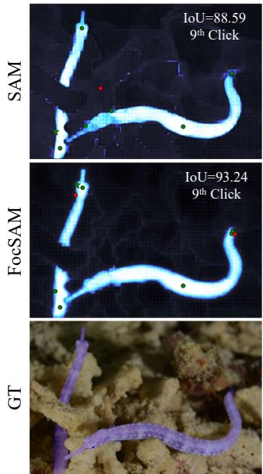

Negative Click  
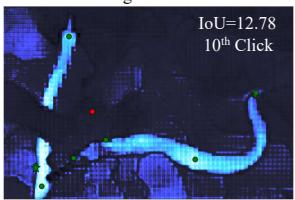

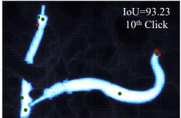

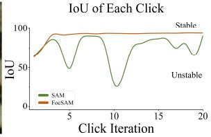  
Figure 1. Interactive segmentation stability on a challenging example. The bottom-left shows the example overlaid with GT (purple masks). The top and middle rows illustrate the interactive segmentation of SAM and the proposed FocSAM, where each click is placed at the center of erroneously predicted regions and categorized as either positive (green) or negative (red). SAM’s performance is unstable in this example (top row), where the 9th click yields an IoU of 88.59 (left) but a subsequent click significantly reduces the IoU to 12.78 (right). In contrast, FocSAM (middle row) shows consistent performance. The plot (bottom-right) summarizes the trends of 20 clicks’s segmentation, clearly contrasting SAM’s IoU fluctuations with FocSAM’s stable performance.

Model (SAM) [28] excels in real-time, high-quality interactive segmentation, responding to annotator prompts such as clicks [23], bounding boxes [28], or coarse masks [29]. SAM’s generalizability and efficiency in processing diverse prompts make it a versatile tool across a spectrum of segmentation-related tasks. This study focuses on clickbased interactive segmentation building upon SAM [28].

SAM [28] alongside the concurrent InterFormer [23] has pioneered a new interactive segmentation pipeline.

This pipeline incorporates powerful Vision Transformers (ViTs) [9, 21, 31] as the image encoder to preprocess images, generating image embeddings that are applicable to all objects within the same image. During the interaction, these image embeddings and the prompts (e.g. clicks) from annotators are fed into a lightweight decoder to produce segmentation results. This pipeline combines the power of large ViTs with the speed needed for on-the-spot interactive segmentation. Following such a pipeline, SAM even enables annotators to perform real-time, high-quality interactive segmentation on CPU-only devices, aiding in the significant expansion of image segmentation annotations [28].

However, SAM’s pipeline has two limitations. First, the pipeline’s image preprocessing disables the efficient implementation of the image-level zoom-in strategy [46] that dynamically refocuses the model on the target object during interaction. Second, SAM’s lightweight decoder struggles to sufficiently fuse the interactive information with the preprocessed image embeddings due to the need for real-time responses, thus weakening the interactive feedback’s positive impact on segmentation quality. Consequently, SAM faces instability issues in challenging scenarios, such as camouflaged objects [10] almost blending into the background. Figure 1 clearly illustrates the instability of SAM’s segmentation results, where an additional click following a sufficient number of previous ones (e.g., 9 clicks) can unexpectedly trigger substantial degradation in segmentation quality, exemplified by a drop in IoU from 88.59 to 12.78. Such instability significantly limits SAM’s applicability in a broader range of image segmentation annotations.

Therefore, we propose FocSAM to address SAM’s limitations. FocSAM’s pipeline builds upon SAM and introduces an extra focus refiner. This refiner adjusts SAM’s image embeddings for each object during the object’s interaction, adding ignorable computations. The adjustment facilitates two major improvements. First, the refiner uses initial segmentation results to refocus the image embeddings on regions containing the target object, inspired by the imagelevel zoom-in [46]. Second, the refiner sufficiently fuses the embeddings with a few initial clicks that prove to have great impact on final segmentation results [35], further enhancing the object-related embeddings.

To implement FocSAM’s focus refiner with minimal computational overhead, we introduce Dynamic Window Multi-head Self-Attention (Dwin-MSA) and Pixel-wise Dynamic ReLU (P-DyReLU). Dwin-MSA partitions image embeddings into windows and perform efficient attention computations on a dynamic minimal subset of the windowed embeddings that intersect with previously predicted masks. Such a dynamic manner avoids redundant computations on irrelevant background areas. Dwin-MSA uses the shifting strategy [39] to ensure long-distance interactions among embeddings, preserving dynamic efficiency.

P-DyReLU is employed as the non-linear activation in the Dwin-MSA to fuse the interactive information from a few initial clicks with the image embeddings. Specifically, P-DyReLU adopts DyReLU [6] and utilizes SAM decoder’s click-fused query embeddings to enhance the object-related image embeddings and suppress object-unrelated ones.

Experimentally, FocSAM demonstrates superior interactive segmentation performance over SAM with negligible additional computational costs. FocSAM matches the stateof-the-art SimpleClick [36] in Number of Clicks (NoC) across datasets including DAVIS [43], SBD [19], Grab-Cut [45], Berkeley [26], MVTec [2] and COD10K [10], but FocSAM requires only about 5.6% of the CPU inference time compared to SimpleClick. Moreover, as the number of objects per image surpasses 10, FocSAM’s time efficiency further improves, demanding roughly 1.2% of the time required by SimpleClick for CPU inference.

We summarize our contributions as follows:

• We introduce FocSAM to boost SAM’s performance by dynamically enhancing the object-related image embeddings and deeply integrating interactive information into these embeddings.

• FocSAM is implemented by proposed Dwin-MSA and P-DyReLU with ignorable extra computational costs.

• FocSAM matches the state-of-the-art SimpleClick in NoC across datasets including DAVIS, SBD, GrabCut, Berkeley, MVTec and COD10K, requires just 5.6% of SimpleClick’s inference time on CPUs.

## 2. Related Work

## 2.1. Interactive Segmentation

The integration of deep networks into interactive segmentation [3, 12, 14, 45] is initiated by DIOS [55], leading to subsequent advancements in click-based methods like DEXTR [32, 41], FCA-Net [34], BRS [25], and f-BRS [46]. The following methods [1, 5, 29, 35, 37, 59] focus on enhancing various aspects of interactive segmentation. SimpleClick [36] is the first to introduce large Vision Transformers [9] into this field. InterFormer [23] follows with a novel pipeline to reduce model redundancy by reusing image features. SAM [28] also adopts this pipeline and achieves robust zero-shot capabilities and diverse prompts, leading to various downstream applications [30, 40, 42, 50, 53, 57]. However, SAM is unable to employ the image-level zoom-in strategy [46] efficiently and integrate interactive information effectively, hindering its broader applications. We introduce FocSAM to address SAM’s limitations.

## 2.2. Efficient Attention

Transformers [48] make remarkable strides in the field of computer vision [9, 11, 13, 27, 47, 52, 54, 58]. The high computational complexity of attention module leads to a range of research [15, 38, 54, 60]. One typical way is to limit the attention region of each token from full-attention to local/windowed attention [17, 31, 38, 49]. This strategy has garnered significant interest, as evidenced by various studies [7, 22, 24, 51, 56]. More recently, CSwin [8] introduces Cross-Shaped Window Self-attention to compute concurrently in both orientations. Beyond Fixation [44] proposes DW-ViT to fuse multi-scale information. In this paper, we propose Dwin-MSA to perform dynamic window attention on object-related image embeddings.

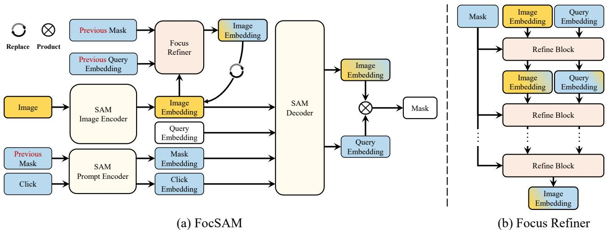  
Figure 2. Overview of proposed FocSAM building upon SAM. SAM comprises an image encoder, a prompt encoder and a decoder. The image encoder transforms images into image embeddings before interaction. In each interaction of an object, the prompt encoder convert the previous mask and annotator clicks into mask and click embeddings, respectively. These three embeddings and a learnable query embedding are fed into the decoder for segmentation. Upon SAM’s pipeline, FocSAM introduces a focus refiner that is employed once per object during interaction (Figure (a)). In an early step of SAM’s interaction, this refiner processes SAM’s image embeddings, previous mask and click-fused query embedding through a stack of refine blocks (Figure (b)). Each block receives the image and query embedding with the mask shared across all the blocks, and produces the image and query embeddings fed into the subsequent block. The final output is a refined image embedding, which replaces the original image embedding for subsequent interactions with the object.

## 3. Method

We propose FocSAM with a redesigned SAM pipeline. In 3.1, we present an overview of SAM’s pipeline and the new pipeline. Then, we elaborate on the implementation of Foc-SAM’s focus refiner in 3.2 and 3.3. Finally, the training loss is discussed in Section 3.4.

## 3.1. Pipeline

SAM’s pipeline. In Figure 2, SAM [28] comprises an image encoder, a prompt encoder and a decoder. The image encoder preprocesses each image only once before the interaction, despite the varying number of objects within the image. Instead, both the prompt encoder and the decoder actively engage in every interaction, rapidly processing annotator clicks to predict segmentation results.

Image encoder. In SAM’s preprocessing phase, images are resized and padded to 1024×1024 and fed into a ViT-based image encoder [9]. This encoder is structured in four stages of equal depth and utilizes window-based attention in each stage for efficient computation [31], with full attention applied at each stage’s end. Following this, simple convolutional layers further reduces the dimensions to produce 256- dimensional embeddings $\pmb { F } \in \mathbb { R } ^ { \frac { H } { 1 6 } \times \frac { W } { 1 6 } \times 2 5 6 }$ , corresponding to non-overlapping 16 × 16 image patches.

Prompt encoder. In SAM’s interaction phase, the prompt encoder [28] transforms annotator prompts into embeddings. These prompts include N clicks at the Nth interaction, each with x, y coordinates and a label indicating positive or negative. A positive click in a false negative region signals the model to expand that region and a negative click in a false positive region suggests removal. Starting from the second interaction for each object, the prompt encoder also converts the previously predicted segmentation mask into mask embeddings. The transformed click embeddings $\pmb { c } \in \mathbb { R } ^ { N \times 2 5 6 }$ and mask embeddings $E \in \mathbb { R } ^ { \frac { H } { 1 6 } \times \frac { W } { 1 6 } \times 2 5 6 }$ will be fed into the SAM decoder, as depicted in Figure 2.

Decoder. Following the prompt encoder, the decoder receives image embeddings F, mask embeddings E, click embeddings c and learnable query embeddings. The number of query embeddings corresponds to the expected output masks by the decoder. In our work, we use a single query embedding $\pmb q \in \mathbb { R } ^ { 1 \times 2 5 6 }$ . During decoding, the concatenated embeddings $[ \pmb { q } ; \pmb { c } ] \in \mathbb { R } ^ { ( N + 1 ) \times 2 5 6 }$ undergo crossattention with the mask-fused image embedding $\boldsymbol { F } + \boldsymbol { E }$ They alternate roles of query and key/value in the cross attention without involving image-to-image attention. After two blocks of such cross-attention, the output includes the click-fused image embedding $\pmb { F } _ { c } \in \mathbb { R } ^ { \frac { H } { 4 } \times \frac { \mathbf { \lambda } ^ { 2 } W } { 4 } \times 2 5 6 }$ that has been upsampled by some convolutions and the click-fused query embedding $\pmb q _ { c } \in \mathbb { R } ^ { 1 \times 2 5 6 }$ , with the click embeddings discarded. Their dot product $\pmb { F } _ { c } { \cdot } \pmb { q } _ { c } ^ { \top } \in \mathbb { R } ^ { \frac { H } { 4 } \times \frac { W } { 4 } \times 1 }$ generates logits for predicting the final mask M.

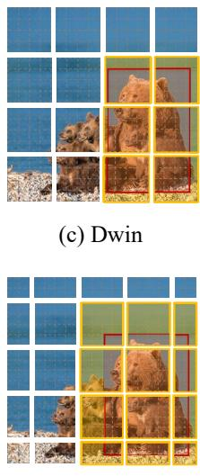

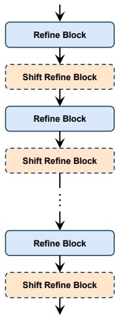  
(a) Overview

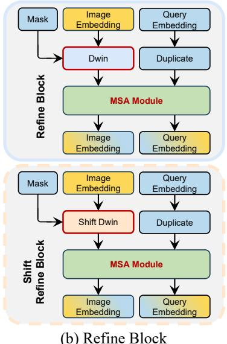  
(b) Refine Block

(d) Shift Dwin  
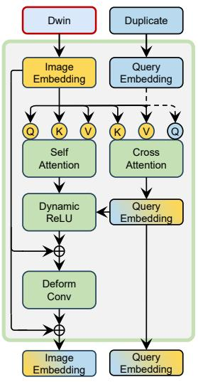  
(e) MSA Module  
Figure 3. Overview of FocSAM’s focus refiner. Figure (a) depicts the overall architecture of the focus refiner. Figure (b) details the refine block, showing the flow of image and query embeddings through the Dwin and MSA modules. Figures (c) and (d) highlight the window selection within the Dwin module and the shift strategy. Figure (e) provides a detailed view of the MSA module.

FocSAM’s pipeline. Building upon SAM’s pipeline, Foc-SAM’s pipeline introduces the focus refiner. The refiner is employed once for each object. Specifically, at the Kth interaction of an object, the refiner receives the image embedding F, the previously predicted mask $M ^ { ( K - 1 ) }$ and the previous click-fused query embedding $\pmb { q } _ { c } ^ { ( K - 1 ) }$ . Then, the refiner produces a refined image embedding $\pmb { F } _ { r } ^ { ( K ) } \in$ $\mathbb { R } ^ { \frac { H } { 1 6 } \times \frac { W } { 1 6 } \times 2 5 6 }$ that has object-related embeddings. ${ \pmb F } _ { r } ^ { ( K ) }$ replaces the original embedding F in all the subsequent interaction on this object. As illustrated by Figure 2 (b), this focus refiner comprises a stack of refine blocks. These blocks refine the image and query embeddings iteratively, sharing the same previous mask. The image embedding from the final block serves as the refiner output. We detail these refine blocks in the following subsection.

## 3.2. Refine Block

Overview. In Figure 3 (a), the plain refine block and the shift refine block alternately stack within the refiner, refining the image embedding F and click-fused query embedding $\pmb { q } _ { c } ^ { ( K - 1 ) }$ with the shared mask $M ^ { ( K - 1 ) }$ . They share most modules, differing mainly in the Dwin and Shift Dwin (Figure 3 (b)). Both the Dwin and Shift Dwin identify the bounding box around the object from the mask $M ^ { ( \check { K } - 1 ) }$ (Figure 3 (c)(d)) and refine the embeddings on the object.

The refined embeddings and the correspondingly duplicated query embeddings are fed into the MSA module (Figure 3 (e)). Then, we detail Dwin and Shift Dwin.

Revisiting image-level zoom-in. Given an image I and a bounding box, the image-level zoom-in strategy [46] is formulated as resize $( { \mathcal { T } } [ y _ { 1 } : y _ { 2 } , x _ { 1 } : x _ { 2 } ] , ( H , W ) )$ , where corner coordinates $( x _ { 1 } , y _ { 1 } ) , ( x _ { 2 } , y _ { 2 } )$ define the bounding box and (H, W) is the model input size. Adapting this strategy to the embeddings typically involves RoIAlign [20] that crops and resizes embeddings using a linear sampling method. However, RoIAlign faces two main issues. First, RoIAlign assumes that embeddings can be linearly interpolated like images, which may not hold for SAM’s image embeddings due to lack of the corresponding smoothnessaware training. Second, RoIAlign uniformly resizes all objects, ignoring size differences, which limits representation for larger objects and adds redundancy for smaller ones.

Dynamic window. Instead of using RoIAlign, we introduce the Dynamic Window (Dwin) strategy. Given window size $S _ { \ i }$ , a batch of B samples’ image embeddings ${ \pmb F } \in$ $\mathbb { R } ^ { B \times \frac { H } { 1 6 } \times \frac { W } { 1 6 } \times 2 5 6 } \mathrm { c a n }$ be windowed as $\bar { \pmb F } \in \mathbb { R } ^ { }$ L×S×S×256 with $L = B H W / ( 1 6 S ) ^ { 2 }$ . Then, the windows intersecting the box are selected (Figure 3 (c). For all objects within these images, we can simultaneously select all windows intersecting with their respective bounding boxes despite the objects’ sizes. This leads to the selected embedding windows $\pmb { F } _ { W } \in \mathbb { R } ^ { M \times S \times S \times 2 5 6 }$ , with M the number of windows interacting with the boxes. Each window performs independent computations like self-attention within the window, and updates its own embeddings with the computation results, freezing the unselected embedding windows.

Long-range patch-to-patch attention. We further employ the shifting strategy [38, 39] in the Shift Dwin (Figure 3 (d)). Alternating the Dwin and Shift Dwin ensures sufficient information exchange between all the patches within the bounding box. Moreover, the boxes typically limit the spatial distance between embeddings within the same object, implying that a few blocks and small window sizes still allow sufficient information exchange.

MSA module. The MSA (Figure 3 (e)) processes $\pmb { F } _ { W } \mathbf { \ ' } _ { \mathbf { S } }$ each window $\pmb { f } \in \mathbb { R } ^ { S \times S \times 2 5 6 }$ parallelly, with the duplicated query embedding $\pmb q _ { c } = \mathrm { c o p y } ( \bar { \pmb q } _ { c } ^ { K - 1 } ) \bar { \in } \mathbb { R } ^ { 1 \times 2 5 6 }$ . Let

$$
( Q , K , V ) ( { \pmb x } , { \pmb y } , z ) = \mathrm { s o f t m a x } \left( \frac { { \pmb x } W _ { Q } W _ { K } ^ { \top } { \pmb y } ^ { \top } } { \sqrt { d } } \right) z W _ { V }\tag{1}
$$

denote the conventional attention [48]. The MSA module is formulated as follows. First, $\pmb { q } _ { c }$ is fused with f, i.e.

$$
\pmb { q } _ { f } = ( Q , K , V ) ( \pmb { q } _ { c } , \pmb { f } , \pmb { f } ) .\tag{2}
$$

Then, $f$ undergoes self-attention, yielding

$$
{ \hat { \pmb f } } = ( Q , K , V ) ( { \pmb f } , { \pmb f } , { \pmb f } ) .\tag{3}
$$

Next, $\hat { \pmb f }$ is activated by P-DyReLU as follows

$$
\hat { \pmb f } _ { q } = \mathrm { P D y R e L U } ( \hat { \pmb f } ; { \pmb q } _ { f } ) .\tag{4}
$$

Finally, this MSA module outputs both

$$
\pmb { f } _ { q } = \pmb { f } + \mathrm { D e f o r m C o n v } ( \pmb { f } + \hat { \pmb { f } _ { q } } )\tag{5}
$$

and $\mathbf { \delta } _  \mathbf { \delta } _ { \mathbf { \delta } } \mathbf { \delta } _  \mathbf { \delta } _ { \mathbf { \delta } } \mathbf { \delta } _ { \mathbf { \delta } _ { \mathbf { \delta } } \mathbf { \delta } _ { \mathbf { \delta } _ { \mathbf { \delta } } \mathbf { \delta } _ { \mathbf { \delta } _ { \mathbf { \delta } } \mathbf { \delta } _ { \mathbf { \delta } _ { \mathbf { \delta } } \mathbf { \delta } _ { \mathbf { \delta } _ { \mathbf { \delta } } \mathbf { \delta _ { \delta } \mathbf { \delta } _ { \mathbf \delta } \mathbf { \delta _ { \delta \delta } \mathbf _ { \delta \delta } \mathbf _ { \delta \delta } \mathbf _ { \delta \delta } \mathbf _ { \delta \delta _ { \delta \delta } \delta _ \delta \delta } } } } } } } }$ as the next block’s inputs. Additionally, the $\mathbf { \delta } _ { q _ { f } }$ from each window is aggregated through an average summation. We detail P-DyReLU in the following subsection.

## 3.3. Pixel-wise Dynamic ReLU

Dynamic ReLU. DyReLU [6] extends the conventional ReLU by introducing input-dependent activation parameters. For an input vector x, the dynamic activation function $f ( { \pmb x } ; { \pmb \theta } ( { \pmb x } ) )$ uses parameters $\pmb \theta ( \pmb x )$ that adapt based on x. In details, the traditional ReLU function ${ \pmb y } = \operatorname* { m a x } \{ { \pmb x } , 0 \}$ is generalized in DyReLU to a parametric piecewise linear function $y _ { c } = \operatorname* { m a x } _ { k } \{ a _ { c } ^ { k } x _ { c } + b _ { c } ^ { k } \}$ for each element $x _ { c }$ of x. DyReLU adapts coefficients $a _ { c } ^ { k }$ and $b _ { c } ^ { k }$ based on x:

$$
y _ { c } = f _ { \pmb { \theta } ( \pmb { x } ) } ( x _ { c } ) = \operatorname* { m a x } _ { 1 \leq k \leq K } \{ a _ { c } ^ { k } ( \pmb { x } ) x _ { c } + b _ { c } ^ { k } ( \pmb { x } ) \} ,\tag{6}
$$

where all the coefficients $\{ a _ { c } ^ { k } \} , \{ b _ { c } ^ { k } \}$ are outputs of the hyper function $\pmb \theta ( \pmb x )$ The plain ReLU is a special case of $K = 2 \mathrm { w i t h } a ^ { 1 } = { \bf 1 }$ and $\pmb { b } ^ { \bar { 1 } } = \pmb { a } ^ { 2 } = \pmb { b } ^ { 2 } = \pmb { 0 }$ Pixel-wise DyReLU. Considering Equation 4, we implement $\pmb \theta ( \pmb x )$ to fuse $\hat { \pmb f } \in \mathbb { R } ^ { S \times S \times 2 5 6 }$ from Equation 2 with $\ b { q } _ { f } \in \mathbb { R } ^ { 1 \times 2 5 6 }$ from Equation 3. The implementation is inspired by the SAM decoders’ use of a dot product between image and query embeddings to generate logits for mask prediction [28]. This process effectively captures the unnormalized similarity between each image embedding and the query embedding in a pixel-wise manner. We adopt this similarity to enhance the object-related embeddings and suppress the unrelated ones, formulating $\pmb \theta ( \pmb x )$ as

$$
\begin{array} { r l } & { \pmb { a } ^ { 0 } = \pmb { b } ^ { 0 } = \mathrm { E x p a n d } ( \hat { \pmb f } \cdot \pmb q _ { f } ^ { \top } ) , } \\ & { \pmb { a } ^ { 1 } = \pmb { b } ^ { 1 } = \mathrm { E x p a n d } ( \mathrm { A v g P o o l } ( \hat { \pmb f } ) ) , } \end{array}\tag{7}
$$

where Expand(x) replicate x to match the image embeddings $\hat { \pmb f }$ and $\operatorname { \bf A v g P o o l ( \cdot ) }$ performs spatial average pooling. Thus, the coefficients $a ^ { 0 } , a ^ { 1 } , b ^ { 0 } , b ^ { 1 }$ share the same shape of $\hat { \pmb f } .$ . Then, we apply channel-wise MLPs on these coefficients to transform their scales and bias, which yields

$$
\begin{array} { r l } & { \bar { \boldsymbol { a } } ^ { 0 } = \mathrm { M L P } ( \boldsymbol { a } ^ { 0 } ; W _ { a } ^ { 0 } ) , \boldsymbol { \bar { b } } ^ { 0 } = \mathrm { M L P } ( \boldsymbol { b } ^ { 0 } ; W _ { b } ^ { 0 } ) , } \\ & { \bar { \boldsymbol { a } } ^ { 1 } = \mathrm { M L P } ( \boldsymbol { a } ^ { 1 } ; W _ { a } ^ { 1 } ) , \boldsymbol { \bar { b } } ^ { 1 } = \mathrm { M L P } ( \boldsymbol { b } ^ { 1 } ; W _ { b } ^ { 1 } ) . } \end{array}\tag{8}
$$

Finally, P-DyReLU in Equation 4 is implemented as

$$
\mathrm { P D y R e L U } ( \hat { \pmb f } ; \pmb q _ { f } ) = \operatorname* { m a x } \{ \bar { \pmb a } ^ { 0 } \odot \hat { \pmb f } + \bar { \pmb b } ^ { 0 } , \bar { \pmb a } ^ { 1 } \odot \hat { \pmb f } + \bar { \pmb b } ^ { 1 } \} ,
$$

where ⊙ is an element-wise product.

(9)

## 3.4. Training Loss

Like previous methods [23, 29, 36], we adopt the normalized focal loss (NFL) proposed in RITM [29]. Additionally, we introduce the point loss (PTL) inspired by BRS [25] as the auxiliary loss, which is defined as follows

$$
\operatorname { P T L } ( M , \{ ( x _ { i } , y _ { i } , z _ { i } ) \} ) = \sum _ { i } \left( M ( x _ { i } , y _ { i } ) - z _ { i } \right) ^ { 2 } ,\tag{10}
$$

where $\left\{ \left( x _ { i } , y _ { i } \right) \right\}$ is the coordinates of clicks leading to the predicted mask M and $z _ { i }$ is the binary label indicating whether the click is positive.

## 4. Experiments

In Section 4.1, we detail the experimental setup. Section 4.2 discusses the main results, comparing FocSAM’s performance with previous methods across various datasets. In Section 4.3, we statistically evaluate the stability of Foc-SAM in interactive segmentation, compared to SAM. The impact of FocSAM’s modules is explored in Section 4.4. Finally, Section 4.5 presents qualitative results.

## 4.1. Experimental Setting

Datasets. Following the previous methods [5, 23, 36, 37], we train our models on COCO [33] and LVIS [16], and then evaluate all the methods’ zero-shot interactive segmentation capabilities on various other datasets including Grab-Cut [45], Berkeley [26], SBD [19] and DAVIS [43]. Our evaluation also extends to more challenging datasets including MVTec [2] and COD10K [10]. Please refer to the supplementary materials for more details on the datasets.

Implementation details. We utilize the pre-trained ViT-Huge from SAM [28] as the backbone with the prompt encoder and decoder. For the proposed focus refiner, we configure a total of 12 blocks, comprising 6 plain refine blocks and 6 shift refine blocks. The embedding dimensions of both Dwin-MSA and P-DyReLU are set to align with the 256-dimensional SAM image embeddings. The window size for Dwin-MSA is set to 16. The refine step K is set to 2, i.e., the focus refiner activates after the second click. Further details are available in the supplementary materials. Training strategy. In training FocSAM, we adopt Inter-Former’s click simulation strategy [23] for interactive simulation before loss computation. SAM’s image encoder and prompt encoder are frozen during training. Moreover, we use the image encoder to pre-extract and store the COCO-LVIS image embeddings to reduce computational costs. We resize and pad the images to match SAM’s input size of 1024 × 1024. We employ a two-stage training strategy involving firstly fine-tuning the SAM decoder for 320k iterations at a batch size of 16 and then training FocSAM with the frozen decoder for 160k iterations in the same settings. This strategy addresses the training instability caused by the refiner’s loss dependency on the decoder. Training and evaluations are performed on a server with 4 NVIDIA RTX 3090 GPUs and dual Intel Xeon Silver CPUs. More details are provided in the supplementary materials.

<table><tr><td>Method</td><td>↓SPC/s</td><td>GrabCut</td><td>Berkeley</td><td>SBD</td><td>DAVIS</td><td>MVTec</td><td>COD10K</td><td>Mean</td></tr><tr><td>f-BRS-B-HR32 [46] cVPR20</td><td></td><td>1.69</td><td>2.44</td><td>7.26</td><td>6.50</td><td></td><td></td><td></td></tr><tr><td>RITM-HR18s [29] Preprint21</td><td></td><td>1.68</td><td>2.60</td><td>6.48</td><td>5.98</td><td></td><td></td><td></td></tr><tr><td>RITM-HR32 [29] Preprint21</td><td></td><td>1.56</td><td>2.10</td><td>5.71</td><td>5.34</td><td></td><td></td><td></td></tr><tr><td>CDNet-R34 [4] ICCV21</td><td></td><td>1.52</td><td>2.06</td><td>7.04</td><td>5.56</td><td></td><td></td><td></td></tr><tr><td>EdgeFlow-HR18 [18] ICCVW21</td><td></td><td>1.72</td><td>2.40</td><td></td><td>5.77</td><td></td><td></td><td></td></tr><tr><td>PseudoClick-HR32 [37] ECCV22</td><td></td><td>1.50</td><td>2.08</td><td>5.54</td><td>5.11</td><td></td><td></td><td></td></tr><tr><td>FocalClick-HR18s-S1 [5] cVPR22</td><td>0.03</td><td>1.82</td><td>2.89</td><td>7.29</td><td>6.56</td><td>13.99</td><td>13.39</td><td>7.66</td></tr><tr><td>FocalClick-HR18s-S2 [5] cVPR22</td><td>0.07</td><td>1.62</td><td>2.66</td><td>6.79</td><td>5.25</td><td>13.29</td><td>12.00</td><td>6.93</td></tr><tr><td>FocalClick-HR32-S2 [5] cvPR22</td><td>0.14</td><td>1.80</td><td>2.36</td><td>6.51</td><td>5.39</td><td>12.40</td><td>11.59</td><td>6.67</td></tr><tr><td>FocalClick-SegFB0-S1 [5]] CVPR22</td><td>0.01</td><td>1.86</td><td>3.29</td><td>7.60</td><td>7.42</td><td>13.99</td><td>14.01</td><td>8.03</td></tr><tr><td>FocalClick-SegFB0-S2 [5] CVPR22</td><td>0.02</td><td>1.66</td><td>2.27</td><td>6.86</td><td>5.49</td><td>12.31</td><td>11.77</td><td>6.73</td></tr><tr><td>FocalClick-SegFB3-S2 [5] CVPR22</td><td>0.10</td><td>1.50</td><td>1.92</td><td>5.59</td><td>4.90</td><td>11.20</td><td>10.54</td><td>5.94</td></tr><tr><td>InterFormer-Light [23] ICCV23</td><td>0.13 (0.10)†</td><td>1.50</td><td>3.14</td><td>6.34</td><td>6.19</td><td>12.03</td><td>11.27</td><td>6.75</td></tr><tr><td>InterFormer-Tiny [23] ICCV23</td><td>0.23 (0.14)†</td><td>1.36</td><td>2.53</td><td>5.51</td><td>5.21</td><td>10.84</td><td>9.42</td><td>5.81</td></tr><tr><td>SimpleClick-ViT-B [36] 1 ICCV23</td><td>1.26</td><td>1.48</td><td>1.97</td><td>5.62</td><td>5.06</td><td>11.15</td><td>9.93</td><td>5.87</td></tr><tr><td>SimpleClick-ViT-L [36] ICCV23</td><td>3.12</td><td>1.40</td><td>1.89</td><td>4.89</td><td>4.81</td><td>10.65</td><td>9.07</td><td>5.45</td></tr><tr><td>SimpleClick-ViT-H [36] 1 ICCV23</td><td>6.99</td><td>1.50</td><td>1.75</td><td>4.70</td><td>4.78</td><td>10.56</td><td>9.13</td><td>5.40</td></tr><tr><td>SAM-ViT-H [28] ICCV23</td><td>0.35 (0.02)†</td><td>1.88</td><td>2.09</td><td>7.62</td><td>5.19</td><td>13.97</td><td>10.36</td><td>6.85</td></tr><tr><td>FocSAM-ViT-H (Ours)</td><td>0.39 (0.02)†</td><td>1.32</td><td>1.47</td><td>4.69</td><td>4.77</td><td>11.14</td><td>8.91</td><td>5.38</td></tr></table>

Table 1. Comparison of NoC@90 with previous methods. We report results on GrabCut [45], Berkeley [26], SBD [19], DAVIS [43], MVTec [2] and COD10K [10]. The best results are highlighted in bold. † signifies that the SPC metric incorporates both decoder inference time and encoder inference time averaged over 20 clicks. For our FocSAM, the SPC additionally includes the proposed refiner’s inference time averaged over 20 clicks. The decoder-only SPC is separately noted in parentheses, indicating the actual interaction time. ‡ denotes methods that have not followed the conventional COCO [33]+LVIS [16] training for interactive segmentation. Our FocSAM achieves state-of-the-art NoC@90 performance, while the SPC on CPUs is only about 5.6% of the previous SOTA SimpleClick-ViT-H [36].

Evaluation. In the evaluation, following SAM [28], images are resized and padded to 1024, and the segmentation results from the decoder are then adjusted back to their original size for IoU calculations. For click simulation in testing, we place clicks at the centers of erroneously predicted regions, in line with previous methods [5, 23, 36]. The binary label of each click is determined by the maximum distance to the boundaries of false negative and false positive regions. FocSAM is evaluated in both inference speed and segmentation performance. Speed is quantified as Seconds Per Click (SPC) on CPUs, indicating the average inference time per click. For segmentation performance, we use the Number of Clicks (NoC) metric that is the average minimum clicks required to reach a specified IoU. We mainly focus on NoC@90 under 20 clicks, i.e., the average clicks needed to achieve 90% IoU. In cases where more than 20 clicks are needed, the count is capped at 20 for evaluation consistency with previous methods [5, 23, 36]. Additional NoC metrics are employed in the ablation study.

## 4.2. Main Results

Table 1 showcases FocSAM’s main results, benchmarked against previous methods. Indeed, SAM has been benchmarked against the mainstream methods [5, 29, 36] in its experiments [28] despite SAM’s pretraining on SA-1B [28] instead of COCO+LVIS used for these methods. The SA-1B and COCO+LVIS are both designed for general scenarios and often overlap in scope, facilitating valid comparisons between SAM and these methods. Due to SA-1B’s inclusion of numerous SAM-generated masks, Foc-SAM maintains training on COCO+LVIS to mitigate bias inherent in SAM. As reported, FocSAM achieves state-ofthe-art performance in five out of the six evaluation datasets, particularly in the largest SBD (6671 samples) and the second-largest COD10K datasets (2026 samples). Despite a slight underperformance in the MVTec dataset, FocSAM still maintains the best average NoC across all datasets, closely match the previous state-of-the-art SimpleClick-ViT-H [36]. However, the standout aspect of FocSAM is its time efficiency, evidenced by an SPC of 0.39, far quicker than SimpleClick-ViT-H’s 6.99 SPC. This is attributed to FocSAM’s use of SAM’s pipeline, which preextracts image embeddings for efficient interaction, unlike SimpleClick’s full model inference at each interaction. On the other hand, although SAM shows slightly less inference time, its segmentation performance is lower compared to the early methods like FocalClick [5]. FocSAM enhances SAM’s performance to top-tier levels in interactive segmentation while adding only about 10% computational costs. The following subsection will further validate whether Foc-SAM genuinely resolves the instability issues in SAM.

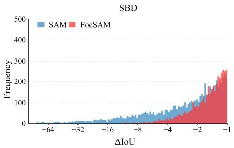

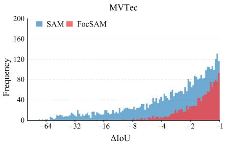

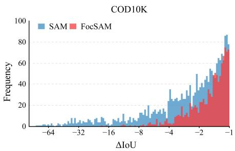

Figure 4. Stability analysis of interactive segmentation. We report results on SBD [19], MVTec [2] and COD10K [10], and show ∆IoU for consecutive clicks, filtering out ∆IoU greater than −1%. The results highlight FocSAM’s superior stability over SAM, evidenced by fewer significant declines in segmentation quality with additional clicks.
<table><tr><td rowspan="2">Dwin-MSA</td><td rowspan="2">P-DyReLU</td><td colspan="2">SBD</td><td colspan="2">MVTec</td><td colspan="2">COD10K</td></tr><tr><td>20NoC@90</td><td>100NoC@95</td><td>20NoC@90</td><td>100NoC@95</td><td>20NoC@90</td><td>100NoC@95</td></tr><tr><td>x</td><td>x</td><td>7.62</td><td>63.40</td><td>13.97</td><td>81.90</td><td>10.36</td><td>76.73</td></tr><tr><td>√</td><td>x</td><td>4.75</td><td>34.39</td><td>11.29</td><td>64.15</td><td>9.26</td><td>64.32</td></tr><tr><td>x</td><td>√</td><td>4.76</td><td>34.52</td><td>11.48</td><td>65.04</td><td>9.33</td><td>64.41</td></tr><tr><td>√</td><td>√</td><td>4.69</td><td>32.96</td><td>11.14</td><td>62.82</td><td>8.91</td><td>62.61</td></tr></table>

Table 2. Ablation study on Dwin-MSA and P-DyReLU. We measure NoC@90 with up to 20 clicks (20NoC@90) and NoC@95 with up to 100 clicks (100NoC@95). Our findings reveal: 1) the metric under 100 clicks emphasizes the influence of challenging samples; 2) Dwin-MSA and P-DyReLU individually yield similar results; 3) combining Dwin-MSA with P-DyReLU enhances the performance, especially evident under 100 clicks, which reduces the negative impact of challenging samples.

## 4.3. Stability Analysis

Experimental Settings. To evaluate the stability, we conduct statistical analyses on the three large-scale datasets, i.e. SBD, MVTec and COD10K. Similar to the evaluation on NoC metrics, each click is placed at the center of the erroneously predicted regions. The number of simulated clicks per sample is increased from 20 to 100. For each sample, from the second interaction click onwards, we calculate the ∆IoU, which is the difference in IoU between consecutive clicks, and filter out ∆IoU greater than −1%. This ensures that only significant deteriorations in segmentation quality are considered. The remaining ∆IoUs are then visualized. Results. As illustrated in Figure 4, FocSAM exhibits considerably better stability across all datasets compared to SAM. The ∆IoU distribution for FocSAM shows a rightward shift, indicating fewer samples of deteriorating segmentation with subsequent clicks. Although SAM occasionally achieves favorable outcomes, its inherent instability often necessitates additional annotator interactions for correcting errors. Therefore, FocSAM represents a stability advance over SAM in terms of real-world interactive efficiency, as evidenced by the stability analysis.

## 4.4. Ablation Study

Experimental Settings. In the ablation study, we evaluate the individual impact of Dwin-MSA and P-DyReLU on FocSAM’s performance. Due to the interdependence of these modules, we slightly modify the modules. For Dwin-MSA only, we remove all P-DyReLU modules, replacing P-DyReLU’s activations in Dwin-MSA with standard ReLU. For P-DyReLU only, we remove the dynamic windows to retain all image embeddings, and remove Dwin’s attention computations. We evaluate these variants on the three largest datasets including SBD, MVTec, and COD10K, using NoC@90 within 20 clicks, and extend to NoC@95 within 100 clicks for deeper analysis. This NoC@95 metric quantifies the individual contributions of each module, especially on more challenging samples. All ablation models are trained with the same protocol of the main experiments. Results. Table 2 shows that Dwin-MSA and P-DyReLU individually contribute similarly to FocSAM’s performance, indicating that they provide comparable interactive information. Dwin-MSA primarily focuses on initially predicted masks for locating main object areas, similar to bounding box prompts in SAM, whereas P-DyReLU leverages initial clicks for primary object outlining. Their interactive information is complementary. Consequently, their combination leads to enhanced overall performance, particularly noticeable in NoC@95 under 100 clicks. This metric underscores the increased click requirement to achieve 95% IoU for challenging samples. The integration of Dwin-MSA and P-DyReLU further stabilizes FocSAM’s performance on challenging samples. More ablation studies are provided in the supplementary materials.

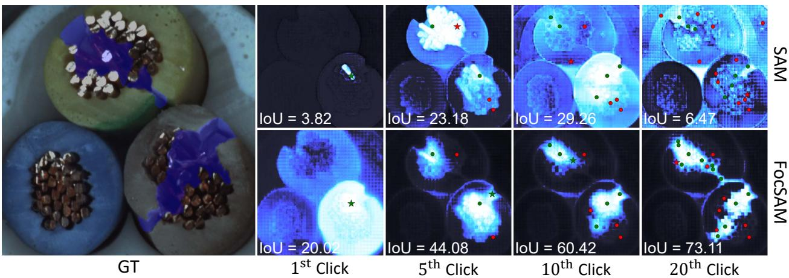  
Figure 5. Qualitative analysis on a challenge Example. The first image from the left displays the challenge example with the image and GT (blue masks). The top and bottom rows on the right respectively show the segmentation results of SAM and FocSAM at the 1st, 5th, 10th, and 20th clicks. Clicks are indicated with green (positive) and red (negative) circles.

## 4.5. Qualitative Results

In Figure 5, we present a qualitative comparison of Foc-SAM and SAM using a challenging example and visualize the segmentation results at four different clicks. This visualization clearly demonstrates FocSAM’s enhanced stability over SAM. Our qualitative analysis confirms that FocSAM maintains consistent performance, providing superior segmentation quality compared to SAM under such a challenging example. Additional qualitative results are available in the supplementary materials.

## 5. Conclusion

SAM provides an efficient real-time pipeline for interactive segmentation, significantly advancing this field. However, SAM’s real-world application stability is compromised, particularly in challenging scenarios. This instability largely stems from SAM’s pipeline, which lacks the capability to effectively focus on the target object. Our proposed FocSAM tackles these stability issues by redesigning the pipeline to dynamically refocus SAM’s image embeddings onto the target object. This adaptation enables Foc-SAM to stabilize the interactive segmentation process of SAM, even in challenging scenarios. As a result, FocSAM not only matches the state-of-the-art in segmentation quality but also achieves this with considerably lower computational demands on CPUs. These advancements highlight FocSAM’s potential for broader real-world application.

## Acknowledgments

This work was supported by National Science and Technology Major Project (No. 2022ZD0118202), the National Science Fund for Distinguished Young Scholars (No.62025603), the National Natural Science Foundation of China (No. U21B2037, No. U22B2051, No. 62176222, No. 62176223, No. 62176226, No. 62072386, No. 62072387, No. 62072389, No. 62002305 and No. 62272401), and the Natural Science Foundation of Fujian Province of China (No.2021J01002, No.2022J06001).

## References

[1] David Acuna, Huan Ling, Amlan Kar, and Sanja Fidler. Efficient interactive annotation of segmentation datasets with polygon-rnn++. In 2018 IEEE Conference on Computer Vision and Pattern Recognition, CVPR 2018, Salt Lake City, UT, USA, June 18-22, 2018, pages 859–868. IEEE Computer Society, 2018. 2

[2] Paul Bergmann, Michael Fauser, David Sattlegger, and Carsten Steger. Mvtec ad–a comprehensive real-world dataset for unsupervised anomaly detection. In Proceedings of the IEEE/CVF conference on computer vision and pattern recognition, pages 9592–9600, 2019. 2, 5, 6, 7

[3] Yuri Y Boykov and M-P Jolly. Interactive graph cuts for optimal boundary & region segmentation of objects in nd images. 1:105–112, 2001. 2

[4] Xi Chen, Zhiyan Zhao, Feiwu Yu, Yilei Zhang, and Manni Duan. Conditional diffusion for interactive segmentation. pages 7345–7354, 2021. 6

[5] Xi Chen, Zhiyan Zhao, Yilei Zhang, Manni Duan, Donglian Qi, and Hengshuang Zhao. Focalclick: towards practical interactive image segmentation. pages 1300–1309, 2022. 1, 2, 5, 6, 7

[6] Yinpeng Chen, Xiyang Dai, Mengchen Liu, Dongdong Chen, Lu Yuan, and Zicheng Liu. Dynamic relu. In European Conference on Computer Vision, pages 351–367. Springer, 2020. 2, 5

[7] Xiangxiang Chu, Zhi Tian, Yuqing Wang, Bo Zhang, Haibing Ren, Xiaolin Wei, Huaxia Xia, and Chunhua Shen. Twins: Revisiting the design of spatial attention in vision transformers. Neural Information Processing Systems,Neural Information Processing Systems, 2021. 3

[8] Xiaoyi Dong, Jianmin Bao, Dongdong Chen, Weiming Zhang, Nenghai Yu, Lu Yuan, Dong Chen, and Baining Guo. Cswin transformer: A general vision transformer backbone with cross-shaped windows. In 2022 IEEE/CVF Conference on Computer Vision and Pattern Recognition (CVPR), 2022. 3

[9] Alexey Dosovitskiy, Lucas Beyer, Alexander Kolesnikov, Dirk Weissenborn, Xiaohua Zhai, Thomas Unterthiner, Mostafa Dehghani, Matthias Minderer, Georg Heigold, Sylvain Gelly, Jakob Uszkoreit, and Neil Houlsby. An image is worth 16x16 words: Transformers for image recognition at scale. In 9th International Conference on Learning Representations, ICLR 2021, Virtual Event, Austria, May 3-7, 2021. OpenReview.net, 2021. 2, 3

[10] Deng-Ping Fan, Ge-Peng Ji, Guolei Sun, Ming-Ming Cheng, Jianbing Shen, and Ling Shao. Camouflaged object detection. In Proceedings of the IEEE/CVF conference on computer vision and pattern recognition, pages 2777–2787, 2020. 2, 5, 6, 7

[11] Yuxin Fang, Wen Wang, Binhui Xie, Quan Sun, Ledell Wu, Xinggang Wang, Tiejun Huang, Xinlong Wang, and Yue Cao. Eva: Exploring the limits of masked visual representation learning at scale. In Proceedings ofthe IEEE/CVF Conference on Computer Vision and Pattern Recognition, pages 19358–19369, 2023. 2

[12] Leo Grady. Random walks for image segmentation. IEEE Transactions on Pattern Analysis and Machine Intelligence, 2006. 2

[13] Jiaqi Gu, Hyoukjun Kwon, Dilin Wang, Wei Ye, Meng Li, Yu-Hsin Chen, Liangzhen Lai, Vikas Chandra, and David Z Pan. Multi-scale high-resolution vision transformer for semantic segmentation. In Proceedings ofthe IEEE/CVF Conference on Computer Vision and Pattern Recognition, pages 12094–12103, 2022. 2

[14] Varun Gulshan, Carsten Rother, Antonio Criminisi, Andrew Blake, and Andrew Zisserman. Geodesic star convexity for interactive image segmentation. In The Twenty-Third IEEE Conference on Computer Vision and Pattern Recognition, CVPR 2010, San Francisco, CA, USA, 13-18 June 2010, pages 3129–3136. IEEE Computer Society, 2010. 2

[15] Qipeng Guo, Xipeng Qiu, Pengfei Liu, Yunfan Shao, Xiangyang Xue, and Zheng Zhang. Star-transformer. In Proceedings ofthe 2019 Conference ofthe North, 2019. 3

[16] Agrim Gupta, Piotr Dollar, and Ross B. Girshick. LVIS: A´ dataset for large vocabulary instance segmentation. In IEEE Conference on Computer Vision and Pattern Recognition, CVPR 2019, Long Beach, CA, USA, June 16-20, 2019, pages 5356–5364. Computer Vision Foundation / IEEE, 2019. 5, 6

[17] Dongchen Han, Xuran Pan, Yizeng Han, Shiji Song, and Gao Huang. Flatten transformer: Vision transformer using focused linear attention. In Proceedings of the IEEE/CVF International Conference on Computer Vision, pages 5961– 5971, 2023. 3

[18] Yuying Hao, Yi Liu, Zewu Wu, Lin Han, Yizhou Chen, Guowei Chen, Lutao Chu, Shiyu Tang, Zhiliang Yu, Zeyu Chen, et al. Edgeflow: Achieving practical interactive segmentation with edge-guided flow. pages 1551–1560, 2021. 6

[19] Bharath Hariharan, Pablo Arbelaez, Lubomir D. Bourdev, Subhransu Maji, and Jitendra Malik. Semantic contours from inverse detectors. In IEEE International Conference on Computer Vision, ICCV 2011, Barcelona, Spain, November 6-13, 2011, pages 991–998. IEEE Computer Society, 2011. 2, 5, 6, 7

[20] Kaiming He, Georgia Gkioxari, Piotr Dollar, and Ross Gir-´ shick. Mask r-cnn. In Proceedings ofthe IEEE international conference on computer vision, pages 2961–2969, 2017. 4

[21] Kaiming He, Xinlei Chen, Saining Xie, Yanghao Li, Piotr Dollar, and Ross Girshick. Masked autoencoders are scal-´ able vision learners. arXiv: Computer Vision and Pattern Recognition, 2021. 2

[22] Jonathan Ho, Nal Kalchbrenner, Dirk Weissenborn, and Tim Salimans. Axial attention in multidimensional transformers. Cornell University - arXiv,Cornell University - arXiv, 2019. 3

[23] You Huang, Hao Yang, Ke Sun, Shengchuan Zhang, Liujuan Cao, Guannan Jiang, and Rongrong Ji. Interformer: Real-time interactive image segmentation. In Proceedings ofthe IEEE/CVF International Conference on Computer Vision, pages 22301–22311, 2023. 1, 2, 5, 6

[24] Zilong Huang, Xinggang Wang, Yunchao Wei, Lichao Huang, Humphrey Shi, Wenyu Liu, and Thomas S. Huang.

Ccnet: Criss-cross attention for semantic segmentation. IEEE Transactions on Pattern Analysis and Machine Intelligence, page 1–1, 2020. 3

[25] Won-Dong Jang and Chang-Su Kim. Interactive image segmentation via backpropagating refinement scheme. In IEEE Conference on Computer Vision and Pattern Recognition, CVPR 2019, Long Beach, CA, USA, June 16-20, 2019, pages 5297–5306. Computer Vision Foundation / IEEE, 2019. 2, 5

[26] Noel E. O’Connor Kevin McGuinness. A comparative evaluation of interactive segmentation algorithms. Pattern Recognition, 2010. 2, 5, 6

[27] Salman Khan, Muzammal Naseer, Munawar Hayat, Syed Waqas Zamir, Fahad Shahbaz Khan, and Mubarak Shah. Transformers in vision: A survey. ACM computing surveys (CSUR), 54(10s):1–41, 2022. 2

[28] Alexander Kirillov, Eric Mintun, Nikhila Ravi, Hanzi Mao, Chloe Rolland, Laura Gustafson, Tete Xiao, Spencer Whitehead, Alexander C. Berg, Wan-Yen Lo, Piotr Dollar, and´ Ross Girshick. Segment anything. arXiv:2304.02643, 2023. 1, 2, 3, 5, 6, 7

[29] Anton Konushin Konstantin Sofiiuk, Ilia A. Petrov. Reviving iterative training with mask guidance for interactive segmentation. arXiv: Computer Vision and Pattern Recognition, 2021. 1, 2, 5, 6

[30] Xin Lai, Zhuotao Tian, Yukang Chen, Yanwei Li, Yuhui Yuan, Shu Liu, and Jiaya Jia. Lisa: Reasoning segmentation via large language model. arXiv preprint arXiv:2308.00692, 2023. 2

[31] Yanghao Li, Hanzi Mao, Ross Girshick, and Kaiming He. Exploring plain vision transformer backbones for object detection. 2, 3

[32] Zhuwen Li, Qifeng Chen, and Vladlen Koltun. Interactive image segmentation with latent diversity. In 2018 IEEE Conference on Computer Vision and Pattern Recognition, CVPR 2018, Salt Lake City, UT, USA, June 18-22, 2018, pages 577– 585. IEEE Computer Society, 2018. 2

[33] Tsung-Yi Lin, Michael Maire, Serge Belongie, James Hays, Pietro Perona, Deva Ramanan, Piotr Dollar, and C. Lawrence´ Zitnick. Microsoft coco: Common objects in context. Lecture Notes in Computer Science, 2014. 5, 6

[34] Zheng Lin, Zhao Zhang, Lin-Zhuo Chen, Ming-Ming Cheng, and Shao-Ping Lu. Interactive image segmentation with first click attention. In 2020 IEEE/CVF Conference on Computer Vision and Pattern Recognition, CVPR 2020, Seattle, WA, USA, June 13-19, 2020, pages 13336–13345. IEEE, 2020. 2

[35] Zheng Lin, Zheng-Peng Duan, Zhao Zhang, Chun-Le Guo, and Ming-Ming Cheng. Focuscut: Diving into a focus view in interactive segmentation. pages 2637–2646, 2022. 2

[36] Qin Liu, Zhenlin Xu, Gedas Bertasius, and Marc Niethammer. Simpleclick: Interactive image segmentation with simple vision transformers. arXiv preprint arXiv:2210.11006, 2022. 1, 2, 5, 6, 7

[37] Qin Liu, Meng Zheng, Benjamin Planche, Srikrishna Karanam, Terrence Chen, Marc Niethammer, and Ziyan Wu. Pseudoclick: Interactive image segmentation with click imitation. pages 728–745, 2022. 2, 5, 6

[38] Ze Liu, Yutong Lin, Yue Cao, Han Hu, Yixuan Wei, Zheng Zhang, Stephen Lin, and Baining Guo. Swin transformer: Hierarchical vision transformer using shifted windows. In Proceedings of the IEEE/CVF international conference on computer vision, pages 10012–10022, 2021. 3, 5

[39] Ze Liu, Han Hu, Yutong Lin, Zhuliang Yao, Zhenda Xie, Yixuan Wei, Jia Ning, Yue Cao, Zheng Zhang, Li Dong, et al. Swin transformer v2: Scaling up capacity and resolution. In Proceedings of the IEEE/CVF conference on computer vision and pattern recognition, pages 12009–12019, 2022. 2, 5

[40] Jun Ma and Bo Wang. Segment anything in medical images. arXiv preprint arXiv:2304.12306, 2023. 2

[41] Kevis-Kokitsi Maninis, Sergi Caelles, Jordi Pont-Tuset, and Luc Van Gool. Deep extreme cut: From extreme points to object segmentation. In 2018 IEEE Conference on Computer Vision and Pattern Recognition, CVPR 2018, Salt Lake City, UT, USA, June 18-22, 2018, pages 616–625. IEEE Computer Society, 2018. 2

[42] Maciej A Mazurowski, Haoyu Dong, Hanxue Gu, Jichen Yang, Nicholas Konz, and Yixin Zhang. Segment anything model for medical image analysis: an experimental study. Medical Image Analysis, 89:102918, 2023. 2

[43] Federico Perazzi, Jordi Pont-Tuset, Brian McWilliams, Luc Van Gool, Markus H. Gross, and Alexander Sorkine-Hornung. A benchmark dataset and evaluation methodology for video object segmentation. In 2016 IEEE Conference on Computer Vision and Pattern Recognition, CVPR 2016, Las Vegas, NV, USA, June 27-30, 2016, pages 724–732. IEEE Computer Society, 2016. 2, 5, 6

[44] Pengzhen Ren, Changlin Li, Guangrun Wang, Yun Xiao, and QingDuXiaodanLiangXiaojun Chang. Beyond fixation: Dynamic window visual transformer. 3

[45] Carsten Rother, Vladimir Kolmogorov, and Andrew Blake. ”grabcut” interactive foreground extraction using iterated graph cuts. ACM transactions on graphics (TOG), 23(3): 309–314, 2004. 2, 5, 6

[46] Konstantin Sofiiuk, Ilia A. Petrov, Olga Barinova, and Anton Konushin. F-BRS: rethinking backpropagating refinement for interactive segmentation. In 2020 IEEE/CVF Conference on Computer Vision and Pattern Recognition, CVPR 2020, Seattle, WA, USA, June 13-19, 2020, pages 8620– 8629. IEEE, 2020. 2, 4, 6

[47] Robin Strudel, Ricardo Garcia, Ivan Laptev, and Cordelia Schmid. Segmenter: Transformer for semantic segmentation. pages 7262–7272, 2021. 2

[48] Ashish Vaswani, Noam Shazeer, Niki Parmar, Jakob Uszkoreit, Llion Jones, Aidan N. Gomez, Lukasz Kaiser, and Illia Polosukhin. Attention is all you need. In Advances in Neural Information Processing Systems 30: Annual Conference on Neural Information Processing Systems 2017, December 4-9, 2017, Long Beach, CA, USA, pages 5998–6008, 2017. 2, 5

[49] Ashish Vaswani, Prajit Ramachandran, Aravind Srinivas, Niki Parmar, Blake Hechtman, and Jonathon Shlens. Scaling local self-attention for parameter efficient visual backbones. In 2021 IEEE/CVF Conference on Computer Vision and Pattern Recognition (CVPR), 2021. 3

[50] Jiaqi Wang, Zhengliang Liu, Lin Zhao, Zihao Wu, Chong Ma, Sigang Yu, Haixing Dai, Qiushi Yang, Yiheng Liu, Songyao Zhang, et al. Review of large vision models and visual prompt engineering. arXiv preprint arXiv:2307.00855, 2023. 2

[51] Wenxiao Wang, Lu Yao, Long Chen, Deng Cai, Xiaofei He, and Wei Liu. Crossformer: A versatile vision transformer based on cross-scale attention. arXiv: Computer Vision and Pattern Recognition,arXiv: Computer Vision and Pattern Recognition, 2021. 3

[52] Wenhai Wang, Jifeng Dai, Zhe Chen, Zhenhang Huang, Zhiqi Li, Xizhou Zhu, Xiaowei Hu, Tong Lu, Lewei Lu, Hongsheng Li, et al. Internimage: Exploring large-scale vision foundation models with deformable convolutions. In Proceedings of the IEEE/CVF Conference on Computer Vision and Pattern Recognition, pages 14408–14419, 2023. 2

[53] Junde Wu, Rao Fu, Huihui Fang, Yuanpei Liu, Zhaowei Wang, Yanwu Xu, Yueming Jin, and Tal Arbel. Medical sam adapter: Adapting segment anything model for medical image segmentation. arXiv preprint arXiv:2304.12620, 2023. 2

[54] Enze Xie, Wenhai Wang, Zhiding Yu, Animashree Anandkumar, JoseM. Alvarez, and Ping Luo. Segformer: Simple and efficient design for semantic segmentation with transformers. Cornell University - arXiv,Cornell University - arXiv, 2021. 2, 3

[55] Ning Xu, Brian L. Price, Scott Cohen, Jimei Yang, and Thomas S. Huang. Deep interactive object selection. In 2016 IEEE Conference on Computer Vision and Pattern Recognition, CVPR 2016, Las Vegas, NV, USA, June 27-30, 2016, pages 373–381. IEEE Computer Society, 2016. 2

[56] Jianwei Yang, Chunyuan Li, Pengchuan Zhang, Xiyang Dai, Bin Xiao, Lu Yuan, Jianfeng Gao, MicrosoftResearchAt Redmond, Microsoft Cloud, and + Ai. Focal self-attention for local-global interactions in vision transformers. 3

[57] Tao Yu, Runseng Feng, Ruoyu Feng, Jinming Liu, Xin Jin, Wenjun Zeng, and Zhibo Chen. Inpaint anything: Segment anything meets image inpainting. arXiv preprint arXiv:2304.06790, 2023. 2

[58] Yuhui Yuan, Rao Fu, Lang Huang, Weihong Lin, Chao Zhang, Xilin Chen, and Jingdong Wang. Hrformer: Highresolution vision transformer for dense predict. Advances in Neural Information Processing Systems, 34:7281–7293, 2021. 2

[59] Shiyin Zhang, Jun Hao Liew, Yunchao Wei, Shikui Wei, and Yao Zhao. Interactive object segmentation with insideoutside guidance. In 2020 IEEE/CVF Conference on Computer Vision and Pattern Recognition, CVPR 2020, Seattle, WA, USA, June 13-19, 2020, pages 12231–12241. IEEE, 2020. 2

[60] Shen Zhuoran, Zhang Mingyuan, Zhao Haiyu, Yi Shuai, and Li Hongsheng. Efficient attention: Attention with linear complexities. In 2021 IEEE Winter Conference on Applications ofComputer Vision (WACV), 2021. 3