# FreeDrag: Feature Dragging for Reliable Point-based Image Editing

Pengyang Ling1\* Lin Chen1,2\* Pan Zhang2 Huaian Chen1† Yi Jin1† Jinjin Zheng 1 1University of Science and Technology of China 2Shanghai AI Laboratory {lpyang27, chlin}@mail.ustc.edu.cn {anchen, jinyi08, jjzheng}@ustc.edu.cn zhangpan@pjlab.org.cn

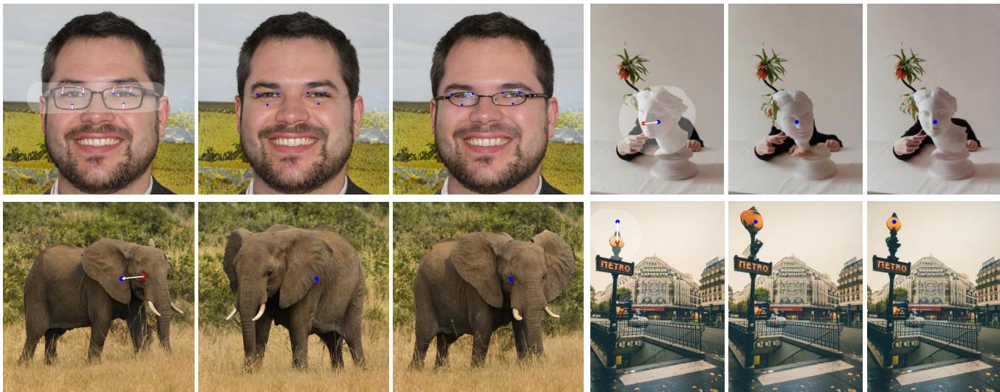  
Image & Edit  
DragGAN  
FreeDrag  
Image & Edit  
DragDiffusion  
FreeDrag  
Figure 1. The comparison between the feature-centric FreeDrag and point-based DragGAN [33] and DragDiffusion[43]. Given an image input, users can assign handle points (red points) and target points (blue points) to force the semantic positions of the handle points to reach corresponding target points, and optional mask can also be provided by users to assign editing region.

## Abstract

To serve the intricate and varied demands ofimage editing, precise and flexible manipulation in image content is indispensable. Recently, Drag-based editing methods have gained impressive performance. However, these methods predominantly center on point dragging, resulting in two noteworthy drawbacks, namely “miss tracking”, where difficulties arise in accurately tracking the predetermined handle points, and “ambiguous tracking”, where trackedpoints are potentially positioned in wrong regions that closely resemble the handle points. To address the above issues, we propose FreeDrag, a feature dragging methodology designed to free the burden on point tracking. The Free-Drag incorporates two key designs, i.e., template feature via adaptive updating and line search with backtracking, the former improves the stability against drastic content change by elaborately controlling thefeature updating scale after each dragging, while the latter alleviates the misguidance from similar points by actively restricting the search area in a line. These two technologies together contribute to a more stable semantic dragging with higher efficiency.

Comprehensive experimental results substantiate that our approach significantly outperforms pre-existing methodologies, offering reliable point-based editing even in various complex scenarios.

## 1. Introduction

The domain of image editing utilizing generative models has gained substantial attention and witnessed remarkable advancements in recent years [10, 14, 24, 31, 36, 38]. In order to effectively address the intricate and diverse demands of image editing in real-world applications, it becomes imperative to achieve precise and flexible manipulation of image content. Consequently, researchers have proposed two primary categories of methodologies in this domain: (1) harnessing prior 3D models [8, 12, 46] or manual annotations [2, 17, 26, 34, 42] to enhance control over generative models, and (2) employing textual guidance for conditional generative models [37, 39, 41]. Nevertheless, the former category of methodologies often encounters challenges in generalizing to novel assets, while the latter category exhibits limitations in terms of precision and flexibility when it comes to spatial attribute editing.

To tackle these aforementioned limitations, a recent pioneering study, known as DragGAN [33], has emerged as a remarkable contribution in the realm of precise image editing. This work has garnered significant attention, primarily due to its interactive point-based editing capability, termed “drag” editing, which enables users to exert precise control over the editing process by specifying pairs of handle and target points on the given image. The DragGAN framework introduces a two-step iterative process: (i) a motion supervision step, which directs the handle points to migrate towards their corresponding target positions, and (ii) a point tracking step, which consistently tracks the relocated handle points’ positions. In each iteration, the points derived from the current iteration necessitate supervision from points of the last iteration and are subsequently tracked for the next iteration. We categorize this type of method, exemplified by DragGAN and its variant [43], as point dragging solutions.

Notwithstanding the praiseworthy achievements exhibited by point dragging solution, there exist several issues. One issue is miss tracking, whereby point dragging encounters difficulty in effectively tracking the desired handle points. This issue arises particularly in highly curved regions with a large perceptual path length, as observed in latent space [21]. In such cases, the optimized image undergoes drastic changes, leading to handle points in subsequent iterations being positioned outside the intended search region. Additionally, in certain scenarios, miss tracking leads to the disappearance of handle points, as shown in Figure 2. It is important to note that during miss tracking, the cumulative error in the motion supervision step increases progressively as iterations proceed, owing to the misalignment of tracked features. Another issue that arises is ambiguous tracking, where the tracked points are situated within other regions that bear resemblance to the handle points. This predicament emerges when there are areas in the image that possess similar features to the intended handle points, leading to ambiguity in the tracking process. (see Figure 3). This issue introduces a potential challenge as it can misguide the motion supervision process in subsequent iterations, leading to inaccurate or misleading directions.

To remedy the aforementioned issues, we propose Free-Drag, a feature dragging solution for interactive pointbased image editing. To address the miss tracking issue, we introduce a template feature that is maintained for each handle point to supervise the movements during the iterative process. This template feature is implemented as an exponential moving average feature that dynamically adjusts its weights based on the errors encountered in each iteration. Even when miss tracking occurs in a specific iteration, the maintained template feature remains intact, preventing the optimized image from undergoing drastic changes. To handle the ambiguous tracking issue, we propose the line search with backtracking. Line search restricts the movements along a specific line connecting the original handle point and the corresponding target point. This constraint effectively reduces the presence of ambiguous points and minimizes the potential misguidance of the movement direction in subsequent iterations. Moreover, the backtracking mechanism enables prompt adjustment for motion plan by effectively discriminating abnormal motion, thereby enhancing the reliability of the total movement process. In light of the fact that the points in each iteration undergo supervision from template features and do not necessitate exacting tracking precision, we classify our approach as a feature dragging solution. To summarize, our key contributions are as follows:

• We propose FreeDrag, a feature dragging solution for reliable point-based image editing that incorporates adaptive template features and line search with backtracking, marking a significant advancement in the field of flexible and precise image editing.

• We propose FreeDragBench, a new evaluation dataset with 2251 handmade dragging instructions that are tailored for GAN-based dragging editing, equipped with a new metric, which measures the editing accuracy of a pair of symmetrical dragging instructions.

## 2. Related Work

## 2.1. Generative Adversarial Networks

Generative adversarial networks (GANs)[13] have maintained the dominant position in image generation for an extended period. Classical unconditional GANs [6], are devised to learn the mapping function from low-dimension random variables to realistic images that conform to the distribution of training datasets. Typically, the Style-GAN architecture [21–23, 30], which employs a mapping network for low-dimension representation disentanglement and a synthesis network for photorealistic image generation, has made significant success in both generation quality and flexible style manipulation. Meanwhile, conditional GANs have been developed to enable versatile applications by infusing additional conditions, such as segmentation maps[19, 35], aerial photo[48], degraded images[9, 18, 50], and 3D variables [7, 11].

## 2.2. Diffusion Models

The emerging diffusion models [15, 44], which conduct gradual denoising procedures from Gaussian noises to natural images, have recently sparked a strong wave of more potent image synthesis. Based on its promising generation capability, a series of versatile methods [3, 20, 25, 47, 51] are developed to exceed the performance peaks of various generation tasks. Typically, Rombach et al. propose the Latent

Diffusion Model (LDM)[40], which employs a pre-trained auto-encoder for perceptual compression and then performs high-quality sample in latent space, bringing a substantial advancement in high-resolution image synthesis.

## 2.3. Point-based Image Editing

Given an image, interactive image editing aims to modify certain image content in response to specific user input, such as text instructions [4, 28, 29, 53], region mask [27], and reference images [5, 49]. The uniqueness of pointbased image editing lies in that the user input is a set of point coordinates, and the generative models are expected to achieve precise image content manipulation to match the intent of users. For instance, Endo [10] devises a latent transformer architecture to learn the mapping between two latent codes in StyleGAN. However, this framework necessitates the aid of a pre-trained optical flow network and demands a training procedure tailored for each model, which limits its practicability. Later, DragGAN [33] garners considerable attention with remarkable performance, which performs a cycle of point tracking and motion supervision in the feature map to persistently force the handle point to move to the target point. This simple framework achieves impressive performance and attracts subsequent works [32, 43] for better combination with the popular diffusion models.

Generally, the GAN-based dragging approaches achieve superior dragging compared to diffusion-based approaches but exhibit inferior real image inversion. The GAN-based approaches benefit from the attribute disentanglement of StyleGAN, enhancing dragging capability. However, its generative quality and real image inversion ability are comparatively limited. In contrast, diffusion models achieve higher generative quality and superior real image inversion. Nevertheless, it encounters challenges in balancing point manipulation and appearance preservation due to the intertwined feature map, and demands more processing time.

## 3. Motivation

Given a set of n handle points $\{ p _ { 1 } , p _ { 2 } , p _ { 3 } . . . , p _ { n } \}$ and a corresponding set of n target points $\{ t _ { 1 } , t _ { 2 } , t _ { 3 } . . . , t _ { n } \}$ , the objective of point-based dragging is to displace $p _ { i }$ to its respective $t _ { i } .$ . Illustrated in Fig. 4, the widely adopted DragGAN [33] accomplishes this objective through two sequential steps in each motion: (i) Motion Supervision, wherein the current handle point is consistently directed towards its target point by leveraging the feature of itself. (ii) Point Tracking, involving the search for the handle point in the proximity of the handle point from the last motion. Denoting the initial feature map as $F _ { 0 }$ , the tracked handle point $p _ { i } ^ { k }$ for the k-th motion possesses the most similar feature to $\dot { F } _ { 0 } ( p _ { i } ^ { 0 } )$ in the 2D tracking area centered at $p _ { i } ^ { k - 1 }$

While the point dragging pipeline depicted in Fig. 4 presents a promising solution for point-based image editing, it is noted that it frequently encounters challenges, including handle point loss, imprecise editing, and distorted image generation in certain scenarios. These issues are attributed to the intrinsic instability of point dragging, encompassing miss tracking and ambiguous tracking. (i) Miss Tracking: This occurs in situations where point dragging encounters difficulty in effectively tracking the designated handle points. Given the presence of highly curved regions with substantial perceptual path lengths, as discerned in latent space [21], the optimized image undergoes significant alterations following motion supervision. Consequently, the handle point $p _ { i } ^ { k + 1 }$ deviates outside the intended search region of $p _ { i } ^ { k }$ , as shown in Figure 2, leading to miss tracking in the point tracking step. In specific scenarios, $p _ { i } ^ { k + 1 }$ may completely vanish from the entire feature map, exemplified by the disappeared glasses in Figure 2. It is imperative to underscore that during miss tracking, the cumulative error in the motion supervision step progressively amplifies with iterations due to the misalignment of tracked features. (ii) Ambiguous Tracking: This occurs when the tracked points are positioned within other regions that bear resemblance to the handle points. This challenge arises when there are areas in the image exhibiting features similar to the intended handle points, such as the blue boundary lines and horse’s hooves in Figure 3, which may misdirect the motion supervision process in subsequent iterations, resulting in inaccurate or misleading directional adjustments.

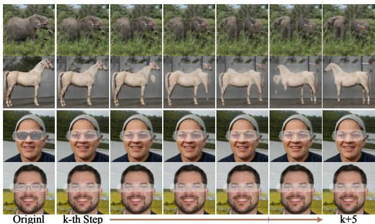

Figure 2. Miss tracking of DragGAN [33] due to the drastic change in layout (first and second rows) and the disappearance of handle points (third and last rows).  
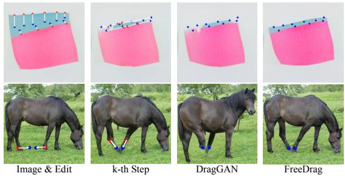  
Figure 3. Ambiguous tracking in DragGAN [33] due to the existence of similar structures.

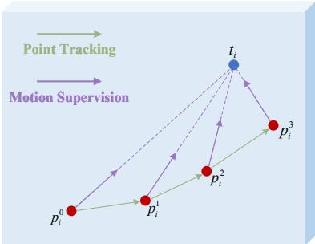  
Figure 4. Concept illustration of point dragging pipeline. $p _ { i } ^ { k }$ denotes the tracked position of i-th handle point in k-th motion $( p _ { i } ^ { 0 } = p _ { i } )$ , and $t _ { i }$ indicates the corresponding i-th target point.

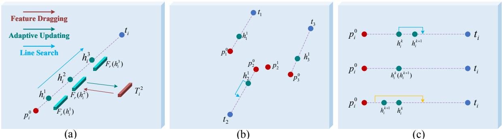  
Figure 5. Illustration of proposed feature dragging pipeline. hki denotes the searched point in k-th drag, which lies in the line formed by p0i and $t _ { i } ,$ and $T _ { i } ^ { k }$ denotes the corresponding template feature. (a) Concept of feature dragging. (b) The coupling movement under multiple points dragging. (c) The visualization of Eq. 9.

## 4. Methodology

In light of the instability associated with point dragging, which heavily depends on accurate point tracking in each step, we introduce a feature dragging approach termed FreeDrag, as illustrated in Fig. 5(a). Here, $h _ { i } ^ { k }$ represents the target position in the k-th drag, and $F _ { r } ( h _ { i } ^ { k } )$ signifies the feature aggregate centered at $h _ { i } ^ { k }$ with a radius r in the feature map F, which can be expressed as:

$$
F _ { r } ( h _ { i } ^ { k } ) = \sum _ { q _ { i } \in \Omega ( h _ { i } ^ { k } , r ) } F ( q _ { i } ) .\tag{1}
$$

Here, $\Omega ( h _ { i } ^ { k } , r )$ denotes the square patch centered at $h _ { i } ^ { k }$ with a side length of 2r. In the k-th drag, we promote $h _ { i } ^ { k }$ to be the carrier of $T _ { i } ^ { k }$ by compelling the feature aggregate $F _ { r } ( h _ { i } ^ { k } )$ to closely align with the template feature $T _ { i } ^ { k }$ (as depicted by the red line in Fig. 5(a)), i.e.,

$$
\mathcal { L } _ { d r a g } = \sum _ { i = 1 } ^ { n } \left\| F _ { r } ( h _ { i } ^ { k } ) - T _ { i } ^ { k } \right\| _ { 1 } .\tag{2}
$$

In order to facilitate high-quality feature dragging, multiple optimization steps are performed from the same position $h _ { i } ^ { k }$ , with consistent supervision as defined in Eq. 2.

The template feature undergoes adaptive updating according the quality of each dragging, as detailed in Section 4.1. This updated template feature guides the feature of the handle point in the subsequent dragging. By gradually compelling $h _ { i } ^ { k }$ to approach $t _ { i } ,$ the template feature effectively transitions to the final $t _ { i } ,$ indirectly encouraging the handle point to move towards the ultimate position. Additionally, we enforce constraints on $h _ { i } ^ { k }$ and iterate to update the subsequent handle point $h _ { i } ^ { k + 1 }$ along the line extending from $p _ { i } ^ { 0 }$ to $t _ { i }$ (as illustrated by the blue line in Fig. 5(a)). This approach not only provides a reliable movement direction but also significantly reduces the risk of misguidance arising from potential similar points.

## 4.1. Template Features via Adaptive Updating

Concerning the template feature, it necessitates retaining the feature of the initial handle point on one hand, while on the other hand, it should undergo updates to accommodate reasonable geometric and appearance changes in each dragging. Accordingly, we introduce an adaptive updating strategy that permits a flexible updating scale, enabling the template feature to undergo few updates in chaotic situations and more updates in fine conditions. Specifically, the adaptive updating strategy for the template feature is formulated as follows:

$$
T _ { i } ^ { k + 1 } = \lambda _ { i } ^ { k } \cdot F _ { r } ( h _ { i } ^ { k } ) + ( 1 - \lambda _ { i } ^ { k } ) \cdot T _ { i } ^ { k } .\tag{3}
$$

Here, ${ \boldsymbol { \lambda } } _ { i } ^ { k }$ represents the coefficient controlling the updating scale of the template feature in the k-th dragging. For consistency, we specifically define $\lambda _ { i } ^ { 0 } = 0 , h _ { i } ^ { 0 } = p _ { i } ^ { 0 }$ , and $T _ { i } ^ { 0 } = F _ { r } ( p _ { i } ^ { 0 } )$ . Intuitively, for the k-th dragging, a smaller ${ \boldsymbol { \lambda } } _ { i } ^ { k }$ is employed for low-quality feature dragging. This aids in maintaining $\boldsymbol { T } _ { i } ^ { k + 1 }$ relatively constant in chaotic situations. Conversely, a larger $\lambda _ { i } ^ { k }$ is utilized for high-quality feature dragging, promoting sufficient updating of $T _ { i } ^ { \hat { k } + 1 }$ in fine conditions.

For simplicity, the feature discrepancy of between $F _ { r } ( h _ { i } ^ { k } )$ and $T _ { i } ^ { k }$ is denoted as $\boldsymbol { L } _ { ( i , k ) }$ . Since Eq. 2 is reused in multiple optimization steps for each feature dragging, we define $\boldsymbol { L } _ { ( i , k ) }$ at the initial/end optimization step in each dragging as $L _ { ( i , k ) } ^ { i n }$ and $L _ { ( i , k ) } ^ { e n }$ , respectively. Accordingly. $L _ { ( i , k ) } ^ { i n }$ controls the difficulty of k-th feature dragging from $T _ { i } ^ { k }$ to $F _ { r } ( h _ { i } ^ { k } )$ , and a larger $L _ { ( i , k ) } ^ { i n }$ indicates more arduous challenge for feature dragging. While $L _ { ( i , k ) } ^ { e n }$ reflects the quality of each feature dragging, i,e, a smaller $\boldsymbol { L } _ { ( i , k ) } ^ { e n }$ means fewer discrepancy between $T _ { i } ^ { k }$ and $F _ { r } ( h _ { i } ^ { k } )$ at the last optimization step, which implies higher quality feature dragging from $T _ { i } ^ { k }$ to $F _ { r } ( h _ { i } ^ { k } )$ . Therefore, the adaptive coefficient ${ \boldsymbol { \lambda } } _ { i } ^ { k }$ in Eq. 3 is devised as:

$$
\lambda _ { i } ^ { k } = ( 1 + e x p ( \alpha \cdot ( L _ { ( i , k ) } ^ { e n } - \beta ) ) ) ^ { - 1 } ,\tag{4}
$$

where α and $\beta$ denote two positive constants, and $e x p ( \cdot )$ represents the exponential function. Given a hyperparameter l, we determine α and β by considering the following typical scenarios: (i) the well-optimized case, where we set $L _ { ( i , k ) } ^ { e n } = 0 . 2 \cdot l$ with $\lambda = 0 . 5 ;$ and (ii) the ill-optimized case, where we set $L _ { ( i , k ) } ^ { e n } = 0 . 8 \cdot l$ with $\lambda = 0 . 1 , i . e .$

$$
0 . 5 = ( 1 + e x p ( \alpha \cdot ( 0 . 2 \cdot l - \beta ) ) ) ^ { - 1 } ,\tag{5}
$$

$$
0 . 1 = ( 1 + e x p ( \alpha \cdot ( 0 . 8 \cdot l - \beta ) ) ) ^ { - 1 } .\tag{6}
$$

Solving the equation yields $\alpha = \ln ( 9 ) / ( 0 . 6 \cdot l )$ and $\beta =$ 0.2 · l. It is noteworthy that we impose a constraint on the maximum value of λ to mitigate the potential impact of incorrect updating.

## 4.2. Line Search with Backtracking

For the target position $h _ { i } ^ { k }$ in the k-th dragging, we contemplate its localization from two perspectives: i) Reliable motion direction; ii) Appropriate feature discrepancy at the beginning of each drag, denoted as $L _ { ( i , k ) } ^ { i n }$ . A too small value of $L _ { ( i , k ) } ^ { i n }$ fails to furnish adequate discrepancy in Eq. 2 for gradient optimization, while an excessively large $L _ { ( i , k ) } ^ { i n }$ heightens the risk of unsuccessful feature dragging.

From the first goal, illustrated in Fig. 5(a), we constraint $h _ { i } ^ { k }$ to the line extending from $p _ { i } ^ { 0 }$ to $t _ { i } .$ This approach not only ensures a reliable movement direction but also markedly diminishes the risk of misguidance stemming from potential similar points. As for the second goal, point localization is conducted based on both feature discrepancy and motion distance, expressed as:

$$
h _ { i } ^ { k + 1 } = S ( h _ { i } ^ { k } , t _ { i } , T _ { i } ^ { k + 1 } , d , l )\tag{7}
$$

$$
= \underset { q _ { i } \in \pi ( h _ { i } ^ { k } , t _ { i } , d ) } { \arg \operatorname* { m i n } } \left\| \| F _ { r } ( q _ { i } ) - T _ { i } ^ { k + 1 } \| _ { 1 } - l \right\| _ { 1 } ,\tag{8}
$$

where l and d are two hyperparameters that control initial feature distance $L _ { ( i , k ) } ^ { i n }$ and maximum single movement distance, respectively, and $\pi ( h _ { i } ^ { k } , t _ { i } , d )$ represents the point set, which includes $\begin{array} { r } { h _ { i } ^ { k } + j \cdot \frac { t _ { i } - h _ { i } ^ { k } } { \left| t _ { i } - h _ { i } ^ { k } \right| _ { 2 } } \operatorname { w i t h } j = 0 . 1 { \cdot } d , 0 . 2 { \cdot } d , . . . , d . } \end{array}$

Additionally, as depicted in Fig. 5(b), during the joint optimization of multiple points dragging, the motion direction of a specific point may be influenced by the overall trend. This can result in the handle point deviating from the target point in certain steps. For instance, in comparison to $p _ { 2 } ^ { 0 }$ , the handle point $p _ { 2 } ^ { 1 }$ is farther away from $h _ { 2 } ^ { 1 }$ . To address this issue, we integrate a backtracking mechanism to identify such abnormal movements, facilitating prompt adjustments for the subsequent dragging plan. Concretely, backtracking is implemented by introducing two additional options for the dragging plan: frozen and fallback the point, which can be expressed as:

$$
\begin{array} { r } { h _ { i } ^ { k + 1 } = \left\{ \begin{array} { l l } { S ( h _ { i } ^ { k } , t _ { i } , T _ { i } ^ { k + 1 } , d , l ) , \quad i f \ L _ { ( i , k ) } ^ { e n } \leq 0 . 5 \cdot l } \\ { h _ { i } ^ { k } , \qquad e l i f \ L _ { ( i , k ) } ^ { e n } \leq L _ { ( i , k ) } ^ { i n } } \\ { S ( h _ { i } ^ { k } - d \cdot \frac { t _ { i } - h _ { i } ^ { k } } { \left\| t _ { i } - h _ { i } ^ { k } \right\| _ { 2 } } , t _ { i } , T _ { i } ^ { k + 1 } , 2 d , 0 ) , e l s e } \end{array} \right. } \end{array}\tag{9}
$$

For better comprehension, Eq. 9 has been visually represented in Fig. 5(c). To elaborate, the first scenario corresponds to a normal high-quality optimization, where $h _ { i } ^ { k + 1 }$ closer to $t _ { i }$ is assigned for further movement (depicted by the blue line in Fig. 5(c)). The second scenario corresponds to insufficient feature dragging, where $h _ { i } ^ { k }$ is reused as $t _ { i } ^ { k + 1 }$ for continued feature dragging towards the same point. In the exceptional case, i.e., $L _ { ( i , k ) } ^ { e n } > { m a x \left\{ 0 . 5 \cdot l , L _ { ( i , k ) } ^ { i n } \right\} }$ we set $l ~ = ~ 0$ and double the search range (illustrated by the yellow line in Fig. 5(c)) to immediately locate the point closest to the template feature $\boldsymbol { T } _ { i } ^ { k + 1 }$ , promptly avoiding deterioration.

## 4.3. Termination Signal

For each feature dragging towards $h _ { i } ^ { k }$ , the maximum optimization step of each feature dragging is set as 5. To enhance efficiency, we pause the optimization process if $L _ { ( i , k ) } ^ { e n }$ already falls below 0.5 · l. The final termination signal is obtained by determining if the remaining distance $| | h _ { i } ^ { k } - t _ { i } | | _ { 2 } \leq 2$

## 4.4. Directional Editing

If the optional binary mask is provided by users, the mask loss can be obtained as:

$$
\mathcal { L } _ { m a s k } = \| ( F _ { 0 } - F ) \odot ( 1 - M ) \| _ { 1 } ,\tag{10}
$$

where $F _ { 0 }$ denotes the initial feature without any dragging, and ⊙ is the element-wise multiplication. The total training loss can be expressed as:

$$
\mathcal { L } _ { t o t a l } = \mathcal { L } _ { d r a g } + \gamma \cdot \mathcal { L } _ { m a s k } .\tag{11}
$$

where γ is the hyperparameter for loss balance.

## 5. Experiments

Since the proposed feature dragging pipeline is constructed based on the feature map, thus it can be effortlessly implemented on StyleGAN2 models [22] and latent diffusion models[40] by extracting corresponding feature maps.

## 5.1. Implementation Details

Parameter r in Eq. 1 is set as 3, and parameter $\gamma$ in Eq. 11 is set as 10. For StyleGAN2 models, the feature map is extracted after the 6th block and the optimization for latent code is conducted in the extended $\mathcal { W } ^ { + }$ space[1]. We set $l ~ = ~ 0 . 4$ and $d \ : = \ : 4$ for elephant and lion models that are observed to likely perform larger movement in a single optimization step, and $l = 0 . 3$ and d = 3 for other StyleGAN2 models. For diffusion models, following DragDiffusion[43], we fine-tune a LoRA [16] with rank of 16 on the UNet parameters for each image, which is used for both image inversion and dragging editing, and the feature map is extracted from the U-Net. We also replace the feature map with diffusion latent in Eq. 10 to keep consistent with DragDiffusion. The parameters l and d are empirically set as 1 and 5 in diffusion models, respectively. To reflect the performance of different dragging pipelines themselves, FreeDrag and DragDiffusion utilize the same LoRA parameters for the same image. To fully capture the potential of each method, the max step is set as 300 for all methods.

## 5.2. Dataset Construction

Since there is no public dataset to evaluate the drag-based editing in StyleGAN2, we propose FreeDragBench, which is the first dataset customized for GAN-based dragging editing. As presented in Table 1, FreeDragBench consists of 600 images randomly generated by five different Style-GAN2 models, equipped with 2251 dragging instructions tailored for image content (including the editing in the pose, size, position, etc.), as shown in Fig. 6.

Furthermore, since the ground-truth corresponding to dragging instruction is not available, we propose a new metric to measure the accuracy of dragging editing, i.e., the Content Consistency under Symmetrical Dragging (CCSD). To be specific, as depicted Fig. 7, we reuse the reverse side of the original dragging instruction to construct a symmetrical dragging instruction pair and measure the content consistency under this symmetrical dragging instruction pair. To avoid penalizing stochastic elements with no effect on perception, LPIPS[52] is used for similarity measurement. A low CCSD value requires accurate dragging in symmetrical editing, which could be used as an effective measurement metric in the absence of ground-truth.

## 5.3. Qualitative Evaluation

As depicted in Fig. 9, FreeDrag successfully avoids the abnormal disappearance of handle points (e.g., the vanished eyes in the human face, and the mouth of cartoon character and cat), showcasing its superiority in fine-detail editing. Meanwhile, FreeDrag achieves better stability against drastic content distortions (see the eye of the horse), steadily attaining the editing intent. Moreover, FreeDrag exhibits better robustness in handling similar points, resulting in reliable and precise dragging editing, as demonstrated in the examples of the third row. Additionally, FreeDrag effectively mitigates the potential misguidance during optimization steps, leading to more natural and coherent editing results, as observed in the last row in Fig. 9.

For image editing with the combination of diffusion models, FreeDrag also attains impressive performance. As shown in Fig. 10, FreeDrag outperforms DragDiffusion in both editing accuracy (see the examples from the first to third columns) and structure preservation (see the examples from the fourth to last columns), thus achieving superior quality of point-based dragging editing.

<table><tr><td>Category</td><td>Face Cat Car</td><td>Horse</td><td>Elephant</td></tr><tr><td>Image number</td><td>200 100 100</td><td>100</td><td>100</td></tr><tr><td>Instruction number</td><td>1068 406 337</td><td>227</td><td>213</td></tr></table>

Table 1. Statistic of images and instructions of FreeDragBench.

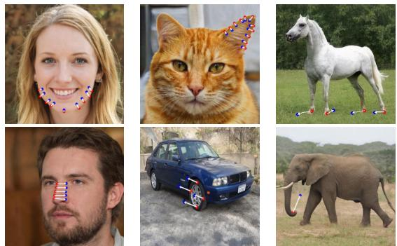  
Figure 6. Several examples in the proposed FreeDragBench.

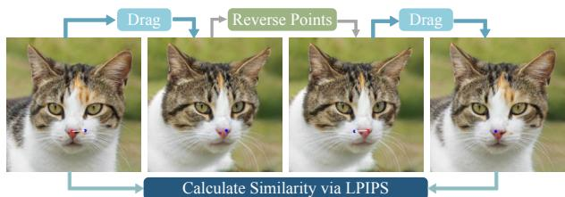  
Figure 7. Visualization of the proposed CCSD metric.

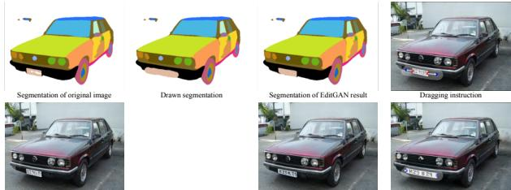  
Original imag Result of FreeDrag Figure 8. Comparison with EditGAN[26] in editing accuracy.

Additionally, we further conduct a comparison with EditGAN[26], which performs fine-grained editing by drawing object-level masks. As shown in Fig. 8, FreeDrag better follows editing instructions.

## 5.4. Quantitative Evaluation

For quantitative evaluation, we implement comparison with DragGAN and DragDiffusion in FreeDragBench and DragBench[43], respectively. Specifically, for the comparison in FreeDragBench, we use FID and the proposed CCSD to evaluate the image quality and editing accuracy, respectively. For DragBench that owns images with varying resolution, we follow the setting in DragDiffusion[43], i.e., Mean Distance (MD) for dragging accuracy measurement and LPIPS [52] for image fidelity evaluation. The mean

Image & Edit

FreeDrag

FreeDrag

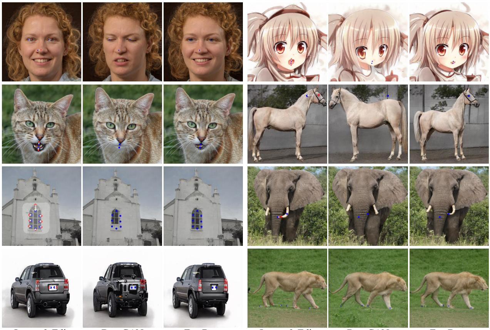  
DragGAN  
Image & Edit  
DragGAN

Figure 9. Demonstration of the edited results of FreeDrag and DragGAN[32] in eight different StyleGAN2 models.
<table><tr><td rowspan="2">Category Metric</td><td colspan="2">Face</td><td colspan="2">Cat</td><td colspan="2">Car</td><td colspan="2">Horse</td><td colspan="2">Elephant</td><td>Time</td></tr><tr><td>FID</td><td>CCSD</td><td>FID</td><td>CCSD</td><td>FID</td><td>CCSD</td><td>FID</td><td>CCSD</td><td>FID</td><td>CCSD</td><td>Second</td></tr><tr><td>DragGAN[33]</td><td>38.07</td><td>0.83</td><td>19.14</td><td>0.56</td><td>36.36</td><td>0.73</td><td>21.90</td><td>1.20</td><td>11.17</td><td>1.19</td><td>8.26</td></tr><tr><td>FreeDrag</td><td>29.50</td><td>0.35</td><td>15.67</td><td>0.23</td><td>33.50</td><td>0.37</td><td>21.18</td><td>0.68</td><td>10.86</td><td>0.82</td><td>2.74</td></tr></table>

Table 2. Quantitative evaluation on FreeDragBench. A lower FID score indicates better fidelity in single dragging editing, while lower CCSD (×10) scores imply higher accuracy in two symmetrical dragging editing. The time is calculated on Face category.

<table><tr><td>DragBench</td><td></td><td>MD ↓ LPIPS (× 10) ↓ Time (Sec) ↓</td></tr><tr><td>DragDiffusion[43]</td><td>38.76</td><td>1.38 71.77</td></tr><tr><td>FreeDrag</td><td>33.49</td><td>1.02 63.62</td></tr></table>

Table 3. Quantitative evaluation on DragBench. The time consumption is computed on DragBench which only includes the dragging process because a fine-tuned LoRA can be used for multiple image editing with different dragging instructions.

distance is obtained by calculating the corresponding relationship of points between the original image and the edited image based on DIFT[45].

As presented in Table 2, FreeDrag consistently attains higher scores in all categories, which further validates its superiority in achieving precise dragging editing and better image fidelity preservation. Moreover, it can be observed that FreeDrag gains significant improvement in time consumption, which can be attributed to that the proposed line search effectively alleviates the interference of similar points and thus successfully avoids unrewarding dragging steps, allowing for higher efficiency.

<table><tr><td>Metric</td><td></td><td>w/o updating w/o backtracking Ours</td><td></td></tr><tr><td>CCSD (×10)</td><td>0.82</td><td>0.52</td><td>0.35</td></tr></table>

Table 4. Quantitative ablation on human face model.

For the quantitative evaluation in diffusion models, we utilize the public DragBench dataset [43] that is customized for diffusion-based dragging evaluation. The results of DragDiffusion and FreeDrag are presented in Table. 3. It is observed that FreeDrag outperforms DragDiffusion with higher dragging accuracy and lower time-consumption, implying a promising potential for versatile applications.

## 5.5. Ablation Study

The parameters l and d determine the initial feature discrepancy and maximum single movement distance, thus controlling the style of total dragging editing. Specifically, a too small l or d implies a more conservative editing strategy, which prefers small motion and refuses large updating scale, thus failing to reach the target point in limited optimization steps, as shown in Fig. 11(b). In contrast, a too large l or d means a more impulsive editing strategy, which appears to accept large updating scale and larger movement distance and thus increases the risk of coarse feature updating, resulting in damage to editing accuracy, as can be observed in Fig. 11(d).

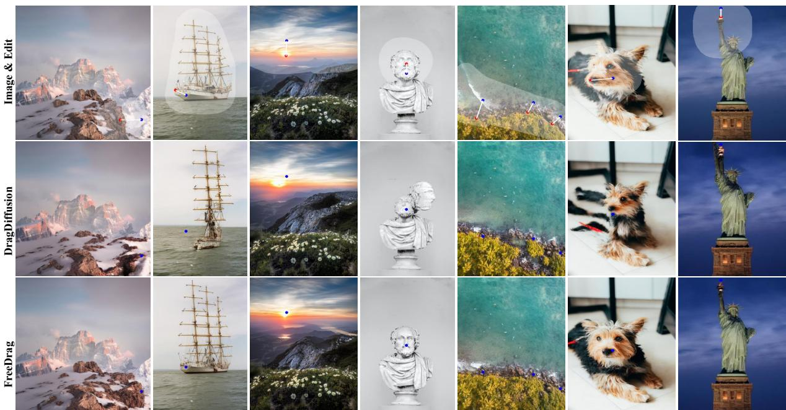  
Figure 10. Demonstration of real image editing results of FreeDrag and DragDiffusion[32].

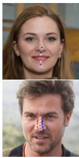  
(a)

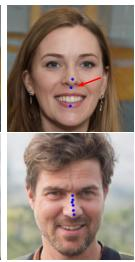  
(b)

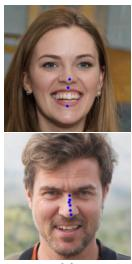  
(c)

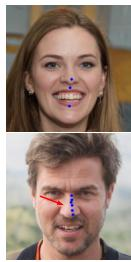  
(d)

Figure 11. The edited results by using different parameters. (a) Original images with dragging instructions. (b) Edited results with {l = 0.15, d = 1.5}. (c) Edited results with {l = 0.3, d = 3}. (d) Edited results with {l = 0.45, d = 4.5}.  
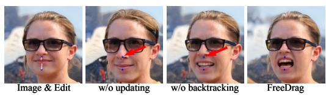  
Figure 12. Illustration of the effect of adaptive updating strategy in template feature and backtracking mechanism in line search.

Furthermore, we assign λ = 0 in Eq. 3 to obtain a stationary template feature to evaluate the effect of adaptive updating strategy and adopt Eq. 7 rather than Eq. 9 to evaluate the effect of backtracking mechanism. As can be observed in Fig. 12, both of them play necessary roles for better editing quality. The quantitative ablation in Table 4 also validates their necessity.

## 6. Conclusion

In this work, we propose FreeDrag, a novel feature dragging framework for reliable point-based image editing. By incorporating an adaptive template feature, FreeDrag allows for flexible control in the scale of each feature updating, which contributes to stronger stability under drastic content change, resulting in a better immunity against point missing. Meanwhile, the established line search with backtracking effectively mitigates the misguidance caused by similar points and allows timely adjustment for motion plan by effectively discriminating abnormal motion, leading to reliable and continuous movements towards the final target point. Extensive experiments demonstrate the reliability of FreeDrag in precise semantic dragging and stable structure preservation, indicating superior editing quality.

Acknowledgement. This work is supported in part by the Postdoctoral Fellowship Program of CPSF GZB20230713, in part by the Anhui Provincial Key Research and Development Plan 202304a05020072, in part by the Fundamental Research Funds for the Central Universities WK2090000065, and in part by the Anhui Provincial Natural Science Foundation 2308085QF226. This work is partially supported by the National Key R&D Program of China (2022ZD0160201), and Shanghai Artificial Intelligence Laboratory.

## References

[1] Rameen Abdal, Yipeng Qin, and Peter Wonka. Image2stylegan: How to embed images into the stylegan latent space? In Proceedings of the IEEE/CVF international conference on computer vision, pages 4432–4441, 2019. 5

[2] Rameen Abdal, Peihao Zhu, Niloy J Mitra, and Peter Wonka. Styleflow: Attribute-conditioned exploration of stylegangenerated images using conditional continuous normalizing flows. ACM Transactions on Graphics (ToG), 40(3):1–21, 2021. 1

[3] Omri Avrahami, Ohad Fried, and Dani Lischinski. Blended latent diffusion. ACM Transactions on Graphics (TOG), 42 (4):1–11, 2023. 2

[4] Tim Brooks, Aleksander Holynski, and Alexei A Efros. Instructpix2pix: Learning to follow image editing instructions. In Proceedings of the IEEE/CVF Conference on Computer Vision and Pattern Recognition, pages 18392–18402, 2023. 3

[5] Xi Chen, Lianghua Huang, Yu Liu, Yujun Shen, Deli Zhao, and Hengshuang Zhao. Anydoor: Zero-shot object-level image customization. arXiv preprint arXiv:2307.09481, 2023. 3

[6] Antonia Creswell, Tom White, Vincent Dumoulin, Kai Arulkumaran, Biswa Sengupta, and Anil A Bharath. Generative adversarial networks: An overview. IEEE signal processing magazine, 35(1):53–65, 2018. 2

[7] Yu Deng, Jiaolong Yang, Dong Chen, Fang Wen, and Xin Tong. Disentangled and controllable face image generation via 3d imitative-contrastive learning. In Proceedings of the IEEE/CVF conference on computer vision and pattern recognition, pages 5154–5163, 2020. 2

[8] Yu Deng, Jiaolong Yang, Dong Chen, Fang Wen, and Xin Tong. Disentangled and controllable face image generation via 3d imitative-contrastive learning. In Proceedings ofthe IEEE/CVF conference on computer vision and pattern recognition, pages 5154–5163, 2020. 1

[9] Yu Dong, Yihao Liu, He Zhang, Shifeng Chen, and Yu Qiao. Fd-gan: Generative adversarial networks with fusiondiscriminator for single image dehazing. In Proceedings of the AAAI Conference on Artificial Intelligence, pages 10729– 10736, 2020. 2

[10] Yuki Endo. User-controllable latent transformer for stylegan image layout editing. In Computer Graphics Forum, pages 395–406. Wiley Online Library, 2022. 1, 3

[11] Partha Ghosh, Pravir Singh Gupta, Roy Uziel, Anurag Ranjan, Michael J Black, and Timo Bolkart. Gif: Generative interpretable faces. In 2020 International Conference on 3D Vision (3DV), pages 868–878. IEEE, 2020. 2

[12] Partha Ghosh, Pravir Singh Gupta, Roy Uziel, Anurag Ranjan, Michael J Black, and Timo Bolkart. Gif: Generative interpretable faces. In 2020 International Conference on 3D Vision (3DV), pages 868–878. IEEE, 2020. 1

[13] Ian Goodfellow, Jean Pouget-Abadie, Mehdi Mirza, Bing Xu, David Warde-Farley, Sherjil Ozair, Aaron Courville, and Yoshua Bengio. Generative adversarial nets. Advances in neural information processing systems, 27, 2014. 2

[14] Amir Hertz, Ron Mokady, Jay Tenenbaum, Kfir Aberman, Yael Pritch, and Daniel Cohen-Or. Prompt-to-prompt image editing with cross attention control. arXiv preprint arXiv:2208.01626, 2022. 1

[15] Jonathan Ho, Ajay Jain, and Pieter Abbeel. Denoising diffusion probabilistic models. Advances in neural information processing systems, 33:6840–6851, 2020. 2

[16] Edward J Hu, Yelong Shen, Phillip Wallis, Zeyuan Allen-Zhu, Yuanzhi Li, Shean Wang, Lu Wang, and Weizhu Chen. Lora: Low-rank adaptation of large language models. arXiv preprint arXiv:2106.09685, 2021. 6

[17] Phillip Isola, Jun-Yan Zhu, Tinghui Zhou, and Alexei A Efros. Image-to-image translation with conditional adversarial networks. In Proceedings of the IEEE conference on computer vision and pattern recognition, pages 1125–1134, 2017. 1

[18] Yeying Jin, Wenhan Yang, and Robby T Tan. Unsupervised night image enhancement: When layer decomposition meets light-effects suppression. In European Conference on Computer Vision, pages 404–421. Springer, 2022. 2

[19] Chanyong Jung, Gihyun Kwon, and Jong Chul Ye. Exploring patch-wise semantic relation for contrastive learning in image-to-image translation tasks. In Proceedings of the IEEE/CVF conference on computer vision and pattern recognition, pages 18260–18269, 2022. 2

[20] Animesh Karnewar, Andrea Vedaldi, David Novotny, and Niloy J Mitra. Holodiffusion: Training a 3d diffusion model using 2d images. In Proceedings of the IEEE/CVF Conference on Computer Vision and Pattern Recognition, pages 18423–18433, 2023. 2

[21] Tero Karras, Samuli Laine, and Timo Aila. A style-based generator architecture for generative adversarial networks. In Proceedings ofthe IEEE/CVF conference on computer vision and pattern recognition, pages 4401–4410, 2019. 2, 3

[22] Tero Karras, Samuli Laine, Miika Aittala, Janne Hellsten, Jaakko Lehtinen, and Timo Aila. Analyzing and improving the image quality of stylegan. In Proceedings of the IEEE/CVF conference on computer vision and pattern recognition, pages 8110–8119, 2020. 5

[23] Tero Karras, Miika Aittala, Samuli Laine, Erik Hark¨ onen,¨ Janne Hellsten, Jaakko Lehtinen, and Timo Aila. Alias-free generative adversarial networks. Advances in Neural Information Processing Systems, 34:852–863, 2021. 2

[24] Bahjat Kawar, Shiran Zada, Oran Lang, Omer Tov, Huiwen Chang, Tali Dekel, Inbar Mosseri, and Michal Irani. Imagic: Text-based real image editing with diffusion models. In Proceedings of the IEEE/CVF Conference on Computer Vision and Pattern Recognition, pages 6007–6017, 2023. 1

[25] Gwanghyun Kim, Taesung Kwon, and Jong Chul Ye. Diffusionclip: Text-guided diffusion models for robust image manipulation. In Proceedings of the IEEE/CVF Conference on Computer Vision and Pattern Recognition, pages 2426– 2435, 2022. 2

[26] Huan Ling, Karsten Kreis, Daiqing Li, Seung Wook Kim, Antonio Torralba, and Sanja Fidler. Editgan: High-precision semantic image editing. Advances in Neural Information Processing Systems, 34:16331–16345, 2021. 1, 6

[27] Andreas Lugmayr, Martin Danelljan, Andres Romero, Fisher Yu, Radu Timofte, and Luc Van Gool. Repaint: Inpainting using denoising diffusion probabilistic models. In Proceedings of the IEEE/CVF Conference on Computer Vision and Pattern Recognition, pages 11461–11471, 2022. 3

[28] Yueming Lyu, Tianwei Lin, Fu Li, Dongliang He, Jing Dong, and Tieniu Tan. Deltaedit: Exploring text-free training for text-driven image manipulation. In Proceedings of the IEEE/CVF Conference on Computer Vision and Pattern Recognition, pages 6894–6903, 2023. 3

[29] Chenlin Meng, Yutong He, Yang Song, Jiaming Song, Jiajun Wu, Jun-Yan Zhu, and Stefano Ermon. Sdedit: Guided image synthesis and editing with stochastic differential equations. arXiv preprint arXiv:2108.01073, 2021. 3

[30] Ron Mokady, Omer Tov, Michal Yarom, Oran Lang, Inbar Mosseri, Tali Dekel, Daniel Cohen-Or, and Michal Irani. Self-distilled stylegan: Towards generation from internet photos. In ACM SIGGRAPH 2022 Conference Proceedings, pages 1–9, 2022. 2

[31] Ron Mokady, Amir Hertz, Kfir Aberman, Yael Pritch, and Daniel Cohen-Or. Null-text inversion for editing real images using guided diffusion models. In Proceedings of the IEEE/CVF Conference on Computer Vision and Pattern Recognition, pages 6038–6047, 2023. 1

[32] Chong Mou, Xintao Wang, Jiechong Song, Ying Shan, and Jian Zhang. Dragondiffusion: Enabling drag-style manipulation on diffusion models. arXiv preprint arXiv:2307.02421, 2023. 3, 7, 8

[33] Xingang Pan, Ayush Tewari, Thomas Leimkuhler, Lingjie¨ Liu, Abhimitra Meka, and Christian Theobalt. Drag your GAN: Interactive point-based manipulation on the generative image manifold. arXiv preprint arXiv:2305.10973, 2023. 1, 2, 3, 7

[34] Taesung Park, Ming-Yu Liu, Ting-Chun Wang, and Jun-Yan Zhu. Semantic image synthesis with spatially-adaptive normalization. In Proceedings of the IEEE/CVF conference on computer vision and pattern recognition, pages 2337–2346, 2019. 1

[35] Taesung Park, Alexei A Efros, Richard Zhang, and Jun-Yan Zhu. Contrastive learning for unpaired image-to-image translation. In Computer Vision–ECCV 2020: 16th European Conference, Glasgow, UK, August 23–28, 2020, Proceedings, Part IX 16, pages 319–345. Springer, 2020. 2

[36] Gaurav Parmar, Krishna Kumar Singh, Richard Zhang, Yijun Li, Jingwan Lu, and Jun-Yan Zhu. Zero-shot image-to-image translation. arXiv preprint arXiv:2302.03027, 2023. 1

[37] Aditya Ramesh, Prafulla Dhariwal, Alex Nichol, Casey Chu, and Mark Chen. Hierarchical text-conditional image generation with clip latents. arXiv preprint arXiv:2204.06125, 2022. 1

[38] Daniel Roich, Ron Mokady, Amit H Bermano, and Daniel Cohen-Or. Pivotal tuning for latent-based editing of real images. ACM Transactions on graphics (TOG), 42(1):1–13, 2022. 1

[39] Robin Rombach, Andreas Blattmann, Dominik Lorenz, Patrick Esser, and Bjorn Ommer. High-resolution image¨ synthesis with latent diffusion models. In Proceedings of

the IEEE/CVF conference on computer vision and pattern recognition, pages 10684–10695, 2022. 1

[40] Robin Rombach, Andreas Blattmann, Dominik Lorenz, Patrick Esser, and Bjorn Ommer. High-resolution image¨ synthesis with latent diffusion models. In Proceedings of the IEEE/CVF conference on computer vision and pattern recognition, pages 10684–10695, 2022. 3, 5

[41] Chitwan Saharia, William Chan, Saurabh Saxena, Lala Li, Jay Whang, Emily L Denton, Kamyar Ghasemipour, Raphael Gontijo Lopes, Burcu Karagol Ayan, Tim Salimans, et al. Photorealistic text-to-image diffusion models with deep language understanding. Advances in Neural Information Processing Systems, 35:36479–36494, 2022. 1

[42] Yujun Shen, Jinjin Gu, Xiaoou Tang, and Bolei Zhou. Interpreting the latent space of gans for semantic face editing. In Proceedings of the IEEE/CVF conference on computer vision and pattern recognition, pages 9243–9252, 2020. 1

[43] Yujun Shi, Chuhui Xue, Jiachun Pan, Wenqing Zhang, Vincent YF Tan, and Song Bai. Dragdiffusion: Harnessing diffusion models for interactive point-based image editing. arXiv preprint arXiv:2306.14435, 2023. 1, 2, 3, 6, 7

[44] Jiaming Song, Chenlin Meng, and Stefano Ermon. Denoising diffusion implicit models. arXiv preprint arXiv:2010.02502, 2020. 2

[45] Luming Tang, Menglin Jia, Qianqian Wang, Cheng Perng Phoo, and Bharath Hariharan. Emergent correspondence from image diffusion. arXiv preprint arXiv:2306.03881, 2023. 7

[46] Ayush Tewari, Mohamed Elgharib, Gaurav Bharaj, Florian Bernard, Hans-Peter Seidel, Patrick Perez, Michael Zoll-´ hofer, and Christian Theobalt. Stylerig: Rigging stylegan for 3d control over portrait images. In Proceedings of the IEEE/CVF Conference on Computer Vision and Pattern Recognition, pages 6142–6151, 2020. 1

[47] Xingqian Xu, Zhangyang Wang, Gong Zhang, Kai Wang, and Humphrey Shi. Versatile diffusion: Text, images and variations all in one diffusion model. In Proceedings of the IEEE/CVF International Conference on Computer Vision, pages 7754–7765, 2023. 2

[48] Yanwu Xu, Shaoan Xie, Wenhao Wu, Kun Zhang, Mingming Gong, and Kayhan Batmanghelich. Maximum spatial perturbation consistency for unpaired image-to-image translation. In Proceedings of the IEEE/CVF Conference on Computer Vision and Pattern Recognition, pages 18311–18320, 2022. 2

[49] Binxin Yang, Shuyang Gu, Bo Zhang, Ting Zhang, Xuejin Chen, Xiaoyan Sun, Dong Chen, and Fang Wen. Paint by example: Exemplar-based image editing with diffusion models. In Proceedings of the IEEE/CVF Conference on Computer Vision and Pattern Recognition, pages 18381–18391, 2023. 3

[50] Yuntong Ye, Changfeng Yu, Yi Chang, Lin Zhu, Xi-le Zhao, Luxin Yan, and Yonghong Tian. Unsupervised deraining: Where contrastive learning meets self-similarity. In Proceedings of the IEEE/CVF Conference on Computer Vision and Pattern Recognition, pages 5821–5830, 2022. 2

[51] Lvmin Zhang, Anyi Rao, and Maneesh Agrawala. Adding conditional control to text-to-image diffusion models. In

Proceedings of the IEEE/CVF International Conference on Computer Vision, pages 3836–3847, 2023. 2

[52] Richard Zhang, Phillip Isola, Alexei A Efros, Eli Shechtman, and Oliver Wang. The unreasonable effectiveness of deep features as a perceptual metric. In Proceedings of the IEEE conference on computer vision and pattern recognition, pages 586–595, 2018. 6

[53] Zhixing Zhang, Ligong Han, Arnab Ghosh, Dimitris N Metaxas, and Jian Ren. Sine: Single image editing with textto-image diffusion models. In Proceedings ofthe IEEE/CVF Conference on Computer Vision and Pattern Recognition, pages 6027–6037, 2023. 3