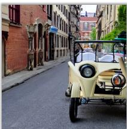  
FreeU  
SDXL

# FreeU: Free Lunch in Diffusion U-Net

# Chenyang Si Ziqi Huang Yuming Jiang Ziwei LiuB S-Lab, Nanyang Technological University

{chenyang.si, ziqi002, yuming002, ziwei.liu}@ntu.edu.sg https://github.com/ChenyangSi/FreeU

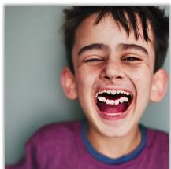

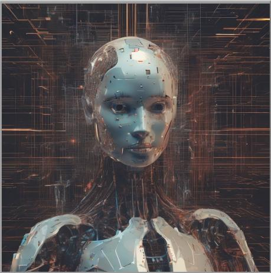

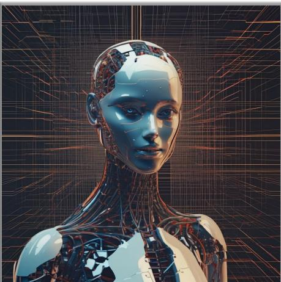  
Figure 1. FreeU substantially improves diffusion model sample quality at no costs: no training, no additional learnable parameter introduced, and no increase in memory or sampling time.

## Abstract

In this paper, we uncover the untapped potential of diffusion U-Net, which serves as a “free lunch” that substantially improves the generation quality on thefly. We initially investigate the key contributions of the U-Net architecture to the denoising process and identify that its main backbone primarily contributes to denoising, whereas its skip connections mainly introduce high-frequency features into the decoder module, causing the potential neglect ofcrucialfunctions intrinsic to the backbone network. Capitalizing on this discovery, we propose a simple yet effective method, termed “FreeU”, which enhances generation quality without additional training or finetuning. Our key insight is to strategically re-weight the contributions sourced from the U-Net’s skip connections and backbone feature maps, to leverage the strengths of both components of the U-Net architecture. Promising results on image and video generation tasks demonstrate that our FreeU can be readily integrated to existing diffusion models, e.g., Stable Diffusion, DreamBooth and ControlNet, to improve the generation quality with only a few lines of code. All you need is to adjust two scaling factors during inference.

## 1. Introduction

Diffusion probabilistic models, a cutting-edge category of generative models, have garnered significant attention, particularly for tasks related to computer vision [7, 8, 11, 18, 33, 41, 45, 46, 49]. These diffusion models are composed of two key processes: diffusion process and the denoising process. In the diffusion process, Gaussian noise is gradually added to the input data and eventually corrupts it into approximately pure Gaussian noise. During the denoising process, the original input data is recovered from its noise state through a learned sequence of inverse diffusion operations. Usually, a U-Net is employed to iteratively predict the noise to be removed at each denoising step. Existing works [3, 47, 58, 65] primarily focus on utilizing pre-trained diffusion U-Nets for downstream applications, while the internal properties of the diffusion U-Net, remain largely under-explored.

In this paper, we delve into the denoising process of the diffusion U-Net. For a comprehensive analysis, our first objective is to explore the mechanics behind how images are generated from noise during the denoising process. To understand what’s going on, we conduct an investigation within the Fourier domain, focusing on the generative evolution during the denoising process. Our meticulous analysis reveals a subtle modulation of the low-frequency components, which demonstrate a gentle rate of change. In contrast, the high-frequency components showcase more pronounced dynamics throughout the denoising process. Fundamentally, low-frequency components bestow upon an image its foundational structure and color attributes. Excessive adjustments during iterative denoising risk undermining the image’s intrinsic semantic integrity. High-frequency components, which represent details like edges and textures, are more affected by noise. Hence, the goal of the denoising process is to reduce this noise while ensuring the preservation of critical details.

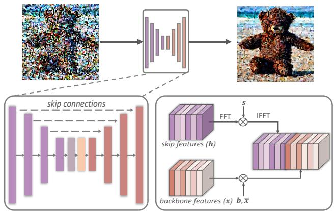  
(a) UNet Architecture  
(b) FreeU Operations  
Figure 2. FreeU Framework. (a) U-Net Skip Features and Backbone Features. In U-Net, the skip features and backbone features are concatenated together at each decoding stage. We apply the FreeU operations during concatenation. (b) FreeU Operations. Two modulation factors (b and s) are employed to balance the feature contributions from the backbone and skip connections.

Building on this foundational understanding, our analysis scope is expanded to how diffusion U-Net implements denoising process, thereby ascertaining the specific contributions of the U-Net architecture within the diffusion framework. Structurally, the U-Net architecture comprises a primary backbone network, encompassing both an encoder and a decoder, as well as the skip connections that bridge information transfer between the encoder and decoder, as shown in Fig. 2. Our investigation reveals that the main backbone of the U-Net primarily contributes to denoising. Conversely, the skip connections are observed to introduce high-frequency features into the decoder module. These connections propagate high-frequency information to make U-Net easier to recover the input data during training. Yet, an unintended consequence of this propagation is the potential weakening of the backbone’s inherent denoising capabilities during the inference. This can lead to a reduction in the generation quality e.g. abnormal image details, as illustrated in Fig. 1.

With these revelations as our backdrop, we propel forward with the introduction of a novel strategy, denoted as “FreeU”, which holds the potential to improve sample quality without necessitating the computational overhead of additional training or fine-tuning. Specifically, during inference, we instantiate two specialized modulation factors designed to balance the feature contributions from the U-Net architecture’s primary backbone and skip connections. The first, termed the backbone feature factors, aims to amplify the feature maps of the main backbone, thereby bolstering the denoising process. However, we find that while the inclusion of backbone feature scaling factors yields significant improvements, it can occasionally lead to an undesirable oversmoothing of textures. To mitigate this issue, we introduce the second factor, skip feature scaling factors, aiming to alleviate the problem of texture oversmoothing.

Our FreeU method exhibits seamless adaptability when integrated with existing diffusion models. We conduct a comprehensive experimental evaluation of our approach, employing Stable Diffusion [43, 46], ModelScope [37], Dreambooth [47], ReVersion [23], Rerender [61], Scale-Crafter [16], Animatediff [14] and ControlNet [65] as our foundational models for benchmark comparisons. By employing FreeU during the inference phase, these models indicate a discernible enhancement in the quality of generated samples, as shown in Fig. 1. Our contributions are summarized as follows:

• We investigate the denoising process in Fourier domain, revealing that low-frequency components change gradually, while high-frequency components exhibit more significant variations.

• We conduct a pioneering exploration of the potential of diffusion U-Net, highlighting that its backbone primarily contributes to denoising, whereas its skip connections introduce high-frequency features into the decoder. This novel perspective offers fresh research opportunities for the community.

• We introduce a simple yet effective method, denoted as “FreeU”, which enhances U-Net’s denoising capability by leveraging the strengths of both components of the U-Net architecture.

• We empirically evaluate our approach on various diffusion models, demonstrating significant sample quality improvement and the effectiveness of FreeU at no extra cost.

## 2. Methodology

## 2.1. Preliminaries

Generating samples from a diffusion model is initiated by sourcing from a Gaussian noise distribution and subsequently following the inverse diffusion process $p _ { \theta } ( \pmb { x } _ { t - 1 } | \pmb { x } _ { t } )$ This results in a trajectory sequence xT, ${ \pmb x } _ { T - 1 } , . . . , { \pmb x } _ { 0 }$ ending with the generated sample x . Crucially, the sampling process depends on the denoising model ϵθ to eliminate noise. The optimization objective of denoising model is as follows:

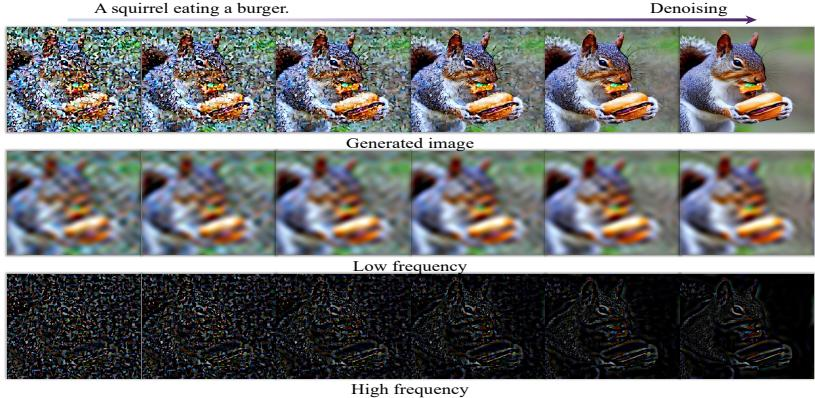  
Figure 3. Denoising process visualization: The top row shows the generated images of the denoising process. The next two rows display low-frequency and highfrequency components after the inverse Fourier Transform. Low-frequency components change slowly, whereas high-frequency components exhibit more significant variations during the denoising process.

$$
\mathcal { L } _ { D M } = \mathbb { E } _ { \pmb { x } , \epsilon \sim \mathcal { N } ( 0 , 1 ) , t } \Big [ \big \| \epsilon - \epsilon _ { \theta } ( \pmb { x } _ { t } , t ) \big \| _ { 2 } ^ { 2 } \Big ]\tag{1}
$$

In most implementations, the denoising model is realized using a time-conditional U-Net architecture. Hence, its denoising ability plays a pivotal role in determining the quality of the data generated.

## 2.2. How to Generate Images from Noise During Denoising Process?

To better understand the denoising process, we conduct an investigation within the Fourier domain to perspective the generated process of diffusion models. As illustrated in Fig. 3, the uppermost row provides the progressive denoising process, showcasing the generated images across successive iterations. The subsequent two rows exhibit the associated low-frequency and high-frequency spatial domain information after the inverse Fourier Transform, aligning with each respective step.

Evident from Fig. 3 is the gradual modulation of lowfrequency components, showing a soft rate of change, while their high-frequency components show more obvious changes throughout the entire denoising process. These findings are further corroborated in Fig.4. This can be intuitively explained: 1) Low-frequency components inherently embody the global structure and characteristics of an image, encompassing global layouts and smooth color. These components encapsulate the foundational global elements that constitute the image’s essence and representation. Its rapid alterations are generally unreasonable in denoising processes. Drastic changes to these components could fundamentally reshape the image’s essence, an outcome typically incompatible with the objectives of denoising processes. 2) Conversely, high-frequency components contain rapid changes in the images, such as edges and textures. These finer details are markedly sensitive to noise, often manifesting as random high-frequency information when noise is introduced to an image. Consequently, denoising processes need to expunge noise while upholding indispensable intricate details.

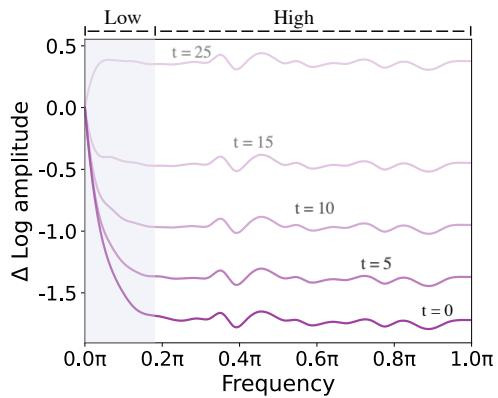  
Figure 4. Relative log amplitudes of Fourier for denoising process. At each denoising step t, we visualize the relative log amplitudes of Fourier of recovered date xt. We observe that the highfrequency components of xt drops drastically during the denoising process.

## 2.3. How does Diffusion U-Net Perform Denoising?

Building on this foundational understanding throughout the denoising process, we extend our investigation to delineate the specific contributions of the U-Net architecture within the denoising process, to explore the internal properties of the denoising network. As illustrated in Fig. 2, the U-Net architecture comprises a primary backbone network, as well as the skip connections that facilitate information transfer between the encoder and decoder.

To evaluate the role of the backbone and lateral skip connections in the denoising process, we conduct a controlled experiment wherein we introduce two multiplicative scal ing factors—denoted as b and s—to modulate the feature maps generated by the backbone and skip connections, respectively, prior to their concatenation. As shown in Fig. 5, it is evident that elevating the scale factor b of the backbone distinctly enhances the quality of generated images. Conversely, variations in the scaling factor s, which modulates the impact of the lateral skip connections, appear to exert a limited influence on the quality of the generated images.

The backbone of U-Net. Building upon these observations, we subsequently probed the underlying mechanisms for the enhancement in image generation quality when the scaling factor b associated with the backbone feature map increases.

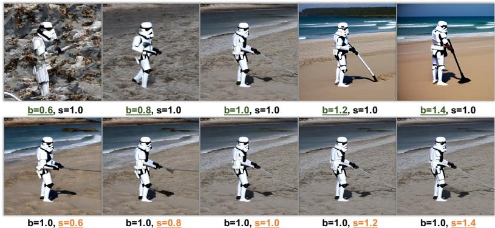  
Figure 5. Effect of backbone and skip connection scaling factors (b and s). Increasing the backbone scaling factor b significantly enhances image quality, while directly scaling s in the skip features has a limited influence on image synthesis quality.

Our analysis reveals that this quality improvement is fundamentally linked to an amplified denoising capability imparted by the U-Net architecture’s backbone. As delineated in Fig. 6, a commensurate increase in b correspondingly results in a suppression of high-frequency components in the images generated by the diffusion model. Therefore, in Fig. 5, when $b = 0 . 6 $ , the generated images exhibit a significant amount of noise that adversely affects image quality. In contrast, when b = 1.4, highly clear images are generated. This indicates that the primary role of the U-Net backbone network is to filter out high-frequency noise. Enhancing the backbone features effectively boosts the denoising capability of the U-Net architecture, thereby contributing to superior output in terms of fidelity and detail preservation.

The skip connections of U-Net. Conversely, the skip connections serve to forward features from the earlier layers of encoder blocks directly to the decoder. Intriguingly, as evidenced in Fig. 7, these features primarily constitute highfrequency information. Our conjecture, grounded in this observation, posits that during the training of the U-Net architecture, the presence of these high-frequency features may inadvertently accelerate the convergence toward noise prediction with the optimization objective of Eqn. 1, making it easier to reconstruct the input data. This phenomenon, in turn, could result in an unintended attenuation of the efficacy of the backbone’s intrinsic denoising capabilities. However, unlike the training process where the goal is to reconstruct input data, the inference process aims to generate data from Gaussian noise. The generative capacity of diffusion models manifests in their denoising capabilities. Therefore, during inference, it is essential to enhance the denoising capabilities of the U-Net to ensure high-quality data generation.

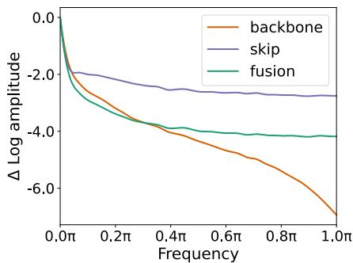  
Figure 7. Fourier relative log amplitudes of backbone, skip, and their fused feature maps. The skip features contain a large amount of high-frequency information.

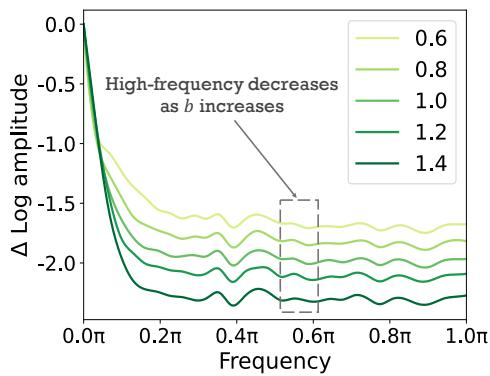  
Figure 6. Relative log amplitudes of Fourier with variations of the backbone scaling factor b. Increasing in b correspondingly results in a suppression of high-frequency components in the images generated by the diffusion model.

## 2.4. Free Lunch in Diffusion U-Net

Capitalizing on the above discovery, we propel forward with the introduction of a simple yet effective method, denoted as “FreeU”, which effectively bolsters the denoising capability of the U-Net architecture by leveraging the strengths of both components of the U-Net architecture. It substantially improves the generation quality without requiring additional training or fine-tuning.

The backbone factors. To enhance the denoising capabilities of the U-Net, we introduce a novel method known as structure-aware scaling for the backbone features, which dynamically adjusts the scaling of backbone features for each sample. Unlike a fixed scaling factor applied uniformly to all samples or positions within the same channel, our approach adjusts the scaling factor adaptively based on the specific characteristics of the sample features. We first compute the average feature map along the channel dimension:

$$
\bar { \mathbf { x } } _ { l } = \frac { 1 } { C } \sum _ { i = 1 } ^ { C } \mathbf { x } _ { l , i }\tag{2}
$$

where ${ \mathbf { x } } _ { l , i }$ represents the i-th channel of the backbone feature map $\mathbf { \Delta } _ { \mathbf { \mathcal { X } } l }$ in the l-th block of the U-Net decoder. C denotes the total number of channels in $\mathbf { \Delta } _ { \mathbf { \mathcal { X } } \mathbf { \mathcal { l } } }$ . As illustrated in

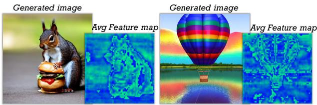  
Figure 8. Visualization of average feature maps: This visualization displays the average feature maps along the channel dimension of backbone features.

Fig. 8, the average feature map $\bar { \mathbf { x } } _ { l }$ inherently contains valuable structural information. Consequently, the backbone factor map $\alpha _ { l }$ amplifies the backbone feature map $\mathbf { \Delta } _ { \mathbf { \mathcal { X } } \mathbf { \mathcal { l } } }$ in a manner that aligns with its structural characteristics. Subsequently, the backbone factor map is determined as follows:

$$
\pmb { \alpha } _ { l } = ( b _ { l } - 1 ) \cdot \frac { \pmb { \bar { x } } _ { l } - M i n ( \pmb { \bar { x } } _ { l } ) } { M a x ( \pmb { \bar { x } } _ { l } ) - M i n ( \pmb { \bar { x } } _ { l } ) } + 1 ,\tag{3}
$$

where $\alpha _ { l }$ represents the backbone factor map. $b _ { l }$ is a scalar constant and $b _ { l } ~ > ~ 1$ . Then, upon experimental investigation, we discern that indiscriminately amplifying all channels of $\mathbf { \Delta } _ { \mathbf { \mathcal { X } } l }$ through multiplication with $\alpha _ { l }$ engenders an oversmoothed texture in the resulting synthesized images, as shown in Fig. 9 (b). The reason is that U-Net’s strong denoising ability can damage the high-frequency details of the image during denoising. Consequently, we confine the scaling operation to the half channels of $\mathbf { \Delta } _ { \mathbf { \mathcal { X } } \mathbf { \mathcal { l } } }$ as follows:

$$
\pmb { x } _ { l , i } ^ { ' } = \left\{ \begin{array} { l l } { \pmb { x } _ { l , i } \odot \pmb { \alpha } _ { l } } & { \mathrm { i f ~ } i < C / 2 } \\ { \pmb { x } _ { l , i } } & { \mathrm { o t h e r w i s e } } \end{array} \right.\tag{4}
$$

Hence, the backbone factors can effectively enhance the denoising capabilities of the U-Net and generate better image quality, as shown in Fig. 9 (c).

The skip factors. To further mitigate the issue of oversmoothed texture due to enhancing denoising, we further employ spectral modulation in the Fourier domain to selectively diminish low-frequency components for the skip features. Mathematically, this operation is performed as follows:

$$
\mathcal { F } ( h _ { l , i } ) = \mathrm { F F T } ( h _ { l , i } )\tag{5}
$$

$$
\mathcal { F } ^ { \prime } ( h _ { l , i } ) = \mathcal { F } ( h _ { l , i } ) \odot \beta _ { l , i }\tag{6}
$$

$$
h _ { l , i } ^ { \prime } = \mathrm { I F F T } ( \mathcal { F } ^ { \prime } ( h _ { l , i } ) )\tag{7}
$$

where $h _ { l , i }$ denotes the i-th channel of the skip feature map in the l-th block of the U-Net decoder. FFT(·) and IFFT(·) are Fourier transform and inverse Fourier transform. ⊙ denotes element-wise multiplication, and $\beta _ { l , i }$ is a Fourier mask, designed as a function of the magnitude of the Fourier coefficients, serving to implement the frequency-dependent scaling factor $_ { s l } \colon$

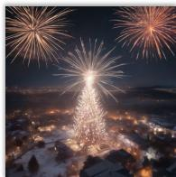  
(a)

  
(b)

  
(c)  
Figure 9. Generated images with different backbone scaling operations: (a) without backbone scaling, (b) scaling all channels, (c) scaling half channels.

$$
\beta _ { l , i } ( r ) = \left\{ { \begin{array} { l l } { s _ { l } } & { { \mathrm { i f ~ } } r < r _ { \mathrm { t h r e s h } } , } \\ { 1 } & { { \mathrm { o t h e r w i s e } } . } \end{array} } \right.\tag{8}
$$

where r is the radius. $r _ { \mathrm { t h r e s h } }$ is the threshold frequency, set to 1 in our experiments. As shown in Fig. 10, reducing low-frequency components of the skip features can generate better details.

Remarkably, the proposed FreeU framework does not require any task-specific training or fine-tuning. Adding the backbone and skip scaling factors can be easily done with just a few lines of code, offering a more flexible and potent denoising operation without adding any computational burden. This makes FreeU a highly practical solution that can be seamlessly integrated into existing diffusion models to improve their generation quality.

## 3. Experiments

## 3.1. Implementation Details

To assess the effectiveness of the proposed FreeU, we systematically conduct a series of experiments, aligning our benchmarks with state-of-the-art methods such as Stable Diffusion [43, 46], ModelScope [37], Dreambooth [47], Re-Version [23], Rerender [61], ScaleCrafter [16], Animatediff [14] and ControlNet [65]. Importantly, our approach seamlessly integrates with these methods without imposing any additional computational overhead associated with training or fine-tuning. We strictly follow the prescribed settings of these methods and exclusively introduce the backbone feature factors and skip feature factors during the inference. More ablation studies and quantitative results can be found in supplementary material.

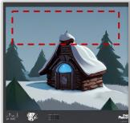  
w/o s

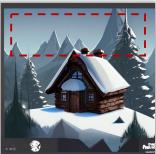  
w/ s

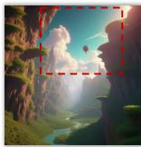  
w/o s

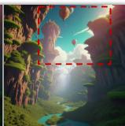  
w/ s  
Figure 10. Generated images of FreeU without skip scaling (w/o s), and with skip scaling (w/ s).

SDXL  
SDXL + FreeU  
SDXL  
SDXL + FreeU  
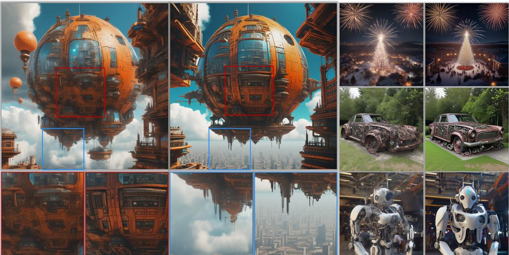  
Figure 11. Text-to-image generation results of SD-XL [43] with or without FreeU. Images generated by SD-XL+FreeU show signifi cantly improved detail and quality compared to SD-XL.

## 3.2. Text-to-Image Generation

Stable Diffusion [43, 46] is a latent text-to-image diffusion model renowned for its capability to generate photorealistic images based on textual input. It has consistently demonstrated exceptional performance in various image synthesis tasks. With the integration of our FreeU augmentation into Stable Diffusion-XL [43], the results, as exemplified in Fig. 11, exhibit a notable enhancement in the model’s generative capacity. It becomes evident that our proposed FreeU consistently excels in generating realistic images, especially in detail generation. More results of SD [46] and SD-XL [43] are provided in the supplementary material. These compelling results serve as a testament to the substantial qualitative enhancements engendered by the synergy of FreeU with the SD[46] or SDXL[43] frameworks.

Quantitative evaluation. We conduct a study with 120 participants to assess image quality and image-text alignment. Each participant receives a text prompt and two corresponding synthesized images, one from SD [46] and another from SD+FreeU. To ensure fairness, we use the same randomly sampled random seed for generating both images. The image sequence is randomized to eliminate any bias. Participants then select the image they consider superior for image-text alignment and image quality, respectively. We tabulate the votes for SD [46] and SD+FreeU in each category in Table 1. Our analysis reveals that the majority of votes go to SD+FreeU, indicating that FreeU significantly

Table 1. Text-to-Image Quantitative Results. We count the percentage of votes for the baseline and our method respectively. Image-Text refers to Image-Text Alignment.
<table><tr><td>Method</td><td>Image-Text</td><td>Image Quality</td></tr><tr><td>SD [46]</td><td>15.42%</td><td>13.73%</td></tr><tr><td>SD+FreeU</td><td>84.58%</td><td>86.27%</td></tr></table>

Table 2. Text-to-Video Quantitative Results. We count the percentage of votes for the baseline and our method respectively. Video-Text refers to Video-Text Alignment.
<table><tr><td>Method</td><td>Video-Text</td><td>Video Quality</td></tr><tr><td>ModelScope [37]</td><td>15.32%</td><td>14.25%</td></tr><tr><td>ModelScope+FreeU</td><td>84.68%</td><td>85.75%</td></tr></table>

enhances the Stable Diffusion text-to-image model in both evaluated aspects.

## 3.3. Text-to-Video Generation

ModelScope [37], an avant-garde text-to-video diffusion model, stands at the forefront of video generation from textual descriptions. The infusion of our FreeU augmentation into ModelScope [37] serves to further hone its video synthesis prowess, as substantiated by Fig. 12. For instance, in response to the prompt “An astronaut flying in space”, ModelScope [37], with the assistance of FreeU, can generate a clear and vivid portrayal of an astronaut. These results underscore the significant improvements achieved through the synergistic application of FreeU with ModelScope [37], resulting in high-quality generated content characterized by clear motion, rich detail, and semantic alignment.

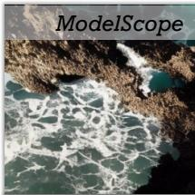

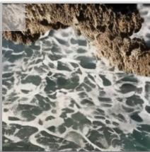

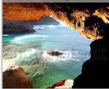

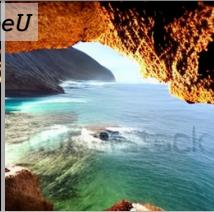

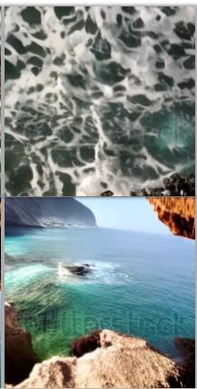  
A cinematic view of the ocean, from a cave.

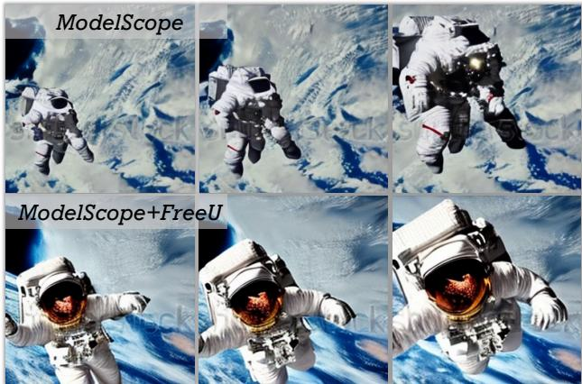  
An astronaut flying in space.

Figure 12. Text-to-video generation results of ModelScope [37] with or without FreeU. Videos generated by ModelScope+FreeU show significantly improved appearance and motion compared to ModelScope.  
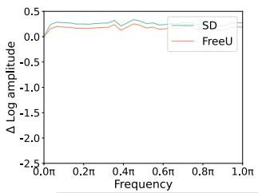

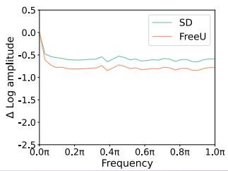  
Denoising

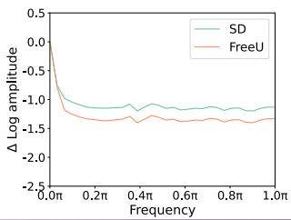

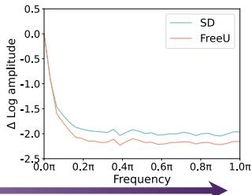  
Figure 13. Fourier relative log amplitudes of SD [46] with or without FreeU within the denoising process. FreeU can significantly reduce high-frequency information at each step of the denoising process, which indicates FreeU’s capacity to effectively denoising.

Quantitative evaluation. We conduct the quantitative evaluation for FreeU on the text-to-video task in a similar way as text-to-image. The results displayed in Table 2 indicate that most participants prefer the video generated with FreeU.

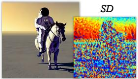

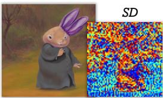

## 3.4. More Generative Models

We further incorporate FreeU into DreamBooth [47], Re-Version [23], Rerender [61], ScaleCrafter [16], AnimateDiff [14] and ControlNet [65]. Their results are provided in the supplementary material. These outcomes substantiate that the incorporation of FreeU leads to enhanced synthesis quality.

## 3.5. Ablation Study

Effects of FreeU. FreeU is introduced with the primary aim of enhancing the denoising capabilities of the diffusion U-Net. To assess the impact of FreeU, we conducted analytical experiments using SD [46] as the base framework. In Fig. 13, we present visualizations of the Fourier relative log amplitudes of SD [46], comparing cases with and without the incorporation of FreeU. These visualizations illustrate that FreeU can significantly reduce high-frequency information at each step of the denoising process, which indicates FreeU’s capacity to effectively denoising. Furthermore, we extend our analysis by visualizing the feature maps of the U-Net. As shown in Fig. 14, we observe that the feature maps generated by FreeU contain more pronounced structural information. This observation aligns with the intended effect of FreeU, as it preserves intricate details while effectively removing noise, harmonizing with the denoising objectives of the model.

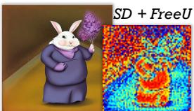

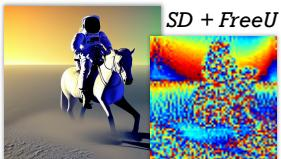  
Figure 14. Visualization of feature maps for SD [46] with or without FreeU.

Effects of components in FreeU. We evaluate the effects of the proposed FreeU strategy, i.e. introducing backbone feature scaling factors and skip feature scaling factors to intricately balance the feature contributions from the backbone and skip connections. In Fig. 15, we present the results of our evaluations. In the case of SD+FreeU(b), where backbone scaling factors are integrated during inference, we observe a noticeable improvement in the generation of

A synthwave style sunset above the reflecting water of the sea, digital art

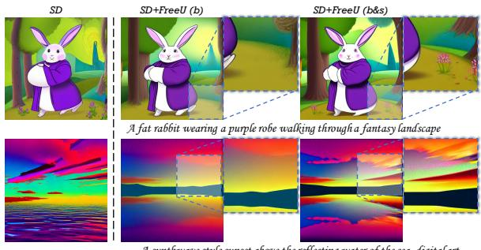  
Figure 15. Ablation study of backbone scaling factor b and skip scaling factor s.

vivid details compared to SD [46] alone. For instance, SD+FreeU(b) generates a more realistic “rabbit” with normal arms and ears, as opposed to SD [46]. However, it is imperative to note that while the inclusion of feature scaling factors yields significant improvements, it can occasionally lead to an undesirable oversmoothing of textures. To mitigate this issue, we introduce skip feature scaling factors, aiming to reduce low-frequency information and alleviate the problem of texture oversmoothing. As demonstrated in Fig. 15, the combination of both backbone and skip feature scaling factors in SD+FreeU(b & s) leads to the generation of more realistic images. This highlights the efficacy of FreeU strategy in balancing features and mitigating issues related to texture smoothing, ultimately resulting in more realistic image generation.

Effects of backbone structure-related factor. We evaluate the effects of the proposed backbone scaling strategy, structure-related scaling, on the delicate balance between noise reduction and texture preservation. Illustrated in Figure 16, when compared to the results generated by SD [46], we observe a substantial enhancement in the image quality generated by FreeU when utilizing a constant scaling factor. However, it is pertinent to highlight that the utilization of a constant factor can have undesirable consequences, manifesting as pronounced oversmoothing of textures and undesirable color oversaturation. Conversely, FreeU with the structure-related scaling factor map employs an adaptive scaling approach, leveraging structural information to guide the assignment of the backbone factor map. Our observations indicate that FreeU with the structure-related factor map effectively mitigates these issues and achieves significant improvements in generating vivid and intricate details.

## 4. Related Work

Diffusion models have achieved great success in generation tasks [7, 8, 11, 13, 18, 24, 29, 33, 41, 45, 46, 49]. These models employ a fixed Markov chain to map the latent space, facilitating intricate mappings that capture latent structural complexities within a dataset. Recently, its impressive generative capabilities have fueled groundbreaking advancements in a variety of computer vision applications such as image synthesis [18, 46, 49], image editing [1, 6, 21, 38], and text-to-video generation [3, 15, 19, 37, 52, 57, 58, 64]. Though successful, these studies mainly focus on utilizing pre-trained diffusion models for downstream applications, while the internal properties of the diffusion models remain largely under-explored. In this paper, we conduct a pioneering exploration of the potential of diffusion models. More detailed discussion about related work can be found in supplementary material.

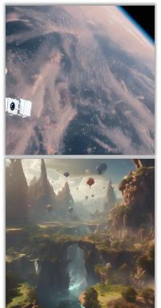  
(a)

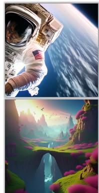  
(b)

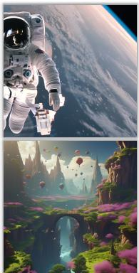  
(c)  
Figure 16. Comparing image generation with different backbone factors: (a) SD, (b) FreeU with a constant factor, and (c) FreeU with a structure-related scaling factor map.

## 5. Conclusion

In this study, we commence our investigation by analyzing the process of image generation from noise. Subsequently, we delve into a detailed analysis of how the U-Net architecture implements the denoising process. Our investigation reveals that the backbone primarily contributes to denoising, while the skip connections predominantly introduce high-frequency features into the decoder, potentially leading to a neglect of essential backbone semantics. To address this, we introduce the elegantly simple yet highly effective approach, termed FreeU, which enhances U-Net’s denoising capability by leveraging the strengths of both components of the U-Net architecture. Extensive experiments prove that FreeU can be seamlessly integrated into various diffusion foundation models and their downstream tasks, and substantially improve diffusion model sample quality without additional training or fine-tuning.

## 6. Acknowledgement

This study is supported by the Ministry of Education, Singapore, under its MOE AcRF Tier 2 (MOET2EP20221- 0012), NTU NAP, and under the RIE2020 Industry Alignment Fund – Industry Collaboration Projects (IAF-ICP) Funding Initiative, as well as cash and in-kind contribution from the industry partner(s).

## References

[1] Omri Avrahami, Dani Lischinski, and Ohad Fried. Blended diffusion for text-driven editing of natural images. In CVPR, 2022. 8, 4

[2] Ronen Basri, Meirav Galun, Amnon Geifman, David Jacobs, Yoni Kasten, and Shira Kritchman. Frequency bias in neural networks for input of non-uniform density. In International Conference on Machine Learning, pages 685–694. PMLR, 2020. 4

[3] Andreas Blattmann, Robin Rombach, Huan Ling, Tim Dockhorn, Seung Wook Kim, Sanja Fidler, and Karsten Kreis. Align your latents: High-resolution video synthesis with latent diffusion models. In CVPR, 2023. 1, 8, 4

[4] Andrew Brock, Jeff Donahue, and Karen Simonyan. Large scale GAN training for high fidelity natural image synthesis. arXiv preprint arXiv:1809.11096, 2018. 4

[5] Yuanqi Chen, Ge Li, Cece Jin, Shan Liu, and Thomas Li. Ssd-gan: Measuring the realness in the spatial and spectral domains. In Proceedings of the AAAI Conference on Artificial Intelligence, pages 1105–1112, 2021. 4

[6] Jooyoung Choi, Sungwon Kim, Yonghyun Jeong, Youngjune Gwon, and Sungroh Yoon. ILVR: Conditioning method for denoising diffusion probabilistic models. In ICCV, 2021. 8, 4

[7] Prafulla Dhariwal and Alexander Nichol. Diffusion models beat GANs on image synthesis. In NeurIPS, 2021. 1, 8, 4

[8] Patrick Esser, Robin Rombach, Andreas Blattmann, and Bjorn Ommer. ImageBART: Bidirectional context with multinomial diffusion for autoregressive image synthesis. In NeurIPS, 2021. 1, 8, 4

[9] Patrick Esser, Robin Rombach, and Bjorn Ommer. Taming transformers for high-resolution image synthesis. In CVPR, 2021. 4

[10] Joel Frank, Thorsten Eisenhofer, Lea Schonherr, Asja Fis-¨ cher, Dorothea Kolossa, and Thorsten Holz. Leveraging frequency analysis for deep fake image recognition. In International conference on machine learning, pages 3247–3258. PMLR, 2020. 4

[11] Rinon Gal, Yuval Alaluf, Yuval Atzmon, Or Patashnik, Amit H. Bermano, Gal Chechik, and Daniel Cohen-Or. An image is worth one word: Personalizing text-to-image generation using textual inversion. In ICLR, 2023. 1, 8, 4

[12] Ian J Goodfellow, Jean Pouget-Abadie, Mehdi Mirza, Bing Xu, David Warde-Farley, Sherjil Ozair, Aaron C Courville, and Yoshua Bengio. Generative adversarial nets. In NeurIPS, 2014. 4

[13] Shuyang Gu, Dong Chen, Jianmin Bao, Fang Wen, Bo Zhang, Dongdong Chen, Lu Yuan, and Baining Guo. Vector quantized diffusion model for text-to-image synthesis. In CVPR, 2022. 8, 4

[14] Yuwei Guo, Ceyuan Yang, Anyi Rao, Yaohui Wang, Yu Qiao, Dahua Lin, and Bo Dai. Animatediff: Animate your personalized text-to-image diffusion models without specific tuning. arXiv preprint arXiv:2307.04725, 2023. 2, 5, 7, 3, 9

[15] Yingqing He, Tianyu Yang, Yong Zhang, Ying Shan, and Qifeng Chen. Latent video diffusion models for high-fidelity

video generation with arbitrary lengths. arXiv preprint arXiv:2211.13221, 2022. 8, 4

[16] Yingqing He, Shaoshu Yang, Haoxin Chen, Xiaodong Cun, Menghan Xia, Yong Zhang, Xintao Wang, Ran He, Qifeng Chen, and Ying Shan. Scalecrafter: Tuning-free higherresolution visual generation with diffusion models. arXiv preprint arXiv:2310.07702, 2023. 2, 5, 7, 3, 8

[17] Martin Heusel, Hubert Ramsauer, Thomas Unterthiner, Bernhard Nessler, and Sepp Hochreiter. Gans trained by a two time-scale update rule converge to a local nash equilibrium. Advances in neural information processing systems, 30, 2017. 1, 3

[18] Jonathan Ho, Ajay Jain, and Pieter Abbeel. Denoising diffusion probabilistic models. In NeurIPS, 2020. 1, 8, 4

[19] Wenyi Hong, Ming Ding, Wendi Zheng, Xinghan Liu, and Jie Tang. CogVideo: Large-scale pretraining for text-to-video generation via transformers. arXiv preprint arXiv:2205.15868, 2022. 8, 4

[20] Vlad Hosu, Hanhe Lin, Tamas Sziranyi, and Dietmar Saupe. Koniq-10k: An ecologically valid database for deep learning of blind image quality assessment. IEEE Transactions on Image Processing, 29:4041–4056, 2020. 1

[21] Ziqi Huang, Kelvin C.K. Chan, Yuming Jiang, and Ziwei Liu. Collaborative diffusion for multi-modal face generation and editing. In CVPR, 2023. 8, 4

[22] Ziqi Huang, Yinan He, Jiashuo Yu, Fan Zhang, Chenyang Si, Yuming Jiang, Yuanhan Zhang, Tianxing Wu, Qingyang Jin, Nattapol Chanpaisit, et al. Vbench: Comprehensive benchmark suite for video generative models. arXiv preprint arXiv:2311.17982, 2023. 1

[23] Ziqi Huang, Tianxing Wu, Yuming Jiang, Kelvin C.K. Chan, and Ziwei Liu. ReVersion: Diffusion-based relation inversion from images. arXiv preprint arXiv:2303.13495, 2023. 2, 5, 7, 3, 4, 12

[24] Yuming Jiang, Tianxing Wu, Shuai Yang, Chenyang Si, Dahua Lin, Yu Qiao, Chen Change Loy, and Ziwei Liu. Videobooth: Diffusion-based video generation with image prompts. arXiv preprint arXiv:2312.00777, 2023. 8, 4

[25] Tero Karras, Timo Aila, Samuli Laine, and Jaakko Lehtinen. Progressive growing of GANs for improved quality, stability, and variation. In ICLR, 2018. 4

[26] Tero Karras, Samuli Laine, and Timo Aila. A style-based generator architecture for generative adversarial networks. In CVPR, 2019.

[27] Tero Karras, Samuli Laine, Miika Aittala, Janne Hellsten, Jaakko Lehtinen, and Timo Aila. Analyzing and improving the image quality of StyleGAN. In CVPR, 2020.

[28] Tero Karras, Miika Aittala, Samuli Laine, Erik Hark¨ onen,¨ Janne Hellsten, Jaakko Lehtinen, and Timo Aila. Alias-free generative adversarial networks. In NeurIPS, 2021. 4

[29] Bahjat Kawar, Shiran Zada, Oran Lang, Omer Tov, Huiwen Chang, Tali Dekel, Inbar Mosseri, and Michal Irani. Imagic: Text-based real image editing with diffusion models. arXiv preprint arXiv:2210.09276, 2022. 8, 4

[30] Junjie Ke, Qifei Wang, Yilin Wang, Peyman Milanfar, and Feng Yang. Musiq: Multi-scale image quality transformer. In Proceedings of the IEEE/CVF International Conference on Computer Vision, pages 5148–5157, 2021. 1

[31] Mahyar Khayatkhoei and Ahmed Elgammal. Spatial frequency bias in convolutional generative adversarial networks. In Proceedings of the AAAI Conference on Artificial Intelligence, pages 7152–7159, 2022. 4

[32] Diederik P Kingma and Max Welling. Auto-encoding variational bayes. arXiv preprint arXiv:1312.6114, 2013. 4

[33] Nupur Kumari, Bingliang Zhang, Richard Zhang, Eli Shechtman, and Jun-Yan Zhu. Multi-concept customization of text-to-image diffusion. arXiv preprint arXiv:2212.04488, 2022. 1, 8, 4

[34] LAION-AI. aesthetic-predictor. https://https:// github.com/LAION-AI/aesthetic-predictor, 2022. 1

[35] Tsung-Yi Lin, Michael Maire, Serge Belongie, James Hays, Pietro Perona, Deva Ramanan, Piotr Dollar, and C Lawrence´ Zitnick. Microsoft coco: Common objects in context. In Computer Vision–ECCV 2014: 13th European Conference, Zurich, Switzerland, September 6-12, 2014, Proceedings, Part V 13, pages 740–755. Springer, 2014. 3

[36] Simian Luo, Yiqin Tan, Longbo Huang, Jian Li, and Hang Zhao. Latent consistency models: Synthesizing highresolution images with few-step inference. arXiv preprint arXiv:2310.04378, 2023. 1, 3, 4, 11

[37] Zhengxiong Luo, Dayou Chen, Yingya Zhang, Yan Huang, Liang Wang, Yujun Shen, Deli Zhao, Jingren Zhou, and Tieniu Tan. VideoFusion: Decomposed diffusion models for high-quality video generation. In CVPR, 2023. 2, 5, 6, 7, 8, 1, 3, 4

[38] Chenlin Meng, Yutong He, Yang Song, Jiaming Song, Jiajun Wu, Jun-Yan Zhu, and Stefano Ermon. SDEdit: Guided image synthesis and editing with stochastic differential equations. In ICLR, 2022. 8, 4

[39] Mehdi Mirza and Simon Osindero. Conditional generative adversarial nets. arXiv preprint arXiv:1411.1784, 2014. 4

[40] Naila Murray, Luca Marchesotti, and Florent Perronnin. Ava: A large-scale database for aesthetic visual analysis. In 2012 IEEE conference on computer vision and pattern recognition, pages 2408–2415. IEEE, 2012. 1

[41] Alex Nichol, Prafulla Dhariwal, Aditya Ramesh, Pranav Shyam, Pamela Mishkin, Bob McGrew, Ilya Sutskever, and Mark Chen. GLIDE: Towards photorealistic image generation and editing with text-guided diffusion models. arXiv preprint arXiv:2112.10741, 2021. 1, 8, 4

[42] Namuk Park and Songkuk Kim. How do vision transformers work? In International Conference on Learning Representations, 2021. 4

[43] Dustin Podell, Zion English, Kyle Lacey, Andreas Blattmann, Tim Dockhorn, Jonas Muller, Joe Penna, and¨ Robin Rombach. Sdxl: Improving latent diffusion models for high-resolution image synthesis. arXiv preprint arXiv:2307.01952, 2023. 2, 5, 6, 1, 3, 7, 8

[44] Alec Radford, Jong Wook Kim, Chris Hallacy, Aditya Ramesh, Gabriel Goh, Sandhini Agarwal, Girish Sastry, Amanda Askell, Pamela Mishkin, Jack Clark, et al. Learning transferable visual models from natural language supervision. In International conference on machine learning, pages 8748–8763. PMLR, 2021. 1, 3

[45] Aditya Ramesh, Prafulla Dhariwal, Alex Nichol, Casey Chu, and Mark Chen. Hierarchical text-conditional image generation with CLIP latents. arXiv preprint arXiv:2204.06125, 2022. 1, 8, 4

[46] Robin Rombach, Andreas Blattmann, Dominik Lorenz, Patrick Esser, and Bjorn Ommer. High-resolution image syn-¨ thesis with latent diffusion models. In CVPR, 2022. 1, 2, 5, 6, 7, 8, 3, 4

[47] Nataniel Ruiz, Yuanzhen Li, Varun Jampani, Yael Pritch, Michael Rubinstein, and Kfir Aberman. Dreambooth: Fine tuning text-to-image diffusion models for subject-driven generation. In CVPR, 2023. 1, 2, 5, 7, 3, 4, 12

[48] Chitwan Saharia, William Chan, Huiwen Chang, Chris Lee, Jonathan Ho, Tim Salimans, David Fleet, and Mohammad Norouzi. Palette: Image-to-image diffusion models. In ACM SIGGRAPH, 2022. 4

[49] Chitwan Saharia, William Chan, Saurabh Saxena, Lala Li, Jay Whang, Emily Denton, Seyed Kamyar Seyed Ghasemipour, Burcu Karagol Ayan, S Sara Mahdavi, Rapha Gontijo Lopes, et al. Photorealistic text-to-image diffusion models with deep language understanding. arXiv preprint arXiv:2205.11487, 2022. 1, 8, 4

[50] Katja Schwarz, Yiyi Liao, and Andreas Geiger. On the frequency bias of generative models. Advances in Neural Information Processing Systems, 34:18126–18136, 2021. 4

[51] Chenyang Si, Weihao Yu, Pan Zhou, Yichen Zhou, Xinchao Wang, and Shuicheng Yan. Inception transformer. Advances in Neural Information Processing Systems, 35:23495–23509, 2022. 4

[52] Uriel Singer, Adam Polyak, Thomas Hayes, Xi Yin, Jie An, Songyang Zhang, Qiyuan Hu, Harry Yang, Oron Ashual, Oran Gafni, et al. Make-a-video: Text-to-video generation without text-video data. arXiv preprint arXiv:2209.14792, 2022. 8, 4

[53] Aaron Van Den Oord, Oriol Vinyals, et al. Neural discrete representation learning. In NeurIPS, 2017. 4

[54] Haohan Wang, Xindi Wu, Zeyi Huang, and Eric P Xing. High-frequency component helps explain the generalization of convolutional neural networks. In Proceedings of the IEEE/CVF conference on computer vision and pattern recognition, pages 8684–8694, 2020. 4

[55] Pei Wang, Yijun Li, and Nuno Vasconcelos. Rethinking and improving the robustness of image style transfer. In Proceedings of the IEEE/CVF conference on computer vision and pattern recognition, pages 124–133, 2021. 4

[56] Tengfei Wang, Ting Zhang, Bo Zhang, Hao Ouyang, Dong Chen, Qifeng Chen, and Fang Wen. Pretraining is all you need for image-to-image translation. arXiv preprint arXiv:2205.12952, 2022. 4

[57] Yaohui Wang, Xinyuan Chen, Xin Ma, Shangchen Zhou, Ziqi Huang, Yi Wang, Ceyuan Yang, Yinan He, Jiashuo Yu, Peiqing Yang, et al. Lavie: High-quality video generation with cascaded latent diffusion models. arXiv preprint arXiv:2309.15103, 2023. 8, 4

[58] Jay Zhangjie Wu, Yixiao Ge, Xintao Wang, Stan Weixian Lei, Yuchao Gu, Wynne Hsu, Ying Shan, Xiaohu Qie, and Mike Zheng Shou. Tune-a-video: One-shot tuning of image

diffusion models for text-to-video generation. arXiv preprint arXiv:2212.11565, 2022. 1, 8, 4

[59] Zhi-Qin John Xu, Yaoyu Zhang, Tao Luo, Yanyang Xiao, and Zheng Ma. Frequency principle: Fourier analysis sheds light on deep neural networks. arXiv preprint arXiv:1901.06523, 2019. 4

[60] Zhi-Qin John Xu, Yaoyu Zhang, and Yanyang Xiao. Training behavior of deep neural network in frequency domain. In International Conference on Neural Information Processing, pages 264–274, 2019. 4

[61] Shuai Yang, Yifan Zhou, Ziwei Liu, and Chen Change Loy. Rerender a video: Zero-shot text-guided video-to-video translation. arXiv preprint arXiv:2306.07954, 2023. 2, 5, 7, 3, 4, 13

[62] Xingyi Yang, Daquan Zhou, Jiashi Feng, and Xinchao Wang. Diffusion probabilistic model made slim. In Proceedings of the IEEE/CVF Conference on Computer Vision and Pattern Recognition, pages 22552–22562, 2023. 4

[63] Dong Yin, Raphael Gontijo Lopes, Jon Shlens, Ekin Dogus Cubuk, and Justin Gilmer. A fourier perspective on model robustness in computer vision. Advances in Neural Information Processing Systems, 32, 2019. 4

[64] David Junhao Zhang, Jay Zhangjie Wu, Jia-Wei Liu, Rui Zhao, Lingmin Ran, Yuchao Gu, Difei Gao, and Mike Zheng Shou. Show-1: Marrying pixel and latent diffusion models for text-to-video generation, 2023. 8, 4

[65] Lvmin Zhang, Anyi Rao, and Maneesh Agrawala. Adding conditional control to text-to-image diffusion models. In Proceedings of the IEEE/CVF International Conference on Computer Vision, pages 3836–3847, 2023. 1, 2, 5, 7, 3, 4, 10