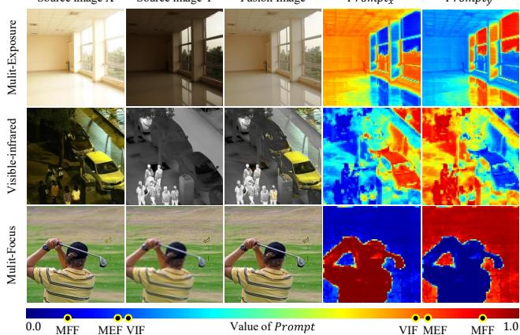
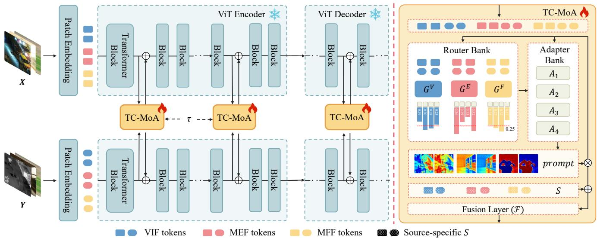
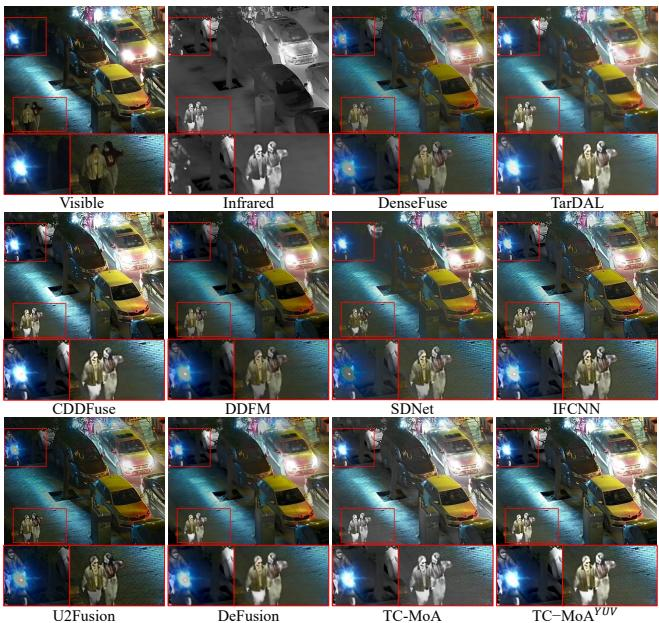
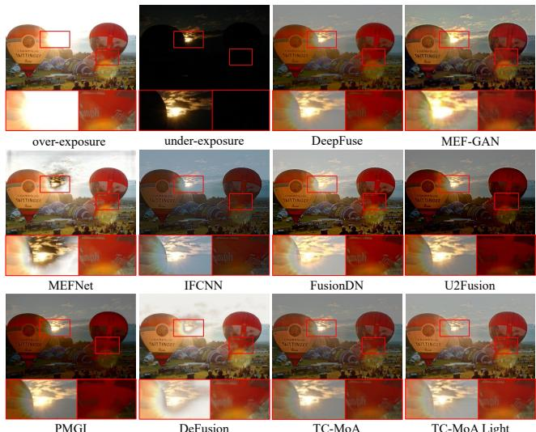
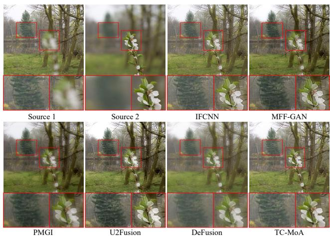
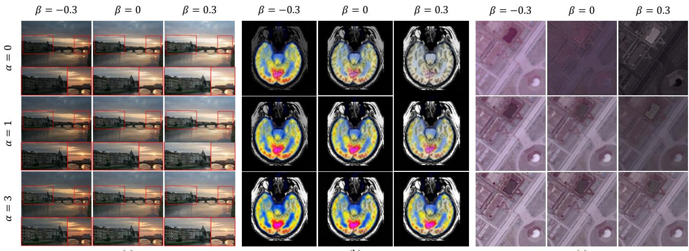
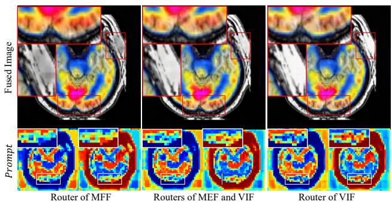
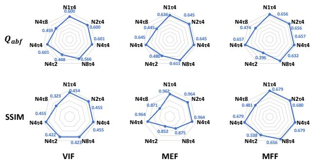

# Task-Customized Mixture of Adapters for General Image Fusion

Pengfei Zhu, Yang Sun, Bing Cao\*, Qinghua Hu

Tianjin Key Lab of Machine Learning, College of Intelligence and Computing, Tianjin University, China {zhupengfei,yangsun,caobing,huqinghua}@tju.edu.cn

## Abstract

General image fusion aims at integrating important information from multi-source images. However, due to the significant cross-task gap, the respective fusion mechanism varies considerably in practice, resulting in limited performance across subtasks. To handle this problem, we propose a novel task-customized mixture ofadapters (TC-MoA) for general image fusion, adaptively prompting various fusion tasks in a unified model. We borrow the insight from the mixture of experts (MoE), taking the experts as efficient tuning adapters to prompt a pre-trained foundation model. These adapters are shared across different tasks and constrained by mutual information regularization, ensuring compatibility with different tasks while complementarity for multi-source images. The task-specific routing networks customize these adapters to extract task-specific information from different sources with dynamic dominant intensity, performing adaptive visual feature promptfusion. Notably, our TC-MoA controls the dominant intensity bias for different fusion tasks, successfully unifying multiple fusion tasks in a single model. Extensive experiments show that TC-MoA outperforms the competing approaches in learning commonalities while retaining compatibility for general image fusion (multi-modal, multi-exposure, and multifocus), and also demonstrating striking controllability on more generalization experiments. The code is available at https://github.com/YangSun22/TC-MoA.

## 1. Introduction

Image fusion aims to integrate complementary information from multi-source images captured by different sensors in the same scene onto a single image. It is usually used to enhance important information and visual quality [14]. Currently, general image fusion mainly includes multi-modal, multi-exposure, and multi-focus image fusion, etc. Fusion tasks exhibit diverse fusion mechanisms. The Multi-Exposure image Fusion (MEF) focuses on integrating images with multiple exposure levels into a high-quality full exposure image [40]. Each source image contributes its own illumination and structural information to the fused image [28]. The Visible-Infrared image Fusion (VIF) is a subfield of the Multi-Modal Fusion (MMF) [8, 16, 48] that aims at fusing complementary information of infrared and visible modalities to produce robust and informative fused images [25]. Infrared images provide more intensity information, while visible images offer more texture and gradient information. The Multi-Focus image Fusion (MFF) aims at generating an all-in-focus image from a series of partially focused images [23]. A patch of multi-focus fused image typically corresponds to only one source image. Consequently, it can be observed that the MEF and VIF tasks involve relatively balanced fusion, while MFF is an extremely unbalanced task that tends to exhibit polarized choices.

Source image X  
Source image Y  
Fusion Image  
�������  
�������  
  
Figure 1. Prompt can adaptively select the complementary information from multi-source features. The dominant intensity bias vary according to the task, which is reflected by the different shades of colors.

With the rapid development of deep learning techniques, image fusion has achieved great progress in recent years [31, 41], while most existing methods [28, 54, 55] focus on single image fusion scenario alone. Task-specific methods [28, 36] often employ task-specific strategies such as designing complex task-biased networks or utilizing task-specific fusion loss functions, resulting in the weak generalization to other tasks [41]. Considering that different fusion tasks have similar objectives, i.e., integrating complementary information from multiple source images, some recently proposed approaches [20, 41, 51] attempted to conduct various fusion tasks using a unified model, forming general image fusion. These methods, however, are either enmeshed in dominant-task bias [51] or multi-task commonality [20, 41] at the expense of individuality, leading to unsatisfactory performance. This motivates us to explore a more compatible fusion paradigm that is adaptively and dynamically compatible with different fusion scenarios.

To handle this challenge, inspired by the impressive representation capability of pre-trained foundation models, we introduce the foundation model as a fixed encoder to extract complementary features for multi-source images. Different from most existing methods, we borrow insight from the mixture of experts (MoE) [24, 33], taking each expert as an efficient tuning adapter to perform adaptive visual feature prompt fusion based on the foundation model. The task-specific routing networks customize these adapters to generate task-specific fusion prompt for different sources, forming a novel task-customized mixture of adapters (TC-MoA) architecture. An mutual information regularization is further developed to constrain the prompt, which guarantees complementarity for diverse sources. It is worth noting that the prompt have significant task bias and dominant intensity gaps. As shown in Fig. 1, the prompt of MFF has a greater color difference than VIF and MEF, meaning that feature selection has more bipolarity on dominant intensity bias. Our model effectively perceives the fusion intensity bias among varied fusion tasks in a single model and is therefore compatible with a wider range of fusion tasks. Extensive experiments verify our superiority over the competing methods in general image fusion, including multi-modal, multi-exposure, and multi-focus fusion. More importantly, our TC-MoA even shows unprecedented controllability and generalizability for unseen fusion tasks, fully demonstrating our potential in broader scenarios. We summarize our main contributions as follows:

• We propose a unified general image fusion model, providing a new task-customized mixture of adapters (TC-MoA) for adaptive multi-source image fusion (benefiting from the dynamically aggregating effective information from the respective modalities).

• We propose a mutual information regularization for adapters, which allows our model to more accurately identify the dominant intensity of different source images.

• To the best of our knowledge, we for the first time propose an MoE-based flexible adapter for the foundation model in general image fusion. By only adding 2.8% of learnable parameters, our model copes with numerous fusion tasks. Extensive experiments demonstrate our superiority against the competing methods, while showing significant controllability and generalizability.

## 2. Related Work

Image Fusion. Image fusion focuses on generating a fused image containing complementary information from different source images. Some early methods [16, 22, 31] tackled their respective task by leveraging CNN. Then, GAN-based [43, 46] and Transformer-based methods [13, 30, 36] have been proposed to improve the fusion quality. Furthermore, high-level tasks [3, 21, 34] are also introduced to guide the fusion of images. Feature decomposition [52, 53] for highlow frequency has also gained significant attention as a research direction. Different from these methods, some most recent methods focus on general image fusion that aims to address multiple fusion tasks in a single model. Zhang et al. [51] performed a supervised training framework for MFF, which was generalized to other tasks by adjusting fusion conditions. Xu et al. [41, 42] appraised the quantity and quality of information from source images or features with the image quality assessment (IQA) to decide the fusion paradigm. PMGI [45] and SwinFusion [26] incorporated a unified fusion framework and loss function, and separate model training for individual tasks. Liang et al. [20] performed a self-supervised fusion framework to learn fusion commonality while ignoring task-specific individuality. In this work, we accommodate diverse fusion tasks by dynamically customizing the mixture of adapters, rather than suffering individuality for cross-task commonality.

Parameter-Efficient Fine-Tuning. To efficiently adapt pre-trained models to the respective downstream application tasks, some Parameter-Efficient Fine-Tuning (PEFT) studies have been proposed. PEFT can be mainly divided into the Adapter [10, 19, 32] and the Prefix Tuning [11, 18]. Jia et al. [11] introduced prompt tuning to the ViT structure. Chen et al. [4] proposed a new adapter by scaling the original features instead of summing. Lian et al. [19] bridged the gap between the pre-trained features and the downstream task features by linearly varying the original features. In this paper, different from these methods that focus on tuning high-level tasks, we for the first time generalize the powerful foundational model to general image fusion.

Mixture of Experts. Shazeer et al. [33] first proposed the mixture of experts (MoE) to increase model capacity without increasing computational complexity. Based on this, Lepikhin et al. [15] and Fedus et al. [7] integrated MoE with the transformer structure, further pushing the upper limit of network capacity. In addition, MoE has been validated as effective in other challenges. Ma et al. [24] tackled the multi-task problem by designing multi-gates MoE. Mustafa et al. [29] exploited MoE to train the contrastive learning-based vision-language foundation model. Inspired by this, we take each expert as an adapter, forming a taskcustomized mixture of adapters for tuning our general image fusion framework.

  
Figure 2. An overview of our proposed TC-MoA method. Our approach gradually modulates the fusion results by inserting TC-MoA into the frozen ViT backbone. TC-MoA generates task-specific prompt through a task-specific router bank and an shared adapter bank. Th fusion layer utilizes prompt as scale and source-specific embeddings as biases to obtain fusion images.

## 3. Method

## 3.1. Overview

In this paper, we propose a task-customized mixture of adapters for general image fusion, which is a novel parameter-efficient fine-tuning method to jointly and adaptively prompt various fusion tasks. Given a pair of source images $\left\{ ( \overset { \cdot } { X } , Y ) | X , Y \in \mathbb { R } ^ { H \times W \times 3 } \right\}$ the network integrates complementary information from different sources to obtain the fused image $I _ { F u s i o n } \in \mathbb { R } ^ { H \times W \times 3 }$ . As shown in Fig. 2, we feed the source images into the ViT network and obtain tokens of the source images through the patch embedding layer. ViT consists of an encoder for feature extraction and a decoder for image reconstruction, both of which are composed of transformer blocks. A TC-MoA is inserted into each $\tau \ ( \tau = 4 )$ transformer blocks in both the encoder and decoder. Each TC-MoA consists of a taskspecific router bank, a task-shared adapter bank, and a fusion layer. Our network gradually modulates the fusion results through these TC-MoA.

## 3.2. Task-Customized Mixture of Adapters

As shown in Fig. 2 , each TC-MoA consists of a taskspecific router bank $\left\{ G ^ { \nu } , G ^ { E } , G ^ { F } \right\}$ , a task-shared adapter bank $\{ A _ { 1 } , \dotsc , A _ { N } \}$ and a prompting fusion layer $\mathcal { F }$ . The TC-MoA includes two main stages: prompt generation and prompt-driven fusion. For ease of expression, we take the VIF as an example, assuming that the input comes from the VIF dataset and uses G to denote $G ^ { V }$

Prompt Generation. First, we obtain multi-source features for subsequent processing. The network structure before the j-th TC-MoA is defined as $E _ { j } ( \cdot )$ , and the extracted features are defined as $f _ { x }$ and $f _ { y } ,$ , where $f \in \mathbb { R } ^ { p H \times p W \times C }$

We concatenate $f _ { x }$ and $f _ { y }$ as a feature representation of pairs of multi-source tokens. This allows tokens from different sources to exchange information in the subsequent network. However, directly computing on the highdimensional concatenated features will bring amounts of unnecessary parameters. Therefore, we use $L ( \cdot )$ to perform feature dimension reduction and obtain the processed multiple-source features Φ as follows,

$$
f _ { x } = E _ { j } ( X ) , f _ { y } = E _ { j } ( Y )\tag{1}
$$

$$
\Phi = L ( C a t ( f _ { x } , f _ { y } ) )\tag{2}
$$

where $C a t ( \cdot )$ represents the concatenation of features, L(·) consists of a linear layer and normalization layers. Next, depending on the task to which Φ belongs, we select a taskspecific router from the router bank to customize the routing schemes, i.e., which adapters in the adapter bank should be input for each token pair.

$$
\begin{array} { c } { { G ( x ) = S o f t m a x ( T o p K ( x \cdot W _ { g } + } } \\ { { N ( 0 , 1 ) \cdot S o f t p l u s ( x \cdot W _ { n o i s e } ) ) ) } } \end{array}\tag{3}
$$

where $T o p K ( \cdot )$ keeps only the top $K ( K = 2 )$ values, setting the rest to −∞ (after $S o f t m a x ( \cdot )$ , the value becomes 0 ). $W _ { g }$ and $W _ { n o i s e }$ are learnable parameters. The customization routing schemes vary for tasks, as evidenced by the proportion of the number of times that different adapters have been routed in Fig. 2 (b). After that , we weight sum the output from the adapters to obtain the prompt. Each router masters a task-biased appetite for customizing a suitable mixture of adapters, and each adapter generates the prompt. The task-customized multi-source prompt is then

calculated as follows,

$$
p r o m p t = G A P ( S i g m o i d ( \sum _ { i = 1 } ^ { N } G ( \Phi ) _ { i } \cdot A _ { i } ( \Phi ) )\tag{4}
$$

where $G A P ( \cdot )$ represents the global average pooling, i is the index of adapters and $G ( \cdot ) _ { i }$ is the routing value for the i-th adapter. The task-customized prompt, denoted as prompt $\mathbf { \bar { \Psi } } \in \mathbf { \Psi } \mathbb { R } ^ { p H \times p W \times 2 }$ , is composed of $p r o m p t _ { x }$ and $\bar { p r o m p t _ { y } } \in \mathbb { R } ^ { p H \times p W \times 1 }$ and has a value range of (0, 1) .

Prompt-Driven Fusion. The task-customized prompt is constrained by mutual information regularization (MIR), which guarantees complementarity for diverse sources. Thus the prompt can be taken as an evaluation of the proportion of important information in each source. By dotmultiplication of multi-source features and prompt, we retain complementary information while removing redundant information. Afterward, considering that the feature representation should contain a source-correlated bias (e.g. visible or infrared images), we introduce input-independent learnable parameters for each source, i.e., source embedding S. After feature prompting and shifting, we obtain the refined source features $( h _ { x } , h _ { y } )$ as follows,

$$
\begin{array} { r } { h _ { x } = p r o m p t _ { x } \cdot f _ { x } + S _ { x } } \\ { h _ { y } = p r o m p t _ { y } \cdot f _ { y } + S _ { y } } \\ { f _ { T C - M o A } = \mathcal { F } ( h _ { x } + h _ { y } ) } \end{array}\tag{5}
$$

where $S _ { x }$ and $S _ { y }$ represent the source embeddings of visible and infrared images in VIF respectively. $\mathcal F ( \cdot )$ fuses the refined multi-source features using an additive operation and then passes them through a set of convolutional layers. These layers introduce local receptive fields to reduce the checkerboard artifacts and align the solution space of the subsequent transformer blocks. Ultimately, we obtain a fusion feature through the task-customized prompt. To encourage the model to extract important information gradually, the features input into the next transformer block are processed as follows,

$$
\begin{array} { r } { \begin{array} { r } { \pmb { f _ { x } } ^ { \prime } = \lambda _ { f } f _ { x } + ( 1 - \lambda _ { f } ) f _ { T C - M o A } } \\ { f _ { y } ^ { \prime } = \lambda _ { f } f _ { y } + ( 1 - \lambda _ { f } ) f _ { T C - M o A } } \end{array} } \\ { \begin{array} { r l } & { \pmb { f _ { y } } ^ { \prime } = \lambda _ { f } f _ { y } + ( 1 - \lambda _ { f } ) f _ { T C - M o A } } \end{array} } \end{array}\tag{6}
$$

where $\lambda _ { f }$ is a learnable parameter initialized to 0.5.

Mutual Information Regularization. In order to ensure that the model dynamically retains complementary information while discarding redundant information of multisource features, we impose regularization constraints on the prompt. Assuming that the information representation of features varies linearly, we define the MIR as follows,

$$
\operatorname* { m i n } { | p r o m p t _ { x } + p r o m p t _ { y } - 1 | }\tag{7}
$$

The MIR allows the model to accurately identify the dominant intensity of different sources, which is positively correlated with the information content of the sources.

## 3.3. Task-Customized Loss Function

In addition to accommodating the individuality of different tasks in our network structure, we also customize unsupervised loss functions for each fusion task. We add $\mathcal { L } _ { a u x }$ to the loss function of each task to ensure the training of TC-MoA and $\mathcal { L } _ { a u x }$ is the auxiliary loss in [33] to avoid adapters learning unbalanced. On the other hand, in order to generate high-quality fusion images, we impose constraints on the structural information $( \mathcal { L } _ { s s i m } )$ , intensity information $( \mathcal { L } _ { P i x e l } )$ for VIF loss function, and gradient information $( \mathcal { L } _ { G r a d } )$ of the fusion images for different fusion tasks.

For the VIF task, our objective is to retain the most pronounced high-frequency and low-frequency information from the source images in the fused image. Thus, we design the $\mathcal { L } _ { M a x P i x e l }$ and $\mathcal { L } _ { M a x G r a d } .$ To avoid confusing gradients, we retain the sign of the gradient values in all loss functions related to gradient information. For the MEF task, we consider that the luminance of the fused images should be at an average level with all the gradient information. Thus we design the loss functions for MEF with $\mathcal { L } _ { A v g P i x e l }$ and $L _ { M a x G r a d } . \nonumber$ Additionally, we adopt $\mathcal { L } _ { m e f s s i m }$ [28] which is specially designed for the MEF task, instead of the SSIM loss function. For the MFF task, we believe that each patch of the fused image should only depend on a single source image with the maximum gradient. This is to prevent the objects’ edges in defocused images from being preserved, thereby affecting the quality of the fused image. For this purpose, we select only one of the source images to compute the loss function for each patch in the image, i.e. $\mathcal { L } _ { M a s k P i x e l }$ and $\mathcal { L } _ { M a s k G r a d } .$ . Please refer to the supplementary material for details of the loss functions.

## 4. Experiments

## 4.1. Experimental Setting

Datasets. We conduct experiments in three image fusion scenarios: visible-infrared, multi-focus, and multi-exposure fusion. For VIF, we evaluate our model on the LLVIP [12] dataset. The training set contains 12025 image pairs, and we randomly select 70 samples out of the test set for evaluation. For MEF, we employ the SCIE [2] dataset (589 pairs) for training and MEFB [49] dataset (100 pairs) for testing, we utilize the most underexposed and overexposed images from sequences in SCIE as inputs. For MFF, we train our model on the RealMFF [47] and the MFI-WHU [46] datasets and follow the test setting in MFIF [50].

Implementation Details. Our experiments are performed on a server with 8 × NVIDIA RTX A6000 GPUs. Although our model supports inputs of arbitrary size, we ensure that each fusion task receives an equal amount of data per iteration by randomly cropping all samples to a size of 448×448. We employ the pre-trained MAE-large model [9] with GAN loss as our backbone. We train 20 epochs jointly with all the fusion tasks, and the batch size for each fusion task is set to 3. We adopt the AdamW optimizer with the initial learning rate of $1 . 5 \times 1 0 ^ { - 4 }$ . To ensure training stability, we apply the Exponential Moving Average (EMA) to routers and adapters optimization. Each TC-MoA consists of $N ( N = 4 )$ adapters embedded in different layers, but only the top $K ( K = 2 )$ adapters are activated.

  
Figure 3. Qualitative comparisons of various methods in VIF task.

Evaluation Metrics. Since the commonly used evaluation metrics for fusion tasks are not exactly the same, we customize a set of metrics for each task. Existing metrics can be mainly divided into the following four categories [40]. ⋄ The information theory-based metrics: entropy (EN), peak signal-to-noise ratio (PSNR), mutual information (MI), normalized MI (NMI), Nonlinear correlation information entropy $( Q _ { n c i e } )$ , feature mutual information (FMI). ⋄ The image feature-based metrics: phase congruency-based metric $Q _ { p } ,$ standard deviation (SD), gradient-based metric $Q _ { a b f }$ and $Q _ { g } . \circ$ The structural similarity-based metrics: $Q _ { c }$ [5], $Q _ { w } , Q _ { s } [ 3 8 ]$ , structural similarity (SSIM), multiscale structural similarity (MS-SSIM [37]) and MEF-SSIM [27]. ⋄ The human perception inspired metrics: visual information fidelity (VIF), $Q _ { c b }$ and $Q _ { c v } .$ . Detailed information on metrics can be found in [25] and [23].

## 4.2. Evaluation on Multi-Modal Fusion

In this section, we compare our TC-MoA with ten taskspecific image fusion methods and four general image fusion methods on the LLVIP dataset.

Quantitative Comparisons. We evaluate the fusion performance on 8 quantitative metrics, as shown in Table 1. Our method outperforms all the general image fusion methods, demonstrating our superior compatibility across multiple fusion tasks. For most task-specific image fusion methods, TC-MoA also performs remarkable improvements, although these methods deploy complex task-specific designs. Specifically, our method achieves a significant advantage in VIF, $\begin{array} { r } { Q _ { c v } . } \end{array}$ , and EN metrics correlated to human perception or information theory. This indicates that our fused image conforms more to human visual perception and contains more information from the source images. The results on MS-SSIM, SD, and $Q _ { w }$ metrics also explain that our fusion results possess a sufficient amount of structural information and gradient information.

Table 1. Quantitative results of the VIF task in LLVIP dataset. Boldface in red and boldface in blue show the best and secondbest values, respectively. The underline represents the best value in the general image fusion methods.
<table><tr><td>Method</td><td>VIF</td><td> $Q _ { c }$ </td><td>EN</td><td>SD</td><td> $Q _ { c v \downarrow }$ </td><td>MS-SSIM</td><td>FMI</td><td> $Q _ { w }$ </td></tr><tr><td>Densefuse [31]</td><td>0.545</td><td>0.533</td><td>6.830</td><td>9.381</td><td>817.213</td><td>0.878</td><td>0.876</td><td>0.622</td></tr><tr><td>AUIF [53]</td><td>0.402</td><td>0.370</td><td>6.137</td><td>7.769</td><td>1087.569</td><td>0.784</td><td>0.869</td><td>0.530</td></tr><tr><td>DIDFuse [52]</td><td>0.366</td><td>0.348</td><td>5.991</td><td>7.765</td><td>897.007</td><td>0.767</td><td>0.863</td><td>0.479</td></tr><tr><td>TarDAL [21]</td><td>0.550</td><td>0.562</td><td>7.347</td><td>9.609</td><td>549.177</td><td>0.864</td><td>0.860</td><td>0.628</td></tr><tr><td>YDTR [36]</td><td>0.486</td><td>0.524</td><td>6.638</td><td>8.810</td><td>883.333</td><td>0.835</td><td>0.876</td><td>0.614</td></tr><tr><td>RFN-Nest [17]</td><td>0.497</td><td>0.456</td><td>7.052</td><td>9.609</td><td>857.157</td><td>0.862</td><td>0.871</td><td>0.385</td></tr><tr><td>SwinFuse [39]</td><td>0.399</td><td>0.321</td><td>5.878</td><td>7.457</td><td>1306.652</td><td>0.734</td><td>0.870</td><td>0.425</td></tr><tr><td>UMF-CMGR [6]</td><td>0.414</td><td>0.479</td><td>6.607</td><td>8.520</td><td>810.670</td><td>0.801</td><td>0.876</td><td>0.561</td></tr><tr><td>DDFM [55]</td><td>0.588</td><td>0.561</td><td>7.069</td><td>9.696</td><td>760.006</td><td>0.908</td><td>0.878</td><td>0.663</td></tr><tr><td>CDDFuse [54]</td><td>0.694</td><td>0.645</td><td>7.342</td><td>9.733</td><td>495.473</td><td>0.933</td><td>0.883</td><td>0.830</td></tr><tr><td>SDNet [44]</td><td>0.527</td><td>0.575</td><td>6.897</td><td>9.318</td><td>936.389</td><td>0.878</td><td>0.872</td><td>0.749</td></tr><tr><td>IFCNN [51]</td><td>0.679</td><td>0.634</td><td>7.223</td><td>9.662</td><td>521.741</td><td>0.946</td><td>0.882</td><td>0.856</td></tr><tr><td>U2Fusion [41]</td><td>0.503</td><td>0.492</td><td>6.647</td><td>8.789</td><td>857.455</td><td>0.878</td><td>0.870</td><td>0.695</td></tr><tr><td>DeFusion [20]</td><td>0.606</td><td>0.606</td><td>7.216</td><td>9.701</td><td>532.092</td><td>0.890</td><td>0.880</td><td>0.676</td></tr><tr><td>TC-MoA</td><td>0.726</td><td>0.637</td><td>7.428</td><td>9.805</td><td>423.773</td><td>0.949</td><td>0.886</td><td>0.858</td></tr></table>

Table 2. Quantitative results of the MEF task in MEFB [49]
<table><tr><td>Method</td><td>Psnr</td><td> $Q _ { c }$ </td><td> $Q _ { p }$ </td><td> $Q _ { g }$ </td><td> $Q _ { s }$ </td><td>MEF-SSIM</td><td>FMI</td><td> $Q _ { w }$ </td></tr><tr><td>Deepfuse [31]</td><td>57.104</td><td>0.426</td><td>0.352</td><td>0.325</td><td>0.641</td><td>0.897</td><td>0.873</td><td>0.548</td></tr><tr><td>MEF-GAN [43]</td><td>56.947</td><td>0.309</td><td>0.124</td><td>0.246</td><td>0.487</td><td>0.772</td><td>0.846</td><td>0.300</td></tr><tr><td>MEFNet [28]</td><td>56.594</td><td>0.656</td><td>0.595</td><td>0.565</td><td>0.838</td><td>0.914</td><td>0.890</td><td>0.866</td></tr><tr><td>IFCNN [51]</td><td>57.195</td><td>0.553</td><td>0.562</td><td>0.478</td><td>0.720</td><td>0.943</td><td>0.882</td><td>0.834</td></tr><tr><td>FusionDN [42]</td><td>56.977</td><td>0.500</td><td>0.504</td><td>0.434</td><td>0.672</td><td>0.924</td><td>0.877</td><td>0.776</td></tr><tr><td>PMGI [45]</td><td>57.117</td><td>0.489</td><td>0.525</td><td>0.442</td><td>0.666</td><td>0.936</td><td>0.885</td><td>0.804</td></tr><tr><td>U2Fusion [41]</td><td>57.055</td><td>0.457</td><td>0.505</td><td>0.415</td><td>0.585</td><td>0.930</td><td>0.882</td><td>0.787</td></tr><tr><td>DeFusion [20]</td><td>57.131</td><td>0.539</td><td>0.378</td><td>0.376</td><td>0.751</td><td>0.902</td><td>0.877</td><td>0.733</td></tr><tr><td>TC-MoA</td><td>57.213</td><td>0.578</td><td>0.598</td><td>0.528</td><td>0.767</td><td>0.964</td><td>0.888</td><td>0.845</td></tr></table>

Qualitative Comparisons. As shown in Fig. 3, our model outperforms the competing methods in terms of visual quality. For instance, the contours of the tree in dark areas are well depicted and the background texture is clearer. It is worth noting that our model has the capability to directly generate color images, or we can also follow other approaches to conduct on gray images and colorize the results to obtain $\mathbf { \Gamma } _ { \mathrm { T C - M o A } } { } ^ { Y U \mathbf { \tilde { \Gamma } } }$ Compared with the competing methods, our model exhibits higher contrast between foreground and background, and more saturated colors. This comparison demonstrates our model is effective in generating fused images with superior perceptual quality.

## 4.3. Evaluation on Multi-Exposure Fusion

In this section, we compare TC-MoA with three taskspecific MEF methods i.e. Deepfuse[31], MEF-GAN[43] and MEF-Net [28], and five general image fusion methods i.e. IFCNN [51], FusionDN [42], PMGI [45], U2Fusion [41], and DeFusion [20].

  
Figure 4. Qualitative comparisons in MEF task.

Quantitative Comparisons. We employ 8 quantitative metrics to evaluate our model and the competing methods on MEFB, as presented in Table 2. Our model achieves the SoTA performance in the general image fusion methods and achieves competitive results in task-specific methods. For example, our model significantly improves the MEF-SSIM scores due to the compatibility of TC-MoA with diverse tasks, enabling task-specific optimization while reducing task conflicts. The MEF-SSIM focuses on the structure and contrast distortion of images, and $Q _ { p }$ measures the phase congruency of the source and fused images. The highest MEF-SSIM, PSNR, and $Q _ { p }$ values indicate our effectiveness in the preservation of structural information, detailed features, and image quality in the fused images.

Qualitative Comparisons. As shown in Fig. 4, our method preserves the most texture details and color in both high and low illumination regions. Specifically, in the high illumination region, our model effectively retains more structural information of the clouds around the sun. In the low illumination region, the colors of the fonts on the hot air balloon are completely confused in the PMGI and U2Fusion methods. As a comparison, our method maintains detailed information while keeping more accurate color information. In fact, there is no objective standard for the brightness of the fused image for multi-exposure images. To solve this problem, our method makes the fusion of images controllable by modulating the prompt. The image of “TC-MoA Light” shows the result of this modulation. Detailed information about the modulation can be found in Sec. 4.6.

## 4.4. Evaluation on Multi-Focus Fusion

We compare TC-MoA with two task-specific MFF methods i.e. IFCNN [51] (supervised on MFF) and MFF-GAN [46], and four general image fusion methods i.e. FusionDN [42],

  
Figure 5. Qualitative comparisons in MFF task.

Table 3. Quantitative results of the MFF task.
<table><tr><td>Method</td><td>NMI</td><td> $Q _ { n c i e }$ </td><td>MI</td><td> $Q _ { c b }$ </td><td> $Q _ { c v } \downarrow$ </td><td>MS-SSIM</td><td>FMI</td><td>Qw</td></tr><tr><td>IFCNN [51]</td><td>0.847</td><td>0.825</td><td>6.495</td><td>0.691</td><td>44.373</td><td>0.991</td><td>0.881</td><td>0.912</td></tr><tr><td>MFF-GAN [46]</td><td>0.728</td><td>0.820</td><td>5.689</td><td>0.609</td><td>72.460</td><td>0.977</td><td>0.876</td><td>0.877</td></tr><tr><td>FusionDN [42]</td><td>0.675</td><td>0.818</td><td>5.449</td><td>0.519</td><td>178.491</td><td>0.942</td><td>0.864</td><td>0.794</td></tr><tr><td>PMGI [45]</td><td>0.702</td><td>0.819</td><td>5.522</td><td>0.542</td><td>140.957</td><td>0.923</td><td>0.866</td><td>0.575</td></tr><tr><td>U2Fusion [41]</td><td>0.670</td><td>0.818</td><td>5.329</td><td>0.530</td><td>142.325</td><td>0.948</td><td>0.867</td><td>0.830</td></tr><tr><td>DeFusion [20]</td><td>0.768</td><td>0.821</td><td>5.838</td><td>0.625</td><td>83.195</td><td>0.960</td><td>0.870</td><td>0.685</td></tr><tr><td>TC-MoA</td><td>0.875</td><td>0.827</td><td>6.695</td><td>0.718</td><td>36.512</td><td>0.990</td><td>0.881</td><td>0.891</td></tr></table>

PMGI [45], U2Fusion [41], and DeFusion [20].

Quantitative Comparisons. We employ 8 quantitative metrics on the dataset provided in the [50], as illustrated in Table 3. Our method shows competitive performance compared to most image fusion methods. For general image fusion, our model achieves superior performance across all metrics. Additionally, TC-MoA directly generates the fused image without predicting the decision map. Nevertheless, we still significantly outperform IFCNN in NMI, MI, Qcb, and Qcv metrics. This indicates that our fusion results, compared to supervised method, retain more source image details and demonstrate remarkable human visual perception. Qualitative Comparisons. As depicted in Fig. 5, our fused image exhibits superior consistency in terms of texture and color, surpassing that of the other methods. U2Fusion exhibits color deviations in the far-focus region, while IFCNN distorts the near-focus image. Furthermore, these methods are unable to effectively remove the distortion around the flowers, while we introduce an MFF-specific loss, which achieves the most visually appealing results for the flower.

## 4.5. Ablation Study

We conduct ablation studies to verify the effect of our TC-MoA and network architecture.

TC-MoA. To verify the effectiveness of TC-MoA, we remove it from our framework. As shown in the first and second rows of Table 4, the models trained by multi-task training outperform those trained for a single task, based on 5 commonly used metrics. Interestingly though, this rule reverses in the case of MEF, indicating that inter-task competition occurs for models trained directly with multiple tasks. Comparatively, the model incorporating the multiple adapters improves the performance across all metrics, suggesting that TC-MoA is dynamically compatible with different tasks.

Table 4. Ablation studies on TC-MoA. S and M represent single task training and multi-task training, while SA and MA denote single adapter and multiple adapters respectively.
<table><tr><td>Task</td><td>S</td><td>M</td><td>SA</td><td>MA</td><td> $Q _ { a b f }$ </td><td> $Q _ { p }$ </td><td>FMI</td><td> $Q _ { c }$ </td><td>SSIM</td></tr><tr><td rowspan="3">VIF</td><td>√</td><td></td><td>√</td><td></td><td>0.5984</td><td>0.4073</td><td>0.8857</td><td>0.6335</td><td>0.4540</td></tr><tr><td></td><td>√</td><td>√</td><td></td><td>0.5997</td><td>0.4116</td><td>0.8862</td><td>0.6357</td><td>0.4544</td></tr><tr><td></td><td>√</td><td></td><td>√</td><td>0.6007</td><td>0.4119</td><td>0.8862</td><td>0.6365</td><td>0.4550</td></tr><tr><td rowspan="3">MEF</td><td>D</td><td></td><td>√</td><td></td><td>0.6385</td><td>0.5916</td><td>0.8875</td><td>0.5754</td><td>0.4115</td></tr><tr><td></td><td>√</td><td>√</td><td></td><td>0.6362</td><td>0.5899</td><td>0.8875</td><td>0.5765</td><td>0.4106</td></tr><tr><td></td><td> $\checkmark$ </td><td></td><td>√</td><td>0.6449</td><td>0.5980</td><td>0.8883</td><td>0.5776</td><td>0.4116</td></tr><tr><td rowspan="3">MFF</td><td>√</td><td></td><td>√</td><td></td><td>0.6517</td><td>0.6733</td><td>0.8797</td><td>0.7702</td><td>0.6774</td></tr><tr><td></td><td> $\checkmark$ </td><td>√</td><td></td><td>0.6562</td><td>0.6799</td><td>0.8806</td><td>0.7742</td><td>0.6792</td></tr><tr><td></td><td>√</td><td></td><td>√</td><td>0.6568</td><td>0.6811</td><td>0.8808</td><td>0.7755</td><td>0.6794</td></tr></table>

Adapter-based Fine-tuning. We performed ablation experiments on the backbone and adapter methods, as shown in Table 5. The fine-tuning method of “FrozenBackbone” represents freezing the entire backbone and only unfreezing the final linear layer. Compared to the approach of “Frozen-Backbone”, our TC-MoA achieves significant fusion performance improvements by introducing a small number of learnable parameters. More importantly, our method outperforms the existing adapter-based visual fine-tuning approach AdaptFormer [4] on both base and large versions of pre-trained models, demonstrating the superiority of the TC-MoA structure in fusion tasks. In addition to this, Table 9 shows our base version achieves competitive performance on the VIF task, which can be further enhanced by the large version.

## 4.6. Analysis and Discussion

Efficiency. We have observed the speed issues brought about by the massive parameters of the pre-trained models. To address this, we have optimized the ViT architecture by the shifted windows, which will be detailed in Sec. 8. After optimization, for multi-task with arbitrary-size inputs, Table 6 shows the base and large versions of the model have accelerated by 178% and 167%, resulting in acceptable FPS (Frames Per Second) compared with other methods. The “Frozen” refers to the vanilla ViT architecture.

$$
\begin{array} { r } { p r o m p t _ { x } ^ { ' } = \mu + \alpha ( p r o m p t _ { x } - \mu ) + \beta } \\ { p r o m p t _ { y } ^ { ' } = \mu + \alpha ( p r o m p t _ { y } - \mu ) - \beta } \end{array}\tag{8}
$$

Prompt Controllability. Employing the formula noted in Eq. (8), we manipulate both the scale and shift of the prompt provided to the trained model, where $\mu = 0 . 5$ represents the mean, while α and $\beta$ denote the scaling and shifting factors, respectively. We conduct the manipulation on some samples and present an example in Fig. 6 (a).

Table 5. Ablation studies on fine-tuning. B and L represent the use of ViT-base and ViT-large structures respectively.
<table><tr><td rowspan="2">Architecture</td><td colspan="3"> $\mathrm { V I F }$ </td><td colspan="3">MEF</td><td colspan="3">MFF</td></tr><tr><td> $Q _ { a b f }$ </td><td> $Q _ { p }$ </td><td>SSIM</td><td> $Q _ { a b f }$ </td><td> $Q _ { p }$ </td><td>SSIM</td><td> $Q _ { a b f }$ </td><td>Qp</td><td>SSIM</td></tr><tr><td rowspan="3">FrozenBackboneB AdaptFormerB TC-MoAB</td><td>0.175</td><td>0.089</td><td>0.275</td><td>0.250</td><td>0.139</td><td>0.227</td><td>0.295</td><td>0.189</td><td>0.466</td></tr><tr><td>0.531</td><td>0.336</td><td>0.427</td><td>0.574</td><td>0.504</td><td>0.377</td><td>0.579</td><td>0.561</td><td>0.651</td></tr><tr><td>0.576</td><td>0.396</td><td>0.450</td><td>0.604</td><td>0.540</td><td>0.394</td><td>0.612</td><td>0.619</td><td>0.660</td></tr><tr><td rowspan="3">FrozenBackboneL AdaptFormerL</td><td>0.330</td><td>0.238</td><td>0.363</td><td>0.452</td><td>0.408</td><td>0.333</td><td>0.450</td><td>0.428</td><td>0.596</td></tr><tr><td>0.576</td><td>0.392</td><td>0.446</td><td>0.616</td><td>0.563</td><td>0.396</td><td>0.640</td><td>0.650</td><td>0.671</td></tr><tr><td>0.601</td><td>0.412</td><td>0.455</td><td>0.645</td><td>0.598</td><td>0.412</td><td>0.657</td><td>0.681</td><td>0.679</td></tr></table>

Table 6. Efficiency and scalability comparisons of approaches.
<table><tr><td></td><td>|U2F</td><td>DDFM</td><td>CDD</td><td>FrozenB</td><td>TC-MoAB</td><td>FrozenL</td><td>TC-MoAL</td></tr><tr><td>Total Params (M)</td><td>1.32</td><td></td><td>1.78</td><td>111.65</td><td>115.40</td><td>339.12</td><td>348.70</td></tr><tr><td>Trainable Params (M)</td><td>1.32</td><td></td><td>1.78</td><td></td><td>3.87</td><td></td><td>9.58</td></tr><tr><td>FPS (VIF 640×512)</td><td>4.72</td><td>0.01</td><td>2.52</td><td>1.17</td><td>3.33</td><td>0.60</td><td>1.60</td></tr><tr><td>FPS (MEF arbitrary-size)</td><td>2.21</td><td>1</td><td></td><td>1.37</td><td>3.58</td><td>0.71</td><td>1.86</td></tr><tr><td>FPS (MFF arbitrary-size)</td><td>1.86</td><td>1</td><td></td><td>1.39</td><td>3.98</td><td>0.71</td><td>1.95</td></tr></table>

Obviously, as the value of $\beta$ increases, the brightness and texture of the fused image increasingly resemble the source image X, and inversely, the source image Y. Thus, β can be considered as a shifting of the dominant intensity bias. Moreover, a higher value of α tends to favor one source image over the other in the image patches, which can be considered as a scaling of the dominant intensity deviation. For example, outputs with $\beta = - 0 . 3$ are more similar to the under-exposure image globally. As α increases from 0 to 3, the building areas of the fused image gradually become brighter, but the brightness of the clouds remains basically unchanged. This suggests that changing the scale factor of the prompt motivates the model to select different regions. Overall, this experiment demonstrates that the prompt is controllable and can be linearly transformed to obtain fuse images in different degrees.

Generalizability. Our method is highly generalizable to tasks with similar fusion rules by zero-shot fusion. Specifically, we take samples from medical image fusion dataset [1] and pan-sharpening dataset generated by the Quickbird satellite, which are fused based on VIF’s paradigm. We obtain a base fused image with $\alpha = 1$ and $\beta \ = \ 0 ;$ , as shown in Fig. 6 (b) and (c). However, without any prior knowledge of these unknown tasks, the output fused image is an under-performing image, missing many high and low-frequency information. Interestingly, by manipulating the prompt, we can find a suitable fusion rule for these new tasks, obtaining reasonable fusion results.

Routers Controllability. As shown in Fig. 7, the images generated by the MFF router are darker than VIF in areas without gradient guidance. The MFF selects the reference sources based on gradients, it tends to average the information from sources without gradient guidance. In contrast, the VIF router tends to preserve the maximum intensity information. Moreover, at the bottom of the image, the MFF router tends to preserve the gradient information depending on a single source, while the VIF router preserves the gradient information from both sources. Additionally, by manipulating the combination of different routers, our model copes with controlling the dynamic changing fusion degree, obtaining more controllable results.

Figure 6. Visualisation of controllability and generalization of our method.  
  
Figure 7. Visualisation of different routers on medical images.

Hyperparameters. We conducted hyperparameters analysis on two aspects: the number of experts (N) and the interval between two TC-MoAs (τ). We utilize the ViT-large as our backbone, which consists of 24 transformer blocks in the encoder and 8 in the decoder. If τ = 4, our model contains 8 instances of TC-MoA. We employ two widely-used metrics $Q _ { a b f }$ and SSIM to inform the selection of hyperparameters. As presented in Fig. 8, as N increases, the performance initially increases but eventually declines, with the peak performance detected at N = 4. This suggests that increasing the number of experts does not necessarily enhance the model’s performance. Similarly, when τ = 4, the model demonstrates the best performance across multitask. Hence, our experiments are conducted under N = 4 and τ = 4.

## 5. Conclusion

In this paper, we propose a task-customized mixture of adapters for general image fusion. With the help of TC-MoA, different fusion tasks customize their respective mixture of adapters to obtain prompt guidance for multiplesource image fusion in a unified model. To ensure compatibility with different tasks while maintaining complementarity for multi-source images, we further propose mutual information regularization to constrain these adapters. Experimental results have shown that TC-MoA achieves advanced performance in general image fusion against the competing methods. In addition, TC-MoA demonstrates strong prompt controllability and router controllability to perform flexible manipulation on the fused images.

  
Figure 8. Experiments on the hyperparameters.

## 6. Acknowledgement

This work was sponsored in part by the National Key R&D Program of China 2022ZD0116500, in part by the National Natural Science Foundation of China (62222608, 62106171, U23B2049, 61925602), in part by the Haihe Lab of ITAI under Grant 22HHXCJC00002, in part by the Tianjin Natural Science Foundation under Grant 21JCY-BJC00580, in part by Tianjin Natural Science Funds for Distinguished Young Scholar under Grant 23JCJQJC00270, and in part by the Key Laboratory of Big Data Intelligent Computing, Chongqing University of Posts and Telecommunications under Grant BDIC-2023-A-008. This work was also sponsored by CAAI-CANN Open Fund, developed on OpenI Community. The authors appreciate the suggestions from CVPR anonymous peer reviewers.

## References

[1] Aanlib. Ihttp://www.med.harvard.edu/AANLIB/home.html, (Accessed 5 January 2020). 7

[2] Jianrui Cai, Shuhang Gu, and Lei Zhang. Learning a deep single image contrast enhancer from multi-exposure images. IEEE Transactions on Image Processing, 27(4):2049–2062, 2018. 4

[3] Bing Cao, Yiming Sun, Pengfei Zhu, and Qinghua Hu. Multi-modal gated mixture of local-to-global experts for dynamic image fusion. In Proceedings of the IEEE/CVF International Conference on Computer Vision (ICCV), pages 23555–23564, 2023. 2, 5

[4] Shoufa Chen, Chongjian Ge, Zhan Tong, Jiangliu Wang, Yibing Song, Jue Wang, and Ping Luo. Adaptformer: Adapting vision transformers for scalable visual recognition. Advances in Neural Information Processing Systems, 35:16664–16678, 2022. 2, 7

[5] Nedeljko Cvejic, Artur Loza, David Bull, and Nishan Canagarajah. A similarity metric for assessment of image fusion algorithms. International journal of signal processing, 2(3): 178–182, 2005. 5

[6] Wang Di, Liu Jinyuan, Fan Xin, and Risheng Liu. Unsupervised misaligned infrared and visible image fusion via crossmodality image generation and registration. In International Joint Conference on Artificial Intelligence (IJCAI), 2022. 5

[7] William Fedus, Barret Zoph, and Noam Shazeer. Switch transformers: Scaling to trillion parameter models with simple and efficient sparsity. The Journal ofMachine Learning Research, 23(1):5232–5270, 2022. 2

[8] Zongbo Han, Changqing Zhang, Huazhu Fu, and Joey Tianyi Zhou. Trusted multi-view classification with dynamic evidential fusion. IEEE Transactions on Pattern Analysis and Machine Intelligence, 45(2):2551–2566, 2023. 1

[9] Kaiming He, Xinlei Chen, Saining Xie, Yanghao Li, Piotr Dollar, and Ross Girshick. Masked autoencoders are scalable´ vision learners. In Proceedings ofthe IEEE/CVF conference on computer vision and pattern recognition, pages 16000– 16009, 2022. 4

[10] Edward J Hu, Yelong Shen, Phillip Wallis, Zeyuan Allen-Zhu, Yuanzhi Li, Shean Wang, Lu Wang, and Weizhu Chen. Lora: Low-rank adaptation of large language models. arXiv preprint arXiv:2106.09685, 2021. 2

[11] Menglin Jia, Luming Tang, Bor-Chun Chen, Claire Cardie, Serge Belongie, Bharath Hariharan, and Ser-Nam Lim. Visual prompt tuning. In European Conference on Computer Vision, pages 709–727. Springer, 2022. 2

[12] Xinyu Jia, Chuang Zhu, Minzhen Li, Wenqi Tang, and Wenli Zhou. Llvip: A visible-infrared paired dataset for low-light vision. In Proceedings of the IEEE/CVF international conference on computer vision, pages 3496–3504, 2021. 4

[13] Xin Jin, Xiuliang Xi, Ding Zhou, Xiaoxuan Ren, Jie Yang, and Qian Jiang. An unsupervised multi-focus image fusion method based on transformer and u-net. IET Image Processing, 17(3):733–746, 2023. 2

[14] Harpreet Kaur, Deepika Koundal, and Virender Kadyan. Image fusion techniques: a survey. Archives of computational methods in Engineering, 28:4425–4447, 2021. 1

[15] Dmitry Lepikhin, HyoukJoong Lee, Yuanzhong Xu, Dehao Chen, Orhan Firat, Yanping Huang, Maxim Krikun, Noam Shazeer, and Zhifeng Chen. Gshard: Scaling giant models with conditional computation and automatic sharding. CoRR, abs/2006.16668, 2020. 2

[16] Hui Li and Xiao-Jun Wu. Densefuse: A fusion approach to infrared and visible images. IEEE Transactions on Image Processing, 28(5):2614–2623, 2018. 1, 2

[17] Hui Li, Xiao-Jun Wu, and Josef Kittler. Rfn-nest: An end-toend residual fusion network for infrared and visible images. Information Fusion, 73:72–86, 2021. 5

[18] Xiang Lisa Li and Percy Liang. Prefix-tuning: Optimizing continuous prompts for generation. arXiv preprint arXiv:2101.00190, 2021. 2

[19] Dongze Lian, Daquan Zhou, Jiashi Feng, and Xinchao Wang. Scaling & shifting your features: A new baseline for efficient model tuning. Advances in Neural Information Processing Systems, 35:109–123, 2022. 2

[20] Pengwei Liang, Junjun Jiang, Xianming Liu, and Jiayi Ma. Fusion from decomposition: A self-supervised decomposition approach for image fusion. In European Conference on Computer Vision, pages 719–735. Springer, 2022. 2, 5, 6

[21] Jinyuan Liu, Xin Fan, Zhanbo Huang, Guanyao Wu, Risheng Liu, Wei Zhong, and Zhongxuan Luo. Target-aware dual adversarial learning and a multi-scenario multi-modality benchmark to fuse infrared and visible for object detection. In Proceedings of the IEEE/CVF Conference on Computer Vision and Pattern Recognition, pages 5802–5811, 2022. 2, 5

[22] Yu Liu, Xun Chen, Hu Peng, and Zengfu Wang. Multi-focus image fusion with a deep convolutional neural network. Information Fusion, 36:191–207, 2017. 2

[23] Yu Liu, Lei Wang, Juan Cheng, Chang Li, and Xun Chen. Multi-focus image fusion: A survey of the state of the art. Information Fusion, 64:71–91, 2020. 1, 5

[24] Jiaqi Ma, Zhe Zhao, Xinyang Yi, Jilin Chen, Lichan Hong, and Ed H Chi. Modeling task relationships in multi-task learning with multi-gate mixture-of-experts. In Proceedings of the 24th ACM SIGKDD international conference on knowledge discovery & data mining, pages 1930–1939, 2018. 2

[25] Jiayi Ma, Yong Ma, and Chang Li. Infrared and visible image fusion methods and applications: A survey. Information fusion, 45:153–178, 2019. 1, 5

[26] Jiayi Ma, Linfeng Tang, Fan Fan, Jun Huang, Xiaoguang Mei, and Yong Ma. Swinfusion: Cross-domain long-range learning for general image fusion via swin transformer. IEEE/CAA Journal of Automatica Sinica, 9(7):1200–1217, 2022. 2

[27] Kede Ma, Kai Zeng, and Zhou Wang. Perceptual quality assessment for multi-exposure image fusion. IEEE Transactions on Image Processing, 24(11):3345–3356, 2015. 5

[28] Kede Ma, Zhengfang Duanmu, Hanwei Zhu, Yuming Fang, and Zhou Wang. Deep guided learning for fast multiexposure image fusion. IEEE Transactions on Image Processing, 29:2808–2819, 2019. 1, 4, 5

[29] Basil Mustafa, Carlos Riquelme, Joan Puigcerver, Rodolphe Jenatton, and Neil Houlsby. Multimodal contrastive learning with limoe: the language-image mixture of experts. Advances in Neural Information Processing Systems, 35:9564– 9576, 2022. 2

[30] Linhao Qu, Shaolei Liu, Manning Wang, and Zhijian Song. Transmef: A transformer-based multi-exposure image fusion framework using self-supervised multi-task learning. In Proceedings of the AAAI conference on artificial intelligence, pages 2126–2134, 2022. 2

[31] K Ram Prabhakar, V Sai Srikar, and R Venkatesh Babu. Deepfuse: A deep unsupervised approach for exposure fusion with extreme exposure image pairs. In Proceedings of the IEEE international conference on computer vision, pages 4714–4722, 2017. 1, 2, 5

[32] Sylvestre-Alvise Rebuffi, Hakan Bilen, and Andrea Vedaldi. Learning multiple visual domains with residual adapters. Advances in neural information processing systems, 30, 2017. 2

[33] Noam Shazeer, Azalia Mirhoseini, Krzysztof Maziarz, Andy Davis, Quoc Le, Geoffrey Hinton, and Jeff Dean. Outrageously large neural networks: The sparsely-gated mixtureof-experts layer. arXiv preprint arXiv:1701.06538, 2017. 2, 4

[34] Yiming Sun, Bing Cao, Pengfei Zhu, and Qinghua Hu. Detfusion: A detection-driven infrared and visible image fusion network. In Proceedings of the 30th ACM International Conference on Multimedia, pages 4003–4011, 2022. 2

[35] Linfeng Tang, Jiteng Yuan, and Jiayi Ma. Image fusion in the loop of high-level vision tasks: A semantic-aware realtime infrared and visible image fusion network. Information Fusion, 82:28–42, 2022. 1

[36] Wei Tang, Fazhi He, and Yu Liu. Ydtr: Infrared and visible image fusion via y-shape dynamic transformer. IEEE Transactions on Multimedia, 2022. 1, 2, 5

[37] Z. Wang, E.P. Simoncelli, and A.C. Bovik. Multiscale structural similarity for image quality assessment. In The Thrity-Seventh Asilomar Conference on Signals, Systems & Computers, 2003, pages 1398–1402 Vol.2, 2003. 5

[38] Zhou Wang, A.C. Bovik, H.R. Sheikh, and E.P. Simoncelli. Image quality assessment: from error visibility to structural similarity. IEEE Transactions on Image Processing, 13(4): 600–612, 2004. 5

[39] Zhishe Wang, Yanlin Chen, Wenyu Shao, Hui Li, and Lei Zhang. Swinfuse: A residual swin transformer fusion network for infrared and visible images. IEEE Transactions on Instrumentation and Measurement, 71:1–12, 2022. 5

[40] Fang Xu, Jinghong Liu, Yueming Song, Hui Sun, and Xuan Wang. Multi-exposure image fusion techniques: A comprehensive review. Remote Sensing, 14(3):771, 2022. 1, 5

[41] Han Xu, Jiayi Ma, Junjun Jiang, Xiaojie Guo, and Haibin Ling. U2fusion: A unified unsupervised image fusion network. IEEE Transactions on Pattern Analysis and Machine Intelligence, 44(1):502–518, 2020. 1, 2, 5, 6

[42] Han Xu, Jiayi Ma, Zhuliang Le, Junjun Jiang, and Xiaojie Guo. Fusiondn: A unified densely connected network for image fusion. In Proceedings of the AAAI conference on artificial intelligence, pages 12484–12491, 2020. 2, 5, 6

[43] Han Xu, Jiayi Ma, and Xiao-Ping Zhang. Mef-gan: Multiexposure image fusion via generative adversarial networks. IEEE Transactions on Image Processing, 29:7203–7216, 2020. 2, 5

[44] Hao Zhang and Jiayi Ma. Sdnet: A versatile squeeze-anddecomposition network for real-time image fusion. International Journal ofComputer Vision, 129:2761–2785, 2021. 5

[45] Hao Zhang, Han Xu, Yang Xiao, Xiaojie Guo, and Jiayi Ma. Rethinking the image fusion: A fast unified image fusion network based on proportional maintenance of gradient and intensity. In Proceedings of the AAAI conference on artificial intelligence, pages 12797–12804, 2020. 2, 5, 6

[46] Hao Zhang, Zhuliang Le, Zhenfeng Shao, Han Xu, and Jiayi Ma. Mff-gan: An unsupervised generative adversarial network with adaptive and gradient joint constraints for multifocus image fusion. Information Fusion, 66:40–53, 2021. 2, 4, 6

[47] Juncheng Zhang, Qingmin Liao, Shaojun Liu, Haoyu Ma, Wenming Yang, and Jing-Hao Xue. Real-mff: A large realistic multi-focus image dataset with ground truth. Pattern Recognition Letters, 138:370–377, 2020. 4

[48] Qingyang Zhang, Haitao Wu, Changqing Zhang, Qinghua Hu, Huazhu Fu, Joey Tianyi Zhou, and Xi Peng. Provable dynamic fusion for low-quality multimodal data. In International Conference on Machine Learning, 2023. 1

[49] Xingchen Zhang. Benchmarking and comparing multiexposure image fusion algorithms. Information Fusion, 74: 111–131, 2021. 4, 5

[50] Xingchen Zhang. Deep learning-based multi-focus image fusion: A survey and a comparative study. IEEE Transactions on Pattern Analysis and Machine Intelligence, 2021. 4, 6

[51] Yu Zhang, Yu Liu, Peng Sun, Han Yan, Xiaolin Zhao, and Li Zhang. Ifcnn: A general image fusion framework based on convolutional neural network. Information Fusion, 54: 99–118, 2020. 2, 5, 6

[52] Zixiang Zhao, Shuang Xu, Chunxia Zhang, Junmin Liu, Pengfei Li, and Jiangshe Zhang. Didfuse: Deep image decomposition for infrared and visible image fusion. arXiv preprint arXiv:2003.09210, 2020. 2, 5

[53] Zixiang Zhao, Shuang Xu, Jiangshe Zhang, Chengyang Liang, Chunxia Zhang, and Junmin Liu. Efficient and modelbased infrared and visible image fusion via algorithm unrolling. IEEE Transactions on Circuits and Systems for Video Technology, 32(3):1186–1196, 2021. 2, 5

[54] Zixiang Zhao, Haowen Bai, Jiangshe Zhang, Yulun Zhang, Shuang Xu, Zudi Lin, Radu Timofte, and Luc Van Gool. Cddfuse: Correlation-driven dual-branch feature decomposition for multi-modality image fusion. In Proceedings of the IEEE/CVF Conference on Computer Vision and Pattern Recognition, pages 5906–5916, 2023. 1, 5

[55] Zixiang Zhao, Haowen Bai, Yuanzhi Zhu, Jiangshe Zhang, Shuang Xu, Yulun Zhang, Kai Zhang, Deyu Meng, Radu Timofte, and Luc Van Gool. Ddfm: denoising diffusion model for multi-modality image fusion. arXiv preprint arXiv:2303.06840, 2023. 1, 5